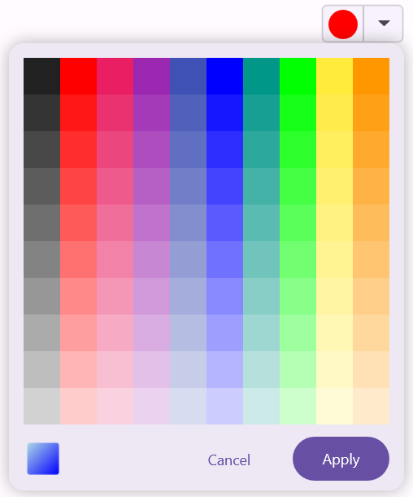
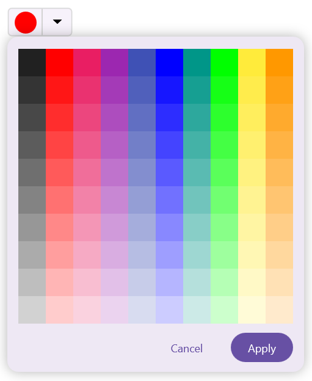

# Mode and Value in .NET MAUI Color Picker

The [SfColorPicker](https://help.syncfusion.com/cr/maui/Syncfusion.Maui.Inputs.SfColorPicker.html) control exposes its color editor in one of two visual modes — **Palette** or **Spectrum** — and lets you choose which mode the user sees first. You can also show or hide the mode switcher so that the user cannot change the mode at runtime.

## Color modes

The [`ColorPickerMode`](https://help.syncfusion.com/cr/maui/Syncfusion.Maui.Inputs.ColorPickerMode.html) enum defines the available modes:

| Mode | Description |
| --- | --- |
| [`Spectrum`](https://help.syncfusion.com/cr/maui/Syncfusion.Maui.Inputs.ColorPickerMode.html#Syncfusion_Maui_Inputs_ColorPickerMode_Spectrum) | A continuous color spectrum with hue and saturation sliders. The default mode. |
| [`Palette`](https://help.syncfusion.com/cr/maui/Syncfusion.Maui.Inputs.ColorPickerMode.html#Syncfusion_Maui_Inputs_ColorPickerMode_Palette) | A grid of predefined color swatches from which the user picks a color. |

## Configure the initial color mode

Set the [`ColorMode`](https://help.syncfusion.com/cr/maui/Syncfusion.Maui.Inputs.SfColorPicker.html#Syncfusion_Maui_Inputs_SfColorPicker_ColorMode) property to choose which mode the picker shows when it opens. The default is [`Spectrum`](https://help.syncfusion.com/cr/maui/Syncfusion.Maui.Inputs.ColorPickerMode.html#Syncfusion_Maui_Inputs_ColorPickerMode_Spectrum).

### Palette mode





<inputs:SfColorPicker ColorMode="Palette" />





SfColorPicker colorPicker = new SfColorPicker()
{
    ColorMode = ColorPickerMode.Palette
};

this.Content = colorPicker;





### Spectrum mode





<inputs:SfColorPicker ColorMode="Spectrum" />





SfColorPicker colorPicker = new SfColorPicker()
{
    ColorMode = ColorPickerMode.Spectrum
};

this.Content = colorPicker;





## Show or hide the color mode switcher

The mode switcher is the in-picker UI (typically a tab strip) that lets the user toggle between Palette and Spectrum at runtime. Set the [`IsColorModeSwitcherVisible`](https://help.syncfusion.com/cr/maui/Syncfusion.Maui.Inputs.SfColorPicker.html#Syncfusion_Maui_Inputs_SfColorPicker_IsColorModeSwitcherVisible) property to `false` to lock the picker to the mode set by `ColorMode`. The default is `true`.





<inputs:SfColorPicker ColorMode="Palette" IsColorModeSwitcherVisible="False" />





SfColorPicker colorPicker = new SfColorPicker()
{
    ColorMode = ColorPickerMode.Palette,
    IsColorModeSwitcherVisible = false
};

this.Content = colorPicker;





