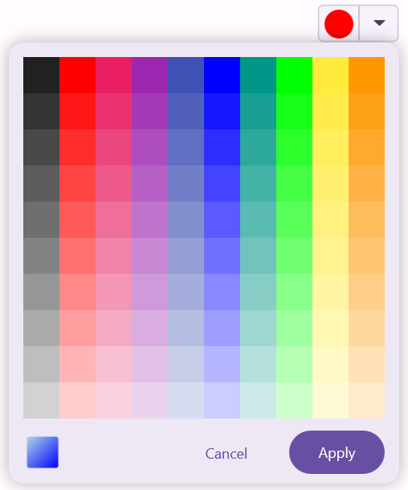
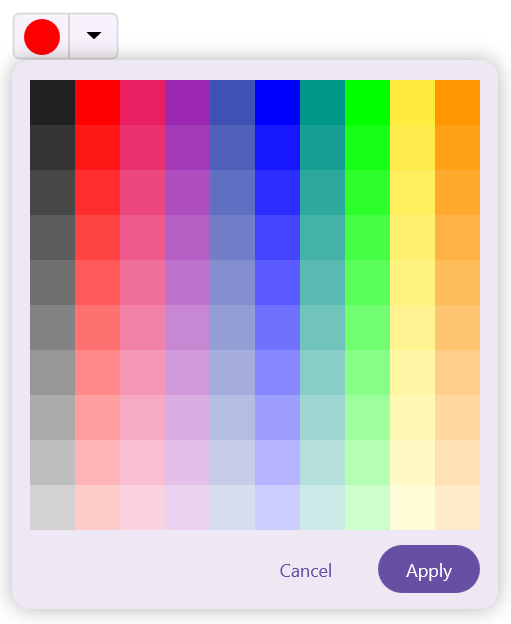

# Mode and Value Support in .NET MAUI Color Picker

The [.NET MAUI Color Picker](https://help.syncfusion.com/cr/maui/Syncfusion.Maui.Inputs.SfColorPicker.html) control exposes its color editor in one of two visual modes - **Palette** or **Spectrum** - and lets you choose which mode the user sees first. You can also show or hide the mode switcher so that the user cannot change the mode at runtime.

| Mode | Description |
| --- | --- |
| [Spectrum](https://help.syncfusion.com/cr/maui/Syncfusion.Maui.Inputs.ColorPickerMode.html#Syncfusion_Maui_Inputs_ColorPickerMode_Spectrum) | A continuous color spectrum with hue and saturation sliders. The default mode. |
| [Palette](https://help.syncfusion.com/cr/maui/Syncfusion.Maui.Inputs.ColorPickerMode.html#Syncfusion_Maui_Inputs_ColorPickerMode_Palette) | A grid of predefined color swatches from which the user picks a color. |

## Prerequisites

Before using the [SfColorPicker](https://help.syncfusion.com/cr/maui/Syncfusion.Maui.Inputs.SfColorPicker.html), ensure the following NuGet package is installed in your .NET MAUI project:

- `Syncfusion.Maui.Inputs`

For a step-by-step setup, refer to the [Getting Started](https://help.syncfusion.com/maui/colorpicker/getting-started) documentation.

## Rendering palette at initial load

To display the Color Picker in palette mode, Set the [ColorMode](https://help.syncfusion.com/cr/maui/Syncfusion.Maui.Inputs.SfColorPicker.html#Syncfusion_Maui_Inputs_SfColorPicker_ColorMode) property to `Palette`. By default, it is configured as `Spectrum`.





<inputs:SfColorPicker ColorMode="Palette" />





SfColorPicker colorPicker = new SfColorPicker()
{
    ColorMode = ColorPickerMode.Palette
};

this.Content = colorPicker;





## Show or hide the color mode switcher

The mode switcher is the in-picker UI (typically a tab strip) that lets the user toggle between `Palette` and `Spectrum` at runtime. Set the [IsColorModeSwitcherVisible](https://help.syncfusion.com/cr/maui/Syncfusion.Maui.Inputs.SfColorPicker.html#Syncfusion_Maui_Inputs_SfColorPicker_IsColorModeSwitcherVisible) property to `false` to lock the picker to the mode set by `ColorMode`. The default is `true`.





<inputs:SfColorPicker ColorMode="Palette" 
                      IsColorModeSwitcherVisible="False" />





SfColorPicker colorPicker = new SfColorPicker()
{
    ColorMode = ColorPickerMode.Palette,
    IsColorModeSwitcherVisible = false
};

this.Content = colorPicker;





* [Customization in .NET MAUI Color Picker](https://help.syncfusion.com/maui/colorpicker/customization)
* [Display View Customization](https://help.syncfusion.com/maui/colorpicker/display-view)
* [Inline Rendering](https://help.syncfusion.com/maui/colorpicker/inline-rendering)