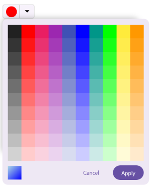

# Mode and Value in .NET MAUI Color Picker (SfColorPicker)

## Rendering palette at initial load

To display the Color Picker in palette mode, I set its [ColorMode](https://help.syncfusion.com/cr/maui/Syncfusion.Maui.Inputs.SfColorPicker.html#Syncfusion_Maui_Inputs_SfColorPicker_ColorMode) property to [Palette](https://help.syncfusion.com/cr/maui/Syncfusion.Maui.Inputs.ColorPickerMode.html#Syncfusion_Maui_Inputs_ColorPickerMode_Palette). By default, it is configured as [Spectrum](https://help.syncfusion.com/cr/maui/Syncfusion.Maui.Inputs.ColorPickerMode.html#Syncfusion_Maui_Inputs_ColorPickerMode_Spectrum).





<inputs:SfColorPicker ColorMode="Palette"/>          





SfColorPicker colorPicker = new SfColorPicker()
{
    ColorMode = ColorPickerMode.Palette
};





## Switch color mode visibility

Disable the mode switcher UI by setting the [IsColorModeSwitcherVisible](https://help.syncfusion.com/cr/maui/Syncfusion.Maui.Inputs.SfColorPicker.html#Syncfusion_Maui_Inputs_SfColorPicker_IsColorModeSwitcherVisible) property to `False`. By default, it is set to `True`, which allows users to switch between different color modes.





<inputs:SfColorPicker ColorMode="Palette" IsColorModeSwitcherVisible="False"/>





SfColorPicker colorPicker = new SfColorPicker()
{
    ColorMode = ColorPickerMode.Palette,
    IsColorModeSwitcherVisible = false
};
    




