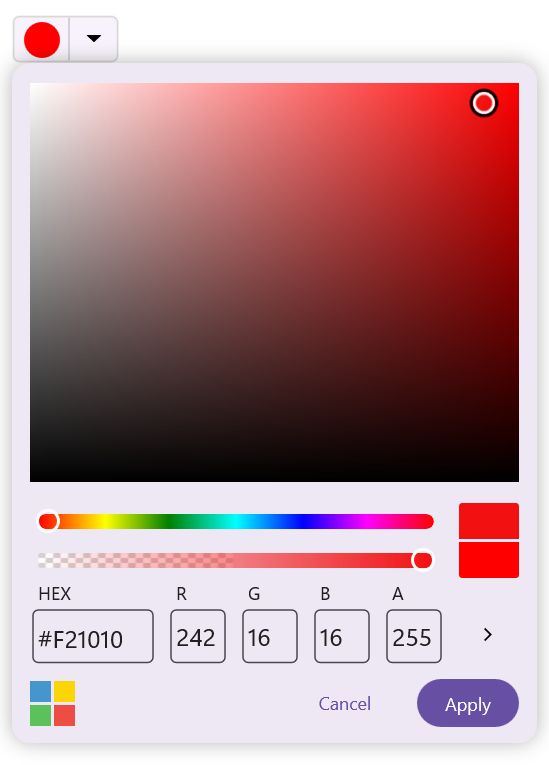

# .NET MAUI Color Picker (SfColorPicker) Overview

The [.NET MAUI Color Picker](https://www.syncfusion.com/maui-controls/maui-colorpicker) is a UI component that enables users to select a color from various color palettes or a spectrum. It is particularly useful in design, drawing, or customization scenarios within .NET MAUI applications.

   

## Business use cases

- Design and drawing applications that require accurate color selection and customization tools.  
- Theme configuration systems that allow users to personalize application appearance using color settings.  
- Data visualization tools that require color selection for charts, indicators, and UI elements.  
- Form-based applications that allow users to choose colors for preferences or customization settings.  

## Key features

- **Multiple color selection modes** allow switching between [Palette](https://help.syncfusion.com/cr/maui/Syncfusion.Maui.Inputs.ColorPickerMode.html#Syncfusion_Maui_Inputs_ColorPickerMode_Palette) and [Spectrum](https://help.syncfusion.com/cr/maui/Syncfusion.Maui.Inputs.ColorPickerMode.html#Syncfusion_Maui_Inputs_ColorPickerMode_Spectrum) modes based on user preference.  
- **Custom color support** allows adding or removing user-defined colors for flexibility in selection.  
- **Manual color input** allows entering color values using RGB, HSV, and HEX formats for precise control.  
- **Opacity control** allows adjusting the transparency level of the selected color.  
- **Recent colors panel** allows accessing previously selected colors for quick reuse.  
- **Theme adaptation support** allows aligning the control with application or system themes for consistent UI appearance.  
- **No color option** allows clearing the selected color using a dedicated option.  
- **Interaction control** allows enabling or disabling user interaction programmatically.  
- **Inline mode support** allows embedding the color picker directly within the UI layout without requiring a popup.  

## Globalization

The following table summarizes the globalization support available in this control.

 Full Support  
 Partial Support   
 Not Applicable

<table>
<tr>
<th align="center">Control</th>
<th align="center">Localization</th>
<th align="center">RTL</th>
<th align="center">Time zone</th>
<th align="center">Screen reader</th>
<th align="center">Keyboard navigation</th>
</tr>
<tr>
<td><a href="/maui/colorpicker/overview">Color Picker</a></td>
<td align="center"></td>
<td align="center"></td>
<td align="center"></td>
<td align="center"></td>
<td align="center"></td>
</tr>
</table>

## Related controls

- [Buttons](https://help.syncfusion.com/maui/button/overview) for applying selected colors to interactive UI elements.  
- [Chips](https://help.syncfusion.com/maui/chips/overview) for using selected colors in tags and category displays.  
- [ComboBox](https://help.syncfusion.com/maui/combobox/overview) for picking values from a dropdown list with flexible selection.  

## See Also

Explore further resources:

- [Getting Started](https://help.syncfusion.com/maui/colorpicker/getting-started) shows a step‑by‑step guide to begin using the Color Picker control.  
- [Modes](https://help.syncfusion.com/maui/colorpicker/mode) explains palette and spectrum selection modes.  
- [Customization](https://help.syncfusion.com/maui/colorpicker/customization) helps customize appearance and behavior of the control.  
- [UI Kit](https://www.syncfusion.com/demos/maui#maui-ui-control) provides interactive demos and ready‑made UI examples.

## Resources

<!-- Card 1 -->
<a href="https://www.syncfusion.com/maui-controls/maui-colorpicker" class="form-card" target="_blank">
  

    <h3 class="form-title">Feature Tour</h3>
    

      Walk through highlights and core capabilities.
    

  

</a>
<!-- Card 2 -->
<a href="https://www.syncfusion.com/tutorial-videos/maui/color-picker" class="form-card" target="_blank">
  

    <h3 class="form-title">Tutorial Videos</h3>
    

      Step‑by‑step guidance through video tutorials.
    

  

</a>
<!-- Card 3 -->
<a href="https://support.syncfusion.com/kb/cross-platforms/category/76" class="form-card" target="_blank">
  

    <h3 class="form-title">Explore KB's</h3>
    

      Find quick solutions and step‑by‑step guidance.
    

  

</a>
<!-- Card 4 -->
<a href="https://www.syncfusion.com/blogs/category/net-maui" class="form-card" target="_blank">
  

    <h3 class="form-title">Explore Blogs</h3>
    

      Read insights, tutorials, and developer journeys.
    

  

</a>
