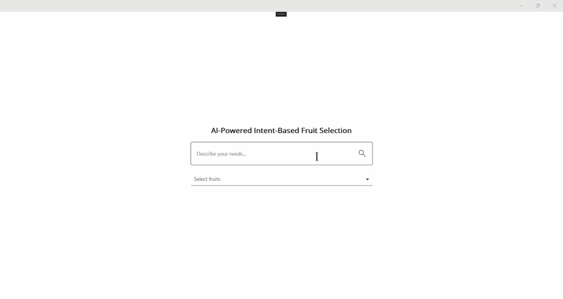

# AI-Powered Smart Selection in .NET MAUI MultiSelect ComboBox

This article walks you through the implementation of an intelligent, AI-driven selection experience in the Syncfusion [.NET MAUI ComboBox](https://help.syncfusion.com/cr/maui/Syncfusion.Maui.Inputs.SfComboBox.html) control. The user describes what they need in natural language, the AI interprets the intent, and the [MultiSelect ComboBox](https://help.syncfusion.com/cr/maui/Syncfusion.Maui.Inputs.SfComboBox.html#Syncfusion_Maui_Inputs_SfComboBox_SelectionMode) automatically selects the most relevant items. The example uses Azure OpenAI.

For example:

* **Choose healthy low-sugar fruits** selects fruits that match the healthy and low-sugar criteria.

**Expected Outcome:** Users describe what they need in natural language, and the MultiSelect ComboBox intelligently selects the most relevant items without manual searching.

**One-line Value:** AI understands the intent, and the MultiSelect ComboBox performs the selection.

## Prerequisites

Before you begin, ensure you have the following:

* A working .NET MAUI application with the `Syncfusion.Maui.Inputs` package installed.
* An active Azure subscription with access to [Azure OpenAI](https://learn.microsoft.com/en-us/azure/ai-foundry/openai/overview) and a deployed model. If you don't have access, refer to the [create and deploy Azure OpenAI service](https://learn.microsoft.com/en-us/azure/ai-foundry/openai/how-to/create-resource?pivots=web-portal) guide to set up a new account. Note down the deployment name, endpoint URL, and API key.
* The [Azure.AI.OpenAI](https://www.nuget.org/packages/Azure.AI.OpenAI) NuGet package (version 2.x recommended for the `IChatClient` API used in this sample). Install it by running the following command in the Visual Studio Package Manager Console:

    ```powershell
    Install-Package Azure.AI.OpenAI -Version 2.1.0
    ```
    Or using the .NET CLI:
    ```bash
    dotnet add package Azure.AI.OpenAI --version 2.1.0
    ```

## Integrating Azure OpenAI with your .NET MAUI App

First, ensure that you have access to [Azure OpenAI](https://learn.microsoft.com/en-us/azure/ai-foundry/openai/overview) and have created a deployment in the Azure portal.

If you do not have access, refer to the [Create and deploy an Azure OpenAI service](https://learn.microsoft.com/en-us/azure/ai-foundry/openai/how-to/create-resource?pivots=web-portal) guide to set up a new account.

Note down the deployment name, endpoint URL, and API key.

We will use the [Azure.AI.OpenAI](https://www.nuget.org/packages/Azure.AI.OpenAI) NuGet package from the [NuGet Gallery](https://www.nuget.org/). Before getting started, install the `Azure.AI.OpenAI` NuGet package in your .NET MAUI app.

In your service class (`ComboBoxAzureAIService`), initialize the `AzureOpenAIClient`. Replace the `Endpoint`, `DeploymentName`, and `Key` with actual values from your Azure OpenAI resource. This creates a chat client using your endpoint, API key, and deployment name. It is stored in the `Client` property for use in other methods.
 
In the `GetCompletion` method, we construct the prompt and send it to the Azure OpenAI service. The chat history is reset for each new prompt in this implementation to keep each selection request independent.




using System.Diagnostics;

namespace SmartAIComboBox.SmartAIComboBox
{
    public sealed class ComboBoxAzureAIService
    {
        private const string BaseEndpoint =
            "YOUR_END_POINT_NAME";

        private const string DeploymentName = "DEPLOYMENT_NAMEi";

        private const string ApiKey =
            "API_KEY";

        private static readonly HttpClient Http = new()
        {
            Timeout = TimeSpan.FromSeconds(30)
        };

        public string? LastError { get; private set; }

        public string LastRawResponse { get; private set; } = string.Empty;

        /// <summary>
        /// Single entry point — sends the AI the prompt the ViewModel built
        /// (menu + intent rules + user query) and returns the raw fruit list text.
        /// </summary>
        public async Task<string> GetCompletion(
            string prompt,
            CancellationToken cancellationToken = default)
        {
            LastError = null;
            LastRawResponse = string.Empty;

            try
            {
                var requestBody = new
                {
                    model = DeploymentName,
                    messages = new object[]
                    {
                        new
                        {
                            role = "system",
                            content =
                                "You are an AI fruit-selection assistant for a MultiSelect fruit menu. " +
                                "Choose fruits from the provided menu that match the user's natural-language request. " +
                                "Return ONLY the exact fruit Names from the menu, one per line. " +
                                "Do NOT include tags, numbers, dashes, bullets, explanations, or any preamble. " +
                                "If no fruit matches, return exactly the word: Empty"
                        },
                        new
                        {
                            role = "user",
                            content = prompt
                        }
                    },
                    max_completion_tokens = 800,
                    reasoning_effort = "minimal"
                };

                var url = $"{BaseEndpoint}/chat/completions";

                using var request = new HttpRequestMessage(
                    HttpMethod.Post,
                    url);

                request.Headers.Add("api-key", ApiKey);

                request.Content = new StringContent(
                    JsonSerializer.Serialize(requestBody),
                    Encoding.UTF8,
                    "application/json");

                var response = await Http.SendAsync(
                    request,
                    cancellationToken);

                var raw = await response.Content.ReadAsStringAsync(
                    cancellationToken);

                LastRawResponse = raw;

                Debug.WriteLine($"[AzureAI] Status: {(int)response.StatusCode}");
                Debug.WriteLine($"[AzureAI] Raw Response: {raw}");

                if (!response.IsSuccessStatusCode)
                {
                    LastError = $"HTTP {(int)response.StatusCode}\n\n{raw}";
                    return LastError;
                }

                using var document = JsonDocument.Parse(raw);

                if (!document.RootElement.TryGetProperty("choices", out var choices))
                {
                    LastError = $"No 'choices' property found.\n\nRaw Response:\n{raw}";
                    return LastError;
                }

                var content = choices[0]
                    .GetProperty("message")
                    .GetProperty("content")
                    .GetString();

                if (string.IsNullOrWhiteSpace(content))
                {
                    LastError = $"Azure returned empty content.\n\nRaw Response:\n{raw}";
                    return LastError;
                }

                return content.Trim();
            }
            catch (Exception ex)
            {
                LastError = $"Exception:\n{ex}";
                Debug.WriteLine($"[AzureAI] Exception: {ex}");
                return LastError;
            }
        }
    }
}




## Implementing AI-based smart selection in .NET MAUI MultiSelect ComboBox

The [.NET MAUI ComboBox](https://help.syncfusion.com/cr/maui/Syncfusion.Maui.Inputs.SfComboBox.html) supports a `Multiple` [SelectionMode](https://help.syncfusion.com/cr/maui/Syncfusion.Maui.Inputs.SfComboBox.html#Syncfusion_Maui_Inputs_SfComboBox_SelectionMode) that lets the user choose more than one item. Combined with a natural-language request entry, AI can read the menu, interpret the user's intent (price range, category, dietary preference, meal type, etc.), and auto-populate the [SelectedItems](https://help.syncfusion.com/cr/maui/Syncfusion.Maui.Inputs.SfComboBox.html#Syncfusion_Maui_Inputs_SfComboBox_SelectedItems) collection of the ComboBox.

**Step 1:** Create a business model that represents each food item with its name, price, category, and diet so the AI can reason about the user's request.




namespace SmartAIComboBox.SmartAIComboBox
{
    /// <summary>
    /// Represents a single food item in the menu.
    /// </summary>
    public class FoodModel : INotifyPropertyChanged
    {
        public string? Name { get; set; }
        public double Price { get; set; }
        public string? Category { get; set; }
        public string? Diet { get; set; }

        private bool _isSelected;
        public bool IsSelected
        {
            get => _isSelected;
            set
            {
                if (_isSelected == value) return;
                _isSelected = value;
                PropertyChanged?.Invoke(this, new PropertyChangedEventArgs(nameof(IsSelected)));
            }
        }

        public override string ToString() => Name ?? string.Empty;
        public event PropertyChangedEventHandler? PropertyChanged;
    }
}




**Step 2:** Build the ViewModel that owns the menu, exposes a `UserQuery` for the natural-language request, maintains the `SelectedItems` collection, and provides an `AskAICommand` that the page invokes when the user submits the query.




using System.Collections.ObjectModel;
using System.ComponentModel;
using System.Diagnostics;
using System.Windows.Input;

namespace SmartAIComboBox.SmartAIComboBox
{
    public class FoodViewModel : INotifyPropertyChanged
    {
        private readonly ComboBoxAzureAIService _aiService;

        private ObservableCollection<FoodModel> _foods;
        private ObservableCollection<FoodModel> _selectedItems;
        private string? _userQuery;
        private bool _isBusy;
        private bool _hasSearched;

        public ObservableCollection<FoodModel> Foods
        {
            get => _foods;
            set { _foods = value; OnPropertyChanged(nameof(Foods)); }
        }

        public ObservableCollection<FoodModel> SelectedItems
        {
            get => _selectedItems;
            set { _selectedItems = value; OnPropertyChanged(nameof(SelectedItems)); }
        }

        public string? UserQuery
        {
            get => _userQuery;
            set { _userQuery = value; OnPropertyChanged(nameof(UserQuery)); }
        }

        public bool IsBusy
        {
            get => _isBusy;
            set
            {
                if (_isBusy == value) return;
                _isBusy = value;
                OnPropertyChanged(nameof(IsBusy));
                UpdateState();
            }
        }

        public bool HasSearched
        {
            get => _hasSearched;
            set
            {
                if (_hasSearched == value) return;
                _hasSearched = value;
                OnPropertyChanged(nameof(HasSearched));
                UpdateState();
            }
        }

        public bool IsIdle { get; private set; } = true;
        public bool CanClear { get; private set; }
        public string ComboHint { get; private set; } = "Select fruits";

        public ICommand AskAICommand { get; }
        public ICommand ClearCommand { get; }

        public event EventHandler<IEnumerable<string>>? AISelectionReceived;

        public FoodViewModel()
        {
            _aiService = new ComboBoxAzureAIService();
            _foods = new ObservableCollection<FoodModel>(BuildFoodList());
            _selectedItems = new ObservableCollection<FoodModel>();
            AskAICommand = new Command(async () => await AskAIAsync());
            ClearCommand = new Command(Clear);
            UpdateState();
        }

        private void UpdateState()
        {
            IsIdle = !IsBusy && !HasSearched;
            CanClear = HasSearched && !IsBusy;
            ComboHint = IsBusy ? "Loading..." : "Select fruits";

            OnPropertyChanged(nameof(IsIdle));
            OnPropertyChanged(nameof(CanClear));
            OnPropertyChanged(nameof(ComboHint));
        }

        public void Clear()
        {
            UserQuery = null;
            foreach (var f in Foods) f.IsSelected = false;
            SelectedItems.Clear();
            HasSearched = false;
        }

        /// <summary>
        /// 50 fruits. Each carries a rich nutrition/health tag string so the AI
        /// can map ANY natural-language request (including "healthy fruit",
        /// "fruits for immunity", "fruits for glowing skin", etc.) to real fruits.
        /// </summary>
        private static List<FoodModel> BuildFoodList()
        {
            var fruits = new[]
            {
                ("Apple",                120, "Fiber Kids Sweet Healthy Heart Immunity Digestive Skin"),
                ("Banana",                60, "Smoothie Kids Sweet Energy Fiber Healthy Heart Potassium Bone Digestive"),
                ("Mango",                150, "Smoothie Kids Sweet Tropical Healthy Immunity Skin Eye"),
                ("Orange",                80, "VitaminC Water Citrus Kids Healthy Immunity Heart Skin"),
                ("Pomegranate",          200, "Fiber Antioxidant VitaminC Healthy Heart Immunity Skin Iron"),
                ("Papaya",               100, "Water Digestive Tropical Smoothie Healthy Immunity Skin Eye Heart"),
                ("Pineapple",            120, "VitaminC Water Tropical Smoothie Healthy Immunity Digestive"),
                ("Watermelon",            60, "Water Kids Sweet Tropical Healthy Hydrating LowCalorie Heart"),
                ("Muskmelon",             80, "Water Sweet Kids Healthy Hydrating Immunity VitaminC"),
                ("Strawberry",           250, "VitaminC Berry Smoothie Antioxidant Healthy Skin Immunity Heart"),
                ("Blueberry",            400, "Berry Antioxidant Fiber VitaminC Healthy Brain Skin Heart Immunity"),
                ("Raspberry",            350, "Berry Antioxidant Fiber VitaminC Healthy Skin Heart WeightLoss"),
                ("Blackberry",           300, "Berry Antioxidant Fiber Healthy Skin Immunity Brain"),
                ("Grapes",               120, "Kids Sweet Water Healthy Heart Immunity Antioxidant"),
                ("Guava",                 80, "VitaminC Fiber Kids Sweet Healthy Immunity WeightLoss Eye Skin"),
                ("Kiwi",                 250, "VitaminC Fiber Citrus Antioxidant Healthy Immunity Skin Heart Digestive"),
                ("Pear",                 150, "Fiber Sweet Kids Healthy Digestive Heart WeightLoss"),
                ("Peach",                200, "Sweet Fiber Kids Healthy Skin Immunity LowCalorie"),
                ("Plum",                 180, "Sweet Fiber Kids Antioxidant Healthy Digestive Immunity"),
                ("Cherry",               300, "Antioxidant Sweet Kids Healthy Heart Immunity Sleep Brain"),
                ("Lemon",                100, "VitaminC Citrus LowSugar Healthy Immunity Detox Digestive"),
                ("Lime",                 100, "VitaminC Citrus LowSugar Healthy Immunity Detox Digestive"),
                ("Cranberry",            350, "Antioxidant Berry VitaminC Healthy Immunity Digestive Heart"),
                ("Apricot",              250, "Fiber Sweet Antioxidant Healthy Eye Skin Heart Iron"),
                ("Fig",                  300, "Fiber Sweet Antioxidant Digestive Healthy Bone Iron"),
                ("Dates",                200, "Energy Fiber Sweet Kids Healthy Iron Bone Heart"),
                ("Dragon Fruit",         250, "Fiber Antioxidant Water Tropical Healthy Immunity Heart Digestive Skin"),
                ("Passion Fruit",        300, "VitaminC Fiber Citrus Tropical Healthy Immunity Heart Sleep"),
                ("Avocado",              200, "Fiber HealthyFat LowSugar Healthy Heart Brain Skin Eye Potassium"),
                ("Coconut",              100, "Energy Water Tropical Healthy Heart Immunity Skin Hydrating"),
                ("Sweet Lime (Mosambi)",  120, "VitaminC Water Citrus Healthy Immunity Detox Digestive"),
                ("Lychee",               200, "VitaminC Sweet Tropical Kids Healthy Immunity Heart Antioxidant"),
                ("Jamun (Black Plum)",   150, "Antioxidant LowSugar Fiber Healthy Diabetic WeightLoss Immunity"),
                ("Custard Apple (Sitaphal)", 200, "Sweet Kids Energy Fiber Healthy Bone Eye Immunity Heart"),
                ("Jackfruit",            150, "Energy Fiber Tropical Sweet Healthy Immunity Heart Iron"),
                ("Sapodilla (Chikoo)",    120, "Energy Sweet Kids Fiber Healthy Bone Eye Immunity"),
                ("Star Fruit",           200, "VitaminC Water LowSugar Tropical Healthy WeightLoss Heart Immunity"),
                ("Mulberry",             250, "Antioxidant Berry Fiber Healthy Iron Immunity Heart Skin"),
                ("Amla (Indian Gooseberry)", 80, "VitaminC Antioxidant LowSugar Fiber Healthy Immunity Skin Hair Detox Diabetic"),
                ("Banana (Ripe) (Smoothie)", 60, "Smoothie Kids Energy Sweet Healthy Heart Potassium Bone"),
                ("Mango (Ripe) (Smoothie)", 150, "Smoothie Sweet Tropical Kids Healthy Immunity Skin Eye"),
                ("Papaya (Smoothie)",    100, "Smoothie Water Digestive Tropical Healthy Skin Eye Immunity"),
                ("Pineapple (Smoothie)", 120, "Smoothie VitaminC Water Tropical Healthy Immunity Digestive"),
                ("Strawberry (Smoothie)", 250, "Smoothie VitaminC Berry Antioxidant Healthy Skin Heart Immunity"),
                ("Orange (Smoothie)",     80, "Smoothie VitaminC Water Citrus Healthy Immunity Heart Skin"),
                ("Pear (Ripe)",          150, "Fiber Sweet Kids Healthy Digestive Heart WeightLoss"),
                ("Cantaloupe",           100, "Water Sweet Kids VitaminC Healthy Hydrating Immunity Eye Skin"),
                ("Honeydew Melon",       120, "Water Sweet Kids Healthy Hydrating Immunity LowCalorie"),
                ("Tangerine",            150, "VitaminC Citrus Water Sweet Healthy Immunity Skin Heart"),
                ("Nectarine",            200, "Fiber Sweet Kids Antioxidant Healthy Skin Heart Immunity"),
            };

            var list = new List<FoodModel>();
            foreach (var (name, price, tags) in fruits)
            {
                list.Add(new FoodModel
                {
                    Name = name.Trim(),
                    Price = price,
                    Category = "Fruit",
                    Diet = tags,
                    IsSelected = false
                });
            }
            return list;
        }

        private CancellationTokenSource? _cts;

        private async Task AskAIAsync() => await AskAIAsync(UserQuery);

        /// <summary>
        /// Mirrors SmartAIDatePicker.MainPage.ResolveDateRequestAsync.
        /// Sets IsBusy (toggles loading indicator), calls AI, parses, raises event.
        /// </summary>
        public async Task AskAIAsync(string? query)
        {
            if (string.IsNullOrWhiteSpace(query) || IsBusy) return;

            if (!string.Equals(UserQuery, query, StringComparison.Ordinal))
                UserQuery = query;

            // Equivalent to: SearchButton.IsVisible = false; LoadingIndicator.IsVisible = true;
            IsBusy = true;
            _cts?.Cancel();
            _cts = new CancellationTokenSource();
            var token = _cts.Token;

            try
            {
                string menu = string.Join("\n",
                    Foods.Select(f => $"{f.Name} | {f.Diet}"));

                string prompt =
                    "From the menu below, choose the fruits that best match the user's natural-language request.\n\n" +
                    "Rules:\n" +
                    "- Return ONLY the exact fruit Names from the menu, one per line.\n" +
                    "- Do NOT include tags, numbers, dashes, bullets, explanations, or any other text.\n" +
                    "- Do NOT include headings like 'Here are the items'.\n" +
                    "- The tags after each fruit describe its nutrition/health profile. Use BOTH the tags AND your general knowledge of fruits to interpret ANY natural-language request — including vague ones like 'healthy fruit', 'fruits good for health', 'nutritious fruits', 'fruits for weight loss', 'fruits for glowing skin', 'fruits for immunity', 'fruits for energy', 'fruits to eat during fever', etc.\n" +
                    "- Tag meanings:\n" +
                    "    Healthy, Immunity, Heart, Skin, Eye, Brain, Bone, Hair, Sleep, Detox, Digestive, Diabetic, WeightLoss, LowCalorie, Hydrating, Iron, Potassium, Energy, Fiber, VitaminC, Antioxidant, Water, Smoothie, Kids, Sweet, Citrus, Tropical, Berry, LowSugar, HealthyFat\n" +
                    "- Intent examples (NOT exhaustive — generalize to similar requests):\n" +
                    "    'healthy fruits' / 'fruits good for health' → fruits tagged Healthy\n" +
                    "    'water-rich fruits' / 'hydrating fruits'   → fruits tagged Water or Hydrating\n" +
                    "    'vitamin c rich fruits'                     → fruits tagged VitaminC\n" +
                    "    'high-fiber fruits'                         → fruits tagged Fiber\n" +
                    "    'fruits for smoothies'                       → fruits tagged Smoothie\n" +
                    "    'kid-friendly fruits'                        → fruits tagged Kids\n" +
                    "    'citrus fruits'                              → fruits tagged Citrus\n" +
                    "    'tropical fruits'                            → fruits tagged Tropical\n" +
                    "    'berry fruits'                               → fruits tagged Berry\n" +
                    "    'low sugar fruits' / 'diabetic fruits'       → fruits tagged LowSugar or Diabetic\n" +
                    "    'sweet fruits'                               → fruits tagged Sweet\n" +
                    "    'antioxidant rich fruits'                    → fruits tagged Antioxidant\n" +
                    "    'energy giving fruits'                       → fruits tagged Energy\n" +
                    "    'fruits for digestion'                       → fruits tagged Digestive\n" +
                    "    'fruits for immunity'                       → fruits tagged Immunity or VitaminC\n" +
                    "    'fruits for glowing skin'                   → fruits tagged Skin or VitaminC\n" +
                    "    'fruits for heart health'                  → fruits tagged Heart\n" +
                    "    'fruits for eyes / vision'                  → fruits tagged Eye\n" +
                    "    'fruits for weight loss'                    → fruits tagged WeightLoss or LowCalorie or Fiber\n" +
                    "    'fruits rich in iron'                       → fruits tagged Iron\n" +
                    "    'fruits rich in potassium'                  → fruits tagged Potassium\n" +
                    "    'fruits for brain / memory'                → fruits tagged Brain\n" +
                    "    'fruits for bones'                          → fruits tagged Bone\n" +
                    "    'fruits to eat at night' / 'fruits for sleep' → fruits tagged Sleep\n" +
                    "- NEVER return 'Empty' for a reasonable natural-language request about fruits. Always pick the closest matching fruits from the menu.\n" +
                    "- If multiple constraints are given, return fruits satisfying ALL of them.\n" +
                    "- Return at most 10 fruits.\n" +
                    "- If ABSOLUTELY no fruit matches (e.g. user asks for a non-fruit), return exactly: Empty\n\n" +
                    "Menu (Name | Tags):\n" + menu + "\n\n" +
                    "User request: " + UserQuery + "\n\n" +
                    "Matching fruits (one per line, exact names from the menu):";

                // Direct AI call — NO WaitForValidationAsync here (matches DatePicker pattern).
                string completion = await _aiService.GetCompletion(prompt, token);
                token.ThrowIfCancellationRequested();

                // The service returns an error string on failure (never throws).
                // Detect it the way the DatePicker's GetDateFromAIAsync does.
                if (string.IsNullOrWhiteSpace(completion) ||
                    completion.StartsWith("HTTP ", StringComparison.OrdinalIgnoreCase) ||
                    completion.StartsWith("Exception:", StringComparison.OrdinalIgnoreCase) ||
                    completion.StartsWith("No 'choices'", StringComparison.OrdinalIgnoreCase) ||
                    completion.StartsWith("Azure returned empty", StringComparison.OrdinalIgnoreCase))
                {
                    string err = !string.IsNullOrWhiteSpace(completion)
                        ? completion
                        : (_aiService.LastError ?? "AI returned an empty response.");
                    Debug.WriteLine($"AI selection failed: {err}");
                    MainThread.BeginInvokeOnMainThread(() =>
                        Application.Current?.Windows?[0]?.Page?.DisplayAlert(
                            "Error", $"AI request failed:\n{err}", "OK"));
                    return;
                }

                // Parse — tolerant to bullets/dashes/headers. NO Take(3).
                var matches = completion
                    .Split('\n', '\r', StringSplitOptions.RemoveEmptyEntries)
                    .Select(s => s.Trim())
                    .Where(s => !string.IsNullOrWhiteSpace(s) &&
                                !s.Equals("Empty", StringComparison.OrdinalIgnoreCase) &&
                                !s.StartsWith("Here are", StringComparison.OrdinalIgnoreCase))
                    .Select(s => s.Trim('•', '-', '*', '.', ')'))
                    .Select(s => s.Trim())
                    .Where(s => !string.IsNullOrWhiteSpace(s))
                    .Distinct(StringComparer.OrdinalIgnoreCase)
                    .Take(10)
                    .ToList();

                AISelectionReceived?.Invoke(this, matches);
            }
            catch (OperationCanceledException) { /* ignored */ }
            catch (Exception ex)
            {
                Debug.WriteLine($"AI selection failed: {ex.Message}");
                MainThread.BeginInvokeOnMainThread(() =>
                    Application.Current?.Windows?[0]?.Page?.DisplayAlert(
                        "Error", $"AI request failed: {ex.Message}", "OK")); 
            }
            finally
            {
                // Equivalent to: LoadingIndicator.IsVisible = false; SearchButton.IsVisible = true;
                IsBusy = false;
                HasSearched = true;
            }
        }

        public event PropertyChangedEventHandler? PropertyChanged;
        private void OnPropertyChanged(string propertyName) =>
            PropertyChanged?.Invoke(this, new PropertyChangedEventArgs(propertyName));
    }
}




**Step 3:** Define a value converter that inverts a bool so the Entry and Button can be disabled while a request is in flight.




using System.Globalization;

namespace SmartAIComboBox.SmartAIComboBox
{
    /// <summary>
    /// Inverts a bool value. Used to disable the Entry and Button
    /// while an AI request is in flight (IsBusy == true).
    /// </summary>
    public class InverseBoolConverter : IValueConverter
{
    public object Convert(object? value, Type targetType, object? parameter, CultureInfo culture)
        => value is bool b ? !b : false;

    public object ConvertBack(object? value, Type targetType, object? parameter, CultureInfo culture)
        => value is bool b ? !b : false;
}
}




**Step 4:** Build the page that hosts the AI request entry and the MultiSelect ComboBox, and apply the AI's matched names to the ComboBox's [SelectedItems](https://help.syncfusion.com/cr/maui/Syncfusion.Maui.Inputs.SfComboBox.html#Syncfusion_Maui_Inputs_SfComboBox_SelectedItems) collection.




<?xml version="1.0" encoding="utf-8" ?>
<ContentPage xmlns="http://schemas.microsoft.com/dotnet/2021/maui"
             xmlns:x="http://schemas.microsoft.com/winfx/2009/xaml"
             x:Class="SmartAIComboBox.SmartAIComboBox.SmartAIComboBoxPage"
             xmlns:syncfusion="clr-namespace:Syncfusion.Maui.Core;assembly=Syncfusion.Maui.Core"
             xmlns:editors="clr-namespace:Syncfusion.Maui.Inputs;assembly=Syncfusion.Maui.Inputs"
             xmlns:local="clr-namespace:SmartAIComboBox.SmartAIComboBox"
             Title="AI MultiSelect ComboBox">

    <ContentPage.BindingContext>
        <local:FoodViewModel/>
    </ContentPage.BindingContext>

    <ContentPage.Resources>
        <local:InverseBoolConverter x:Key="InverseBoolConverter"/> 
    </ContentPage.Resources>

    <ScrollView>
        <VerticalStackLayout  
                             Margin="20"
                             WidthRequest="560"
                             HorizontalOptions="Center"
                             VerticalOptions="Center">

            <!-- ===== Element 1: Title ===== -->
            <Label Text="AI-Powered Intent-Based Fruit Selection"
                   FontSize="20" Margin="0,0,0,12"
                   FontAttributes="Bold"
                   TextColor="{AppThemeBinding Light='#1C1B1F', Dark='#E6E1E5'}"
                   HorizontalOptions="Center"/>

            <!-- ===== Element 2: Query input with trailing search/loading/clear slot ===== -->
            <syncfusion:SfTextInputLayout x:Name="queryInputLayout"
                                          WidthRequest="500" HeightRequest="90"
                                          HorizontalOptions="Center"
                                          Hint="Describe your needs..."
                                          ContainerType="Outlined"
                                          ContainerBackground="Transparent"
                                          
                                          ShowHint="True">
                <syncfusion:SfTextInputLayout.HintLabelStyle>
                    <syncfusion:LabelStyle TextColor="#808080" FontSize="14"/>
                </syncfusion:SfTextInputLayout.HintLabelStyle>
                <syncfusion:SfTextInputLayout.TrailingView>
                    <!-- Three overlapping children; only one is visible at a time (bound to VM state) -->
                    <Grid WidthRequest="36" HeightRequest="36"
                          VerticalOptions="Center" HorizontalOptions="Center">

                        <!-- Search magnifier icon (vector Path, no emoji) -->
                        <Grid WidthRequest="24" HeightRequest="26"
                              IsVisible="{Binding IsIdle}"
                              VerticalOptions="Center" HorizontalOptions="Center"
                              Margin="0,10,4,0"
                              InputTransparent="False">
                            <Path Data="M11.170988,2.0000026C6.1139962,2.0000026 1.9999944,6.1120075 1.9999944,11.16603 1.9999944,16.219991 6.1139962,20.331996 11.170988,20.331996 16.227981,20.331996 20.341006,16.219991 20.341006,11.16603 20.341006,6.1120075 16.227981,2.0000026 11.170988,2.0000026z M11.170988,0C17.33003,0 22.341001,5.0089787 22.341001,11.16603 22.341001,13.76351 21.449155,16.156669 19.95551,18.055608L19.942527,18.071714 31.999898,30.615001 30.5589,32.001003 18.567029,19.525854 18.476871,19.605846C16.516895,21.303544 13.961804,22.332 11.170988,22.332 5.0119487,22.332 1.6168633E-07,17.32302 0,11.16603 1.6168633E-07,5.0089787 5.0119487,0 11.170988,0z" Background="Transparent"    Fill="Black"   Margin="0,0,0,0" >
                                <Path.RenderTransform>
                                    <TransformGroup>
                                        <TransformGroup.Children>
                                            <RotateTransform Angle="0" />
                                            <ScaleTransform ScaleX="0.6" ScaleY="0.6" />
                                        </TransformGroup.Children>
                                    </TransformGroup>
                                </Path.RenderTransform>
                            </Path>
                            <Grid.GestureRecognizers>
                                <TapGestureRecognizer Tapped="OnSearchClicked"/>
                            </Grid.GestureRecognizers>
                        </Grid>

                        <!-- Loading indicator while the AI request is in flight -->
                        <ActivityIndicator WidthRequest="24"
                                          HeightRequest="24"
                                          VerticalOptions="Center"
                                          HorizontalOptions="Center"
                                          Color="#6750A4"
                                          IsRunning="{Binding IsBusy}"
                                          IsVisible="{Binding IsBusy}"/>

                        <!-- Clear (X) icon (vector Path, no emoji) -->
                        <Grid WidthRequest="26" HeightRequest="26"
                              IsVisible="{Binding CanClear}"
                              VerticalOptions="Center" HorizontalOptions="Center"
                              Margin="0,10,0,0"
                              InputTransparent="False">

                            <Path Data="M29.916016,0L31.999023,2.0700073 17.988037,16 32,29.930054 29.91803,32 15.905029,18.070007 2.0820313,31.812012 0,29.742004 13.822998,16 0.0010375977,2.2590332 2.0840454,0.18902588 15.905029,13.929016z" Background="Transparent"    Fill="Black"     Margin="0,0,0,0"  >
                                <Path.RenderTransform>
                                    <TransformGroup>
                                        <TransformGroup.Children>
                                            <RotateTransform Angle="0" />
                                            <ScaleTransform ScaleX="0.4" ScaleY="0.4" />
                                        </TransformGroup.Children>
                                    </TransformGroup>
                                </Path.RenderTransform>
                            </Path>
                            <Grid.GestureRecognizers>
                                <TapGestureRecognizer Tapped="OnClearClicked"/>
                            </Grid.GestureRecognizers>
                        </Grid>
                    </Grid>
                </syncfusion:SfTextInputLayout.TrailingView>

                <Entry x:Name="queryEntry"
                       Text="{Binding UserQuery, Mode=TwoWay}"
                       ReturnType="Search" 
                       PlaceholderColor="#AAAAAA"
                       Completed="OnQueryCompleted"
                       TextChanged="OnQueryTextChanged"/>
            </syncfusion:SfTextInputLayout>

            <!-- ===== Element 3: Combo box (with checkbox ItemTemplate) ===== -->
            <!--<syncfusion:SfTextInputLayout Hint="{Binding ComboHint}"
                                          WidthRequest="500" HeightRequest="90"
                                          HorizontalOptions="Center"  
                                          ContainerType="Outlined"  
                                          ContainerBackground="Transparent" 
                                          ShowHint="True">
                <syncfusion:SfTextInputLayout.HintLabelStyle>
                    <syncfusion:LabelStyle TextColor="#808080" FontSize="14"/>
                </syncfusion:SfTextInputLayout.HintLabelStyle>-->

            <editors:SfComboBox x:Name="comboBox" WidthRequest="500"
                                    SelectionMode="Multiple"
                                    IsEditable="False" 
                                    IsFilteringEnabled="False"
                                    MaxDropDownHeight="250"
                                    DropDownPlacement="Bottom"  
                                    DisplayMemberPath="Name" Placeholder="{Binding ComboHint}"
                                    TextMemberPath="Name"
                                    MultiSelectionDisplayMode="Token"
                                    TokensWrapMode="Wrap" DropDownBackground="White" 
                                    ItemsSource="{Binding Foods}" EnableAutoSize="True"
                                    SelectedItems="{Binding SelectedItems, Mode=TwoWay}">

                    <!-- Each dropdown row = name + price + CheckBox. Unchanged. -->
                    <editors:SfComboBox.ItemTemplate>
                        <DataTemplate x:DataType="local:FoodModel">
                            <Grid ColumnDefinitions="0.9*,0.1*"
                                  ColumnSpacing="8"  
                                  HeightRequest="48"
                                  Padding="10,0">
                                <HorizontalStackLayout Grid.Column="0"
                                                       VerticalOptions="Center"
                                                       Spacing="6">
                                    <Label Text="{Binding Name}"
                                           FontSize="14"
                                           VerticalOptions="Center"/> 
                                </HorizontalStackLayout>
                                <CheckBox Grid.Column="1"
                                          IsChecked="{Binding IsSelected, Mode=TwoWay}"
                                          CheckedChanged="OnDropDownItemCheckBoxChanged"
                                          VerticalOptions="Center"/>
                            </Grid>
                        </DataTemplate>
                    </editors:SfComboBox.ItemTemplate>
                </editors:SfComboBox>
            <!--</syncfusion:SfTextInputLayout>-->
        </VerticalStackLayout>
    </ScrollView>
</ContentPage>







namespace SmartAIComboBox.SmartAIComboBox;

public partial class SmartAIComboBoxPage : ContentPage
{
    public SmartAIComboBoxPage()
    {
        InitializeComponent();
    }

    protected override void OnBindingContextChanged()
    {
        base.OnBindingContextChanged();
        if (BindingContext is FoodViewModel vm)
        {
            vm.AISelectionReceived -= OnAISelectionReceived;
            vm.AISelectionReceived += OnAISelectionReceived;
        }
    }

    /// <summary>Hides the query-hint once the user starts typing (Entry has TextChanged).</summary>
    private void OnQueryTextChanged(object? sender, TextChangedEventArgs e)
    {
        var text = e.NewTextValue ?? string.Empty;
        queryInputLayout.ShowHint = string.IsNullOrEmpty(text);
    }

    /// <summary>Enter key while editing the query Entry → fire search.</summary>
    private void OnQueryCompleted(object? sender, EventArgs e) => RunAISearch();

    /// <summary>Search 🔍 button tapped → fire search.</summary>
    private void OnSearchClicked(object? sender, EventArgs e) => RunAISearch();

    /// <summary>Clear ✕ button tapped → reset input + combo selections.</summary>
    private void OnClearClicked(object? sender, EventArgs e)
    {
        if (BindingContext is not FoodViewModel vm)
            return;

        vm.Clear(); // clears UserQuery, unchecks all, empties SelectedItems, HasSearched=false

        queryInputLayout.ShowHint = true;
        queryEntry.Text = string.Empty;
        comboBox.IsDropDownOpen = false;
    }

    private void RunAISearch()
    {
        if (BindingContext is not FoodViewModel vm || vm.IsBusy)
            return;

        string query = queryEntry.Text ?? string.Empty;
        if (string.IsNullOrWhiteSpace(query)) return;

        _ = vm.AskAIAsync(query);
    }

    private void OnAISelectionReceived(object? sender, IEnumerable<string> matchedNames)
    {
        if (BindingContext is not FoodViewModel vm)
            return;

        var nameSet = matchedNames
            .Select(n => n.Trim())
            .Where(n => !string.IsNullOrWhiteSpace(n))
            .ToHashSet(StringComparer.OrdinalIgnoreCase);

        var toSelect = vm.Foods
            .Where(f => f.Name != null && nameSet.Contains(f.Name))
            .ToList();

        MainThread.BeginInvokeOnMainThread(() =>
        {
            // Reset every checkbox first so a previous run doesn't carry over.
            foreach (var f in vm.Foods) f.IsSelected = false;
            vm.SelectedItems.Clear();

            // Check + add only the AI matches.
            foreach (var item in toSelect)
            {
                item.IsSelected = true;
                vm.SelectedItems.Add(item);
            }

            // Open the dropdown so the (checkbox) ItemTemplate is visible.
            comboBox.IsDropDownOpen = true;
        });
    }

    /// <summary>
    /// Fires when the user manually toggles a CheckBox rendered inside a dropdown row.
    /// Keeps <see cref="SfComboBox.SelectedItems"/> in sync with the checkbox state so
    /// the token display updates in real time.
    /// </summary>
    private void OnDropDownItemCheckBoxChanged(object? sender, CheckedChangedEventArgs e)
    {
        if (BindingContext is not FoodViewModel vm)
            return;

        if (sender is CheckBox cb && cb.BindingContext is FoodModel item)
        {
            if (e.Value)
            {
                if (!vm.SelectedItems.Contains(item))
                    vm.SelectedItems.Add(item);
            }
            else
            {
                if (vm.SelectedItems.Contains(item))
                    vm.SelectedItems.Remove(item);
            }
        }
    }
}




The following image demonstrates the AI-driven selection inside the MultiSelect ComboBox.



You can find the complete sample from this [link.](https://github.com/syncfusion/maui-ai-usecase-demos/tree/master/AI-Solution-Samples)

## See also

* [Getting Started](https://help.syncfusion.com/maui/combobox/getting-started)
* [Multiple Selection](https://help.syncfusion.com/maui/combobox/multiple-selection)
* [Searching](https://help.syncfusion.com/maui/combobox/searching)
* [Filtering](https://help.syncfusion.com/maui/combobox/filtering)