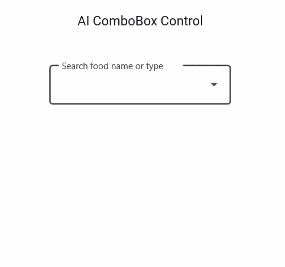

# Implementing AI-Powered Smart Filter in .NET MAUI Combobox

This document will walk you through the implementation of an advanced filter functionality in the Syncfusion [.NET MAUI ComboBox](https://help.syncfusion.com/cr/maui/Syncfusion.Maui.Inputs.SfComboBox.html) control. The example leverages the power of Azure OpenAI for an intelligent, AI-driven filter experience.

## Integrating Azure OpenAI with your .NET MAUI App

First, ensure you have access to [Azure OpenAI](https://learn.microsoft.com/en-us/azure/ai-foundry/openai/overview) and have created a deployment in the Azure portal.

If you don’t have access, please refer to the [create and deploy Azure OpenAI service](https://learn.microsoft.com/en-us/azure/ai-foundry/openai/how-to/create-resource?pivots=web-portal) guide to set up a new account.

Note down the deployment name, endpoint URL, and API key.

we’ll use the [Azure.AI.OpenAI](https://www.nuget.org/packages/Azure.AI.OpenAI/1.0.0-beta.12) NuGet package from the [NuGet Gallery](https://www.nuget.org/). So, before getting started, install the Azure.AI.OpenAI NuGet package in your .NET MAUI app.

In your base service class (AzureBaseService), initialize the OpenAIClient. Replace the Endpoint, DeploymentName, Key with actual values from your Azure OpenAI resource.

This creates a chat client using your endpoint, API key, and deployment name. It’s stored in the Client property for use in other methods.

ComboBoxAzureAIService use this Client to send prompts and receive completions.

In the `GetCompletion` method, we will construct the prompt and send it to the Azure OpenAI Service. The ChatHistory helps maintain context but is cleared for each new prompt in this implementation to ensure each search is independent.




// AzureBaseService.cs
    public abstract class AzureBaseService
    {        
        internal const string Endpoint = "YOUR_END_POINT_NAME";

        internal const string DeploymentName = "DEPLOYMENT_NAME";

        internal const string Key = "API_KEY";

        public AzureBaseService()
        {

        }

        /// 

        /// To get the Azure open ai kernal method
        /// 

        private void GetAzureOpenAIKernal()
        {
            try
            {
                var client = new AzureOpenAIClient(new Uri(Endpoint), new AzureKeyCredential(Key)).AsChatClient(modelId: DeploymentName);
                this.Client = client;
            }
            catch (Exception)
            {
            }
        }
        
    }








//ComboBoxAzureAIService.cs

public class ComboBoxAzureAIService : AzureBaseService
{
        /// 

        /// Gets a completion response from the AzureAI service based on the provided prompt.
        /// 

        /// <param name="prompt"></param>
        /// <param name="cancellationToken"></param>
        /// <returns></returns>
        public async Task<string> GetCompletion(string prompt, CancellationToken cancellationToken)
        {
            ChatHistory = string.Empty;
            if (ChatHistory != null && Client != null)
            {
                ChatHistory = ChatHistory + "You are a filtering assistant.";
                // Add the user message to the options
                ChatHistory = ChatHistory + prompt;
                try
                {
                    cancellationToken.ThrowIfCancellationRequested();
                    var chatresponse = await Client.CompleteAsync(ChatHistory);
                    cancellationToken.ThrowIfCancellationRequested();
                    return chatresponse.ToString();
                }
                catch (RequestFailedException ex)
                {
                    // Log the error message and rethrow the exception or handle it appropriately
                    Debug.WriteLine($"Request failed: {ex.Message}");
                    throw;
                }
                catch (Exception ex)
                {
                    // Handle other potential exceptions
                    Debug.WriteLine($"An error occurred: {ex.Message}");
                    throw;
                }
            }
            return "";
        }
}





## Implementing custom filtering in .NET MAUI Combobox

The [.NET MAUI ComboBox](https://help.syncfusion.com/cr/maui/Syncfusion.Maui.Inputs.SfComboBox.html) control allows you to apply custom filter logic to suggest items based on your specific filter criteria by utilizing the [FilterBehavior](https://help.syncfusion.com/cr/maui/Syncfusion.Maui.Inputs.SfComboBox.html#Syncfusion_Maui_Inputs_SfComboBox_FilterBehavior) property, which is the entry point for our natural language filtering logic.

**Step 1:** Let’s create a new business model to filter food names. Refer to the following code example.




// Model.cs
public class ComboBoxModel
{
    public string? Name { get; set; }
}

//ViewModel.cs
public class ComboBoxViewModel : INotifyPropertyChanged
{
    private ObservableCollection<ComboBoxModel> foods;

    public ObservableCollection<ComboBoxModel> Foods
    {
        get { return foods; }
        set { foods = value; OnPropertyChanged(nameof(Foods)); }
    }
    public ComboBoxViewModel()
    {
        foods = new ObservableCollection<ComboBoxModel>
        {
            new ComboBoxModel { Name = "BBQ Brisket" },
            new ComboBoxModel { Name = "BBQ Pulled Pork" },
            new ComboBoxModel { Name = "BBQ Ribs" },
            new ComboBoxModel { Name = "Bacon Cheeseburger" },
            new ComboBoxModel { Name = "Baked Meatloaf" },
            new ComboBoxModel { Name = "Beef Tacos" },
            new ComboBoxModel { Name = "Cheeseburger" },
            new ComboBoxModel { Name = "Chicken Pot Pie" },
            new ComboBoxModel { Name = "Chicken Tenders" },
            new ComboBoxModel { Name = "Chili Con Carne" },
            new ComboBoxModel { Name = "Country Fried Steak" },
            new ComboBoxModel { Name = "Fried Chicken" },
            new ComboBoxModel { Name = "Grilled Steak" },
            new ComboBoxModel { Name = "Hot Dog" },
            new ComboBoxModel { Name = "Meatball Sub" },
            new ComboBoxModel { Name = "Philly Cheesesteak" },
            new ComboBoxModel { Name = "Rack of Ribs" },
            new ComboBoxModel { Name = "Turkey Club Sandwich" },
            ...
        };
    }

    public event PropertyChangedEventHandler? PropertyChanged;

    private void OnPropertyChanged(string propertyName)
    {
        PropertyChanged?.Invoke(this, new PropertyChangedEventArgs(propertyName));
    }
}




**Step 2:** Connecting the Custom Filter to Azure OpenAI

 Implement the [GetMatchingIndexes](https://help.syncfusion.com/cr/maui/Syncfusion.Maui.Inputs.ComboBoxFilterBehavior.html#Syncfusion_Maui_Inputs_ComboBoxFilterBehavior_GetMatchingIndexes_Syncfusion_Maui_Inputs_SfComboBox_Syncfusion_Maui_Inputs_ComboBoxFilterInfo_) method from the interface. This method is the heart of the custom filter. It is invoked every time the text in the [ComboBox](https://help.syncfusion.com/cr/maui/Syncfusion.Maui.Inputs.SfComboBox.html) control changes. 

The logic within [GetMatchingIndexes](https://help.syncfusion.com/cr/maui/Syncfusion.Maui.Inputs.ComboBoxFilterBehavior.html#Syncfusion_Maui_Inputs_ComboBoxFilterBehavior_GetMatchingIndexes_Syncfusion_Maui_Inputs_SfComboBox_Syncfusion_Maui_Inputs_ComboBoxFilterInfo_) intelligently perform an online AI filter based on the availability of Azure credentials.

To get accurate and structured results from the AI, we must provide a detailed prompt. This is constructed inside the 
`FilterItemsUsingAzureAI` method.

The `FilterItemsUsingAzureAI` method uses prompt engineering to instruct the AI on how to filter the results, including asking it to handle spelling mistakes and providing the response in a clean format.




//ComboBoxCustomFilter.cs

public class ComboBoxCustomFilter : IComboBoxFilterBehavior
{
    private readonly ComboBoxAzureAIService _azureAIService;

    private readonly ComboBoxViewModel _viewModel;
    public ObservableCollection<ComboBoxModel> Items { get; set; }
    public ObservableCollection<ComboBoxModel> FilteredItems { get; set; } = new ObservableCollection<ComboBoxModel>();
    private CancellationTokenSource? _cancellationTokenSource;

    public ComboBoxCustomFilter()
    {
        _azureAIService = new ComboBoxAzureAIService();
        Items = new ObservableCollection<ComboBoxModel>();
        _cancellationTokenSource = new CancellationTokenSource();
    }

    public async Task<object?> GetMatchingIndexes(SfComboBox source, ComboBoxFilterInfo filterInfo)
    {
        Items = (ObservableCollection<ComboBoxModel>)source.ItemsSource;

        //If crendential is not valid the filtering data shows as empty
        if (!_azureAIService.IsCredentialValid || string.IsNullOrEmpty(filterInfo.Text))
        {
            _cancellationTokenSource?.Cancel();
            FilteredItems.Clear();
            return await Task.FromResult(FilteredItems);
        }

        string listItems = string.Join(", ", Items!.Select(c => c.Name));

        // Join the first five items with newline characters for demo output template for AI.           
        string outputTemplate = string.Join("\n", Items.Take(5).Select(c => c.Name));

        //The cancellationToken was used for cancelling the API request if user types continuously.       
        _cancellationTokenSource?.Cancel();
        _cancellationTokenSource = new CancellationTokenSource();
        var cancellationToken = _cancellationTokenSource.Token;

        //Passing the User Input, ItemsSource, Reference output and CancellationToken
        var filteredItems = await FilterItemsUsingAzureAI(filterInfo.Text, listItems, outputTemplate, cancellationToken);

        return await Task.FromResult(filteredItems);
    }

    public async Task<ObservableCollection<ComboBoxModel>> FilterItemsUsingAzureAI(string userInput, string itemsList, string outputTemplate, CancellationToken cancellationToken)
    {
        if (!string.IsNullOrEmpty(userInput))
        {
            var prompt =
            $"You are a strict food item filtering engine." +
            $"Your job is to filter ONLY relevant items from the provided list." +
            $"STEP 1 — CLASSIFY USER INTENT" +
            $"Extract filters from the user query." +
            $"Possible filters:" +

            $"Diet- veg, non veg, vegan, egg, halal" +
            $"Ingredients:- chicken- beef- mutton- fish- seafood- pork- paneer- cheese- rice- noodles- bread" +
            $"Other:- spicy- sweet- fried- grilled- healthy- breakfast- lunch- dinner- snack- drink- dessert" +

            $"STEP 2 — CLASSIFY EACH ITEM" +
            $"For EACH item, determine:" +
            $"- Is it veg?- Is it non veg ?-Does it contain egg?-Main ingredients- Food category" +
            $"Use the ITEM NAME ONLY." +
            $"Examples:" +
            $"Veg:- Veg Burger- Paneer Burger- Margherita Pizza- Cheese Sandwich" +
            $"Non Veg:- Chicken Burger- Beef Burger- Fish Fry- Mutton Biryani- Pepper Chicken" +

            $"IMPORTANT:- Cheeseburger is NOT automatically non veg-Only treat an item as non veg if the name explicitly contains: chicken, beef, mutton, fish, seafood, prawn, shrimp, pork, meat, turkey, lamb" +
            $"If meat is NOT explicitly mentioned, DO NOT assume non veg." +
            $"STEP 3 — HARD FILTERING (MANDATORY)" +
            $"Apply strict exclusions BEFORE ranking." +
            $"RULES:" +
            $"1. If user asks 'veg': EXCLUDE any item containing: chicken, beef, mutton, fish, seafood, prawn, shrimp, pork, meat, egg" +
            $"2. If user asks 'non veg':INCLUDE ONLY items explicitly containing:chicken, beef, mutton, fish, seafood, prawn, shrimp, pork, meat, egg, lamb, turkey. EXCLUDE:paneer,cheese,veg,vegetarian,vegan,margherita" +

            $" 3. NEVER infer meat from category names like: burger, pizza, sandwich, noodles, rice" +
            $" 4. If multiple filters exist, ALL must match." +

            $" STEP 4 — MATCHING PRIORITY" +
            $" Priority order:" +
            $" 1. Exact item name match" +
            $" 2.Fuzzy / spelling similarity" +
            $" 3.Full filter match" +
            $" 4.Partial match" +

            $"Partial match is allowed ONLY if diet rules are satisfied." +
            $"STEP 5 — OUTPUT RULES" +
            $"- Return ONLY item names from the list, One per line, No numbering, No explanation, No extra text, NEVER generate new items, If no items match, return exactly: Empty" +

            $" User Input: {userInput} " +
            $" List of Items: {itemsList} " +
            $" Expected Output Format: {outputTemplate}";

            var completion = await _azureAIService.GetCompletion(prompt, cancellationToken);

            var filteredItems = completion.Split('\n').Select(x => x.Trim()).Where(x => !string.IsNullOrEmpty(x)).ToList();

            if (FilteredItems.Count > 0)
                FilteredItems.Clear();
            FilteredItems.AddRange(
                    Items
                    .Where(i => filteredItems.Any(item => i.Name!.StartsWith(item))));

            cancellationToken.ThrowIfCancellationRequested();
        }
        return FilteredItems;
    }
}





**Step:3** Applying Custom Filtering to ComboBox

Applying custom filtering to the [ComboBox](https://help.syncfusion.com/cr/maui/Syncfusion.Maui.Inputs.SfComboBox.html) control by using the [FilterBehavior](https://help.syncfusion.com/cr/maui/Syncfusion.Maui.Inputs.SfComboBox.html#Syncfusion_Maui_Inputs_SfComboBox_FilterBehavior) property.




<ContentPage.BindingContext>
    <local:ComboBoxViewModel x:Name="viewModel"/>
</ContentPage.BindingContext>

<ContentPage.Content>
    <VerticalStackLayout Spacing="10"
                         Margin="0,50,0,0"
                         WidthRequest="303"
                         HorizontalOptions="Center"
                         VerticalOptions="Start">

        <Label Text="AI ComboBox Control"
               FontFamily="Roboto-Medium"  
               FontSize="16"
               TextColor="{AppThemeBinding Light='#1C1B1F' , Dark='#E6E1E5'}"
               HorizontalOptions="Center"/>

        <syncfusion:SfTextInputLayout Hint="Choose Food Item"
                                      Margin="0,10,0,0"
                                      ContainerType="Outlined"
                                      WidthRequest="300"
                                      ContainerBackground="Transparent">
            <editors:SfComboBox x:Name="combobox" 
                                DropDownPlacement="Bottom"                                    
                                MaxDropDownHeight="200"
                                IsEditable="True"
                                DropdownOpening="combobox_DropdownOpened"
                                DropDownClosing="combobox_DropDownClosed"
                                TextSearchMode="StartsWith"
                                IsFilteringEnabled="True"
                                DisplayMemberPath="Name"
                                TextMemberPath="Name"
                                ItemsSource="{Binding Foods}">
            </editors:SfComboBox>
        </syncfusion:SfTextInputLayout>
    </VerticalStackLayout>





The following image demonstrates the output of the above AI-based filter using a custom filtering sample.

You can find the complete sample from this [link.]()

By combining a powerful AI-driven online filter with a robust you can create a truly smart and reliable filter experience in your .NET MAUI applications.