# DropDown Customization in .NET MAUI ComboBox

This section explains the different DropDown customizations available in [.NET MAUI ComboBox](https://help.syncfusion.com/cr/maui/Syncfusion.Maui.Inputs.SfComboBox.html).

To get started quickly with customizing the appearance of the .NET MAUI ComboBox, you can watch this video:



## Prerequisites

Before using the [SfComboBox](https://help.syncfusion.com/cr/maui/Syncfusion.Maui.Inputs.SfComboBox.html), ensure the following NuGet package is installed in your .NET MAUI project:

- `Syncfusion.Maui.Inputs`

For a step-by-step setup, refer to the [Getting Started](https://help.syncfusion.com/maui/combobox/getting-started) documentation.

## Maximum DropDown Height

The maximum height of the drop-down can be changed by using the [MaxDropDownHeight](https://help.syncfusion.com/cr/maui/Syncfusion.Maui.Core.SfDropdownEntry.html#Syncfusion_Maui_Core_SfDropdownEntry_MaxDropDownHeight) property of the ComboBox control. The default value of `MaxDropDownHeight` property is `400d`.

 N> If the `MaxDropDownHeight` is too small compared to the populated items, the scroll viewer will be automatically shown to navigate the hidden items.




    <editors:SfComboBox x:Name="comboBox"
                        IsEditable="True"
                        MaxDropDownHeight="150"
                        ItemsSource="{Binding SocialMedias}"
                        DisplayMemberPath="Name"
                        TextMemberPath="Name" />




SfComboBox comboBox = new SfComboBox() 
{
    IsEditable = true,
    MaxDropDownHeight = 150,
    ItemsSource = socialMediaViewModel.SocialMedias,
    TextMemberPath = "Name",
    DisplayMemberPath = "Name",
};




// ViewModel
public class SocialMediaViewModel
{
    public ObservableCollection<SocialMedia> SocialMedias { get; set; }

    public SocialMediaViewModel()
    {
        this.SocialMedias = new ObservableCollection<SocialMedia>
        {
            new SocialMedia { Name = "Facebook", ID = 0 },
            new SocialMedia { Name = "Google Plus", ID = 1 },
            new SocialMedia { Name = "Instagram", ID = 2 },
            new SocialMedia { Name = "LinkedIn", ID = 3 },
            new SocialMedia { Name = "Skype", ID = 4 },
            new SocialMedia { Name = "Telegram", ID = 5 },
            new SocialMedia { Name = "Twitter", ID = 6 },
            new SocialMedia { Name = "WhatsApp", ID = 7 },
            new SocialMedia { Name = "YouTube", ID = 8 }
        };
    }
}

public class SocialMedia
{
    public string Name { get; set; }
    public int ID { get; set; }
}




The following image illustrates the result of the above code:

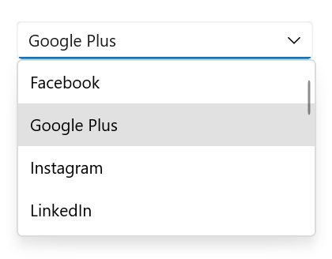

## Customize the DropDown (suggestion) item 

The [ItemTemplate](https://help.syncfusion.com/cr/maui/Syncfusion.Maui.Inputs.DropDownControls.DropDownListBase.html#Syncfusion_Maui_Inputs_DropDownControls_DropDownListBase_ItemTemplate) property helps you to decorate drop-down items using custom templates. The default value of the `ItemTemplate` is `null`. The following example shows how to customize drop-down items using templates. The sample assumes a binding context with an `Employees` collection and image assets added to the project.




    //Model.cs
    public class Employee
    {
        public string Name { get; set; }
        public string ProfilePicture { get; set; }
        public string Designation { get; set; }
        public string ID { get; set; }
    }

    //ViewModel.cs
    public class EmployeeViewModel
    {
        public ObservableCollection<Employee> Employees { get; set; }
        public EmployeeViewModel()
        {
            this.Employees = new ObservableCollection<Employee>();
            Employees.Add(new Employee
            {
                Name = "Anne Dodsworth",
                ProfilePicture = "people_circle1.png",
                Designation = "Developer",
                ID = "E001",
            });
            Employees.Add(new Employee
            {
                Name = "Andrew Fuller",
                ProfilePicture = "people_circle8.png", 
                Designation = "Team Lead",
                ID = "E002",
            });

        }
    }







<editors:SfComboBox Placeholder="Select an employee"
                    TextMemberPath="Name"
                    DisplayMemberPath="Name"
                    ItemsSource="{Binding Employees}"
                    x:Name="comboBox">
    <editors:SfComboBox.BindingContext>
        <local:EmployeeViewModel/>
    </editors:SfComboBox.BindingContext>

    <editors:SfComboBox.ItemTemplate>
        <DataTemplate>
            <ViewCell>
                <Grid Margin="0,5"
                      VerticalOptions="Center"
                      HorizontalOptions="Center"
                      ColumnDefinitions="48,220"
                      RowDefinitions="50">
                    <Image Grid.Column="0"
                            HorizontalOptions="Center"
                            VerticalOptions="Center"
                            Source="{Binding ProfilePicture}"
                            Aspect="AspectFit"/>
                    <StackLayout HorizontalOptions="Start"
                                 VerticalOptions="Center"
                                 Grid.Column="1"
                                 Margin="15,0,0,0">
                            <Label HorizontalTextAlignment="Start"
                                   VerticalTextAlignment="Center"
                                   Opacity=".87"
                                   FontSize="14"
                                   Text="{Binding Name}"/>
                            <Label HorizontalOptions="Start"
                                   VerticalTextAlignment="Center"
                                   Opacity=".54"
                                   FontSize="12"
                                   Text="{Binding Designation}"/>
                    </StackLayout>
                </Grid>
            </ViewCell>
        </DataTemplate>
    </editors:SfComboBox.ItemTemplate>
</editors:SfComboBox>




EmployeeViewModel employee = new EmployeeViewModel();

SfComboBox comboBox = new SfComboBox()
    {
        BindingContext = employee,
        ItemsSource = employee.Employees,
        DisplayMemberPath = "Name",
        Placeholder = "Enter an employee",
        TextMemberPath = "Name",
    };

DataTemplate itemTemplate = new DataTemplate(() =>
{
    Grid grid = new();
    grid.Margin = new Thickness(0, 5);
    grid.HorizontalOptions = LayoutOptions.Center;
    grid.VerticalOptions = LayoutOptions.Center;
    ColumnDefinition colDef1 = new ColumnDefinition() { Width = 48 };
    ColumnDefinition colDef2 = new ColumnDefinition() { Width = 220 };
    RowDefinition rowDef = new RowDefinition() { Height = 50 };
    grid.ColumnDefinitions.Add(colDef1);
    grid.ColumnDefinitions.Add(colDef2);
    grid.RowDefinitions.Add(rowDef);

    Image image = new();
    image.HorizontalOptions = LayoutOptions.Center;
    image.VerticalOptions = LayoutOptions.Center;
    image.Aspect = Aspect.AspectFit;
    image.SetBinding(Image.SourceProperty, ("ProfilePicture"));
    Grid.SetColumn(image, 0);

    StackLayout stack = new();
    stack.Orientation = StackOrientation.Vertical;
    stack.Margin = new Thickness(15, 0,0,0);
    stack.HorizontalOptions = LayoutOptions.Start;
    stack.VerticalOptions = LayoutOptions.Center;
    Grid.SetColumn(stack, 1);

    Label label = new();
    label.SetBinding(Label.TextProperty, "Name");
    label.FontSize = 14;
    label.VerticalOptions = LayoutOptions.Center;
    label.HorizontalTextAlignment = TextAlignment.Start;
    label.Opacity = .87;

    Label label1 = new();
    label1.SetBinding(Label.TextProperty, "Designation");
    label1.FontSize = 12;
    label1.VerticalOptions = LayoutOptions.Center;
    label1.HorizontalTextAlignment = TextAlignment.Start;
    label1.Opacity = .54;

    stack.Children.Add(label);
    stack.Children.Add(label1);

    grid.Children.Add(image);
    grid.Children.Add(stack);

    return new ViewCell { View = grid };
});
comboBox.ItemTemplate = itemTemplate;

this.Content = comboBox;




The following image illustrates the result of the above code:

### Customize the DropDown item text

DropDown items can be customized using the [DropDownItemFontAttributes](https://help.syncfusion.com/cr/maui/Syncfusion.Maui.Inputs.DropDownControls.DropDownListBase.html#Syncfusion_Maui_Inputs_DropDownControls_DropDownListBase_DropDownItemFontAttributes), [DropDownItemFontFamily](https://help.syncfusion.com/cr/maui/Syncfusion.Maui.Inputs.DropDownControls.DropDownListBase.html#Syncfusion_Maui_Inputs_DropDownControls_DropDownListBase_DropDownItemFontFamily), [DropDownItemFontSize](https://help.syncfusion.com/cr/maui/Syncfusion.Maui.Inputs.DropDownControls.DropDownListBase.html#Syncfusion_Maui_Inputs_DropDownControls_DropDownListBase_DropDownItemFontSize), and [DropDownItemTextColor](https://help.syncfusion.com/cr/maui/Syncfusion.Maui.Inputs.DropDownControls.DropDownListBase.html#Syncfusion_Maui_Inputs_DropDownControls_DropDownListBase_DropDownItemTextColor) properties.




<editors:SfComboBox x:Name="comboBox"
                    ItemsSource="{Binding SocialMedias}"
                    DisplayMemberPath="Name"
                    TextMemberPath="Name"
                    Placeholder="Enter Media"
                    DropDownItemFontAttributes="Italic"
                    DropDownItemFontFamily="OpenSansSemibold"
                    DropDownItemFontSize="16"
                    DropDownItemTextColor="DarkViolet" />





SfComboBox comboBox = new SfComboBox() 
{
    Placeholder="Enter Media",
    TextMemberPath = "Name",
    DisplayMemberPath = "Name",
    DropDownItemFontAttributes = FontAttributes.Italic,
    DropDownItemFontFamily = "OpenSansSemibold",
    DropDownItemTextColor = Colors.DarkViolet,
    DropDownItemFontSize = 16,
    ItemsSource = socialMediaViewModel.SocialMedias
};




// ViewModel
public class SocialMediaViewModel
{
    public ObservableCollection<SocialMedia> SocialMedias { get; set; }

    public SocialMediaViewModel()
    {
        this.SocialMedias = new ObservableCollection<SocialMedia>
        {
            new SocialMedia { Name = "Facebook", ID = 0 },
            new SocialMedia { Name = "Google Plus", ID = 1 },
            new SocialMedia { Name = "Instagram", ID = 2 },
            new SocialMedia { Name = "LinkedIn", ID = 3 },
            new SocialMedia { Name = "Skype", ID = 4 },
            new SocialMedia { Name = "Telegram", ID = 5 },
            new SocialMedia { Name = "Twitter", ID = 6 },
            new SocialMedia { Name = "WhatsApp", ID = 7 },
            new SocialMedia { Name = "YouTube", ID = 8 }
        };
    }
}

public class SocialMedia
{
    public string Name { get; set; }
    public int ID { get; set; }
}




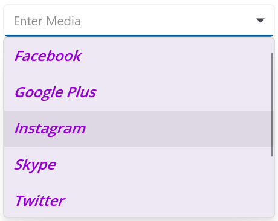

### Customize the DropDown background color

The [DropDownBackground](https://help.syncfusion.com/cr/maui/Syncfusion.Maui.Inputs.DropDownControls.DropDownListBase.html#Syncfusion_Maui_Inputs_DropDownControls_DropDownListBase_DropDownBackground) property is used to modify the background color of the dropdown.




    <editors:SfComboBox x:Name="comboBox"
                        ItemsSource="{Binding SocialMedias}"
                        DisplayMemberPath="Name"
                        TextMemberPath="Name"
                        Placeholder="Enter Media"
                        DropDownBackground="YellowGreen" />





SfComboBox comboBox = new SfComboBox() 
{
    ItemsSource = socialMediaViewModel.SocialMedias,
    TextMemberPath = "Name",
    DisplayMemberPath = "Name",
    Placeholder="Enter Media",
    DropDownBackground = Colors.YellowGreen,
};




// ViewModel
public class SocialMediaViewModel
{
    public ObservableCollection<SocialMedia> SocialMedias { get; set; }

    public SocialMediaViewModel()
    {
        this.SocialMedias = new ObservableCollection<SocialMedia>
        {
            new SocialMedia { Name = "Facebook", ID = 0 },
            new SocialMedia { Name = "Google Plus", ID = 1 },
            new SocialMedia { Name = "Instagram", ID = 2 },
            new SocialMedia { Name = "LinkedIn", ID = 3 },
            new SocialMedia { Name = "Skype", ID = 4 },
            new SocialMedia { Name = "Telegram", ID = 5 },
            new SocialMedia { Name = "Twitter", ID = 6 },
            new SocialMedia { Name = "WhatsApp", ID = 7 },
            new SocialMedia { Name = "YouTube", ID = 8 }
        };
    }
}

public class SocialMedia
{
    public string Name { get; set; }
    public int ID { get; set; }
}




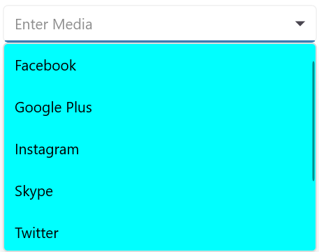

### Customize the DropDown selected item background color

The [SelectedDropDownItemBackground](https://help.syncfusion.com/cr/maui/Syncfusion.Maui.Inputs.DropDownControls.DropDownListBase.html#Syncfusion_Maui_Inputs_DropDownControls_DropDownListBase_SelectedDropDownItemBackground) property is used to modify the background color of selected item in the dropdown.




<editors:SfComboBox x:Name="comboBox"
                    ItemsSource="{Binding SocialMedias}"
                    DisplayMemberPath="Name"
                    TextMemberPath="Name"
                    Placeholder="Enter Media"
                    SelectedDropDownItemBackground="LightSeaGreen" />





SfComboBox comboBox = new SfComboBox() 
{
    ItemsSource = socialMediaViewModel.SocialMedias,
    TextMemberPath = "Name",
    DisplayMemberPath = "Name",
    Placeholder="Enter Media",
    SelectedDropDownItemBackground = Colors.LightSeaGreen,
};




// ViewModel
public class SocialMediaViewModel
{
    public ObservableCollection<SocialMedia> SocialMedias { get; set; }

    public SocialMediaViewModel()
    {
        this.SocialMedias = new ObservableCollection<SocialMedia>
        {
            new SocialMedia { Name = "Facebook", ID = 0 },
            new SocialMedia { Name = "Google Plus", ID = 1 },
            new SocialMedia { Name = "Instagram", ID = 2 },
            new SocialMedia { Name = "LinkedIn", ID = 3 },
            new SocialMedia { Name = "Skype", ID = 4 },
            new SocialMedia { Name = "Telegram", ID = 5 },
            new SocialMedia { Name = "Twitter", ID = 6 },
            new SocialMedia { Name = "WhatsApp", ID = 7 },
            new SocialMedia { Name = "YouTube", ID = 8 }
        };
    }
}

public class SocialMedia
{
    public string Name { get; set; }
    public int ID { get; set; }
}




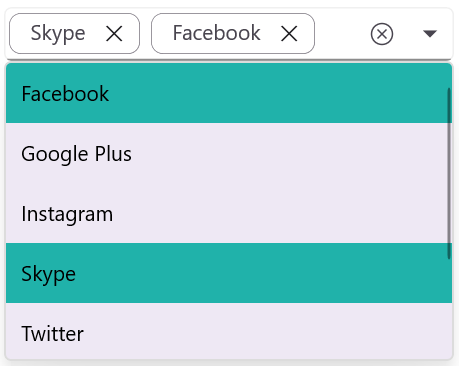

### Customize the Selected DropDown Item Text Style

The [SelectedDropDownItemTextStyle](https://help.syncfusion.com/cr/maui/Syncfusion.Maui.Inputs.DropDownControls.DropDownListBase.html#Syncfusion_Maui_Inputs_DropDownControls_DropDownListBase_SelectedDropDownItemTextStyle) property in the ComboBox control allows developers to customize the appearance of the selected item in the dropdown list. This feature is useful for highlighting user selections and improving the overall UI experience.




<editors:SfComboBox x:Name="comboBox"
                    ItemsSource="{Binding SocialMedias}"
                    DisplayMemberPath="Name"
                    TextMemberPath="Name"
                    Placeholder="Enter Media">
    <editors:SfComboBox.SelectedDropDownItemTextStyle>
        <editors:DropDownTextStyle TextColor="Orange" 
                                   FontSize="16" 
                                   FontAttributes="Bold"/>
    </editors:SfComboBox.SelectedDropDownItemTextStyle>
</editors:SfComboBox>





SfComboBox comboBox = new SfComboBox() 
{
    ItemsSource = socialMediaViewModel.SocialMedias,
    TextMemberPath = "Name",
    DisplayMemberPath = "Name",
    Placeholder="Enter Media",
    SelectedDropDownItemTextStyle = new DropDownTextStyle
    {
        TextColor = Colors.Orange,
        FontSize = 16,
        FontAttributes = FontAttributes.Bold
    }
};




// ViewModel
public class SocialMediaViewModel
{
    public ObservableCollection<SocialMedia> SocialMedias { get; set; }

    public SocialMediaViewModel()
    {
        this.SocialMedias = new ObservableCollection<SocialMedia>
        {
            new SocialMedia { Name = "Facebook", ID = 0 },
            new SocialMedia { Name = "Google Plus", ID = 1 },
            new SocialMedia { Name = "Instagram", ID = 2 },
            new SocialMedia { Name = "LinkedIn", ID = 3 },
            new SocialMedia { Name = "Skype", ID = 4 },
            new SocialMedia { Name = "Telegram", ID = 5 },
            new SocialMedia { Name = "Twitter", ID = 6 },
            new SocialMedia { Name = "WhatsApp", ID = 7 },
            new SocialMedia { Name = "YouTube", ID = 8 }
        };
    }
}

public class SocialMedia
{
    public string Name { get; set; }
    public int ID { get; set; }
}




### Customize the DropDown Border Color

The [DropDownStroke](https://help.syncfusion.com/cr/maui/Syncfusion.Maui.Inputs.DropDownControls.DropDownListBase.html#Syncfusion_Maui_Inputs_DropDownControls_DropDownListBase_DropDownStroke) property is used to modify the border color of the dropdown.




    <editors:SfComboBox x:Name="comboBox"
                        ItemsSource="{Binding SocialMedias}"
                        DisplayMemberPath="Name"
                        TextMemberPath="Name"
                        Placeholder="Enter Media"
                        DropDownStroke="DarkOrange" />





SfComboBox comboBox = new SfComboBox() 
{
    ItemsSource = socialMediaViewModel.SocialMedias,
    DisplayMemberPath = "Name",
    TextMemberPath = "Name",
    Placeholder="Enter Media",
    DropDownStroke = Colors.DarkOrange,
};




// ViewModel
public class SocialMediaViewModel
{
    public ObservableCollection<SocialMedia> SocialMedias { get; set; }

    public SocialMediaViewModel()
    {
        this.SocialMedias = new ObservableCollection<SocialMedia>
        {
            new SocialMedia { Name = "Facebook", ID = 0 },
            new SocialMedia { Name = "Google Plus", ID = 1 },
            new SocialMedia { Name = "Instagram", ID = 2 },
            new SocialMedia { Name = "LinkedIn", ID = 3 },
            new SocialMedia { Name = "Skype", ID = 4 },
            new SocialMedia { Name = "Telegram", ID = 5 },
            new SocialMedia { Name = "Twitter", ID = 6 },
            new SocialMedia { Name = "WhatsApp", ID = 7 },
            new SocialMedia { Name = "YouTube", ID = 8 }
        };
    }
}

public class SocialMedia
{
    public string Name { get; set; }
    public int ID { get; set; }
}




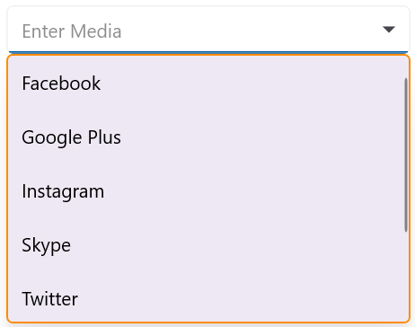

### Customize the DropDown Border Thickness

The [DropDownStrokeThickness](https://help.syncfusion.com/cr/maui/Syncfusion.Maui.Inputs.DropDownControls.DropDownListBase.html#Syncfusion_Maui_Inputs_DropDownControls_DropDownListBase_DropDownStrokeThickness) property is used to modify the thickness of the dropdown border.




<editors:SfComboBox x:Name="comboBox"
                    ItemsSource="{Binding SocialMedias}"
                    DisplayMemberPath="Name"
                    TextMemberPath="Name"
                    Placeholder="Enter Media"
                    DropDownStroke="DarkOrange"
                    DropDownStrokeThickness="5" />





SfComboBox comboBox = new SfComboBox() 
{
    ItemsSource = socialMediaViewModel.SocialMedias,
    DisplayMemberPath = "Name",
    TextMemberPath = "Name",
    Placeholder="Enter Media",
    DropDownStroke = Colors.DarkOrange,
    DropDownStrokeThickness = 5,
};




// ViewModel
public class SocialMediaViewModel
{
    public ObservableCollection<SocialMedia> SocialMedias { get; set; }

    public SocialMediaViewModel()
    {
        this.SocialMedias = new ObservableCollection<SocialMedia>
        {
            new SocialMedia { Name = "Facebook", ID = 0 },
            new SocialMedia { Name = "Google Plus", ID = 1 },
            new SocialMedia { Name = "Instagram", ID = 2 },
            new SocialMedia { Name = "LinkedIn", ID = 3 },
            new SocialMedia { Name = "Skype", ID = 4 },
            new SocialMedia { Name = "Telegram", ID = 5 },
            new SocialMedia { Name = "Twitter", ID = 6 },
            new SocialMedia { Name = "WhatsApp", ID = 7 },
            new SocialMedia { Name = "YouTube", ID = 8 }
        };
    }
}

public class SocialMedia
{
    public string Name { get; set; }
    public int ID { get; set; }
}




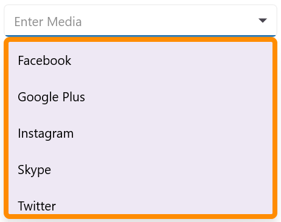

### Customize the dropdown shadow visibility

The [IsDropDownShadowVisible](https://help.syncfusion.com/cr/maui/Syncfusion.Maui.Inputs.DropDownControls.DropDownListBase.html#Syncfusion_Maui_Inputs_DropDownControls_DropDownListBase_IsDropDownShadowVisible) property is used to customize the visibility of the dropdown shadow.




<editors:SfComboBox x:Name="comboBox"
                    ItemsSource="{Binding SocialMedias}"
                    DisplayMemberPath="Name"
                    TextMemberPath="Name"
                    Placeholder="Enter Media"
                    IsDropDownShadowVisible="False" />





SfComboBox comboBox = new SfComboBox() 
{
    ItemsSource = socialMediaViewModel.SocialMedias,
    DisplayMemberPath = "Name",
    TextMemberPath = "Name",
    Placeholder = "Enter Media",
    IsDropDownShadowVisible = false
};




// ViewModel
public class SocialMediaViewModel
{
    public ObservableCollection<SocialMedia> SocialMedias { get; set; }

    public SocialMediaViewModel()
    {
        this.SocialMedias = new ObservableCollection<SocialMedia>
        {
            new SocialMedia { Name = "Facebook", ID = 0 },
            new SocialMedia { Name = "Google Plus", ID = 1 },
            new SocialMedia { Name = "Instagram", ID = 2 },
            new SocialMedia { Name = "LinkedIn", ID = 3 },
            new SocialMedia { Name = "Skype", ID = 4 },
            new SocialMedia { Name = "Telegram", ID = 5 },
            new SocialMedia { Name = "Twitter", ID = 6 },
            new SocialMedia { Name = "WhatsApp", ID = 7 },
            new SocialMedia { Name = "YouTube", ID = 8 }
        };
    }
}

public class SocialMedia
{
    public string Name { get; set; }
    public int ID { get; set; }
}




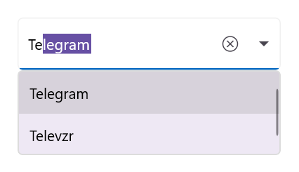

### Customize the DropDown Item Height

The [DropDownItemHeight](https://help.syncfusion.com/cr/maui/Syncfusion.Maui.Inputs.DropDownControls.DropDownListBase.html#Syncfusion_Maui_Inputs_DropDownControls_DropDownListBase_DropDownItemHeight) property is used to modify the height of the dropdown items.




<editors:SfComboBox x:Name="comboBox"
                    ItemsSource="{Binding SocialMedias}"
                    DisplayMemberPath="Name"
                    TextMemberPath="Name"
                    Placeholder="Enter Media"
                    DropDownItemHeight="25" />





SfComboBox comboBox = new SfComboBox() 
{
    ItemsSource = socialMediaViewModel.SocialMedias,
    DisplayMemberPath = "Name",
    TextMemberPath = "Name",
    Placeholder="Enter Media",
    DropDownItemHeight = 25,
};




// ViewModel
public class SocialMediaViewModel
{
    public ObservableCollection<SocialMedia> SocialMedias { get; set; }

    public SocialMediaViewModel()
    {
        this.SocialMedias = new ObservableCollection<SocialMedia>
        {
            new SocialMedia { Name = "Facebook", ID = 0 },
            new SocialMedia { Name = "Google Plus", ID = 1 },
            new SocialMedia { Name = "Instagram", ID = 2 },
            new SocialMedia { Name = "LinkedIn", ID = 3 },
            new SocialMedia { Name = "Skype", ID = 4 },
            new SocialMedia { Name = "Telegram", ID = 5 },
            new SocialMedia { Name = "Twitter", ID = 6 },
            new SocialMedia { Name = "WhatsApp", ID = 7 },
            new SocialMedia { Name = "YouTube", ID = 8 }
        };
    }
}

public class SocialMedia
{
    public string Name { get; set; }
    public int ID { get; set; }
}




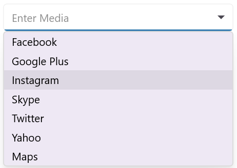

### Customize the DropDownPlacement

The drop-down that shows the filtered items will be placed automatically based on the available space and can also be customized using the [DropDownPlacement](https://help.syncfusion.com/cr/maui/Syncfusion.Maui.Inputs.DropDownControls.DropDownListBase.html#Syncfusion_Maui_Inputs_DropDownControls_DropDownListBase_DropDownPlacement) property.

*   `Top` - Drop-down will be placed above the text box.

*   `Bottom` - Drop-down will be placed below the text box.

*   `Auto` - Drop-down will be placed based on the available space either top or bottom of the text box.

*   `None` - Drop-down will not be shown with the filtered items.




<editors:SfComboBox x:Name="comboBox"
                    ItemsSource="{Binding SocialMedias}"
                    DisplayMemberPath="Name"
                    TextMemberPath = "Name"
                    DropDownPlacement="Top"/>





SfComboBox comboBox = new SfComboBox() 
{
    ItemsSource = socialMediaViewModel.SocialMedias,
    DisplayMemberPath = "Name",
    TextMemberPath = "Name",
    DropDownPlacement = DropDownPlacement.Top,
};




// ViewModel
public class SocialMediaViewModel
{
    public ObservableCollection<SocialMedia> SocialMedias { get; set; }

    public SocialMediaViewModel()
    {
        this.SocialMedias = new ObservableCollection<SocialMedia>
        {
            new SocialMedia { Name = "Facebook", ID = 0 },
            new SocialMedia { Name = "Google Plus", ID = 1 },
            new SocialMedia { Name = "Instagram", ID = 2 },
            new SocialMedia { Name = "LinkedIn", ID = 3 },
            new SocialMedia { Name = "Skype", ID = 4 },
            new SocialMedia { Name = "Telegram", ID = 5 },
            new SocialMedia { Name = "Twitter", ID = 6 },
            new SocialMedia { Name = "WhatsApp", ID = 7 },
            new SocialMedia { Name = "YouTube", ID = 8 }
        };
    }
}

public class SocialMedia
{
    public string Name { get; set; }
    public int ID { get; set; }
}




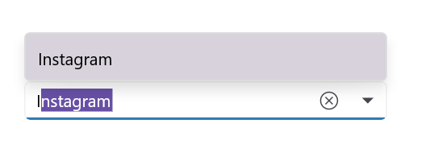

### Customize the DropDown ItemPadding

The comboBox enables the user to provide padding for the items inside dropdown using [ItemPadding](https://help.syncfusion.com/cr/maui/Syncfusion.Maui.Inputs.DropDownControls.DropDownListBase.html#Syncfusion_Maui_Inputs_DropDownControls_DropDownListBase_ItemPadding) property.




<editors:SfComboBox x:Name="comboBox"
                    ItemsSource="{Binding SocialMedias}"
                    DisplayMemberPath="Name"
                    TextMemberPath = "Name"
                    ItemPadding="10,20,0,0"/>





SfComboBox comboBox = new SfComboBox() 
{
    ItemsSource = socialMediaViewModel.SocialMedias,
    DisplayMemberPath = "Name",
    TextMemberPath = "Name",
    ItemPadding = new Thickness(10,20,0,0),
};





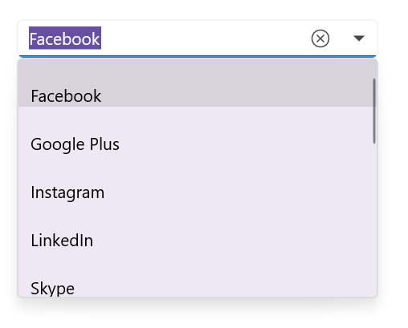

### Customize the DropDown Width

The [DropdownWidth](https://help.syncfusion.com/cr/maui/Syncfusion.Maui.Inputs.DropDownControls.DropDownListBase.html#Syncfusion_Maui_Inputs_DropDownControls_DropDownListBase_DropdownWidth) property is used to modify the Width of the dropdown.




<editors:SfComboBox x:Name="comboBox"
                    ItemsSource="{Binding SocialMedias}"
                    DisplayMemberPath="Name"
                    TextMemberPath = "Name"
                    DropdownWidth="500"/>





SfComboBox comboBox = new SfComboBox() 
{
    ItemsSource = socialMediaViewModel.SocialMedias,
    DisplayMemberPath = "Name",
    TextMemberPath = "Name",
    DropdownWidth = 500,
};




// ViewModel
public class SocialMediaViewModel
{
    public ObservableCollection<SocialMedia> SocialMedias { get; set; }

    public SocialMediaViewModel()
    {
        this.SocialMedias = new ObservableCollection<SocialMedia>
        {
            new SocialMedia { Name = "Facebook", ID = 0 },
            new SocialMedia { Name = "Google Plus", ID = 1 },
            new SocialMedia { Name = "Instagram", ID = 2 },
            new SocialMedia { Name = "LinkedIn", ID = 3 },
            new SocialMedia { Name = "Skype", ID = 4 },
            new SocialMedia { Name = "Telegram", ID = 5 },
            new SocialMedia { Name = "Twitter", ID = 6 },
            new SocialMedia { Name = "WhatsApp", ID = 7 },
            new SocialMedia { Name = "YouTube", ID = 8 }
        };
    }
}

public class SocialMedia
{
    public string Name { get; set; }
    public int ID { get; set; }
}




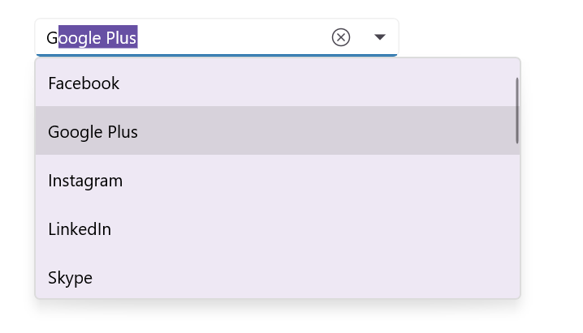

### Show suggestion box on focus

Suggestion box can be shown whenever the control receives focus using the [ShowSuggestionsOnFocus](https://help.syncfusion.com/cr/maui/Syncfusion.Maui.Inputs.DropDownControls.DropDownListBase.html#Syncfusion_Maui_Inputs_DropDownControls_DropDownListBase_ShowSuggestionsOnFocus) property. At this time, suggestion list is the complete list of data source.




<editors:SfComboBox x:Name="comboBox"
                    ItemsSource="{Binding SocialMedias}"
                    DisplayMemberPath="Name"
                    TextMemberPath = "Name"                           
                    ShowSuggestionsOnFocus="True"/>





SfComboBox comboBox = new SfComboBox() 
{
    ItemsSource = socialMediaViewModel.SocialMedias,
    DisplayMemberPath = "Name",
    TextMemberPath = "Name",
    ShowSuggestionsOnFocus = true
};




// ViewModel
public class SocialMediaViewModel
{
    public ObservableCollection<SocialMedia> SocialMedias { get; set; }

    public SocialMediaViewModel()
    {
        this.SocialMedias = new ObservableCollection<SocialMedia>
        {
            new SocialMedia { Name = "Facebook", ID = 0 },
            new SocialMedia { Name = "Google Plus", ID = 1 },
            new SocialMedia { Name = "Instagram", ID = 2 },
            new SocialMedia { Name = "LinkedIn", ID = 3 },
            new SocialMedia { Name = "Skype", ID = 4 },
            new SocialMedia { Name = "Telegram", ID = 5 },
            new SocialMedia { Name = "Twitter", ID = 6 },
            new SocialMedia { Name = "WhatsApp", ID = 7 },
            new SocialMedia { Name = "YouTube", ID = 8 }
        };
    }
}

public class SocialMedia
{
    public string Name { get; set; }
    public int ID { get; set; }
}




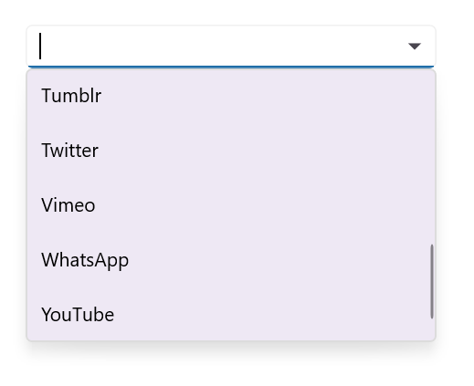

## Customize the DropDown (suggestion) item based on condition

The [ItemTemplate](https://help.syncfusion.com/cr/maui/Syncfusion.Maui.Inputs.DropDownControls.DropDownListBase.html#Syncfusion_Maui_Inputs_DropDownControls_DropDownListBase_ItemTemplate) property helps you to decorate drop-down items conditionally based on their content using the custom templates. The default value of the `ItemTemplate` is `null`.




    //Model.cs
    public class Employee
    {
        public string Name { get; set; }
        public string ProfilePicture { get; set; }
        public string Designation { get; set; }
        public string ID { get; set; }
    }

    //ViewModel.cs
    public class EmployeeViewModel
    {
        public ObservableCollection<Employee> Employees { get; set; }
        public EmployeeViewModel()
        {
            this.Employees = new ObservableCollection<Employee>();
            Employees.Add(new Employee
            {
                Name = "Anne Dodsworth",
                ProfilePicture = "people_circle1.png",
                Designation = "Developer",
                ID = "E001",
            });
            Employees.Add(new Employee
            {
                Name = "Andrew Fuller",
                ProfilePicture = "people_circle8.png", 
                Designation = "Team Lead",
                ID = "E002",
            });
            Employees.Add(new Employee
            {
                Name = "Andrew Fuller",
                ProfilePicture ="people_circle8.png",
                Designation = "Team Lead",
                ID = "E002",
            });
            Employees.Add(new Employee
            {
                Name = "Emilio Alvaro",
                ProfilePicture = "people_circle7.png",
                Designation = "Product Manager",
                ID = "E003"
            });
            Employees.Add(new Employee
            {
                Name = "Janet Leverling",
                ProfilePicture = "people_circle2.png",
                Designation = "HR",
                ID = "E004",
            });
            Employees.Add(new Employee
            {
                Name = "Laura Callahan",
                ProfilePicture = "people_circle10.png",
                Designation = "Product Manager",
                ID = "E005",
            });
        }
    }

    //Template selector
    public class EmployeeTemplateSelector : DataTemplateSelector
    {
        public DataTemplate EmployeeTemplate1 { get; set; }
        public DataTemplate EmployeeTemplate2 { get; set; }

        protected override DataTemplate OnSelectTemplate(object item, BindableObject container)
        {
            var employeeName = ((Employee)item).Name;
            {
                if (employeeName.ToString() == "Anne Dodsworth" || employeeName.ToString() == "Emilio Alvaro" ||
                    employeeName.ToString() == "Laura Callahan")
                {
                    return EmployeeTemplate1;
                }
                else
                {
                    return EmployeeTemplate2;
                }
            }
        }
    }







    <Grid>
        <Grid.Resources>
            <DataTemplate x:Key="employeeTemplate1">
                <ViewCell>
                    <Grid Margin="0,5"
                          VerticalOptions="Center"
                          HorizontalOptions="Center"
                          ColumnDefinitions="48,220"
                          RowDefinitions="50">
                        <Image Grid.Column="0"
                               HorizontalOptions="Center"
                               VerticalOptions="Center"
                               Source="{Binding ProfilePicture}"
                               Aspect="AspectFit"/>
                        <StackLayout HorizontalOptions="Start"
                                     VerticalOptions="Center"
                                     Grid.Column="1"
                                     Margin="15,0,0,0">
                            <Label HorizontalTextAlignment="Start"
                                   VerticalTextAlignment="Center"
                                   Opacity=".87"
                                   FontSize="14"
                                   TextColor="Blue"
                                   Text="{Binding Name}"/>
                            <Label HorizontalOptions="Start"
                                   VerticalTextAlignment="Center"
                                   Opacity=".54"
                                   FontSize="12"
                                   TextColor="Coral"
                                   Text="{Binding Designation}"/>
                        </StackLayout>
                    </Grid>
                </ViewCell>
            </DataTemplate>
        
            <DataTemplate x:Key="employeeTemplate2">
                <ViewCell>
                    <Grid Margin="0,5"
                          VerticalOptions="Center"
                          HorizontalOptions="Center"
                          ColumnDefinitions="48,220"
                          RowDefinitions="50">
                        <Image Grid.Column="0"
                               HorizontalOptions="Center"
                               VerticalOptions="Center"
                               Source="{Binding ProfilePicture}"
                               Aspect="AspectFit"/>
                        <StackLayout HorizontalOptions="Start"
                                     VerticalOptions="Center"
                                     Grid.Column="1"
                                     Margin="15,0,0,0">
                            <Label HorizontalTextAlignment="Start"
                                   VerticalTextAlignment="Center"
                                   Opacity=".87"
                                   FontSize="14"
                                   TextColor="Red"
                                   Text="{Binding Name}"/>
                            <Label HorizontalOptions="Start"
                                   VerticalTextAlignment="Center"
                                   Opacity=".54"
                                   FontSize="12"
                                   TextColor="Green"
                                   Text="{Binding Designation}"/>
                        </StackLayout>
                    </Grid>
                </ViewCell>
            </DataTemplate>

            <local:EmployeeTemplateSelector x:Key="employeeTemplateSelector"
                                            EmployeeTemplate1="{StaticResource employeeTemplate1}"
                                            EmployeeTemplate2="{StaticResource employeeTemplate2}"/>

        </Grid.Resources>
        <editors:SfComboBox Placeholder="Select an employee"
                            TextMemberPath="Name"
                            DisplayMemberPath="Name"
                            ItemsSource="{Binding Employees}"
                            SelectedItem="{Binding SelectedEmployee,Mode=TwoWay}"
                            x:Name="comboBox"
                            ItemTemplate="{StaticResource employeeTemplateSelector}">
            <editors:SfComboBox.BindingContext>
                <local:EmployeeViewModel/>
            </editors:SfComboBox.BindingContext>
        </editors:SfComboBox>
    </Grid>




    EmployeeViewModel employee = new EmployeeViewModel();

    DataTemplate employeeTemplate1 = new DataTemplate(() =>
    {
        Grid grid = new();
        grid.Margin = new Thickness(0, 5);
        grid.HorizontalOptions = LayoutOptions.Center;
        grid.VerticalOptions = LayoutOptions.Center;
        ColumnDefinition colDef1 = new ColumnDefinition() { Width = 48 };
        ColumnDefinition colDef2 = new ColumnDefinition() { Width = 220 };
        RowDefinition rowDef = new RowDefinition() { Height = 50 };
        grid.ColumnDefinitions.Add(colDef1);
        grid.ColumnDefinitions.Add(colDef2);
        grid.RowDefinitions.Add(rowDef);

        Image image = new();
        image.HorizontalOptions = LayoutOptions.Center;
        image.VerticalOptions = LayoutOptions.Center;
        image.Aspect = Aspect.AspectFit;
        image.SetBinding(Image.SourceProperty, ("ProfilePicture"));
        Grid.SetColumn(image, 0);

        StackLayout stack = new();
        stack.Orientation = StackOrientation.Vertical;
        stack.Margin = new Thickness(15, 0,0,0);
        stack.HorizontalOptions = LayoutOptions.Start;
        stack.VerticalOptions = LayoutOptions.Center;
        Grid.SetColumn(stack, 1);

        Label label = new();
        label.SetBinding(Label.TextProperty, "Name");
        label.FontSize = 14;
        label.TextColor = Colors.Blue;
        label.VerticalOptions = LayoutOptions.Center;
        label.HorizontalTextAlignment = TextAlignment.Start;
        label.Opacity = .87;

        Label label1 = new();
        label1.SetBinding(Label.TextProperty, "Designation");
        label1.FontSize = 12;
        label1.TextColor = Colors.Coral;
        label1.VerticalOptions = LayoutOptions.Center;
        label1.HorizontalTextAlignment = TextAlignment.Start;
        label1.Opacity = .54;

        stack.Children.Add(label);
        stack.Children.Add(label1);

        grid.Children.Add(image);
        grid.Children.Add(stack);

        return new ViewCell { View = grid };
    });

    DataTemplate employeeTemplate2 = new DataTemplate(() =>
    {
        Grid grid = new();
        grid.Margin = new Thickness(0, 5);
        grid.HorizontalOptions = LayoutOptions.Center;
        grid.VerticalOptions = LayoutOptions.Center;
        ColumnDefinition colDef1 = new ColumnDefinition() { Width = 48 };
        ColumnDefinition colDef2 = new ColumnDefinition() { Width = 220 };
        RowDefinition rowDef = new RowDefinition() { Height = 50 };
        grid.ColumnDefinitions.Add(colDef1);
        grid.ColumnDefinitions.Add(colDef2);
        grid.RowDefinitions.Add(rowDef);

        Image image = new();
        image.HorizontalOptions = LayoutOptions.Center;
        image.VerticalOptions = LayoutOptions.Center;
        image.Aspect = Aspect.AspectFit;
        image.SetBinding(Image.SourceProperty, ("ProfilePicture"));
        Grid.SetColumn(image, 0);

        StackLayout stack = new();
        stack.Orientation = StackOrientation.Vertical;
        stack.Margin = new Thickness(15, 0, 0, 0);
        stack.HorizontalOptions = LayoutOptions.Start;
        stack.VerticalOptions = LayoutOptions.Center;
        Grid.SetColumn(stack, 1);

        Label label = new();
        label.SetBinding(Label.TextProperty, "Name");
        label.FontSize = 14;
        label.TextColor = Colors.Red;
        label.VerticalOptions = LayoutOptions.Center;
        label.HorizontalTextAlignment = TextAlignment.Start;
        label.Opacity = .87;

        Label label1 = new();
        label1.SetBinding(Label.TextProperty, "Designation");
        label1.FontSize = 12;
        label1.TextColor = Colors.Green;
        label1.VerticalOptions = LayoutOptions.Center;
        label1.HorizontalTextAlignment = TextAlignment.Start;
        label1.Opacity = .54;

        stack.Children.Add(label);
        stack.Children.Add(label1);

        grid.Children.Add(image);
        grid.Children.Add(stack);

        return new ViewCell { View = grid };
    });

    EmployeeTemplateSelector employeeTemplateSelector = new EmployeeTemplateSelector();
    employeeTemplateSelector.EmployeeTemplate1 = employeeTemplate1;
    employeeTemplateSelector.EmployeeTemplate2 = employeeTemplate2;

    SfComboBox comboBox = new SfComboBox()
    {
        BindingContext = employee,
        ItemsSource = employee.Employees,
        DisplayMemberPath = "Name",
        Placeholder = "Enter an employee",
        TextMemberPath = "Name",
        ItemTemplate = employeeTemplateSelector,
    };

    this.Content = comboBox;




The following image illustrates the result of the above code:

## Customize Dropdown corner radius

The [DropDownCornerRadius](https://help.syncfusion.com/cr/maui/Syncfusion.Maui.Inputs.DropDownControls.DropDownListBase.html#Syncfusion_Maui_Inputs_DropDownControls_DropDownListBase_DropDownCornerRadius) property is used to modify the corner radius of the dropdown container for the ComboBox control.




<editors:SfComboBox x:Name="comboBox"
                    WidthRequest="250" 
                    HeightRequest="50"
                    DropDownCornerRadius="25"
                    DisplayMemberPath="Name"
                    TextMemberPath="Name"
                    ItemsSource="{Binding SocialMedias}" />




SocialMediaViewModel socialMediaViewModel = new SocialMediaViewModel(); 
SfComboBox comboBox = new SfComboBox()
{
    WidthRequest = 250,
    HeightRequest = 50,
    DisplayMemberPath = "Name",
    TextMemberPath = "Name",
    ItemsSource = socialMediaViewModel.SocialMedias,
    DropDownCornerRadius = 25
};




// ViewModel
public class SocialMediaViewModel
{
    public ObservableCollection<SocialMedia> SocialMedias { get; set; }

    public SocialMediaViewModel()
    {
        this.SocialMedias = new ObservableCollection<SocialMedia>
        {
            new SocialMedia { Name = "Facebook", ID = 0 },
            new SocialMedia { Name = "Google Plus", ID = 1 },
            new SocialMedia { Name = "Instagram", ID = 2 },
            new SocialMedia { Name = "LinkedIn", ID = 3 },
            new SocialMedia { Name = "Skype", ID = 4 },
            new SocialMedia { Name = "Telegram", ID = 5 },
            new SocialMedia { Name = "Twitter", ID = 6 },
            new SocialMedia { Name = "WhatsApp", ID = 7 },
            new SocialMedia { Name = "YouTube", ID = 8 }
        };
    }
}

public class SocialMedia
{
    public string Name { get; set; }
    public int ID { get; set; }
}




The following image illustrates the result of the above code:

### View for DropDown button

We can set `View` to the drop down button in ComboBox using [DropDownButtonSettings](https://help.syncfusion.com/cr/maui/Syncfusion.Maui.Inputs.SfComboBox.html#Syncfusion_Maui_Inputs_SfComboBox_DropDownButtonSettings) property.




<editors:SfComboBox Placeholder="Enter Social Media"
                    ItemsSource="{Binding SocialMedias}"
                    TextMemberPath="Name"
                    DisplayMemberPath="Name">
    <editors:SfComboBox.DropDownButtonSettings>
        <editors:DropDownButtonSettings Width="80" Height="40">
            <editors:DropDownButtonSettings.View>
                <Grid BackgroundColor="GreenYellow">
                    <Label Text="Click" 
                           FontSize="12" 
                           TextColor="Blue"
                           HorizontalTextAlignment="Center"
                           VerticalOptions="Center" />
                </Grid>
            </editors:DropDownButtonSettings.View>
        </editors:DropDownButtonSettings>
    </editors:SfComboBox.DropDownButtonSettings>

</editors:SfComboBox>





SfComboBox comboBox = new SfComboBox
{
    Placeholder = "Enter Social Media",
    ItemsSource = socialMediaViewModel.SocialMedias,
    TextMemberPath = "Name",
    DisplayMemberPath = "Name",
    DropDownButtonSettings = new DropDownButtonSettings
    {
        Width = 80,
        Height = 40,
        View = new Grid
        {
            BackgroundColor = Color.GreenYellow,
            Children =
            {
                new Label
                {
                    Text = "Click",
                    FontSize = 12,
                    TextColor = Color.Blue,
                    HorizontalTextAlignment = TextAlignment.Center,
                    VerticalOptions = LayoutOptions.Center
                }
            }
        }
    }
};




// ViewModel
public class SocialMediaViewModel
{
    public ObservableCollection<SocialMedia> SocialMedias { get; set; }

    public SocialMediaViewModel()
    {
        this.SocialMedias = new ObservableCollection<SocialMedia>
        {
            new SocialMedia { Name = "Facebook", ID = 0 },
            new SocialMedia { Name = "Google Plus", ID = 1 },
            new SocialMedia { Name = "Instagram", ID = 2 },
            new SocialMedia { Name = "LinkedIn", ID = 3 },
            new SocialMedia { Name = "Skype", ID = 4 },
            new SocialMedia { Name = "Telegram", ID = 5 },
            new SocialMedia { Name = "Twitter", ID = 6 },
            new SocialMedia { Name = "WhatsApp", ID = 7 },
            new SocialMedia { Name = "YouTube", ID = 8 }
        };
    }
}

public class SocialMedia
{
    public string Name { get; set; }
    public int ID { get; set; }
}




## See Also

* [Header and footer](https://help.syncfusion.com/maui/combobox/header-and-footer)
* [No results found](https://help.syncfusion.com/maui/combobox/no-results-found)
* [Liquid Glass support](https://help.syncfusion.com/maui/combobox/liquidglasssupport)