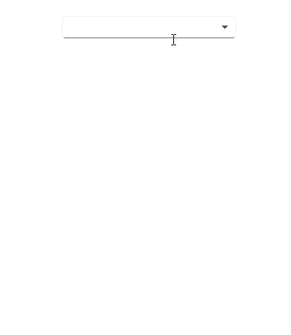
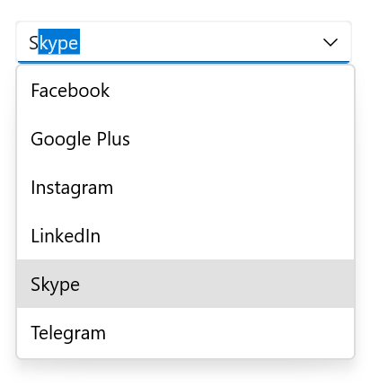

# Editing in .NET MAUI ComboBox (SfComboBox)

The [ComboBox](https://help.syncfusion.com/cr/maui/Syncfusion.Maui.Inputs.SfComboBox.html) control supports both editable and non-editable text boxes for selecting an item from a data source. To enable editing functionality, set [IsEditable](https://help.syncfusion.com/cr/maui/Syncfusion.Maui.Inputs.SfComboBox.html#Syncfusion_Maui_Inputs_SfComboBox_IsEditable) property as `true`. The default value is `false`.

## Editable ComboBox

In the editable mode, the [ComboBox](https://help.syncfusion.com/cr/maui/Syncfusion.Maui.Inputs.SfComboBox.html) allows users to edit in the text box and it automatically appends the remaining letters to the entered text when it is valid.




<editors:SfComboBox x:Name="comboBox"
                    WidthRequest="250"
                    HeightRequest = "50"
                    IsEditable="true"
                    ItemsSource="{Binding SocialMedias}"
                    DisplayMemberPath="Name"
                    TextMemberPath="Name">
</editors:SfComboBox>





SfComboBox comboBox = new SfComboBox(); 
comboBox.WidthRequest = 250;
comboBox.HeightRequest = 50;
comboBox.DisplayMemberPath = "Name";
comboBox.TextMemberPath = "Name";
comboBox.ItemsSource = socialMediaViewModel.SocialMedias;
comboBox.IsEditable = true;




The following image illustrates the result of the above code:

## Non-editable ComboBox

Non-editable mode prevents users from editing and instead allows them to select from the drop-down list.




<editors:SfComboBox x:Name="comboBox"
                    WidthRequest="250"
                    HeightRequest="50"
                    IsEditable="false"
                    ItemsSource="{Binding SocialMedias}"
                    DisplayMemberPath="Name"
                    TextMemberPath="Name">
</editors:SfComboBox>





SfComboBox comboBox = new SfComboBox(); 
comboBox.WidthRequest = 250;
comboBox.HeightRequest = 50;
comboBox.DisplayMemberPath = "Name";
comboBox.TextMemberPath = "Name";
comboBox.ItemsSource = socialMediaViewModel.SocialMedias;
comboBox.IsEditable = false;




The following gif image illustrates the result of the above code:

## Hide clear button in the editor

By default, the clear button `X` will be displayed in the editor of the ComboBox control, which can be used to clear the entered input. Hide the clear button in ComboBox control using the [IsClearButtonVisible](https://help.syncfusion.com/cr/maui/Syncfusion.Maui.Core.SfDropdownEntry.html#Syncfusion_Maui_Core_SfDropdownEntry_IsClearButtonVisibleProperty) property. The default value of the IsClearButtonVisible property value is `true`.




<editors:SfComboBox x:Name="comboBox"
                    WidthRequest="250"
                    HeightRequest="50"
                    IsEditable="true"
                    IsClearButtonVisible="false"
                    ItemsSource="{Binding SocialMedias}"
                    DisplayMemberPath="Name"
                    TextMemberPath="Name">
</editors:SfComboBox>





SfComboBox comboBox = new SfComboBox(); 
comboBox.WidthRequest = 250;
comboBox.HeightRequest = 50;
comboBox.IsEditable = true;
comboBox.DisplayMemberPath = "Name";
comboBox.TextMemberPath = "Name";
comboBox.ItemsSource = socialMediaViewModel.SocialMedias;
comboBox.IsClearButtonVisible = false;




N> The `IsClearButtonVisible` property has no effect in non-editable mode.

The following gif image illustrates the result of the above code:

