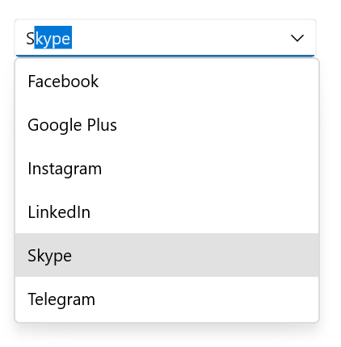

# Editing in .NET MAUI ComboBox

The [SfComboBox](https://help.syncfusion.com/cr/maui/Syncfusion.Maui.Inputs.SfComboBox.html) control supports both editable and non-editable text boxes for selecting an item from a data source. The editing behavior is controlled by the [IsEditable](https://help.syncfusion.com/cr/maui/Syncfusion.Maui.Inputs.SfComboBox.html#Syncfusion_Maui_Inputs_SfComboBox_IsEditable) `bool` property. The default value of `IsEditable` is `false`.

## Prerequisites

Before using the [SfComboBox](https://help.syncfusion.com/cr/maui/Syncfusion.Maui.Inputs.SfComboBox.html), ensure the following NuGet package is installed in your .NET MAUI project:

- `Syncfusion.Maui.Inputs`

For a step-by-step setup, refer to the [Getting Started](Getting-Started.md) documentation.

## Editable ComboBox

In editable mode, the [ComboBox](https://help.syncfusion.com/cr/maui/Syncfusion.Maui.Inputs.SfComboBox.html) allows users to type into the editor; when the entered text matches an item, the control automatically appends the remaining letters to complete the selection. To enable this behavior, set the [IsEditable](https://help.syncfusion.com/cr/maui/Syncfusion.Maui.Inputs.SfComboBox.html#Syncfusion_Maui_Inputs_SfComboBox_IsEditable) property to `true`.




<editors:SfComboBox x:Name="comboBox"
                    IsEditable="True"
                    ItemsSource="{Binding SocialMedias}"
                    DisplayMemberPath="Name"
                    TextMemberPath="Name">
    <editors:SfComboBox.BindingContext>
        <local:SocialMediaViewModel />
    </editors:SfComboBox.BindingContext>
</editors:SfComboBox>





SocialMediaViewModel socialMediaViewModel = new SocialMediaViewModel();

SfComboBox comboBox = new SfComboBox
{
    IsEditable = true,
    ItemsSource = socialMediaViewModel.SocialMedias,
    DisplayMemberPath = "Name",
    TextMemberPath = "Name",
};




// ViewModel
public class SocialMediaViewModel
{
    public ObservableCollection<SocialMedia> SocialMedias { get; set; }

    public SocialMediaViewModel()
    {
        this.SocialMedias = new ObservableCollection<SocialMedia>
        {
            new SocialMedia { Name = "Facebook", ID = 0 },
            new SocialMedia { Name = "Google Plus", ID = 1 },
            new SocialMedia { Name = "Instagram", ID = 2 },
            new SocialMedia { Name = "LinkedIn", ID = 3 },
            new SocialMedia { Name = "Skype", ID = 4 },
            new SocialMedia { Name = "Telegram", ID = 5 },
            new SocialMedia { Name = "Twitter", ID = 6 },
            new SocialMedia { Name = "WhatsApp", ID = 7 },
            new SocialMedia { Name = "YouTube", ID = 8 }
        };
    }
}

public class SocialMedia
{
    public string Name { get; set; }
    public int ID { get; set; }
}




The following image illustrates the result of the above code:

### Text

The [Text](https://help.syncfusion.com/cr/maui/Syncfusion.Maui.Inputs.DropDownControls.DropDownListBase.html#Syncfusion_Maui_Inputs_DropDownControls_DropDownListBase_Text) property gets or sets the user-submitted text in the [SfComboBox](https://help.syncfusion.com/cr/maui/Syncfusion.Maui.Inputs.SfComboBox.html) editor. The default value of `Text` is `string.Empty`.

## Non-editable ComboBox

In non-editable mode, the [ComboBox](https://help.syncfusion.com/cr/maui/Syncfusion.Maui.Inputs.SfComboBox.html) editor is read-only; users can only pick an item from the drop-down list and cannot type into the editor. This is the default behavior when `IsEditable` is `false`.




<editors:SfComboBox x:Name="comboBox"
                    IsEditable="False"
                    ItemsSource="{Binding SocialMedias}"
                    DisplayMemberPath="Name"
                    TextMemberPath="Name">
    <editors:SfComboBox.BindingContext>
        <local:SocialMediaViewModel />
    </editors:SfComboBox.BindingContext>
</editors:SfComboBox>





SocialMediaViewModel socialMediaViewModel = new SocialMediaViewModel();

SfComboBox comboBox = new SfComboBox
{
    IsEditable = false,
    ItemsSource = socialMediaViewModel.SocialMedias,
    DisplayMemberPath = "Name",
    TextMemberPath = "Name",
};




// ViewModel
public class SocialMediaViewModel
{
    public ObservableCollection<SocialMedia> SocialMedias { get; set; }

    public SocialMediaViewModel()
    {
        this.SocialMedias = new ObservableCollection<SocialMedia>
        {
            new SocialMedia { Name = "Facebook", ID = 0 },
            new SocialMedia { Name = "Google Plus", ID = 1 },
            new SocialMedia { Name = "Instagram", ID = 2 },
            new SocialMedia { Name = "LinkedIn", ID = 3 },
            new SocialMedia { Name = "Skype", ID = 4 },
            new SocialMedia { Name = "Telegram", ID = 5 },
            new SocialMedia { Name = "Twitter", ID = 6 },
            new SocialMedia { Name = "WhatsApp", ID = 7 },
            new SocialMedia { Name = "YouTube", ID = 8 }
        };
    }
}

public class SocialMedia
{
    public string Name { get; set; }
    public int ID { get; set; }
}




The following image illustrates the result of the above code:

## Clear button visibility

By default, the clear button `X` is displayed in the editor of the [ComboBox](https://help.syncfusion.com/cr/maui/Syncfusion.Maui.Inputs.SfComboBox.html) control and can be used to clear the entered input. Control the visibility of the clear button using the [IsClearButtonVisible](https://help.syncfusion.com/cr/maui/Syncfusion.Maui.Core.SfDropdownEntry.html#Syncfusion_Maui_Core_SfDropdownEntry_IsClearButtonVisible) property. The default value of `IsClearButtonVisible` is `true`, and it applies only to editable mode.




<editors:SfComboBox x:Name="comboBox"
                    IsEditable="true"
                    IsClearButtonVisible="false"
                    ItemsSource="{Binding SocialMedias}"
                    DisplayMemberPath="Name"
                    TextMemberPath="Name">
    <editors:SfComboBox.BindingContext>
        <local:SocialMediaViewModel />
    </editors:SfComboBox.BindingContext>
</editors:SfComboBox>





SocialMediaViewModel socialMediaViewModel = new SocialMediaViewModel();

SfComboBox comboBox = new SfComboBox
{
    IsEditable = true,
    IsClearButtonVisible = false,
    ItemsSource = socialMediaViewModel.SocialMedias,
    DisplayMemberPath = "Name",
    TextMemberPath = "Name",
};




// ViewModel
public class SocialMediaViewModel
{
    public ObservableCollection<SocialMedia> SocialMedias { get; set; }

    public SocialMediaViewModel()
    {
        this.SocialMedias = new ObservableCollection<SocialMedia>
        {
            new SocialMedia { Name = "Facebook", ID = 0 },
            new SocialMedia { Name = "Google Plus", ID = 1 },
            new SocialMedia { Name = "Instagram", ID = 2 },
            new SocialMedia { Name = "LinkedIn", ID = 3 },
            new SocialMedia { Name = "Skype", ID = 4 },
            new SocialMedia { Name = "Telegram", ID = 5 },
            new SocialMedia { Name = "Twitter", ID = 6 },
            new SocialMedia { Name = "WhatsApp", ID = 7 },
            new SocialMedia { Name = "YouTube", ID = 8 }
        };
    }
}

public class SocialMedia
{
    public string Name { get; set; }
    public int ID { get; set; }
}




N> The `IsClearButtonVisible` property has no effect in non-editable mode.

The following image illustrates the result of the above code:

## See Also

* [Getting started with .NET MAUI ComboBox](getting-started.md)
* [Selection in .NET MAUI ComboBox](Selection.md)
* [Filtering in .NET MAUI ComboBox](Filtering.md)
