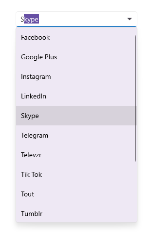

# Editing in .NET MAUI ComboBox (SfComboBox)

The `ComboBox` control supports both editable and non-editable text boxes for selecting an item from a data source. To enable editing functionality, set `IsEditable` property as `true`. The default value is `false`.

## Editable ComboBox

In editable mode, the `ComboBox` allows users to edit in the text box and it automatically appends the remaining letters to the entered text when it is valid.




<editors:SfComboBox x:Name="comboBox"
                    Width="250"
                    IsEditable="true"
                    ItemsSource="{Binding SocialMedias}"
                    DisplayMemberPath="Name"
                    TextMemberPath="Name">
</editors:SfComboBox>





comboBox.IsEditable = true;




The following image illustrates the result of the above code:

## Non-editable ComboBox

Non-editable mode prevents users from editing and instead allows them to select from drop-down list.




<editors:SfComboBox x:Name="comboBox"
                    Width="250"
                    IsEditable="false"
                    ItemsSource="{Binding SocialMedias}"
                    DisplayMemberPath="Name"
                    TextMemberPath="Name">
</editors:SfComboBox>





comboBox.IsEditable = false;




The following gif image illustrates the result of the above code:

## Hide clear button in the editor

By default, the clear button `X` will be displayed in the editor of the `ComboBox` control, which can be used to clear the entered input. Hide the clear button in `ComboBox` control using the `IsClearButtonVisible` property. The default value of `IsClearButtonVisible` property value is `true`.




<editors:SfComboBox x:Name="comboBox"
                    Width="250"
                    IsEditable="true"
                    IsClearButtonVisible="false"
                    ItemsSource="{Binding SocialMedias}"
                    DisplayMemberPath="Name"
                    TextMemberPath="Name">
</editors:SfComboBox>





comboBox.IsClearButtonVisible = false;




N> The `IsClearButtonVisible` property has no effect in non-editable mode.

The following gif image illustrates the result of the above code:

## Open a drop-down programmatically

In `ComboBox` control, the drop-down can be opened or closed programmatically by using the `IsDropDownOpen` property. The default value of `IsDropDownOpen` property is `false`. The following example shows how to open the drop-down when pressing alphabet keys in `ComboBox` control.




<editors:SfComboBox x:Name="comboBox"
                    Width="250"
                    IsEditable="true"
                    ItemsSource="{Binding SocialMedias}"
                    IsDropDownOpen = true;
                    DisplayMemberPath="Name"
                    TextMemberPath="Name">
</editors:SfComboBox>




comboBox.IsDropDownOpen = true;


