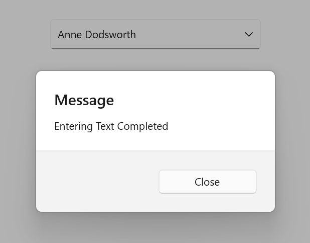

# Events in .NET MAUI ComboBox

This section explains the Events available in [.NET MAUI ComboBox](https://help.syncfusion.com/cr/maui/Syncfusion.Maui.Inputs.SfComboBox.html).

To get started quickly with customizing the appearance of the .NET MAUI ComboBox, you can watch this video:



## Prerequisites

Before using the [SfComboBox](https://help.syncfusion.com/cr/maui/Syncfusion.Maui.Inputs.SfComboBox.html), ensure the following NuGet package is installed in your .NET MAUI project:

- `Syncfusion.Maui.Inputs`

For a step-by-step setup, refer to the [Getting Started](https://help.syncfusion.com/maui/combobox/getting-started) documentation.

## Completed Event

The [Completed](https://help.syncfusion.com/cr/maui/Syncfusion.Maui.Inputs.DropDownControls.DropDownListBase.html#Syncfusion_Maui_Inputs_DropDownControls_DropDownListBase_Completed) event is raised when the user finalizes the text in the ComboBox editable mode by pressing return key on the keyboard.The handler for the event is a generic event handler, taking the `sender` and `EventArgs`(the `EventArgs` value is `string.Empty`):




<editors:SfComboBox x:Name="comboBox"
                    IsEditable="True"
                    ItemsSource="{Binding SocialMedias}"
                    TextMemberPath="Name"
                    DisplayMemberPath="Name" 
                    Completed="combobox_Completed"/>





SfComboBox combobox = new SfComboBox()
{
    IsEditable = true,
    ItemsSource = socialMediaViewModel.SocialMedias,
    TextMemberPath = "Name",
    DisplayMemberPath = "Name",
};
combobox.Completed += combobox_Completed;




// ViewModel
public class SocialMediaViewModel
{
    public ObservableCollection<SocialMedia> SocialMedias { get; set; }

    public SocialMediaViewModel()
    {
        this.SocialMedias = new ObservableCollection<SocialMedia>
        {
            new SocialMedia { Name = "Facebook", ID = 0 },
            new SocialMedia { Name = "Google Plus", ID = 1 },
            new SocialMedia { Name = "Instagram", ID = 2 },
            new SocialMedia { Name = "LinkedIn", ID = 3 },
            new SocialMedia { Name = "Skype", ID = 4 },
            new SocialMedia { Name = "Telegram", ID = 5 },
            new SocialMedia { Name = "Twitter", ID = 6 },
            new SocialMedia { Name = "WhatsApp", ID = 7 },
            new SocialMedia { Name = "YouTube", ID = 8 }
        };
    }
}

public class SocialMedia
{
    public string Name { get; set; }
    public int ID { get; set; }
}




The `Completed` event can be handled in C# as follows:




private async void combobox_Completed(object sender, EventArgs e)
{
    await DisplayAlert("Message", "Text entering Completed", "close");
}




The following image illustrates the result of the above code:

N> The `Completed` event is not supported in the Android platform.

## DropDownOpening Event

The [DropDownOpening](https://help.syncfusion.com/cr/maui/Syncfusion.Maui.Core.SfDropdownEntry.html#Syncfusion_Maui_Core_SfDropdownEntry_DropdownOpening) event will be fired whenever opening the dropdown menu in the ComboBox. It can cancel dropdown opening with `CancelEventArgs` that contains the following property:

 * Cancel: Dropdown opening is based on this value.





     <editors:SfComboBox x:Name="comboBox"
                         DropdownOpening="comboBox_DropdownOpening"
                         ItemsSource="{Binding SocialMedias}"
                         DisplayMemberPath="Name"
                         TextMemberPath="Name">
     </editors:SfComboBox>
    




    SfComboBox comboBox = new SfComboBox
    {
        ItemsSource = socialMediaViewModel.SocialMedias,
        DisplayMemberPath = "Name",
        TextMemberPath = "Name"
    };
   comboBox.DropdownOpening += comboBox_DropdownOpening;




// ViewModel
public class SocialMediaViewModel
{
    public ObservableCollection<SocialMedia> SocialMedias { get; set; }

    public SocialMediaViewModel()
    {
        this.SocialMedias = new ObservableCollection<SocialMedia>
        {
            new SocialMedia { Name = "Facebook", ID = 0 },
            new SocialMedia { Name = "Google Plus", ID = 1 },
            new SocialMedia { Name = "Instagram", ID = 2 },
            new SocialMedia { Name = "LinkedIn", ID = 3 },
            new SocialMedia { Name = "Skype", ID = 4 },
            new SocialMedia { Name = "Telegram", ID = 5 },
            new SocialMedia { Name = "Twitter", ID = 6 },
            new SocialMedia { Name = "WhatsApp", ID = 7 },
            new SocialMedia { Name = "YouTube", ID = 8 }
        };
    }
}

public class SocialMedia
{
    public string Name { get; set; }
    public int ID { get; set; }
}




The `DropdownOpening` event can be handled in C# as follows:




    
     private void comboBox_DropdownOpening(object sender, CancelEventArgs e)
     {
         e.Cancel = true; // If you want to restrict the dropdown open then set the e.Cancel is true. 
     }





## DropDownOpened Event

The [DropDownOpened](https://help.syncfusion.com/cr/maui/Syncfusion.Maui.Core.SfDropdownEntry.html#Syncfusion_Maui_Core_SfDropdownEntry_DropdownOpened) event occurs when the ComboBox drop-down is opened.





<editors:SfComboBox x:Name="comboBox"
                    DropdownOpened="comboBox_DropdownOpened"
                    ItemsSource="{Binding SocialMedias}"
                    DisplayMemberPath="Name"
                    TextMemberPath="Name">   
</editors:SfComboBox>
 




SfComboBox comboBox = new SfComboBox
{
    ItemsSource = socialMediaViewModel.SocialMedias,
    DisplayMemberPath = "Name",
    TextMemberPath = "Name"
};
comboBox.DropdownOpened += comboBox_DropdownOpened;




// ViewModel
public class SocialMediaViewModel
{
    public ObservableCollection<SocialMedia> SocialMedias { get; set; }

    public SocialMediaViewModel()
    {
        this.SocialMedias = new ObservableCollection<SocialMedia>
        {
            new SocialMedia { Name = "Facebook", ID = 0 },
            new SocialMedia { Name = "Google Plus", ID = 1 },
            new SocialMedia { Name = "Instagram", ID = 2 },
            new SocialMedia { Name = "LinkedIn", ID = 3 },
            new SocialMedia { Name = "Skype", ID = 4 },
            new SocialMedia { Name = "Telegram", ID = 5 },
            new SocialMedia { Name = "Twitter", ID = 6 },
            new SocialMedia { Name = "WhatsApp", ID = 7 },
            new SocialMedia { Name = "YouTube", ID = 8 }
        };
    }
}

public class SocialMedia
{
    public string Name { get; set; }
    public int ID { get; set; }
}




The `DropdownOpened` event can be handled in C# as follows:





private void comboBox_DropdownOpened(object sender, EventArgs e)
{
    // Triggered when dropdown is opened
}





## DropDownClosed Event

The [DropDownClosed](https://help.syncfusion.com/cr/maui/Syncfusion.Maui.Inputs.DropDownControls.DropDownListBase.html#Syncfusion_Maui_Inputs_DropDownControls_DropDownListBase_DropDownClosed) event occurs when the ComboBox drop-down is closed.




<editors:SfComboBox x:Name="comboBox"
                    ItemsSource="{Binding SocialMedias}"
                    DisplayMemberPath="Name"
                    TextMemberPath="Name"
                    DropDownClosed="SfComboBox_DropDownClosed"/>



SfComboBox comboBox = new SfComboBox
{
    ItemsSource = socialMediaViewModel.SocialMedias,
    DisplayMemberPath = "Name",
    TextMemberPath = "Name"
};
comboBox.DropDownClosed += SfComboBox_DropDownClosed;




// ViewModel
public class SocialMediaViewModel
{
    public ObservableCollection<SocialMedia> SocialMedias { get; set; }

    public SocialMediaViewModel()
    {
        this.SocialMedias = new ObservableCollection<SocialMedia>
        {
            new SocialMedia { Name = "Facebook", ID = 0 },
            new SocialMedia { Name = "Google Plus", ID = 1 },
            new SocialMedia { Name = "Instagram", ID = 2 },
            new SocialMedia { Name = "LinkedIn", ID = 3 },
            new SocialMedia { Name = "Skype", ID = 4 },
            new SocialMedia { Name = "Telegram", ID = 5 },
            new SocialMedia { Name = "Twitter", ID = 6 },
            new SocialMedia { Name = "WhatsApp", ID = 7 },
            new SocialMedia { Name = "YouTube", ID = 8 }
        };
    }
}

public class SocialMedia
{
    public string Name { get; set; }
    public int ID { get; set; }
}




The `DropDownClosed` event can be handled in C# as follows:



    
private void SfComboBox_DropDownClosed(object sender, EventArgs e)
{
    DisplayAlert("Message", "DropDown Closed", "close");
}




N> When `WindowSoftInputModeAdjust.Resize` is set in the sample and `ComboBox` is placed inside a `ScrollView`, the dropdown may close unexpectedly due to layout resizing. To prevent this, override `OnSizeAllocated` and handle the `DropDownClosing`. For more details, refer to the [KB article](https://support.syncfusion.com/agent/kb/19349).

## ValueChanged Event
When the value of comboBox changes, the [ValueChanged](https://help.syncfusion.com/cr/maui/Syncfusion.Maui.Inputs.SfComboBox.html#Syncfusion_Maui_Inputs_SfComboBox_ValueChanged) event is triggered. This event is raised when the value changes due to user interaction, programmatic updates, or any other mechanism. It provides both `OldValue` and `NewValue`, allowing for responsive handling of changes. The ValueChanged event contains the following properties:

* `OldValue` - Contains the previous text value before the change.
* `NewValue` - Contains the new text value after the change.




<editors:SfComboBox x:Name="comboBox" 
                    TextMemberPath="Name" 
                    DisplayMemberPath="Name" 
                    ItemsSource="{Binding SocialMedias}" 
                    ValueChanged="OnValueChanged" />





SfComboBox comboBox = new SfComboBox
{
    ItemsSource = socialMediaViewModel.SocialMedias,
    DisplayMemberPath = "Name",
    TextMemberPath = "Name"
};
comboBox.ValueChanged += OnValueChanged;




// ViewModel
public class SocialMediaViewModel
{
    public ObservableCollection<SocialMedia> SocialMedias { get; set; }

    public SocialMediaViewModel()
    {
        this.SocialMedias = new ObservableCollection<SocialMedia>
        {
            new SocialMedia { Name = "Facebook", ID = 0 },
            new SocialMedia { Name = "Google Plus", ID = 1 },
            new SocialMedia { Name = "Instagram", ID = 2 },
            new SocialMedia { Name = "LinkedIn", ID = 3 },
            new SocialMedia { Name = "Skype", ID = 4 },
            new SocialMedia { Name = "Telegram", ID = 5 },
            new SocialMedia { Name = "Twitter", ID = 6 },
            new SocialMedia { Name = "WhatsApp", ID = 7 },
            new SocialMedia { Name = "YouTube", ID = 8 }
        };
    }
}

public class SocialMedia
{
    public string Name { get; set; }
    public int ID { get; set; }
}




The `ValueChanged` event can be handled as follows:




private async void OnValueChanged(object sender, ComboBoxValueChangedEventArgs e)
{
    await DisplayAlert("Alert", "Value has changed to: " + e.NewValue.ToString(), "Ok");
}



 
 

## ClearButtonClicked Event

The [ClearButtonClicked](https://help.syncfusion.com/cr/maui/Syncfusion.Maui.Inputs.SfComboBox.html#Syncfusion_Maui_Inputs_SfComboBox_ClearButtonClicked) event is raised when the user activates the clear button in the `ComboBox` editable mode by tapping or pressing the clear button on the keyboard. The handler for the event is a generic event handler, taking the `sender` and `EventArgs`.




<editors:SfComboBox x:Name="comboBox"
                    ItemsSource="{Binding SocialMedias}"
                    TextMemberPath="Name"
                    DisplayMemberPath="Name"
                    ClearButtonClicked="comboBox_ClearButtonClicked"/>




SfComboBox comboBox = new SfComboBox
{
    ItemsSource = socialMediaViewModel.SocialMedias,
    TextMemberPath = "Name",
    DisplayMemberPath = "Name"
};
comboBox.ClearButtonClicked += comboBox_ClearButtonClicked;




// ViewModel
public class SocialMediaViewModel
{
    public ObservableCollection<SocialMedia> SocialMedias { get; set; }

    public SocialMediaViewModel()
    {
        this.SocialMedias = new ObservableCollection<SocialMedia>
        {
            new SocialMedia { Name = "Facebook", ID = 0 },
            new SocialMedia { Name = "Google Plus", ID = 1 },
            new SocialMedia { Name = "Instagram", ID = 2 },
            new SocialMedia { Name = "LinkedIn", ID = 3 },
            new SocialMedia { Name = "Skype", ID = 4 },
            new SocialMedia { Name = "Telegram", ID = 5 },
            new SocialMedia { Name = "Twitter", ID = 6 },
            new SocialMedia { Name = "WhatsApp", ID = 7 },
            new SocialMedia { Name = "YouTube", ID = 8 }
        };
    }
}

public class SocialMedia
{
    public string Name { get; set; }
    public int ID { get; set; }
}




The `ClearButtonClicked` event can be handled as follows:



    
private async void comboBox_ClearButtonClicked(object sender, EventArgs e)
{
   await DisplayAlert("Message", "Clear Button Clicked", "ok");
}




## See Also

* [Header and footer](https://help.syncfusion.com/maui/combobox/header-and-footer)
* [No results found](https://help.syncfusion.com/maui/combobox/no-results-found)
* [Liquid Glass support](https://help.syncfusion.com/maui/combobox/liquidglasssupport)