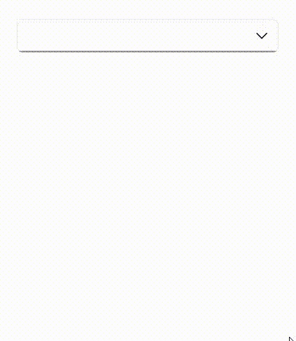

# Filtering in .NET MAUI ComboBox (SfComboBox)

The [ComboBox](https://help.syncfusion.com/cr/maui/Syncfusion.Maui.Inputs.SfComboBox.html) has built-in support to filter data items depending on the text entered in the editing text box. The filter operation starts as soon as you start typing characters in the component.

## Enable filtering

To enable filtering functionality in `ComboBox` control, set the [IsFilteringEnabled](https://help.syncfusion.com/cr/maui/Syncfusion.Maui.Inputs.SfComboBox.html#Syncfusion_Maui_Inputs_SfComboBox_IsFilteringEnabled) and [IsEditable](https://help.syncfusion.com/cr/maui/Syncfusion.Maui.Inputs.SfComboBox.html#Syncfusion_Maui_Inputs_SfComboBox_IsEditable) properties as `true`. The default value is `false`. The drop-down will open automatically as soon as you start typing characters in the `ComboBox` control.




//Model.cs
public class CityInfo
{
    public string CityName { get; set; }
    public string CountryName { get; set; }
    public bool IsCapital { get; set; }
}

//ViewModel.cs
public class CityViewModel
{
    public ObservableCollection<CityInfo> Cities { get; set; }
    public CityViewModel()
    {
        this.Cities = new ObservableCollection<CityInfo>();
        this.Cities.Add(new CityInfo() { CityName= "Chicago", CountryName= "USA" });
        this.Cities.Add(new CityInfo() { CityName= "Los Angeles", CountryName= "USA" });          
        this.Cities.Add(new CityInfo() { CityName= "Houston", CountryName= "USA" });
        this.Cities.Add(new CityInfo() { CityName= "New York", CountryName= "USA" });
        this.Cities.Add(new CityInfo() { CityName = "Washington", CountryName = "USA", IsCapital = true });
        this.Cities.Add(new CityInfo() { CityName= "Chennai", CountryName= "India" });
        this.Cities.Add(new CityInfo() { CityName= "Delhi", CountryName= "India", IsCapital = true });
        this.Cities.Add(new CityInfo() { CityName= "Kolkata", CountryName= "India" });
        this.Cities.Add(new CityInfo() { CityName= "Mumbai", CountryName= "India" });
        this.Cities.Add(new CityInfo() { CityName= "Berlin", CountryName= "Germany", IsCapital = true });
        this.Cities.Add(new CityInfo() { CityName= "Cologne", CountryName= "Germany" });
        this.Cities.Add(new CityInfo() { CityName= "Hamburg", CountryName= "Germany" });
        this.Cities.Add(new CityInfo() { CityName= "Munich", CountryName= "Germany" });
        this.Cities.Add(new CityInfo() { CityName= "Quebec City", CountryName= "Canada" });
        this.Cities.Add(new CityInfo() { CityName= "Ottawa", CountryName= "Canada", IsCapital = true });
        this.Cities.Add(new CityInfo() { CityName= "Toronto", CountryName= "Canada" });
        this.Cities.Add(new CityInfo() { CityName= "Vancouver", CountryName= "Canada" });
        this.Cities.Add(new CityInfo() { CityName= "Victoria", CountryName= "Canada" });
        this.Cities.Add(new CityInfo() { CityName= "London", CountryName= "England", IsCapital = true });
        this.Cities.Add(new CityInfo() { CityName= "Bath", CountryName= "England" });
        this.Cities.Add(new CityInfo() { CityName= "Manchester", CountryName= "England" });
        this.Cities.Add(new CityInfo() { CityName= "Oxford", CountryName= "England" });
        this.Cities.Add(new CityInfo() { CityName= "Bandung", CountryName= "Indonesia" });
        this.Cities.Add(new CityInfo() { CityName= "Jakarta", CountryName= "Indonesia", IsCapital = true });
        this.Cities.Add(new CityInfo() { CityName= "Depok", CountryName= "Indonesia" });
        this.Cities.Add(new CityInfo() { CityName= "Makassar", CountryName= "Indonesia" });
        this.Cities.Add(new CityInfo() { CityName= "Surabaya", CountryName= "Indonesia" });
    }
}







<editors:SfComboBox x:Name="comboBox"
                    IsEditable="true"
                    IsFilteringEnabled="true"
                    ItemsSource="{Binding Cities}"
                    TextMemberPath="CityName"
                    DisplayMemberPath="CityName">
        <editors:SfComboBox.BindingContext>
            <local:CityViewModel/>
        </editors:SfComboBox.BindingContext>
</editors:SfComboBox>





using Syncfusion.Maui.Inputs;

CityViewModel cityViewModel = new CityViewModel();
StackLayout stack = new StackLayout();
SfComboBox comboBox;
comboBox = new SfComboBox
{
    WidthRequest = 200,
    HeightRequest = 50,
    IsEditable = true,
    IsFilteringEnabled = true,
    ItemsSource = cityViewModel.Cities,
    TextMemberPath = "Name",
    DisplayMemberPath = "Name",
    BindingContext = cityViewModel
};
stack.Children.Add(comboBox);
this.Content = stack;




N> Filtering will be supported only for editable mode.

## Filter mode

The string comparison for filtering suggestions can be changed using the [TextSearchMode](https://help.syncfusion.com/cr/maui/Syncfusion.Maui.Inputs.SfComboBox.html#Syncfusion_Maui_Inputs_SfComboBox_TextSearchMode) property. The default filtering type is `StartsWith`, ignoring accent and it is case insensitive. The available filtering modes are,

* StartsWith
* Contains

### Filter with beginning text

Filter the matching items based on the starting text and the first filtered item will be appended to the typed input and highlighted in the drop-down. 




<editors:SfComboBox x:Name="comboBox"
                    TextSearchMode="StartsWith"
                    IsEditable="true"
                    IsFilteringEnabled="true"
                    ItemsSource="{Binding Cities}"
                    TextMemberPath="CityName"
                    DisplayMemberPath="CityName" />
       



using Syncfusion.Maui.Inputs;

CityViewModel cityViewModel = new CityViewModel();
StackLayout stack = new StackLayout();
SfComboBox comboBox;
comboBox = new SfComboBox
{
    WidthRequest = 200,
    HeightRequest = 50,
    TextSearchMode = ComboBoxTextSearchMode.StartsWith,
    IsEditable = true,
    IsFilteringEnabled = true,
    ItemsSource = cityViewModel.Cities,
    TextMemberPath = "Name",
    DisplayMemberPath = "Name",
    BindingContext = cityViewModel
};
stack.Children.Add(comboBox);
this.Content = stack;




### Filter with contains text

Filter the matching items that contain specific text, and the first filtered item will be highlighted in the drop-down.




<editors:SfComboBox x:Name="comboBox"
                    TextSearchMode="Contains"
                    IsEditable="true"
                    IsFilteringEnabled="true"
                    ItemsSource="{Binding Cities}"
                    TextMemberPath="CityName"
                    DisplayMemberPath="CityName" />





using Syncfusion.Maui.Inputs;

CityViewModel cityViewModel = new CityViewModel();
StackLayout stack = new StackLayout();
SfComboBox comboBox;
comboBox = new SfComboBox
{
    WidthRequest = 200,
    HeightRequest = 50,
    TextSearchMode = ComboBoxTextSearchMode.Contains,
    IsEditable = true,
    IsFilteringEnabled = true,
    ItemsSource = cityViewModel.Cities,
    TextMemberPath = "Name",
    DisplayMemberPath = "Name",
    BindingContext = cityViewModel
};
stack.Children.Add(comboBox);
this.Content = stack;




N> Auto appending of the first suggested item text to typed input is not supported in this mode.

### Custom filtering

The ComboBox control provides support to apply your own custom filter logic to suggest the items based on your filter criteria by using the [FilterBehavior](https://help.syncfusion.com/cr/maui/Syncfusion.Maui.Inputs.SfComboBox.html#Syncfusion_Maui_Inputs_SfComboBox_FilterBehavior) property. The default value of `FilterBehavior` is `null`.

Now, let us create custom filtering class to apply our own filter logic to ComboBox control by the following steps.

**Step 1:** Create a class that derives from the [IComboBoxFilterBehavior](https://help.syncfusion.com/cr/maui/Syncfusion.Maui.Inputs.IComboBoxFilterBehavior.html) interface. 




/// 

/// Represents a custom filtering behavior for `ComboBox` control. 
/// 

public class CityFilteringBehavior : IComboBoxFilterBehavior
{

}




**Step 2:** Then, implement the [GetMatchingIndexes](https://help.syncfusion.com/cr/maui/Syncfusion.Maui.Inputs.ComboBoxFilterBehavior.html#Syncfusion_Maui_Inputs_ComboBoxFilterBehavior_GetMatchingIndexes_Syncfusion_Maui_Inputs_SfComboBox_Syncfusion_Maui_Inputs_ComboBoxFilterInfo_) method of IComboBoxFilterBehavior interface to create your own suggestion list (containing the indices of the filtered items) based on the text entered in the ComboBox control that needs to be shown in drop-down. The `GetMatchingIndexes` method contains following arguments:

* [source](https://help.syncfusion.com/cr/maui/Syncfusion.Maui.Inputs.SfComboBox.html) - The owner of the filter behavior, which holds information about ItemsSource, Items properties, and so on.
* [filterInfo](https://help.syncfusion.com/cr/maui/Syncfusion.Maui.Inputs.ComboBoxFilterInfo.html) - Contains details about the text entered in ComboBox control. Using this text, you can prepare a suggestion list, which gets displayed in the drop-down list. 

The following code demonstrates how to filter the cities based on the city or country name entered in the ComboBox control.




/// 

/// Represents a custom filtering behavior for `ComboBox` control. 
/// 

public class CityFilteringBehavior : IComboBoxFilterBehavior
{
    /// 

    /// Returned suggestion list based on the city or country name entered in the ComboBox control.
    /// 

    public List<int> GetMatchingIndexes(SfComboBox source, ComboBoxFilterInfo filterInfo)
    {
        List<int> filteredlist = new List<int>();
        ObservableCollection<CityInfo> cityItems = (ObservableCollection<CityInfo>)source.ItemsSource;

            filteredlist.AddRange(from CityInfo item in cityItems
                                  where item.CountryName.StartsWith(filterInfo.Text, StringComparison.CurrentCultureIgnoreCase) ||
                                        item.CityName.StartsWith(filterInfo.Text, StringComparison.CurrentCultureIgnoreCase)
                                  select cityItems.IndexOf(item));

            return filteredlist;
    }
}




**Step3:** Apply custom filtering to the ComboBox control by using the `FilterBehavior` property. 




<editors:SfComboBox TextMemberPath="CityName"
                    DisplayMemberPath="CityName"
                    IsEditable="True"
                    IsFilteringEnabled="True"
                    ItemsSource="{Binding Cities}">
        <editors:SfComboBox.FilterBehavior>
            <local:CityFilteringBehavior/>
        </editors:SfComboBox.FilterBehavior>
</editors:SfComboBox>





CityViewModel cityViewModel = new CityViewModel();  
CityFilteringBehavior cityFilteringBehavior = new CityFilteringBehavior();
StackLayout stack = new StackLayout();
SfComboBox comboBox;
comboBox = new SfComboBox
{
    WidthRequest = 200,
    HeightRequest = 50,
    IsEditable = true,
    FilterBehavior = cityFilteringBehavior,
    IsFilteringEnabled = true,
    ItemsSource = cityViewModel.Cities,
    TextMemberPath = "CityName",
    DisplayMemberPath = "CityName",
    BindingContext = cityViewModel
};
stack.Children.Add(comboBox);
this.Content = stack;




The following gif demonstrates how to display the cities in drop-down based on the country name entered in the ComboBox control.

