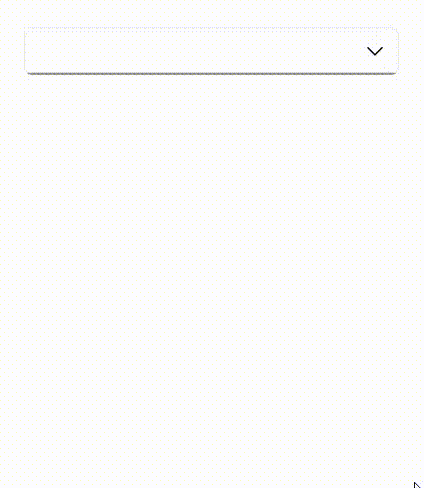

# Filtering in .NET MAUI ComboBox

The [SfComboBox](https://help.syncfusion.com/cr/maui/Syncfusion.Maui.Inputs.SfComboBox.html) has built-in support to filter the items displayed in the drop-down based on the text typed into the editor. The filter operation starts as soon as the user types a character, and matching is performed against the value of [DisplayMemberPath](https://help.syncfusion.com/cr/maui/Syncfusion.Maui.Inputs.DropDownControls.DropDownListBase.html#Syncfusion_Maui_Inputs_DropDownControls_DropDownListBase_DisplayMemberPath).

## Prerequisites

Before using the [SfComboBox](https://help.syncfusion.com/cr/maui/Syncfusion.Maui.Inputs.SfComboBox.html), ensure the following NuGet package is installed in your .NET MAUI project:

- `Syncfusion.Maui.Inputs`

For a step-by-step setup, refer to the [Getting Started](https://help.syncfusion.com/maui/combobox/getting-started) documentation.

## Enable filtering

To enable filtering in the [SfComboBox](https://help.syncfusion.com/cr/maui/Syncfusion.Maui.Inputs.SfComboBox.html), set the [IsFilteringEnabled](https://help.syncfusion.com/cr/maui/Syncfusion.Maui.Inputs.SfComboBox.html#Syncfusion_Maui_Inputs_SfComboBox_IsFilteringEnabled) `bool` property and the [IsEditable](https://help.syncfusion.com/cr/maui/Syncfusion.Maui.Inputs.SfComboBox.html#Syncfusion_Maui_Inputs_SfComboBox_IsEditable) `bool` property to `true`. Both default to `false`. When both are enabled, the drop-down opens automatically as soon as the user types a character in the editor.

### Step 1: Define the model and view model

Define a `CityInfo` model and a `CityViewModel` that exposes a `Cities` collection.




public class CityInfo
{
    public string CityName { get; set; }
    public string CountryName { get; set; }
    public bool IsCapital { get; set; }
}

public class CityViewModel
{
    public ObservableCollection<CityInfo> Cities { get; set; }

    public CityViewModel()
    {
        this.Cities = new ObservableCollection<CityInfo>
        {
            new CityInfo { CityName = "Chicago",    CountryName = "USA" },
            new CityInfo { CityName = "Los Angeles",CountryName = "USA" },
            new CityInfo { CityName = "Houston",    CountryName = "USA" },
            new CityInfo { CityName = "New York",   CountryName = "USA" },
            new CityInfo { CityName = "Washington", CountryName = "USA",      IsCapital = true },
            new CityInfo { CityName = "Chennai",    CountryName = "India" },
            new CityInfo { CityName = "Delhi",      CountryName = "India",    IsCapital = true },
            new CityInfo { CityName = "Kolkata",    CountryName = "India" },
            new CityInfo { CityName = "Mumbai",     CountryName = "India" },
            new CityInfo { CityName = "Berlin",     CountryName = "Germany",  IsCapital = true },
            new CityInfo { CityName = "Cologne",    CountryName = "Germany" },
            new CityInfo { CityName = "Hamburg",    CountryName = "Germany" },
            new CityInfo { CityName = "Munich",     CountryName = "Germany" },
            new CityInfo { CityName = "Quebec City",CountryName = "Canada" },
            new CityInfo { CityName = "Ottawa",     CountryName = "Canada",   IsCapital = true },
            new CityInfo { CityName = "Toronto",    CountryName = "Canada" },
            new CityInfo { CityName = "Vancouver",  CountryName = "Canada" },
            new CityInfo { CityName = "Victoria",   CountryName = "Canada" },
            new CityInfo { CityName = "London",     CountryName = "England",  IsCapital = true },
            new CityInfo { CityName = "Bath",       CountryName = "England" },
            new CityInfo { CityName = "Manchester", CountryName = "England" },
            new CityInfo { CityName = "Oxford",     CountryName = "England" },
            new CityInfo { CityName = "Bandung",    CountryName = "Indonesia" },
            new CityInfo { CityName = "Jakarta",    CountryName = "Indonesia",IsCapital = true },
            new CityInfo { CityName = "Depok",      CountryName = "Indonesia" },
            new CityInfo { CityName = "Makassar",   CountryName = "Indonesia" },
            new CityInfo { CityName = "Surabaya",   CountryName = "Indonesia" },
        };
    }
}




### Step 2: Add the ComboBox with filtering enabled




<editors:SfComboBox x:Name="comboBox"
                    IsEditable="true"
                    IsFilteringEnabled="true"
                    ItemsSource="{Binding Cities}"
                    TextMemberPath="CityName"
                    DisplayMemberPath="CityName">
    <editors:SfComboBox.BindingContext>
        <local:CityViewModel />
    </editors:SfComboBox.BindingContext>
</editors:SfComboBox>





CityViewModel cityViewModel = new CityViewModel();

SfComboBox comboBox = new SfComboBox
{
    IsEditable = true,
    IsFilteringEnabled = true,
    ItemsSource = cityViewModel.Cities,
    TextMemberPath = "CityName",
    DisplayMemberPath = "CityName",
    BindingContext = cityViewModel,
};




public class CityInfo
{
    public string CityName { get; set; }
    public string CountryName { get; set; }
    public bool IsCapital { get; set; }
}

// ViewModel
public class CityViewModel
{
    public ObservableCollection<CityInfo> Cities { get; set; }

    public CityViewModel()
    {
        this.Cities = new ObservableCollection<CityInfo>
        {
            new CityInfo { CityName = "Chicago",    CountryName = "USA" },
            new CityInfo { CityName = "Los Angeles",CountryName = "USA" },
            new CityInfo { CityName = "Houston",    CountryName = "USA" },
            new CityInfo { CityName = "New York",   CountryName = "USA" },
            new CityInfo { CityName = "Washington", CountryName = "USA",      IsCapital = true },
            new CityInfo { CityName = "Chennai",    CountryName = "India" },
            new CityInfo { CityName = "Delhi",      CountryName = "India",    IsCapital = true },
            new CityInfo { CityName = "Kolkata",    CountryName = "India" },
            new CityInfo { CityName = "Mumbai",     CountryName = "India" },
            new CityInfo { CityName = "Berlin",     CountryName = "Germany",  IsCapital = true },
            new CityInfo { CityName = "Cologne",    CountryName = "Germany" },
            new CityInfo { CityName = "Hamburg",    CountryName = "Germany" },
            new CityInfo { CityName = "Munich",     CountryName = "Germany" },
            new CityInfo { CityName = "Quebec City",CountryName = "Canada" },
            new CityInfo { CityName = "Ottawa",     CountryName = "Canada",   IsCapital = true },
            new CityInfo { CityName = "Toronto",    CountryName = "Canada" },
            new CityInfo { CityName = "Vancouver",  CountryName = "Canada" },
            new CityInfo { CityName = "Victoria",   CountryName = "Canada" },
            new CityInfo { CityName = "London",     CountryName = "England",  IsCapital = true },
            new CityInfo { CityName = "Bath",       CountryName = "England" },
            new CityInfo { CityName = "Manchester", CountryName = "England" },
            new CityInfo { CityName = "Oxford",     CountryName = "England" },
            new CityInfo { CityName = "Bandung",    CountryName = "Indonesia" },
            new CityInfo { CityName = "Jakarta",    CountryName = "Indonesia",IsCapital = true },
            new CityInfo { CityName = "Depok",      CountryName = "Indonesia" },
            new CityInfo { CityName = "Makassar",   CountryName = "Indonesia" },
            new CityInfo { CityName = "Surabaya",   CountryName = "Indonesia" },
        };
    }
}




N> Filtering is supported only when `IsEditable` is `true`.

## Filter mode

The string comparison used to filter suggestions is controlled by the [TextSearchMode](https://help.syncfusion.com/cr/maui/Syncfusion.Maui.Inputs.SfComboBox.html#Syncfusion_Maui_Inputs_SfComboBox_TextSearchMode) property. The default value is `StartsWith`, and matching is case-insensitive and accent-insensitive. The available modes are:

* `StartsWith` - Filters items whose values starts with the typed text. The first match is auto-appended to the editor.
* `Contains` - Filters items whose values contain the typed text anywhere.

### Filter with beginning text

Filters items whose values starts with the typed text, and the first match is auto-appended to the editor and highlighted in the drop-down.




<editors:SfComboBox x:Name="comboBox"
                    TextSearchMode="StartsWith"
                    IsEditable="true"
                    IsFilteringEnabled="true"
                    ItemsSource="{Binding Cities}"
                    TextMemberPath="CityName"
                    DisplayMemberPath="CityName">
    <editors:SfComboBox.BindingContext>
        <local:CityViewModel />
    </editors:SfComboBox.BindingContext>
</editors:SfComboBox>




CityViewModel cityViewModel = new CityViewModel();

SfComboBox comboBox = new SfComboBox
{
    TextSearchMode = ComboBoxTextSearchMode.StartsWith,
    IsEditable = true,
    IsFilteringEnabled = true,
    ItemsSource = cityViewModel.Cities,
    TextMemberPath = "CityName",
    DisplayMemberPath = "CityName",
    BindingContext = cityViewModel,
};




public class CityInfo
{
    public string CityName { get; set; }
    public string CountryName { get; set; }
    public bool IsCapital { get; set; }
}

// ViewModel
public class CityViewModel
{
    public ObservableCollection<CityInfo> Cities { get; set; }

    public CityViewModel()
    {
        this.Cities = new ObservableCollection<CityInfo>
        {
            new CityInfo { CityName = "Chicago",    CountryName = "USA" },
            new CityInfo { CityName = "Los Angeles",CountryName = "USA" },
            new CityInfo { CityName = "Houston",    CountryName = "USA" },
            new CityInfo { CityName = "New York",   CountryName = "USA" },
            new CityInfo { CityName = "Washington", CountryName = "USA",      IsCapital = true },
            new CityInfo { CityName = "Chennai",    CountryName = "India" },
            new CityInfo { CityName = "Delhi",      CountryName = "India",    IsCapital = true },
            new CityInfo { CityName = "Kolkata",    CountryName = "India" },
            new CityInfo { CityName = "Mumbai",     CountryName = "India" },
            new CityInfo { CityName = "Berlin",     CountryName = "Germany",  IsCapital = true },
            new CityInfo { CityName = "Cologne",    CountryName = "Germany" },
            new CityInfo { CityName = "Hamburg",    CountryName = "Germany" },
            new CityInfo { CityName = "Munich",     CountryName = "Germany" },
            new CityInfo { CityName = "Quebec City",CountryName = "Canada" },
            new CityInfo { CityName = "Ottawa",     CountryName = "Canada",   IsCapital = true },
            new CityInfo { CityName = "Toronto",    CountryName = "Canada" },
            new CityInfo { CityName = "Vancouver",  CountryName = "Canada" },
            new CityInfo { CityName = "Victoria",   CountryName = "Canada" },
            new CityInfo { CityName = "London",     CountryName = "England",  IsCapital = true },
            new CityInfo { CityName = "Bath",       CountryName = "England" },
            new CityInfo { CityName = "Manchester", CountryName = "England" },
            new CityInfo { CityName = "Oxford",     CountryName = "England" },
            new CityInfo { CityName = "Bandung",    CountryName = "Indonesia" },
            new CityInfo { CityName = "Jakarta",    CountryName = "Indonesia",IsCapital = true },
            new CityInfo { CityName = "Depok",      CountryName = "Indonesia" },
            new CityInfo { CityName = "Makassar",   CountryName = "Indonesia" },
            new CityInfo { CityName = "Surabaya",   CountryName = "Indonesia" },
        };
    }
}




The following image illustrates the result of the above code:

### Filter with contains text

Filters items whose values contain the typed text anywhere.. The first match is highlighted in the drop-down, but it is not auto-appended to the editor.




<editors:SfComboBox x:Name="comboBox"
                    TextSearchMode="Contains"
                    IsEditable="true"
                    IsFilteringEnabled="true"
                    ItemsSource="{Binding Cities}"
                    TextMemberPath="CityName"
                    DisplayMemberPath="CityName">
    <editors:SfComboBox.BindingContext>
        <local:CityViewModel />
    </editors:SfComboBox.BindingContext>
</editors:SfComboBox>





CityViewModel cityViewModel = new CityViewModel();

SfComboBox comboBox = new SfComboBox
{
    TextSearchMode = ComboBoxTextSearchMode.Contains,
    IsEditable = true,
    IsFilteringEnabled = true,
    ItemsSource = cityViewModel.Cities,
    TextMemberPath = "CityName",
    DisplayMemberPath = "CityName",
    BindingContext = cityViewModel,
};




public class CityInfo
{
    public string CityName { get; set; }
    public string CountryName { get; set; }
    public bool IsCapital { get; set; }
}

// ViewModel
public class CityViewModel
{
    public ObservableCollection<CityInfo> Cities { get; set; }

    public CityViewModel()
    {
        this.Cities = new ObservableCollection<CityInfo>
        {
            new CityInfo { CityName = "Chicago",    CountryName = "USA" },
            new CityInfo { CityName = "Los Angeles",CountryName = "USA" },
            new CityInfo { CityName = "Houston",    CountryName = "USA" },
            new CityInfo { CityName = "New York",   CountryName = "USA" },
            new CityInfo { CityName = "Washington", CountryName = "USA",      IsCapital = true },
            new CityInfo { CityName = "Chennai",    CountryName = "India" },
            new CityInfo { CityName = "Delhi",      CountryName = "India",    IsCapital = true },
            new CityInfo { CityName = "Kolkata",    CountryName = "India" },
            new CityInfo { CityName = "Mumbai",     CountryName = "India" },
            new CityInfo { CityName = "Berlin",     CountryName = "Germany",  IsCapital = true },
            new CityInfo { CityName = "Cologne",    CountryName = "Germany" },
            new CityInfo { CityName = "Hamburg",    CountryName = "Germany" },
            new CityInfo { CityName = "Munich",     CountryName = "Germany" },
            new CityInfo { CityName = "Quebec City",CountryName = "Canada" },
            new CityInfo { CityName = "Ottawa",     CountryName = "Canada",   IsCapital = true },
            new CityInfo { CityName = "Toronto",    CountryName = "Canada" },
            new CityInfo { CityName = "Vancouver",  CountryName = "Canada" },
            new CityInfo { CityName = "Victoria",   CountryName = "Canada" },
            new CityInfo { CityName = "London",     CountryName = "England",  IsCapital = true },
            new CityInfo { CityName = "Bath",       CountryName = "England" },
            new CityInfo { CityName = "Manchester", CountryName = "England" },
            new CityInfo { CityName = "Oxford",     CountryName = "England" },
            new CityInfo { CityName = "Bandung",    CountryName = "Indonesia" },
            new CityInfo { CityName = "Jakarta",    CountryName = "Indonesia",IsCapital = true },
            new CityInfo { CityName = "Depok",      CountryName = "Indonesia" },
            new CityInfo { CityName = "Makassar",   CountryName = "Indonesia" },
            new CityInfo { CityName = "Surabaya",   CountryName = "Indonesia" },
        };
    }
}




The following image illustrates the result of the above code:

N> Auto-appending the first suggested item to the typed input is not supported in `Contains` mode.

## Custom filtering

The [SfComboBox](https://help.syncfusion.com/cr/maui/Syncfusion.Maui.Inputs.SfComboBox.html) control supports applying your own filter logic to suggest items based on custom criteria. Use the [FilterBehavior](https://help.syncfusion.com/cr/maui/Syncfusion.Maui.Inputs.SfComboBox.html#Syncfusion_Maui_Inputs_SfComboBox_FilterBehavior) property to plug in a custom behavior. The default value of `FilterBehavior` is `null`.

Follow these steps to create a custom filtering class and apply it to the ComboBox control.

**Step 1:** Create a class that derives from the [IComboBoxFilterBehavior](https://help.syncfusion.com/cr/maui/Syncfusion.Maui.Inputs.IComboBoxFilterBehavior.html) interface. 




/// 

/// Represents a custom filtering behavior for `ComboBox` control. 
/// 

public class CityFilteringBehavior : IComboBoxFilterBehavior
{

}




**Step 2:** Then, implement the [GetMatchingIndexes](https://help.syncfusion.com/cr/maui/Syncfusion.Maui.Inputs.ComboBoxFilterBehavior.html#Syncfusion_Maui_Inputs_ComboBoxFilterBehavior_GetMatchingIndexes_Syncfusion_Maui_Inputs_SfComboBox_Syncfusion_Maui_Inputs_ComboBoxFilterInfo_) method of IComboBoxFilterBehavior interface to create your own suggestion list (containing the indices of the filtered items) based on the text entered in the ComboBox control that needs to be shown in drop-down. The **GetMatchingIndexes** method contains following arguments:

* [source](https://help.syncfusion.com/cr/maui/Syncfusion.Maui.Inputs.SfComboBox.html) - The owner of the filter behavior, which holds information about ItemsSource, Items properties, and so on.
* [filterInfo](https://help.syncfusion.com/cr/maui/Syncfusion.Maui.Inputs.ComboBoxFilterInfo.html) - Contains details about the text entered in ComboBox control. Using this text, you can prepare a suggestion list, which gets displayed in the drop-down list. 

The following code demonstrates how to filter the cities based on the city or country name entered in the ComboBox control.




/// 

/// Represents a custom filtering behavior for `ComboBox` control. 
/// 

public class CityFilteringBehavior : IComboBoxFilterBehavior
{
    /// 

    /// Returned suggestion list based on the city or country name entered in the ComboBox control.
    /// 

    public async Task<object?> GetMatchingIndexes(SfComboBox source, ComboBoxFilterInfo filterInfo)
    {
        IEnumerable itemssource = source.ItemsSource as IEnumerable;
        var filteredItems = (from CityInfo item in itemssource
                     where item.CountryName.StartsWith(filterInfo.Text, StringComparison.CurrentCultureIgnoreCase) ||
                           item.CityName.StartsWith(filterInfo.Text, StringComparison.CurrentCultureIgnoreCase)
                     select item);

        return await Task.FromResult(filteredItems);
    }
}




**Step3:** Apply custom filtering to the ComboBox control by using the **FilterBehavior** property. 




<editors:SfComboBox x:Name="comboBox"
                    TextMemberPath="CityName"
                    DisplayMemberPath="CityName"
                    IsEditable="True"
                    IsFilteringEnabled="True"
                    ItemsSource="{Binding Cities}">
    <editors:SfComboBox.BindingContext>
        <local:CityViewModel />
    </editors:SfComboBox.BindingContext>
    <editors:SfComboBox.FilterBehavior>
        <local:CityFilteringBehavior />
    </editors:SfComboBox.FilterBehavior>
</editors:SfComboBox>





CityViewModel cityViewModel = new CityViewModel();
CityFilteringBehavior cityFilteringBehavior = new CityFilteringBehavior();

SfComboBox comboBox = new SfComboBox
{
    TextMemberPath = "CityName",
    DisplayMemberPath = "CityName",
    IsEditable = true,
    IsFilteringEnabled = true,
    FilterBehavior = cityFilteringBehavior,
    ItemsSource = cityViewModel.Cities,
    BindingContext = cityViewModel,
};




public class CityInfo
{
    public string CityName { get; set; }
    public string CountryName { get; set; }
    public bool IsCapital { get; set; }
}

// ViewModel
public class CityViewModel
{
    public ObservableCollection<CityInfo> Cities { get; set; }

    public CityViewModel()
    {
        this.Cities = new ObservableCollection<CityInfo>
        {
            new CityInfo { CityName = "Chicago",    CountryName = "USA" },
            new CityInfo { CityName = "Los Angeles",CountryName = "USA" },
            new CityInfo { CityName = "Houston",    CountryName = "USA" },
            new CityInfo { CityName = "New York",   CountryName = "USA" },
            new CityInfo { CityName = "Washington", CountryName = "USA",      IsCapital = true },
            new CityInfo { CityName = "Chennai",    CountryName = "India" },
            new CityInfo { CityName = "Delhi",      CountryName = "India",    IsCapital = true },
            new CityInfo { CityName = "Kolkata",    CountryName = "India" },
            new CityInfo { CityName = "Mumbai",     CountryName = "India" },
            new CityInfo { CityName = "Berlin",     CountryName = "Germany",  IsCapital = true },
            new CityInfo { CityName = "Cologne",    CountryName = "Germany" },
            new CityInfo { CityName = "Hamburg",    CountryName = "Germany" },
            new CityInfo { CityName = "Munich",     CountryName = "Germany" },
            new CityInfo { CityName = "Quebec City",CountryName = "Canada" },
            new CityInfo { CityName = "Ottawa",     CountryName = "Canada",   IsCapital = true },
            new CityInfo { CityName = "Toronto",    CountryName = "Canada" },
            new CityInfo { CityName = "Vancouver",  CountryName = "Canada" },
            new CityInfo { CityName = "Victoria",   CountryName = "Canada" },
            new CityInfo { CityName = "London",     CountryName = "England",  IsCapital = true },
            new CityInfo { CityName = "Bath",       CountryName = "England" },
            new CityInfo { CityName = "Manchester", CountryName = "England" },
            new CityInfo { CityName = "Oxford",     CountryName = "England" },
            new CityInfo { CityName = "Bandung",    CountryName = "Indonesia" },
            new CityInfo { CityName = "Jakarta",    CountryName = "Indonesia",IsCapital = true },
            new CityInfo { CityName = "Depok",      CountryName = "Indonesia" },
            new CityInfo { CityName = "Makassar",   CountryName = "Indonesia" },
            new CityInfo { CityName = "Surabaya",   CountryName = "Indonesia" },
        };
    }
}




The following image illustrates the result of the above code:

## See Also

* [Getting Started](https://help.syncfusion.com/maui/combobox/getting-started)
* [Editing](https://help.syncfusion.com/maui/combobox/editing)
* [Selection](https://help.syncfusion.com/maui/combobox/selection)
* [Searching](https://help.syncfusion.com/maui/combobox/searching)