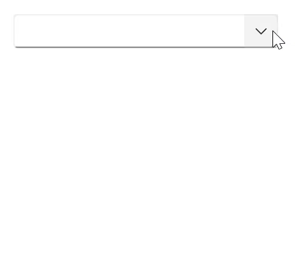
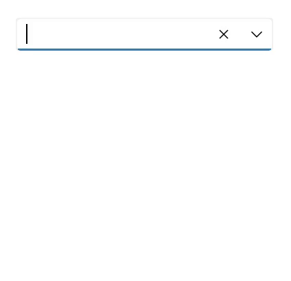

# Getting Started with .NET MAUI ComboBox (SfComboBox)

This section explains the steps required to add the [.NET MAUI ComboBox](https://help.syncfusion.com/cr/maui/Syncfusion.Maui.Inputs.SfComboBox.html) control and binding data in the ComboBox control. This section covers only the basic features needed to get started with Syncfusion ComboBox control.

To get start quickly with our .NET MAUI ComboBox, you can check the below video.



## Adding a .NET MAUI ComboBox reference

Syncfusion .NET MAUI controls are available in [Nuget.org](https://www.nuget.org/). To add .NET MAUI ComboBox to your project, open the NuGet package manager in Visual Studio, search for [Syncfusion.Maui.Inputs](https://www.nuget.org/packages/Syncfusion.Maui.Inputs) and then install it.

## Handler registration 

 In the MauiProgram.cs file, register the handler for Syncfusion core.



using Microsoft.Maui;
using Microsoft.Maui.Hosting;
using Microsoft.Maui.Controls.Compatibility;
using Microsoft.Maui.Controls.Hosting;
using Microsoft.Maui.Controls.Xaml;
using Syncfusion.Maui.Core.Hosting;

namespace ComboBoxSample
{
    public static class MauiProgram
    {
        public static MauiApp CreateMauiApp()
        {
            var builder = MauiApp.CreateBuilder();
            builder
            .UseMauiApp<App>()
            .ConfigureSyncfusionCore()
            .ConfigureFonts(fonts =>
            {
                fonts.AddFont("OpenSans-Regular.ttf", "OpenSansRegular");
            });

            return builder.Build();
        }      
    }
}    

 

## Create a Simple .NET MAUI ComboBox

The [.NET MAUI ComboBox](https://www.syncfusion.com/maui-controls/maui-combobox) control is configured entirely in C# code or by using XAML markup. The following steps explain how to create a .NET MAUI ComboBox (SfComboBox) and configure its elements:

### Adding the .NET MAUI ComboBox control

Step 1: Add the NuGet to the project as discussed in the above reference section. 

Step 2: Add the namespace as shown in the following code sample:





    xmlns:editors="clr-namespace:Syncfusion.Maui.Inputs;assembly=Syncfusion.Maui.Inputs"
	




    using Syncfusion.Maui.Inputs;





Step 3: Set the control to content in `ContentPage.`





<ContentPage.Content>    
    <editors:SfComboBox x:Name="comboBox" />
</ContentPage.Content>




          
SfComboBox comboBox = new SfComboBox(); 
Content = comboBox;  





## Populating items using data binding

The [ComboBox](https://help.syncfusion.com/cr/maui/Syncfusion.Maui.Inputs.SfComboBox.html) can be bound to an external data source using the [ItemsSource](https://help.syncfusion.com/cr/maui/Syncfusion.Maui.Inputs.DropDownControls.DropDownListBase.html#Syncfusion_Maui_Inputs_DropDownControls_DropDownListBase_ItemsSource) property. Now, let us create Model and ViewModel classes to populate ComboBox with SocialMedia details.

**Step 1:** Define a simple model class SocialMedia with fields ID and name, and then populate social media data in the ViewModel.




//Model.cs
public class SocialMedia
{
    public string Name { get; set; }
    public int ID { get; set; }
}

//ViewModel.cs
public class SocialMediaViewModel
{
    public ObservableCollection<SocialMedia> SocialMedias { get; set; }
    public SocialMediaViewModel()
    {
        this.SocialMedias = new ObservableCollection<SocialMedia>();
        this.SocialMedias.Add(new SocialMedia() { Name = "Facebook", ID = 0 });
        this.SocialMedias.Add(new SocialMedia() { Name = "Google Plus", ID = 1 });
        this.SocialMedias.Add(new SocialMedia() { Name = "Instagram", ID = 2 });
        this.SocialMedias.Add(new SocialMedia() { Name = "LinkedIn", ID = 3 });
        this.SocialMedias.Add(new SocialMedia() { Name = "Skype", ID = 4 });
        this.SocialMedias.Add(new SocialMedia() { Name = "Telegram", ID = 5 });
        this.SocialMedias.Add(new SocialMedia() { Name = "Televzr", ID = 6 });
        this.SocialMedias.Add(new SocialMedia() { Name = "Tik Tok", ID = 7 });
        this.SocialMedias.Add(new SocialMedia() { Name = "Tout", ID = 8 });
        this.SocialMedias.Add(new SocialMedia() { Name = "Tumblr", ID = 9 });
        this.SocialMedias.Add(new SocialMedia() { Name = "Twitter", ID = 10 });
        this.SocialMedias.Add(new SocialMedia() { Name = "Vimeo", ID = 11 });
        this.SocialMedias.Add(new SocialMedia() { Name = "WhatsApp", ID = 12 });
        this.SocialMedias.Add(new SocialMedia() { Name = "YouTube", ID = 13 });
    }
}




**Step 2:** Populate data in `ComboBox`. 

Now, populate this SocialMediaViewModel data in [ComboBox](https://help.syncfusion.com/cr/maui/Syncfusion.Maui.Inputs.SfComboBox.html) control by binding it to the [ItemsSource](https://help.syncfusion.com/cr/maui/Syncfusion.Maui.Inputs.DropDownControls.DropDownListBase.html#Syncfusion_Maui_Inputs_DropDownControls_DropDownListBase_ItemsSource) property. 




<?xml version="1.0" encoding="utf-8" ?>
<ContentPage xmlns="http://schemas.microsoft.com/dotnet/2021/maui"
             xmlns:x="http://schemas.microsoft.com/winfx/2009/xaml"
             xmlns:editors="clr-namespace:Syncfusion.Maui.Inputs;assembly=Syncfusion.Maui.Inputs"
             xmlns:local="clr-namespace:ComboBoxSample"             
             x:Class="ComboBoxSample.MainPage">

       <ContentPage.BindingContext>
            <local:SocialMediaViewModel />
       </ContentPage.BindingContext>

       <ContentPage.Content>
            <!--Setting ItemsSource-->
            <editors:SfComboBox x:Name="comboBox" 
                                WidthRequest="250"
                                ItemsSource="{Binding SocialMedias}" />
        </ContentPage.Content>
</ContentPage>





SocialMediaViewModel socialMediaViewModel = new SocialMediaViewModel();
comboBox.BindingContext = socialMediaViewModel;
comboBox.ItemsSource = SocialMediaViewModel.SocialMedias;




N> Set the SocialMediaViewModel instance as the BindingContext of your control; this is done to bind properties of SocialMediaViewModel to `ComboBox`.

**Step 3:** Setting TextMemberPath and DisplayMemberPath.

The [ComboBox](https://help.syncfusion.com/cr/maui/Syncfusion.Maui.Inputs.SfComboBox.html) control is populated with a list of social media. But the SocialMedia model contains two properties, ID and Name, so it is necessary to intimate by which property it should display the value in the selection box portion of the `[ComboBox](https://help.syncfusion.com/cr/maui/Syncfusion.Maui.Inputs.SfComboBox.html) control when an item is selected.

[TextMemberPath](https://help.syncfusion.com/cr/maui/Syncfusion.Maui.Inputs.DropDownControls.DropDownListBase.html#Syncfusion_Maui_Inputs_DropDownControls_DropDownListBase_TextMemberPath)  - This property path is used to get the value for displaying in the selection box portion of the [ComboBox](https://help.syncfusion.com/cr/maui/Syncfusion.Maui.Inputs.SfComboBox.html) control when an item is selected. The default value is `String.Empty`.

[DisplayMemberPath](https://help.syncfusion.com/cr/maui/Syncfusion.Maui.Inputs.DropDownControls.DropDownListBase.html#Syncfusion_Maui_Inputs_DropDownControls_DropDownListBase_DisplayMemberPath) - This property path is used to the name or path of the property displayed for each data item in the drop-down list. The default value is `String.Empty`.




<editors:SfComboBox x:Name="comboBox" 
                    WidthRequest="250"
                    DisplayMemberPath = "Name"
                    TextMemberPath = "Name"
                    ItemsSource="{Binding SocialMedias}" />




comboBox.DisplayMemberPath = "Name";
comboBox.TextMemberPath = "Name";




The following gif image illustrates the result of the above code:

## Editing

The [ComboBox](https://help.syncfusion.com/cr/maui/Syncfusion.Maui.Inputs.SfComboBox.html) control supports editable and non-editable modes to choose items. To enable the editing functionality, set the [IsEditable](https://help.syncfusion.com/cr/maui/Syncfusion.Maui.Inputs.SfComboBox.html#Syncfusion_Maui_Inputs_SfComboBox_IsEditable) property as `true.` The default value is `false.`




<editors:SfComboBox x:Name="comboBox"
                    WidthRequest="250"
                    IsEditable="true"
                    ItemsSource="{Binding SocialMedias}"
                    DisplayMemberPath="Name"
                    TextMemberPath="Name">
</editors:SfComboBox>





comboBox.IsEditable = true;




The following gif image illustrates the result of the above code:

You can find the complete getting started sample of .NET MAUI ComboBox from this [link.](https://github.com/SyncfusionExamples/maui-combobox-samples)

## Text

The [Text](https://help.syncfusion.com/cr/maui/Syncfusion.Maui.Inputs.DropDownControls.DropDownListBase.html#Syncfusion_Maui_Inputs_DropDownControls_DropDownListBase_Text) property is used to get the user-submitted text in the [SfComboBox](https://help.syncfusion.com/cr/maui/Syncfusion.Maui.Inputs.SfComboBox.html) editable mode. The default value of the `Text` property is `string.Empty`.

N> [Text](https://help.syncfusion.com/cr/maui/Syncfusion.Maui.Inputs.DropDownControls.DropDownListBase.html#Syncfusion_Maui_Inputs_DropDownControls_DropDownListBase_Text) property is Read only.

N> You can refer to our [.NET MAUI Combobox](https://www.syncfusion.com/maui-controls/maui-combobox) feature tour page for its groundbreaking feature representations. You can also explore our [.NET MAUI Combobox Example](https://github.com/syncfusion/maui-demos/tree/master/MAUI/Inputs/SampleBrowser.Maui.Inputs/Samples/ComboBox) that shows you how to render the Combobox in .NET MAUI.