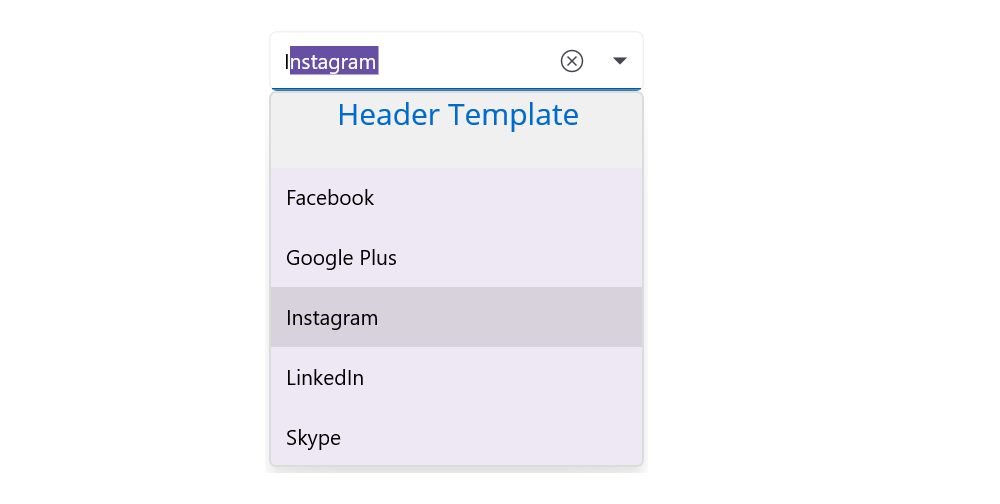
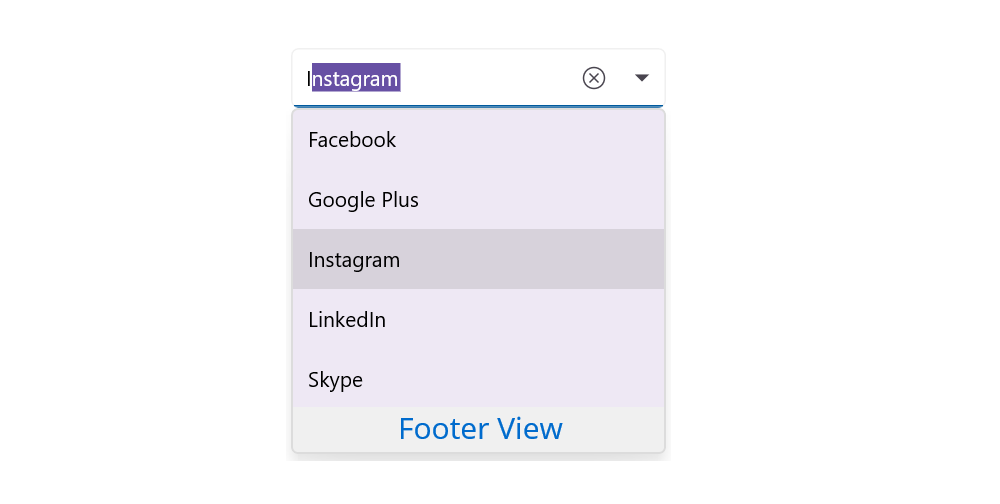

# Header and Footer support in .NET MAUI ComboBox (SfComboBox)

You can provide header and footer views in the dropdown in [SfComboBox](https://www.syncfusion.com/maui-controls/maui-combobox) by enabling the [ShowDropDownHeaderView](https://help.syncfusion.com/cr/maui/Syncfusion.Maui.Inputs.DropDownControls.DropDownListBase.html#Syncfusion_Maui_Inputs_DropDownControls_DropDownListBase_ShowDropdownHeaderView) and the [ShowDropDownFooterView](https://help.syncfusion.com/cr/maui/Syncfusion.Maui.Inputs.DropDownControls.DropDownListBase.html#Syncfusion_Maui_Inputs_DropDownControls_DropDownListBase_ShowDropdownFooterView) properties. 

## Header content

You can provide content for header at the top of the ComboBox's dropdown. The [DropDownHeaderView](https://help.syncfusion.com/cr/maui/Syncfusion.Maui.Inputs.DropDownControls.DropDownListBase.html#Syncfusion_Maui_Inputs_DropDownControls_DropDownListBase_DropdownHeaderView) property is used to set the content of the header. The height of the header in the [SfComboBox](https://www.syncfusion.com/maui-controls/maui-combobox) can be adjusted using the [DropDownHeaderViewHeight](https://help.syncfusion.com/cr/maui/Syncfusion.Maui.Inputs.DropDownControls.DropDownListBase.html#Syncfusion_Maui_Inputs_DropDownControls_DropDownListBase_DropdownHeaderViewHeight) property.





    <StackLayout VerticalOptions="Start" HorizontalOptions="Start" Padding="30">
        <combobox:SfComboBox HeightRequest="40" x:Name="comboBox" IsEditableMode="true" DisplayMemberPath="Name" ItemsSource="{Binding SocialMedias}" AllowFiltering="true">
            <combobox:SfComboBox.DropDownHeaderView>
                <StackLayout BackgroundColor="#f0f0f0" >
                    <Label  x:Name="label2" FontSize="20" VerticalTextAlignment="Center" HorizontalOptions="Center" VerticalOptions="Center" TextColor="#006bcd" />
                </StackLayout>
            </combobox:SfComboBox.DropDownHeaderView>        
        </combobox:SfComboBox>
    </StackLayout>                  





    StackLayout layout = new StackLayout()
    {
        VerticalOptions = LayoutOptions.Start,
        HorizontalOptions = LayoutOptions.Start,
        Padding = new Thickness(30)
    };

     SfComboBox comboBox = new SfComboBox()
     {
        HeightRequest = 40,
        ShowDropDownHeaderView = true,
        ItemsSource = new List<string> { "Facebook", "Twitter", "Instagram", "LinkedIn" },
        DropDownHeaderViewHeight = 50
    };

    Label label2 = new Label()
    {
        FontSize = 20,
        VerticalTextAlignment = TextAlignment.Center,
        HorizontalTextAlignment = TextAlignment.Center,
        HorizontalOptions = LayoutOptions.Center,
        VerticalOptions = LayoutOptions.Center,
        TextColor = Color.FromHex("#006bcd")
    };

    comboBox.DropDownHeaderView = label2;
    layout.Children.Add(comboBox);
    this.Content = layout;





## Footer content

You can provide content for footer at the bottom of the ComboBox's dropdown. The [DropDownFooterView](https://help.syncfusion.com/cr/maui/Syncfusion.Maui.Inputs.DropDownControls.DropDownListBase.html#Syncfusion_Maui_Inputs_DropDownControls_DropDownListBase_DropdownFooterView) property is used to set the content for footer. The height of the footer in the [SfComboBox](https://www.syncfusion.com/maui-controls/maui-combobox) can be adjusted using the [DropDownFooterViewHeight](https://help.syncfusion.com/cr/maui/Syncfusion.Maui.Inputs.DropDownControls.DropDownListBase.html#Syncfusion_Maui_Inputs_DropDownControls_DropDownListBase_DropdownFooterViewHeight) property.

The following code example shows how to set footer content in [SfComboBox](https://www.syncfusion.com/maui-controls/maui-combobox).





    <StackLayout VerticalOptions="Start" HorizontalOptions="Start" Padding="30">
        <combobox:SfComboBox HeightRequest="40" ItemsSource="{Binding SocialMedias}" DisplayMemberPath="Name" x:Name="comboBox" IsEditableMode="true" AllowFiltering="true">
            <combobox:SfComboBox.DropDownFooterView>
                <StackLayout BackgroundColor="#f0f0f0" >
                    <Label Text="Add New" BackgroundColor="#f0f0f0" TextColor="#006bcd" VerticalTextAlignment="Center" VerticalOptions="Center" HorizontalTextAlignment="Center" FontSize="20"/>
                </StackLayout>
            </combobox:SfComboBox.DropDownFooterView>
        </combobox:SfComboBox>
    </StackLayout>                  





    StackLayout layout = new StackLayout()
    {
        VerticalOptions = LayoutOptions.Start,
        HorizontalOptions = LayoutOptions.Start,
        Padding = new Thickness(30)
    };

    SfComboBox comboBox = new SfComboBox()
     {
        HeightRequest = 40,
        ShowDropDownFooterView = true,
        ItemsSource = new List<string> { "Facebook", "Twitter", "Instagram", "LinkedIn" },
        DropDownFooterViewHeight = 50
    };

    StackLayout customFooterView = new StackLayout();
    Label label = new Label() 
    { 
        Text = "Add New", 
        BackgroundColor = Color.FromHex("#f0f0f0"), 
        TextColor = Color.FromHex("#006bcd"), 
        VerticalOptions = LayoutOptions.Center, 
        VerticalTextAlignment = TextAlignment.Center, 
        HorizontalTextAlignment = TextAlignment.Center, 
        FontSize = 20 
    };
    customFooterView.Children.Add(label);
    comboBox.DropDownFooterView = customFooterView;
    layout.Children.Add(comboBox);
    Content = layout;





