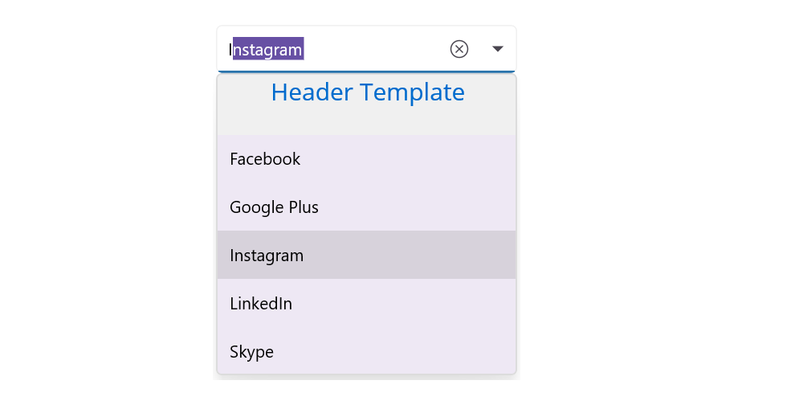
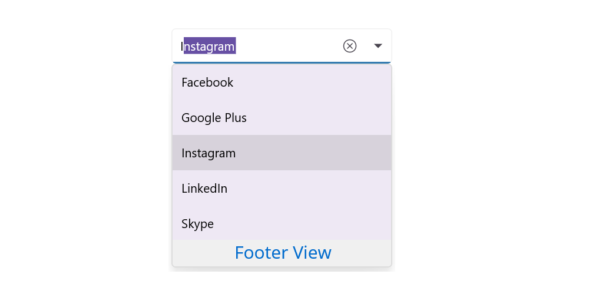

# Header and Footer support in .NET MAUI ComboBox

The [SfComboBox](https://help.syncfusion.com/cr/maui/Syncfusion.Maui.Inputs.SfComboBox.html) control supports adding custom header and footer views to the drop-down. Use the header to display content such as a title or filter above the items, and the footer to display content such as an action button below the items.

## Prerequisites

Before using the [SfComboBox](https://help.syncfusion.com/cr/maui/Syncfusion.Maui.Inputs.SfComboBox.html), ensure the following NuGet package is installed in your .NET MAUI project:

- `Syncfusion.Maui.Inputs`

For a step-by-step setup, refer to the [Getting Started](https://help.syncfusion.com/maui/combobox/getting-started) documentation.

## Show or hide the header and footer

To show a header or footer in the [SfComboBox](https://help.syncfusion.com/cr/maui/Syncfusion.Maui.Inputs.SfComboBox.html) drop-down, set the [ShowDropdownHeaderView](https://help.syncfusion.com/cr/maui/Syncfusion.Maui.Inputs.DropDownControls.DropDownListBase.html#Syncfusion_Maui_Inputs_DropDownControls_DropDownListBase_ShowDropdownHeaderView) and [ShowDropdownFooterView](https://help.syncfusion.com/cr/maui/Syncfusion.Maui.Inputs.DropDownControls.DropDownListBase.html#Syncfusion_Maui_Inputs_DropDownControls_DropDownListBase_ShowDropdownFooterView) `bool` properties to `true`. Both default to `false`.

N> A `DropdownHeaderView` or `DropdownFooterView` is only rendered when its corresponding `ShowDropDownHeaderView` or `ShowDropDownFooterView` property is `true`.

## Header content

Use the [DropdownHeaderView](https://help.syncfusion.com/cr/maui/Syncfusion.Maui.Inputs.DropDownControls.DropDownListBase.html#Syncfusion_Maui_Inputs_DropDownControls_DropDownListBase_DropdownHeaderView) property to set the content of the header. It accepts any `View` and is displayed at the top of the drop-down while it is open. Adjust the header height with the [DropdownHeaderViewHeight](https://help.syncfusion.com/cr/maui/Syncfusion.Maui.Inputs.DropDownControls.DropDownListBase.html#Syncfusion_Maui_Inputs_DropDownControls_DropDownListBase_DropdownHeaderViewHeight) `double` property and it's default value is `30`.





    <StackLayout VerticalOptions="Start" HorizontalOptions="Start" Padding="30">
        <editors:SfComboBox x:Name="comboBox"
                        IsEditable="true"
                        IsFilteringEnabled="true"
                        ItemsSource="{Binding SocialMedias}"
                        DisplayMemberPath="Name"
                        TextMemberPath="Name"
                        ShowDropdownHeaderView="True"
                        DropdownHeaderViewHeight="50">
            <editors:SfComboBox.BindingContext>
                <local:SocialMediaViewModel />
            </editors:SfComboBox.BindingContext>
            <editors:SfComboBox.DropdownHeaderView>
                <StackLayout BackgroundColor="#f0f0f0">
                    <Label Text="Header View"
                       FontSize="20"
                       HorizontalOptions="Center"
                       VerticalOptions="Center"
                       TextColor="#006bcd" />
                </StackLayout>
            </editors:SfComboBox.DropdownHeaderView>
        </editors:SfComboBox>
    </StackLayout>





    // Run this code in a ContentPage code-behind file.
    SocialMediaViewModel socialMediaViewModel = new SocialMediaViewModel();

    StackLayout layout = new StackLayout
    {
        VerticalOptions = LayoutOptions.Start,
        HorizontalOptions = LayoutOptions.Start,
        Padding = new Thickness(30),
    };

    SfComboBox comboBox = new SfComboBox
    {
        ShowDropdownHeaderView = true,
        ItemsSource = socialMediaViewModel.SocialMedias,
        IsEditable = true,
        IsFilteringEnabled = true,
        DisplayMemberPath = "Name",
        TextMemberPath = "Name",
        DropdownHeaderViewHeight = 50,
        BindingContext = socialMediaViewModel,
    };

    StackLayout customHeaderView = new StackLayout
    {
        BackgroundColor = Color.FromArgb("#f0f0f0"),
    };

    Label headerLabel = new Label
    {
        Text = "Header View",
        FontSize = 20,
        HorizontalOptions = LayoutOptions.Center,
        VerticalOptions = LayoutOptions.Center,
        TextColor = Color.FromArgb("#006bcd"),
    };

    customHeaderView.Children.Add(headerLabel);
    comboBox.DropdownHeaderView = customHeaderView;
    layout.Children.Add(comboBox);
    Content = layout;




// ViewModel
public class SocialMediaViewModel
{
    public ObservableCollection<SocialMedia> SocialMedias { get; set; }

    public SocialMediaViewModel()
    {
        this.SocialMedias = new ObservableCollection<SocialMedia>
        {
            new SocialMedia { Name = "Facebook", ID = 0 },
            new SocialMedia { Name = "Google Plus", ID = 1 },
            new SocialMedia { Name = "Instagram", ID = 2 },
            new SocialMedia { Name = "LinkedIn", ID = 3 },
            new SocialMedia { Name = "Skype", ID = 4 },
            new SocialMedia { Name = "Telegram", ID = 5 },
            new SocialMedia { Name = "Twitter", ID = 6 },
            new SocialMedia { Name = "WhatsApp", ID = 7 },
            new SocialMedia { Name = "YouTube", ID = 8 }
        };
    }
}

public class SocialMedia
{
    public string Name { get; set; }
    public int ID { get; set; }
}




## Footer content

Use the [DropdownFooterView](https://help.syncfusion.com/cr/maui/Syncfusion.Maui.Inputs.DropDownControls.DropDownListBase.html#Syncfusion_Maui_Inputs_DropDownControls_DropDownListBase_DropdownFooterView) property to set the content of the footer. It accepts any `View` and is displayed at the bottom of the drop-down while it is open. Adjust the footer height with the [DropdownFooterViewHeight](https://help.syncfusion.com/cr/maui/Syncfusion.Maui.Inputs.DropDownControls.DropDownListBase.html#Syncfusion_Maui_Inputs_DropDownControls_DropDownListBase_DropdownFooterViewHeight) `double` property and it's default value is `30`.





    <StackLayout VerticalOptions="Start" HorizontalOptions="Start" Padding="30">
        <editors:SfComboBox x:Name="comboBox"
                        IsEditable="true"
                        IsFilteringEnabled="true"
                        ItemsSource="{Binding SocialMedias}"
                        DisplayMemberPath="Name"
                        TextMemberPath="Name"
                        ShowDropdownFooterView="True"
                        DropdownFooterViewHeight="50">
            <editors:SfComboBox.BindingContext>
                <local:SocialMediaViewModel />
            </editors:SfComboBox.BindingContext>
            <editors:SfComboBox.DropdownFooterView>
                <StackLayout BackgroundColor="#f0f0f0">
                    <Label Text="Add New"
                       BackgroundColor="#f0f0f0"
                       TextColor="#006bcd"
                       VerticalOptions="Center"
                       HorizontalTextAlignment="Center"
                       FontSize="20" />
                </StackLayout>
            </editors:SfComboBox.DropdownFooterView>
        </editors:SfComboBox>
    </StackLayout>





    // Run this code in a ContentPage code-behind file.
    SocialMediaViewModel socialMediaViewModel = new SocialMediaViewModel();

    StackLayout layout = new StackLayout
    {
        VerticalOptions = LayoutOptions.Start,
        HorizontalOptions = LayoutOptions.Start,
        Padding = new Thickness(30),
    };

    SfComboBox comboBox = new SfComboBox
    {
        ShowDropdownFooterView = true,
        ItemsSource = socialMediaViewModel.SocialMedias,
        IsEditable = true,
        IsFilteringEnabled = true,
        DisplayMemberPath = "Name",
        TextMemberPath = "Name",
        DropdownFooterViewHeight = 50,
        BindingContext = socialMediaViewModel,
    };

    StackLayout customFooterView = new StackLayout
    {
        BackgroundColor = Color.FromArgb("#f0f0f0"),
    };

    Label footerLabel = new Label
    {
        Text = "Footer View",
        BackgroundColor = Color.FromArgb("#f0f0f0"),
        TextColor = Color.FromArgb("#006bcd"),
        HorizontalOptions = LayoutOptions.Center,
        VerticalOptions = LayoutOptions.Center,
        FontSize = 20,
    };

    customFooterView.Children.Add(footerLabel);
    comboBox.DropdownFooterView = customFooterView;
    layout.Children.Add(comboBox);
    Content = layout;




// ViewModel
public class SocialMediaViewModel
{
    public ObservableCollection<SocialMedia> SocialMedias { get; set; }

    public SocialMediaViewModel()
    {
        this.SocialMedias = new ObservableCollection<SocialMedia>
        {
            new SocialMedia { Name = "Facebook", ID = 0 },
            new SocialMedia { Name = "Google Plus", ID = 1 },
            new SocialMedia { Name = "Instagram", ID = 2 },
            new SocialMedia { Name = "LinkedIn", ID = 3 },
            new SocialMedia { Name = "Skype", ID = 4 },
            new SocialMedia { Name = "Telegram", ID = 5 },
            new SocialMedia { Name = "Twitter", ID = 6 },
            new SocialMedia { Name = "WhatsApp", ID = 7 },
            new SocialMedia { Name = "YouTube", ID = 8 }
        };
    }
}

public class SocialMedia
{
    public string Name { get; set; }
    public int ID { get; set; }
}




## See Also

* [Getting Started](https://help.syncfusion.com/maui/combobox/getting-started)
* [Selection](https://help.syncfusion.com/maui/combobox/selection)
* [Filtering](https://help.syncfusion.com/maui/combobox/filtering)
* [No results found](https://help.syncfusion.com/maui/combobox/no-results-found)
* [UI customization](https://help.syncfusion.com/maui/combobox/ui-customization)