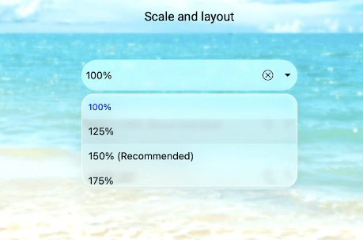

# Liquid Glass Support

The [SfComboBox](https://help.syncfusion.com/cr/maui/Syncfusion.Maui.Inputs.SfComboBox.html) supports a `liquid glass` appearance by hosting the control inside the Syncfusion [SfGlassEffectView](). You can customize the effect using properties such as [EffectType](), [EnableShadowEffect](), and round the corners using [CornerRadius](). This approach improves visual depth and readability when SfComboBox is placed over images or colorful layouts. Additionally, the dropdown portion of SfComboBox applies the glass effect only when the [EnableLiquidGlassEffect]() property is set to true.

## Availability

1. This feature is supported on .NET 10 or greater.
2. This feature is supported on mac or iOS 26 or greater.
3. On platforms or versions below these requirements, the control renders without the acrylic blur effect and falls back to a standard background.

## Prerequisites

- Add the Syncfusion.Maui.Core package (for SfGlassEffectView) and Syncfusion.Maui.Inputs (for SfComboBox).

XAML example Wrap the SfComboBox in an SfGlassEffectView, then enable the dropdown’s glass effect with `EnableLiquidGlassEffect`.




<?xml version="1.0" encoding="utf-8" ?>
<ContentPage
    xmlns="http://schemas.microsoft.com/dotnet/2021/maui"
    xmlns:x="http://schemas.microsoft.com/winfx/2009/xaml"
    xmlns:inputs="clr-namespace:Syncfusion.Maui.Inputs;assembly=Syncfusion.Maui.Inputs"
    xmlns:core="clr-namespace:Syncfusion.Maui.Core;assembly=Syncfusion.Maui.Core"
    x:Class="AcrylicComboboxBoxPage">

    <Grid>
        <!-- Background to make acrylic blur visible -->
        <Image Source="wallpaper.jpg" Aspect="AspectFill" />
            <core:SfGlassEffectView
                CornerRadius="20"
                HeightRequest="40"
                EffectType="Regular"
                EnableShadowEffect="True">

                <inputs:SfComboBox
                    EnableLiquidGlassEffect="True"
                    Background="Transparent"
                    ItemsSource="{Binding Employees}"
                    DisplayMemberPath="Name"
                    DropDownBackground="Transparent"
                    Placeholder="Select employee"/>
            </core:SfGlassEffectView>
    </Grid>
</ContentPage>




using Syncfusion.Maui.Core;
using Syncfusion.Maui.Inputs;

var glassEffects = new SfGlassEffectView
{
    CornerRadius=20,
    HeightRequest=40,
    EffectType=LiquidGlassEffectType.Regular,
    EnableShadowEffect=True
};

var Combobox = new SfComboBox
{
    EnableLiquidGlassEffect = true, // Dropdown glass effect
    ItemsSource = viewModel.Employees,
    DisplayMemberPath = "Name",
    Background = Colors.Transparent,
    DropDownBackground= Colors.Transparent,
    Placeholder = "Select employee",
};

glassEffects.Content = Combobox;




The following screenshot illustrates SfComboBox within an acrylic container, with the dropdown using the glass effect.

