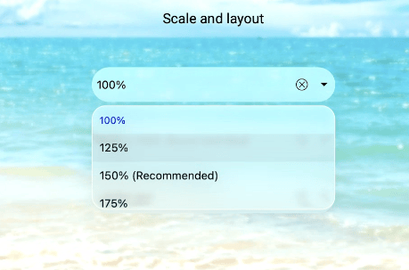

# Liquid Glass Effect in .NET MAUI ComboBox

The Liquid Glass Effect introduces a modern, translucent design with adaptive color tinting and light refraction, creating a sleek, glass-like user experience that remains clear and accessible. This section explains how to enable and customize the effect in the [SfComboBox](https://help.syncfusion.com/cr/maui/Syncfusion.Maui.Inputs.SfComboBox.html) control.

## Prerequisites

Before using the [SfComboBox](https://help.syncfusion.com/cr/maui/Syncfusion.Maui.Inputs.SfComboBox.html), ensure the following NuGet packages are installed in your .NET MAUI project:

- `Syncfusion.Maui.Inputs`
- `Syncfusion.Maui.Core` (for [SfGlassEffectView](https://help.syncfusion.com/cr/maui/Syncfusion.Maui.Core.SfGlassEffectView.html))

For step-by-step setup, refer to the [Getting Started](Getting-Started.md) documentation and the [Liquid Glass Getting Started](https://help.syncfusion.com/maui/liquid-glass-ui/getting-started) page.

N> **Platform support**: The Liquid Glass Effect is supported only on .NET 10 with iOS 26 and macOS 26. On other platforms the effect is a no-op.

## Apply Liquid Glass Effect

Follow these steps to enable and configure the Liquid Glass Effect in the ComboBox control.

### Step 1: Wrap the control inside SfGlassEffectView

To apply the Liquid Glass Effect to the [SfComboBox](https://help.syncfusion.com/cr/maui/Syncfusion.Maui.Inputs.SfComboBox.html) control, wrap it inside the [SfGlassEffectView](https://help.syncfusion.com/cr/maui/Syncfusion.Maui.Core.SfGlassEffectView.html) class. The glass effect is applied to the wrapped content and any popups it opens (such as the drop-down).

### Step 2: Enable the Liquid Glass Effect on the ComboBox

Set the [EnableLiquidGlassEffect](https://help.syncfusion.com/cr/maui/Syncfusion.Maui.Inputs.DropDownControls.DropDownListBase.html#Syncfusion_Maui_Inputs_DropDownControls_DropDownListBase_EnableLiquidGlassEffect) `bool` property to `true` on the [SfComboBox](https://help.syncfusion.com/cr/maui/Syncfusion.Maui.Inputs.SfComboBox.html) control. The default value is `false`. When enabled, the effect is also applied to the drop-down popup for a consistent glass-like appearance.

### Step 3: Customize the background

To achieve a glass-like background, set the `Background` and `DropDownBackground` properties of the [SfComboBox](https://help.syncfusion.com/cr/maui/Syncfusion.Maui.Inputs.SfComboBox.html) to `Transparent`. The background is then treated as a tinted color, ensuring a consistent glass effect across the editor and the drop-down.

The following code snippet demonstrates how to apply the Liquid Glass Effect to the [SfComboBox](https://help.syncfusion.com/cr/maui/Syncfusion.Maui.Inputs.SfComboBox.html) control.




<Grid BackgroundColor="Transparent">
    <Image Source="Wallpaper.png"
           Aspect="AspectFill" />

    <core:SfGlassEffectView EffectType="Regular"
                            CornerRadius="20">
        <editors:SfComboBox x:Name="comboBox"
                            Background="Transparent"
                            DropDownBackground="Transparent"
                            EnableLiquidGlassEffect="True"
                            ItemsSource="{Binding SocialMedias}">
            <editors:SfComboBox.BindingContext>
                <local:SocialMediaViewModel />
            </editors:SfComboBox.BindingContext>
        </editors:SfComboBox>
    </core:SfGlassEffectView>
</Grid>




// Run this code in a ContentPage code-behind file.
SocialMediaViewModel socialMediaViewModel = new SocialMediaViewModel();

var grid = new Grid
{
    BackgroundColor = Colors.Transparent,
};

var image = new Image
{
    Source = "Wallpaper.png",
    Aspect = Aspect.AspectFill,
};
grid.Children.Add(image);

var glass = new SfGlassEffectView
{
    EffectType = LiquidGlassEffectType.Regular,
    CornerRadius = 20,
};

var comboBox = new SfComboBox
{
    Background = Colors.Transparent,
    DropDownBackground = Colors.Transparent,
    EnableLiquidGlassEffect = true,
    ItemsSource = socialMediaViewModel.SocialMedias,
    BindingContext = socialMediaViewModel,
};

glass.Content = comboBox;
grid.Children.Add(glass);
Content = grid;




// ViewModel
public class SocialMediaViewModel
{
    public ObservableCollection<SocialMedia> SocialMedias { get; set; }

    public SocialMediaViewModel()
    {
        this.SocialMedias = new ObservableCollection<SocialMedia>
        {
            new SocialMedia { Name = "Facebook", ID = 0 },
            new SocialMedia { Name = "Google Plus", ID = 1 },
            new SocialMedia { Name = "Instagram", ID = 2 },
            new SocialMedia { Name = "LinkedIn", ID = 3 },
            new SocialMedia { Name = "Skype", ID = 4 },
            new SocialMedia { Name = "Telegram", ID = 5 },
            new SocialMedia { Name = "Twitter", ID = 6 },
            new SocialMedia { Name = "WhatsApp", ID = 7 },
            new SocialMedia { Name = "YouTube", ID = 8 }
        };
    }
}

public class SocialMedia
{
    public string Name { get; set; }
    public int ID { get; set; }
}




The following image illustrates the SfComboBox inside an acrylic container, with the drop-down using the glass effect.

N> If `Background` or `DropDownBackground` is not set to `Transparent`, the glass effect may not render correctly. Both must be `Transparent` for the underlying content to show through the tinted glass.

## See Also

* [Header and footer in .NET MAUI ComboBox](Header-and-Footer.md)
* [UI customization in .NET MAUI ComboBox](UI-Customization.md)