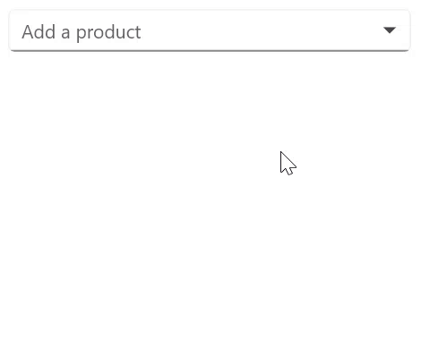

# LoadMore in .NET MAUI ComboBox (SfComboBox)

Restrict the number of suggestions displayed and have the remaining items loaded by selecting LoadMore. We can restrict maximum suggestion to be displayed with the `MaximumSuggestion` property.




<editors:SfComboBox x:Name="comboBox" 
                    WidthRequest="300"
                    IsFilteringEnabled="True"
                    IsEditable="True" 
                    ItemsSource="{Binding SocialMedias}"          
                    MaximumSuggestion="2"
                    DisplayMemberPath="Name"                                    
                    TextMemberPath="Name">





comboBox.MaximumSuggestion = 2;




The following gif image illustrates the result of the above code:

## LoadMore text customization

The LoadMore support provides `LoadMoreText`. We can set the desire text for the displaying the Load more text with the property LoadMoreText.




<editors:SfComboBox x:Name="comboBox" 
                    WidthRequest="300"
                    IsFilteringEnabled="True"
                    IsEditable="True" 
                    ItemsSource="{Binding SocialMedias}"          
                    MaximumSuggestion="2"
                    LoadMoreText="Load more items"
                    DisplayMemberPath="Name"                                    
                    TextMemberPath="Name"/>





autocomplete.MaximumSuggestion = 2;
autocomplete.LoadMoreText= "Load more items";




The following gif image illustrates the result of the above code:

## LoadMore view customization

SfComboBox allows customizing User Interface(UI) of Load More view. To customize the load more text, add the custom UI in the `LoadMoreTemplate` API in SfComboBox, as shown in the following code snippet.




<editors:SfComboBox x:Name="comboBox" 
                    WidthRequest="300"
                    IsFilteringEnabled="True"
                    IsEditable="True" 
                    ItemsSource="{Binding SocialMedias}"          
                    MaximumSuggestion="2"
                    DisplayMemberPath="Name"                                    
                    TextMemberPath="Name">
    <editors:SfComboBox.LoadMoreTemplate>
        <DataTemplate>
            <Grid BackgroundColor="LightGreen">
                <Label Text="Load more items..." VerticalOptions="Center" FontAttributes="Bold" HorizontalOptions="Center" TextColor="Red"/>
            </Grid>
        </DataTemplate>
    </editors:SfComboBox.LoadMoreTemplate>
</editors:SfComboBox>





comboBox.MaximumSuggestion = 2;
comboBox.LoadMoreTemplate = new DataTemplate(() =>
{
    var grid = new Grid();
    Label label = new Label();
    label.Text = "Load more items...";
    label.TextColor = Colors.Red;
    grid.Background = Colors.LightGreen;
    label.HorizontalOptions = LayoutOptions.Center;
    label.VerticalOptions = LayoutOptions.Center;
    label.FontAttributes = FontAttributes.Bold;
    grid.Children.Add(label);
    return grid;
});




The following gif image illustrates the result of the above code:

## LoadMore Button Tapped Event

The LoadMore support provides `LoadMoreButtonTapped` Event. The event can be triggered only when you tap on the load more button.




<editors:SfComboBox x:Name="comboBox" 
                    WidthRequest="300"
                    IsFilteringEnabled="True"
                    IsEditable="True" 
                    MaximumSuggestion="2"
                    ItemsSource="{Binding SocialMedias}"
                    LoadMoreButtonTapped="comboBox_LoadMoreButtonTapped"
                    DisplayMemberPath="Name"                                    
                    TextMemberPath="Name">
</editors:SfComboBox>





comboBox.MaximumSuggestion = 2;
comboBox.LoadMoreButtonTapped += ComboBox_LoadMoreButtonTapped;

private void ComboBox_LoadMoreButtonTapped(object? sender, EventArgs e)
{

}




