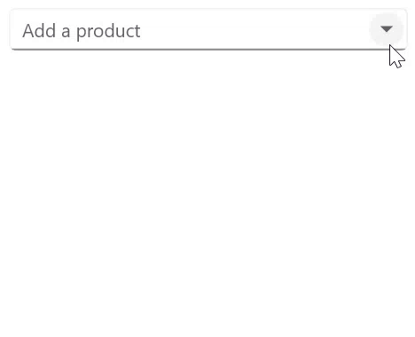
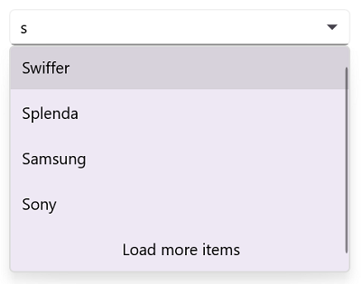
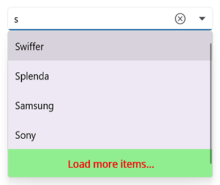

# Load More in .NET MAUI ComboBox

The [SfComboBox](https://help.syncfusion.com/cr/maui/Syncfusion.Maui.Inputs.SfComboBox.html) control supports displaying a limited number of suggestions in the drop-down and loading additional items on demand through a `Load More` button. This is useful when binding a large data set and you want to keep the drop-down compact.

## Prerequisites

Before proceeding, ensure the following are set up:

1. Install [.NET 9 SDK](https://dotnet.microsoft.com/en-us/download/dotnet/9.0) or later and the .NET MAUI workload. For setup details, see [Install .NET MAUI](https://learn.microsoft.com/en-us/dotnet/maui/get-started/installation?view=net-maui-9.0).
2. Create a [.NET MAUI project](Getting-Started.md#step-1-create-a-new-net-maui-project).
3. Install the [Syncfusion.Maui.Inputs](https://www.nuget.org/packages/Syncfusion.Maui.Inputs) NuGet package in your .NET MAUI project.
4. Register the Syncfusion core handler in the `CreateMauiApp` method of `MauiProgram.cs`:

    ```csharp
    using Syncfusion.Maui.Core.Hosting;

    public static class MauiProgram
    {
        public static MauiApp CreateMauiApp()
        {
            var builder = MauiApp.CreateBuilder();
            builder
                .UseMauiApp<App>()
                .ConfigureSyncfusionCore();
            return builder.Build();
        }
    }
    ```

5. Add the following namespace declaration to your XAML page and `using` directive to your C# files:

    ```xml
    xmlns:editors="clr-namespace:Syncfusion.Maui.Inputs;assembly=Syncfusion.Maui.Inputs"
    ```

    ```csharp
    using Syncfusion.Maui.Inputs;
    ```

For a step-by-step setup, refer to the [Getting Started](Getting-Started.md) documentation.


N> `Load More` is displayed only when `IsEditable` is `true` and `IsFilteringEnabled` is `true`. If either is `false`, the `Load More` button is not shown even if `MaximumSuggestion` is set.

## Define the model and view model

The samples below use the `SocialMedia` model and `SocialMediaViewModel` defined in [Getting Started](Getting-Started.md#step-4-define-model-and-view-model). Use a `BindingContext` on the page so that `{Binding SocialMedias}` resolves correctly.

## Maximum suggestions

Use the [MaximumSuggestion](https://help.syncfusion.com/cr/maui/Syncfusion.Maui.Inputs.DropDownControls.DropDownListBase.html#Syncfusion_Maui_Inputs_DropDownControls_DropDownListBase_MaximumSuggestion) `int` property to limit the number of suggestions displayed in the drop-down. When the filtered results exceed this value, a `Load More` button appears at the bottom of the drop-down so the user can load additional items. The default value is `0` (no limit).




<editors:SfComboBox x:Name="comboBox"
                    IsFilteringEnabled="True"
                    IsEditable="True"
                    ItemsSource="{Binding SocialMedias}"
                    MaximumSuggestion="2"
                    DisplayMemberPath="Name"
                    TextMemberPath="Name">
    <editors:SfComboBox.BindingContext>
        <local:SocialMediaViewModel />
    </editors:SfComboBox.BindingContext>
</editors:SfComboBox>





using Syncfusion.Maui.Inputs;

SocialMediaViewModel socialMediaViewModel = new SocialMediaViewModel();

SfComboBox comboBox = new SfComboBox
{
    MaximumSuggestion = 2,
    IsEditable = true,
    IsFilteringEnabled = true,
    TextMemberPath = "Name",
    DisplayMemberPath = "Name",
    ItemsSource = socialMediaViewModel.SocialMedias,
    BindingContext = socialMediaViewModel,
};




The following image illustrates the result of the above code:



N> If `MaximumSuggestion` is set to a value greater than or equal to the number of filtered items, the `Load More` button is not displayed.

## Load More text customization

Use the [LoadMoreText](https://help.syncfusion.com/cr/maui/Syncfusion.Maui.Inputs.DropDownControls.DropDownListBase.html#Syncfusion_Maui_Inputs_DropDownControls_DropDownListBase_LoadMoreText) `string` property to customize the text shown on the `Load More` button. The default value is `"Load More"`.




<editors:SfComboBox x:Name="comboBox"
                    IsFilteringEnabled="True"
                    IsEditable="True"
                    ItemsSource="{Binding SocialMedias}"
                    MaximumSuggestion="2"
                    LoadMoreText="Load more items"
                    DisplayMemberPath="Name"
                    TextMemberPath="Name">
    <editors:SfComboBox.BindingContext>
        <local:SocialMediaViewModel />
    </editors:SfComboBox.BindingContext>
</editors:SfComboBox>





SocialMediaViewModel socialMediaViewModel = new SocialMediaViewModel();

SfComboBox comboBox = new SfComboBox
{
    MaximumSuggestion = 2,
    LoadMoreText = "Load more items",
    IsEditable = true,
    IsFilteringEnabled = true,
    TextMemberPath = "Name",
    DisplayMemberPath = "Name",
    ItemsSource = socialMediaViewModel.SocialMedias,
    BindingContext = socialMediaViewModel,
};




The following image illustrates the result of the above code:



## Load More view customization

The [SfComboBox](https://help.syncfusion.com/cr/maui/Syncfusion.Maui.Inputs.SfComboBox.html) allows customizing the user interface of the `Load More` view. Use the [LoadMoreTemplate](https://help.syncfusion.com/cr/maui/Syncfusion.Maui.Inputs.DropDownControls.DropDownListBase.html#Syncfusion_Maui_Inputs_DropDownControls_DropDownListBase_LoadMoreTemplate) property to provide a custom `DataTemplate`. The `BindingContext` of the template is not set; the template's content is rendered as-is.




<editors:SfComboBox x:Name="comboBox"
                    IsFilteringEnabled="True"
                    IsEditable="True"
                    ItemsSource="{Binding SocialMedias}"
                    MaximumSuggestion="2"
                    DisplayMemberPath="Name"
                    TextMemberPath="Name">
    <editors:SfComboBox.BindingContext>
        <local:SocialMediaViewModel />
    </editors:SfComboBox.BindingContext>
    <editors:SfComboBox.LoadMoreTemplate>
        <DataTemplate>
            <Grid BackgroundColor="LightGreen">
                <Label Text="Load more items..."
                       VerticalOptions="Center"
                       HorizontalOptions="Center"
                       FontAttributes="Bold"
                       TextColor="Red" />
            </Grid>
        </DataTemplate>
    </editors:SfComboBox.LoadMoreTemplate>
</editors:SfComboBox>





using Syncfusion.Maui.Inputs;

SocialMediaViewModel socialMediaViewModel = new SocialMediaViewModel();

SfComboBox comboBox = new SfComboBox
{
    IsFilteringEnabled = true,
    IsEditable = true,
    ItemsSource = socialMediaViewModel.SocialMedias,
    MaximumSuggestion = 2,
    DisplayMemberPath = "Name",
    TextMemberPath = "Name",
    BindingContext = socialMediaViewModel,
};

comboBox.LoadMoreTemplate = new DataTemplate(() =>
{
    var grid = new Grid
    {
        BackgroundColor = Colors.LightGreen,
    };

    var label = new Label
    {
        Text = "Load more items...",
        TextColor = Colors.Red,
        HorizontalOptions = LayoutOptions.Center,
        VerticalOptions = LayoutOptions.Center,
        FontAttributes = FontAttributes.Bold,
    };

    grid.Children.Add(label);
    return grid;
});




The following image illustrates the result of the above code:



## Load More button tapped event

The [LoadMoreButtonTapped](https://help.syncfusion.com/cr/maui/Syncfusion.Maui.Inputs.DropDownControls.DropDownListBase.html#Syncfusion_Maui_Inputs_DropDownControls_DropDownListBase_LoadMoreButtonTapped) event fires when the user taps the `Load More` button. The event handler receives the [SfComboBox](https://help.syncfusion.com/cr/maui/Syncfusion.Maui.Inputs.SfComboBox.html) as `sender` and `EventArgs` as the event arguments. Use this event to load additional items into the bound collection.

### XAML



<editors:SfComboBox x:Name="comboBox"
                    IsFilteringEnabled="True"
                    IsEditable="True"
                    MaximumSuggestion="2"
                    ItemsSource="{Binding SocialMedias}"
                    LoadMoreButtonTapped="OnComboBoxLoadMoreButtonTapped"
                    DisplayMemberPath="Name"
                    TextMemberPath="Name">
    <editors:SfComboBox.BindingContext>
        <local:SocialMediaViewModel />
    </editors:SfComboBox.BindingContext>
</editors:SfComboBox>



### C# (page code-behind)

Define the event handler in the page's code-behind file (`MainPage.xaml.cs`).



using Syncfusion.Maui.Inputs;

public partial class MainPage : ContentPage
{
    public MainPage()
    {
        InitializeComponent();

        SocialMediaViewModel socialMediaViewModel = new SocialMediaViewModel();

        SfComboBox comboBox = new SfComboBox
        {
            IsFilteringEnabled = true,
            IsEditable = true,
            MaximumSuggestion = 2,
            ItemsSource = socialMediaViewModel.SocialMedias,
            DisplayMemberPath = "Name",
            TextMemberPath = "Name",
            BindingContext = socialMediaViewModel,
        };

        comboBox.LoadMoreButtonTapped += OnComboBoxLoadMoreButtonTapped;
        Content = comboBox;
    }

    private void OnComboBoxLoadMoreButtonTapped(object? sender, EventArgs e)
    {
        // Load additional items into the bound collection here.
    }
}



## See Also

* [Getting started with .NET MAUI ComboBox](getting-started.md)
* [Editing in .NET MAUI ComboBox](Editing.md)
* [Filtering in .NET MAUI ComboBox](Filtering.md)
* [Selection in .NET MAUI ComboBox](Selection.md)
* [SfComboBox API reference](https://help.syncfusion.com/cr/maui/Syncfusion.Maui.Inputs.SfComboBox.html)

