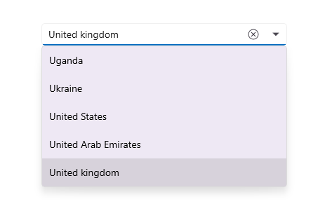

# .NET MAUI ComboBox (SfComboBox) Overview

The [.NET MAUI ComboBox](https://help.syncfusion.com/cr/maui/Syncfusion.Maui.Inputs.SfComboBox.html) control is a selection component that allows users to type a value or choose an option from a list of predefined options. It has many features, such as data binding, editing, searching, clear button and dropdown button customization, and more.

## Key features

* **Data binding** – Support binding various types of data sources.
* **Editable mode** – Editable and non-editable text boxes to select items from the given data source.
* **Filtering** – The ComboBox filters items based on the entered text and auto-fills with the first suggestion.
* **Searching** – Highlights the matching item in the drop-down list based on the provided input. 
* **Placeholder** – Display placeholder text inside the control until the user enters text.
