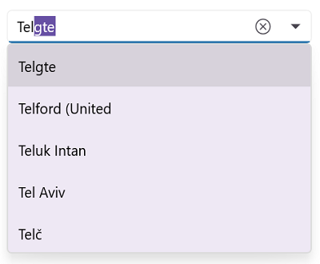

# Searching in .NET MAUI ComboBox (SfComboBox)

The [ComboBox](https://help.syncfusion.com/cr/maui/Syncfusion.Maui.Inputs.SfComboBox.html) control provides rich text searching functionality. The `TextSearchMode` property of the [ComboBox](https://help.syncfusion.com/cr/maui/Syncfusion.Maui.Inputs.SfComboBox.html) can be used to regulate how the control behaves when it receives user input.

## Search based on member path

The [DisplayMemberPath](https://help.syncfusion.com/cr/maui/Syncfusion.Maui.Inputs.DropDownControls.DropDownListBase.html#Syncfusion_Maui_Inputs_DropDownControls_DropDownListBase_DisplayMemberPath) and [TextMemberPath](https://help.syncfusion.com/cr/maui/Syncfusion.Maui.Inputs.DropDownControls.DropDownListBase.html#Syncfusion_Maui_Inputs_DropDownControls_DropDownListBase_TextMemberPath) properties of ComboBox control specify the property path, by which the searching must be done when a custom data is bound to the [ItemsSource](https://help.syncfusion.com/cr/maui/Syncfusion.Maui.Inputs.DropDownControls.DropDownListBase.html#Syncfusion_Maui_Inputs_DropDownControls_DropDownListBase_ItemsSource) property.

 * `DisplayMemberPath` - Specifies the property path whose value is displayed as text in the drop-down menu. The default value is `string.Empty`.

 * `TextMemberPath` - Specifies the property path whose value is used to perform searching based on user input received in the selection box portion of the `ComboBox` control. The default value is `string.Empty`. When `TextMemberPath` is `null` or `string.Empty`, searching will be performed based on `DisplayMemberPath`. 

N> `DisplayMemberPath` and `TextMemberPath` will be effective for the collection item that holds two or more properties in it.

N> When both the `DisplayMemberPath` and `TextMemberPath` properties have a `null` or `string.Empty` value, searching will be performed based on the class name with namespace of the item.

## Edit mode Searching based on TextMemberPath

In edit mode, searching will be performed based on the [TextMemberPath](https://help.syncfusion.com/cr/maui/Syncfusion.Maui.Inputs.DropDownControls.DropDownListBase.html#Syncfusion_Maui_Inputs_DropDownControls_DropDownListBase_TextMemberPath) property while entering the text into the selection box. When TextMemberPath is `null` or `string.Empty`, searching will be performed based on [DisplayMemberPath](https://help.syncfusion.com/cr/maui/Syncfusion.Maui.Inputs.DropDownControls.DropDownListBase.html#Syncfusion_Maui_Inputs_DropDownControls_DropDownListBase_DisplayMemberPath). 




<editors:SfComboBox x:Name="comboBox"
                    WidthRequest="350"
                    HeightRequest="50"
                    IsEditable="true"
                    ItemsSource="{Binding SocialMedias}"
                    TextMemberPath="ID"
                    DisplayMemberPath="Name" />




    SocialMediaViewModel socialMediaViewModel = new SocialMediaViewModel();
    SfComboBox comboBox = new SfComboBox() 
    {
        WidthRequest= 350,
        HeightRequest = 50,
        TextMemberPath = "ID",
        IsEditable = true,
        ItemsSource = socialMediaViewModel.SocialMedias,
        TextMemberPath = "Name"
    };




The following image illustrates the result of the above code:

N> Auto appending of text is supported only in `Editable` mode and `TextSearchMode` property should be `StartsWith`.

## Text Search Mode

The [TextSearchMode](https://help.syncfusion.com/cr/maui/Syncfusion.Maui.Inputs.SfComboBox.html#Syncfusion_Maui_Inputs_SfComboBox_TextSearchMode) property of the [ComboBox](https://help.syncfusion.com/cr/maui/Syncfusion.Maui.Inputs.SfComboBox.html) can be used to regulate how the control behaves when it receives user input. The default text searching type is [StartWith](https://help.syncfusion.com/cr/maui/Syncfusion.Maui.Inputs.ComboBoxTextSearchMode.html#Syncfusion_Maui_Inputs_ComboBoxTextSearchMode_StartsWith), ignoring accent and it is case insensitive. The available text search modes are:

* StartsWith
* Contains

### Search with beginning text

Set the [TextSearchMode](https://help.syncfusion.com/cr/maui/Syncfusion.Maui.Inputs.SfComboBox.html#Syncfusion_Maui_Inputs_SfComboBox_TextSearchMode) property value to [StartWith](https://help.syncfusion.com/cr/maui/Syncfusion.Maui.Inputs.ComboBoxTextSearchMode.html#Syncfusion_Maui_Inputs_ComboBoxTextSearchMode_StartsWith) to search the matching items based on the starting text, and the first item which fits the user input in the drop-down list, will be highlighted.




<editors:SfComboBox x:Name="comboBox"
                    WidthRequest="350"
                    HeightRequest="50"
                    TextSearchMode="StartsWith"
                    ItemsSource="{Binding SocialMedias}"
                    DisplayMemberPath="Name"
                    TextMemberPath="Name" />





    SocialMediaViewModel socialMediaViewModel = new SocialMediaViewModel();
    SfComboBox comboBox = new SfComboBox() 
    {
        WidthRequest= 350,
        HeightRequest = 50,
        TextSearchMode = ComboBoxTextSearchMode.StartsWith,
        TextMemberPath = "Name",
        DisplayMemberPath = "Name",
        ItemsSource = socialMediaViewModel.SocialMedias
    };




The following image illustrates the result of the above code:

### Search with contains text

Set the [TextSearchMode](https://help.syncfusion.com/cr/maui/Syncfusion.Maui.Inputs.SfComboBox.html#Syncfusion_Maui_Inputs_SfComboBox_TextSearchMode) property value to [Contains](https://help.syncfusion.com/cr/maui/Syncfusion.Maui.Inputs.ComboBoxTextSearchMode.html#Syncfusion_Maui_Inputs_ComboBoxTextSearchMode_Contains) to search the matching items containing specific text, and the first item which fits the user input in the drop-down list, will be highlighted.




<editors:SfComboBox x:Name="comboBox"
                    WidthRequest="350"
                    HeightRequest="50"
                    IsEditable="True"
                    TextSearchMode="Contains"
                    ItemsSource="{Binding SocialMedias}"
                    TextMemberPath="Name"
                    DisplayMemberPath="Name" />





SocialMediaViewModel socialMediaViewModel = new SocialMediaViewModel();
SfComboBox comboBox = new SfComboBox() 
{
    WidthRequest= 350,
    HeightRequest = 50,
    IsEditable = true,
    TextSearchMode = ComboBoxTextSearchMode.Contains,
    TextMemberPath = "Name",
    DisplayMemberPath = "Name",
    ItemsSource = socialMediaViewModel.SocialMedias
};




The following image illustrates the result of the above code:

### Prefix characters constraint

Instead of displaying suggestion list on every character entry, matches can be filtered and displayed after a few character entries. This can be done by [MinimumPrefixCharacters](https://help.syncfusion.com/cr/maui/Syncfusion.Maui.Inputs.DropDownControls.DropDownListBase.html#Syncfusion_Maui_Inputs_DropDownControls_DropDownListBase_MinimumPrefixCharacters) property and its default value is 1.




<editors:SfComboBox x:Name="comboBox" 
                    WidthRequest="350"
                    HeightRequest="50"
                    IsFilteringEnabled="True"
                    IsEditable="True" 
                    ItemsSource="{Binding SocialMedias}"
                    MinimumPrefixCharacters="3"
                    DisplayMemberPath="Name"
                    TextMemberPath="Name">





SocialMediaViewModel socialMediaViewModel = new SocialMediaViewModel();
SfComboBox comboBox = new SfComboBox() 
{
    WidthRequest= 350,
    HeightRequest = 50,
    MinimumPrefixCharacters = 3,
    IsFilteringEnabled = true,
    IsEditable = true,
    TextMemberPath = "Name",
    DisplayMemberPath = "Name",
    ItemsSource = socialMediaViewModel.SocialMedias
};




The following image illustrates the result of the above code.

