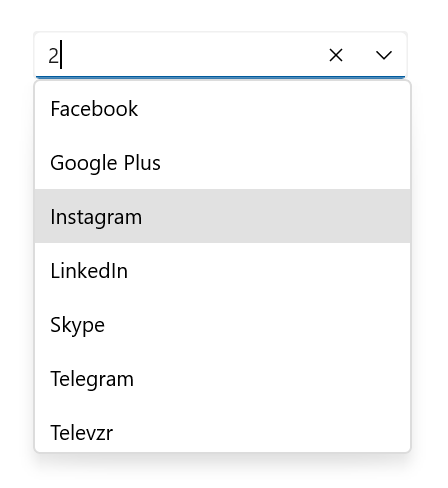
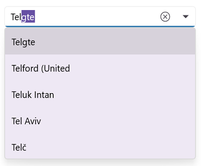

# Searching in .NET MAUI ComboBox

The [.NET MAUI ComboBox](https://help.syncfusion.com/cr/maui/Syncfusion.Maui.Inputs.SfComboBox.html) control provides rich text searching functionality. Use the [TextSearchMode](https://help.syncfusion.com/cr/maui/Syncfusion.Maui.Inputs.SfComboBox.html#Syncfusion_Maui_Inputs_SfComboBox_TextSearchMode) property to control how the drop-down is filtered when the user types into the editor.

N> Searching only applies when `IsFilteringEnabled` is `true` and `IsEditable` is `true`. The `TextSearchMode` setting has no effect if filtering is disabled.

## Prerequisites

Before using the [SfComboBox](https://help.syncfusion.com/cr/maui/Syncfusion.Maui.Inputs.SfComboBox.html), ensure the following NuGet package is installed in your .NET MAUI project:

- `Syncfusion.Maui.Inputs`

For a step-by-step setup, refer to the [Getting Started](https://help.syncfusion.com/maui/combobox/getting-started) documentation.

## Search based on member path

The [DisplayMemberPath](https://help.syncfusion.com/cr/maui/Syncfusion.Maui.Inputs.DropDownControls.DropDownListBase.html#Syncfusion_Maui_Inputs_DropDownControls_DropDownListBase_DisplayMemberPath) and [TextMemberPath](https://help.syncfusion.com/cr/maui/Syncfusion.Maui.Inputs.DropDownControls.DropDownListBase.html#Syncfusion_Maui_Inputs_DropDownControls_DropDownListBase_TextMemberPath) properties specify which property path is used to display and search items when a custom data type is bound to the [ItemsSource](https://help.syncfusion.com/cr/maui/Syncfusion.Maui.Inputs.DropDownControls.DropDownListBase.html#Syncfusion_Maui_Inputs_DropDownControls_DropDownListBase_ItemsSource) property.

* `DisplayMemberPath` - Specifies the property path whose value is displayed as text in the drop-down. The default value is `string.Empty`.
* `TextMemberPath` - Specifies the property path whose value is used to perform searching based on user input in the editor. The default value is `string.Empty`. When `TextMemberPath` is `null` or `string.Empty`, searching is performed based on `DisplayMemberPath`.

N> `DisplayMemberPath` and `TextMemberPath` apply only when the bound collection item has two or more properties.

N> When both `DisplayMemberPath` and `TextMemberPath` are `null` or `string.Empty`, searching is performed against the class name (with namespace) of the item.

## Edit mode searching based on TextMemberPath

In edit mode, searching is performed against the [TextMemberPath](https://help.syncfusion.com/cr/maui/Syncfusion.Maui.Inputs.DropDownControls.DropDownListBase.html#Syncfusion_Maui_Inputs_DropDownControls_DropDownListBase_TextMemberPath) value as the user types into the editor. When `TextMemberPath` is `null` or `string.Empty`, searching falls back to [DisplayMemberPath](https://help.syncfusion.com/cr/maui/Syncfusion.Maui.Inputs.DropDownControls.DropDownListBase.html#Syncfusion_Maui_Inputs_DropDownControls_DropDownListBase_DisplayMemberPath).




<editors:SfComboBox x:Name="comboBox"
                    IsEditable="True"
                    IsFilteringEnabled="True"
                    ItemsSource="{Binding SocialMedias}"
                    TextMemberPath="ID"
                    DisplayMemberPath="Name">
    <editors:SfComboBox.BindingContext>
        <local:SocialMediaViewModel />
    </editors:SfComboBox.BindingContext>
</editors:SfComboBox>





SocialMediaViewModel socialMediaViewModel = new SocialMediaViewModel();

SfComboBox comboBox = new SfComboBox
{
    IsEditable = true,
    IsFilteringEnabled = true,
    ItemsSource = socialMediaViewModel.SocialMedias,
    TextMemberPath = "ID",
    DisplayMemberPath = "Name",
    BindingContext = socialMediaViewModel,
};




// ViewModel
public class SocialMediaViewModel
{
    public ObservableCollection<SocialMedia> SocialMedias { get; set; }

    public SocialMediaViewModel()
    {
        this.SocialMedias = new ObservableCollection<SocialMedia>
        {
            new SocialMedia { Name = "Facebook", ID = 0 },
            new SocialMedia { Name = "Google Plus", ID = 1 },
            new SocialMedia { Name = "Instagram", ID = 2 },
            new SocialMedia { Name = "LinkedIn", ID = 3 },
            new SocialMedia { Name = "Skype", ID = 4 },
            new SocialMedia { Name = "Telegram", ID = 5 },
            new SocialMedia { Name = "Twitter", ID = 6 },
            new SocialMedia { Name = "WhatsApp", ID = 7 },
            new SocialMedia { Name = "YouTube", ID = 8 }
        };
    }
}

public class SocialMedia
{
    public string Name { get; set; }
    public int ID { get; set; }
}




The following image illustrates the result of the above code:

N> Auto-appending of text is supported only in `Editable` mode and when `TextSearchMode` is `StartsWith`.

## Text search mode

The [TextSearchMode](https://help.syncfusion.com/cr/maui/Syncfusion.Maui.Inputs.SfComboBox.html#Syncfusion_Maui_Inputs_SfComboBox_TextSearchMode) property of the [ComboBox](https://help.syncfusion.com/cr/maui/Syncfusion.Maui.Inputs.SfComboBox.html) controls how the drop-down is filtered when the user types. The default value is `StartsWith`. Matching is case-insensitive and accent-insensitive. For a complete walkthrough of the available modes, see [Filtering in .NET MAUI ComboBox](https://help.syncfusion.com/maui/combobox/filtering).

The available modes are:

* `StartsWith` - Filters items whose value starts with the typed text. The first match is auto-appended to the editor (in editable mode).
* `Contains` - Filters items whose value contains the typed text anywhere. The first match is highlighted but not auto-appended.

### Search with beginning text

Set [TextSearchMode](https://help.syncfusion.com/cr/maui/Syncfusion.Maui.Inputs.SfComboBox.html#Syncfusion_Maui_Inputs_SfComboBox_TextSearchMode) to [StartsWith](https://help.syncfusion.com/cr/maui/Syncfusion.Maui.Inputs.ComboBoxTextSearchMode.html#Syncfusion_Maui_Inputs_ComboBoxTextSearchMode_StartsWith) to filter items whose value starts with the typed text. The first match is highlighted in the drop-down.




<editors:SfComboBox x:Name="comboBox"
                    IsEditable="True"
                    IsFilteringEnabled="True"
                    TextSearchMode="StartsWith"
                    ItemsSource="{Binding SocialMedias}"
                    DisplayMemberPath="Name"
                    TextMemberPath="Name">
    <editors:SfComboBox.BindingContext>
        <local:SocialMediaViewModel />
    </editors:SfComboBox.BindingContext>
</editors:SfComboBox>





SocialMediaViewModel socialMediaViewModel = new SocialMediaViewModel();

SfComboBox comboBox = new SfComboBox
{
    IsEditable = true,
    IsFilteringEnabled = true,
    TextSearchMode = ComboBoxTextSearchMode.StartsWith,
    ItemsSource = socialMediaViewModel.SocialMedias,
    TextMemberPath = "Name",
    DisplayMemberPath = "Name",
    BindingContext = socialMediaViewModel,
};




// ViewModel
public class SocialMediaViewModel
{
    public ObservableCollection<SocialMedia> SocialMedias { get; set; }

    public SocialMediaViewModel()
    {
        this.SocialMedias = new ObservableCollection<SocialMedia>
        {
            new SocialMedia { Name = "Facebook", ID = 0 },
            new SocialMedia { Name = "Google Plus", ID = 1 },
            new SocialMedia { Name = "Instagram", ID = 2 },
            new SocialMedia { Name = "LinkedIn", ID = 3 },
            new SocialMedia { Name = "Skype", ID = 4 },
            new SocialMedia { Name = "Telegram", ID = 5 },
            new SocialMedia { Name = "Twitter", ID = 6 },
            new SocialMedia { Name = "WhatsApp", ID = 7 },
            new SocialMedia { Name = "YouTube", ID = 8 }
        };
    }
}

public class SocialMedia
{
    public string Name { get; set; }
    public int ID { get; set; }
}




The following image illustrates the result of the above code:

### Search with contains text

Set [TextSearchMode](https://help.syncfusion.com/cr/maui/Syncfusion.Maui.Inputs.SfComboBox.html#Syncfusion_Maui_Inputs_SfComboBox_TextSearchMode) to [Contains](https://help.syncfusion.com/cr/maui/Syncfusion.Maui.Inputs.ComboBoxTextSearchMode.html#Syncfusion_Maui_Inputs_ComboBoxTextSearchMode_Contains) to filter items whose value contains the typed text anywhere. The first match is highlighted in the drop-down but is not auto-appended to the editor.




<editors:SfComboBox x:Name="comboBox"
                    IsEditable="True"
                    IsFilteringEnabled="True"
                    TextSearchMode="Contains"
                    ItemsSource="{Binding SocialMedias}"
                    TextMemberPath="Name"
                    DisplayMemberPath="Name">
    <editors:SfComboBox.BindingContext>
        <local:SocialMediaViewModel />
    </editors:SfComboBox.BindingContext>
</editors:SfComboBox>





SocialMediaViewModel socialMediaViewModel = new SocialMediaViewModel();

SfComboBox comboBox = new SfComboBox
{
    IsEditable = true,
    IsFilteringEnabled = true,
    TextSearchMode = ComboBoxTextSearchMode.Contains,
    ItemsSource = socialMediaViewModel.SocialMedias,
    TextMemberPath = "Name",
    DisplayMemberPath = "Name",
    BindingContext = socialMediaViewModel,
};




// ViewModel
public class SocialMediaViewModel
{
    public ObservableCollection<SocialMedia> SocialMedias { get; set; }

    public SocialMediaViewModel()
    {
        this.SocialMedias = new ObservableCollection<SocialMedia>
        {
            new SocialMedia { Name = "Facebook", ID = 0 },
            new SocialMedia { Name = "Google Plus", ID = 1 },
            new SocialMedia { Name = "Instagram", ID = 2 },
            new SocialMedia { Name = "LinkedIn", ID = 3 },
            new SocialMedia { Name = "Skype", ID = 4 },
            new SocialMedia { Name = "Telegram", ID = 5 },
            new SocialMedia { Name = "Twitter", ID = 6 },
            new SocialMedia { Name = "WhatsApp", ID = 7 },
            new SocialMedia { Name = "YouTube", ID = 8 }
        };
    }
}

public class SocialMedia
{
    public string Name { get; set; }
    public int ID { get; set; }
}




The following image illustrates the result of the above code:

## Minimum prefix characters

By default, the suggestion list is updated on every character entry. Use the [MinimumPrefixCharacters](https://help.syncfusion.com/cr/maui/Syncfusion.Maui.Inputs.DropDownControls.DropDownListBase.html#Syncfusion_Maui_Inputs_DropDownControls_DropDownListBase_MinimumPrefixCharacters) property to defer the update until the user has typed the specified number of characters. The default value is `1` (filtering starts immediately).




<editors:SfComboBox x:Name="comboBox"
                    IsFilteringEnabled="True"
                    IsEditable="True"
                    ItemsSource="{Binding SocialMedias}"
                    MinimumPrefixCharacters="3"
                    DisplayMemberPath="Name"
                    TextMemberPath="Name">
    <editors:SfComboBox.BindingContext>
        <local:SocialMediaViewModel />
    </editors:SfComboBox.BindingContext>
</editors:SfComboBox>





SocialMediaViewModel socialMediaViewModel = new SocialMediaViewModel();

SfComboBox comboBox = new SfComboBox
{
    IsFilteringEnabled = true,
    IsEditable = true,
    ItemsSource = socialMediaViewModel.SocialMedias,
    MinimumPrefixCharacters = 3,
    TextMemberPath = "Name",
    DisplayMemberPath = "Name",
    BindingContext = socialMediaViewModel,
};




// ViewModel
public class SocialMediaViewModel
{
    public ObservableCollection<SocialMedia> SocialMedias { get; set; }

    public SocialMediaViewModel()
    {
        this.SocialMedias = new ObservableCollection<SocialMedia>
        {
            new SocialMedia { Name = "Facebook", ID = 0 },
            new SocialMedia { Name = "Google Plus", ID = 1 },
            new SocialMedia { Name = "Instagram", ID = 2 },
            new SocialMedia { Name = "LinkedIn", ID = 3 },
            new SocialMedia { Name = "Skype", ID = 4 },
            new SocialMedia { Name = "Telegram", ID = 5 },
            new SocialMedia { Name = "Twitter", ID = 6 },
            new SocialMedia { Name = "WhatsApp", ID = 7 },
            new SocialMedia { Name = "YouTube", ID = 8 }
        };
    }
}

public class SocialMedia
{
    public string Name { get; set; }
    public int ID { get; set; }
}




The following image illustrates the result of the above code:

## See Also

* [Highlighting matched text](https://help.syncfusion.com/maui/combobox/highlighting-matched-text)
* [Editing](https://help.syncfusion.com/maui/combobox/editing)
* [Filtering](https://help.syncfusion.com/maui/combobox/filtering)