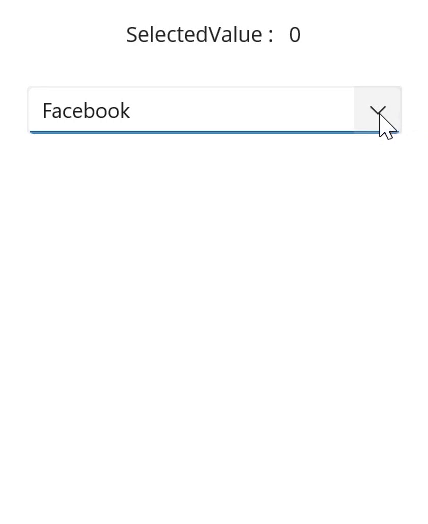

# Selection in .NET MAUI ComboBox (SfComboBox)

The ComboBox allows user to select single or multiple items from the drop-down list. The selection mode can be set by using the SelectionMode property. There are two different selection modes: Single, and Multiple.

## Single selection

The [ComboBox](https://help.syncfusion.com/cr/maui/Syncfusion.Maui.Inputs.SfComboBox.html) allows users to select an single item from the drop-down list.

### UI Selection 

The selected item can be changed interactively by selecting from the drop-down list or entering the value.




<editors:SfComboBox x:Name="comboBox"
                    IsEditable="True"
                    WidthRequest="250"
                    ItemsSource="{Binding SocialMedias}"
                    DisplayMemberPath="Name"
                    TextMemberPath="Name" />




The following gif image illustrates the result of the above code:

### Programmatic selection 

The selected item can be changed programmatically by using the [SelectedItem](https://help.syncfusion.com/cr/maui/Syncfusion.Maui.Inputs.DropDownControls.DropDownListBase.html#Syncfusion_Maui_Inputs_DropDownControls_DropDownListBase_SelectedItem) or [SelectedIndex](https://help.syncfusion.com/cr/maui/Syncfusion.Maui.Inputs.SfComboBox.html#Syncfusion_Maui_Inputs_SfComboBox_SelectedIndex) properties of the ComboBox control.




<editors:SfComboBox x:Name="comboBox"
                    WidthRequest="250"
                    MaxDropDownHeight="250"
                    IsEditable="True"
                    ItemsSource="{Binding SocialMedias}"
                    DisplayMemberPath="Name"
                    TextMemberPath="Name"
                    SelectedIndex="2" />





comboBox.SelectedIndex = 2;




The following gif image illustrates the result of the above code:

## Multiple selection

The ComboBox allows user to select multiple values from the drop-down list. Selected items will be displayed with a customizable token representation and the users can remove each tokenized item by clicking the close button. 

Token mode supports both editable and non-editable text boxes for selecting items from a data source. The multi-select ComboBox mode can be enabled by setting the SelectionMode property as Multiple.

### Programmatic selection

The selected items can be changed programmatically by using the SelectedItems property of ComboBox control.





 <editors:SfComboBox x:Name="comboBox" 
             HeightRequest="50"
             WidthRequest="350"
             ItemsSource="{Binding SocialMedias}"
             SelectionMode="Multiple"
             MaxDropDownHeight="250"
             DisplayMemberPath="Name"
             TextMemberPath="Name" />





  SocialMediaViewModel socialMediaViewModel = (this.comboBox.BindingContext as SocialMediaViewModel);
  ObservableCollection<SocialMedia> socialMediasList = socialMediaViewModel.SocialMedias;
  this.comboBox.SelectedItems.Add(socialMediasList[0]);
  this.comboBox.SelectedItems.Add(socialMediasList[2]);





The following image illustrates the result of the above code.

### UI selection

The selected items can be changed interactively by using keyboard or by selecting from a drop-down list. The selected items can be retrieved from the SelectedItems property of ComboBox control.





 <editors:SfComboBox x:Name="comboBox" 
             HeightRequest="50"
             WidthRequest="350"
             ItemsSource="{Binding SocialMedias}"
             SelectionMode="Multiple"
             MaxDropDownHeight="250"
             DisplayMemberPath="Name"
             TextMemberPath="Name" />





## Selection changed notification

When an item is selected from the drop-down list, the [SelectionChanged](https://help.syncfusion.com/cr/maui/Syncfusion.Maui.Inputs.DropDownControls.DropDownListBase.html#Syncfusion_Maui_Inputs_DropDownControls_DropDownListBase_SelectionChanged) event is triggered. The SelectionChanged event contains the newly selected and previously selected items in the `AddedItems` and `RemovedItems` properties. The SelectionChanged contains the following properties:

 * AddedItems - Contains the item that were currently selected.
 * RemovedItems - Contains the item that were unselected.




<editors:SfComboBox x:Name="comboBox" 
                    WidthRequest="250"
                    TextMemberPath="Name"
                    DisplayMemberPath="Name"
                    ItemsSource="{Binding SocialMedias}"
                    SelectionChanged="OnSelectionChanged" />





comboBox.SelectionChanged += OnSelectionChanged;




The SelectionChanged event can be handled as follows:




private async void OnSelectionChanged(object sender, Syncfusion.Maui.Inputs.SelectionChangedEventArgs e)
{
    await DisplayAlert("Alert", $"Selected Item has changed", "Ok");
}




The following image illustrates the result of the above code:

N> SelectionChanged event arguments `CurrentSelection` and `PreviousSelection` marked as "Obsolete". You can use the `AddedItems` and `RemovedItems` event arguments.

## Get the selected value

The [SelectedValuePath](https://help.syncfusion.com/cr/maui/Syncfusion.Maui.Inputs.DropDownControls.DropDownListBase.html#Syncfusion_Maui_Inputs_DropDownControls_DropDownListBase_SelectedValuePath) property allows you to specify a SelectedValue for a `ComboBox`'s `SelectedItem`. The [SelectedItem](https://help.syncfusion.com/cr/maui/Syncfusion.Maui.Inputs.DropDownControls.DropDownListBase.html#Syncfusion_Maui_Inputs_DropDownControls_DropDownListBase_SelectedItem) represents an object in the `Items` collection, and the `ComboBox` displays the value of the selected item's single property. The SelectedValuePath property specifies the path to the property that is used to determine the [SelectedValue](https://help.syncfusion.com/cr/maui/Syncfusion.Maui.Inputs.DropDownControls.DropDownListBase.html#Syncfusion_Maui_Inputs_DropDownControls_DropDownListBase_SelectedValue) property's value. The default value of SelectedValue and SelectedValuePath is `null`.

For example, when you select any `SocialMedia.Name` in the `ComboBox,` the `SelectedItem` property returns the `SocialMedia` data item that corresponds to the selected `SocialMedia.Name.` However, because the `SelectedValuePath` of this `ComboBox` is set to `SocialMedia.ID,` the `SelectedValue` is set to the `SocialMedia.ID.`




<editors:SfComboBox x:Name="comboBox"
                    WidthRequest="250"
                    MaxDropDownHeight="250"
                    SelectedValuePath="ID"
                    TextMemberPath="Name"   
                    DisplayMemberPath="Name"
                    ItemsSource="{Binding SocialMedias}" 
                    SelectionChanged="OnSelectionChanged"/>

<Label Text="SelectedValue :" />
<Label x:Name="selectedValue" />




comboBox.SelectedValuePath = "ID";
comboBox.SelectionChanged += OnSelectionChanged;







private void OnSelectionChanged(object sender, Syncfusion.Maui.Inputs.SelectionChangedEventArgs e)
{
    selectedValue.Text = comboBox.SelectedValue.ToString();
}




The following gif image illustrates the result of the above code:

## Open a drop-down programmatically

In the ComboBox control, the drop-down can be opened or closed programmatically by using the [IsDropDownOpen](https://help.syncfusion.com/cr/maui/Syncfusion.Maui.Core.SfDropdownEntry.html#Syncfusion_Maui_Core_SfDropdownEntry_IsDropDownOpen) property. The default value of the IsDropDownOpen property is `false`.




<editors:SfComboBox x:Name="comboBox"
                    WidthRequest="250"
                    IsEditable="true"
                    ItemsSource="{Binding SocialMedias}"
                    IsDropDownOpen = true;
                    DisplayMemberPath="Name"
                    TextMemberPath="Name">
</editors:SfComboBox>




comboBox.IsDropDownOpen = true;


