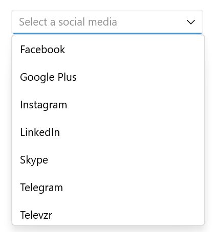
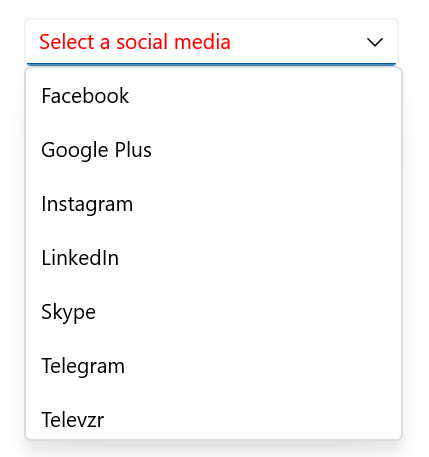
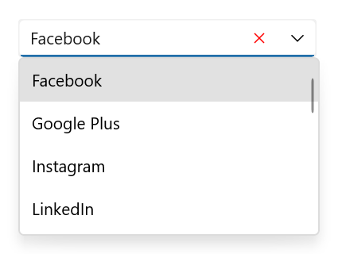
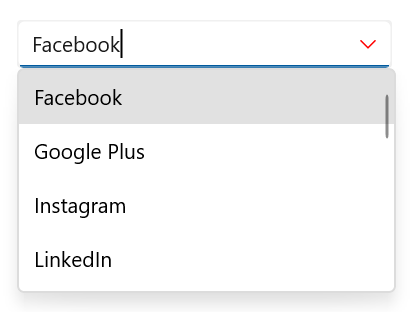
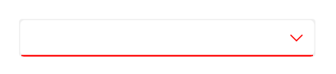
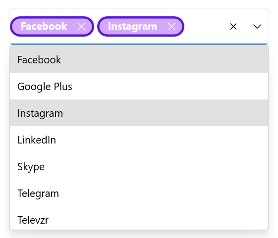
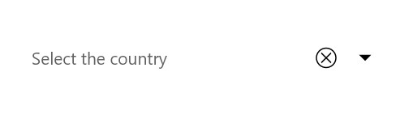
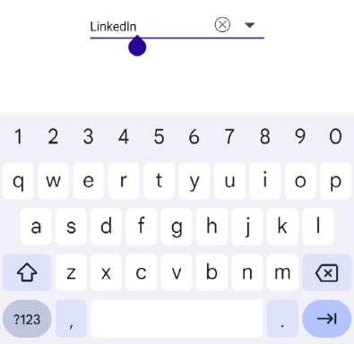
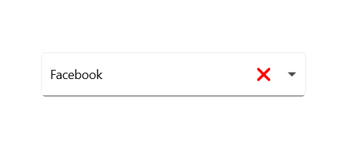
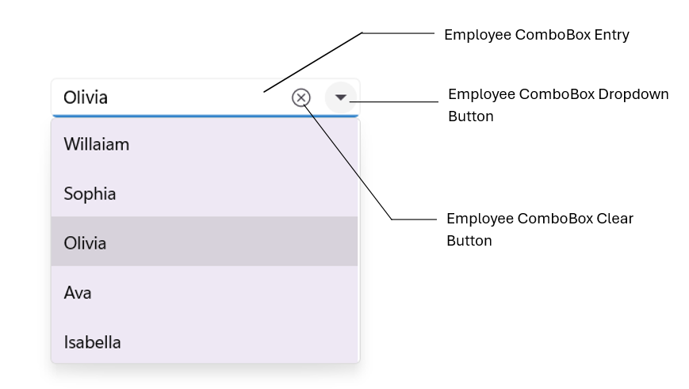

# UI Customization in .NET MAUI ComboBox

This section explains the different UI customizations available in [.NET MAUI ComboBox](https://help.syncfusion.com/cr/maui/Syncfusion.Maui.Inputs.SfComboBox.html).

To get started quickly with customizing the appearance of the .NET MAUI ComboBox, you can watch this video:



## Prerequisites

Before using the [SfComboBox](https://help.syncfusion.com/cr/maui/Syncfusion.Maui.Inputs.SfComboBox.html), ensure the following NuGet package is installed in your .NET MAUI project:

- `Syncfusion.Maui.Inputs`

For a step-by-step setup, refer to the [Getting Started](https://help.syncfusion.com/maui/combobox/getting-started) documentation.

## Placeholder

You can prompt the user with any information by using the [Placeholder](https://help.syncfusion.com/cr/maui/Syncfusion.Maui.Core.SfDropdownEntry.html#Syncfusion_Maui_Core_SfDropdownEntry_Placeholder) property. This text will be displayed only if no items are selected or the edit text is empty. The default value of Placeholder property is `string.Empty` (No string will be displayed).




<editors:SfComboBox x:Name="comboBox"
                    ItemsSource="{Binding SocialMedias}"
                    DisplayMemberPath="Name"
                    TextMemberPath="Name"
                    Placeholder="Select a social media" />




SfComboBox comboBox = new SfComboBox() 
{
    ItemsSource = socialMediaViewModel.SocialMedias,
    TextMemberPath = "Name",
    DisplayMemberPath = "Name",
    Placeholder = "Select a social media"
};




// ViewModel
public class SocialMediaViewModel
{
    public ObservableCollection<SocialMedia> SocialMedias { get; set; }

    public SocialMediaViewModel()
    {
        this.SocialMedias = new ObservableCollection<SocialMedia>
        {
            new SocialMedia { Name = "Facebook", ID = 0 },
            new SocialMedia { Name = "Google Plus", ID = 1 },
            new SocialMedia { Name = "Instagram", ID = 2 },
            new SocialMedia { Name = "LinkedIn", ID = 3 },
            new SocialMedia { Name = "Skype", ID = 4 },
            new SocialMedia { Name = "Telegram", ID = 5 },
            new SocialMedia { Name = "Twitter", ID = 6 },
            new SocialMedia { Name = "WhatsApp", ID = 7 },
            new SocialMedia { Name = "YouTube", ID = 8 }
        };
    }
}

public class SocialMedia
{
    public string Name { get; set; }
    public int ID { get; set; }
}




The following image illustrates the result of the above code:

## Placeholder color

The placeholder text color can be changed by using the [PlaceholderColor](https://help.syncfusion.com/cr/maui/Syncfusion.Maui.Core.SfDropdownEntry.html#Syncfusion_Maui_Core_SfDropdownEntry_PlaceholderColorProperty) property. The default value of PlaceholderColor property is `Colors.Gray`.




<editors:SfComboBox x:Name="comboBox"
                    ItemsSource="{Binding SocialMedias}"
                    DisplayMemberPath="Name"
                    TextMemberPath="Name"
                    PlaceholderColor="Red"
                    Placeholder="Select a social media" />




SfComboBox comboBox = new SfComboBox() 
{
    ItemsSource = socialMediaViewModel.SocialMedias,
    TextMemberPath = "Name",
    DisplayMemberPath = "Name",
    PlaceholderColor = Colors.Red,
    Placeholder = "Select a social media"
};




// ViewModel
public class SocialMediaViewModel
{
    public ObservableCollection<SocialMedia> SocialMedias { get; set; }

    public SocialMediaViewModel()
    {
        this.SocialMedias = new ObservableCollection<SocialMedia>
        {
            new SocialMedia { Name = "Facebook", ID = 0 },
            new SocialMedia { Name = "Google Plus", ID = 1 },
            new SocialMedia { Name = "Instagram", ID = 2 },
            new SocialMedia { Name = "LinkedIn", ID = 3 },
            new SocialMedia { Name = "Skype", ID = 4 },
            new SocialMedia { Name = "Telegram", ID = 5 },
            new SocialMedia { Name = "Twitter", ID = 6 },
            new SocialMedia { Name = "WhatsApp", ID = 7 },
            new SocialMedia { Name = "YouTube", ID = 8 }
        };
    }
}

public class SocialMedia
{
    public string Name { get; set; }
    public int ID { get; set; }
}




The following image illustrates the result of the above code:

## Clear Button Icon Color

The clear button icon color can be changed by using the [ClearButtonIconColor](https://help.syncfusion.com/cr/maui/Syncfusion.Maui.Core.SfDropdownEntry.html#Syncfusion_Maui_Core_SfDropdownEntry_ClearButtonIconColorProperty) property. The default value of the ClearButtonIconColor property is `Colors.Black`.




<editors:SfComboBox x:Name="combobox"
                    ItemsSource="{Binding SocialMedias}"
                    DisplayMemberPath="Name"
                    TextMemberPath="Name"
                    ClearButtonIconColor="Red" />




SfComboBox comboBox = new SfComboBox() 
{
    ItemsSource = socialMediaViewModel.SocialMedias,
    TextMemberPath = "Name",
    DisplayMemberPath = "Name",
    ClearButtonIconColor = Colors.Red
};




// ViewModel
public class SocialMediaViewModel
{
    public ObservableCollection<SocialMedia> SocialMedias { get; set; }

    public SocialMediaViewModel()
    {
        this.SocialMedias = new ObservableCollection<SocialMedia>
        {
            new SocialMedia { Name = "Facebook", ID = 0 },
            new SocialMedia { Name = "Google Plus", ID = 1 },
            new SocialMedia { Name = "Instagram", ID = 2 },
            new SocialMedia { Name = "LinkedIn", ID = 3 },
            new SocialMedia { Name = "Skype", ID = 4 },
            new SocialMedia { Name = "Telegram", ID = 5 },
            new SocialMedia { Name = "Twitter", ID = 6 },
            new SocialMedia { Name = "WhatsApp", ID = 7 },
            new SocialMedia { Name = "YouTube", ID = 8 }
        };
    }
}

public class SocialMedia
{
    public string Name { get; set; }
    public int ID { get; set; }
}




The following image illustrates the result of the above code:

## DropDown Icon Color

The DropDown icon color can be changed by using the [DropDownIconColor](https://help.syncfusion.com/cr/maui/Syncfusion.Maui.Inputs.SfComboBox.html#Syncfusion_Maui_Inputs_SfComboBox_DropDownIconColor) property. The default value of the `DropDownIconColor` property is `Colors.Black`.




<editors:SfComboBox x:Name="combobox"
                    ItemsSource="{Binding SocialMedias}"
                    DisplayMemberPath="Name"
                    TextMemberPath="Name"
                    DropDownIconColor="Red" />




SfComboBox comboBox = new SfComboBox() 
{
    ItemsSource = socialMediaViewModel.SocialMedias,
    TextMemberPath = "Name",
    DisplayMemberPath = "Name",
    DropDownIconColor = Colors.Red
};




// ViewModel
public class SocialMediaViewModel
{
    public ObservableCollection<SocialMedia> SocialMedias { get; set; }

    public SocialMediaViewModel()
    {
        this.SocialMedias = new ObservableCollection<SocialMedia>
        {
            new SocialMedia { Name = "Facebook", ID = 0 },
            new SocialMedia { Name = "Google Plus", ID = 1 },
            new SocialMedia { Name = "Instagram", ID = 2 },
            new SocialMedia { Name = "LinkedIn", ID = 3 },
            new SocialMedia { Name = "Skype", ID = 4 },
            new SocialMedia { Name = "Telegram", ID = 5 },
            new SocialMedia { Name = "Twitter", ID = 6 },
            new SocialMedia { Name = "WhatsApp", ID = 7 },
            new SocialMedia { Name = "YouTube", ID = 8 }
        };
    }
}

public class SocialMedia
{
    public string Name { get; set; }
    public int ID { get; set; }
}




The following image illustrates the result of the above code:

## Stroke

The ComboBox border color can be changed by using the [`Stroke`](https://help.syncfusion.com/cr/maui/Syncfusion.Maui.Core.SfDropdownEntry.html#Syncfusion_Maui_Core_SfDropdownEntry_Stroke) property.




<editors:SfComboBox x:Name="combobox"
                    ItemsSource="{Binding SocialMedias}"
                    DisplayMemberPath="Name"
                    TextMemberPath="Name"
                    DropDownIconColor="Red"
                    Stroke="Red" />




SfComboBox comboBox = new SfComboBox() 
{
    ItemsSource = socialMediaViewModel.SocialMedias,
    TextMemberPath = "Name",
    DisplayMemberPath = "Name",
    Stroke = Colors.Red,
    DropDownIconColor = Colors.Red
};




// ViewModel
public class SocialMediaViewModel
{
    public ObservableCollection<SocialMedia> SocialMedias { get; set; }

    public SocialMediaViewModel()
    {
        this.SocialMedias = new ObservableCollection<SocialMedia>
        {
            new SocialMedia { Name = "Facebook", ID = 0 },
            new SocialMedia { Name = "Google Plus", ID = 1 },
            new SocialMedia { Name = "Instagram", ID = 2 },
            new SocialMedia { Name = "LinkedIn", ID = 3 },
            new SocialMedia { Name = "Skype", ID = 4 },
            new SocialMedia { Name = "Telegram", ID = 5 },
            new SocialMedia { Name = "Twitter", ID = 6 },
            new SocialMedia { Name = "WhatsApp", ID = 7 },
            new SocialMedia { Name = "YouTube", ID = 8 }
        };
    }
}

public class SocialMedia
{
    public string Name { get; set; }
    public int ID { get; set; }
}




The following image illustrates the result of the above code:

## Customize the selection text highlight color

The [SelectionTextHighlightColor](https://help.syncfusion.com/cr/maui/Syncfusion.Maui.Inputs.DropDownControls.DropDownListBase.html#Syncfusion_Maui_Inputs_DropDownControls_DropDownListBase_SelectionTextHighlightColor) property is used to modify the background color of the selected item text in the combobox control.




<editors:SfComboBox x:Name="comboBox"
                    ItemsSource="{Binding SocialMedias}"
                    DisplayMemberPath="Name"
                    TextMemberPath="Name"
                    Placeholder="Enter Media"
                    SelectionTextHighlightColor="Green" />





SfComboBox comboBox = new SfComboBox() 
{
    ItemsSource = socialMediaViewModel.SocialMedias,
    DisplayMemberPath = "Name",
    TextMemberPath = "Name",
    Placeholder = "Enter Media",
    SelectionTextHighlightColor = Colors.Green,
};




// ViewModel
public class SocialMediaViewModel
{
    public ObservableCollection<SocialMedia> SocialMedias { get; set; }

    public SocialMediaViewModel()
    {
        this.SocialMedias = new ObservableCollection<SocialMedia>
        {
            new SocialMedia { Name = "Facebook", ID = 0 },
            new SocialMedia { Name = "Google Plus", ID = 1 },
            new SocialMedia { Name = "Instagram", ID = 2 },
            new SocialMedia { Name = "LinkedIn", ID = 3 },
            new SocialMedia { Name = "Skype", ID = 4 },
            new SocialMedia { Name = "Telegram", ID = 5 },
            new SocialMedia { Name = "Twitter", ID = 6 },
            new SocialMedia { Name = "WhatsApp", ID = 7 },
            new SocialMedia { Name = "YouTube", ID = 8 }
        };
    }
}

public class SocialMedia
{
    public string Name { get; set; }
    public int ID { get; set; }
}




## CustomView for ComboBox

[CustomView](https://help.syncfusion.com/cr/maui/Syncfusion.Maui.Inputs.SfComboBox.html#Syncfusion_Maui_Inputs_SfComboBox_CustomView) property is used to provide a custom view instead of an Entry in the ComboBox. Its default height and width match the control height and width.





<editors:SfComboBox x:Name="comboBox">
    <editors:SfComboBox.CustomView>
        <Label x:Name="customLabel"  
               Text="Custom View"  
               TextColor="Red"
               HorizontalOptions="Center"
               VerticalTextAlignment="Center"/>
    </editors:SfComboBox.CustomView>
</editors:SfComboBox>





SfComboBox comboBox = new SfComboBox
{
    CustomView = new Label
    {
        Text = "Custom View",
        TextColor = Colors.Red,
        HorizontalOptions = LayoutOptions.Center,
        VerticalTextAlignment = TextAlignment.Center
    }
};





N> `SfComboBox` clear button will not be supported when using Custom View.

## Maximum DropDown Height

The maximum height of the drop-down can be changed by using the [MaxDropDownHeight](https://help.syncfusion.com/cr/maui/Syncfusion.Maui.Core.SfDropdownEntry.html#Syncfusion_Maui_Core_SfDropdownEntry_MaxDropDownHeight) property of the ComboBox control. The default value of `MaxDropDownHeight` property is `400d`.

 N> If the `MaxDropDownHeight` is too small compared to the populated items, the scroll viewer will be automatically shown to navigate the hidden items.




    <editors:SfComboBox x:Name="comboBox"
                        IsEditable="True"
                        MaxDropDownHeight="150"
                        ItemsSource="{Binding SocialMedias}"
                        DisplayMemberPath="Name"
                        TextMemberPath="Name" />




SfComboBox comboBox = new SfComboBox() 
{
    IsEditable = true,
    MaxDropDownHeight = 150,
    ItemsSource = socialMediaViewModel.SocialMedias,
    TextMemberPath = "Name",
    DisplayMemberPath = "Name",
};




// ViewModel
public class SocialMediaViewModel
{
    public ObservableCollection<SocialMedia> SocialMedias { get; set; }

    public SocialMediaViewModel()
    {
        this.SocialMedias = new ObservableCollection<SocialMedia>
        {
            new SocialMedia { Name = "Facebook", ID = 0 },
            new SocialMedia { Name = "Google Plus", ID = 1 },
            new SocialMedia { Name = "Instagram", ID = 2 },
            new SocialMedia { Name = "LinkedIn", ID = 3 },
            new SocialMedia { Name = "Skype", ID = 4 },
            new SocialMedia { Name = "Telegram", ID = 5 },
            new SocialMedia { Name = "Twitter", ID = 6 },
            new SocialMedia { Name = "WhatsApp", ID = 7 },
            new SocialMedia { Name = "YouTube", ID = 8 }
        };
    }
}

public class SocialMedia
{
    public string Name { get; set; }
    public int ID { get; set; }
}




The following image illustrates the result of the above code:

## DropDown button customization

We can customize the size of the drop down button in [ComboBox](https://help.syncfusion.com/cr/maui/Syncfusion.Maui.Inputs.SfComboBox.html) by using the `Width` and `Height` properties in [DropDownButtonSettings](https://help.syncfusion.com/cr/maui/Syncfusion.Maui.Inputs.SfComboBox.html#Syncfusion_Maui_Inputs_SfComboBox_DropDownButtonSettings).





<editors:SfComboBox x:Name="comboBox"
                    Placeholder="Enter Social Media"
                    ItemsSource="{Binding SocialMedias}"
                    TextMemberPath="Name"
                    DisplayMemberPath="Name"/>
    <editors:SfComboBox.DropDownButtonSettings>
        <editors:DropDownButtonSettings Width="50" Height="50" />
    </editors:SfComboBox.DropDownButtonSettings>
    
</editors:SfComboBox>





SfComboBox comboBox = new SfComboBox
{
    Placeholder = "Enter Social Media",
    ItemsSource = socialMediaViewModel.SocialMedias,
    TextMemberPath = "Name",
    DisplayMemberPath = "Name",
    DropDownButtonSettings = new DropDownButtonSettings
    {
        Width = 50,
        Height = 40
    }
};




// ViewModel
public class SocialMediaViewModel
{
    public ObservableCollection<SocialMedia> SocialMedias { get; set; }

    public SocialMediaViewModel()
    {
        this.SocialMedias = new ObservableCollection<SocialMedia>
        {
            new SocialMedia { Name = "Facebook", ID = 0 },
            new SocialMedia { Name = "Google Plus", ID = 1 },
            new SocialMedia { Name = "Instagram", ID = 2 },
            new SocialMedia { Name = "LinkedIn", ID = 3 },
            new SocialMedia { Name = "Skype", ID = 4 },
            new SocialMedia { Name = "Telegram", ID = 5 },
            new SocialMedia { Name = "Twitter", ID = 6 },
            new SocialMedia { Name = "WhatsApp", ID = 7 },
            new SocialMedia { Name = "YouTube", ID = 8 }
        };
    }
}

public class SocialMedia
{
    public string Name { get; set; }
    public int ID { get; set; }
}




## Styling token items

The ComboBox control allows you to customize the style of TokenItem generated in the selection area by using the [TokenItemStyle](https://help.syncfusion.com/cr/maui/Syncfusion.Maui.Inputs.DropDownControls.DropDownListBase.html#Syncfusion_Maui_Inputs_DropDownControls_DropDownListBase_TokenItemStyle) property. 





  <editors:SfComboBox SelectionMode="Multiple" 
             x:Name="comboBox" 
             ItemsSource="{Binding SocialMedias}" 
             MaxDropDownHeight="250"
             DisplayMemberPath="Name"
             TextMemberPath="Name">
     <editors:SfComboBox.TokenItemStyle>
         
     </editors:SfComboBox.TokenItemStyle>
 </editors:SfComboBox>




// ViewModel
public class SocialMediaViewModel
{
    public ObservableCollection<SocialMedia> SocialMedias { get; set; }

    public SocialMediaViewModel()
    {
        this.SocialMedias = new ObservableCollection<SocialMedia>
        {
            new SocialMedia { Name = "Facebook", ID = 0 },
            new SocialMedia { Name = "Google Plus", ID = 1 },
            new SocialMedia { Name = "Instagram", ID = 2 },
            new SocialMedia { Name = "LinkedIn", ID = 3 },
            new SocialMedia { Name = "Skype", ID = 4 },
            new SocialMedia { Name = "Telegram", ID = 5 },
            new SocialMedia { Name = "Twitter", ID = 6 },
            new SocialMedia { Name = "WhatsApp", ID = 7 },
            new SocialMedia { Name = "YouTube", ID = 8 }
        };
    }
}

public class SocialMedia
{
    public string Name { get; set; }
    public int ID { get; set; }
}




The following image illustrates the result of the above code.

## CursorPosition

The cursor position in the input view can be obtained or updated using the [CursorPosition](https://help.syncfusion.com/cr/maui/Syncfusion.Maui.Core.SfDropdownEntry.html#Syncfusion_Maui_Core_SfDropdownEntry_CursorPosition) property in the ComboBox.




<editors:SfComboBox x:Name="comboBox"
                    IsEditable="True"
                    CursorPosition = "4" />



SfComboBox comboBox = new SfComboBox
{
    IsEditable = true,
    CursorPosition = 4
};




N> The cursor position support is available for editable mode only, and two-way binding is not supported in the Android platform.

## Border visibility

The [ShowBorder](https://help.syncfusion.com/cr/maui/Syncfusion.Maui.Inputs.SfComboBox.html#Syncfusion_Maui_Inputs_SfComboBox_ShowBorder) property of ComboBox is used to modify the visibility of the border and its default value is **true**. The following code example demonstrates how to change the border visibility.




<editors:SfComboBox x:Name="comboBox"
                    ShowBorder="False"/>



SfComboBox comboBox = new SfComboBox
{
    ShowBorder = false
};




The following image illustrates the result of the above code:

## TextAlignment

The ComboBox provides support to customize the text alignment by using the [HorizontalTextAlignment](https://help.syncfusion.com/cr/maui/Syncfusion.Maui.Inputs.SfComboBox.html#Syncfusion_Maui_Inputs_SfComboBox_HorizontalTextAlignment) and [VerticalTextAlignment](https://help.syncfusion.com/cr/maui/Syncfusion.Maui.Inputs.SfComboBox.html#Syncfusion_Maui_Inputs_SfComboBox_VerticalTextAlignment) properties.

N> Dynamic changes to the `HorizontalTextAlignment` property may not be functioning as expected on Android platform.




<editors:SfComboBox x:Name="comboBox"
                    HorizontalTextAlignment="Center" 
                    VerticalTextAlignment="Start"/>



SfComboBox comboBox = new SfComboBox
{
    HorizontalTextAlignment = TextAlignment.Center,
    VerticalTextAlignment = TextAlignment.Start
};




The following image illustrates the result of the above code:

## ReturnType

The [ReturnType](https://help.syncfusion.com/cr/maui/Syncfusion.Maui.Inputs.DropDownControls.DropDownListBase.html#Syncfusion_Maui_Inputs_DropDownControls_DropDownListBase_ReturnType) property specifies the return button (e.g., Next, Done, Go) of the keyboard. It helps manage the flow between multiple input fields by defining what happens when the action button is pressed.

You can define the return key type of `ComboBox` by using the `ReturnType` property.

N> Default value of ReturnType is `Default`.




<editors:SfComboBox x:Name="comboBox"
                    ItemsSource="{Binding SocialMedias}"
                    DisplayMemberPath="Name"
                    TextMemberPath="Name" 
                    ReturnType="Next"/>




SfComboBox comboBox = new SfComboBox() 
{
    ItemsSource = socialMediaViewModel.SocialMedias,
    DisplayMemberPath = "Name",
    TextMemberPath="Name",
    ReturnType = ReturnType.Next
};




// ViewModel
public class SocialMediaViewModel
{
    public ObservableCollection<SocialMedia> SocialMedias { get; set; }

    public SocialMediaViewModel()
    {
        this.SocialMedias = new ObservableCollection<SocialMedia>
        {
            new SocialMedia { Name = "Facebook", ID = 0 },
            new SocialMedia { Name = "Google Plus", ID = 1 },
            new SocialMedia { Name = "Instagram", ID = 2 },
            new SocialMedia { Name = "LinkedIn", ID = 3 },
            new SocialMedia { Name = "Skype", ID = 4 },
            new SocialMedia { Name = "Telegram", ID = 5 },
            new SocialMedia { Name = "Twitter", ID = 6 },
            new SocialMedia { Name = "WhatsApp", ID = 7 },
            new SocialMedia { Name = "YouTube", ID = 8 }
        };
    }
}

public class SocialMedia
{
    public string Name { get; set; }
    public int ID { get; set; }
}




## Clear button customization

The [ClearButtonPath](https://help.syncfusion.com/cr/maui/Syncfusion.Maui.Core.SfDropdownEntry.html#Syncfusion_Maui_Core_SfDropdownEntry_ClearButtonPath) property allows users to set the path for customizing the appearance of the ComboBox clear button.




<editors:SfComboBox x:Name="comboBox"
                    ItemsSource="{Binding SocialMedias}"
                    TextMemberPath="Name"
                    DisplayMemberPath="Name">
            <editors:SfComboBox.ClearButtonPath>
                <Path Data="M1.70711 0.292893C1.31658 -0.097631 0.683417 -0.097631 0.292893 0.292893C-0.097631 0.683417 -0.097631 1.31658 0.292893 1.70711L5.58579 7L0.292893 12.2929C-0.097631 12.6834 -0.097631 13.3166 0.292893 13.7071C0.683417 14.0976 1.31658 14.0976 1.70711 13.7071L7 8.41421L12.2929 13.7071C12.6834 14.0976 13.3166 14.0976 13.7071 13.7071C14.0976 13.3166 14.0976 12.6834 13.7071 12.2929L8.41421 7L13.7071 1.70711C14.0976 1.31658 14.0976 0.683417 13.7071 0.292893C13.3166 -0.097631 12.6834 -0.097631 12.2929 0.292893L7 5.58579L1.70711 0.292893Z" 
                Fill="Red" 
                Stroke="Red"/>
            </editors:SfComboBox.ClearButtonPath>
</editors:SfComboBox>




private string _customPath = "M1.70711 0.292893C1.31658 -0.097631 0.683417 -0.097631 0.292893 0.292893C-0.097631 0.683417 -0.097631 1.31658 0.292893 1.70711L5.58579 7L0.292893 12.2929C-0.097631 12.6834 -0.097631 13.3166 0.292893 13.7071C0.683417 14.0976 1.31658 14.0976 1.70711 13.7071L7 8.41421L12.2929 13.7071C12.6834 14.0976 13.3166 14.0976 13.7071 13.7071C14.0976 13.3166 14.0976 12.6834 13.7071 12.2929L8.41421 7L13.7071 1.70711C14.0976 1.31658 14.0976 0.683417 13.7071 0.292893C13.3166 -0.097631 12.6834 -0.097631 12.2929 0.292893L7 5.58579L1.70711 0.292893Z";

var converter = new PathGeometryConverter();
var path = new Path() 
{ 
    Data = (PathGeometry)converter.ConvertFromInvariantString(_customPath),
    Fill = Colors.Red,
    Stroke = Colors.Red
};

SfComboBox comboBox = new SfComboBox();
comboBox.ItemsSource = viewModel.SocialMedia;
comboBox.DisplayMemberPath = "Name";
comboBox.TextMemberPath = "Name";
comboBox.ClearButtonPath = path;




// ViewModel
public class SocialMediaViewModel
{
    public ObservableCollection<SocialMedia> SocialMedias { get; set; }

    public SocialMediaViewModel()
    {
        this.SocialMedias = new ObservableCollection<SocialMedia>
        {
            new SocialMedia { Name = "Facebook", ID = 0 },
            new SocialMedia { Name = "Google Plus", ID = 1 },
            new SocialMedia { Name = "Instagram", ID = 2 },
            new SocialMedia { Name = "LinkedIn", ID = 3 },
            new SocialMedia { Name = "Skype", ID = 4 },
            new SocialMedia { Name = "Telegram", ID = 5 },
            new SocialMedia { Name = "Twitter", ID = 6 },
            new SocialMedia { Name = "WhatsApp", ID = 7 },
            new SocialMedia { Name = "YouTube", ID = 8 }
        };
    }
}

public class SocialMedia
{
    public string Name { get; set; }
    public int ID { get; set; }
}




The following image illustrates the result of the above code:

## Return Command and Return Command Parameter

- [ReturnCommand](https://help.syncfusion.com/cr/maui/Syncfusion.Maui.Inputs.DropDownControls.DropDownListBase.html#Syncfusion_Maui_Inputs_DropDownControls_DropDownListBase_ReturnCommand), of type ICommand, defines the command to be executed when the return key is pressed.
- [ReturnCommandParameter](https://help.syncfusion.com/cr/maui/Syncfusion.Maui.Inputs.DropDownControls.DropDownListBase.html#Syncfusion_Maui_Inputs_DropDownControls_DropDownListBase_ReturnCommandParameter), of type object, specifies the parameter for the `ReturnCommand`.




<editors:SfComboBox x:Name="comboBox"
                    ItemsSource="{Binding SocialMedia}"
                    DisplayMemberPath="Name"
                    TextMemberPath="Name"
                    ReturnCommand="{Binding AlertCommand}"
                    ReturnCommandParameter="Return key is pressed"/>




SfComboBox comboBox = new SfComboBox
{
    ItemsSource = viewModel.SocialMedia,
    DisplayMemberPath = "Name",
    TextMemberPath = "Name",
    ReturnCommand = viewModel.AlertCommand,
    ReturnCommandParameter = "Return key is pressed"
};




// ViewModel
public class SocialMediaViewModel
{
    public ObservableCollection<SocialMedia> SocialMedias { get; set; }

    public SocialMediaViewModel()
    {
        this.SocialMedias = new ObservableCollection<SocialMedia>
        {
            new SocialMedia { Name = "Facebook", ID = 0 },
            new SocialMedia { Name = "Google Plus", ID = 1 },
            new SocialMedia { Name = "Instagram", ID = 2 },
            new SocialMedia { Name = "LinkedIn", ID = 3 },
            new SocialMedia { Name = "Skype", ID = 4 },
            new SocialMedia { Name = "Telegram", ID = 5 },
            new SocialMedia { Name = "Twitter", ID = 6 },
            new SocialMedia { Name = "WhatsApp", ID = 7 },
            new SocialMedia { Name = "YouTube", ID = 8 }
        };
    }
}

public class SocialMedia
{
    public string Name { get; set; }
    public int ID { get; set; }
}







public SocialMediaViewModel
{
    public ICommand AlertCommand => new Command<string>(OnAlertCommandExecuted);

    private async void OnAlertCommandExecuted(string parameter)
    {
        await Application.Current.MainPage.DisplayAlertAsync("Alert", parameter, "OK");
    }
}




## Automation ID

The [ComboBox](https://help.syncfusion.com/cr/maui/Syncfusion.Maui.Inputs.SfComboBox.html) control provides `AutomationId` support for the `editable entry`, the `clear button`, and the `dropdown button`, enabling UI automation frameworks to reliably target these primary elements. Each element’s AutomationId is derived from the control’s AutomationId to ensure uniqueness.

For example, if the ComboBox’s `AutomationId` is set to “Employee ComboBox,” the editable entry can be targeted as “Employee ComboBox Entry,” the clear button as “Employee ComboBox Clear Button,” and the dropdown button as “Employee ComboBox Dropdown Button.” This focused support improves accessibility and automated UI testing by providing stable, predictable identifiers for the primary interactive elements. The following screenshot illustrates the AutomationIds of inner elements.

The following screenshot illustrates the AutomationIds of inner elements.

## See Also

* [Header and footer](https://help.syncfusion.com/maui/combobox/header-and-footer)
* [No results found](https://help.syncfusion.com/maui/combobox/no-results-found)
* [Liquid Glass support](https://help.syncfusion.com/maui/combobox/liquidglasssupport)