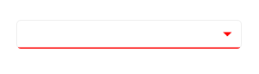
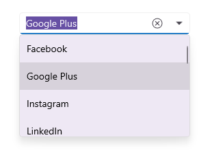

# UI Customization in .NET MAUI ComboBox (SfComboBox)

This section explains different UI customizations available in [SfComboBox](https://help.syncfusion.com/cr/maui/Syncfusion.Maui.Inputs.SfComboBox.html).

## Placeholder

You can prompt the user with any information by using the [Placeholder](https://help.syncfusion.com/cr/maui/Syncfusion.Maui.Core.SfDropdownEntry.html#Syncfusion_Maui_Core_SfDropdownEntry_Placeholder) property. This text will be displayed only if no items are selected or the edit text is empty. The default value of Placeholder property is `string.Empty` (No string will be displayed).




<editors:SfComboBox x:Name="comboBox"
                    WidthRequest="250"
                    ItemsSource="{Binding SocialMedias}"
                    DisplayMemberPath="Name"
                    TextMemberPath="Name"
                    Placeholder="Select a social media" />




comboBox.Placeholder = "Select a social media";




The following image illustrates the result of the above code:

## Placeholder color

The placeholder text color can be changed by using the [PlaceholderColor](https://help.syncfusion.com/cr/maui/Syncfusion.Maui.Core.SfDropdownEntry.html#Syncfusion_Maui_Core_SfDropdownEntry_PlaceholderColorProperty) property. The default value of PlaceholderColor property is `Colors.Gray`.




<editors:SfComboBox x:Name="comboBox"
                    WidthRequest="250"
                    ItemsSource="{Binding SocialMedias}"
                    DisplayMemberPath="Name"
                    TextMemberPath="Name"
                    PlaceholderColor="Red"
                    Placeholder="Select a social media" />




comboBox.PlaceholderColor = Colors.Red;




The following image illustrates the result of the above code:

## Clear Button Icon Color

The clear button icon color can be changed by using the [ClearButtonIconColor](https://help.syncfusion.com/cr/maui/Syncfusion.Maui.Core.SfDropdownEntry.html#Syncfusion_Maui_Core_SfDropdownEntry_ClearButtonIconColorProperty) property. The default value of the ClearButtonIconColor property is `Colors.Black`.




<editors:SfComboBox x:Name="combobox"
                    WidthRequest="250"
                    ItemsSource="{Binding SocialMedias}"
                    DisplayMemberPath="Name"
                    TextMemberPath="Name"
                    ClearButtonIconColor="Red" />




combobox.ClearButtonIconColor = Colors.Red;




The following gif image illustrates the result of the above code:

## DropDown Icon Color

The DropDown icon color can be changed by using the [DropDownIconColor](https://help.syncfusion.com/cr/maui/Syncfusion.Maui.Inputs.SfComboBox.html#Syncfusion_Maui_Inputs_SfComboBox_DropDownIconColor) property. The default value of the DropDownIconColor property is `Colors.Black`.




<editors:SfComboBox x:Name="combobox"
                    WidthRequest="250"
                    ItemsSource="{Binding SocialMedias}"
                    DisplayMemberPath="Name"
                    TextMemberPath="Name"
                    DropDownIconColor="Red" />




combobox.DropDownIconColor = Colors.Red;




The following gif image illustrates the result of the above code:

## Border Color

The ComboBox border color can be changed by using the [BorderColor](https://help.syncfusion.com/cr/maui/Syncfusion.Maui.Core.SfDropdownEntry.html#Syncfusion_Maui_Core_SfDropdownEntry_BorderColor) property.




<editors:SfComboBox x:Name="combobox"
                    WidthRequest="250"
                    ItemsSource="{Binding SocialMedias}"
                    DisplayMemberPath="Name"
                    TextMemberPath="Name"
                    DropDownIconColor="Red"
                    BorderColor="Red" />




combobox.BorderColor = Colors.Red;




The following gif image illustrates the result of the above code:

## Maximum DropDown Height

The maximum height of the drop-down can be changed by using the [MaxDropDownHeight](https://help.syncfusion.com/cr/maui/Syncfusion.Maui.Core.SfDropdownEntry.html#Syncfusion_Maui_Core_SfDropdownEntry_MaxDropDownHeight) property of the ComboBox control. The default value of MaxDropDownHeight property is `400d`.

 N> If the `MaxDropDownHeight` is too small compared to the populated items, the scroll viewer will be automatically shown to navigate the hidden items.




<editors:SfComboBox x:Name="comboBox"
                    WidthRequest="250"
                    IsEditable="true"
                    MaxDropDownHeight="150"
                    ItemsSource="{Binding SocialMedias}"
                    DisplayMemberPath="Name"
                    TextMemberPath="Name" />




comboBox.MaxDropDownHeight = 150;




The following image illustrates the result of the above code:

