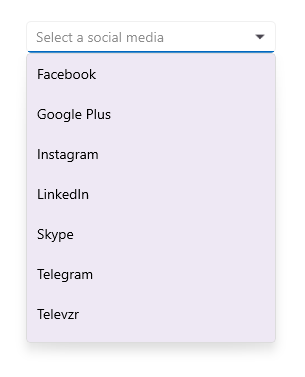
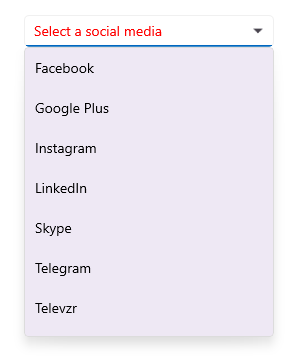
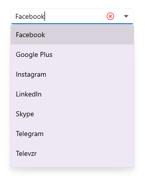
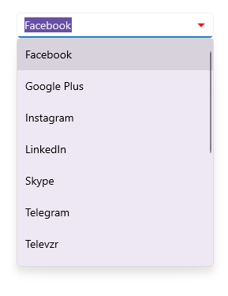
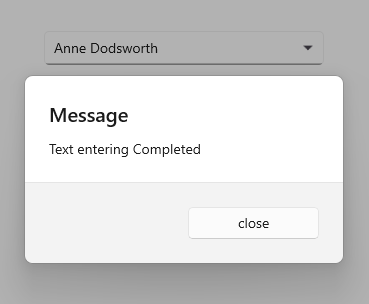

# UI Customization in .NET MAUI ComboBox (SfComboBox)

This section explains different UI customizations available in [SfComboBox](https://help.syncfusion.com/cr/maui/Syncfusion.Maui.Inputs.SfComboBox.html).

## Placeholder

You can prompt the user with any information by using the [Placeholder](https://help.syncfusion.com/cr/maui/Syncfusion.Maui.Core.SfDropdownEntry.html#Syncfusion_Maui_Core_SfDropdownEntry_Placeholder) property. This text will be displayed only if no items are selected or the edit text is empty. The default value of Placeholder property is `string.Empty` (No string will be displayed).




<editors:SfComboBox x:Name="comboBox"
                    WidthRequest="250"
                    ItemsSource="{Binding SocialMedias}"
                    DisplayMemberPath="Name"
                    TextMemberPath="Name"
                    Placeholder="Select a social media" />




comboBox.Placeholder = "Select a social media";




The following image illustrates the result of the above code:

## Placeholder color

The placeholder text color can be changed by using the [PlaceholderColor](https://help.syncfusion.com/cr/maui/Syncfusion.Maui.Core.SfDropdownEntry.html#Syncfusion_Maui_Core_SfDropdownEntry_PlaceholderColorProperty) property. The default value of PlaceholderColor property is `Colors.Gray`.




<editors:SfComboBox x:Name="comboBox"
                    WidthRequest="250"
                    ItemsSource="{Binding SocialMedias}"
                    DisplayMemberPath="Name"
                    TextMemberPath="Name"
                    PlaceholderColor="Red"
                    Placeholder="Select a social media" />




comboBox.PlaceholderColor = Colors.Red;




The following image illustrates the result of the above code:

## Clear Button Icon Color

The clear button icon color can be changed by using the [ClearButtonIconColor](https://help.syncfusion.com/cr/maui/Syncfusion.Maui.Core.SfDropdownEntry.html#Syncfusion_Maui_Core_SfDropdownEntry_ClearButtonIconColorProperty) property. The default value of the ClearButtonIconColor property is `Colors.Black`.




<editors:SfComboBox x:Name="combobox"
                    WidthRequest="250"
                    ItemsSource="{Binding SocialMedias}"
                    DisplayMemberPath="Name"
                    TextMemberPath="Name"
                    ClearButtonIconColor="Red" />




combobox.ClearButtonIconColor = Colors.Red;




The following gif image illustrates the result of the above code:

## DropDown Icon Color

The DropDown icon color can be changed by using the [DropDownIconColor](https://help.syncfusion.com/cr/maui/Syncfusion.Maui.Inputs.SfComboBox.html#Syncfusion_Maui_Inputs_SfComboBox_DropDownIconColor) property. The default value of the DropDownIconColor property is `Colors.Black`.




<editors:SfComboBox x:Name="combobox"
                    WidthRequest="250"
                    ItemsSource="{Binding SocialMedias}"
                    DisplayMemberPath="Name"
                    TextMemberPath="Name"
                    DropDownIconColor="Red" />




combobox.DropDownIconColor = Colors.Red;




The following gif image illustrates the result of the above code:

## Stroke

The ComboBox border color can be changed by using the [`Stroke`](https://help.syncfusion.com/cr/maui/Syncfusion.Maui.Core.SfDropdownEntry.html#Syncfusion_Maui_Core_SfDropdownEntry_Stroke) property.




<editors:SfComboBox x:Name="combobox"
                    WidthRequest="250"
                    ItemsSource="{Binding SocialMedias}"
                    DisplayMemberPath="Name"
                    TextMemberPath="Name"
                    DropDownIconColor="Red"
                    Stroke="Red" />




combobox.Stroke = Colors.Red;




The following gif image illustrates the result of the above code:

## Customize the selection text highlightColor 

The SelectionTextHighlightColor property is used to modify the background color of the selected item text in the combobox control.




<editors:SfCombobox x:Name="combobox"
                        WidthRequest="250"
                        ItemsSource="{Binding SocialMedias}"
                        DisplayMemberPath="Name"
                        TextMemberPath="Name"
                        Placeholder="Select a social media"
                        SelectionTextHighlightColor="Aqua" />





combobox.SelectionTextHighlightColor = Colors.Aqua;




## Maximum DropDown Height

The maximum height of the drop-down can be changed by using the [MaxDropDownHeight](https://help.syncfusion.com/cr/maui/Syncfusion.Maui.Core.SfDropdownEntry.html#Syncfusion_Maui_Core_SfDropdownEntry_MaxDropDownHeight) property of the ComboBox control. The default value of MaxDropDownHeight property is `400d`.

 N> If the `MaxDropDownHeight` is too small compared to the populated items, the scroll viewer will be automatically shown to navigate the hidden items.




<editors:SfComboBox x:Name="comboBox"
                    WidthRequest="250"
                    IsEditable="true"
                    MaxDropDownHeight="150"
                    ItemsSource="{Binding SocialMedias}"
                    DisplayMemberPath="Name"
                    TextMemberPath="Name" />




comboBox.MaxDropDownHeight = 150;




The following image illustrates the result of the above code:

## Customize the DropDown (suggestion) item 

The [ItemTemplate](https://help.syncfusion.com/cr/maui/Syncfusion.Maui.Inputs.DropDownControls.DropDownListBase.html#Syncfusion_Maui_Inputs_DropDownControls_DropDownListBase_ItemTemplate) property helps you to decorate drop-down items using the custom templates. The default value of the `ItemTemplate` is `null`. The following example shows how to customize drop-down items using templates.




    //Model.cs
    public class Employee
    {
        public string Name { get; set; }
        public string ProfilePicture { get; set; }
        public string Designation { get; set; }
        public string ID { get; set; }
    }

    //ViewModel.cs
    public class EmployeeViewModel
    {
        public ObservableCollection<Employee> Employees { get; set; }
        public EmployeeViewModel()
        {
            this.Employees = new ObservableCollection<Employee>();
            Employees.Add(new Employee
            {
                Name = "Anne Dodsworth",
                ProfilePicture = "people_circle1.png",
                Designation = "Developer",
                ID = "E001",
            });
            Employees.Add(new Employee
            {
                Name = "Andrew Fuller",
                ProfilePicture = "people_circle8.png", 
                Designation = "Team Lead",
                ID = "E002",
            });
            ...
        }
    }







    <editors:SfComboBox Placeholder="Select an employee"
                        TextMemberPath="Name"
                        DisplayMemberPath="Name"
                        ItemsSource="{Binding Employees}"
                        WidthRequest="280"
                        HeightRequest="34"
                        x:Name="comboBox">
        <editors:SfComboBox.BindingContext>
            <local:EmployeeViewModel/>
        </editors:SfComboBox.BindingContext>
        <editors:SfComboBox.ItemTemplate>
            <DataTemplate >
                <ViewCell>
                    <Grid Margin="0,5"
                          VerticalOptions="Center"
                          HorizontalOptions="Center"
                          ColumnDefinitions="48,220"
                          RowDefinitions="50">
                        <Image Grid.Column="0"
                               HorizontalOptions="Center"
                               VerticalOptions="Center"
                               Source="{Binding ProfilePicture}"
                               Aspect="AspectFit"/>
                        <StackLayout HorizontalOptions="Start"
                                     VerticalOptions="Center"
                                     Grid.Column="1"
                                     Margin="15,0,0,0">
                            <Label HorizontalTextAlignment="Start"
                                   VerticalTextAlignment="Center"
                                   Opacity=".87"
                                   FontSize="14"
                                   Text="{Binding Name}"/>
                            <Label HorizontalOptions="Start"
                                   VerticalTextAlignment="Center"
                                   Opacity=".54"
                                   FontSize="12"
                                   Text="{Binding Designation}"/>
                        </StackLayout>
                    </Grid>
                </ViewCell>
            </DataTemplate>
        </editors:SfComboBox.ItemTemplate>
    </editors:SfComboBox>




    EmployeeViewModel employee = new EmployeeViewModel();

    SfComboBox comboBox = new SfComboBox()
        {
            HeightRequest = 34,
            WidthRequest = 280,
            BindingContext = employee,
            ItemsSource = employee.Employees,
            DisplayMemberPath = "Name",
            Placeholder = "Enter an employee",
            TextMemberPath = "Name",
        };

    DataTemplate itemTemplate = new DataTemplate(() =>
    {
        Grid grid = new();
        grid.Margin = new Thickness(0, 5);
        grid.HorizontalOptions = LayoutOptions.Center;
        grid.VerticalOptions = LayoutOptions.Center;
        ColumnDefinition colDef1 = new ColumnDefinition() { Width = 48 };
        ColumnDefinition colDef2 = new ColumnDefinition() { Width = 220 };
        RowDefinition rowDef = new RowDefinition() { Height = 50 };
        grid.ColumnDefinitions.Add(colDef1);
        grid.ColumnDefinitions.Add(colDef2);
        grid.RowDefinitions.Add(rowDef);

        Image image = new();
        image.HorizontalOptions = LayoutOptions.Center;
        image.VerticalOptions = LayoutOptions.Center;
        image.Aspect = Aspect.AspectFit;
        image.SetBinding(Image.SourceProperty, ("ProfilePicture"));
        Grid.SetColumn(image, 0);

        StackLayout stack = new();
        stack.Orientation = StackOrientation.Vertical;
        stack.Margin = new Thickness(15, 0,0,0);
        stack.HorizontalOptions = LayoutOptions.Start;
        stack.VerticalOptions = LayoutOptions.Center;
        Grid.SetColumn(stack, 1);

        Label label = new();
        label.SetBinding(Label.TextProperty, "Name");
        label.FontSize = 14;
        label.VerticalOptions = LayoutOptions.Center;
        label.HorizontalTextAlignment = TextAlignment.Start;
        label.Opacity = .87;

        Label label1 = new();
        label1.SetBinding(Label.TextProperty, "Designation");
        label1.FontSize = 12;
        label1.VerticalOptions = LayoutOptions.Center;
        label1.HorizontalTextAlignment = TextAlignment.Start;
        label1.Opacity = .54;

        stack.Children.Add(label);
        stack.Children.Add(label1);

        grid.Children.Add(image);
        grid.Children.Add(stack);

        return new ViewCell { View = grid };
    });
    comboBox.ItemTemplate = itemTemplate;

    this.Content = comboBox;




The following image illustrates the result of the above code:

### Customize the DropDown item text

DropDown items can be customized using the [DropDownItemFontAttributes], [DropDownItemFontFamily], [DropDownItemFontSize], and [DropDownItemTextColor] properties.




<editors:SfCombobox x:Name="combobox"
                        WidthRequest="250"
                        ItemsSource="{Binding SocialMedias}"
                        DisplayMemberPath="Name"
                        TextMemberPath="Name"
                        Placeholder="Select a social media"
                        DropDownItemFontAttributes="Bold"
                        DropDownItemFontFamily="OpenSansSemibold"
                        DropDownItemFontSize="20"
                        DropDownItemTextColor="White" />





combobox.DropDownItemFontAttributes = FontAttributes.Bold;
combobox.DropDownItemFontFamily = "OpenSansSemibold";
combobox.DropDownItemFontSize = 20;
combobox.DropDownItemTextColor = Colors.White;




### Customize the DropDown background color

The DropDownBackground property is used to modify the background color of the dropdown.




<editors:SfCombobox x:Name="combobox"
                        WidthRequest="250"
                        ItemsSource="{Binding SocialMedias}"
                        DisplayMemberPath="Name"
                        TextMemberPath="Name"
                        Placeholder="Select a social media"
                        DropDownBackground="Yellow" />





combobox.DropDownBackground = Colors.Yellow;




### Customize the DropDown selected item backgroundcolor

The SelectedDropDownItemBackground property is used to modify the backgroundcolor of selected item in the dropdown.




<editors:SfCombobox x:Name="combobox"
                        WidthRequest="250"
                        ItemsSource="{Binding SocialMedias}"
                        DisplayMemberPath="Name"
                        TextMemberPath="Name"
                        Placeholder="Select a social media"
                        SelectedDropDownItemBackground="YellowGreen" />





combobox.SelectedDropDownItemBackground = Colors.YellowGreen;




### Customize the DropDown Border Color

The DropDownStroke property is used to modify the border color of the dropdown.




<editors:SfCombobox x:Name="combobox"
                        WidthRequest="250"
                        ItemsSource="{Binding SocialMedias}"
                        DisplayMemberPath="Name"
                        TextMemberPath="Name"
                        Placeholder="Select a social media"
                        DropDownStroke="Red" />





combobox.DropDownStroke = Colors.Red;




### Customize the DropDown Border Thickness

The DropDownStrokeThickness property is used to modify the thickness of the dropdown border.




<editors:SfCombobox x:Name="combobox"
                        WidthRequest="250"
                        ItemsSource="{Binding SocialMedias}"
                        DisplayMemberPath="Name"
                        TextMemberPath="Name"
                        Placeholder="Select a social media"
                        DropDownStrokeThickness="5" />





combobox.DropDownStrokeThickness = 5;




### Customize the DropDown Item Height

The DropDownItemHeight property is used to modify the height of the dropdown items.




<editors:SfCombobox x:Name="combobox"
                        WidthRequest="250"
                        ItemsSource="{Binding SocialMedias}"
                        DisplayMemberPath="Name"
                        TextMemberPath="Name"
                        Placeholder="Select a social media"
                        DropDownItemHeight="50" />





combobox.DropDownItemHeight = 50;




## Customize the DropDown (suggestion) item based on condition

The [ItemTemplate](https://help.syncfusion.com/cr/maui/Syncfusion.Maui.Inputs.DropDownControls.DropDownListBase.html#Syncfusion_Maui_Inputs_DropDownControls_DropDownListBase_ItemTemplate) property helps you to decorate drop-down items conditionally based on their content using the custom templates. The default value of the `ItemTemplate` is `null`.




    //Model.cs
    public class Employee
    {
        public string Name { get; set; }
        public string ProfilePicture { get; set; }
        public string Designation { get; set; }
        public string ID { get; set; }
    }

    //ViewModel.cs
    public class EmployeeViewModel
    {
        public ObservableCollection<Employee> Employees { get; set; }
        public EmployeeViewModel()
        {
            this.Employees = new ObservableCollection<Employee>();
            Employees.Add(new Employee
            {
                Name = "Anne Dodsworth",
                ProfilePicture = "people_circle1.png",
                Designation = "Developer",
                ID = "E001",
            });
            Employees.Add(new Employee
            {
                Name = "Andrew Fuller",
                ProfilePicture = "people_circle8.png", 
                Designation = "Team Lead",
                ID = "E002",
            });
            Employees.Add(new Employee
            {
                Name = "Andrew Fuller",
                ProfilePicture ="people_circle8.png",
                Designation = "Team Lead",
                ID = "E002",
            });
            Employees.Add(new Employee
            {
                Name = "Emilio Alvaro",
                ProfilePicture = "people_circle7.png",
                Designation = "Product Manager",
                ID = "E003"
            });
            Employees.Add(new Employee
            {
                Name = "Janet Leverling",
                ProfilePicture = "people_circle2.png",
                Designation = "HR",
                ID = "E004",
            });
            Employees.Add(new Employee
            {
                Name = "Laura Callahan",
                ProfilePicture = "people_circle10.png",
                Designation = "Product Manager",
                ID = "E005",
            });
        }
    }

    //Template selector
    public class EmployeeTemplateSelector : DataTemplateSelector
    {
        public DataTemplate EmployeeTemplate1 { get; set; }
        public DataTemplate EmployeeTemplate2 { get; set; }

        protected override DataTemplate OnSelectTemplate(object item, BindableObject container)
        {
            var employeeName = ((Employee)item).Name;
            {
                if (employeeName.ToString() == "Anne Dodsworth" || employeeName.ToString() == "Emilio Alvaro" ||
                    employeeName.ToString() == "Laura Callahan")
                {
                    return EmployeeTemplate1;
                }
                else
                {
                    return EmployeeTemplate2;
                }
            }
        }
    }







    <Grid >
        <Grid.Resources>
            <DataTemplate x:Key="employeeTemplate1">
                <ViewCell>
                    <Grid Margin="0,5"
                          VerticalOptions="Center"
                          HorizontalOptions="Center"
                          ColumnDefinitions="48,220"
                          RowDefinitions="50">
                        <Image Grid.Column="0"
                               HorizontalOptions="Center"
                               VerticalOptions="Center"
                               Source="{Binding ProfilePicture}"
                               Aspect="AspectFit"/>
                        <StackLayout HorizontalOptions="Start"
                                     VerticalOptions="Center"
                                     Grid.Column="1"
                                     Margin="15,0,0,0">
                            <Label HorizontalTextAlignment="Start"
                                   VerticalTextAlignment="Center"
                                   Opacity=".87"
                                   FontSize="14"
                                   TextColor="Blue"
                                   Text="{Binding Name}"/>
                            <Label HorizontalOptions="Start"
                                   VerticalTextAlignment="Center"
                                   Opacity=".54"
                                   FontSize="12"
                                   TextColor="Coral"
                                   Text="{Binding Designation}"/>
                        </StackLayout>
                    </Grid>
                </ViewCell>
            </DataTemplate>
        
            <DataTemplate x:Key="employeeTemplate2">
                <ViewCell>
                    <Grid Margin="0,5"
                          VerticalOptions="Center"
                          HorizontalOptions="Center"
                          ColumnDefinitions="48,220"
                          RowDefinitions="50">
                        <Image Grid.Column="0"
                               HorizontalOptions="Center"
                               VerticalOptions="Center"
                               Source="{Binding ProfilePicture}"
                               Aspect="AspectFit"/>
                        <StackLayout HorizontalOptions="Start"
                                     VerticalOptions="Center"
                                     Grid.Column="1"
                                     Margin="15,0,0,0">
                            <Label HorizontalTextAlignment="Start"
                                   VerticalTextAlignment="Center"
                                   Opacity=".87"
                                   FontSize="14"
                                   TextColor="Red"
                                   Text="{Binding Name}"/>
                            <Label HorizontalOptions="Start"
                                   VerticalTextAlignment="Center"
                                   Opacity=".54"
                                   FontSize="12"
                                   TextColor="Green"
                                   Text="{Binding Designation}"/>
                        </StackLayout>
                    </Grid>
                </ViewCell>
            </DataTemplate>

            <local:EmployeeTemplateSelector x:Key="employeeTemplateSelector"
                                            EmployeeTemplate1="{StaticResource employeeTemplate1}"
                                            EmployeeTemplate2="{StaticResource employeeTemplate2}"/>

        </Grid.Resources>
        <editors:SfComboBox Placeholder="Select an employee"
                            TextMemberPath="Name"
                            DisplayMemberPath="Name"
                            ItemsSource="{Binding Employees}"
                            SelectedItem="{Binding SelectedEmployee,Mode=TwoWay}"
                            WidthRequest="280"
                            HeightRequest="34"
                            x:Name="comboBox"
                            ItemTemplate="{StaticResource employeeTemplateSelector}">
            <editors:SfComboBox.BindingContext>
                <local:EmployeeViewModel/>
            </editors:SfComboBox.BindingContext>
        </editors:SfComboBox>
    </Grid>




    EmployeeViewModel employee = new EmployeeViewModel();

    DataTemplate employeeTemplate1 = new DataTemplate(() =>
    {
        Grid grid = new();
        grid.Margin = new Thickness(0, 5);
        grid.HorizontalOptions = LayoutOptions.Center;
        grid.VerticalOptions = LayoutOptions.Center;
        ColumnDefinition colDef1 = new ColumnDefinition() { Width = 48 };
        ColumnDefinition colDef2 = new ColumnDefinition() { Width = 220 };
        RowDefinition rowDef = new RowDefinition() { Height = 50 };
        grid.ColumnDefinitions.Add(colDef1);
        grid.ColumnDefinitions.Add(colDef2);
        grid.RowDefinitions.Add(rowDef);

        Image image = new();
        image.HorizontalOptions = LayoutOptions.Center;
        image.VerticalOptions = LayoutOptions.Center;
        image.Aspect = Aspect.AspectFit;
        image.SetBinding(Image.SourceProperty, ("ProfilePicture"));
        Grid.SetColumn(image, 0);

        StackLayout stack = new();
        stack.Orientation = StackOrientation.Vertical;
        stack.Margin = new Thickness(15, 0,0,0);
        stack.HorizontalOptions = LayoutOptions.Start;
        stack.VerticalOptions = LayoutOptions.Center;
        Grid.SetColumn(stack, 1);

        Label label = new();
        label.SetBinding(Label.TextProperty, "Name");
        label.FontSize = 14;
        label.TextColor = Colors.Blue;
        label.VerticalOptions = LayoutOptions.Center;
        label.HorizontalTextAlignment = TextAlignment.Start;
        label.Opacity = .87;

        Label label1 = new();
        label1.SetBinding(Label.TextProperty, "Designation");
        label1.FontSize = 12;
        label1.TextColor = Colors.Coral;
        label1.VerticalOptions = LayoutOptions.Center;
        label1.HorizontalTextAlignment = TextAlignment.Start;
        label1.Opacity = .54;

        stack.Children.Add(label);
        stack.Children.Add(label1);

        grid.Children.Add(image);
        grid.Children.Add(stack);

        return new ViewCell { View = grid };
    });

    DataTemplate employeeTemplate2 = new DataTemplate(() =>
    {
        Grid grid = new();
        grid.Margin = new Thickness(0, 5);
        grid.HorizontalOptions = LayoutOptions.Center;
        grid.VerticalOptions = LayoutOptions.Center;
        ColumnDefinition colDef1 = new ColumnDefinition() { Width = 48 };
        ColumnDefinition colDef2 = new ColumnDefinition() { Width = 220 };
        RowDefinition rowDef = new RowDefinition() { Height = 50 };
        grid.ColumnDefinitions.Add(colDef1);
        grid.ColumnDefinitions.Add(colDef2);
        grid.RowDefinitions.Add(rowDef);

        Image image = new();
        image.HorizontalOptions = LayoutOptions.Center;
        image.VerticalOptions = LayoutOptions.Center;
        image.Aspect = Aspect.AspectFit;
        image.SetBinding(Image.SourceProperty, ("ProfilePicture"));
        Grid.SetColumn(image, 0);

        StackLayout stack = new();
        stack.Orientation = StackOrientation.Vertical;
        stack.Margin = new Thickness(15, 0, 0, 0);
        stack.HorizontalOptions = LayoutOptions.Start;
        stack.VerticalOptions = LayoutOptions.Center;
        Grid.SetColumn(stack, 1);

        Label label = new();
        label.SetBinding(Label.TextProperty, "Name");
        label.FontSize = 14;
        label.TextColor = Colors.Red;
        label.VerticalOptions = LayoutOptions.Center;
        label.HorizontalTextAlignment = TextAlignment.Start;
        label.Opacity = .87;

        Label label1 = new();
        label1.SetBinding(Label.TextProperty, "Designation");
        label1.FontSize = 12;
        label1.TextColor = Colors.Green;
        label1.VerticalOptions = LayoutOptions.Center;
        label1.HorizontalTextAlignment = TextAlignment.Start;
        label1.Opacity = .54;

        stack.Children.Add(label);
        stack.Children.Add(label1);

        grid.Children.Add(image);
        grid.Children.Add(stack);

        return new ViewCell { View = grid };
    });

    EmployeeTemplateSelector employeeTemplateSelector = new EmployeeTemplateSelector();
    employeeTemplateSelector.EmployeeTemplate1 = employeeTemplate1;
    employeeTemplateSelector.EmployeeTemplate2 = employeeTemplate2;

    SfComboBox comboBox = new SfComboBox()
    {
        HeightRequest = 34,
        WidthRequest = 280,
        BindingContext = employee,
        ItemsSource = employee.Employees,
        DisplayMemberPath = "Name",
        Placeholder = "Enter an employee",
        TextMemberPath = "Name",
        ItemTemplate = employeeTemplateSelector,
    };

    this.Content = comboBox;




The following image illustrates the result of the above code:

## Styling token items

The ComboBox control allows you to customize the style of TokenItem generated in the selection area by using the `TokenItemStyle` property. 




 ...

  xmlns:core="clr-namespace:Syncfusion.Maui.Core;assembly=Syncfusion.Maui.Core"
  xmlns:editors="clr-namespace:Syncfusion.Maui.Inputs;assembly=Syncfusion.Maui.Inputs"

 ...

  <editors:SfComboBox SelectionMode="Multiple" 
             x:Name="comboBox" 
             ItemsSource="{Binding SocialMedias}" 
             HeightRequest="50"
             MaxDropDownHeight="250"
             WidthRequest="350"
             DisplayMemberPath="Name"
             TextMemberPath="Name">
     <editors:SfComboBox.TokenItemStyle>
         
     </editors:SfComboBox.TokenItemStyle>
 </editors:SfComboBox>





The following image illustrates the result of the above code.

## Completed Event

The [Completed](https://help.syncfusion.com/cr/maui/Syncfusion.Maui.Inputs.DropDownControls.DropDownListBase.html#Syncfusion_Maui_Inputs_DropDownControls_DropDownListBase_Completed) event is raised when the user finalizes the text in the [SfComboBox](https://help.syncfusion.com/cr/maui/Syncfusion.Maui.Inputs.SfComboBox.html) editable mode by pressing return key on the keyboard.The handler for the event is a generic event handler, taking the `sender` and `EventArgs`(the `EventArgs` value is `string.Empty`):




    <editors:SfComboBox x:Name="combobox"
                        IsEditable="True" 
                        WidthRequest="280" 
                        HeightRequest="34" 
                        Completed="combobox_Completed"/>




    private async void combobox_Completed(object sender, EventArgs e)
    {
        await DisplayAlert("Message", "Text entering Completed", "close");
    }




Completed event can be subscribed in C# also:




    combobox.Completed+=combobox_Completed;




The following image illustrates the result of the above code:

N> The `Completed` event is not supported in the Android platform.

## DropDownOpening Event

The `DropDownOpening` event will be fired whenever opening the dropdown menu in the SfComboBox. It can cancel dropdown opening with CancelEventArgs that contains the following property:

 * Cancel: Dropdown opening is based on this value.





 <editors:SfComboBox 
 DropdownOpening="comboBox_DropdownOpening"
 WidthRequest="350"
 HeightRequest="50"
 ItemsSource="{Binding SocialMedias}"
 DisplayMemberPath="Name"
 TextMemberPath="Name"    
 x:Name="comboBox" >
 </editors:SfComboBox>
    




  SfComboBox comboBox = new SfComboBox();
  comboBox.DropdownOpening += comboBox_DropdownOpening;








    
 private void comboBox_DropdownOpening(object sender, CancelEventArgs e)
 {
     e.Cancel = true; // If you want to restrict the dropdown open then set the e.Cancel is true. 
 }





## DropDownOpened Event

The `DropDownOpened` event occurs when the SfComboBox drop-down is opened.





<editors:SfComboBox 
DropdownOpened="comboBox_DropdownOpened"
WidthRequest="350"
HeightRequest="50"
ItemsSource="{Binding SocialMedias}"
DisplayMemberPath="Name"
TextMemberPath="Name"    
x:Name="comboBox" >
</editors:SfComboBox>
 




  SfComboBox comboBox = new SfComboBox();
  comboBox.DropdownOpened += comboBox_DropdownOpened;









  private void comboBox_DropdownOpened(object sender, EventArgs e)
  {

  }





## DropDownClosed Event

The `DropDownClosed` event occurs when the SfComboBox drop-down is closed.




    
    <comboBox:SfComboBox HeightRequest="40"
                         x:Name="comboBox"
                         ItemSource="{Binding Employees}"
                         DropDownClosed="SfComboBox_DropDownClosed"/>



    SfComboBox comboBox = new SfComboBox();
    comboBox.DropDownClosed+=comboBox_DropDownClosed;






    
    private void SfComboBox_DropDownClosed(object sender, EventArgs e)
    {
        await DisplayAlert("Message", "DropDown Closed", "close");
    }




## CursorPosition

The cursor position in the input view can be obtained or updated using the [CursorPosition](https://help.syncfusion.com/cr/maui/Syncfusion.Maui.Core.SfDropdownEntry.html#Syncfusion_Maui_Core_SfDropdownEntry_CursorPosition) property in the SfComboBox.




<editors:SfComboBox x:Name="comboBox"
                            WidthRequest="250" 
                            HeightRequest="35"
                            IsEditable="True"
                            CursorPosition = "4" />



using Syncfusion.Maui.Inputs;

SfComboBox comboBox = new SfComboBox();
comboBox.IsEditable = true;
comboBox.CursorPosition = 4;




N> The cursor position support is available for editable mode only, and two-way binding is not supported in the Android platform.

## Border visibility

The `ShowBorder` property of [`SfComboBox`](https://help.syncfusion.com/cr/maui/Syncfusion.Maui.Inputs.SfComboBox.html) is used to modify the visibility of the border and its default value is **true**. The following code example demonstrates how to change the border visibility,




<editors:SfComboBox x:Name="comboBox"
                            WidthRequest="200" 
                            HeightRequest="35"
                            ShowBorder="False"/>



using Syncfusion.Maui.Inputs;

SfComboBox comboBox = new SfComboBox();
comboBox.WidthRequest = 200;
comboBox.HeightRequest = 35;
comboBox.ShowBorder = false;




The following image illustrates the result of the above code:

### TextAlignment

The [`SfComboBox`](https://help.syncfusion.com/cr/maui/Syncfusion.Maui.Inputs.SfComboBox.html) provides support to customize the text alignment by using the `HorizontalTextAlignment` and `VerticalTextAlignment` properties.

N> Dynamic changes to the `HorizontalTextAlignment` property may not be functioning as expected on Android platform.




<editors:SfComboBox x:Name="comboBox"
                    WidthRequest="250" 
                    HeightRequest="50"
                    HorizontalTextAlignment="Center" 
                    VerticalTextAlignment="Start"/>



SfComboBox comboBox = new SfComboBox();
comboBox.WidthRequest = 250;
comboBox.HeightRequest = 50;
comboBox.HorizontalTextAlignment = TextAlignment.Center;
comboBox.VerticalTextAlignment = TextAlignment.Start;




The following image illustrates the result of the above code:

