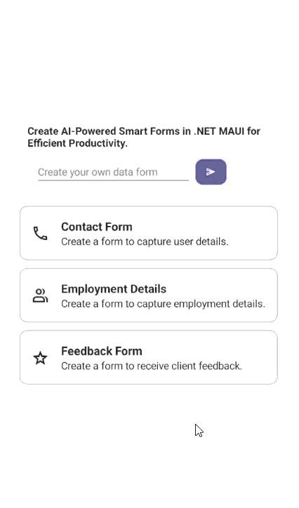

# AI-powered Smart .NET MAUI Dataform for Data Entry

This guide explains how to implement AI-powered smart data forms in a .NET MAUI application using Syncfusion® DataForm ([SfDataForm](https://help.syncfusion.com/cr/maui/Syncfusion.Maui.DataForm.SfDataForm.html)) and AIAssistView ([SfAIAssistView](https://help.syncfusion.com/cr/maui/Syncfusion.Maui.AIAssistView.SfAIAssistView.html)) controls. These forms automatically generate fields, validate input, and guide users interactively using AI logic from Azure OpenAI Services.

## Integrating Azure OpenAI with the .NET MAUI app

### Step 1: Set Up the .NET MAUI Project

Create a [.NET MAUI app](https://learn.microsoft.com/en-us/dotnet/maui/get-started/first-app?view=net-maui-9.0&viewFallbackFrom=net-maui-7.0&tabs=vswin&pivots=devices-android) in [Visual Studio](https://visualstudio.microsoft.com/) and install the following NuGet packages: `Syncfusion.Maui.DataForm`,  `Syncfusion.Maui.AIAssistView`, [`Azure.AI.OpenAI`](https://www.nuget.org/packages/Azure.AI.OpenAI/1.0.0-beta.12), [`Microsoft.Extensions.AI.OpenAI`](https://www.nuget.org/packages/Microsoft.Extensions.AI.OpenAI/9.8.0-preview.1.25412.6) and [`Azure.Identity`](https://www.nuget.org/packages/Azure.Identity) from [NuGet Gallery](https://www.nuget.org/)

### Step 2: Set up Azure OpenAI

To enable AI functionality in your .NET MAUI Scheduler, first ensure that you have access to [Azure OpenAI](https://azure.microsoft.com/en-in/products/ai-services/openai-service). In the Azure portal, create an Azure OpenAI resource and deploy a model such as GPT-35. Assign a deployment name (for example, GPT35Turbo) that you’ll reference in your application code. Finally, copy the API key and endpoint URL from the resource settings, as these are required for authentication and communication with the OpenAI service.

### Step 3: Connect to the Azure OpenAI

To connect your .NET MAUI app to Azure OpenAI, create a service class that handles communication with the AI model. 

```
/// <summary>
/// Represents Class to interact with Azure AI.
/// </summary>
internal class DataFormAIService : AzureBaseService
{
    /// <summary>
    /// Retrieves an answer from the deployment name model using the provided user prompt.
    /// </summary>
    /// <param name="userPrompt">The user prompt.</param>
    /// <returns>The AI response.</returns>
    internal async Task<string> GetAnswerFromGPT(string userPrompt)
    {
        ChatHistory = string.Empty;
        if (IsCredentialValid && Client != null && ChatHistory != null)
        {
            // Add the user's prompt as a user message to the conversation.
            ChatHistory = ChatHistory + "You are a predictive analytics assistant.";
            // Add the user's prompt as a user message to the conversation.
            ChatHistory = ChatHistory + userPrompt;
            try
            {
                //// Send the chat completion request to the OpenAI API and await the response.
                var response = await Client.CompleteAsync(ChatHistory);
                return response.ToString();
            }
            catch
            {
                // If an exception occurs (e.g., network issues, API errors), return an empty string.
                return "";
            }
        }

        return "";
    }
}
```
In this service, define a method called `GetAnswerFromGPT`. This method takes a user prompt from the SfAIAssistView control as input, sends it to the deployed model (e.g., GPT35Turbo), and returns the AI-generated response.

```
    /// <summary>
    /// Represents Class to interact with Azure AI.
    /// </summary>
    public class AzureAIServices : AzureBaseService
    {
        /// <summary>
        /// Initializes a new instance of the <see cref="AzureAIServices"/> class.
        /// </summary>
        public AzureAIServices()
        {
            
        }

        /// <summary>
        /// Retrieves an answer from the deployment name model using the provided user prompt.
        /// </summary>
        /// <param name="userPrompt">The user prompt.</param>
        /// <returns>The AI response.</returns>
        internal async Task<string> GetAnswerFromGPT(string userPrompt)
        {
            ChatHistory = string.Empty;
            if (IsCredentialValid && Client != null && ChatHistory != null)
            {
                // Add the user's prompt as a user message to the conversation.
                ChatHistory = ChatHistory + "You are a predictive analytics assistant.";
                // Add the user's prompt as a user message to the conversation.
                ChatHistory = ChatHistory + userPrompt;
                try
                {
                    //// Send the chat completion request to the OpenAI API and await the response.
                    var response = await Client.CompleteAsync(ChatHistory);
                    return response.ToString();
                }
                catch
                {
                    // If an exception occurs (e.g., network issues, API errors), return an empty string.
                    return "";
                }
            }

            return "";
        }
    }
}
```

Within the base service class (AzureBaseService), initialize the OpenAIClient with your Azure endpoint, deployment name, and API key.

```
 public abstract class AzureBaseService
 {
     #region Fields
     /// <summary>
     /// The EndPoint
     /// </summary>
     internal const string Endpoint = "YOUR_END_POINT_NAME";

     /// <summary>
     /// The Deployment name
     /// </summary>
     internal const string DeploymentName = "DEPLOYMENT_NAME";

     /// <summary>
     /// The Image Deployment name
     /// </summary>
     internal const string ImageDeploymentName = "IMAGE_DEPOLYMENT_NAME";

     /// <summary>
     /// The API key
     /// </summary>
     internal const string Key = "API_KEY";

     /// <summary>
     /// The already credential validated field
     /// </summary>
     private static bool isAlreadyValidated = false;

     /// <summary>
     /// Indicating whether an credentials are valid or not
     /// </summary>
     private static bool _isCredentialValid;

     #endregion

     public AzureBaseService()
     {
         ValidateCredential();
     }

    internal IChatClient? Client { get; set; }

    /// <summary>
    /// To get the Azure open ai method
    /// </summary>
    private void GetAzureOpenAI()
    {
        try
        {
            var client = new AzureOpenAIClient(new Uri(Endpoint), new AzureKeyCredential(Key)).AsChatClient(modelId: DeploymentName);
            this.Client = client;
        }
        catch (Exception)
        {
        }
    }
 }
 ```

## Integrating AI-powered smart DataForm Generation in .NET MAUI DataForm

### Step 1: Designing the User Interface

####  Editor and Button - Capturing User Prompts

Use an Editor to collect natural language prompts and a Button to send the prompt to Azure OpenAI. The Editor allows users to describe the form they want, while the Button triggers the logic to process the prompt and generate the form.

```
                <VerticalStackLayout Margin="20" VerticalOptions="Center" HorizontalOptions="Center">
                    <Label x:Name="describeLabel" 
                   Text="Create AI-Powered Smart Forms in .NET MAUI for Efficient Productivity."
                   LineBreakMode="WordWrap" FontSize="Small" FontAttributes="Bold" />
                    <Grid ColumnDefinitions="0.7*,0.3*" Margin="10" ColumnSpacing="5">
                        
                            <Editor AutoSize="TextChanges" x:Name="entry" 
                            PlaceholderColor="Gray" 
                            VerticalOptions="Center" 
                            HorizontalOptions="Fill" 
                            Placeholder="Create your own data form" />
                        <Button x:Name="createButton" 
                        Grid.Column="1" CornerRadius="10" 
                        HeightRequest="35" Text="&#xe784;"  
                        FontSize="Small"
                        FontFamily="MauiMaterialAssets" 
                        VerticalOptions="Center" HorizontalOptions="Start" />
                    </Grid>
                </VerticalStackLayout>
```

#### Busy Indicator - Showing Processing Status
 
The SfBusyIndicator provides visual feedback while the AI processes the prompt. It is shown during form generation and hidden once the form is ready.

```
xmlns:core="clr-namespace:Syncfusion.Maui.Core;assembly=Syncfusion.Maui.Core"

        <core:SfBusyIndicator IsVisible="False"
                              x:Name="busyIndicator"
                              IsRunning="False"
                              AnimationType="Cupertino" />
```

####  DataForm - Displaying the Generated Form

The SfDataForm renders the generated form dynamically based on the AI response. 

```
xmlns:dataform="clr-namespace:Syncfusion.Maui.DataForm;assembly=Syncfusion.Maui.DataForm"

                    <dataform:SfDataForm x:Name="dataForm"
                                           Grid.RowSpan="1"
                                           Grid.Row="1" AutoGenerateItems="False"
                                           ValidationMode="PropertyChanged"
                                           LayoutType="TextInputLayout"
                                           HorizontalOptions="Center">
                        <dataform:SfDataForm.TextInputLayoutSettings>
                            <dataform:TextInputLayoutSettings ShowHelperText="True"/>
                        </dataform:SfDataForm.TextInputLayoutSettings>
                    </dataform:SfDataForm>
```

#### AI AssistView - Providing Suggestions
 
The SfAIAssistView offers contextual help, such as real-time suggestions or chatbot-style assistance. 

```
    <aiassistview:SfAIAssistView x:Name="aiAssistView" 
                                 Grid.Row="1"                      HorizontalOptions="Fill"
                                 ShowHeader="False" 
                                 AssistItems="{Binding Messages}">
                        <aiassistview:SfAIAssistView.Behaviors>
                            <local:DataFormAssistViewBehavior x:Name="dataFormAssistViewModel" AIActionButton="{x:Reference aiActionButton}"  RefreshButton="{x:Reference refreshButton}" CloseButton="{x:Reference close}" 
                                                               DataFormNameLabel="{x:Reference dataFormNameLabel}" BusyIndicator="{x:Reference busyIndicator}"  DataForm="{x:Reference dataForm}"  DataFormGeneratorModel="{x:Reference dataFormGeneratorModel}" Entry="{x:Reference entry}" CreateButton="{x:Reference createButton}"/>
                        </aiassistview:SfAIAssistView.Behaviors>
                    </aiassistview:SfAIAssistView>
```

### Step 2: Create and Edit Data Form Items using Azure OpenAI

#### Creating Data Form Items

We first create a button click event that triggers the AI-powered form item generation process.

```
        private async void OnCreateButtonClicked(object? sender, EventArgs e)
        {
            UpdateBusyIndicator(true);

            if (AzureBaseService.IsCredentialValid && Entry?.Text is string text && !string.IsNullOrEmpty(text))
            {
                GetDataFormFromAI(text);
            }
            else if (!string.IsNullOrEmpty(DataFormGeneratorModel?.FormTitle))
            {
                await CreateOfflineDataForm(DataFormGeneratorModel.FormTitle);
                DataFormGeneratorModel.ShowInputView = false;
                DataFormGeneratorModel.ShowDataForm = true;
            }

        }
```

#### Generate Items from User Prompts

The following method sends the user’s prompt to Azure OpenAI and processes the response to generate actions such as New Form, Change Title, Add, Remove, or Replace.

```
internal async void GetDataFormFromAI(string userPrompt)
{
    string prompt = $"Given the user's input: {userPrompt}, determine the most appropriate single action to take. " +
        $"The options are 'Add', 'Add Values','PlaceholderText' ,'Remove', 'Replace', 'Insert', 'New Form', 'Change Title', or 'No Change'" +
        " Without additional formatting and special characters like backticks, newlines, or extra spaces.";

    var response = await this.semanticKernelService.GetAnswerFromGPT(prompt);

    if (string.IsNullOrEmpty(response))
    {
        AssistItem subjectMessage = new AssistItem() { Text = "Please try again...", ShowAssistItemFooter = false };
        this.DataFormGeneratorModel?.Messages.Add(subjectMessage);
        UpdateCreateVisibility();
        UpdateBusyIndicator(false);
    }
    else
    {
        if (response == string.Empty)
        {
            UpdateBusyIndicator(false);
            if (Application.Current != null)
            {
                var mainWindow = Application.Current.Windows.FirstOrDefault();
                if (mainWindow != null && mainWindow.Page != null)
                {
                    await mainWindow.Page.DisplayAlert("", "Please enter valid inputs.", "OK");
                }
            }
        }
        else if (response == "New Form")
        {
            if (this.DataFormGeneratorModel != null)
                this.DataFormGeneratorModel.ShowOfflineLabel = false;
            this.GenerateAIDataForm(userPrompt);
        }
        else if (response == "Change Title")
        {
            string dataFormNamePrompt = $"Change the title for data form based on user prompt: {userPrompt}. Provide only the title, with no additional explanation";
            string getDataFormName = await this.semanticKernelService.GetAnswerFromGPT(dataFormNamePrompt);
            this.DataFormNameLabel!.Text = getDataFormName;
            AssistItem subjectMessage = new AssistItem() { Text = "The Data Form title changed successfully...", ShowAssistItemFooter = false };
            this.DataFormGeneratorModel?.Messages.Add(subjectMessage);
        }
        else
        {
            this.EditDataForm(userPrompt, response);
        }
    }
}
```

```
private async void GenerateAIDataForm(string userPrompt)
{
    string dataFormNamePrompt = $"Generate a title for a data form based on the following string: {userPrompt}. The title should clearly reflect the purpose of the data form in general term. Provide only the title, with no additional explanation";
    string getDataFormName = await this.semanticKernelService.GetAnswerFromGPT(dataFormNamePrompt);
    this.DataFormNameLabel!.Text = getDataFormName;

    string prompt = $"Generate a data form based on the user prompt: {userPrompt}.";
    string condition = "Property names must be in PascalCase. " +
        "Must be property names and its value " +
        "Without additional formatting characters like backticks, newlines, or extra spaces. " +
        "and map each property to the most appropriate DataForm available item type includes: DataFormTextItem , DataFormMultiLineTextItem, DataFormPasswordItem, DataFormNumericItem, DataFormMaskedTextItem, DataFormDateItem, DataFormTimeItem, DataFormCheckBoxItem, DataFormSwitchItem, DataFormPickerItem, DataFormComboBoxItem, DataFormAutoCompleteItem, DataFormRadioGroupItem, DataFormSegmentItem" +
        "The result must be in JSON format" +
        "Without additional formatting characters like backticks, newlines, or extra spaces.";

    var typeResponse = await this.semanticKernelService.GetAnswerFromGPT(prompt + condition);

    var dataFormTypes = JsonConvert.DeserializeObject<Dictionary<string, object>>(typeResponse);

    if (this.DataForm != null && dataFormTypes != null)
    {
        var items = new ObservableCollection<DataFormViewItem>();
        foreach (var data in dataFormTypes)
        {
            DataFormItem? dataFormItem = GenerateDataFormItems(data.Value.ToString(), data.Key);
            if (dataFormItem != null)
                items.Add(dataFormItem);
        }

        this.DataForm.Items = items;
    }

    AssistItem subjectMessage = new AssistItem() { Text = "As per your comment data form created successfully...", ShowAssistItemFooter = false };
    this.DataFormGeneratorModel?.Messages.Add(subjectMessage);

    UpdateCreateVisibility();
    UpdateBusyIndicator(false);
}
```

#### Generating a New Data Form

When the user request is identified as "New Form", a complete form can be created dynamically.

#### Editing Data Form Items

Azure OpenAI also allows editing an existing form. The following operations are supported:
 
(a) Add a New Item
 
* Generates a new property and maps it to the best fitting DataForm item type.
 
(b) Remove an Item
 
* Finds and removes an existing property from the DataForm.
 
(c) Replace an Item
 
* Replaces one form field with another.
 
(d) Add Values to a Field
 
* Populates additional values into picker or combo-box items.

#### Handling Requests via AIAssistView
 
Finally, the `Request` event in AIAssistView listens to user inputs and invokes the data form generation or edit methods.

With these implementations, the DataForm becomes AI-powered, enabling users to create and modify form structures dynamically via Azure OpenAI.

```
        private async void OnAssistViewRequest(object? sender, RequestEventArgs e)
        {
            string requestText = e.RequestItem.Text;
            if (AzureBaseService.IsCredentialValid && this.DataFormGeneratorModel != null)
            {
                this.DataFormGeneratorModel.ShowOfflineLabel = false;
                this.GetDataFormFromAI(requestText);
                return;
            }

            await CreateOfflineDataForm(requestText);
        }

```



You can download the complete sample from this [link](https://www.syncfusion.com/blogs/post/ai-powered-smart-net-maui-data-forms/amp).


