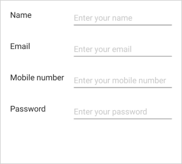
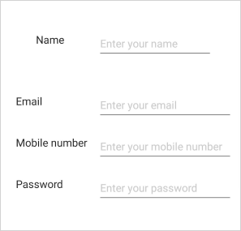
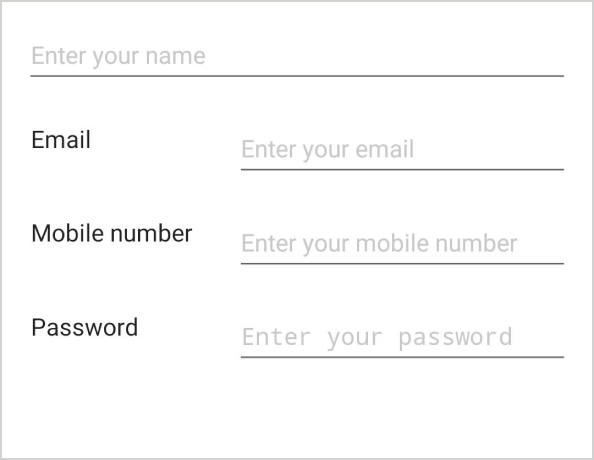
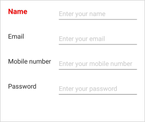
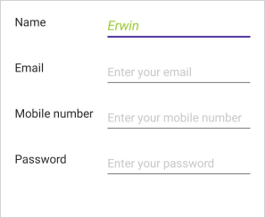

# Change the data editor settings (SfDataForm)

## Auto generate data editor 

By default, the [SfDataForm.Items](https://help.syncfusion.com/cr/maui/Syncfusion.Maui.DataForm.SfDataForm.html#Syncfusion_Maui_DataForm_SfDataForm_Items) will be generated based on the property type. For example, the [DataFormTextItem](https://help.syncfusion.com/cr/maui/Syncfusion.Maui.DataForm.DataFormTextItem.html) will be generated based on the property type in [DataObject](https://help.syncfusion.com/cr/maui/Syncfusion.Maui.DataForm.SfDataForm.html#Syncfusion_Maui_DataForm_SfDataForm_DataObject).
The [DataFormItem](https://help.syncfusion.com/cr/maui/Syncfusion.Maui.DataForm.DataFormItem.html) generation depends on the type and attribute defined for the property.

You can customize the auto-generated editor, label, and group settings by using the [GenerateDataFormItem](https://help.syncfusion.com/cr/maui/Syncfusion.Maui.DataForm.SfDataForm.html#Syncfusion_Maui_DataForm_SfDataForm_GenerateDataFormItem) event.

<table>
<tr>
<th>Generated DataFormItem Type</th>
<th>Editor</th>
<th>Data Type / Attribute</th>
</tr>
<tr>
<td>
{{'[DataFormTextItem](https://help.syncfusion.com/cr/maui/Syncfusion.Maui.DataForm.DataFormTextItem.html)'| markdownify }}
</td>
<td>
{{'[Entry](https://learn.microsoft.com/en-us/dotnet/maui/user-interface/controls/entry?view=net-maui-7.0)'| markdownify }}
</td>
<td>
Generated for the string type and the properties with [DataType(DataType.Text)] attribute.
</td>
</tr>
<tr>
<td>
{{'[DataFormMultilineTextItem](https://help.syncfusion.com/cr/maui/Syncfusion.Maui.DataForm.DataFormMultilineItem.html)'| markdownify }}
</td>
<td>
{{'[Editor](https://learn.microsoft.com/en-us/dotnet/maui/user-interface/controls/editor?view=net-maui-7.0)'| markdownify }}
</td>
<td>
Generated for the string type properties with [DataType(DataType.MultilineText)] attribute. 
</td>
</tr>
<tr>
<td>
{{'[DataFormPasswordItem](https://help.syncfusion.com/cr/maui/Syncfusion.Maui.DataForm.DataFormPasswordItem.html)'| markdownify }}
</td>
<td>
{{'[Entry](https://learn.microsoft.com/en-us/dotnet/maui/user-interface/controls/entry?view=net-maui-7.0)'| markdownify }}
</td>
<td>
Generated for the string type properties with [DataType(DataType.Password)] attribute. 
</td>
</tr>
<tr>
<td>
{{'[DataFormNumericItem](https://help.syncfusion.com/cr/maui/Syncfusion.Maui.DataForm.DataFormNumericItem.html)'| markdownify }}
</td>
<td>
{{'[SfNumericEntry](https://help.syncfusion.com/maui/numeric-entry/overview)'| markdownify }}
</td>
<td>
Generated for int, double, float type property. 
</td>
</tr>
<tr>
<td>
{{'[DataFormMaskedTextItem](https://help.syncfusion.com/cr/maui/Syncfusion.Maui.DataForm.DataFormMaskedTextItem.html)'| markdownify }}
</td>
<td>
{{'[SfMaskedEntry](https://help.syncfusion.com/maui/masked-entry/overview)'| markdownify }}
</td>
<td>
Generated for the string type properties with [DataType(DataType.PhoneNumber)] and [DataType(DataType.CreditCard)] attribute.
</td>
</tr>
<tr>
<td>
{{'[DataFormDateItem](https://help.syncfusion.com/cr/maui/Syncfusion.Maui.DataForm.DataFormDateItem.html)'| markdownify }}
</td>
<td>
{{'[DatePicker](https://learn.microsoft.com/en-us/dotnet/maui/user-interface/controls/datepicker?view=net-maui-7.0)'| markdownify }}
</td>
<td>
Generated for the DateTime, DateTimeOffset, and DateOnly type properties and the properties with [DataType(DataType.Date)] or [DataType(DataType.DateTime)] attributes.
</td>
</tr>
<tr>
<td>
{{'[DataFormTimeItem](https://help.syncfusion.com/cr/maui/Syncfusion.Maui.DataForm.DataFormTimeItem.html)'| markdownify }}
</td>
<td>
{{'[TimePicker](https://learn.microsoft.com/en-us/dotnet/maui/user-interface/controls/timepicker?view=net-maui-7.0&tabs=windows)'| markdownify }}
</td>
<td>
Generated for TimeSpan and TimeOnly type properties and the properties with [DataType(DataType.Time)] attribute. 
</td>
</tr>
<tr>
<td>
{{'[DataFormCheckBoxItem](https://help.syncfusion.com/cr/maui/Syncfusion.Maui.DataForm.DataFormCheckBoxItem.html)'| markdownify }}
</td>
<td>
{{'[CheckBox](https://learn.microsoft.com/en-us/dotnet/maui/user-interface/controls/checkbox?view=net-maui-7.0)'| markdownify }}
</td>
<td>
Generated for the Bool type property.
</td>
</tr>
<tr>
<td>
{{'[DataFormSwitchItem](https://help.syncfusion.com/cr/maui/Syncfusion.Maui.DataForm.DataFormSwitchItem.html)'| markdownify }}
</td>
<td>
{{'[Switch](https://learn.microsoft.com/en-us/dotnet/maui/user-interface/controls/switch?view=net-maui-7.0)'| markdownify }}
</td>
<td>
Generated for the Bool type property.
</td>
</tr>
<tr>
<td>
{{'[DataFormComboBoxItem](https://help.syncfusion.com/cr/maui/Syncfusion.Maui.DataForm.DataFormComboBoxItem.html)'| markdownify }}
</td>
<td>
{{'[SfComboBox](https://help.syncfusion.com/maui/combobox/overview)'| markdownify }}
</td>
<td>
Generated for the enum type property. 
</td>
</tr><tr>
<td>
{{'[DataFormAutoCompleteItem](https://help.syncfusion.com/cr/maui/Syncfusion.Maui.DataForm.DataFormAutoCompleteItem.html)'| markdownify }}
</td>
<td>
{{'[SfAutoComplete](https://help.syncfusion.com/maui/autocomplete/overview)'| markdownify }}
</td>
<td>
Generated for the enum type property. 
</td>
</tr>
<tr>
<td>
{{'[DataFormPickerItem](https://help.syncfusion.com/cr/maui/Syncfusion.Maui.DataForm.DataFormPickerItem.html)'| markdownify }}
</td>
<td>
{{'[Picker](https://learn.microsoft.com/en-us/dotnet/maui/user-interface/controls/picker?view=net-maui-7.0)'| markdownify }}
</td>
<td>
Generated for the enum type property. 
</td>
</tr>
<tr>
<td>
{{'[DataFormRadioGroupItem](https://help.syncfusion.com/cr/maui/Syncfusion.Maui.DataForm.DataFormRadioGroupItem.html)'| markdownify }}
</td>
<td>
{{'[RadioButton](https://learn.microsoft.com/en-us/dotnet/maui/user-interface/controls/radiobutton?view=net-maui-7.0)'| markdownify }}
</td>
<td>
Generated for the enum type property.
</td>
</tr>
</table>

You can customize the property settings or cancel the generation of [DataFormItem](https://help.syncfusion.com/cr/maui/Syncfusion.Maui.DataForm.DataFormItem.html) by handling the [GenerateDataFormItem](https://help.syncfusion.com/cr/maui/Syncfusion.Maui.DataForm.SfDataForm.html#Syncfusion_Maui_DataForm_SfDataForm_GenerateDataFormItem) event.

## Cancel the auto generate data editors

You can cancel the specific data editor by handling the [GenerateDataFormItem](https://help.syncfusion.com/cr/maui/Syncfusion.Maui.DataForm.SfDataForm.html#Syncfusion_Maui_DataForm_SfDataForm_GenerateDataFormItem) event when [AutoGenerateItems](https://help.syncfusion.com/cr/maui/Syncfusion.Maui.DataForm.SfDataForm.html#Syncfusion_Maui_DataForm_SfDataForm_AutoGenerateItems) is set to true or by defining display attribute to avoid the particular data field being displayed.

#### Using attributes

You can set [AutoGenerateField](https://learn.microsoft.com/en-us/dotnet/api/system.componentmodel.dataannotations.displayattribute.autogeneratefield?view=net-7.0) to `false` for canceling the data editor generation.




[Display(AutoGenerateField = false)]
public int ID { get; set; } 
    



#### Using event

In the following code, the data editor generation for the `MiddleName` property is canceled by setting the `Cancel` property to true of the [DataFormItem](https://help.syncfusion.com/cr/maui/Syncfusion.Maui.DataForm.DataFormItem.html).




this.dataForm.GenerateDataFormItem += OnGenerateDataFormItem;

private void OnGenerateDataFormItem(object sender, GenerateDataFormItemEventArgs e)
{
    if (e.DataFormItem.FieldName == "MiddleName")
    {
        e.Cancel = true;
    }
}




The [GenerateDataFormItem](https://help.syncfusion.com/cr/maui/Syncfusion.Maui.DataForm.SfDataForm.html#Syncfusion_Maui_DataForm_SfDataForm_GenerateDataFormItem) event will be raised only when [AutoGenerateItems](https://help.syncfusion.com/cr/maui/Syncfusion.Maui.DataForm.SfDataForm.html#Syncfusion_Maui_DataForm_SfDataForm_AutoGenerateItems) is set to true.

For [AutoGenerateItems](https://help.syncfusion.com/cr/maui/Syncfusion.Maui.DataForm.SfDataForm.html#Syncfusion_Maui_DataForm_SfDataForm_AutoGenerateItems) false, you can use settings properties directly by using the [DataFormItem](https://help.syncfusion.com/cr/maui/Syncfusion.Maui.DataForm.DataFormItem.html). Please refer [here](https://help.syncfusion.com/maui/dataform/dataform-settings#explicitly-create-data-editors) to learn more about creating data editors explicitly.

## Change the editor settings

#### Change the editor read only

You can change the data editor settings by using the property of [DataFormItem](https://help.syncfusion.com/cr/maui/Syncfusion.Maui.DataForm.DataFormItem.html) in the [GenerateDataFormItem](https://help.syncfusion.com/cr/maui/Syncfusion.Maui.DataForm.SfDataForm.html#Syncfusion_Maui_DataForm_SfDataForm_GenerateDataFormItem) event when [AutoGenerateItems](https://help.syncfusion.com/cr/maui/Syncfusion.Maui.DataForm.SfDataForm.html#Syncfusion_Maui_DataForm_SfDataForm_AutoGenerateItems) is true.

N> If [AutoGenerateItems](https://help.syncfusion.com/cr/maui/Syncfusion.Maui.DataForm.SfDataForm.html#Syncfusion_Maui_DataForm_SfDataForm_AutoGenerateItems) is false, you can set the property directly by using the [DataFormItem](https://help.syncfusion.com/cr/maui/Syncfusion.Maui.DataForm.DataFormItem.html). Please refer [here](https://help.syncfusion.com/maui/dataform/dataform-settings#explicitly-create-data-editors) to learn more about creating data editors explicitly.

Here, `Salary` data field is restricted from being edited in the data form.




this.dataForm.GenerateDataFormItem += OnGenerateDataFormItem;

private void OnGenerateDataFormItem(object sender, GenerateDataFormItemEventArgs e)
{
    if (e.DataFormItem != null)
    {
        if (e.DataFormItem.FieldName == "MiddleName")
        {
             e.DataFormItem.IsReadOnly = true;
        }
    }
}



#### Change the editor visibility

You can change the specific editor visibility by using the [IsVisible](https://help.syncfusion.com/cr/maui/Syncfusion.Maui.DataForm.DataFormViewItem.html#Syncfusion_Maui_DataForm_DataFormViewItem_IsVisible) property of the [DataFormItem](https://help.syncfusion.com/cr/maui/Syncfusion.Maui.DataForm.DataFormItem.html) in the [GenerateDataFormItem](https://help.syncfusion.com/cr/maui/Syncfusion.Maui.DataForm.SfDataForm.html#Syncfusion_Maui_DataForm_SfDataForm_GenerateDataFormItem) event when [AutoGenerateItems](https://help.syncfusion.com/cr/maui/Syncfusion.Maui.DataForm.SfDataForm.html#Syncfusion_Maui_DataForm_SfDataForm_AutoGenerateItems) is true.

N> If [AutoGenerateItems](https://help.syncfusion.com/cr/maui/Syncfusion.Maui.DataForm.SfDataForm.html#Syncfusion_Maui_DataForm_SfDataForm_AutoGenerateItems) is false, you can set the property directly by using the [DataFormItem](https://help.syncfusion.com/cr/maui/Syncfusion.Maui.DataForm.DataFormItem.html). Please refer [here](https://help.syncfusion.com/maui/dataform/dataform-settings#explicitly-create-data-editors) to learn more about creating data editors explicitly.

Here, the `LastName` data field will be hidden.




this.dataForm.GenerateDataFormItem += OnGenerateDataFormItem;

private void OnGenerateDataFormItem(object sender, GenerateDataFormItemEventArgs e)
{
    if (e.DataFormItem != null)
    {
        if (e.DataFormItem.FieldName == "LastName")
        {
            e.DataFormItem.IsVisible = false;
        }
    }
}




#### Setting watermark for data editor

You can display the watermark in the editor by defining the display attribute or using the [GenerateDataFormItem](https://help.syncfusion.com/cr/maui/Syncfusion.Maui.DataForm.SfDataForm.html#Syncfusion_Maui_DataForm_SfDataForm_GenerateDataFormItem) event when [AutoGenerateItems](https://help.syncfusion.com/cr/maui/Syncfusion.Maui.DataForm.SfDataForm.html#Syncfusion_Maui_DataForm_SfDataForm_AutoGenerateItems) is true.

#### Using attribute

You can show the watermark in the editor by setting the [Prompt](https://learn.microsoft.com/en-us/dotnet/api/system.componentmodel.dataannotations.displayattribute.prompt?view=net-7.0) in display attribute.




[Display(Prompt = "Enter middle name")]
public string MiddleName { get; set; }
    



#### Using event

You can show the watermark in the editor by using the [PlaceholderText](https://help.syncfusion.com/cr/maui/Syncfusion.Maui.DataForm.DataFormItem.html#Syncfusion_Maui_DataForm_DataFormItem_PlaceholderText) property of [DataFormItem](https://help.syncfusion.com/cr/maui/Syncfusion.Maui.DataForm.DataFormItem.html) in the [GenerateDataFormItem](https://help.syncfusion.com/cr/maui/Syncfusion.Maui.DataForm.SfDataForm.html#Syncfusion_Maui_DataForm_SfDataForm_GenerateDataFormItem) event when [AutoGenerateItems](https://help.syncfusion.com/cr/maui/Syncfusion.Maui.DataForm.SfDataForm.html#Syncfusion_Maui_DataForm_SfDataForm_AutoGenerateItems) is true.

N> If [AutoGenerateItems](https://help.syncfusion.com/cr/maui/Syncfusion.Maui.DataForm.SfDataForm.html#Syncfusion_Maui_DataForm_SfDataForm_AutoGenerateItems) is false, you can set the property directly by using the [DataFormItem](https://help.syncfusion.com/cr/maui/Syncfusion.Maui.DataForm.DataFormItem.html). Please refer [here](https://help.syncfusion.com/maui/dataform/dataform-settings#explicitly-create-data-editors) to learn more about creating data editors explicitly.




this.dataForm.GenerateDataFormItem += OnGenerateDataFormItem;

private void OnGenerateDataFormItem(object sender, GenerateDataFormItemEventArgs e)
{
    if (e.DataFormItem != null)
    {
        if (e.DataFormItem.FieldName == "Description")
        {
            e.DataFormItem.PlaceholderText = "Enter description";
        }
    }
}



#### Changing watermark color for data editor

You can change the color for the watermark in the editor by using the [PlaceholderColor](https://help.syncfusion.com/cr/maui/Syncfusion.Maui.DataForm.DataFormItem.html#Syncfusion_Maui_DataForm_DataFormItem_PlaceholderColor) property of the [DataFormItem](https://help.syncfusion.com/cr/maui/Syncfusion.Maui.DataForm.DataFormItem.html) in the [GenerateDataFormItem](https://help.syncfusion.com/cr/maui/Syncfusion.Maui.DataForm.SfDataForm.html#Syncfusion_Maui_DataForm_SfDataForm_GenerateDataFormItem) event when [AutoGenerateItems](https://help.syncfusion.com/cr/maui/Syncfusion.Maui.DataForm.SfDataForm.html#Syncfusion_Maui_DataForm_SfDataForm_AutoGenerateItems) is true.

N> If [AutoGenerateItems](https://help.syncfusion.com/cr/maui/Syncfusion.Maui.DataForm.SfDataForm.html#Syncfusion_Maui_DataForm_SfDataForm_AutoGenerateItems) is false, you can set the property directly by using the [DataFormItem](https://help.syncfusion.com/cr/maui/Syncfusion.Maui.DataForm.DataFormItem.html). Please refer [here](https://help.syncfusion.com/maui/dataform/dataform-settings#explicitly-create-data-editors) to learn more about creating data editors explicitly.




this.dataForm.GenerateDataFormItem += OnGenerateDataFormItem;

private void OnGenerateDataFormItem(object sender, GenerateDataFormItemEventArgs e)
{
    if (e.DataFormItem != null)
    {
        if (e.DataFormItem.FieldName == "Description")
        {
            e.DataFormItem.PlaceholderText = "Enter description";
            e.DataFormItem.PlaceholderColor = Colors.MistyRose;
        }
    }
}



#### Change padding for the data editor

You can create a space around a label and editor by using the [Padding](https://help.syncfusion.com/cr/maui/Syncfusion.Maui.DataForm.DataFormViewItem.html#Syncfusion_Maui_DataForm_DataFormViewItem_Padding) property in the DataFormItem by using the [GenerateDataFormItem](https://help.syncfusion.com/cr/maui/Syncfusion.Maui.DataForm.SfDataForm.html#Syncfusion_Maui_DataForm_SfDataForm_GenerateDataFormItem) event when [AutoGenerateItems](https://help.syncfusion.com/cr/maui/Syncfusion.Maui.DataForm.SfDataForm.html#Syncfusion_Maui_DataForm_SfDataForm_AutoGenerateItems) is true.

N> If [AutoGenerateItems](https://help.syncfusion.com/cr/maui/Syncfusion.Maui.DataForm.SfDataForm.html#Syncfusion_Maui_DataForm_SfDataForm_AutoGenerateItems) is false, you can set the property directly by using the [DataFormItem](https://help.syncfusion.com/cr/maui/Syncfusion.Maui.DataForm.DataFormItem.html). Please refer [here](https://help.syncfusion.com/maui/dataform/dataform-settings#explicitly-create-data-editors) to learn more about creating data editors explicitly.

Here, the `FirstName` data field will be changed from the default position.




this.dataForm.GenerateDataFormItem += OnGenerateDataFormItem;

private void OnGenerateDataFormItem(object sender, GenerateDataFormItemEventArgs e)
{
    if (e.DataFormItem != null)
    {
        if (e.DataFormItem.FieldName == "LastName")
        {
            e.DataFormItem.Padding = new Thickness(10);
        }
    }
}



#### Change editor layout settings

You can change the label width, label position, and editor width. This is possible by using the [GenerateDataFormItem](https://help.syncfusion.com/cr/maui/Syncfusion.Maui.DataForm.SfDataForm.html#Syncfusion_Maui_DataForm_SfDataForm_GenerateDataFormItem) event when [AutoGenerateItems](https://help.syncfusion.com/cr/maui/Syncfusion.Maui.DataForm.SfDataForm.html#Syncfusion_Maui_DataForm_SfDataForm_AutoGenerateItems) is true. In the event, change the layout settings by using the [DefaultLayoutSettings](https://help.syncfusion.com/cr/maui/Syncfusion.Maui.DataForm.SfDataForm.html#Syncfusion_Maui_DataForm_SfDataForm_DefaultLayoutSettings) property in the [DataFormItem](https://help.syncfusion.com/cr/maui/Syncfusion.Maui.DataForm.DataFormItem.html).

N> If [AutoGenerateItems](https://help.syncfusion.com/cr/maui/Syncfusion.Maui.DataForm.SfDataForm.html#Syncfusion_Maui_DataForm_SfDataForm_AutoGenerateItems) is false, you can set the property directly by using the [DataFormItem](https://help.syncfusion.com/cr/maui/Syncfusion.Maui.DataForm.DataFormItem.html). Please refer [here](https://help.syncfusion.com/maui/dataform/dataform-settings#explicitly-create-data-editors) to learn more about creating data editors explicitly.

By default label position is left.




this.dataForm.GenerateDataFormItem += OnGenerateDataFormItem;

private void OnGenerateDataFormItem(object sender, GenerateDataFormItemEventArgs e)
{
    if (e.DataFormItem != null)
    {
        if (e.DataFormItem.FieldName == "Description")
        {
            e.DataFormItem.DefaultLayoutSettings.LabelPosition = DataFormLabelPosition.Top;
            e.DataFormItem.DefaultLayoutSettings.LabelWidth = 100;
            e.DataFormItem.DefaultLayoutSettings.EditorWidth = 200;
        }
    }
}



Please refer [here](https://help.syncfusion.com/maui/dataform/layout#change-the-label-and-editor-width) to learn more about editor layout settings. 

#### Change the Background for editor layout

You can change the background color for the label and editor by using [GenerateDataFormItem](https://help.syncfusion.com/cr/maui/Syncfusion.Maui.DataForm.SfDataForm.html#Syncfusion_Maui_DataForm_SfDataForm_GenerateDataFormItem) event when [AutoGenerateItems](https://help.syncfusion.com/cr/maui/Syncfusion.Maui.DataForm.SfDataForm.html#Syncfusion_Maui_DataForm_SfDataForm_AutoGenerateItems) is true.

N> If [AutoGenerateItems](https://help.syncfusion.com/cr/maui/Syncfusion.Maui.DataForm.SfDataForm.html#Syncfusion_Maui_DataForm_SfDataForm_AutoGenerateItems) is false, you can set the property directly by using the [DataFormItem](https://help.syncfusion.com/cr/maui/Syncfusion.Maui.DataForm.DataFormItem.html). Please refer [here](https://help.syncfusion.com/maui/dataform/dataform-settings#explicitly-create-data-editors) to learn more about creating data editors explicitly.




this.dataForm.GenerateDataFormItem += OnGenerateDataFormItem;

private void OnGenerateDataFormItem(object sender, GenerateDataFormItemEventArgs e)
{
    if (e.DataFormItem != null)
    {
        if (e.DataFormItem.FieldName == "FirstName")
        {
            e.DataFormItem.Background = Brush.Azure; 
        }
    }
}




## Change the label name for data editor

By default, the property name will be displayed as label text. You can change the label text by using the display attribute or using the [GenerateDataFormItem](https://help.syncfusion.com/cr/maui/Syncfusion.Maui.DataForm.SfDataForm.html#Syncfusion_Maui_DataForm_SfDataForm_GenerateDataFormItem) event when [AutoGenerateItems](https://help.syncfusion.com/cr/maui/Syncfusion.Maui.DataForm.SfDataForm.html#Syncfusion_Maui_DataForm_SfDataForm_AutoGenerateItems) is true.

#### Using attribute

You can change the label text by setting the [Name](https://learn.microsoft.com/en-us/dotnet/api/system.componentmodel.dataannotations.displayattribute.name?view=net-7.0) or [ShortName](https://learn.microsoft.com/en-us/dotnet/api/system.componentmodel.dataannotations.displayattribute.shortname?view=net-7.0) in display attribute.




[Display(Name = "FirstName")]
public string Name { get; set; }
    



#### Using event

You can change the label text by using the [LabelText](https://help.syncfusion.com/cr/maui/Syncfusion.Maui.DataForm.DataFormItem.html#Syncfusion_Maui_DataForm_DataFormItem_LabelText) property of [DataFormItem](https://help.syncfusion.com/cr/maui/Syncfusion.Maui.DataForm.DataFormItem.html) in the [GenerateDataFormItem](https://help.syncfusion.com/cr/maui/Syncfusion.Maui.DataForm.SfDataForm.html#Syncfusion_Maui_DataForm_SfDataForm_GenerateDataFormItem) event when [AutoGenerateItems](https://help.syncfusion.com/cr/maui/Syncfusion.Maui.DataForm.SfDataForm.html#Syncfusion_Maui_DataForm_SfDataForm_AutoGenerateItems) is true.

N> If [AutoGenerateItems](https://help.syncfusion.com/cr/maui/Syncfusion.Maui.DataForm.SfDataForm.html#Syncfusion_Maui_DataForm_SfDataForm_AutoGenerateItems) is false, you can set the property directly by using the [DataFormItem](https://help.syncfusion.com/cr/maui/Syncfusion.Maui.DataForm.DataFormItem.html). Please refer [here](https://help.syncfusion.com/maui/dataform/dataform-settings#explicitly-create-data-editors) to learn more about creating data editors explicitly.




this.dataForm.GenerateDataFormItem += OnGenerateDataFormItem;

private void OnGenerateDataFormItem(object sender, GenerateDataFormItemEventArgs e)
{
    if (e.DataFormItem != null)
    {
        if (e.DataFormItem.FieldName == "Name")
        {
            e.DataFormItem.LabelText = "FirstName";
        }
    }
}



## Hide Label for an editor

By default, the label will be generated from the property name. You can hide the label text by using the DataFormDisplayAttribute or using the [GenerateDataFormItem](https://help.syncfusion.com/cr/maui/Syncfusion.Maui.DataForm.SfDataForm.html#Syncfusion_Maui_DataForm_SfDataForm_GenerateDataFormItem) event when [AutoGenerateItems](https://help.syncfusion.com/cr/maui/Syncfusion.Maui.DataForm.SfDataForm.html#Syncfusion_Maui_DataForm_SfDataForm_AutoGenerateItems) is true. 

#### Using attribute

You can hide the label text for editor by setting [ShowLabel](https://help.syncfusion.com/cr/maui/Syncfusion.Maui.DataForm.DataFormDisplayOptionsAttribute.html#Syncfusion_Maui_DataForm_DataFormDisplayOptionsAttribute_ShowLabel) as false in [DataformDisplayOptions](https://help.syncfusion.com/cr/maui/Syncfusion.Maui.DataForm.DataFormDisplayOptionsAttribute.html) attribute.




[DataFormDisplayOptions(ShowLabel = false)]
public string MiddleName { get; set; }




#### Using events

You can hide the label text for an editor by using the [ShowLabel](https://help.syncfusion.com/cr/maui/Syncfusion.Maui.DataForm.DataFormItem.html#Syncfusion_Maui_DataForm_DataFormItem_ShowLabel) property of [DataFormItem](https://help.syncfusion.com/cr/maui/Syncfusion.Maui.DataForm.DataFormItem.html) in the [GenerateDataFormItem](https://help.syncfusion.com/cr/maui/Syncfusion.Maui.DataForm.SfDataForm.html#Syncfusion_Maui_DataForm_SfDataForm_GenerateDataFormItem) event when [AutoGenerateItems](https://help.syncfusion.com/cr/maui/Syncfusion.Maui.DataForm.SfDataForm.html#Syncfusion_Maui_DataForm_SfDataForm_AutoGenerateItems) is true.

N> If [AutoGenerateItems](https://help.syncfusion.com/cr/maui/Syncfusion.Maui.DataForm.SfDataForm.html#Syncfusion_Maui_DataForm_SfDataForm_AutoGenerateItems) is false, you can set the property directly by using the [DataFormItem](https://help.syncfusion.com/cr/maui/Syncfusion.Maui.DataForm.DataFormItem.html). Please refer [here](https://help.syncfusion.com/maui/dataform/dataform-settings#explicitly-create-data-editors) to learn more about creating data editors explicitly.




this.dataForm.GenerateDataFormItem += OnGenerateDataFormItem;

private void OnGenerateDataFormItem(object sender, GenerateDataFormItemEventArgs e)
{
    if (e.DataFormItem != null)
    {
        if (e.DataFormItem.FieldName == "FirstName")
        {
            e.DataFormItem.ShowLabel = false;
        }
    }
}



## Change the order for editor

You can change the row order of an editor by setting the [RowOrder](https://help.syncfusion.com/cr/maui/Syncfusion.Maui.DataForm.DataFormViewItem.html#Syncfusion_Maui_DataForm_DataFormViewItem_RowOrder) property of [DataFormViewItem](https://help.syncfusion.com/cr/maui/Syncfusion.Maui.DataForm.DataFormViewItem.html) by using [GenerateDataFormItem](https://help.syncfusion.com/cr/maui/Syncfusion.Maui.DataForm.SfDataForm.html#Syncfusion_Maui_DataForm_SfDataForm_GenerateDataFormItem) event when [AutoGenerateItems](https://help.syncfusion.com/cr/maui/Syncfusion.Maui.DataForm.SfDataForm.html#Syncfusion_Maui_DataForm_SfDataForm_AutoGenerateItems) is true.

You can change the order of item's within a row using [ItemsOrderInRow](https://help.syncfusion.com/cr/maui/Syncfusion.Maui.DataForm.DataFormDisplayOptionsAttribute.html#Syncfusion_Maui_DataForm_DataFormDisplayOptionsAttribute_ItemsOrderInRow) property, which is applicable only when [ColumnCount](https://help.syncfusion.com/cr/maui/Syncfusion.Maui.DataForm.SfDataForm.html#Syncfusion_Maui_DataForm_SfDataForm_ColumnCountProperty) is set to more than one. You can place an item within a row from 0 to [ColumnCount](https://help.syncfusion.com/cr/maui/Syncfusion.Maui.DataForm.SfDataForm.html#Syncfusion_Maui_DataForm_SfDataForm_ColumnCountProperty) - 1 position.

Refer [here](https://help.syncfusion.com/maui/dataform/layout#changing-order-of-the-editors) to know more about changing order of the editors.

N> If [AutoGenerateItems](https://help.syncfusion.com/cr/maui/Syncfusion.Maui.DataForm.SfDataForm.html#Syncfusion_Maui_DataForm_SfDataForm_AutoGenerateItems) is false, you can set the property directly by using the [DataFormItem](https://help.syncfusion.com/cr/maui/Syncfusion.Maui.DataForm.DataFormItem.html). Please refer [here](https://help.syncfusion.com/maui/dataform/dataform-settings#explicitly-create-data-editors) to learn more about creating data editors explicitly.




this.dataForm.ColumnCount = 3;

this.dataForm.GenerateDataFormItem += OnGenerateDataFormItem;

private void OnGenerateDataFormItem(object sender, GenerateDataFormItemEventArgs e)
{
    if (e.DataFormItem != null)
    {
        if (e.DataFormItem.FieldName == "FirstName")
        {
            e.DataFormItem.RowOrder = 1;
            e.DataFormItem.ItemsOrderInRow = 2;  
        }
    }
}



## Add Label icon for the editor

You can set the label icon instead of label text by using [GenerateDataFormItem](https://help.syncfusion.com/cr/maui/Syncfusion.Maui.DataForm.SfDataForm.html#Syncfusion_Maui_DataForm_SfDataForm_GenerateDataFormItem) event when [AutoGenerateItems](https://help.syncfusion.com/cr/maui/Syncfusion.Maui.DataForm.SfDataForm.html#Syncfusion_Maui_DataForm_SfDataForm_AutoGenerateItems) is true.

N> If [AutoGenerateItems](https://help.syncfusion.com/cr/maui/Syncfusion.Maui.DataForm.SfDataForm.html#Syncfusion_Maui_DataForm_SfDataForm_AutoGenerateItems) is false, you can set the property directly by using the [DataFormItem](https://help.syncfusion.com/cr/maui/Syncfusion.Maui.DataForm.DataFormItem.html). Please refer [here](https://help.syncfusion.com/maui/dataform/dataform-settings#explicitly-create-data-editors) to learn more about creating data editors explicitly.




this.dataForm.GenerateDataFormItem += OnGenerateDataFormItem;

private void OnGenerateDataFormItem(object sender, GenerateDataFormItemEventArgs e)
{
    if (e.DataFormItem != null)
    {
        if (e.DataFormItem.FieldName == "PhoneNumber")
        {
            e.DataFormItem.LeadingView = new Label { Text = "E", FontSize = 18, TextColor = Colors.Gray, FontFamily = "InputLayoutIcons", HeightRequest = 24, VerticalTextAlignment = TextAlignment.End };
        }
    }
}




N> [View sample in GitHub](https://github.com/SyncfusionExamples/maui-dataform/tree/master/LabelIconSample)

## Change the Text style 

You can change the text styles of the label, editor, valid message, and error message by using the [GenerateDataFormItem](https://help.syncfusion.com/cr/maui/Syncfusion.Maui.DataForm.SfDataForm.html#Syncfusion_Maui_DataForm_SfDataForm_GenerateDataFormItem) event when [AutoGenerateItems](https://help.syncfusion.com/cr/maui/Syncfusion.Maui.DataForm.SfDataForm.html#Syncfusion_Maui_DataForm_SfDataForm_AutoGenerateItems) is true.

N> If [AutoGenerateItems](https://help.syncfusion.com/cr/maui/Syncfusion.Maui.DataForm.SfDataForm.html#Syncfusion_Maui_DataForm_SfDataForm_AutoGenerateItems) is false, you can set the property directly by using the [DataFormItem](https://help.syncfusion.com/cr/maui/Syncfusion.Maui.DataForm.DataFormItem.html). Please refer [here](https://help.syncfusion.com/maui/dataform/dataform-settings#explicitly-create-data-editors) to learn more about creating data editors explicitly.

<table>
<tr>
<th>Text</th>
<th>Property</th>
</tr>
<tr>
<td>Label Text</td>
<td>LabelTextStyle</td>
</tr>
<tr>
<td>Editor Text</td>
<td>EditorTextStyle</td>
</tr>
<tr>
<td>Error Message Text</td>
<td>ErrorLabelTextStyle</td>
</tr>
<tr>
<td>Valid Message Text</td>
<td>ValidMessageLabelTextStyle</td>
</tr>
</table>

By using [DataFormTextStyle](https://help.syncfusion.com/cr/maui/Syncfusion.Maui.DataForm.DataFormTextStyle.html) class properties, you can change the text style .

DataFormTextStyle class properties:-
    1.FontSize
    2.FontFamily
    3.FontAttributes
    4.TextColor

#### Change Label Text Style




this.dataForm.GenerateDataFormItem += OnGenerateDataFormItem;

private void OnGenerateDataFormItem(object sender, GenerateDataFormItemEventArgs e)
{
    if (e.DataFormItem.FieldName == "Name" && e.DataFormItem is DataFormTextItem textItem)
    {
        e.DataFormItem.LabelTextStyle = new DataFormTextStyle() 
        {
            FontSize = 19, 
            TextColor = Colors.Pink, 
            FontAttributes = FontAttributes.Italic
        };
    }
}




#### Change Editor Text Style




this.dataForm.GenerateDataFormItem += OnGenerateDataFormItem;

private void OnGenerateDataFormItem(object sender, GenerateDataFormItemEventArgs e)
{
    if (e.DataFormItem.FieldName == "Name" && e.DataFormItem is DataFormTextItem textItem)
    {
        e.DataFormItem.EditorTextStyle = new DataFormTextStyle() 
        {
            FontSize = 19, 
            TextColor = Colors.Blue, 
            FontAttributes = FontAttributes.Italic
        };
    }
}




Please refer [here](https://help.syncfusion.com/maui/dataform/validation#validation-label-appearance-customization) to learn more about changing the [ErrorLabelTextStyle](https://help.syncfusion.com/cr/maui/Syncfusion.Maui.DataForm.DataFormItem.html#Syncfusion_Maui_DataForm_DataFormItem_ErrorLabelTextStyle) and [ValidMessageLabelTextStyle](https://help.syncfusion.com/cr/maui/Syncfusion.Maui.DataForm.DataFormItem.html#Syncfusion_Maui_DataForm_DataFormItem_ValidMessageLabelTextStyle)

## Editor view customization
You can customize the editor view by using the  [InitializeDataEditor](https://help.syncfusion.com/cr/maui/Syncfusion.Maui.DataForm.DataFormItemManager.html#Syncfusion_Maui_DataForm_DataFormItemManager_InitializeDataEditor_Syncfusion_Maui_DataForm_DataFormItem_Microsoft_Maui_Controls_View_) method of [DataFormItemManager](https://help.syncfusion.com/cr/maui/Syncfusion.Maui.DataForm.DataFormItemManager.html).




this.dataForm.ItemManager = new DataFormItemManagerEditorExt();

public class DataFormItemManagerEditorExt : DataFormItemManager
{
    public override void InitializeDataEditor(DataFormItem dataFormItem, View editor)
    {
        if (editor is Entry entry)
        {
            entry.SelectionLength = 5;
            entry.TextTransform = TextTransform.Lowercase;
            entry.VerticalTextAlignment = TextAlignment.Center;
        }
    }
}




N> [View sample in GitHub](https://github.com/SyncfusionExamples/maui-dataform/tree/master/EditorViewCustomizationSample)