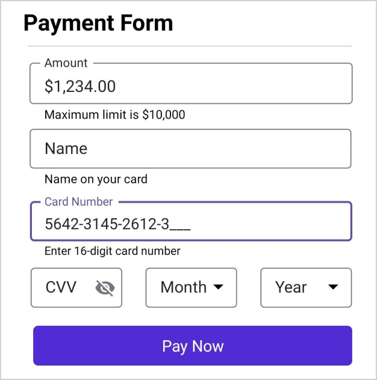
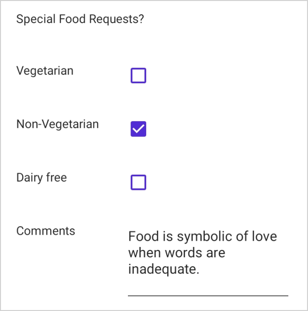
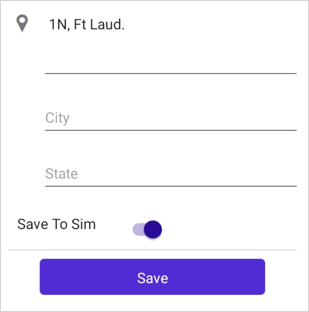

# Data Editors in .NET MAUI DataForm (SfDataForm)

To get start quickly with data editors in .NET MAUI DataForm, you can check on this video:



The data form supports the following built-in editors to edit the data:

<table>
<tr>
<th>Editor name</th>
<th>Generated DataFormItem Type</th>
<th>Supported Data Type / Attribute</th>
<th>Input control loaded</th>
</tr>
<tr>
<td>
Text
</td>
<td>
{{'[DataFormTextItem](https://help.syncfusion.com/cr/maui/Syncfusion.Maui.DataForm.DataFormTextItem.html)'| markdownify }}
</td>
<td>
The string type property and any other type apart from the below specified cases.
</td>
<td>
{{'[Entry](https://learn.microsoft.com/en-us/dotnet/maui/user-interface/controls/entry?view=net-maui-7.0)'| markdownify }}
</td>
</tr>
<tr>
<td>
MultilineText
</td>
<td>
{{'[DataFormMultilineTextItem](https://help.syncfusion.com/cr/maui/Syncfusion.Maui.DataForm.DataFormMultilineItem.html)'| markdownify }}
</td>
<td>
The string type property with [DataType(DataType.MultilineText)] attribute.
</td>
<td>
{{'[Editor](https://learn.microsoft.com/en-us/dotnet/maui/user-interface/controls/editor?view=net-maui-7.0)'| markdownify }}
</td>
</tr>
<tr>
<td>
Password
</td>
<td>
{{'[DataFormPasswordItem](https://help.syncfusion.com/cr/maui/Syncfusion.Maui.DataForm.DataFormPasswordItem.html)'| markdownify }}
</td>
<td>
The string type property with 
[DataType(DataType.Password)] attribute.
</td>
<td>
{{'[Entry](https://learn.microsoft.com/en-us/dotnet/maui/user-interface/controls/entry?view=net-maui-7.0)'| markdownify }}
</td>
</tr>
<tr>
<td>
Numeric
</td>
<td>
{{'[DataFormNumericItem](https://help.syncfusion.com/cr/maui/Syncfusion.Maui.DataForm.DataFormNumericItem.html)'| markdownify }}
</td>
<td>
The int, double, float type property and any other type apart from the below specified cases.
</td>
<td>
{{'[SfNumericEntry](https://help.syncfusion.com/maui/numericentry/overview)'| markdownify }}
</td>
</tr>
<tr>
<td>
MaskedText
</td>
<td>
{{'[DataFormMaskedTextItem](https://help.syncfusion.com/cr/maui/Syncfusion.Maui.DataForm.DataFormMaskedTextItem.html)'| markdownify }}
</td>
<td>
The string type property with [DataType(DataType.PhoneNumber)] and [DataType(DataType.CreditCard)] attribute.
</td>
<td>
{{'[SfMaskedEntry](https://help.syncfusion.com/maui/masked-entry/overview)'| markdownify }}
</td>
</tr>
<tr>
<td>
Date
</td>
<td>
{{'[DataFormDateItem](https://help.syncfusion.com/cr/maui/Syncfusion.Maui.DataForm.DataFormDateItem.html)'| markdownify }}
</td>
<td>
The DateTime, DateOnly, and DateTimeOffset type property or the properties with [DataType(DataType.Date)] or [DataType(DataType.DateTime)] attributes.
</td>
<td>
{{'[DatePicker](https://learn.microsoft.com/en-us/dotnet/maui/user-interface/controls/datepicker?view=net-maui-7.0)'| markdownify }}
</td>
</tr>
<tr>
<td>
Time
</td>
<td>
{{'[DataFormTimeItem](https://help.syncfusion.com/cr/maui/Syncfusion.Maui.DataForm.DataFormTimeItem.html?tabs=tabid-1)'| markdownify }}
</td>
<td>
The TimeSpan and TimeOnly type property or the properties with [DataType(DataType.Time)] attribute.
</td>
<td>
{{'[TimePicker](https://learn.microsoft.com/en-us/dotnet/maui/user-interface/controls/timepicker?view=net-maui-7.0&tabs=windows)'| markdownify }}
</td>
</tr>
<tr>
<td>
Checkbox
</td>
<td>
{{'[DataFormCheckBoxItem](https://help.syncfusion.com/cr/maui/Syncfusion.Maui.DataForm.DataFormCheckBoxItem.html?tabs=tabid-1)'| markdownify }}
</td>
<td>
Bool type property.
</td>
<td>
{{'[CheckBox](https://learn.microsoft.com/en-us/dotnet/maui/user-interface/controls/checkbox?view=net-maui-7.0)'| markdownify }}
</td>
</tr>
<tr>
<td>
Switch
</td>
<td>
{{'[DataFormSwitchItem](https://help.syncfusion.com/cr/maui/Syncfusion.Maui.DataForm.DataFormSwitchItem.html?tabs=tabid-1%2Ctabid-3)'| markdownify }}
</td>
<td>
Bool type property.
</td>
<td>
{{'[Switch](https://learn.microsoft.com/en-us/dotnet/maui/user-interface/controls/switch?view=net-maui-7.0)'| markdownify }}
</td>
</tr>
<tr>
<td>
Picker
</td>
<td>
{{'[DataFormPickerItem](https://help.syncfusion.com/cr/maui/Syncfusion.Maui.DataForm.DataFormPickerItem.html)'| markdownify }}
</td>
<td>
Enum and List type property. 
</td>
<td>
{{'[Picker](https://learn.microsoft.com/en-us/dotnet/maui/user-interface/controls/picker?view=net-maui-7.0)'| markdownify }}
</td>
</tr>
<tr>
<td>
ComboBox
</td>
<td>
{{'[DataFormComboBoxItem](https://help.syncfusion.com/cr/maui/Syncfusion.Maui.DataForm.DataFormComboBoxItem.html?tabs=tabid-1%2Ctabid-3)'| markdownify }}
</td>
<td>
Enum and List type property.
</td>
<td>
{{'[SfComboBox](https://help.syncfusion.com/maui/combobox/overview)'| markdownify }}
</td>
</tr>
<tr>
<td>
AutoComplete
</td>
<td>
{{'[DataFormAutoCompleteItem](https://help.syncfusion.com/cr/maui/Syncfusion.Maui.DataForm.DataFormAutoCompleteItem.html?tabs=tabid-1)'| markdownify }}
</td>
<td>
Enum and List type property.
</td>
<td>
{{'[SfAutoComplete](https://help.syncfusion.com/maui/autocomplete/overview)'| markdownify }}
</td>
</tr>
<tr>
<td>
RadioGroup
</td>
<td>
{{'[DataFormRadioGroupItem](https://help.syncfusion.com/cr/maui/Syncfusion.Maui.DataForm.DataFormRadioGroupItem.html)'| markdownify }}
</td>
<td>
Enum and List type property.
</td>
<td>
{{'[RadioButton](https://learn.microsoft.com/en-us/dotnet/maui/user-interface/controls/radiobutton?view=net-maui-7.0)'| markdownify }}
</td>
</tr>
</table>

## Change the editor for any data type

By default, the editors will be loaded based on the primitive data type such as string, enumeration, DateTime, and TimeSpan.




this.dataForm.RegisterEditor(typeof(string), DataFormEditorType.MultilineText);




Here, the `MultilineText` editor will be loaded for the string type instead of the `Text` editor.

## Change the editor for a property

To change the editor for any property, use the [RegisterEditor](https://help.syncfusion.com/cr/maui/Syncfusion.Maui.DataForm.SfDataForm.html#Syncfusion_Maui_DataForm_SfDataForm_RegisterEditor_System_String_Syncfusion_Maui_DataForm_DataFormEditorType_) method and specify the property name and editor.




this.dataForm.RegisterEditor("On", DataFormEditorType.Switch);




Here, the Switch editor will be loaded for the `On` property (bool type) instead of the `CheckBox` editor.

## Text editor

In the text editor, the [Entry](https://learn.microsoft.com/en-us/dotnet/maui/user-interface/controls/entry?view=net-maui-7.0) is loaded.




[DataType(DataType.Text)]
public string Name { get; set; }




In `Text`, `MultilineText` and `Password` editors you can change the soft input keyboard type by using the [Keyboard](https://help.syncfusion.com/cr/maui/Syncfusion.Maui.DataForm.DataFormTextEditorItem.html#Syncfusion_Maui_DataForm_DataFormTextEditorItem_Keyboard) property of [DataFormTextEditorItem](https://help.syncfusion.com/cr/maui/Syncfusion.Maui.DataForm.DataFormTextEditorItem.html) in the [GenerateDataFormItem](https://help.syncfusion.com/cr/maui/Syncfusion.Maui.DataForm.SfDataForm.html#Syncfusion_Maui_DataForm_SfDataForm_GenerateDataFormItem) event when [AutoGenerateItems](https://help.syncfusion.com/cr/maui/Syncfusion.Maui.DataForm.SfDataForm.html#Syncfusion_Maui_DataForm_SfDataForm_AutoGenerateItems) is true.

N> If [AutoGenerateItems](https://help.syncfusion.com/cr/maui/Syncfusion.Maui.DataForm.SfDataForm.html#Syncfusion_Maui_DataForm_SfDataForm_AutoGenerateItems) is false, you can set the property directly by using the [DataFormItem](https://help.syncfusion.com/cr/maui/Syncfusion.Maui.DataForm.DataFormItem.html). Please refer [here](https://help.syncfusion.com/maui/dataform/dataform-settings#explicitly-create-data-editors) to learn more about creating data editors explicitly.




this.dataForm.GenerateDataFormItem += OnGenerateDataFormItem;

private void OnGenerateDataFormItem(object sender, GenerateDataFormItemEventArgs e)
{   
    if (e.DataFormItem != null && e.DataFormItem.FieldName == "Name" && e.DataFormItem is DataFormTextEdiorItem textEditorItem)
    {
         textEditorItem.Keyboard= Keyboard.Text;
    }
}




In `Text`, `MultilineText`, and `Password` editors you can set the maximum allowed length of input by using the [MaxLength](https://help.syncfusion.com/cr/maui/Syncfusion.Maui.DataForm.DataFormTextEditorItem.html#Syncfusion_Maui_DataForm_DataFormTextEditorItem_MaxLength) property of [DataFormTextEditorItem](https://help.syncfusion.com/cr/maui/Syncfusion.Maui.DataForm.DataFormTextEditorItem.html?tabs=tabid-1) in the [GenerateDataFormItem](https://help.syncfusion.com/cr/maui/Syncfusion.Maui.DataForm.SfDataForm.html#Syncfusion_Maui_DataForm_SfDataForm_GenerateDataFormItem) event when [AutoGenerateItems](https://help.syncfusion.com/cr/maui/Syncfusion.Maui.DataForm.SfDataForm.html#Syncfusion_Maui_DataForm_SfDataForm_AutoGenerateItems) is true.

N> If [AutoGenerateItems](https://help.syncfusion.com/cr/maui/Syncfusion.Maui.DataForm.SfDataForm.html#Syncfusion_Maui_DataForm_SfDataForm_AutoGenerateItems) is false, you can set the property directly by using the [DataFormItem](https://help.syncfusion.com/cr/maui/Syncfusion.Maui.DataForm.DataFormItem.html). Please refer [here](https://help.syncfusion.com/maui/dataform/dataform-settings#explicitly-create-data-editors) to learn more about creating data editors explicitly.




this.dataForm.GenerateDataFormItem += OnGenerateDataFormItem;

private void OnGenerateDataFormItem(object sender, GenerateDataFormItemEventArgs e)
{   
    if (e.DataFormItem != null && e.DataFormItem.FieldName == "Name" && e.DataFormItem is DataFormTextEdiorItem textEditorItem)
    {
        textEditorItem.MaxLength = 20;
    }
}




## Multiline Text editor

In the `MultilineText` editor, the [Editor](https://learn.microsoft.com/en-us/dotnet/maui/user-interface/controls/editor?view=net-maui-7.0) is loaded.

`MultilineText` editor height will auto expand or reduce based on the line wraps, allowing text to be readable without scrolling the editor.




[DataType(DataType.MultilineText)]
public string Address { get; set; }




## Password editor

In the password editor, the [Entry](https://learn.microsoft.com/en-us/dotnet/maui/user-interface/controls/entry?view=net-maui-7.0) is loaded.




[Display(ShortName = "Transaction password", Prompt = "Enter password")]
[DataType(DataType.Password)]
public string Password { get; set; }




## Numeric editor
In the numeric editor, the [SfNumericEntry](https://help.syncfusion.com/maui/numeric-entry/overview) will be loaded and the DataForm Numeric editor supports `int`, `double`, and `float` data type properties. 

Also, to add a DataForm numeric editor, register the editor as [DataFormEditorType.Numeric](https://help.syncfusion.com/cr/maui/Syncfusion.Maui.DataForm.DataFormEditorType.html#Syncfusion_Maui_DataForm_DataFormEditorType_Numeric) for the required field using the [RegisterEditor](https://help.syncfusion.com/cr/maui/Syncfusion.Maui.DataForm.SfDataForm.html#Syncfusion_Maui_DataForm_SfDataForm_RegisterEditor_System_String_Syncfusion_Maui_DataForm_DataFormEditorType_) method.

#### Changing the Numeric editor properties
You can use the [GenerateDataFormItem](https://help.syncfusion.com/cr/maui/Syncfusion.Maui.DataForm.SfDataForm.html#Syncfusion_Maui_DataForm_SfDataForm_GenerateDataFormItem) event to change Numeric editor properties.




public decimal Amount { get; set; }
public double Number { get; set; }
public int Percentage { get; set; }




this.dataForm.RegisterEditor("Amount", DataFormEditorType.Numeric);
this.dataForm.GenerateDataFormItem += OnGenerateDataFormItem;

private void OnGenerateDataFormItem(object sender, GenerateDataFormItemEventArgs e)
{
    if (e.DataFormItem != null)
    {
        if (e.DataFormItem.FieldName == "Amount" && e.DataFormItem is DataFormNumericItem amount)
        {
            amount.AllowNull = true;
            amount.Culture = new CultureInfo("et-EE");
            // To enter a minimum of 2 decimal digits and maximum of 4 decimal digits, set CustomFormat = "#,0.00##"
            amount.CustomFormat = "#,0.00##";
        }
        else if (e.DataFormItem.FieldName == "Percentage" && e.DataFormItem is DataFormNumericItem percentage)
        {
            percentage.AllowNull = true;
            percentage.CustomFormat = "P";
            percentage.Culture = new CultureInfo("en-In");
            percentage.ShowClearButton = false;
            percentage.Maximum = 123.45;
            percentage.Minimum = 0.012;
            percentage.Keyboard = Keyboard.Numeric;
        }
    }
}




## Masked text editor

In the Masked text editor, the [SfMaskedEntry](https://help.syncfusion.com/maui/masked-entry/overview) will be loaded and DataForm Masked text editor supports the `PhoneNumber` and `CreditCard` data type property of [DataTypeAttribute](https://learn.microsoft.com/en-us/dotnet/api/system.componentmodel.dataannotations.datatype?view=net-7.0).

Also, to add a DataForm Masked text editor, register the editor as [DataFormEditorType.MaskedText](https://help.syncfusion.com/cr/maui/Syncfusion.Maui.DataForm.DataFormEditorType.html#Syncfusion_Maui_DataForm_DataFormEditorType_MaskedText) for the required field using the [RegisterEditor](https://help.syncfusion.com/cr/maui/Syncfusion.Maui.DataForm.SfDataForm.html#Syncfusion_Maui_DataForm_SfDataForm_RegisterEditor_System_String_Syncfusion_Maui_DataForm_DataFormEditorType_) method.

#### Changing the Masked text editor properties
You can use the [GenerateDataFormItem](https://help.syncfusion.com/cr/maui/Syncfusion.Maui.DataForm.SfDataForm.html#Syncfusion_Maui_DataForm_SfDataForm_GenerateDataFormItem) event to change Masked text editor properties




[DataType(DataType.PhoneNumber)]
public string PhoneNumber { get; set; }

[DataType(DataType.CreditCard)]
public string CreditCard { get; set; }

public decimal Amount { get; set; }




this.dataForm.RegisterEditor("Amount", DataFormEditorType.MaskedText);
this.dataForm.GenerateDataFormItem += OnGenerateDataFormItem;

private void OnGenerateDataFormItem(object sender, GenerateDataFormItemEventArgs e)
{
    if (e.DataFormItem != null)
    {
        if (e.DataFormItem.FieldName == "Amount" && e.DataFormItem is DataFormMaskedTextItem amount)
        {
            amount.PromptChar = 'X'
            amount.MaskType = MaskedEditorMaskType.Simple;
            amount.Mask = "000000.00";
            amount.ValueMaskFormat = MaskedEditorMaskFormat.IncludeLiterals;
        }
        else if (e.DataFormItem.FieldName == "PhoneNumber" && e.DataFormItem is DataFormMaskedTextItem phoneNumber)
        {
            phoneNumber.PromptChar = '#';
            phoneNumber.MaskType = MaskedEditorMaskType.Simple;
            phoneNumber.Mask="000 000 0000";
            phoneNumber.Culture = new CultureInfo("en-In");
            phoneNumber.ClearButtonVisibility = MaskedEditorClearButtonVisibility.WhileEditing;
        }
    }
}




## Date editor

In the date editor, the [DatePicker](https://learn.microsoft.com/en-us/dotnet/maui/user-interface/controls/datepicker?view=net-maui-7.0) will be loaded.

In the date editor, the default date value will be the current date. You can also add nullable `DateTime` data type for the date picker property in data form, which allows you to set the current date and display the current date in the date editor.




[DataType(DataType.Date)]
[Display(Name ="Event Date")]
public DateTime? EventDate { get; set; }




#### Change the format of the date editor

In the [DatePicker](https://learn.microsoft.com/en-us/dotnet/maui/user-interface/controls/datepicker?view=net-maui-7.0), the short date will be shown by default. You can change the applied format by setting the [Format](https://help.syncfusion.com/cr/maui/Syncfusion.Maui.DataForm.DataFormDateItem.html#Syncfusion_Maui_DataForm_DataFormDateItem_Format) property of [DataFormDateItem](https://help.syncfusion.com/cr/maui/Syncfusion.Maui.DataForm.DataFormDateItem.html?tabs=tabid-1%2Ctabid-6%2Ctabid-11) in the [GenerateDataFormItem](https://help.syncfusion.com/cr/maui/Syncfusion.Maui.DataForm.SfDataForm.html#Syncfusion_Maui_DataForm_SfDataForm_GenerateDataFormItem) event when [AutoGenerateItems](https://help.syncfusion.com/cr/maui/Syncfusion.Maui.DataForm.SfDataForm.html#Syncfusion_Maui_DataForm_SfDataForm_AutoGenerateItems) is true.

N> If [AutoGenerateItems](https://help.syncfusion.com/cr/maui/Syncfusion.Maui.DataForm.SfDataForm.html#Syncfusion_Maui_DataForm_SfDataForm_AutoGenerateItems) is false, you can set the property directly by using the [DataFormItem](https://help.syncfusion.com/cr/maui/Syncfusion.Maui.DataForm.DataFormItem.html). Please refer [here](https://help.syncfusion.com/maui/dataform/dataform-settings#explicitly-create-data-editors) to learn more about creating data editors explicitly.




this.dataForm.GenerateDataFormItem += OnGenerateDataFormItem;

private void OnGenerateDataFormItem(object sender, GenerateDataFormItemEventArgs e)
{   
    if (e.DataFormItem != null && e.DataFormItem.FieldName == "Date" && e.DataFormItem is DataFormDateItem dateItem)
    {
        dateItem.Format = "dd, MM, yyyy";
    }
}




#### Change the minimum and maximum date in date editor

You can customize the maximum and minimum allowable dates in the [DatePicker](https://learn.microsoft.com/en-us/dotnet/maui/user-interface/controls/datepicker?view=net-maui-7.0) by setting the [MaximumDate](https://help.syncfusion.com/cr/maui/Syncfusion.Maui.DataForm.DataFormDateItem.html#Syncfusion_Maui_DataForm_DataFormDateItem_MaximumDisplayDate) and [MinimumDate](https://help.syncfusion.com/cr/maui/Syncfusion.Maui.DataForm.DataFormDateItem.html#Syncfusion_Maui_DataForm_DataFormDateItem_MinimumDisplayDate) of the [DataFormDateItem](https://help.syncfusion.com/cr/maui/Syncfusion.Maui.DataForm.DataFormDateItem.html) respectively in the [GenerateDataFormItem](https://help.syncfusion.com/cr/maui/Syncfusion.Maui.DataForm.SfDataForm.html#Syncfusion_Maui_DataForm_SfDataForm_GenerateDataFormItem) event when [AutoGenerateItems](https://help.syncfusion.com/cr/maui/Syncfusion.Maui.DataForm.SfDataForm.html#Syncfusion_Maui_DataForm_SfDataForm_AutoGenerateItems) is true.

N> If [AutoGenerateItems](https://help.syncfusion.com/cr/maui/Syncfusion.Maui.DataForm.SfDataForm.html#Syncfusion_Maui_DataForm_SfDataForm_AutoGenerateItems) is false, you can set the property directly by using the [DataFormItem](https://help.syncfusion.com/cr/maui/Syncfusion.Maui.DataForm.DataFormItem.html). Please refer [here](https://help.syncfusion.com/maui/dataform/dataform-settings#explicitly-create-data-editors) to learn more about creating data editors explicitly.




this.dataForm.GenerateDataFormItem += OnGenerateDataFormItem;

private void OnGenerateDataFormItem(object sender, GenerateDataFormItemEventArgs e)
{
    if (e.DataFormItem != null && e.DataFormItem.FieldName == "Date" && e.DataFormItem is DataFormDateItem dateItem)
    {
        dateItem.MinimumDate = new DateTime(2022, 5, 5);
        dateItem.MaximumDate = new DateTime(2022, 9, 2);
    }
}




## Time editor

In the time editor, the [TimePicker](https://learn.microsoft.com/en-us/dotnet/maui/user-interface/controls/timepicker?view=net-maui-7.0&tabs=windows) will be loaded.

In the time editor, by default (12:00 AM) will be displayed.




[DataType(DataType.Time)]
[Display(Name = "Event Time")]
public TimeSpan? EventTime { get; set; }




#### Change the format of time editor

In the time editor, a short time will be shown by default. You can change the applied format by setting the [Format](https://help.syncfusion.com/cr/maui/Syncfusion.Maui.DataForm.DataFormTimeItem.html#Syncfusion_Maui_DataForm_DataFormTimeItem_Format) property of [DataFormTimeItem](https://help.syncfusion.com/cr/maui/Syncfusion.Maui.DataForm.DataFormTimeItem.html) in the [GenerateDataFormItem](https://help.syncfusion.com/cr/maui/Syncfusion.Maui.DataForm.SfDataForm.html#Syncfusion_Maui_DataForm_SfDataForm_GenerateDataFormItem) event when [AutoGenerateItems](https://help.syncfusion.com/cr/maui/Syncfusion.Maui.DataForm.SfDataForm.html#Syncfusion_Maui_DataForm_SfDataForm_AutoGenerateItems) is true.

N> If [AutoGenerateItems](https://help.syncfusion.com/cr/maui/Syncfusion.Maui.DataForm.SfDataForm.html#Syncfusion_Maui_DataForm_SfDataForm_AutoGenerateItems) is false, you can set the property directly by using the [DataFormItem](https://help.syncfusion.com/cr/maui/Syncfusion.Maui.DataForm.DataFormItem.html). Please refer [here](https://help.syncfusion.com/maui/dataform/dataform-settings#explicitly-create-data-editors) to learn more about creating data editors explicitly.




this.dataForm.GenerateDataFormItem += OnGenerateDataFormItem;

private void OnGenerateDataFormItem(object sender, GenerateDataFormItemEventArgs e)
{
    if (e.DataFormItem != null && e.DataFormItem.FieldName == "EventTime" && e.DataFormItem is DataFormTimeItem timeItem)
    {
        timeItem.Format = "HH:mm";
    }
}




## CheckBox editor

In the CheckBox editor, the [CheckBox](https://learn.microsoft.com/en-us/dotnet/maui/user-interface/controls/checkbox?view=net-maui-7.0) control is loaded. By default, for bool data type property, the CheckBox editor will be loaded in data form.




[Display(Name = "Is Billable")]
public bool IsBillable { get; set; } = true;

[Display(Name = "Registered Member")]
public bool RegisteredMember { get; set; }




#### Changing the checkbox color

By default, the checkbox color is blue. You can change the checkbox color by using [Color](https://help.syncfusion.com/cr/maui/Syncfusion.Maui.DataForm.DataFormCheckBoxItem.html#Syncfusion_Maui_DataForm_DataFormCheckBoxItem_Color) property of [DataFormCheckBoxItem](https://help.syncfusion.com/cr/maui/Syncfusion.Maui.DataForm.DataFormCheckBoxItem.html?tabs=tabid-1) in the [GenerateDataFormItem](https://help.syncfusion.com/cr/maui/Syncfusion.Maui.DataForm.SfDataForm.html#Syncfusion_Maui_DataForm_SfDataForm_GenerateDataFormItem) event when [AutoGenerateItems](https://help.syncfusion.com/cr/maui/Syncfusion.Maui.DataForm.SfDataForm.html#Syncfusion_Maui_DataForm_SfDataForm_AutoGenerateItems) is true.

N> If [AutoGenerateItems](https://help.syncfusion.com/cr/maui/Syncfusion.Maui.DataForm.SfDataForm.html#Syncfusion_Maui_DataForm_SfDataForm_AutoGenerateItems) is false, you can set the property directly by using the [DataFormItem](https://help.syncfusion.com/cr/maui/Syncfusion.Maui.DataForm.DataFormItem.html). Please refer [here](https://help.syncfusion.com/maui/dataform/dataform-settings#explicitly-create-data-editors) to learn more about creating data editors explicitly.




this.dataForm.GenerateDataFormItem += OnGenerateDataFormItem;
    
private void OnGenerateDataFormItem(object sender, GenerateDataFormItemEventArgs e)
{
    if (e.DataFormItem.FieldName == "IsBillable" && e.DataFormItem is DataFormCheckBoxItem dataFormCheckBox)
    {
         dataFormCheckBox.Color = Colors.Pink;
    }
}
    



## Switch Editor

In switch editor, [Switch](https://learn.microsoft.com/en-us/dotnet/maui/user-interface/controls/switch?view=net-maui-7.0) is loaded, and DataForm Switch editor supports bool data type property.

To add a switch editor in DataForm, register the editor as [DataFormEditorType.Switch](https://help.syncfusion.com/cr/maui/Syncfusion.Maui.DataForm.DataFormEditorType.html#Syncfusion_Maui_DataForm_DataFormEditorType_Switch) for the required property using the [RegisterEditor](https://help.syncfusion.com/cr/maui/Syncfusion.Maui.DataForm.SfDataForm.html#Syncfusion_Maui_DataForm_SfDataForm_RegisterEditor_System_String_Syncfusion_Maui_DataForm_DataFormEditorType_) method.




this.dataForm.RegisterEditor("CellularData", DataFormEditorType.Switch);
this.dataForm.RegisterEditor("AirplaneMode", DataFormEditorType.Switch);

[Display(Name ="Cellular Data")]
public bool CellularData { get; set; } = true;

[Display(Name = "Airplane Mode")]
public bool AirplaneMode { get; set; }




#### Changing the Switch Editor thumb color
You can change the thumb color by using the [ThumbColor](https://help.syncfusion.com/cr/maui/Syncfusion.Maui.DataForm.DataFormSwitchItem.html#Syncfusion_Maui_DataForm_DataFormSwitchItem_ThumbColor) property of the [DataFormSwitchItem](https://help.syncfusion.com/cr/maui/Syncfusion.Maui.DataForm.DataFormSwitchItem.html?tabs=tabid-1%2Ctabid-3) in the [GenerateDataFormItem](https://help.syncfusion.com/cr/maui/Syncfusion.Maui.DataForm.SfDataForm.html#Syncfusion_Maui_DataForm_SfDataForm_GenerateDataFormItem) event when [AutoGenerateItems](https://help.syncfusion.com/cr/maui/Syncfusion.Maui.DataForm.SfDataForm.html#Syncfusion_Maui_DataForm_SfDataForm_AutoGenerateItems) is true.

N> If [AutoGenerateItems](https://help.syncfusion.com/cr/maui/Syncfusion.Maui.DataForm.SfDataForm.html#Syncfusion_Maui_DataForm_SfDataForm_AutoGenerateItems) is false, you can set the property directly by using the [DataFormItem](https://help.syncfusion.com/cr/maui/Syncfusion.Maui.DataForm.DataFormItem.html). Please refer [here](https://help.syncfusion.com/maui/dataform/dataform-settings#explicitly-create-data-editors) to learn more about creating data editors explicitly.




this.dataForm.GenerateDataFormItem += OnGenerateDataFormItem;

private void OnGenerateDataFormItem(object sender, GenerateDataFormItemEventArgs e)
{
    if (e.DataFormItem != null && e.DataFormItem.FieldName == "Agree" && e.DataFormItem is DataFormSwitchItem switchItem)
    {
        switchItem.ThumbColor = Colors.Pink;
    }
}




#### Changing the Switch editor on color

You can change the switch on color by using the [OnColor](https://help.syncfusion.com/cr/maui/Syncfusion.Maui.DataForm.DataFormSwitchItem.html#Syncfusion_Maui_DataForm_DataFormSwitchItem_OnColor) property of the [DataFormSwitchItem](https://help.syncfusion.com/cr/maui/Syncfusion.Maui.DataForm.DataFormSwitchItem.html?tabs=tabid-1%2Ctabid-3) in the [GenerateDataFormItem](https://help.syncfusion.com/cr/maui/Syncfusion.Maui.DataForm.SfDataForm.html#Syncfusion_Maui_DataForm_SfDataForm_GenerateDataFormItem) event when [AutoGenerateItems](https://help.syncfusion.com/cr/maui/Syncfusion.Maui.DataForm.SfDataForm.html#Syncfusion_Maui_DataForm_SfDataForm_AutoGenerateItems) is true.

N> If [AutoGenerateItems](https://help.syncfusion.com/cr/maui/Syncfusion.Maui.DataForm.SfDataForm.html#Syncfusion_Maui_DataForm_SfDataForm_AutoGenerateItems) is false, you can set the property directly by using the [DataFormItem](https://help.syncfusion.com/cr/maui/Syncfusion.Maui.DataForm.DataFormItem.html). Please refer [here](https://help.syncfusion.com/maui/dataform/dataform-settings#explicitly-create-data-editors) to learn more about creating data editors explicitly.




this.dataForm.GenerateDataFormItem += OnGenerateDataFormItem;

private void OnGenerateDataFormItem(object sender, GenerateDataFormItemEventArgs e)
{
    if (e.DataFormItem != null && e.DataFormItem.FieldName == "Agree" && e.DataFormItem is DataFormSwitchItem switchItem)
    {
        switchItem.OnColor = Colors.Black;
    }
}




## Combo Box editor

In the Combo Box editor, the [SfComboBox](https://help.syncfusion.com/maui/combobox/overview) will be loaded.

#### Changing the ItemsSource of combo box

By default, the [ItemsSource](https://help.syncfusion.com/cr/maui/Syncfusion.Maui.DataForm.DataFormListItem.html#Syncfusion_Maui_DataForm_DataFormListItem_ItemsSource) for ComboBox is auto-generated for enum types properties.

**Using IDataFormSourceProvider**




public string Country { get; set; }
    
public class DataFormItemsSourceProvider : IDataFormSourceProvider
{
    public object GetSource(string sourceName)
    {
        if (sourceName == "Country")
        {
            List<string> list = new List<string>()
            {
                "USA",
                "Japan",
                "India"
            };
			
            return list;
        }

        return new List<string>();
    }
}

this.dataForm.ItemsSourceProvider = new DataFormItemsSourceProvider();
this.dataForm.RegisterEditor("Country", DataFormEditorType.ComboBox);




**Using GenerateDataFormItem event**

You can also set the [ItemsSource](https://help.syncfusion.com/cr/maui/Syncfusion.Maui.DataForm.DataFormListItem.html#Syncfusion_Maui_DataForm_DataFormListItem_ItemsSource) for combo box editor by using the [GenerateDataFormItem](https://help.syncfusion.com/cr/maui/Syncfusion.Maui.DataForm.SfDataForm.html#Syncfusion_Maui_DataForm_SfDataForm_GenerateDataFormItem) event when [AutoGenerateItems](https://help.syncfusion.com/cr/maui/Syncfusion.Maui.DataForm.SfDataForm.html#Syncfusion_Maui_DataForm_SfDataForm_AutoGenerateItems) is true.

N> If [AutoGenerateItems](https://help.syncfusion.com/cr/maui/Syncfusion.Maui.DataForm.SfDataForm.html#Syncfusion_Maui_DataForm_SfDataForm_AutoGenerateItems) is false, you can set the property directly by using the [DataFormItem](https://help.syncfusion.com/cr/maui/Syncfusion.Maui.DataForm.DataFormItem.html). Please refer [here](https://help.syncfusion.com/maui/dataform/dataform-settings#explicitly-create-data-editors) to learn more about creating data editors explicitly.




this.dataForm.GenerateDataFormItem += OnGenerateDataFormItem;

private void OnGenerateDataFormItem(object sender, GenerateDataFormItemEventArgs e)
{
    if (e.DataFormItem != null && e.DataFormItem.FieldName == "Name" && e.DataFormItem is DataFormComboBoxItem comboBoxItem)
    {
        List<string> list = new List<string>()
        {
            "Home",
            "Food",
            "Utilities",
            "Education"
        };
        comboBoxItem.ItemsSource = list;
    }
}




#### Enabling editing mode in combobox

By default, in the combobox editor, you can select a needed item by scrolling the whole list of items.

You can filter a particular item in the list using the [IsEditable](https://help.syncfusion.com/cr/maui/Syncfusion.Maui.DataForm.DataFormComboBoxItem.html#Syncfusion_Maui_DataForm_DataFormComboBoxItem_IsEditable) property. This property enables you to type a list of items in the combo box editor.




this.dataForm.GenerateDataFormItem += OnGenerateDataFormItem;

private void OnGenerateDataFormItem(object sender, GenerateDataFormItemEventArgs e)
{
    if (e.DataFormItem != null && e.DataFormItem.FieldName == "City" && e.DataFormItem is DataFormComboBoxItem comboBoxItem)
    {
        comboBoxItem.IsEditable = true;
    }
}




#### ComboBox editor filtering options

The string comparison for filtering suggestions can be changed using the [TextSearchMode](https://help.syncfusion.com/cr/maui/Syncfusion.Maui.DataForm.DataFormComboBoxItem.html#Syncfusion_Maui_DataForm_DataFormComboBoxItem_TextSearchMode) property of [DataFormComboBoxItem](https://help.syncfusion.com/cr/maui/Syncfusion.Maui.DataForm.DataFormComboBoxItem.html?tabs=tabid-1%2Ctabid-3). The default text search strategy is “StartsWith,” and it is case insensitive. The available text search modes are;

* StartsWith
* Contains

**Searching words that starts with the input text**

Displays all the matches that contain the first character of the typed characters in the item source of the combo box editor. This strategy is case-insensitive.




this.dataForm.GenerateDataFormItem += OnGenerateDataFormItem;

private void OnGenerateDataFormItem(object sender, GenerateDataFormItemEventArgs e)
{
    if (e.DataFormItem != null && e.DataFormItem.FieldName == "City" && e.DataFormItem is DataFormComboBoxItem comboBoxItem)
    {
        comboBoxItem.TextSearchMode = DataFormTextSearchMode.StartsWith;
    }
}




**Searching words that contains the input text**

Displays all the matches that contain the typed characters in items source of the combo box editor. This strategy is case-insensitive.




this.dataForm.GenerateDataFormItem += OnGenerateDataFormItem;

private void OnGenerateDataFormItem(object sender, GenerateDataFormItemEventArgs e)
{
    if (e.DataFormItem != null && e.DataFormItem.FieldName == "City" && e.DataFormItem is DataFormComboBoxItem comboBoxItem)
    {
        comboBoxItem.TextSearchMode = DataFormTextSearchMode.Contains;
    }
}




#### Changing the height of Combobox drop down

By default, the combo box drop down list item height is `400d`. You can change the size for the drop down list item size by using the [MaxDropDownHeight](https://help.syncfusion.com/cr/maui/Syncfusion.Maui.DataForm.DataFormComboBoxItem.html#Syncfusion_Maui_DataForm_DataFormComboBoxItem_MaxDropDownHeight) property of the [DataFormComboBoxItem](https://help.syncfusion.com/cr/maui/Syncfusion.Maui.DataForm.DataFormComboBoxItem.html?tabs=tabid-1%2Ctabid-3) in the [GenerateDataFormItem](https://help.syncfusion.com/cr/maui/Syncfusion.Maui.DataForm.SfDataForm.html#Syncfusion_Maui_DataForm_SfDataForm_GenerateDataFormItem) event when [AutoGenerateItems](https://help.syncfusion.com/cr/maui/Syncfusion.Maui.DataForm.SfDataForm.html#Syncfusion_Maui_DataForm_SfDataForm_AutoGenerateItems) is true.

N> If [AutoGenerateItems](https://help.syncfusion.com/cr/maui/Syncfusion.Maui.DataForm.SfDataForm.html#Syncfusion_Maui_DataForm_SfDataForm_AutoGenerateItems) is false, you can set the property directly by using the [DataFormItem](https://help.syncfusion.com/cr/maui/Syncfusion.Maui.DataForm.DataFormItem.html). Please refer [here](https://help.syncfusion.com/maui/dataform/dataform-settings#explicitly-create-data-editors) to learn more about creating data editors explicitly.




this.dataForm.GenerateDataFormItem += OnGenerateDataFormItem;

private void OnGenerateDataFormItem(object sender, GenerateDataFormItemEventArgs e)
{
    if (e.DataFormItem != null && e.DataFormItem.FieldName == "Country" && e.DataFormItem is DataFormComboBoxItem comboBoxItem)
    {
        comboBoxItem.MaxDropDownHeight = 200;
    }
}




#### Loading the complex type property values in combo box editor

You can display the complex type property values in the combo box editor by using the [DisplayMemberPath](https://help.syncfusion.com/cr/maui/Syncfusion.Maui.DataForm.DataFormListItem.html#Syncfusion_Maui_DataForm_DataFormListItem_DisplayMemberPath) and [SelectedValuePath](https://help.syncfusion.com/cr/maui/Syncfusion.Maui.DataForm.DataFormListItem.html?tabs=tabid-1#Syncfusion_Maui_DataForm_DataFormListItem_SelectedValuePath) properties of [DataFormComboBoxItem](https://help.syncfusion.com/cr/maui/Syncfusion.Maui.DataForm.DataFormComboBoxItem.html). You need to use the [GenerateDataFormItem](https://help.syncfusion.com/cr/maui/Syncfusion.Maui.DataForm.SfDataForm.html#Syncfusion_Maui_DataForm_SfDataForm_GenerateDataFormItem) event to set the [DisplayMemberPath](https://help.syncfusion.com/cr/maui/Syncfusion.Maui.DataForm.DataFormListItem.html#Syncfusion_Maui_DataForm_DataFormListItem_DisplayMemberPath) and [SelectedValuePath](https://help.syncfusion.com/cr/maui/Syncfusion.Maui.DataForm.DataFormListItem.html?tabs=tabid-1#Syncfusion_Maui_DataForm_DataFormListItem_SelectedValuePath) property value of [DataFormComboBoxItem](https://help.syncfusion.com/cr/maui/Syncfusion.Maui.DataForm.DataFormComboBoxItem.html?tabs=tabid-1%2Ctabid-3) event when [AutoGenerateItems](https://help.syncfusion.com/cr/maui/Syncfusion.Maui.DataForm.SfDataForm.html#Syncfusion_Maui_DataForm_SfDataForm_AutoGenerateItems) is true.

N> If [AutoGenerateItems](https://help.syncfusion.com/cr/maui/Syncfusion.Maui.DataForm.SfDataForm.html#Syncfusion_Maui_DataForm_SfDataForm_AutoGenerateItems) is false, you can set the property directly by using the [DataFormItem](https://help.syncfusion.com/cr/maui/Syncfusion.Maui.DataForm.DataFormItem.html). Please refer [here](https://help.syncfusion.com/maui/dataform/dataform-settings#explicitly-create-data-editors) to learn more about creating data editors explicitly.

N> Class cannot be directly set as data type for combo box editor in this complex type scenario.




this.dataForm.ItemsSourceProvider = new DataFormItemsSourceProvider();
this.dataForm.DataObject = new ContactInfo();
this.dataForm.GenerateDataFormItem += OnGenerateDataFormItem;
this.dataForm.RegisterEditor("EmployeeDetails", DataFormEditorType.ComboBox);

private void OnGenerateDataFormItem(object sender, GenerateDataFormItemEventArgs e)
{
    if (e.DataFormItem != null && e.DataFormItem.FieldName == "EmployeeDetails" && e.DataFormItem is DataFormComboBoxItem comboBoxItem)
    {   
        comboBoxItem.DisplayMemberPath = "ID";
        comboBoxItem.SelectedValuePath = "Name";
    }
} 
 
public class DataFormItemsSourceProvider  : IDataFormSourceProvider
{
    public object GetSource(string sourceName)
    {
        if (sourceName == "EmployeeDetails")
        {
            List<EmployeeInfo> details = new List<EmployeeInfo>();
            details.Add(new EmployeeInfo() { ID = 1, Name =  "Eric"  });
            details.Add(new EmployeeInfo() { ID = 2, Name = "James"  });
            details.Add(new EmployeeInfo() { ID = 3, Name = "Jacob"  });
            details.Add(new EmployeeInfo() { ID = 4, Name = "Lucas"  });
            details.Add(new EmployeeInfo() { ID = 5, Name = "Mark"  });
            details.Add(new EmployeeInfo() { ID = 6, Name = "Aldan"  });
            details.Add(new EmployeeInfo() { ID = 7, Name = "Aldrin"  });
            details.Add(new EmployeeInfo() { ID = 8, Name = "Alan"  });
            details.Add(new EmployeeInfo() { ID = 9, Name = "Aaron"  });

            return details;
        }

        return new List<string>();
    }
}

public class ContactInfo
{
    [Display(Name ="First Name")]
    public String FirstName { get; set; } 
    public string EmployeeDetails { get; set; }
}

public class EmployeeInfo
{
    public int ID { get; set; }
    public string Name { get; set; }
}




N> [View sample in GitHub](https://github.com/SyncfusionExamples/maui-dataform/tree/master/ComplexItemsSource)

## AutoComplete editor

In the autocomplete editor, the [SfAutoComplete](https://help.syncfusion.com/maui/autocomplete/overview) is loaded.

#### Changing the ItemsSource of autocomplete editor

By default, the [ItemsSource](https://help.syncfusion.com/cr/maui/Syncfusion.Maui.DataForm.DataFormListItem.html#Syncfusion_Maui_DataForm_DataFormListItem_ItemsSource) for `AutoComplete` editor is auto-generated for enum types. For other types, you can set the [ItemsSource](https://help.syncfusion.com/cr/maui/Syncfusion.Maui.DataForm.DataFormListItem.html#Syncfusion_Maui_DataForm_DataFormListItem_ItemsSource) using [IDataFormSourceProvider](https://help.syncfusion.com/cr/maui/Syncfusion.Maui.DataForm.IDataFormSourceProvider.html).

**Using IDataFormSourceProvider**




public string Country { get ; set ; }
public class DataFormItemsSourceProvider : IDataFormSourceProvider
{
	public object GetSource(string sourceName)
    {
        if (sourceName == "Country")
        {
            List<string> list = new List<string>()
            {
                "Indonesia",
                "Italy",
                "India",
                "Iran",
                "Iraq",
                "Uganda"
                "Ukraine"
                "Canada"
                "Australia"
                "Uzbekistan"
                "France"
                "United Kingdom"
                "United States"
            };

            return list;
        }

        return new List<string>();
    }
}

this.dataForm.ItemsSourceProvider = new DataFormItemsSourceProvider();
this.dataForm.RegisterEditor("Country", DataFormEditorType.AutoComplete);




**Using GenerateDataFormItem event**

You can also set [ItemsSource](https://help.syncfusion.com/cr/maui/Syncfusion.Maui.DataForm.DataFormListItem.html#Syncfusion_Maui_DataForm_DataFormListItem_ItemsSource) for autocomplete editor by using the [ItemsSource](https://help.syncfusion.com/cr/maui/Syncfusion.Maui.DataForm.DataFormListItem.html#Syncfusion_Maui_DataForm_DataFormListItem_ItemsSource) property of the [DataFormAutoCompleteItem](https://help.syncfusion.com/cr/maui/Syncfusion.Maui.DataForm.DataFormAutoCompleteItem.html?tabs=tabid-1) in the [GenerateDataFormItem](https://help.syncfusion.com/cr/maui/Syncfusion.Maui.DataForm.SfDataForm.html#Syncfusion_Maui_DataForm_SfDataForm_GenerateDataFormItem) event when [AutoGenerateItems](https://help.syncfusion.com/cr/maui/Syncfusion.Maui.DataForm.SfDataForm.html#Syncfusion_Maui_DataForm_SfDataForm_AutoGenerateItems) is true.

N> If [AutoGenerateItems](https://help.syncfusion.com/cr/maui/Syncfusion.Maui.DataForm.SfDataForm.html#Syncfusion_Maui_DataForm_SfDataForm_AutoGenerateItems) is false, you can set the property directly by using the [DataFormItem](https://help.syncfusion.com/cr/maui/Syncfusion.Maui.DataForm.DataFormItem.html). Please refer [here](https://help.syncfusion.com/maui/dataform/dataform-settings#explicitly-create-data-editors) to learn more about creating data editors explicitly.




this.dataForm.RegisterEditor("Country", DataFormEditorType.AutoComplete);
this.dataForm.GenerateDataFormItem += OnGenerateDataFormItem;

private void OnGenerateDataFormItem(object sender, GenerateDataFormItemEventArgs e)
{
    if (e.DataFormItem != null && e.DataFormItem.FieldName == "Country" && e.DataFormItem is DataFormAutoCompleteItem autoCompleteItem)
    {
        List<string> list = new List<string>();
        list.Add("Indonesia");
        list.Add("Italy");
        list.Add("India");
        list.Add("Iran");
        list.Add("Iraq");
        list.Add("Uganda");
        list.Add("Ukraine");
        list.Add("Canada");
        list.Add("Australia");
        list.Add("Uzbekistan");
        list.Add("France");
        list.Add("United Kingdom");
        list.Add("United States");
        autoCompleteItem.ItemsSource = list;
    }
}




#### Loading the complex type property values in autocomplete editor

You can display the complex type property values in autocomplete editor by using the [DisplayMemberPath](https://help.syncfusion.com/cr/maui/Syncfusion.Maui.DataForm.DataFormListItem.html#Syncfusion_Maui_DataForm_DataFormListItem_DisplayMemberPath) and [SelectedValuePath](https://help.syncfusion.com/cr/maui/Syncfusion.Maui.DataForm.DataFormListItem.html?tabs=tabid-1#Syncfusion_Maui_DataForm_DataFormListItem_SelectedValuePath) properties of [DataFormAutoCompleteItem](https://help.syncfusion.com/cr/maui/Syncfusion.Maui.DataForm.DataFormAutoCompleteItem.html). You need to use the [GenerateDataFormItem](https://help.syncfusion.com/cr/maui/Syncfusion.Maui.DataForm.SfDataForm.html#Syncfusion_Maui_DataForm_SfDataForm_GenerateDataFormItem) event to set the [DisplayMemberPath](https://help.syncfusion.com/cr/maui/Syncfusion.Maui.DataForm.DataFormListItem.html#Syncfusion_Maui_DataForm_DataFormListItem_DisplayMemberPath) and [SelectedValuePath](https://help.syncfusion.com/cr/maui/Syncfusion.Maui.DataForm.DataFormListItem.html?tabs=tabid-1#Syncfusion_Maui_DataForm_DataFormListItem_SelectedValuePath) property values of [DataFormAutoCompleteItem](https://help.syncfusion.com/cr/maui/Syncfusion.Maui.DataForm.DataFormAutoCompleteItem.html?tabs=tabid-1) when [AutoGenerateItems](https://help.syncfusion.com/cr/maui/Syncfusion.Maui.DataForm.SfDataForm.html#Syncfusion_Maui_DataForm_SfDataForm_AutoGenerateItems) is true.

N> If [AutoGenerateItems](https://help.syncfusion.com/cr/maui/Syncfusion.Maui.DataForm.SfDataForm.html#Syncfusion_Maui_DataForm_SfDataForm_AutoGenerateItems) is false, you can set the property directly by using the [DataFormItem](https://help.syncfusion.com/cr/maui/Syncfusion.Maui.DataForm.DataFormItem.html). Please refer [here](https://help.syncfusion.com/maui/dataform/dataform-settings#explicitly-create-data-editors) to learn more about creating data editors explicitly.

N> Class cannot be directly set as data type for autocomplete editor in this complex type scenario.




this.dataForm.ItemsSourceProvider = new DataFormItemsSourceProvider();
this.dataForm.DataObject = new ContactInfo();
this.dataForm.GenerateDataFormItem += OnGenerateDataFormItem;
this.dataForm.RegisterEditor("EmployeeDetails", DataFormEditorType.ComboBox);

private void OnGenerateDataFormItem(object sender, GenerateDataFormItemEventArgs e)
{
    if (e.DataFormItem != null && e.DataFormItem.FieldName == "EmployeeDetails" && e.DataFormItem is DataFormAutoCompleteItem autoCompleteItem)
    {   
        autoCompleteItem.DisplayMemberPath = "ID";
        autoCompleteItem.SelectedValuePath = "Name";
    }
} 
 
public class DataFormItemsSourceProvider  : IDataFormSourceProvider
{
    public object GetSource(string sourceName)
    {
        if (sourceName == "EmployeeDetails")
        {
            List<EmployeeInfo> details = new List<EmployeeInfo>();
            details.Add(new EmployeeInfo() { ID = 1, Name =  "Eric"  });
            details.Add(new EmployeeInfo() { ID = 2, Name = "James"  });
            details.Add(new EmployeeInfo() { ID = 3, Name = "Jacob"  });
            details.Add(new EmployeeInfo() { ID = 4, Name = "Lucas"  });
            details.Add(new EmployeeInfo() { ID = 5, Name = "Mark"  });
            details.Add(new EmployeeInfo() { ID = 6, Name = "Aldan"  });
            details.Add(new EmployeeInfo() { ID = 7, Name = "Aldrin"  });
            details.Add(new EmployeeInfo() { ID = 8, Name = "Alan"  });
            details.Add(new EmployeeInfo() { ID = 9, Name = "Aaron"  });

            return details;
        }

		return new List<string>();
    }
}

public class ContactInfo
{
    [Display(Name ="First Name")]
    public String FirstName { get; set; } 
    public string EmployeeDetails { get; set; }
}

public class EmployeeInfo
{
    public int ID { get; set; }
    public string Name { get; set; }
}




N> [View sample in GitHub](https://github.com/SyncfusionExamples/maui-dataform/tree/master/ComplexItemsSource)

#### AutoComplete editor suggestion options

The string comparison for filtering suggestions can be changed using the [TextSearchMode](https://help.syncfusion.com/cr/maui/Syncfusion.Maui.DataForm.DataFormAutoCompleteItem.html#Syncfusion_Maui_DataForm_DataFormAutoCompleteItem_TextSearchMode) property of [DataFormAutoCompleteItem](https://help.syncfusion.com/cr/maui/Syncfusion.Maui.DataForm.DataFormAutoCompleteItem.html?tabs=tabid-1). The default text search strategy is “StartsWith,” and it is case insensitive. The available text search modes are;

* StartsWith
* Contains

**Filtering words that starts with the input text**

Displays all the matches that contain first character of the typed characters in items source of autocomplete editor. This strategy is case in-sensitive.




this.dataForm.GenerateDataFormItem += OnGenerateDataFormItem;

private void OnGenerateDataFormItem(object sender, GenerateDataFormItemEventArgs e)
{
    if (e.DataFormItem != null && e.DataFormItem.FieldName == "Country" && e.DataFormItem is DataFormAutoCompleteItem autoCompleteItem)
    {
        autoComplete.TextSearchMode = DataFormTextSearchMode.StartsWith;
    }
}




**Filtering words that contains the input text**

Displays all the matches that contain the typed characters in items source of autocomplete editor. This strategy is case in-sensitive.




this.dataForm.GenerateDataFormItem += OnGenerateDataFormItem;

private void OnGenerateDataFormItem(object sender, GenerateDataFormItemEventArgs e)
{
    if (e.DataFormItem != null && e.DataFormItem.FieldName == "Country" && e.DataFormItem is DataFormAutoCompleteItem autoCompleteItem)
    {
        autoComplete.TextSearchMode = DataFormTextSearchMode.Contains;
    }
}




#### Changing the maximum height of autocomplete drop down 

By default the autocomplete drop down list item height is `400d`. You can change the size for the drop down list item size by using the [MaxDropDownHeight](https://help.syncfusion.com/cr/maui/Syncfusion.Maui.DataForm.DataFormAutoCompleteItem.html#Syncfusion_Maui_DataForm_DataFormAutoCompleteItem_MaxDropDownHeight) property in the [DataFormAutoCompleteItem](https://help.syncfusion.com/cr/maui/Syncfusion.Maui.DataForm.DataFormAutoCompleteItem.html?tabs=tabid-1).




this.dataForm.GenerateDataFormItem += OnGenerateDataFormItem;

private void OnGenerateDataFormItem(object sender, GenerateDataFormItemEventArgs e)
{
    if (e.DataFormItem != null && e.DataFormItem.FieldName == "Country" && e.DataFormItem is DataFormAutoCompleteItem autoCompleteItem)
    {
        autoComplete.MaxDropDownHeight = 300;
    }
}




## Picker editor

In the picker editor, the [Picker](https://learn.microsoft.com/en-us/dotnet/maui/user-interface/controls/picker?view=net-maui-7.0) will be loaded.

#### Changing the ItemsSource of Picker

By default, the [ItemsSource](https://help.syncfusion.com/cr/maui/Syncfusion.Maui.DataForm.DataFormListItem.html#Syncfusion_Maui_DataForm_DataFormListItem_ItemsSource) for the picker is auto-generated for the enum type property. For other types, you can set the [ItemsSource](https://help.syncfusion.com/cr/maui/Syncfusion.Maui.DataForm.DataFormListItem.html#Syncfusion_Maui_DataForm_DataFormListItem_ItemsSource) by using [IDataFormSourceProvider](https://help.syncfusion.com/cr/maui/Syncfusion.Maui.DataForm.IDataFormSourceProvider.html).

**Using IDataFormSourceProvider**




public string Country { get; set; }

public class DataFormItemsSourceProvider : IDataFormSourceProvider
{
        public object GetSource(string sourceName)
    {
        if (sourceName == "Country")
        {
            List<string> list = new List<string>()
            {
                "USA",
                "China",
                "Italy",
                "India"
            };
			
            return list;
        }
        return new List<string>();
    }
}

this.dataForm.ItemsSourceProvider = new DataFormItemsSourceProvider();
this.dataForm.RegisterEditor("Country", DataFormEditorType.Picker);




#### Using event

You can also set [ItemsSource](https://help.syncfusion.com/cr/maui/Syncfusion.Maui.DataForm.DataFormListItem.html#Syncfusion_Maui_DataForm_DataFormListItem_ItemsSource) for the picker editor by using the [ItemsSource](https://help.syncfusion.com/cr/maui/Syncfusion.Maui.DataForm.DataFormListItem.html#Syncfusion_Maui_DataForm_DataFormListItem_ItemsSource) property of the [DataFormPickerItem](https://help.syncfusion.com/cr/maui/Syncfusion.Maui.DataForm.DataFormPickerItem.html) in the [GenerateDataFormItem](https://help.syncfusion.com/cr/maui/Syncfusion.Maui.DataForm.SfDataForm.html#Syncfusion_Maui_DataForm_SfDataForm_GenerateDataFormItem) event when [AutoGenerateItems](https://help.syncfusion.com/cr/maui/Syncfusion.Maui.DataForm.SfDataForm.html#Syncfusion_Maui_DataForm_SfDataForm_AutoGenerateItems) is true.

N> If [AutoGenerateItems](https://help.syncfusion.com/cr/maui/Syncfusion.Maui.DataForm.SfDataForm.html#Syncfusion_Maui_DataForm_SfDataForm_AutoGenerateItems) is false, you can set the property directly by using the [DataFormItem](https://help.syncfusion.com/cr/maui/Syncfusion.Maui.DataForm.DataFormItem.html). Please refer [here](https://help.syncfusion.com/maui/dataform/dataform-settings#explicitly-create-data-editors) to learn more about creating data editors explicitly.




this.dataForm.GenerateDataFormItem += OnGenerateDataFormItem;

private void OnGenerateDataFormItem(object sender, GenerateDataFormItemEventArgs e)
{
    if (e.DataFormItem != null && e.DataFormItem.FieldName == "Name" && e.DataFormItem is DataFormPickerItem pickerItem)
    {
        List<string> list = new Lisvt<string>()
        {
            "Home",
            "Food",
            "Utilities",
            "Education"
        };
        pickerItem.ItemsSource = list;
    }
}




#### Loading the complex type property values in picker

You can display the complex type property values in the picker editor by using the [DisplayMemberPath](https://help.syncfusion.com/cr/maui/Syncfusion.Maui.DataForm.DataFormListItem.html#Syncfusion_Maui_DataForm_DataFormListItem_DisplayMemberPath) and [SelectedValuePath](https://help.syncfusion.com/cr/maui/Syncfusion.Maui.DataForm.DataFormListItem.html?tabs=tabid-1#Syncfusion_Maui_DataForm_DataFormListItem_SelectedValuePath) properties of [DataFormPickerItem](https://help.syncfusion.com/cr/maui/Syncfusion.Maui.DataForm.DataFormPickerItem.html). You need to use the [GenerateDataFormItem](https://help.syncfusion.com/cr/maui/Syncfusion.Maui.DataForm.SfDataForm.html#Syncfusion_Maui_DataForm_SfDataForm_GenerateDataFormItem) event to set [DisplayMemberPath](https://help.syncfusion.com/cr/maui/Syncfusion.Maui.DataForm.DataFormListItem.html#Syncfusion_Maui_DataForm_DataFormListItem_DisplayMemberPath) and [SelectedValuePath](https://help.syncfusion.com/cr/maui/Syncfusion.Maui.DataForm.DataFormListItem.html?tabs=tabid-1#Syncfusion_Maui_DataForm_DataFormListItem_SelectedValuePath) property values when [AutoGenerateItems](https://help.syncfusion.com/cr/maui/Syncfusion.Maui.DataForm.SfDataForm.html#Syncfusion_Maui_DataForm_SfDataForm_AutoGenerateItems) is true.

N> If [AutoGenerateItems](https://help.syncfusion.com/cr/maui/Syncfusion.Maui.DataForm.SfDataForm.html#Syncfusion_Maui_DataForm_SfDataForm_AutoGenerateItems) is false, you can set the property directly by using the [DataFormItem](https://help.syncfusion.com/cr/maui/Syncfusion.Maui.DataForm.DataFormItem.html). Please refer [here](https://help.syncfusion.com/maui/dataform/dataform-settings#explicitly-create-data-editors) to learn more about creating data editors explicitly.

N> Class cannot be directly set as data type for picker editor in this complex type scenario.




this.dataForm.ItemsSourceProvider = new DataFormItemsSourceProvider();
this.dataForm.DataObject = new ContactInfo();
this.dataForm.GenerateDataFormItem += OnGenerateDataFormItem;
this.dataForm.RegisterEditor("EmployeeDetails", DataFormEditorType.Picker);

private void OnGenerateDataFormItem(object sender, GenerateDataFormItemEventArgs e)
{
    if (e.DataFormItem != null && e.DataFormItem.FieldName == "EmployeeDetails" && e.DataFormItem is DataFormPickerItem pickerItem)
    {   
        pickerItem.DisplayMemberPath = "ID";
        pickerItem.SelectedValuePath = "Name";
    }
} 

public class DataFormItemsSourceProvider  : IDataFormSourceProvider
{
    public object GetSource(string sourceName)
    {
        if (sourceName == "EmployeeDetails")
        {
            List<EmployeeInfo> details = new List<EmployeeInfo>();
            details.Add(new EmployeeInfo() { ID = 1, Name =  "Eric"  });
            details.Add(new EmployeeInfo() { ID = 2, Name = "James"  });
            details.Add(new EmployeeInfo() { ID = 3, Name = "Jacob"  });
            details.Add(new EmployeeInfo() { ID = 4, Name = "Lucas"  });
            details.Add(new EmployeeInfo() { ID = 5, Name = "Mark"  });
            details.Add(new EmployeeInfo() { ID = 6, Name = "Aldan"  });
            details.Add(new EmployeeInfo() { ID = 7, Name = "Aldrin"  });
            details.Add(new EmployeeInfo() { ID = 8, Name = "Alan"  });
            details.Add(new EmployeeInfo() { ID = 9, Name = "Aaron"  });

            return details;
        }

        return new List<string>();
    }
}

public class ContactInfo
{
    [Display(Name ="First Name")]
    public String FirstName { get; set; } 
    public string EmployeeDetails { get; set; }
}

public class EmployeeInfo
{
    public int ID { get; set; }
    public string Name { get; set; }
}




N> [View sample in GitHub](https://github.com/SyncfusionExamples/maui-dataform/tree/master/ComplexItemsSource)

## RadioGroup editor

In the [RadioGroup](https://learn.microsoft.com/en-us/dotnet/maui/user-interface/controls/radiobutton?view=net-maui-7.0) editor, the [RadioButton](https://learn.microsoft.com/en-us/dotnet/maui/user-interface/controls/radiobutton?view=net-maui-7.0) control is loaded.

The [ItemsSource](https://help.syncfusion.com/cr/maui/Syncfusion.Maui.DataForm.DataFormListItem.html#Syncfusion_Maui_DataForm_DataFormListItem_ItemsSource) for the radio group editor is generated for the `enum` data type property. In order to add the `RadioButton` editor in the DataForm, you need to register the editor as [DataFormEditorType.RadioGroup](https://help.syncfusion.com/cr/maui/Syncfusion.Maui.DataForm.DataFormEditorType.html#Syncfusion_Maui_DataForm_DataFormEditorType_RadioGroup) for the required property by using the [RegisterEditor](https://help.syncfusion.com/cr/maui/Syncfusion.Maui.DataForm.SfDataForm.html#Syncfusion_Maui_DataForm_SfDataForm_RegisterEditor_System_String_Syncfusion_Maui_DataForm_DataFormEditorType_) method.

**Support for enum data type**

For the `enum` data type property, [RadioButton](https://learn.microsoft.com/en-us/dotnet/maui/user-interface/controls/radiobutton?view=net-maui-7.0) `items` will be added based on the specified property of enum values.




this.dataForm.RegisterEditor("Phone", DataFormEditorType.RadioGroup);

public Numbers Phone  { get; set; }

public enum Numbers
{
    Home,
    Work,
    Other
}




**Support for list data type**

For the `List` data type property, you have to set the [ItemsSource](https://help.syncfusion.com/cr/maui/Syncfusion.Maui.DataForm.DataFormListItem.html#Syncfusion_Maui_DataForm_DataFormListItem_ItemsSource) by using the [IDataFormSourceProvider](https://help.syncfusion.com/cr/maui/Syncfusion.Maui.DataForm.IDataFormSourceProvider.html).




this.dataForm.RegisterEditor("Phone", DataFormEditorType.RadioGroup);
this.dataForm.ItemsSourceProvider = new DataFormItemsSourceProvider();

public string Phone  { get; set; }

public class DataFormItemsSourceProvider : IDataFormSourceProvider
{
        public object GetSource(string sourceName)
    {
        if(sourceName == "Phone")
        {
            List<string> list = new List<string>() {"Home", "Work", "Other"};
            return list;
        }
        return new List<string>();
    }
}




N> [View editors sample in GitHub](https://github.com/SyncfusionExamples/maui-dataform/tree/master/DataFormEditors)

## Custom editor

The custom editor can be added to DataForm by inheriting the [IDataFormEditor](https://help.syncfusion.com/cr/maui/Syncfusion.Maui.DataForm.IDataFormEditor.html) class for business models. You can create a custom editor using implement all method in [IDataFormEditor](https://help.syncfusion.com/cr/maui/Syncfusion.Maui.DataForm.IDataFormEditor.html). 

To add a custom editor in DataForm, register the editor with a custom registered type for the required property using the [RegisterEditor](https://help.syncfusion.com/cr/maui/Syncfusion.Maui.DataForm.SfDataForm.html#Syncfusion_Maui_DataForm_SfDataForm_RegisterEditor_System_String_Syncfusion_Maui_DataForm_DataFormEditorType_) method. You can also customize editor settings by using available methods in [IDataFormEditor](https://help.syncfusion.com/cr/maui/Syncfusion.Maui.DataForm.IDataFormEditor.html). 

#### Creating custom editor using IDataFormEditor 

Views such as labels, buttons, and sliders can be loaded into the custom editor. The custom editor should be registered for a property using [RegisterEditor](https://help.syncfusion.com/cr/maui/Syncfusion.Maui.DataForm.SfDataForm.html#Syncfusion_Maui_DataForm_SfDataForm_RegisterEditor_System_String_Syncfusion_Maui_DataForm_DataFormEditorType_) method.




this.dataForm.RegisterEditor("FieldName", new CustomEditor());




#### Below mentioned example code for the Numeric editor which accepts only numbers 

Here, the entry is loaded as a custom editor for the `PhoneNumber` property.




this.dataForm.RegisterEditor("PhoneNumber", new NumericEditor(dataForm));

public class NumericTextEditor : IDataFormEditor 
{ 
    private SfDataForm dataForm;
    private DataFormCustomItem? dataFormCustomItem;

    public NumericEditor(SfDataForm dataForm)
    {
        this.dataForm = dataForm;
    }

    public View CreateEditorView(DataFormItem dataFormItem) 
    { 
        Entry inputView = new Entry();
        inputView.Keyboard = Keyboard.Numeric;
        inputView.Placeholder = dataFormItem.PlaceholderText;
        DataFormTextStyle textStyle = this.dataForm.EditorTextStyle;
        inputView.TextColor = textStyle.TextColor;
        inputView.FontSize = textStyle.FontSize;
        inputView.FontFamily = textStyle.FontFamily;
        inputView.FontAttributes = textStyle.FontAttributes;
        inputView.TextChanged += this.OnViewTextChanged;
        this.dataFormCustomItem = (DataFormCustomItem)dataFormItem;
        this.dataFormCustomItem.EditorValue = string.Empty;
        return inputView;
    }

    public void CommitValue(DataFormItem dataFormItem, View view)
    {
        if (view is InputView numericText)
        {
            double numericValue;
            double.TryParse(numericText.Text, out numericValue);
            dataFormItem.SetValue(numericValue);
        }
    }

    public void UpdateReadyOnly(DataFormItem dataFormItem)
    {
    }

    private void ValidateValue(DataFormItem dataFormItem)
    {
        this.dataForm.Validate(new List<string>() { dataFormItem.FieldName });
    }

    private void OnViewTextChanged(object? sender, TextChangedEventArgs e)
    {
        if (sender is not InputView numericEntry || dataFormCustomItem == null)
        {
            return;
        }

        string? numericText = Regex.Replace(numericEntry.Text, "[^0-9]+", string.Empty);
        if (numericText != numericEntry.Text)
        {
            numericEntry.Text = numericText;
            return;
        }

        dataFormCustomItem.EditorValue = numericText;
        this.ValidateValue(dataFormCustomItem);
        this.CommitValue(dataFormCustomItem, numericEntry);
    }
}




N> [View sample in GitHub](https://github.com/SyncfusionExamples/maui-dataform/tree/master/CustomEditorSample)

If [SfDataForm.ValidationMode](https://help.syncfusion.com/cr/maui/Syncfusion.Maui.DataForm.SfDataForm.html#Syncfusion_Maui_DataForm_SfDataForm_ValidationMode) is set to [ValidationMode.Manual](https://help.syncfusion.com/cr/maui/Syncfusion.Maui.DataForm.DataFormValidationMode.html#Syncfusion_Maui_DataForm_DataFormValidationMode_Manual), then update [DataFormCustomItem.EditorValue](https://help.syncfusion.com/cr/maui/Syncfusion.Maui.DataForm.DataFormCustomItem.html#Syncfusion_Maui_DataForm_DataFormCustomItem_EditorValue) property once the value is committed to its respective model property. This value will be used for the [DataFormValidateFormEventArgs.NewValues](https://help.syncfusion.com/cr/maui/Syncfusion.Maui.DataForm.DataFormValidatePropertyEventArgs.html#Syncfusion_Maui_DataForm_DataFormValidatePropertyEventArgs_NewValue) on manual validation.

N> If custom validation is required, you can set error and valid messages using the [SfDataForm.ValidateProperty](https://help.syncfusion.com/cr/maui/Syncfusion.Maui.DataForm.SfDataForm.html#Syncfusion_Maui_DataForm_SfDataForm_ValidateProperty) event.
