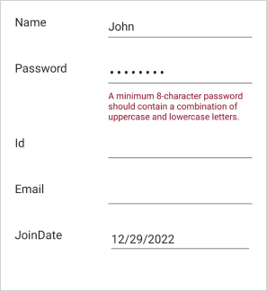
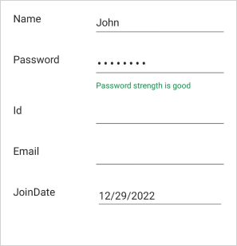
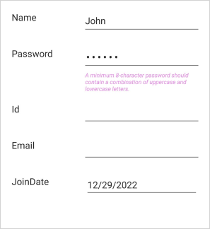
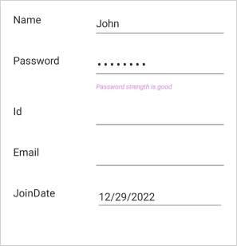

# Data Validation in .NET MAUI DataForm (SfDataForm)

The data form validates the data and user input to update the correct value in the underlying data object. In invalid data, the error message is shown at the bottom of the editor.

## Built in validations

The supported built in validations are as follows:

#### Data annotations

Validate the data using data annotation attributes.

The String type property is validated using the [Required](https://learn.microsoft.com/en-us/dotnet/api/system.componentmodel.dataannotations.requiredattribute?view=netframework-4.8) and [StringLength](https://learn.microsoft.com/en-us/dotnet/api/system.componentmodel.dataannotations.stringlengthattribute?view=netframework-4.8) attributes.




[Required(AllowEmptyStrings = false, ErrorMessage = "Name should not be empty")]
[StringLength(15, ErrorMessage = "Name should not exceed 15 characters")]
public string Name { get; set; }




Refer [here](https://help.syncfusion.com/maui/dataform/data-annotations) to know more about data annotations in DataForm.

#### Date range attribute

Validate the date time value using the date range attribute.




[DataType(DataType.Date)]
[DataFormDateRange(MinimumDate = "01/01/2022", MaximumDate = "31/12/2022", ErrorMessage = "Join date is invalid")]
public DateTime JoinDate { get; set; }




Refer [here](https://help.syncfusion.com/maui/dataform/data-annotations#dateformdaterange-attribute) to know more about date range attribute in DataForm.

## Validation mode

The [ValidationMode](https://help.syncfusion.com/cr/maui/Syncfusion.Maui.DataForm.SfDataForm.html#Syncfusion_Maui_DataForm_SfDataForm_ValidationMode) determines when the value should be validated.

The supported validation modes are as follows:

* LostFocus
* PropertyChanged
* Manual




<ContentPage
...
xmlns:dataForm="clr-namespace:Syncfusion.Maui.DataForm;assembly=Syncfusion.Maui.DataForm">
    <dataForm:SfDataForm
        x:Name="dataForm"
        ValidationMode="LostFocus">
    </dataForm:SfDataForm>
</ContentPage>




SfDataForm dataForm = new SfDataForm();
this.dataForm.ValidationMode = DataFormValidationMode.LostFocus;
this.Content = dataForm;




#### LostFocus

If the validation mode is [LostFocus](https://help.syncfusion.com/cr/maui/Syncfusion.Maui.DataForm.DataFormValidationMode.html#Syncfusion_Maui_DataForm_DataFormValidationMode_LostFocus), the value will be validated when the editor loses its focus. By default, the [ValidationMode](https://help.syncfusion.com/cr/maui/Syncfusion.Maui.DataForm.SfDataForm.html#Syncfusion_Maui_DataForm_SfDataForm_ValidationMode) is `LostFocus`.

#### PropertyChanged

If the validation mode is [PropertyChanged](https://help.syncfusion.com/cr/maui/Syncfusion.Maui.DataForm.DataFormValidationMode.html#Syncfusion_Maui_DataForm_DataFormValidationMode_PropertyChanged), the value will be validated immediately when it is changed.

#### Manual

If the validation mode is [Manual](https://help.syncfusion.com/cr/maui/Syncfusion.Maui.DataForm.DataFormValidationMode.html#Syncfusion_Maui_DataForm_DataFormValidationMode_Manual), the value should be validated manually by calling the [SfDataForm.Validate](https://help.syncfusion.com/cr/maui/Syncfusion.Maui.DataForm.SfDataForm.html#Syncfusion_Maui_DataForm_SfDataForm_Validate) or [SfDataForm.Validate(new List())](https://help.syncfusion.com/cr/maui/Syncfusion.Maui.DataForm.SfDataForm.html#Syncfusion_Maui_DataForm_SfDataForm_Validate_System_Collections_Generic_List_System_String__) method.

The following code validates the value of all the properties in the data object:




this.dataForm.Validate();




To validate the specific list of property value, pass the property names as argument.




this.dataForm.Validate(new List<string>() {"FirstName", "Age" });




Determine whether the data form or property is valid by using the [Validate](https://help.syncfusion.com/cr/maui/Syncfusion.Maui.DataForm.SfDataForm.html#Syncfusion_Maui_DataForm_SfDataForm_Validate) method.




bool isValid = this.dataForm.Validate();

List<string> propertyNames = new List<string>();
propertyNames.Add("FirstName");
bool isPropertyValid = this.dataForm.Validate(propertyNames);




If the data form or property is valid, `true` will be returned. Or else `false` will be returned.

N> [View sample in GitHub](https://github.com/SyncfusionExamples/maui-dataform/tree/master/ManualValidation)

## Valid message

If the values are correct, show the [ValidMessage](https://help.syncfusion.com/cr/maui/Syncfusion.Maui.DataForm.DataFormDisplayOptionsAttribute.html#Syncfusion_Maui_DataForm_DataFormDisplayOptionsAttribute_ValidMessage) like an error message, the valid message will also be displayed at the bottom of the editor.




[DataFormDisplayOptions(ValidMessage = "Password strength is good")]
[Required(ErrorMessage = "Please enter the password")]
[RegularExpression(@"^(?=.*[a-z])(?=.*[A-Z])[a-zA-Z\d]{8,}$", ErrorMessage = "A minimum 8-character password should contain a combination of uppercase and lowercase letters.")]
public string Password { get; set; }




## Validate the data form

Get the validation details of all the editors of the data form using the [ValidateForm](https://help.syncfusion.com/cr/maui/Syncfusion.Maui.DataForm.SfDataForm.html#Syncfusion_Maui_DataForm_SfDataForm_ValidateForm) event of the data form.

N> This event will be raised once after the manual validation call using the [SfDataForm.Validate()](https://help.syncfusion.com/cr/maui/Syncfusion.Maui.DataForm.SfDataForm.html#Syncfusion_Maui_DataForm_SfDataForm_Validate) method.




this.dataForm.ValidateForm += this.OnDataFormValidateForm;

private void OnDataFormValidateForm(object sender, DataFormValidateFormEventArgs e)
{
    object dataObject = e.DataObject;
    var values = e.NewValues;
    var errorMessage = e.ErrorMessage;
}




## Validate the specific editor

The [ValidateProperty](https://help.syncfusion.com/cr/maui/Syncfusion.Maui.DataForm.SfDataForm.html#Syncfusion_Maui_DataForm_SfDataForm_ValidateProperty) event allows you to validate specific editors in the data form. Set [IsValid](https://help.syncfusion.com/cr/maui/Syncfusion.Maui.DataForm.DataFormValidatePropertyEventArgs.html#Syncfusion_Maui_DataForm_DataFormValidatePropertyEventArgs_IsValid), [ErrorMessage](https://help.syncfusion.com/cr/maui/Syncfusion.Maui.DataForm.DataFormValidatePropertyEventArgs.html#Syncfusion_Maui_DataForm_DataFormValidatePropertyEventArgs_ErrorMessage), and [ValidMessage](https://help.syncfusion.com/cr/maui/Syncfusion.Maui.DataForm.DataFormValidatePropertyEventArgs.html#Syncfusion_Maui_DataForm_DataFormValidatePropertyEventArgs_ValidMessage) of the [DataFormValidatePropertyEventArgs](https://help.syncfusion.com/cr/maui/Syncfusion.Maui.DataForm.DataFormValidatePropertyEventArgs.html).




this.dataForm.ValidateProperty += this.OnDataFormValidateProperty;

private void OnDataFormValidateProperty(object sender, DataFormValidatePropertyEventArgs e)
{
    bool isValid = e.IsValid;
    string propertyName = e.PropertyName;
    object newValue = e.NewValue;
    object currentValue = e.CurrentValue;
    string errorMessage = e.ErrorMessage;
    string validMessage = e.ValidMessage;
}




## Show or Hide Validation Label

#### Show or Hide Error Message Label

The [`ShowErrorLabel`](https://help.syncfusion.com/cr/maui/Syncfusion.Maui.DataForm.DataFormItem.html#Syncfusion_Maui_DataForm_DataFormItem_ShowErrorLabel) property of a [DataformItem](https://help.syncfusion.com/cr/maui/Syncfusion.Maui.DataForm.DataFormItem.html?tabs=tabid-53%2Ctabid-58%2Ctabid-100%2Ctabid-33%2Ctabid-38%2Ctabid-6%2Ctabid-1%2Ctabid-28%2Ctabid-63%2Ctabid-8%2Ctabid-48%2Ctabid-96%2Ctabid-68%2Ctabid-76%2Ctabid-18%2Ctabid-13%2Ctabid-23%2Ctabid-72%2Ctabid-84%2Ctabid-92%2Ctabid-80%2Ctabid-88%2Ctabid-43) controls whether the error label is displayed. When set to true, the error label appears during validation failures. When set to false, the label remains hidden.




<ContentPage
...
xmlns:dataForm="clr-namespace:Syncfusion.Maui.DataForm;assembly=Syncfusion.Maui.DataForm">
    <dataForm:SfDataForm x:Name="dataForm" AutoGenerateItems="False">
        <dataForm:SfDataForm.Items>
            <dataForm:DataFormTextItem x:Name="TextItem" ShowErrorLabel="false"/>
        </dataForm:SfDataForm.Items>
    </dataForm:SfDataForm>
</ContentPage>




this.dataForm.AutoGenerateItems = false;
this.TextItem.ShowErrorLabel = false;




#### Show or Hide Valid Message Label

The [`ShowValidMessageLabel`](https://help.syncfusion.com/cr/maui/Syncfusion.Maui.DataForm.DataFormItem.html#Syncfusion_Maui_DataForm_DataFormItem_ShowValidMessageLabel) property of a [DataformItem](https://help.syncfusion.com/cr/maui/Syncfusion.Maui.DataForm.DataFormItem.htmltabs=tabid-53%2Ctabid-58%2Ctabid-100%2Ctabid-33%2Ctabid-38%2Ctabid-6%2Ctabid-1%2Ctabid-28%2Ctabid-63%2Ctabid-8%2Ctabid-48%2Ctabid-96%2Ctabid-68%2Ctabid-76%2Ctabid-18%2Ctabid-13%2Ctabid-23%2Ctabid-72%2Ctabid-84%2Ctabid-92%2Ctabid-80%2Ctabid-88%2Ctabid-43) controls the visibility of the valid message label. Setting this property to true displays the label when the input is valid, while setting it to false hides the label.




<ContentPage
...
xmlns:dataForm="clr-namespace:Syncfusion.Maui.DataForm;assembly=Syncfusion.Maui.DataForm">
    <dataForm:SfDataForm x:Name="dataForm" AutoGenerateItems="False">
        <dataForm:SfDataForm.Items>
            <dataForm:DataFormTextItem x:Name="TextItem" ShowValidMessageLabel="false"/>
        </dataForm:SfDataForm.Items>
    </dataForm:SfDataForm>
</ContentPage>




this.dataForm.AutoGenerateItems = false;
this.TextItem.ShowErrorLabel = false;




## Validation label appearance customization

The data form supports customizing the style of both error and valid message label style easily.

#### Customize error label text style

The error label style can be customized by changing the [ErrorLabelTextStyle](https://help.syncfusion.com/cr/maui/Syncfusion.Maui.DataForm.SfDataForm.html#Syncfusion_Maui_DataForm_SfDataForm_ErrorLabelTextStyle) property of the [SfDataForm](https://help.syncfusion.com/cr/maui/Syncfusion.Maui.DataForm.SfDataForm.html).



<ContentPage
...
xmlns:dataForm="clr-namespace:Syncfusion.Maui.DataForm;assembly=Syncfusion.Maui.DataForm">
    <dataForm:SfDataForm
        x:Name="dataForm">
        <dataForm:SfDataForm.ErrorLabelTextStyle>
            <dataForm:DataFormTextStyle FontSize="10" FontAttributes="Italic" TextColor="Violet" FontFamily="Roboto"/>
        </dataForm:SfDataForm.ErrorLabelTextStyle>
    </dataForm:SfDataForm>
</ContentPage>




Also, customize the error label style for each editor using the [ErrorLabelTextStyle](https://help.syncfusion.com/cr/maui/Syncfusion.Maui.DataForm.DataFormItem.html#Syncfusion_Maui_DataForm_DataFormItem_ErrorLabelTextStyle) property of the [DataFormItem](https://help.syncfusion.com/cr/maui/Syncfusion.Maui.DataForm.DataFormItem.html).




SfDataForm dataForm = new SfDataForm();
dataForm.GenerateDataFormItem += OnGenerateDataFormItem;
this.Content = dataForm;

private void OnGenerateDataFormItem(object sender, GenerateDataFormItemEventArgs e)
{
    if (e.DataFormItem != null)
    {
        if (e.DataFormItem.FieldName == "FirstName")
        {
            e.DataFormItem.ErrorLabelTextStyle = new DataFormTextStyle
            {
                TextColor = Colors.DarkSeaGreen,
                FontSize = 8,
                FontAttributes = FontAttributes.Italic,
                FontFamily = "Roboto",
            };
        }
    }
}




#### Customize valid message label text style

The valid message label style can be customized by changing the [ValidMessageLabelTextStyle](https://help.syncfusion.com/cr/maui/Syncfusion.Maui.DataForm.SfDataForm.html#Syncfusion_Maui_DataForm_SfDataForm_ValidMessageLabelTextStyle) property of the [SfDataForm](https://help.syncfusion.com/cr/maui/Syncfusion.Maui.DataForm.SfDataForm.html).




<ContentPage
...
xmlns:dataForm="clr-namespace:Syncfusion.Maui.DataForm;assembly=Syncfusion.Maui.DataForm">
    <dataForm:SfDataForm
        x:Name="dataForm">
        <dataForm:SfDataForm.ValidMessageLabelTextStyle>
            <dataForm:DataFormTextStyle FontSize="10" FontAttributes="Italic" TextColor="Violet" FontFamily="Roboto"/>
        </dataForm:SfDataForm.ValidMessageLabelTextStyle>
    </dataForm:SfDataForm>
</ContentPage>




Also, customize the valid message label style for each editor using the [ValidMessageLabelTextStyle](https://help.syncfusion.com/cr/maui/Syncfusion.Maui.DataForm.DataFormItem.html#Syncfusion_Maui_DataForm_DataFormItem_ValidMessageLabelTextStyle) property of the [DataFormItem](https://help.syncfusion.com/cr/maui/Syncfusion.Maui.DataForm.DataFormItem.html).




SfDataForm dataForm = new SfDataForm();
this.dataForm.GenerateDataFormItem += OnGenerateDataFormItem;
this.Content = dataForm;

private void OnGenerateDataFormItem(object sender, GenerateDataFormItemEventArgs e)
{
    if (e.DataFormItem != null)
    {
        if (e.DataFormItem.FieldName == "FirstName")
        {
            e.DataFormItem.ValidMessageLabelTextStyle = new DataFormTextStyle
            {
                TextColor = Colors.DarkSeaGreen,
                FontSize = 8,
                FontAttributes = FontAttributes.Italic,
                FontFamily = "Roboto",
            };
        }
    }
}




