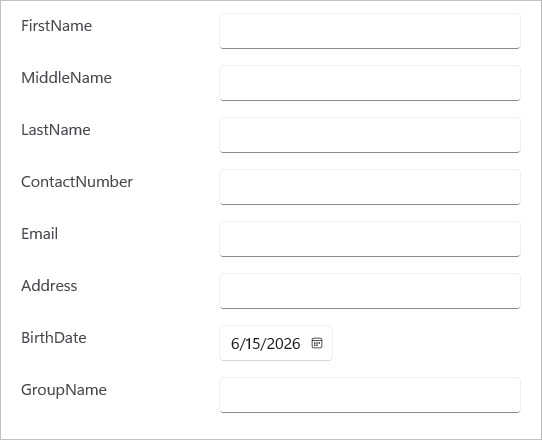

# Getting Started with the .NET MAUI DataForm

This section provides a quick overview of how to get started with the [.NET MAUI DataForm(SfDataForm)](https://help.syncfusion.com/cr/maui/Syncfusion.Maui.DataForm.html) for .NET MAUI and a walk-through to configure the .NET MAUI DataForm control in a real-time scenario. Follow the steps below to add .NET MAUI DataForm control to your project.




## Prerequisites

Before proceeding, ensure the following are set up:

1. Install [.NET 9 SDK](https://dotnet.microsoft.com/en-us/download/dotnet/9.0) or later.
2. Set up a .NET MAUI environment with Visual Studio 2022 v17.12 or later.

## Step 1: Create a New .NET MAUI Project

1. Go to **File > New > Project** and choose the **.NET MAUI App** template.
2. Name the project and choose a location. Then click **Next**.
3. Select the .NET framework version and click **Create**.

## Step 2: Install the Syncfusion&reg; .NET MAUI DataForm NuGet Package

1. In **Solution Explorer,** right-click the project and choose **Manage NuGet Packages.**
2. Search for [Syncfusion.Maui.DataForm](https://www.nuget.org/packages/Syncfusion.Maui.DataForm/) and install the latest version.
3. Ensure the necessary dependencies are installed correctly, and the project is restored.




## Prerequisites

Before proceeding, ensure the following are set up:

1. Install [.NET 9 SDK](https://dotnet.microsoft.com/en-us/download/dotnet/9.0) or later.
2. Set up a .NET MAUI environment with Visual Studio Code.
3. Ensure that the .NET MAUI workloads are installed and configured as described [here](https://learn.microsoft.com/en-us/dotnet/maui/get-started/installation?view=net-maui-9.0&tabs=visual-studio-code).

## Step 1: Create a New .NET MAUI Project

1. Open the command palette by pressing `Ctrl+Shift+P` and type **.NET:New Project** and enter.
2. Choose the **.NET MAUI App** template.
3. Select the project location, type the project name and press **Enter**.
4. Then choose **Create project.**

## Step 2: Install the Syncfusion&reg; .NET MAUI DataForm NuGet Package

1. Press <kbd>Ctrl</kbd> + <kbd>`</kbd> (backtick) to open the integrated terminal in Visual Studio Code.
2. Ensure you're in the project root directory where your .csproj file is located.
3. Run the command `dotnet add package Syncfusion.Maui.DataForm` to install the Syncfusion® .NET MAUI DataForm NuGet package.
4. To ensure all dependencies are installed, run `dotnet restore`.





## Prerequisites

Before proceeding, ensure the following are set up:

1. Install [.NET 9 SDK](https://dotnet.microsoft.com/en-us/download/dotnet/9.0) or later.
2. Set up a .NET MAUI environment with JetBrains Rider 2024.3 or later.
3. Make sure the MAUI workloads are installed and configured as described [here.](https://www.jetbrains.com/help/rider/MAUI.html#before-you-start)

## Step 1: Create a new .NET MAUI Project

1. Go to **File > New Solution,** Select .NET (C#) and choose the .NET MAUI App template.
2. Enter the Project Name, Solution Name, and Location.
3. Select the .NET framework version and click Create.

## Step 2: Install the Syncfusion® MAUI DataForm NuGet Package

1. In **Solution Explorer,** right-click the project and choose **Manage NuGet Packages.**
2. Search for [Syncfusion.Maui.DataForm](https://www.nuget.org/packages/Syncfusion.Maui.DataForm/) and install the latest version.
3. Ensure the necessary dependencies are installed correctly, and the project is restored. If not, Open the Terminal in Rider and manually run: `dotnet restore`




## Step 3: Register Syncfusion handler

Make sure to add the namespace.


using Syncfusion.Maui.Core.Hosting;
 

Register the Syncfusion core handler in your `CreateMauiApp` method of `MauiProgram.cs` file to use Syncfusion controls.


builder.ConfigureSyncfusionCore();
 

## Step 4: Define Model and View Model

The [SfDataForm](https://help.syncfusion.com/cr/maui/Syncfusion.Maui.DataForm.SfDataForm.html) is a data edit control, so create a data object with details to create a data form based on your business requirement.

Here, the data object named **ContactsInfo** is created with some properties.




public class ContactsInfo
{
    public string FirstName { get; set; }
    public string MiddleName { get; set; }
    public string LastName { get; set; }
    public string ContactNumber { get; set; }
    public string Email { get; set; }
    public string Address { get; set; }
    public DateTime? BirthDate { get; set; }
    public string GroupName { get; set; }
}




Initialize the data object in view model class to bind in the [DataObject](https://help.syncfusion.com/cr/maui/Syncfusion.Maui.DataForm.SfDataForm.html#Syncfusion_Maui_DataForm_SfDataForm_DataObject) property of [SfDataForm](https://help.syncfusion.com/cr/maui/Syncfusion.Maui.DataForm.SfDataForm.html).




public class DataFormViewModel
{
    public ContactsInfo ContactsInfo {get; set;}
        
    public DataFormViewModel()
    {
        this.ContactsInfo = new ContactsInfo();
    }
}




## Step 5: Import the DataForm namespace

Add the following namespace in your XAML or C#.



xmlns:dataForm="clr-namespace:Syncfusion.Maui.DataForm;assembly=Syncfusion.Maui.DataForm"


using Syncfusion.Maui.DataForm;



## Step 6: Add the DataForm component

Create an instance and set it as the DataForm's `DataObject`. By default, the data form auto-generates the editors based on the primitive data type in the [DataObject](https://help.syncfusion.com/cr/maui/Syncfusion.Maui.DataForm.SfDataForm.html#Syncfusion_Maui_DataForm_SfDataForm_DataObject) property. Please refer the following code to set the [DataObject](https://help.syncfusion.com/cr/maui/Syncfusion.Maui.DataForm.SfDataForm.html#Syncfusion_Maui_DataForm_SfDataForm_DataObject) property.



<dataForm:SfDataForm DataObject="{Binding ContactsInfo}">
    <dataForm:SfDataForm.BindingContext>
        <local:DataFormViewModel />
    </dataForm:SfDataForm.BindingContext>
</dataForm:SfDataForm>


this.BindingContext = new DataFormViewModel();
SfDataForm dataForm = new SfDataForm()
{
    DataObject = new ContactsInfo()
};
this.Content = dataForm;



The following screenshot illustrates the result of the above code.

You can download the DataForm Getting Started sample from [GitHub](https://github.com/SyncfusionExamples/maui-dataform/tree/master/GettingStarted)

N> When publishing in AOT mode on iOS and macOS, ensure that `[Preserve(AllMembers = true)]` is added to the model class to maintain the binding between DataForm and DataObject.

N> You can refer to our [.NET MAUI DataForm](https://www.syncfusion.com/maui-controls/maui-dataform) feature tour page for its groundbreaking feature representations. You can also explore our [.NET MAUI DataForm example](https://github.com/syncfusion/maui-demos/tree/master/MAUI/DataForm) that shows you how to render and configure the DataForm.
