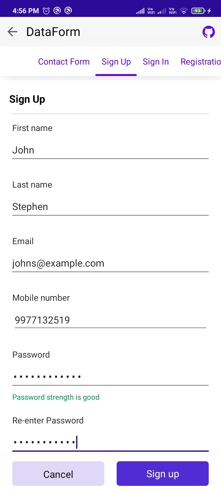

# Layout in .NET MAUI DataForm (SfDataForm)

## Overview

The data form supports linear and grid layouts and manages the layout of the label, editor, and validation label.

## Linear data form layout

By default, the data form arranges the fields one by one. It is applicable for both label positions: left and top.

When the label position is Left, the linear layout is shown as follows:

When the label position is Top, the linear layout is shown as follows:

## Grid data form layout

By default, the data form arranges one data field per row. It is possible to have more than one data field per row by setting the `ColumnCount` property which provides a grid-like layout for the data form. The column order of the data form field in a row can be changed using the `ItemsOrderInRow`.



<ContentPage 
...
xmlns:dataForm="clr-namespace:Syncfusion.Maui.DataForm;assembly=Syncfusion.Maui.DataForm">
    <dataForm:SfDataForm
        x:Name="dataForm"
        ColumnCount="2">
    </dataForm:SfDataForm>
</ContentPage>



this.dataForm.ColumnCount = 2;




N> Setting the `ColumnCount` property to SfDataForm does not arrange the data fields in a group according to the column count. To set the column count for data fields in the data form group, refer to the `loading different layout for data form group`.

When the label position is Top, the grid layout is shown as follows:

## Label visibility

The label can be hidden by defining the `DataFormDisplayOptions` attribute or by handling the `GenerateDataFormItem` event. In this case, only the editor will be loaded.

#### Using attributes




[DataFormDisplayOptions(ShowLabel = false)]
public string Name { get; set; }




#### Using event




this.dataForm.GenerateDataFormItem += OnGenerateDataFormItem;

private void OnGenerateDataFormItem(object sender, GenerateDataFormItemEventArgs e)
{
    if (e.DataFormItem != null)
    {
        if (e.DataFormItem.FieldName == "Name")
        {
            e.DataFormItem.ShowLabel = false;
        }
    }
}




## Label position

The label can be positioned either top or left side of the editor. By using the `DataFormDefaultLayoutSettings.LabelPosition` property, lay out the label associated with the editor for the data form.

By default, the label will be positioned at left side of the editor.



<ContentPage 
...
xmlns:dataForm="clr-namespace:Syncfusion.Maui.DataForm;assembly=Syncfusion.Maui.DataForm">
    <dataForm:SfDataForm
        x:Name="dataForm">
        <dataForm:SfDataForm.DefaultLayoutSettings>
            <dataForm:DataFormDefaultLayoutSettings
                LabelPosition="Top"/>
        </dataForm:SfDataForm.DefaultLayoutSettings>
    </dataForm:SfDataForm>
</ContentPage>




this.dataForm.DefaultLayoutSettings.LabelPosition = DataFormLabelPosition.Top;




#### Changing particular editors label position

The label position of a particular editor can be changed by using the `DataFormDefaultLayoutSettings.LabelPosition` property in the `DataFormItem`, and it will be handled in the `GenerateDataFormItem` event.



<ContentPage 
...
xmlns:dataForm="clr-namespace:Syncfusion.Maui.DataForm;assembly=Syncfusion.Maui.DataForm">
    <dataForm:SfDataForm
        x:Name="dataForm"
        DataObject="{Binding DataObjects}"
        GenerateDataFormItem="OnGenerateDataFormItem">
    </dataForm:SfDataForm>
</ContentPage>




this.dataForm.GenerateDataFormItem += OnGenerateDataFormItem;

private void OnGenerateDataFormItem(object sender, GenerateDataFormItemEventArgs e)
{
    if (e.DataFormItem != null)
    {
        if (e.DataFormItem.FieldName == "Name")
        {
            e.DataFormItem.DefaultLayoutSettings = new DataFormDefaultLayoutSettings
            {
                LabelPosition = DataFormLabelPosition.Top,
            };
        }
    }
}




## Loading images for label

The image can be loaded instead of the label by using the `LeadingLabelIcon` property of the `DataFormItem`.

#### Using event




this.dataForm.GenerateDataFormItem += OnGenerateDataFormItem;

private void OnGenerateDataFormItem(object sender, GenerateDataFormItemEventArgs e)
{
    if (e.DataFormItem != null)
    {
        if (e.DataFormItem.FieldName == "Name")
        {
            e.DataFormItem.LeadingLabelIcon = ImageSource.FromFile("ContactInfo.png");
        }
    }
}




## Changing order of the editors

The order of the data form editors can be changed by using attributes or by handling the `GenerateDataFormItem` event.

#### Using attributes

The data form editors' order can be changed by using the `RowOrder` property in the `DataFormDisplayOptionsAttribute` attribute.




[DataFormDisplayOptions(RowOrder = 1)]
public string Adress { get; set; }

[DataFormDisplayOptions(RowOrder = 0)]
public string Name { get; set; }




#### Using event

The data form editors' order can be changed by using the `RowOrder` property in the `DataFormItem`.




this.dataForm.GenerateDataFormItem += OnGenerateDataFormItem;

private void OnGenerateDataFormItem(object sender, GenerateDataFormItemEventArgs e)
{
    if (e.DataFormItem != null)
    {
        if (e.DataFormItem.FieldName == "Name")
        {
            e.DataFormItem.RowOrder = 0;
        }
    }
}




## Change the label and editor width

The label and editor width are set proportionally by using the `LabelWidth` and `EditorWidth` properties of the `DefaultLayoutSettings` class.
The `Value` and `UnitType` properties of the `DataFormItemLength` each return the value and unit type of the corresponding DataFormItemLength respectively.
The label and Editor are specified with proportionate values such as 0.4* and 0.6* when the `DataFormItemLength.UnitType` is "Star".
Additionally, Specify a defined width for the editor and label such as "300, 400," and the `DataFormItemLength.UnitType` is "Absolute."



<ContentPage 
...
xmlns:dataForm="clr-namespace:Syncfusion.Maui.DataForm;assembly=Syncfusion.Maui.DataForm">
    <dataForm:SfDataForm
        x:Name="dataForm">
        <dataForm:SfDataForm.DefaultLayoutSettings>
            <dataForm:DataFormDefaultLayoutSettings
                LabelWidth="0.4*"
                EditorWidth="0.6*"/>
        </dataForm:SfDataForm.DefaultLayoutSettings>
    </dataForm:SfDataForm>
</ContentPage>



this.dataForm.DefaultLayoutSettings.LabelWidth = new DataFormItemLength(300, DataFormItemLengthUnitType.Absolute);
this.dataForm.DefaultLayoutSettings.EditorWidth = new DataFormItemLength(400, DataFormItemLengthUnitType.Absolute);




this.dataForm.DefaultLayoutSettings.LabelWidth = new DataFormItemLength(0.3, DataFormItemLengthUnitType.Star);
this.dataForm.DefaultLayoutSettings.EditorWidth = new DataFormItemLength(0.7, DataFormItemLengthUnitType.Star);




N> The label width customization is applicable only when the `LabelPosition` is Left.

By default, the available width is divided into 40% for the label and 60% for the editor.

## Spanning editors rows and columns

The row height and column width are increased by defining the `DataFormDisplayOptions` attribute or by handling the `GenerateDataFormItem` event.

### Row span

#### Using attributes

The row height is increased by using the `RowSpan` property in the `DataFormDisplayOptions` attribute.




[DataFormDisplayOptions(RowSpan = 2)]
public string Name { get; set; }




#### Using event

The row height of each `DataFormItem` can also be increased by using the `RowSpan` property, and it will be handled in the `GenerateDataFormItem` event.




this.dataForm.GenerateDataFormItem += OnGenerateDataFormItem;

private void OnGenerateDataFormItem(object sender, GenerateDataFormItemEventArgs e)
{
    if (e.DataFormItem != null)
    {
        if (e.DataFormItem.FieldName == "Name")
        {
            e.DataFormItem.RowSpan = 2;
        }
    }
}




Here, `Name` field’s row height is increased.

### Column span

#### Using attributes

When the grid layout is used, the column width is increased by using the `ColumnSpan` property in the `DataFormDisplayOptions` attribute.




this.dataForm.ColumnCount = 2;




[DataFormDisplayOptions(ColumnSpan = 2)]
public string Name { get; set; }




#### Using event

When the grid layout is used, increase the column width of each `DataFormItem` using the `ColumnSpan` property, and it will be handled in the `GenerateDataFormItem` event.




this.dataForm.GenerateDataFormItem += OnGenerateDataFormItem;

private void OnGenerateDataFormItem(object sender, GenerateDataFormItemEventArgs e)
{
    if (e.DataFormItem != null)
    {
        if (e.DataFormItem.FieldName == "Name")
        {
            e.DataFormItem.ColumnSpan = 2;
        }
    }
}




## Change the editor visibility

The data form editor visibility is changed by using the `IsVisible` property of the `DataFormItem`.




this.dataForm.GenerateDataFormItem += OnGenerateDataFormItem;

private void OnGenerateDataFormItem(object sender, GenerateDataFormItemEventArgs e)
{
    if (e.DataFormItem != null)
    {
        if (e.DataFormItem.FieldName == "Name")
        {
            e.DataFormItem.IsVisible = false;
        }
    }
}




Here, the `Name` field will be hidden.