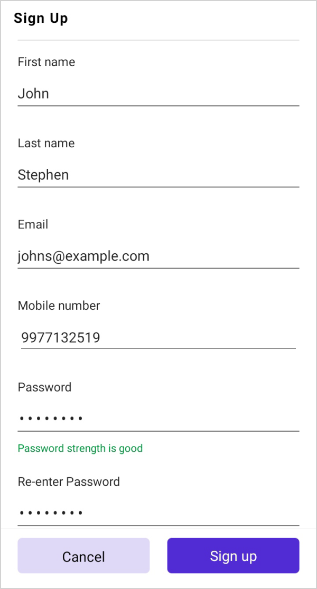
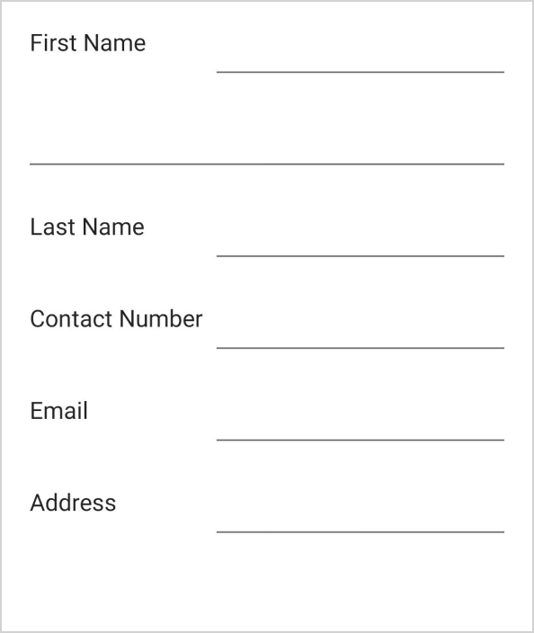
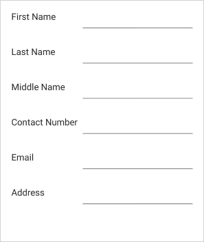
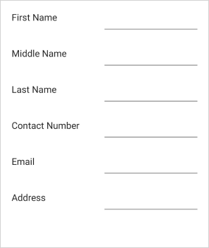
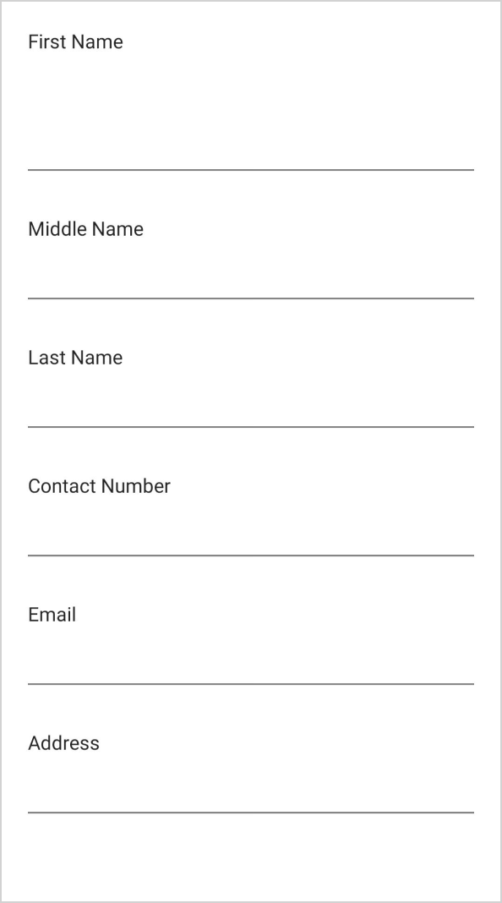
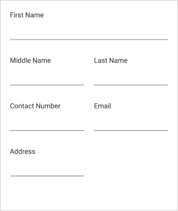

# Layout in .NET MAUI DataForm (SfDataForm)

## Overview

The data form supports linear and grid layouts and manages the layout of the label, editor, and validation label.

## Linear data form layout

By default, the data form arranges the fields one by one. It is applicable for both label positions: left and top.

When the label position is Left, the linear layout is shown as follows:

When the label position is Top, the linear layout is shown as follows:

## Grid data form layout

By default, the data form arranges one data field per row. It is possible to have more than one data field per row by setting the [ColumnCount](https://help.syncfusion.com/cr/maui/Syncfusion.Maui.DataForm.SfDataForm.html#Syncfusion_Maui_DataForm_SfDataForm_ColumnCount) property which provides a grid-like layout for the data form. The column order of the data form field in a row can be changed using the [ItemsOrderInRow](https://help.syncfusion.com/cr/maui/Syncfusion.Maui.DataForm.DataFormItem.html#Syncfusion_Maui_DataForm_DataFormItem_ItemsOrderInRow).



<ContentPage 
...
xmlns:dataForm="clr-namespace:Syncfusion.Maui.DataForm;assembly=Syncfusion.Maui.DataForm">
    <dataForm:SfDataForm
        x:Name="dataForm"
        ColumnCount="2">
    </dataForm:SfDataForm>
</ContentPage>



SfDataForm dataForm = new SfDataForm();
dataForm.ColumnCount = 2;
this.Content = dataForm;




N> Setting the [ColumnCount](https://help.syncfusion.com/cr/maui/Syncfusion.Maui.DataForm.SfDataForm.html#Syncfusion_Maui_DataForm_SfDataForm_ColumnCount) property to SfDataForm does not arrange the data fields in a group according to the column count. To set the column count for data fields in the data form group, refer to the [loading different layout for data form group](https://help.syncfusion.com/maui/dataform/grouping#changing-the-layout-for-the-group).

When the label position is Top, the grid layout is shown as follows:

## Label visibility

The label can be hidden by defining the [DataFormDisplayOptions](https://help.syncfusion.com/cr/maui/Syncfusion.Maui.DataForm.DataFormDisplayOptionsAttribute.html?tabs=tabid-1%2Ctabid-22%2Ctabid-18%2Ctabid-5%2Ctabid-9%2Ctabid-13) attribute or by handling the [GenerateDataFormItem](https://help.syncfusion.com/cr/maui/Syncfusion.Maui.DataForm.SfDataForm.html#Syncfusion_Maui_DataForm_SfDataForm_GenerateDataFormItem) event. In this case, only the editor will be loaded.

#### Using attributes




[DataFormDisplayOptions(ShowLabel = false)]
public string Name { get; set; }




#### Using event




this.dataForm.GenerateDataFormItem += OnGenerateDataFormItem;

private void OnGenerateDataFormItem(object sender, GenerateDataFormItemEventArgs e)
{
    if (e.DataFormItem != null)
    {
        if (e.DataFormItem.FieldName == "Name")
        {
            e.DataFormItem.ShowLabel = false;
        }
    }
}




## Label position

The label can be positioned either top or left side of the editor. By using the [DataFormDefaultLayoutSettings.LabelPosition](https://help.syncfusion.com/cr/maui/Syncfusion.Maui.DataForm.DataFormDefaultLayoutSettings.html#Syncfusion_Maui_DataForm_DataFormDefaultLayoutSettings_LabelPosition) property, lay out the label associated with the editor for the data form.

By default, the label will be positioned at left side of the editor.



<ContentPage 
...
xmlns:dataForm="clr-namespace:Syncfusion.Maui.DataForm;assembly=Syncfusion.Maui.DataForm">
    <dataForm:SfDataForm
        x:Name="dataForm">
        <dataForm:SfDataForm.DefaultLayoutSettings>
            <dataForm:DataFormDefaultLayoutSettings
                LabelPosition="Top"/>
        </dataForm:SfDataForm.DefaultLayoutSettings>
    </dataForm:SfDataForm>
</ContentPage>




SfDataForm dataForm = new SfDataForm();
dataForm.DefaultLayoutSettings.LabelPosition = DataFormLabelPosition.Top;
this.Content = dataForm;




#### Changing particular editors label position

The label position of a particular editor can be changed by using the [DataFormDefaultLayoutSettings.LabelPosition](https://help.syncfusion.com/cr/maui/Syncfusion.Maui.DataForm.DataFormDefaultLayoutSettings.html#Syncfusion_Maui_DataForm_DataFormDefaultLayoutSettings_LabelPosition) property in the [DataFormItem](https://help.syncfusion.com/cr/maui/Syncfusion.Maui.DataForm.DataFormItem.html), and it will be handled in the [GenerateDataFormItem](https://help.syncfusion.com/cr/maui/Syncfusion.Maui.DataForm.SfDataForm.html#Syncfusion_Maui_DataForm_SfDataForm_GenerateDataFormItem) event.



<ContentPage 
...
xmlns:dataForm="clr-namespace:Syncfusion.Maui.DataForm;assembly=Syncfusion.Maui.DataForm">
    <dataForm:SfDataForm
        x:Name="dataForm"
        DataObject="{Binding DataObjects}"
        GenerateDataFormItem="OnGenerateDataFormItem">
    </dataForm:SfDataForm>
</ContentPage>




SfDataForm dataForm = new SfDataForm();
dataForm.GenerateDataFormItem += OnGenerateDataFormItem;
this.Content = dataForm;

private void OnGenerateDataFormItem(object sender, GenerateDataFormItemEventArgs e)
{
    if (e.DataFormItem != null)
    {
        if (e.DataFormItem.FieldName == "Name")
        {
            e.DataFormItem.DefaultLayoutSettings = new DataFormDefaultLayoutSettings
            {
                LabelPosition = DataFormLabelPosition.Top,
            };
        }
    }
}




## Loading images for label

The image can be loaded instead of the label by using the [LeadingView](https://help.syncfusion.com/cr/maui/Syncfusion.Maui.DataForm.DataFormItem.html#Syncfusion_Maui_DataForm_DataFormItem_LeadingView) property of the [DataFormItem](https://help.syncfusion.com/cr/maui/Syncfusion.Maui.DataForm.DataFormItem.html).

#### Using event




this.dataForm.GenerateDataFormItem += OnGenerateDataFormItem;

private void OnGenerateDataFormItem(object sender, GenerateDataFormItemEventArgs e)
{
    if (e.DataFormItem != null)
    {
        if (e.DataFormItem.FieldName == "Name")
        {
            e.DataFormItem.LeadingView = new Label { Text = "F", FontSize = 18, TextColor = Colors.Gray, FontFamily = "InputLayoutIcons", HeightRequest = 24, VerticalTextAlignment = TextAlignment.End };
        }
    }
}




N> [View sample in GitHub](https://github.com/SyncfusionExamples/maui-dataform/tree/master/LabelIconSample)

## Changing order of the editors

The order of the data form editors can be changed by using attributes or by handling the [GenerateDataFormItem](https://help.syncfusion.com/cr/maui/Syncfusion.Maui.DataForm.SfDataForm.html#Syncfusion_Maui_DataForm_SfDataForm_GenerateDataFormItem) event.

#### Using attributes

The data form editors' order can be changed by using the [RowOrder](https://help.syncfusion.com/cr/maui/Syncfusion.Maui.DataForm.DataFormDisplayOptionsAttribute.html#Syncfusion_Maui_DataForm_DataFormDisplayOptionsAttribute_RowOrder) property in the [DataFormDisplayOptionsAttribute](https://help.syncfusion.com/cr/maui/Syncfusion.Maui.DataForm.DataFormDisplayOptionsAttribute.html) attribute.




[DataFormDisplayOptions(RowOrder = 1)]
public string Adress { get; set; }

[DataFormDisplayOptions(RowOrder = 0)]
public string Name { get; set; }




#### Using event

The data form editors' order can be changed by using the [RowOrder](https://help.syncfusion.com/cr/maui/Syncfusion.Maui.DataForm.DataFormViewItem.html#Syncfusion_Maui_DataForm_DataFormViewItem_RowOrder) property in the [DataFormItem](https://help.syncfusion.com/cr/maui/Syncfusion.Maui.DataForm.DataFormItem.html).




this.dataForm.GenerateDataFormItem += OnGenerateDataFormItem;

private void OnGenerateDataFormItem(object sender, GenerateDataFormItemEventArgs e)
{
    if (e.DataFormItem != null)
    {
        if (e.DataFormItem.FieldName == "Name")
        {
            e.DataFormItem.RowOrder = 0;
        }
    }
}




## Change the label and editor width

The label and editor width are set proportionally by using the [LabelWidth](https://help.syncfusion.com/cr/maui/Syncfusion.Maui.DataForm.DataFormDefaultLayoutSettings.html#Syncfusion_Maui_DataForm_DataFormDefaultLayoutSettings_LabelWidth) and [EditorWidth](https://help.syncfusion.com/cr/maui/Syncfusion.Maui.DataForm.DataFormDefaultLayoutSettings.html#Syncfusion_Maui_DataForm_DataFormDefaultLayoutSettings_EditorWidth) properties of the [DefaultLayoutSettings](https://help.syncfusion.com/cr/maui/Syncfusion.Maui.DataForm.DataFormDefaultLayoutSettings.html) class.
The [Value](https://help.syncfusion.com/cr/maui/Syncfusion.Maui.DataForm.DataFormItemLength.html#Syncfusion_Maui_DataForm_DataFormItemLength_Value) and [UnitType](https://help.syncfusion.com/cr/maui/Syncfusion.Maui.DataForm.DataFormItemLength.html#Syncfusion_Maui_DataForm_DataFormItemLength_UnitType) properties of the [DataFormItemLength](https://help.syncfusion.com/cr/maui/Syncfusion.Maui.DataForm.DataFormItemLength.html) each return the value and unit type of the corresponding DataFormItemLength respectively.
The label and Editor are specified with proportionate values such as `0.4*` and `0.6*` when the [DataFormItemLength.UnitType](https://help.syncfusion.com/cr/maui/Syncfusion.Maui.DataForm.DataFormItemLength.html#Syncfusion_Maui_DataForm_DataFormItemLength_UnitType) is `Star`.
Additionally, Specify a defined width for the editor and label such as `300, 400,` and the [DataFormItemLength.UnitType](https://help.syncfusion.com/cr/maui/Syncfusion.Maui.DataForm.DataFormItemLength.html#Syncfusion_Maui_DataForm_DataFormItemLength_UnitType) is `Absolute`.



<ContentPage 
...
xmlns:dataForm="clr-namespace:Syncfusion.Maui.DataForm;assembly=Syncfusion.Maui.DataForm">
    <dataForm:SfDataForm
        x:Name="dataForm">
        <dataForm:SfDataForm.DefaultLayoutSettings>
            <dataForm:DataFormDefaultLayoutSettings
                LabelWidth="0.4*"
                EditorWidth="0.6*"/>
        </dataForm:SfDataForm.DefaultLayoutSettings>
    </dataForm:SfDataForm>
</ContentPage>



SfDataForm dataForm = new SfDataForm();
dataForm.DefaultLayoutSettings.LabelWidth = new DataFormItemLength(300, DataFormItemLengthUnitType.Absolute);
dataForm.DefaultLayoutSettings.EditorWidth = new DataFormItemLength(400, DataFormItemLengthUnitType.Absolute);
this.Content = dataForm;




SfDataForm dataForm = new SfDataForm();
this.dataForm.DefaultLayoutSettings.LabelWidth = new DataFormItemLength(0.3, DataFormItemLengthUnitType.Star);
this.dataForm.DefaultLayoutSettings.EditorWidth = new DataFormItemLength(0.7, DataFormItemLengthUnitType.Star);
this.Content = dataForm;




N> The label width customization is applicable only when the [LabelPosition](https://help.syncfusion.com/cr/maui/Syncfusion.Maui.DataForm.DataFormDefaultLayoutSettings.html#Syncfusion_Maui_DataForm_DataFormDefaultLayoutSettings_LabelPosition) is Left.

By default, the available width is divided into 40% for the label and 60% for the editor.

## Spanning editors rows and columns

The row height and column width are increased by defining the [DataFormDisplayOptions](https://help.syncfusion.com/cr/maui/Syncfusion.Maui.DataForm.DataFormDisplayOptionsAttribute.html) attribute or by handling the [GenerateDataFormItem](https://help.syncfusion.com/cr/maui/Syncfusion.Maui.DataForm.SfDataForm.html#Syncfusion_Maui_DataForm_SfDataForm_GenerateDataFormItem) event.

### Row span

#### Using attributes

The row height is increased by using the [RowSpan](https://help.syncfusion.com/cr/maui/Syncfusion.Maui.DataForm.DataFormDisplayOptionsAttribute.html#Syncfusion_Maui_DataForm_DataFormDisplayOptionsAttribute_RowSpan) property in the [DataFormDisplayOptions](https://help.syncfusion.com/cr/maui/Syncfusion.Maui.DataForm.DataFormDisplayOptionsAttribute.html)  attribute.




[DataFormDisplayOptions(RowSpan = 2)]
public string FirstName { get; set; }




#### Using event

The row height of each [DataFormItem](https://help.syncfusion.com/cr/maui/Syncfusion.Maui.DataForm.DataFormItem.html) can also be increased by using the [RowSpan](https://help.syncfusion.com/cr/maui/Syncfusion.Maui.DataForm.DataFormDisplayOptionsAttribute.html#Syncfusion_Maui_DataForm_DataFormDisplayOptionsAttribute_RowSpan) property, and it will be handled in the [GenerateDataFormItem](https://help.syncfusion.com/cr/maui/Syncfusion.Maui.DataForm.SfDataForm.html#Syncfusion_Maui_DataForm_SfDataForm_GenerateDataFormItem) event.




this.dataForm.GenerateDataFormItem += OnGenerateDataFormItem;

private void OnGenerateDataFormItem(object sender, GenerateDataFormItemEventArgs e)
{
    if (e.DataFormItem != null)
    {
        if (e.DataFormItem.FieldName == "FirstName")
        {
            e.DataFormItem.RowSpan = 2;
        }
    }
}




Here, `FirstName` field’s row height is increased.

### Column span

#### Using attributes

When the grid layout is used, the column width is increased by using the [ColumnSpan](https://help.syncfusion.com/cr/maui/Syncfusion.Maui.DataForm.DataFormDisplayOptionsAttribute.html#Syncfusion_Maui_DataForm_DataFormDisplayOptionsAttribute_ColumnSpan) property in the [DataFormDisplayOptions](https://help.syncfusion.com/cr/maui/Syncfusion.Maui.DataForm.DataFormDisplayOptionsAttribute.html) attribute.




this.dataForm.ColumnCount = 2;




[DataFormDisplayOptions(ColumnSpan = 2)]
public string FirstName { get; set; }




#### Using event

When the grid layout is used, increase the column width of each [DataFormItem](https://help.syncfusion.com/cr/maui/Syncfusion.Maui.DataForm.DataFormItem.html) using the [ColumnSpan](https://help.syncfusion.com/cr/maui/Syncfusion.Maui.DataForm.DataFormDisplayOptionsAttribute.html#Syncfusion_Maui_DataForm_DataFormDisplayOptionsAttribute_ColumnSpan) property, and it will be handled in the [GenerateDataFormItem](https://help.syncfusion.com/cr/maui/Syncfusion.Maui.DataForm.SfDataForm.html#Syncfusion_Maui_DataForm_SfDataForm_GenerateDataFormItem) event.




this.dataForm.GenerateDataFormItem += OnGenerateDataFormItem;

private void OnGenerateDataFormItem(object sender, GenerateDataFormItemEventArgs e)
{
    if (e.DataFormItem != null)
    {
        if (e.DataFormItem.FieldName == "FirstName")
        {
            e.DataFormItem.ColumnSpan = 2;
        }
    }
}




## Change the editor visibility

The data form editor visibility is changed by using the [IsVisible](https://help.syncfusion.com/cr/maui/Syncfusion.Maui.DataForm.DataFormViewItem.html#Syncfusion_Maui_DataForm_DataFormViewItem_IsVisible) property of the [DataFormItem](https://help.syncfusion.com/cr/maui/Syncfusion.Maui.DataForm.DataFormItem.html).




this.dataForm.GenerateDataFormItem += OnGenerateDataFormItem;

private void OnGenerateDataFormItem(object sender, GenerateDataFormItemEventArgs e)
{
    if (e.DataFormItem != null)
    {
        if (e.DataFormItem.FieldName == "Name")
        {
            e.DataFormItem.IsVisible = false;
        }
    }
}




Here, the `Name` field will be hidden.

## Programmatically scroll to specific editor

You can programmatically scroll to specific editor using the [ScrollTo](https://help.syncfusion.com/cr/maui/Syncfusion.Maui.DataForm.SfDataForm.html#Syncfusion_Maui_DataForm_SfDataForm_ScrollTo_System_String_) method by passing the `property name`.




dataForm.ScrollTo("FirstName");




{:width="325" height="600" loading="lazy" .lazy .shadow-effect .section-padding .img-padding}

## Change the editor height

The .NET MAUI DataForm allows you to modify the height of each editor to fit the height of the data form or to customize the height based on text size by using the [EditorHeight](https://help.syncfusion.com/cr/maui/Syncfusion.Maui.DataForm.DataFormItem.html#Syncfusion_Maui_DataForm_DataFormItem_EditorHeight) property of the [DataFormItem](https://help.syncfusion.com/cr/maui/Syncfusion.Maui.DataForm.DataFormItem.html).




this.dataForm.GenerateDataFormItem += OnGenerateDataFormItem;

private void OnGenerateDataFormItem(object sender, GenerateDataFormItemEventArgs e)
{
    if (e.DataFormItem != null)
    {
        if (e.DataFormItem.FieldName == "Name")
        {
            e.DataFormItem.EditorHeight = 60;
        }
    }
}




N> The `EditorHeight` customization is applicable for both [Default](https://help.syncfusion.com/cr/maui/Syncfusion.Maui.DataForm.DataFormLayoutType.html#Syncfusion_Maui_DataForm_DataFormLayoutType_Default) and [TextInputLayout](https://help.syncfusion.com/cr/maui/Syncfusion.Maui.DataForm.DataFormLayoutType.html#Syncfusion_Maui_DataForm_DataFormLayoutType_TextInputLayout) layout types.