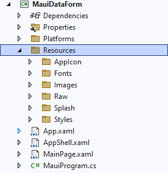
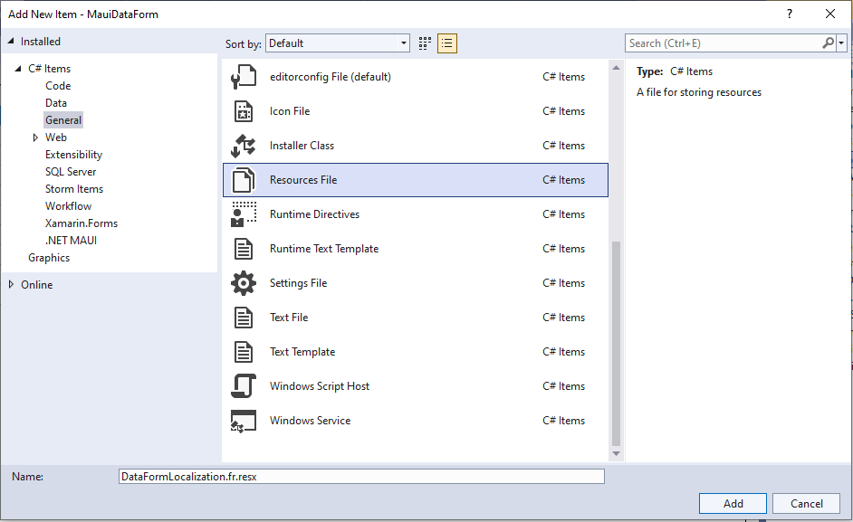
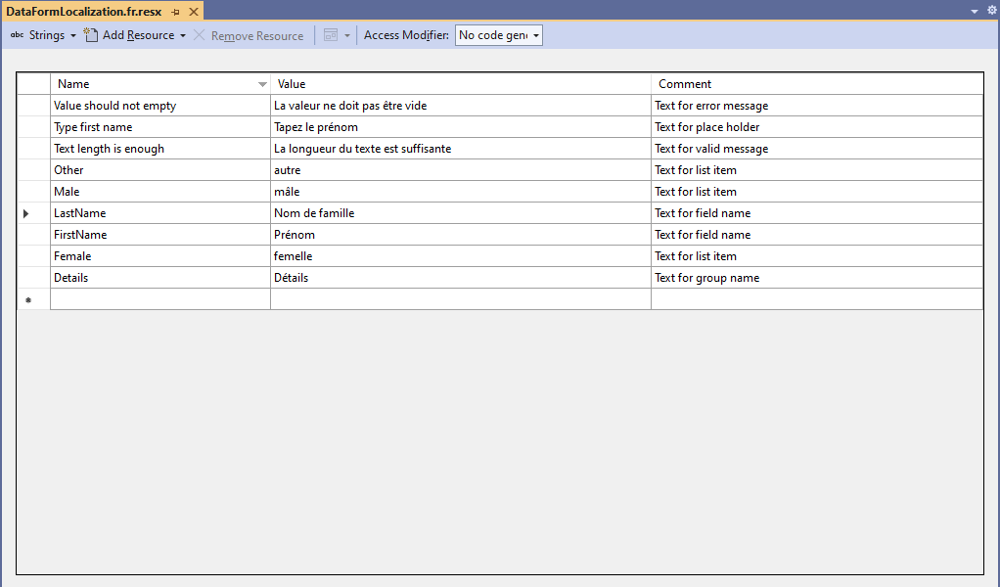
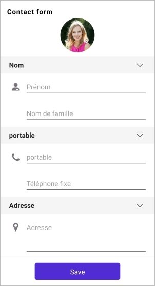

# Localization in .NET MAUI DataForm (SfDataForm)

Localization is translating the application resources into different languages for specific cultures. The `SfDataForm` can be localized by adding a `resource` file.

Localize the [DataFormViewItem](https://help.syncfusion.com/cr/maui/Syncfusion.Maui.DataForm.DataFormViewItem.html) [DisplayAttribute](https://help.syncfusion.com/maui/dataform/data-annotations#display-attribute) values and [ValidationAttribute](https://help.syncfusion.com/maui/dataform/data-annotations#validation-attribute) values by using the [ResourceType](https://learn.microsoft.com/en-us/dotnet/api/system.componentmodel.dataannotations.displayattribute.resourcetype?view=net-7.0#system-componentmodel-dataannotations-displayattribute-resourcetype) property of the attribute or using the [GenerateDataFormItem](https://help.syncfusion.com/cr/maui/Syncfusion.Maui.DataForm.SfDataForm.html#Syncfusion_Maui_DataForm_SfDataForm_GenerateDataFormItem) event when auto-generate true.

## Setting CurrentUICulture to the application

Application culture can be changed by setting the [CurrentUICulture](https://learn.microsoft.com/en-us/dotnet/api/system.globalization.cultureinfo.currentuiculture?view=net-7.0) in the `App.xaml.cs` file.




using System.Globalization;

public partial class App : Application
{
    public App()
    {
        InitializeComponent();
        MainPage = new AppShell();
        var culture = new CultureInfo("fr");
        CultureInfo.CurrentUICulture = culture;
    }
}




N> The required `resx` files with `Build Action` as `EmbeddedResource` (File name should contain culture code) into the `Resources` folder.

## Add Localization resx file in sample level

Follow these steps to localize the `DataForm` based on the [CurrentUICulture](https://learn.microsoft.com/en-us/dotnet/api/system.globalization.cultureinfo.currentuiculture?view=net-7.0) using the `resource` files.

1. Right-click on the `Resources` folder in the application.

    

2. Click `Add` and then `NewItem`.
3. In the `Add New Item` wizard, select the `Resource File` option and name the filename as `DataFormLocalization.<culture name>.resx.` For example, give the name `DataFormLocalization.fr.resx` for French culture.

    

4. The culture name indicates the name of the language and country.

5. Now, click `Add` to add the resource file in the **Resources** folder.

    

6. Add the Name or Value pair in the Resource Designer of the `DataFormLocalization.fr.resx` file and change its corresponding value to the corresponding culture.
 
    

## Localizing data form display values

Here, the display attributes or data form item display values to get localized based on culture from the Localization Resource File (.Resx).

#### Using attribute

The [ResourceType](https://learn.microsoft.com/en-us/dotnet/api/system.componentmodel.dataannotations.displayattribute.resourcetype?view=net-7.0#system-componentmodel-dataannotations-displayattribute-resourcetype) property of the [Display](https://learn.microsoft.com/en-us/dotnet/api/system.componentmodel.dataannotations.displayattribute?view=net-7.0) attribute specifies the Resources File (.Resx), which is used to localize the values of the [Name](https://learn.microsoft.com/en-us/dotnet/api/system.componentmodel.dataannotations.displayattribute.name?view=net-7.0#system-componentmodel-dataannotations-displayattribute-name), [ShortName](https://learn.microsoft.com/en-us/dotnet/api/system.componentmodel.dataannotations.displayattribute.shortname?view=net-7.0#system-componentmodel-dataannotations-displayattribute-shortname), [GroupName](https://learn.microsoft.com/en-us/dotnet/api/system.componentmodel.dataannotations.displayattribute.groupname?view=net-7.0), [Prompt](https://learn.microsoft.com/en-us/dotnet/api/system.componentmodel.dataannotations.displayattribute.prompt?view=net-7.0) and [ItemsSource](https://help.syncfusion.com/cr/maui/Syncfusion.Maui.DataForm.DataFormListItem.html?tabs=tabid-1#Syncfusion_Maui_DataForm_DataFormListItem_ItemsSource).




[Display(Name = "FirstName", GroupName = "Name", Prompt = "PromptText", ResourceType = typeof(DataFormLocalization))]
public string FirstName {​ get; set; }​




#### Using event

Also, localize the DataFormItem's [LabelText](https://help.syncfusion.com/cr/maui/Syncfusion.Maui.DataForm.DataFormItem.html#Syncfusion_Maui_DataForm_DataFormItem_LabelText), [PlaceholderText](https://help.syncfusion.com/cr/maui/Syncfusion.Maui.DataForm.DataFormItem.html#Syncfusion_Maui_DataForm_DataFormItem_PlaceholderText), and [GroupName](https://help.syncfusion.com/cr/maui/Syncfusion.Maui.DataForm.DataFormItem.html#Syncfusion_Maui_DataForm_DataFormItem_GroupName) in the [GenerateDataFormItem](https://help.syncfusion.com/cr/maui/Syncfusion.Maui.DataForm.SfDataForm.html#Syncfusion_Maui_DataForm_SfDataForm_GenerateDataFormItem) event of the [SfDataForm](https://help.syncfusion.com/cr/maui/Syncfusion.Maui.DataForm.SfDataForm.html) by using the Resources (.Resx) file.

Here, the string member of the .resx file will be accessed through the class (in resxFilename.Designer.cs), which will be auto-generated when the .resx file is created, and static string members get localized using the [ResourceManager](https://learn.microsoft.com/en-us/dotnet/api/system.resources.resourcemanager.getstring?view=net-7.0) based on culture.




[Display(Name = "First Name", GroupName = "Details", Prompt = "Type first name")]
public String FirstName { get; set; }

this.dataForm.GenerateDataFormItem += OnGenerateDataFormItem;

private void OnGenerateDataFormItem(object sender, GenerateDataFormItemEventArgs e)
{
    if (e.DataFormItem?.GroupName == "Details")
    {
        e.DataFormItem.GroupName = DataFormLocalization.GroupName;
    }

    if (e.DataFormItem.LabelText == "FirstName")
    {
        e.DataFormItem.LabelText = DataFormLocalization.FirstName;
        e.DataFormItem.PlaceholderText = DataFormLocalization.PromptText;
    }
}




## Localizing validation error messages

Here, the [ValidationAttribute](https://help.syncfusion.com/maui/dataform/data-annotations#validation-attribute) values or data form error messages get localized based on culture from Localization Resource File (.Resx).

#### Using attribute

The [ValidationAttribute](https://help.syncfusion.com/maui/dataform/data-annotations#validation-attribute) error message can be localized using the [ErrorMessageResourceType](https://learn.microsoft.com/en-us/dotnet/api/system.componentmodel.dataannotations.validationattribute.errormessageresourcetype?redirectedfrom=MSDN&view=net-5.0) and [ErrorMessageResourceName](https://learn.microsoft.com/en-us/dotnet/api/system.componentmodel.dataannotations.validationattribute.errormessageresourcetype?redirectedfrom=MSDN&view=net-5.0)  properties, which are used to get localized error messages from the Localization Resource File (.Resx) based on culture.




[Display(Name = "FirstName", GroupName = "Name", Prompt = "PromptText", ResourceType = typeof(DataFormLocalization))]
[DataFormDisplayOptions(ValidMessage = "ValidMessage")]
[Required(ErrorMessage = "Value should not be empty", ErrorMessageResourceName = "ErrorMessage", ErrorMessageResourceType = typeof(DataFormLocalization))]
public string FirstName { get; set; }




#### Using event

Also, localize the data form `error message` and `valid message` in the [ValidateProperty](https://help.syncfusion.com/cr/maui/Syncfusion.Maui.DataForm.SfDataForm.html#Syncfusion_Maui_DataForm_SfDataForm_ValidateProperty) event of the [SfDataForm](https://help.syncfusion.com/cr/maui/Syncfusion.Maui.DataForm.SfDataForm.html) by using the Resources (.Resx) file.




[DataFormDisplayOptions(ValidMessage = "Text length is enough")]
[Required(ErrorMessage = "Enter proper name")]
[StringLength(15, ErrorMessage = "Enter proper name")]
public string LastName { get; set; }

this.dataForm.ValidateProperty += this.OnDataFormValidateProperty;

private void OnDataFormValidateProperty(object sender, DataFormValidatePropertyEventArgs e)
{
    if (e.PropertyName == nameof(LocalizationModel.LastName))
    {
        if (e.IsValid)
        {
            e.ValidMessage = DataFormLocalization.ValidMessage;
        }
        else
        {
            e.ErrorMessage = DataFormLocalization.ErrorMessage;
        }
    }
}




## Localizing data form picker editors

Localize DataForm list items (Picker, AutoComplete, RadioGroup, ComboBox) [ItemsSource](https://help.syncfusion.com/cr/maui/Syncfusion.Maui.DataForm.DataFormListItem.html?tabs=tabid-1#Syncfusion_Maui_DataForm_DataFormListItem_ItemsSource) using the ResourceType property of [Display](https://learn.microsoft.com/en-us/dotnet/api/system.componentmodel.dataannotations.displayattribute?view=net-7.0) attribute.




[Display(ResourceType = typeof(DataFormLocalization))]
public Gender Gender { get; set; }

this.dataForm.RegisterEditor("Gender", DataFormEditorType.RadioGroup);

public enum Gender
{
    Male,
    Female,
    Other
}




Here, the radio group items source gets localized based on culture from Localization Resource File (.Resx).

N> [View sample in GitHub](https://github.com/SyncfusionExamples/maui-dataform/tree/master/Localization)