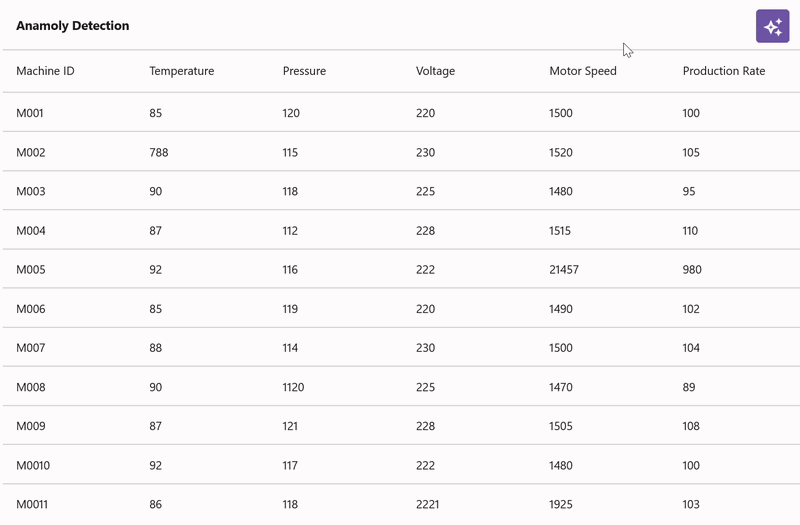

# AI-Driven Anomaly Detection in .NET MAUI DataGrid (SfDataGrid)

This document provides a comprehensive guide to implementing AI-driven anomaly detection with the Syncfusion [.NET MAUI DataGrid](https://help.syncfusion.com/cr/maui/Syncfusion.Maui.DataGrid.SfDataGrid.html). It demonstrates how to integrate Azure OpenAI services to analyze dataset patterns and automatically highlight anomalies in real-time.

## Integrating Azure OpenAI with the .NET MAUI app

### Step 1: Set up Azure OpenAI service

First, open [Visual Studio](https://visualstudio.microsoft.com/) and [create a new .NET MAUI app](https://learn.microsoft.com/en-us/dotnet/maui/get-started/first-app?view=net-maui-7.0&tabs=vswin&pivots=devices-android).

**Configure Azure OpenAI:**

1. Log in to the [Azure Portal](https://portal.azure.com/)
2. Create a new OpenAI resource (or use an existing one)
3. Deploy a **GPT-4o** model (or GPT-4 Turbo) for text analysis
4. Copy your deployment name, endpoint URL, and API key from the **Keys and Endpoint** section

**Install NuGet Package:**

Run the following command in the Package Manager Console or terminal:

```
dotnet add package Azure.AI.OpenAI --version 1.0.0-beta.12
```

Alternatively, use the NuGet Package Manager in Visual Studio to install the [Azure.AI.OpenAI](https://www.nuget.org/packages/Azure.AI.OpenAI/) package.

### Step 2: Create the Azure OpenAI service class

Create a helper class to manage communication with Azure OpenAI. **Important**: Store your API key securely using environment variables or Azure Key Vault, not hard coded strings.





using Azure;
using Azure.AI.OpenAI;
using System;
using System.Threading.Tasks;

internal class AzureOpenAIService
{
    // Use environment variables for sensitive data
    private const string endpoint = "https://{YOUR_RESOURCE_NAME}.openai.azure.com";
    private const string deploymentName = "gpt-4o"; // Your GPT-4o deployment name
    private readonly string apiKey;
    
    private OpenAIClient? client;
    private ChatCompletionsOptions? chatCompletions;
    
    internal AzureOpenAIService()
    {
        // Retrieve API key from environment variable for security
        apiKey = Environment.GetEnvironmentVariable("AZURE_OPENAI_KEY") 
            ?? throw new InvalidOperationException("AZURE_OPENAI_KEY environment variable not found");
        
        InitializeClient();
    }
    
    private void InitializeClient()
    {
        try
        {
            // Initialize the OpenAI client with Azure credentials
            this.client = new OpenAIClient(new Uri(endpoint), new AzureKeyCredential(apiKey));
            
            // Initialize chat completion options with deployment-specific settings
            this.chatCompletions = new ChatCompletionsOptions
            {
                DeploymentName = deploymentName,
                Temperature = 0.7f,
                MaxTokens = 2048
            };
        }
        catch (Exception ex)
        {
            throw new InvalidOperationException("Failed to initialize Azure OpenAI client. Ensure endpoint and credentials are correct.", ex);
        }
    }
    
    internal OpenAIClient? Client => this.client;
    internal ChatCompletionsOptions? ChatCompletions => this.chatCompletions;
}






**Configuration Requirements:**
- Replace `{YOUR_RESOURCE_NAME}` with your Azure OpenAI resource name
- Set `AZURE_OPENAI_KEY` environment variable with your API key (do not hard code credentials)
- Verify the deployment name matches your Azure OpenAI deployment

### Step 3: Implement the GetResultsFromAI method

Implement a method to retrieve responses from the Azure OpenAI API based on user prompts.





using Azure;
using Azure.AI.OpenAI;
using System;
using System.Threading.Tasks;

public async Task<string> GetResultsFromAI(string userPrompt)
{
    if (this.client == null || this.chatCompletions == null)
    {
        return "Error: Azure OpenAI service not properly initialized.";
    }

    try
    {
        // Clear previous messages to avoid accumulation across requests
        this.chatCompletions.Messages.Clear();
        
        // Add system message to set AI behavior for anomaly detection
        this.chatCompletions.Messages.Add(
            new ChatRequestSystemMessage("You are an anomaly detection assistant analyzing machine performance data. " +
                                        "Respond ONLY with valid JSON in the format: {\"anomalies\": [{\"rowIndex\": 0, \"isAnomaly\": true, \"reason\": \"description\"}]}"));
        
        // Add user's analysis request
        this.chatCompletions.Messages.Add(new ChatRequestUserMessage(userPrompt));
        
        // Call Azure OpenAI API
        var response = await this.client.GetChatCompletionsAsync(this.chatCompletions);
        
        if (response.Value?.Choices.Count > 0)
        {
            var content = response.Value.Choices[0].Message.Content;
            return content ?? "No response received from AI service.";
        }
        
        return "Error: Empty response from Azure OpenAI.";
    }
    catch (Azure.RequestFailedException ex) when (ex.Status == 401)
    {
        return "Error: Authentication failed. Check your API key and endpoint.";
    }
    catch (Azure.RequestFailedException ex) when (ex.Status == 429)
    {
        return "Error: Rate limit exceeded. Please wait and try again.";
    }
    catch (Exception ex)
    {
        return $"Error: {ex.Message}";
    }
}





**Error Handling Guide:**
- **401 Unauthorized**: Verify API key is correct and set in `AZURE_OPENAI_KEY` environment variable
- **429 Too Many Requests**: Implement exponential back off retry logic or wait before retrying
- **Timeout**: Increase `MaxTokens` or reduce dataset size if processing is slow
- **Malformed JSON**: Add validation to parse response and provide fallback behavior

## Integrating AI-driven anomaly detection in .NET MAUI DataGrid

To design an AI-powered anomaly detection UI using the `.NET MAUI DataGrid` control, you can style cells dynamically based on anomaly detection results and highlight outliers in real-time. Before proceeding, review the [.NET MAUI DataGrid getting started guide](https://www.syncfusion.com/maui-controls/maui-datagrid).

### Architecture Overview

The anomaly detection workflow:
1. **Data Layer**: `MachineDataRepository` provides machine performance metrics
2. **AI Analysis**: `AzureOpenAIService` sends data to OpenAI for anomaly detection
3. **Response Processing**: Parse JSON response and map anomalies to row indices
4. **Visualization**: `AnomalyDetectionConverter` highlights anomalous cells with background colors

### Data Models

Define the following models for machine performance data:





// Machine performance data model
public class MachineData
{
    public string MachineID { get; set; }
    public double Temperature { get; set; }
    public double Pressure { get; set; }
    public double Voltage { get; set; }
    public double MotorSpeed { get; set; }
    public double ProductionRate { get; set; }
    public string AnomalyDescription { get; set; } // Added by AI analysis
    public bool IsAnomaly { get; set; } // Set by anomaly detection
}

// Repository for machine data
public class MachineDataRepository
{
    public ObservableCollection<MachineData> MachineDataCollection { get; set; }
    
    public MachineDataRepository()
    {
        MachineDataCollection = new ObservableCollection<MachineData>
        {
            new MachineData { MachineID = "M001", Temperature = 45.2, Pressure = 100.5, Voltage = 220, MotorSpeed = 1500, ProductionRate = 95.5 },
            new MachineData { MachineID = "M002", Temperature = 42.1, Pressure = 101.2, Voltage = 219, MotorSpeed = 1510, ProductionRate = 96.2 },
            // Add more data
        };
    }
}





### Step 1: Create the DataGrid layout




<ContentPage   xmlns="http://schemas.microsoft.com/dotnet/2021/maui"
               xmlns:x="http://schemas.microsoft.com/winfx/2009/xaml"
               x:Class="SampleBrowser.Maui.SmartDemos.SmartDemos.AnomalyDetection"
               xmlns:syncfusion="clr-namespace:Syncfusion.Maui.DataGrid;assembly=Syncfusion.Maui.DataGrid">

    <ContentPage.BindingContext>
        <local:MachineDataRepository x:Name="viewModel" />
    </ContentPage.BindingContext>

    <ContentPage.Resources>
        <local:AnomalyDetectionConverter x:Key="converter" />
        <Style TargetType="syncfusion:DataGridCell">
            <Setter Property="Background"
                    Value="{Binding Source={RelativeSource Mode=Self}, Converter={StaticResource Key=converter}}" />
            <Setter Property="FontSize" Value="14" />
        </Style>
        <Style TargetType="syncfusion:DataGridHeaderCell">
            <Setter Property="FontFamily" Value="Roboto-Medium" />
            <Setter Property="FontSize" Value="14" />
        </Style>
    </ContentPage.Resources>

    <ContentPage.Content>
        <Grid>
            <Grid.RowDefinitions>
                <RowDefinition Height="56" />
                <RowDefinition Height="*" />
            </Grid.RowDefinitions>

            <Grid Grid.Row="0">
                <Grid.ColumnDefinitions>
                    <ColumnDefinition Width="Auto" />
                    <ColumnDefinition Width="*" />
                    <ColumnDefinition Width="Auto" />
                </Grid.ColumnDefinitions>
                <Label Text="Anomaly Detection"
                       VerticalTextAlignment="Center"
                       Padding="16,0,16,0"
                       FontSize="15"
                       Grid.Column="0"
                       FontAttributes="Bold" />

                <button:SfButton x:Name="button"
                                 Text="&#xe7e1;"
                                 FontFamily="MauiSampleFontIcon"
                                 Grid.Column="2"
                                 Margin="16,0,16,0"
                                 FontAutoScalingEnabled="True"
                                 FontSize="24"
                                 WidthRequest="40"
                                 HeightRequest="40"
                                 FontAttributes="Bold"
                                 CornerRadius="5"
                                 Clicked="OnAnalyzeAnomaliesClicked" />
            </Grid>

            <syncfusion:SfDataGrid x:Name="dataGrid"
                                   Grid.Row="1"
                                   HeaderRowHeight="52"
                                   HorizontalScrollBarVisibility="Always"
                                   VerticalScrollBarVisibility="Always"
                                   ColumnWidthMode="Fill"
                                   AutoGenerateColumnsMode="None"
                                   ItemsSource="{Binding MachineDataCollection}">
                <syncfusion:SfDataGrid.Columns>
                    <syncfusion:DataGridTextColumn HeaderText="Machine ID" MinimumWidth="120" MappingName="MachineID" />
                    <syncfusion:DataGridTextColumn HeaderText="Temperature" MinimumWidth="120" MappingName="Temperature" />
                    <syncfusion:DataGridTextColumn HeaderText="Pressure" MinimumWidth="120" MappingName="Pressure" />
                    <syncfusion:DataGridTextColumn HeaderText="Voltage" MinimumWidth="120" MappingName="Voltage" />
                    <syncfusion:DataGridTextColumn HeaderText="Motor Speed" MinimumWidth="120" MappingName="MotorSpeed" />
                    <syncfusion:DataGridTextColumn HeaderText="Production Rate" MinimumWidth="140" MappingName="ProductionRate" />
                </syncfusion:SfDataGrid.Columns>
            </syncfusion:SfDataGrid>

            <ActivityIndicator IsRunning="{Binding IsAnalyzing}" x:Name="Indicator" Grid.Row="1" VerticalOptions="Center" HorizontalOptions="Center" Color="Black" />
        </Grid>
    </ContentPage.Content>
</ContentPage>




### Step 2: Create the Anomaly Detection Converter

Create a value converter to dynamically change cell background colors based on anomaly status:





using Microsoft.Maui.Controls;
using System;

public class AnomalyDetectionConverter : IValueConverter
{
    private const string anomalyColor = "#FFB3B3"; // Light red for anomalies
    private const string normalColor = "#FFFFFF";  // White for normal data
    
    public object Convert(object value, Type targetType, object parameter, System.Globalization.CultureInfo culture)
    {
        // Check if the cell's data object is marked as an anomaly
        if (value is MachineData machineData)
        {
            return machineData.IsAnomaly ? Color.FromArgb(anomalyColor) : Color.FromArgb(normalColor);
        }
        
        return Color.FromArgb(normalColor);
    }

    public object ConvertBack(object value, Type targetType, object parameter, System.Globalization.CultureInfo culture)
    {
        throw new NotImplementedException();
    }
}





### Step 3: Implement the Anomaly Analysis Logic

Implement the code-behind logic to send data to Azure OpenAI, receive anomaly detection results, and update the DataGrid:





using Microsoft.Maui.Controls;
using System.Collections.ObjectModel;
using System.Text.Json;

public partial class AnomalyDetection : ContentPage
{
    private AzureOpenAIService openAIService;
    private MachineDataRepository repository;
    private bool isAnalyzing = false;
    
    public AnomalyDetection()
    {
        InitializeComponent();
        openAIService = new AzureOpenAIService();
        repository = (MachineDataRepository)this.BindingContext;
    }
    
    // Event handler for the Analyze button
    private async void OnAnalyzeAnomaliesClicked(object sender, EventArgs e)
    {
        if (isAnalyzing)
            return;
        
        await AnalyzeAnomaliesAsync();
    }
    
    private async Task AnalyzeAnomaliesAsync()
    {
        isAnalyzing = true;
        Indicator.IsRunning = true;
        
        try
        {
            if (repository?.MachineDataCollection == null || repository.MachineDataCollection.Count == 0)
            {
                await DisplayAlert("Error", "No data available to analyze", "OK");
                return;
            }
            
            // Serialize machine data for AI analysis
            var machineDataJson = JsonSerializer.Serialize(repository.MachineDataCollection);
            
            // Create the analysis prompt
            string analysisPrompt = $@"Analyze the following machine performance data for anomalies.
            Identify any unusual patterns or out-of-range values. Return ONLY valid JSON:
            {{{""anomalies"": [{{""index"": 0, ""isAnomaly"": true, ""reason"": ""Temperature exceeds normal range""}}]}}
            
            Data: {machineDataJson}";
            
            // Call Azure OpenAI service
            var analysisResult = await openAIService.GetResultsFromAI(analysisPrompt);
            
            if (string.IsNullOrWhiteSpace(analysisResult))
            {
                await DisplayAlert("Error", "No response from AI service", "OK");
                return;
            }
            
            // Parse JSON response
            try
            {
                // Remove markdown code blocks if present
                analysisResult = analysisResult.Replace("```json", "").Replace("```", "").Trim();
                
                using (JsonDocument doc = JsonDocument.Parse(analysisResult))
                {
                    var anomaliesArray = doc.RootElement.GetProperty("anomalies");
                    
                    // Reset all items first
                    foreach (var item in repository.MachineDataCollection)
                    {
                        item.IsAnomaly = false;
                        item.AnomalyDescription = string.Empty;
                    }
                    
                    // Mark anomalies based on AI response
                    foreach (var anomalyElement in anomaliesArray.EnumerateArray())
                    {
                        int index = anomalyElement.GetProperty("index").GetInt32();
                        bool isAnomaly = anomalyElement.GetProperty("isAnomaly").GetBoolean();
                        string reason = anomalyElement.GetProperty("reason").GetString();
                        
                        if (index >= 0 && index < repository.MachineDataCollection.Count)
                        {
                            repository.MachineDataCollection[index].IsAnomaly = isAnomaly;
                            repository.MachineDataCollection[index].AnomalyDescription = reason;
                        }
                    }
                }
                
                // Add anomaly description column if not already present
                if (!dataGrid.Columns.Any(c => c.MappingName == "AnomalyDescription"))
                {
                    var anomalyColumn = new DataGridTextColumn 
                    { 
                        HeaderText = "Anomaly Description",
                        MappingName = "AnomalyDescription",
                        ColumnWidthMode = ColumnWidthMode.Auto
                    };
                    dataGrid.Columns.Add(anomalyColumn);
                }
                
                // Refresh DataGrid to show updates
                dataGrid.RefreshRow(0, false);
                
                await DisplayAlert("Success", "Anomaly detection complete", "OK");
            }
            catch (JsonException ex)
            {
                await DisplayAlert("Parse Error", $"Failed to parse AI response: {ex.Message}", "OK");
            }
        }
        catch (Exception ex)
        {
            await DisplayAlert("Error", $"Analysis failed: {ex.Message}", "OK");
        }
        finally
        {
            isAnalyzing = false;
            Indicator.IsRunning = false;
        }
    }
}







You can find the complete sample from this [link](https://github.com/SyncfusionExamples/MAUI-DataGrid-Features/tree/master/AI%20Demos/AnamolyDetection).
