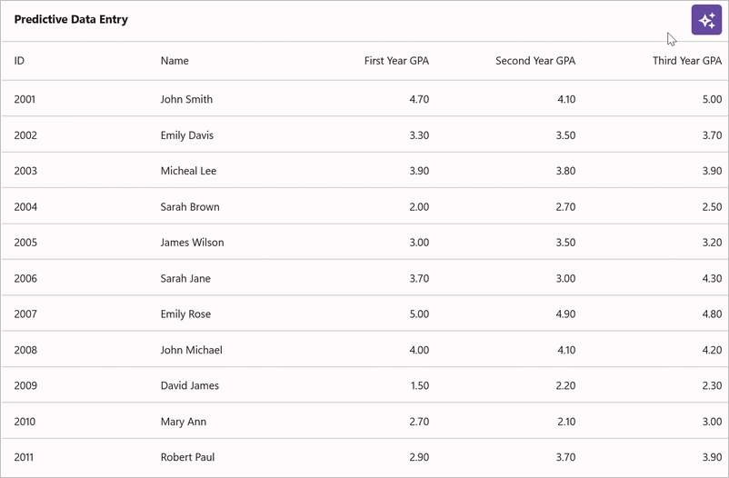

# AI-Driven Predictive Data Entry in .NET MAUI DataGrid (SfDataGrid)

This document explains how to implement AI-assisted predictive data entry with the Syncfusion [.NET MAUI DataGrid](https://help.syncfusion.com/cr/maui/Syncfusion.Maui.DataGrid.SfDataGrid.html). It demonstrates using Azure OpenAI to predict GPA and grade values based on historical student performance data.

## Integrating Azure OpenAI with the .NET MAUI app

### Step 1: Set up Azure OpenAI service

First, open [Visual Studio](https://visualstudio.microsoft.com/) and [create a new .NET MAUI app](https://learn.microsoft.com/en-us/dotnet/maui/get-started/first-app?view=net-maui-7.0&tabs=vswin&pivots=devices-android).

**Configure Azure OpenAI:**

1. Log in to the [Azure Portal](https://portal.azure.com/)
2. Create a new OpenAI resource (or use an existing one)
3. Deploy a **GPT-4o** model for text analysis
4. Copy your deployment name, endpoint URL, and API key from the **Keys and Endpoint** section

**Install NuGet Package:**

Run the following command in the Package Manager Console or terminal:

```
dotnet add package Azure.AI.OpenAI --version 1.0.0-beta.12
```

Alternatively, use the NuGet Package Manager in Visual Studio to install the [Azure.AI.OpenAI](https://www.nuget.org/packages/Azure.AI.OpenAI/) package.

### Step 1: Set up Azure OpenAI

To configure **Azure OpenAI**, we’ll use the **GPT-4O** model for text. Set up the `OpenAIClient` as shown in the following code example.





internal class AzureOpenAIService
{
    const string endpoint = "https://{YOUR_END_POINT}.openai.azure.com";
    const string deploymentName = "GPT-4O";
    const string imageDeploymentName = "DALL-E";
    string key = "API key";
    
    OpenAIClient? client;
    ChatCompletionsOptions? chatCompletions;
    
    internal AzureOpenAIService()
    {
        
    }
}





### Step 2: Create the Azure OpenAI service class

Create a helper class to manage communication with Azure OpenAI. **Important**: Store your API key securely using environment variables, not hard coded strings.





using Azure;
using Azure.AI.OpenAI;
using System;
using System.Threading.Tasks;

internal class AzureOpenAIService
{
    // Use environment variables for sensitive data
    private const string endpoint = "https://{YOUR_RESOURCE_NAME}.openai.azure.com";
    private const string deploymentName = "gpt-4o"; // Your GPT-4o deployment name
    private readonly string apiKey;
    
    private OpenAIClient? client;
    private ChatCompletionsOptions? chatCompletions;
    
    internal AzureOpenAIService()
    {
        // Retrieve API key from environment variable for security
        apiKey = Environment.GetEnvironmentVariable("AZURE_OPENAI_KEY") 
            ?? throw new InvalidOperationException("AZURE_OPENAI_KEY environment variable not found");
        
        InitializeClient();
    }
    
    private void InitializeClient()
    {
        try
        {
            // Initialize the OpenAI client with Azure credentials
            this.client = new OpenAIClient(new Uri(endpoint), new AzureKeyCredential(apiKey));
            
            // Initialize chat completion options with deployment-specific settings
            this.chatCompletions = new ChatCompletionsOptions
            {
                DeploymentName = deploymentName,
                Temperature = 0.7f,
                MaxTokens = 2048
            };
        }
        catch (Exception ex)
        {
            throw new InvalidOperationException("Failed to initialize Azure OpenAI client. Ensure endpoint and credentials are correct.", ex);
        }
    }
    
    internal OpenAIClient? Client => this.client;
    internal ChatCompletionsOptions? ChatCompletions => this.chatCompletions;
}





### Step 3: Implement the GetResultsFromAI method

Implement a method to retrieve predictions from the Azure OpenAI API.





using Azure;
using Azure.AI.OpenAI;
using System;
using System.Threading.Tasks;

public async Task<string> GetResultsFromAI(string userPrompt)
{
    if (this.client == null || this.chatCompletions == null)
    {
        return "Error: Azure OpenAI service not properly initialized.";
    }

    try
    {
        // Clear previous messages to avoid accumulation across requests
        this.chatCompletions.Messages.Clear();
        
        // Add system message to set AI behavior for predictions
        this.chatCompletions.Messages.Add(
            new ChatRequestSystemMessage("You are an academic prediction assistant. Analyze student GPA data and predict future performance. " +
                                        "Respond ONLY with valid JSON; do not include explanations or markdown."));
        
        // Add user's prediction request
        this.chatCompletions.Messages.Add(new ChatRequestUserMessage(userPrompt));
        
        // Call Azure OpenAI API
        var response = await this.client.GetChatCompletionsAsync(this.chatCompletions);
        
        if (response.Value?.Choices.Count > 0)
        {
            var content = response.Value.Choices[0].Message.Content;
            return content ?? "No response received from AI service.";
        }
        
        return "Error: Empty response from Azure OpenAI.";
    }
    catch (Azure.RequestFailedException ex) when (ex.Status == 401)
    {
        return "Error: Authentication failed. Check your API key and endpoint.";
    }
    catch (Azure.RequestFailedException ex) when (ex.Status == 429)
    {
        return "Error: Rate limit exceeded. Please wait and try again.";
    }
    catch (Exception ex)
    {
        return $"Error: {ex.Message}";
    }
}





## Integrating AI-driven predictive data entry in .NET MAUI DataGrid

To design an AI-powered predictive data entry experience using the [.NET MAUI DataGrid](https://www.syncfusion.com/maui-controls/maui-datagrid) control, you can leverage AI services to suggest or auto-fill values based on historical patterns and user input. This example demonstrates predicting final-year GPA and grades based on historical academic performance.

### Architecture Overview

The predictive data entry workflow:
1. **Data Layer**: `StudentRepository` provides student academic performance data
2. **AI Analysis**: `AzureOpenAIService` sends historical GPA data to OpenAI for prediction
3. **Response Processing**: Parse JSON response containing predicted GPA and grades
4. **UI Update**: Dynamically add predicted columns and populate data in the DataGrid

### Data Models

Define the following models for student academic data:





// Student performance data model
public class StudentData
{
    public string StudentID { get; set; }
    public string StudentName { get; set; }
    public double FirstYearGPA { get; set; }
    public double SecondYearGPA { get; set; }
    public double ThirdYearGPA { get; set; }
    public double FinalYearGPA { get; set; } // Predicted by AI
    public double TotalGPA { get; set; }     // Predicted CGPA
    public string TotalGrade { get; set; }   // Predicted Grade
    public bool IsPredicted { get; set; }    // Flag for styling predicted cells
}

// Student data repository
public class StudentRepository : INotifyPropertyChanged
{
    private ObservableCollection<StudentData> studentDataCollection;
    private bool isAnalyzing;
    
    public StudentRepository()
    {
        StudentDataCollection = new ObservableCollection<StudentData>
        {
            new StudentData { StudentID = "S001", StudentName = "John Smith", FirstYearGPA = 3.5, SecondYearGPA = 3.6, ThirdYearGPA = 3.7 },
            new StudentData { StudentID = "S002", StudentName = "Sarah Johnson", FirstYearGPA = 3.8, SecondYearGPA = 3.9, ThirdYearGPA = 4.0 },
            // Add more student records
        };
    }
    
    public ObservableCollection<StudentData> StudentDataCollection
    {
        get => studentDataCollection;
        set { studentDataCollection = value; OnPropertyChanged(); }
    }
    
    public bool IsAnalyzing
    {
        get => isAnalyzing;
        set { isAnalyzing = value; OnPropertyChanged(); }
    }
    
    public event PropertyChangedEventHandler PropertyChanged;
    protected void OnPropertyChanged([CallerMemberName] string name = "") 
        => PropertyChanged?.Invoke(this, new PropertyChangedEventArgs(name));
}





### Step 1: Create the DataGrid layout




<ContentPage xmlns="http://schemas.microsoft.com/dotnet/2021/maui"
             xmlns:x="http://schemas.microsoft.com/winfx/2009/xaml"
             x:Class="SampleBrowser.Maui.SmartDemos.SmartDemos.DataPrediction"
             xmlns:syncfusion="clr-namespace:Syncfusion.Maui.DataGrid;assembly=Syncfusion.Maui.DataGrid">

    <ContentPage.BindingContext>
        <local:StudentRepository x:Name="studentRepository" />
    </ContentPage.BindingContext>

    <ContentPage.Resources>
        <local:PredictionHighlightConverter x:Key="highlightConverter" />
        <Style TargetType="syncfusion:DataGridCell">
            <Setter Property="Background" Value="{Binding Source={RelativeSource Mode=Self}, Converter={StaticResource Key=highlightConverter}}" />
            <Setter Property="FontSize" Value="14" />
        </Style>
        <Style TargetType="syncfusion:DataGridHeaderCell">
            <Setter Property="FontFamily" Value="Roboto-Medium" />
            <Setter Property="FontSize" Value="14" />
        </Style>
    </ContentPage.Resources>

    <ContentPage.Content>
        <Grid>
            <Grid.RowDefinitions>
                <RowDefinition Height="56" />
                <RowDefinition Height="*" />
            </Grid.RowDefinitions>

            <Grid Grid.Row="0" >
                <Grid.ColumnDefinitions>
                    <ColumnDefinition Width="Auto" />
                    <ColumnDefinition Width="*" />
                    <ColumnDefinition Width="Auto" />
                </Grid.ColumnDefinitions>
                <Label Text="Predictive Data Entry" VerticalTextAlignment="Center" Padding="16,0,16,0" FontSize="15" Grid.Column="0" FontAttributes="Bold" />

                <button:SfButton x:Name="predictButton"
                                 Text="&#xe7e1;"
                                 FontFamily="MauiSampleFontIcon"
                                 Grid.Column="2"
                                 FontAutoScalingEnabled="True"
                                 FontSize="24"
                                 Margin="16,0,16,0"
                                 WidthRequest="40"
                                 HeightRequest="40"
                                 FontAttributes="Bold"
                                 CornerRadius="5"
                                 Clicked="OnPredictClicked" />
            </Grid>

            <syncfusion:SfDataGrid x:Name="dataGrid"
                                   Grid.Row="1"
                                   HeaderRowHeight="52"
                                   HorizontalScrollBarVisibility="Always"
                                   VerticalScrollBarVisibility="Always"
                                   ColumnWidthMode="Fill"
                                   AutoGenerateColumnsMode="None"
                                   ItemsSource="{Binding StudentDataCollection}">
                <syncfusion:SfDataGrid.Columns>
                    <syncfusion:DataGridTextColumn MinimumWidth="90" HeaderText="ID" MappingName="StudentID" />
                    <syncfusion:DataGridTextColumn MinimumWidth="130" HeaderText="Name" MappingName="StudentName" />
                    <syncfusion:DataGridNumericColumn MinimumWidth="125" HeaderText="First Year GPA" MappingName="FirstYearGPA" />
                    <syncfusion:DataGridNumericColumn MinimumWidth="145" HeaderText="Second Year GPA" MappingName="SecondYearGPA" />
                    <syncfusion:DataGridNumericColumn MinimumWidth="130" HeaderText="Third Year GPA" MappingName="ThirdYearGPA" />
                </syncfusion:SfDataGrid.Columns>
            </syncfusion:SfDataGrid>

            <ActivityIndicator IsRunning="{Binding IsAnalyzing}" x:Name="Indicator" Grid.Row="1" VerticalOptions="Center" HorizontalOptions="Center" />
        </Grid>
    </ContentPage.Content>
</ContentPage>




### Step 2: Create the Prediction Converter

Create an `IValueConverter` to highlight predicted values in the DataGrid:





using Microsoft.Maui.Controls;
using Microsoft.Maui.Graphics;
using System.Globalization;

public class PredictionHighlightConverter : IValueConverter
{
    public object Convert(object value, Type targetType, object parameter, CultureInfo culture)
    {
        if (value is StudentData student && student.IsPredicted)
        {
            return Color.FromArgb("#E3F2FD");
        }
        return Colors.White;
    }

    public object ConvertBack(object value, Type targetType, object parameter, CultureInfo culture)
    {
        return null;
    }
}





### Step 3: Implement the Prediction Logic

Implement the button click handler to trigger AI predictions and update the DataGrid dynamically:





using System.Collections.ObjectModel;
using System.Text.Json;
using Microsoft.Maui.Controls;

public partial class PredictiveDataEntryPage : ContentPage
{
    private AzureOpenAIService azureOpenAIService;
    
    public PredictiveDataEntryPage()
    {
        InitializeComponent();
        azureOpenAIService = new AzureOpenAIService();
    }

    private async void OnPredictClicked(object sender, EventArgs e)
    {
        await AnalyzePredictionsAsync();
    }

    private async Task AnalyzePredictionsAsync()
    {
        try
        {
            var repo = this.BindingContext as StudentRepository;
            if (repo?.StudentDataCollection == null || repo.StudentDataCollection.Count == 0)
            {
                await DisplayAlert("Error", "No student data available.", "OK");
                return;
            }

            repo.IsAnalyzing = true;

            // Serialize student data
            var studentJson = JsonSerializer.Serialize(repo.StudentDataCollection);

            // Build prediction prompt
            string gradeRules = "Grade Rules: 0-2.5=F, 2.6-2.9=C, 3.0-3.4=B, 3.5-3.9=B+, 4.0-4.4=A, 4.5-5.0=A+";
            string prompt = $@"Predict student grades based on GPA history.
Data: {studentJson}
{gradeRules}

Return JSON only:
{{ ""predictions"": [ {{ ""studentId"": ""string"", ""finalYearGPA"": number, ""totalGPA"": number, ""totalGrade"": ""string"" }} ] }}";

            // Call AI service
            var aiResponse = await azureOpenAIService.GetResultsFromAI(prompt);

            if (aiResponse.StartsWith("Error:"))
            {
                await DisplayAlert("Error", aiResponse, "OK");
                return;
            }

            await ApplyPredictions(aiResponse, repo);
            dataGrid.Refresh();
        }
        catch (Exception ex)
        {
            await DisplayAlert("Error", $"Prediction failed: {ex.Message}", "OK");
        }
        finally
        {
            if (this.BindingContext is StudentRepository repo)
                repo.IsAnalyzing = false;
        }
    }

    private async Task ApplyPredictions(string jsonResponse, StudentRepository repo)
    {
        try
        {
            string cleanJson = jsonResponse.Replace("```json", "").Replace("```", "").Trim();

            using (JsonDocument doc = JsonDocument.Parse(cleanJson))
            {
                var root = doc.RootElement;
                if (root.TryGetProperty("predictions", out JsonElement predictionsArray))
                {
                    foreach (var prediction in predictionsArray.EnumerateArray())
                    {
                        if (prediction.TryGetProperty("studentId", out JsonElement studentIdElem))
                        {
                            string studentId = studentIdElem.GetString();
                            var student = repo.StudentDataCollection.FirstOrDefault(s => s.StudentID == studentId);

                            if (student != null)
                            {
                                if (prediction.TryGetProperty("finalYearGPA", out JsonElement finalGpaElem))
                                    student.FinalYearGPA = finalGpaElem.GetDouble();
                                if (prediction.TryGetProperty("totalGPA", out JsonElement totalGpaElem))
                                    student.TotalGPA = totalGpaElem.GetDouble();
                                if (prediction.TryGetProperty("totalGrade", out JsonElement gradeElem))
                                    student.TotalGrade = gradeElem.GetString() ?? "N/A";
                                student.IsPredicted = true;
                            }
                        }
                    }
                }
            }

            // Add prediction columns
            if (!dataGrid.Columns.Any(c => c.MappingName == "FinalYearGPA"))
                dataGrid.Columns.Add(new DataGridNumericColumn { MappingName = "FinalYearGPA", HeaderText = "Final Year GPA (Predicted)" });
            if (!dataGrid.Columns.Any(c => c.MappingName == "TotalGPA"))
                dataGrid.Columns.Add(new DataGridNumericColumn { MappingName = "TotalGPA", HeaderText = "Total GPA (Predicted)" });
            if (!dataGrid.Columns.Any(c => c.MappingName == "TotalGrade"))
                dataGrid.Columns.Add(new DataGridTextColumn { MappingName = "TotalGrade", HeaderText = "Grade (Predicted)" });
        }
        catch (JsonException ex)
        {
            await DisplayAlert("JSON Error", $"Failed to parse response: {ex.Message}", "OK");
        }
    }
}







You can find the complete sample from this [link](https://github.com/SyncfusionExamples/MAUI-DataGrid-Features/tree/master/AI%20Demos/PredictiveDataEntry).
