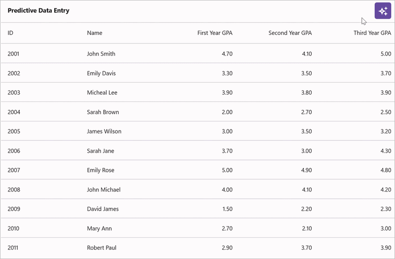

# AI-Driven Predictive Data Entry in .NET MAUI Data Grid

This document explains how to implement AI-assisted predictive data entry with the Syncfusion [.NET MAUI Data Grid](https://help.syncfusion.com/cr/maui/Syncfusion.Maui.DataGrid.SfDataGrid.html). It demonstrates using Azure OpenAI to predict GPA and grade values based on historical student performance data.

## Integrating AI-Driven Predictive Data Entry in .NET MAUI Data Grid

After completing the Azure OpenAI setup above, use the [.NET MAUI Data Grid](https://www.syncfusion.com/maui-controls/maui-datagrid) control to display student data and enable AI-powered predictions. This section demonstrates how to leverage AI services to automatically predict and populate values based on historical patterns and existing student data.

Before proceeding, review the [.NET MAUI Data Grid getting started guide](https://www.syncfusion.com/maui-controls/maui-datagrid).

### Step 1: Create the DataGrid Layout




<ContentPage xmlns="http://schemas.microsoft.com/dotnet/2021/maui"
             xmlns:x="http://schemas.microsoft.com/winfx/2009/xaml"
             x:Class="SampleBrowser.Maui.SmartDemos.SmartDemos.DataPrediction"
             xmlns:syncfusion="clr-namespace:Syncfusion.Maui.DataGrid;assembly=Syncfusion.Maui.DataGrid">

    <ContentPage.BindingContext>
        <local:GenerateDataCollection x:Name="generateDataCollection" />
    </ContentPage.BindingContext>

    <ContentPage.Resources>
        <local:DataPredictionConverter x:Key="converter" />
        <Style TargetType="syncfusion:DataGridCell">
            <Setter Property="Background" Value="{Binding Source={RelativeSource Mode=Self}, Converter={StaticResource Key=converter}}" />
            <Setter Property="FontSize" Value="14" />
        </Style>
        <Style TargetType="syncfusion:DataGridHeaderCell">
            <Setter Property="FontFamily" Value="Roboto-Medium" />
            <Setter Property="FontSize" Value="14" />
        </Style>
    </ContentPage.Resources>

    <ContentPage.Content>
        <Grid>
            <Grid.RowDefinitions>
                <RowDefinition Height="56" />
                <RowDefinition Height="*" />
            </Grid.RowDefinitions>

            <Grid Grid.Row="0" >
                <Grid.ColumnDefinitions>
                    <ColumnDefinition Width="Auto" />
                    <ColumnDefinition Width="*" />
                    <ColumnDefinition Width="Auto" />
                </Grid.ColumnDefinitions>
                <Label Text="Predictive Data Entry" VerticalTextAlignment="Center" Padding="16,0,16,0" FontSize="15" Grid.Column="0" FontAttributes="Bold" />

                <button:SfButton x:Name="button"
                                 Text="&#xe7e1;"
                                 FontFamily="MauiSampleFontIcon"
                                 Grid.Column="2"
                                 FontAutoScalingEnabled="True"
                                 FontSize="24"
                                 Margin="16,0,16,0"
                                 WidthRequest="40"
                                 HeightRequest="40"
                                 FontAttributes="Bold"
                                 CornerRadius="5" />
            </Grid>

            <syncfusion:SfDataGrid x:Name="dataGrid"
                                   Grid.Row="1"
                                   HeaderRowHeight="52"
                                   HorizontalScrollBarVisibility="Always"
                                   VerticalScrollBarVisibility="Always"
                                   ColumnWidthMode="Fill"
                                   AutoGenerateColumnsMode="None"
                                   ItemsSource="{Binding Predictivedatas}">
                <syncfusion:SfDataGrid.Columns>
                    <syncfusion:DataGridTextColumn MinimumWidth="90" HeaderText="ID" MappingName="StudentID" />
                    <syncfusion:DataGridTextColumn MinimumWidth="130" HeaderText="Name" MappingName="StudentName" />
                    <syncfusion:DataGridNumericColumn MinimumWidth="125" HeaderText="First Year GPA" MappingName="FirstYearGPA" />
                    <syncfusion:DataGridNumericColumn MinimumWidth="145" HeaderText="Second Year GPA" MappingName="SecondYearGPA" />
                    <syncfusion:DataGridNumericColumn MinimumWidth="130" HeaderText="Third Year GPA" MappingName="ThirdYearGPA" />
                </syncfusion:SfDataGrid.Columns>
            </syncfusion:SfDataGrid>

            <ActivityIndicator IsRunning="False" x:Name="Indicator" Grid.Row="1" VerticalOptions="Center" HorizontalOptions="Center" />
        </Grid>
    </ContentPage.Content>
</ContentPage>




### Step 2: Enable AI-Powered .NET MAUI Data Grid

Create a method to send student data to Azure OpenAI for prediction. The AI service analyzes historical GPA data and returns predictions for Final Year GPA, CGPA, and Total Grade. After deserializing the JSON response, add these new columns to the DataGrid and populate each row with the predicted values.

**Note:** The helper methods `GetSerializedGridReport()`, `ValidateAndGeneratePrompt()`, and `DeserializeResult()` are assumed to be implemented in your ViewModel or code-behind to handle data serialization and JSON parsing.





private async Task GetResponseAsync()
{
    try
    {
        string prompt =
            "Final year GPA column should be updated based on GPA of FirstYearGPA, SecondYearGPA and ThirdYearGPA columns. " +
            "Total GPA (CGPA) should be updated based on the average of all years GPA. " +
            "Total Grade should be updated based on total GPA. " +
            "Updated grade rules: 0 - 2.5 = F, 2.6 - 2.9 = C, 3.0 - 3.4 = B, 3.5 - 3.9 = B+, 4.0 - 4.4 = A, 4.5 - 5 = A+. " +
            "Average value decimals should not exceed 1 digit. " +
            "Return JSON ONLY, no explanation. " +
            "Schema: { \"GenerateDataSource\": [ { \"StudentID\": \"string\", \"FinalYearGPA\": number, \"TotalGPA\": number, \"TotalGrade\": \"string\" } ] }. " +
            "Remove ```json and ``` if they are present.";

        var repo = (this.datagrid.BindingContext as GenerateDataCollection);
        if (repo == null || repo.Predictivedatas == null || repo.Predictivedatas.Count == 0)
            return;

        GenerateGridReport gridReport = new GenerateGridReport()
        {
            GenerateDataSource = repo.Predictivedatas
        };

        var gridReportJson = GetSerializedGridReport(gridReport);
        string userInput = ValidateAndGeneratePrompt(gridReportJson, prompt);

        var result = await openAi.GetResponseFromOpenAI(userInput);

        result = result.Replace("```json", "").Replace("```", "").Trim();

        GenerateGridReport deserializeResult = DeserializeResult(result);

        if (deserializeResult?.GenerateDataSource != null && gridReport.GenerateDataSource != null)
        {
            foreach (var item in gridReport.GenerateDataSource)
            {
                if (item != null)
                {
                    if (item.StudentID == gridReport.GenerateDataSource[index].StudentID)
                    {
                        if (deserializeResult != null && deserializeResult.GenerateDataSource != null)
                        {
                            gridReport.GenerateDataSource[index].FinalYearGPA = deserializeResult.GenerateDataSource[index].FinalYearGPA;
                            gridReport.GenerateDataSource[index].TotalGrade = deserializeResult.GenerateDataSource[index].TotalGrade;
                            gridReport.GenerateDataSource[index].TotalGPA = deserializeResult.GenerateDataSource[index].TotalGPA;
                        }
                    }
               }   
            }
        } 

        this.datagrid.Refresh();
    }
    finally
    {
        this.activityIndicator.IsRunning = false;
        isButtonClicked = false;
    }
}








You can find the complete sample from this [link](https://github.com/SyncfusionExamples/MAUI-DataGrid-Features/tree/master/AI%20Demos/PredictiveDataEntry).
