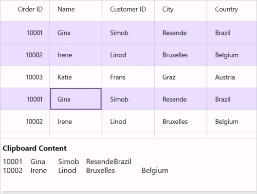
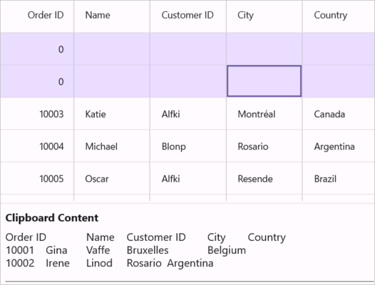
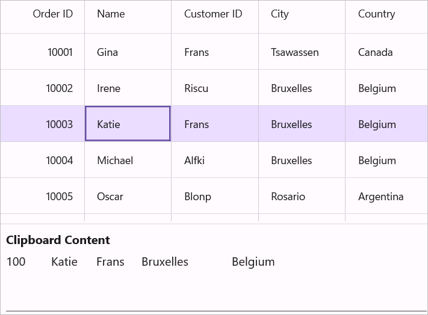
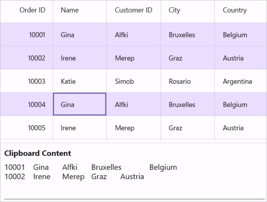

# Clipboard Operations in Maui DataGrid (SfDataGrid)

The [SfDataGrid](https://help.syncfusion.com/cr/maui/Syncfusion.Maui.DataGrid.html) provide support for the clipboard operations such as cut, copy and paste the data within control and between other applications such as Notepad, Excel. Clipboard operations for copy and paste are enabled by default.. You can copy selected records/cells from SfDataGrid by pressing <kbd>Ctrl+C</kbd> and also can paste the content from [Clipboard](https://learn.microsoft.com/en-us/dotnet/api/system.windows.clipboard?view=windowsdesktop-7.0&viewFallbackFrom=net-5.0) to SfDataGrid by pressing <kbd>Ctrl+V</kbd>.

N> Clipboard operations are not supported for the summary rows, add new row and unbound rows.To enable cut operations, the properties should be nullable and must implement INotifyPropertyChanged to ensure the user interface updates correctly when changes occur.

## Copy to Clipboard in DataGrid

Copy operations work based on the `CopyOption` property. 

`CopyOption` provides the following options:

* None – Disables copy in SfDataGrid.

* CopyData – Enables copy in SfDataGrid.

* IncludeHeaders – Column header is also copied along with data.
 
* IncludeFormat – Copies the display text with format instead of actual value.
 
* IncludeHiddenColumn – Hidden column are also copied to clipboard.
 
You need to use `IncludeHeaders`, `IncludeFormat`, `IncludeHiddenColumn` options along with `CopyData` option.



<syncfusion:SfDataGrid x:Name="dataGrid"
                       SelectionUnit="Row"
                       SelectionMode="Single"
                       AllowEditing="True"
                       CopyOption="CopyData,IncludeHeaders" 
                       ItemsSource="{Binding Orders}"/>


this.dataGrid.CopyOption = DataGridCopyOption.CopyData | DataGridCopyOption.IncludeHeaders;



N> `IncludeHiddenColumn` is not supported when `SelectionUnit` is [Cell](https://help.syncfusion.com/cr/maui/Syncfusion.Maui.DataGrid.DataGridSelectionUnit.html#Syncfusion_Maui_DataGrid_DataGridSelectionUnit_Cell).

## Paste from Clipboard in DataGrid

Paste operations work based on the `PasteOption` property. 

`PasteOption` provides the following options,

* None – Disables paste in SfDataGrid.

* PasteData – Enables paste in SfDataGrid. When an incompatible value is pasted into a record/cell, the pasting operation is skipped for that particular record/cell.

* ExcludeFirstLine – This can be used when pasting data copied with the `IncludeHeader` copy option.
 
* IncludeHiddenColumn – Paste values into hidden columns as well.

You need to use `ExcludeFirstLine`, `IncludeHiddenColumn` options along with the `PasteData` option.



<syncfusion:SfDataGrid x:Name="dataGrid"
                       SelectionUnit="Row"
                       SelectionMode="Single"
                       PasteOption="PasteData,ExcludeFirstLine" 
                       ItemsSource="{Binding Orders}"/>


this.dataGrid.PasteOption = DataGridPasteOption.PasteData | DataGridPasteOption.ExcludeFirstLine;



N>To enable pasting within the DataGrid, the AllowEditing property must be set to true.

## Cut to Clipboard in DataGrid

Cut operations work based on the `CopyOption` property.The cut operation works only when the `AllowEditing` property is set to true.

`CopyOption` provides the following options,

* None – Disables cut in SfDataGrid.

* CutData – Enables cut in SfDataGrid.

* IncludeHeaders – Column header is also copied along with data.
 
* IncludeFormat – Cuts the display text with format instead of actual value.
 
* IncludeHiddenColumn – Hidden columns are also cut to clipboard.
 
You need to use `IncludeHeaders`, `IncludeFormat`, `IncludeHiddenColumn` options along with the `CutData` option.



<syncfusion:SfDataGrid x:Name="dataGrid"
                       SelectionUnit="Row"
                       SelectionMode="Single"
                       AllowEditing="True"
                       CopyOption="CutData,IncludeHeaders" 
                       ItemsSource="{Binding Orders}"/>


this.dataGrid.CopyOption = DataGridCopyOption.CutData | DataGridCopyOption.IncludeHeaders;



N> `IncludeHiddenColumn` is not supported when `SelectionUnit` is [Cell](https://help.syncfusion.com/cr/maui/Syncfusion.Maui.DataGrid.DataGridSelectionUnit.html#Syncfusion_Maui_DataGrid_DataGridSelectionUnit_Cell).For unbound columns, cut operations won't work, but the data can still be copied to the clipboard.

## Events

### CopyContent

The `CopyContent` event occurs when copying or cutting cells in SfDataGrid.`DataGridCopyPasteEventArgs` provides information for the `CopyContent` event. You can cancel the copy operation by handling this event.



this.dataGrid.CopyContent += dataGrid_CopyContent;

void dataGrid_CopyContent(object sender, DataGridCopyPasteEventArgs e)
{
    if (((sender as SfDataGrid).SelectedRow as OrderInfo).OrderID == 1004)
        e.Handled = true;
}




### PasteContent

The `PasteContent` event occurs when paste the clipboard value into SfDataGrid.`DataGridCopyPasteEventArgs` provides information for the `PasteContent` event. You can cancel the paste operation by handling this event.



this.dataGrid.PasteContent += dataGrid_PasteContent;

void dataGrid_PasteContent(object sender, DataGridCopyPasteEventArgs e)
{
    if (((sender as SfDataGrid).SelectedRow as OrderInfo).OrderID == 1010)
    {
        e.Handled = true;
    }
}




### CopyCellContent

The `CopyCellContent` event occurs when a cell is being copied or cut. `DataGridCopyPasteCellEventArgs` provides information for the `CopyCellContent` event, which has following members:

* ClipBoardValue – Returns cell value.

* Column – Returns corresponding DataGridColumn of a cell.

* RowData – Returns corresponding RowData of a cell.

You can change the text copied to the clipboard by changing the `ClipBoardValue`.
 


this.dataGrid.CopyCellContent += dataGrid_CopyCellContent;

void dataGrid_CopyCellContent(object sender, DataGridCopyPasteCellEventArgs e)
{
}



The example below changes the clipboard value to 100 instead of the cell value 10003 in SfDataGrid:



void dataGrid_CopyCellContent(object sender, DataGridCopyPasteCellEventArgs e)
{
    if (e.Column.MappingName == "OrderID" && (e.RowData as OrderInfo).OrderID == 10003)
        e.ClipBoardValue = 100;
}



The example below handles the copy operation when the `MappingName` of a Column is Country:



void dataGrid_CopyCellContent(object sender, DataGridCopyPasteCellEventArgs e)
{
    if (e.Column.MappingName == "Country")
        e.Handled = true;
}



### PasteCellContent

The `PasteCellContent` event occurs when pasting clipboard content to a specific cell. `DataGridCopyPasteCellEventArgs` provides information for the `PasteCellContent`  event, which has the following members:

* ClipBoardValue – Returns clipboard value of a particular cell.

* Column – Returns corresponding DataGridColumn of a cell.

* RowData – Returns corresponding RowData of a cell.

You can change the text pasted to SfDataGrid by changing the `ClipBoardValue`.



this.dataGrid.PasteCellContent += dataGrid_PasteCellContent;

void dataGrid_PasteCellContent(object sender, DataGridCopyPasteCellEventArgs e)
{
}



The example below changes the clipboard value to "Test" instead of the clipboard value "BOLID":



void dataGrid_PasteCellContent(object sender, DataGridCopyPasteCellEventArgs e)
{
    if (e.Column.MappingName == "CustomerID" && (e.RowData as OrderInfo).CustomerID == "Welli")
        e.ClipBoardValue = "Test";
}



The example below handles the paste operation when the MappingName of a Column is "OrderID":



void dataGrid_DataGridPasteCellContent(object sender, DataGridCopyPasteCellEventArgs e)
{
    if (e.Column.MappingName == "OrderID")
        e.Handled = true;
}



## Handling Programmatically

### Programmatically Copy to Clipboard in Maui DataGrid

Copy the selected records/cells in SfDataGrid by using the Copy method in CopyPasteController of SfDataGrid.



this.dataGrid.CopyPasteController.Copy();



To copy a specific record, select it using the `MoveCurrentCellTo` method and then call the `Copy` method in `CopyPasteController`:



RowColumnIndex rowColumnIndex = new RowColumnIndex();
var lastSelectedIndex = dataGrid.CurrentCellManager.RowColumnIndex.RowIndex;
rowColumnIndex.RowIndex = 2;
rowColumnIndex.ColumnIndex = 2;
this.dataGrid.MoveCurrentCellTo(rowColumnIndex);
this.dataGrid.CopyPasteController.Copy();



To copy multiple cells, select a group of cells using the `SelectCells` method and then call the `Copy` method in `CopyPasteController`:



this.dataGrid.SelectCells(this.dataGrid.GetRowGenerator().Items[2].RowData, this.dataGrid.Columns[1], this.dataGrid.GetRowGenerator().Items[5].RowData, this.dataGrid.Columns[3]);
this.dataGrid.CopyPasteController.Copy();



### Copy rows without selecting in Maui DataGrid

You can copy records without selection by using the `CopyRowsToClipboard` method in `CopyPasteController` of SfDataGrid:
 


this.dataGrid.CopyPasteController.CopyRowsToClipboard(2, 4);



### Programmatically Cut Data to Clipboard in Maui DataGrid

To cut the selected records/cells in SfDataGrid, use the Cut method in `CopyPasteController`:



this.dataGrid.CopyPasteController.Cut();



To cut the entire record set, select the whole SfDataGrid using the `SelectAll` method and then call the `Cut` method in `CopyPasteController`:



this.dataGrid.SelectAll();
this.dataGrid.CopyPasteController.Cut();



### Programmatically Paste in DataGrid   

To paste clipboard values into SfDataGrid, use the `Paste` method in `CopyPasteController`:



this.dataGrid.CopyPasteController.Paste();



To paste clipboard values into a specific record, select the record using the `MoveCurrentCellTo` method and then call the `Paste` method in `CopyPasteController`:



RowColumnIndex rowColumnIndex = new RowColumnIndex();
rowColumnIndex.RowIndex = 1;
rowColumnIndex.ColumnIndex = 1;
this.dataGrid.MoveCurrentCellTo(rowColumnIndex);
this.dataGrid.CopyPasteController.Paste();



## Customizing Copy Paste Behavior in Maui DataGrid

The SfDataGrid processes clipboard operations in the `DataGridCopyPasteController` class. You can customize the default copy-paste behaviors by overriding the `DataGridCopyPasteController` class and setting it to `SfDataGrid.CopyPasteController`.



public class CustomCopyPaste : DataGridCopyPasteController
{
    public CustomCopyPaste(SfDataGrid sfGrid) : base(sfGrid)
    {        
    }
}





public MainWindow()
{
    InitializeComponent();
    this.dataGrid.CopyPasteController = new CustomCopyPaste(this.dataGrid);
}



### Paste a cell into many cells in Maui DataGrid

By default, you can copy one cell and paste it into another cell when Cell Selection is enabled in SfDataGrid. The code below shows how to copy one cell and paste it into all selected cells by overriding the `OnPasteToCell` method in the `DataGridCopyPasteController` class:



public class CustomCopyPaste : DataGridCopyPasteController
{

    public CustomCopyPaste(SfDataGrid dataGrid) : base(dataGrid)
    {
    }

    protected override async void OnPasteToCell(object record, DataGridColumn column, object value)
    {
        var text = Clipboard.GetTextAsync();
        
        string[] clipBoardText = Regex.Split(text.ToString(), @"\r\n");
        
        clipBoardText = Regex.Split(clipBoardText[0], @"\t");

        // If the clipboard contains multiple cells, use the base implementation.

        if (clipBoardText.Length > 1)
        {
            base.OnPasteToCell(record, column, value);
        }
        
        // Paste the value to all selected cells
        var selectedCells = this.dataGrid.GetSelectedCells();
        int selectedCellsCount = selectedCells.Count;
        
        for (int i = 0; i < selectedCellsCount; i++)
        {
            record = selectedCells[i].RowData;
            
            column = selectedCells[i].Column;

            // Paste the value to each selected cell

            if (record != null && column != null)
                base.OnPasteToCell(record, column, value);
        }
    }
}



### Paste a record into many rows in Maui DataGrid

By default, you can copy one row and paste it into another row when row selection is enabled in SfDataGrid. The code below shows how to copy one row and paste it into all selected rows by overriding the `OnPasteToRow` method in the `DataGridCopyPasteController` class:



public class CustomCopyPaste : DataGridCopyPasteController
{

    public CustomCopyPaste(SfDataGrid dataGrid) : base(dataGrid)
    {
    }

    protected override async void OnPasteToRow(object clipBoardContent, object selectedRecords)
    {
        var text = Clipboard.GetTextAsync();
        string[] clipBoardText = Regex.Split(text.ToString(), @"\r\n");

        // If the clipboard contains multiple rows, use the base implementation

        if (clipBoardText.Length > 1)
        {
            base.OnPasteToRow(clipBoardContent, selectedRecords);
            return;
        }

        // Paste the content to all selected rows
        var selectedRecord = this.dataGrid.SelectedRows;    
        for (int i = 0; i < selectedRecord.Count; i++)
        {
            selectedRecords = selectedRecord[i];
            base.OnPasteToRow(clipBoardContent, selectedRecords);
        }
    }
}



### Select pasted records in Maui DataGrid

By default, after pasting clipboard values to SfDataGrid, the selection remains on the previously selected records. The code below shows how to select the pasted records after the paste operation by overriding the `OnPasteToRows` and `OnPasteToRow` methods in the `DataGridCopyPasteController` class. This code is applicable when SelectionUnit is [Row](https://help.syncfusion.com/cr/maui/Syncfusion.Maui.DataGrid.DataGridSelectionUnit.html#Syncfusion_Maui_DataGrid_DataGridSelectionUnit_Row).



public class CustomCopyPaste : DataGridCopyPasteController
{

    public CustomCopyPaste(SfDataGrid dataGrid) : base(dataGrid)
    {
    }

    //Creating the new list for add the selected records
    public List<object> selectedItem = new List<object>();

    protected override void OnPasteToRows(object clipBoardRows)
    {
        base.OnPasteToRows(clipBoardRows);
        
        //Using the SelectionController apply the selection for Pasted records
        (this.dataGrid.SelectionController as DataGridRowSelectionController)?.HandleGridOperation(new GridOperationHandlerArgs(GridOperation.Paste, selectedItem));
    }

    protected override void OnPasteToRow(object clipBoardContent, object selectedRecords)
    {

        //Added the selected record to list
        selectedItem.Add(selectedRecords);    
        base.OnPasteToRow(clipBoardContent, selectedRecords);
    }
}



### Create new records while pasting in Maui DataGrid

By default, when pasting clipboard values to SfDataGrid, it changes the values of existing records. The code example below shows how to add the copied records as new rows in SfDataGrid by overriding the `OnPasteToRows` method in the `DataGridCopyPasteController` class:



public class CustomCopyPaste : DataGridCopyPasteController
{

    public CustomCopyPaste(SfDataGrid dataGrid)
        : base(dataGrid)
    {
    }
        
    protected override void OnPasteToRows(object clipBoardRows)
    {
        var copiedRecords = clipBoardRows as string[];
        if (copiedRecords == null || copiedRecords.Length == 0)
            return;

        // Get the data context to add new records
        var viewModel = this.dataGrid.BindingContext as OrderInfoRepository;
        if (viewModel == null)
            return;
            
        // Create new records based on the clipboard content
        for (int i = 0; i < copiedRecords.Length; i++)
        {
            // Create a new instance for the data model
            OrderInfo newEntity = new OrderInfo();
            
            // Parse values from the current clipboard row
            string[] values = Regex.Split(copiedRecords[i], @"\t");
            
            // Apply clipboard values to each column of the new record
            for (int j = 0; j < Math.Min(this.dataGrid.Columns.Count, values.Length); j++)
            {
                this.OnPasteToCell(newEntity, this.dataGrid.Columns[j], values[j]);
            }

            // Add the new record to the collection
            viewModel.OrderInfoCollection.Add(newEntity);
        }
    }

}



