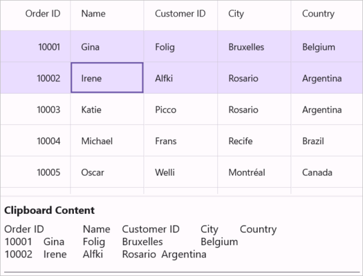
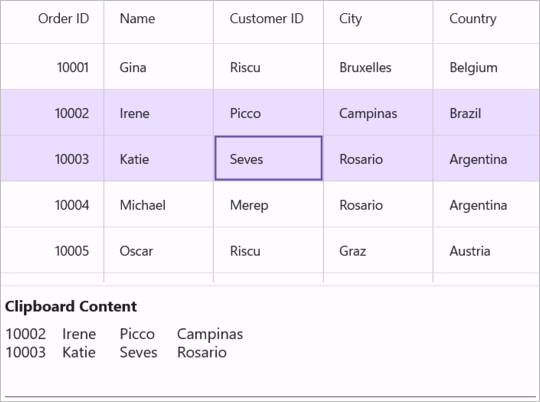
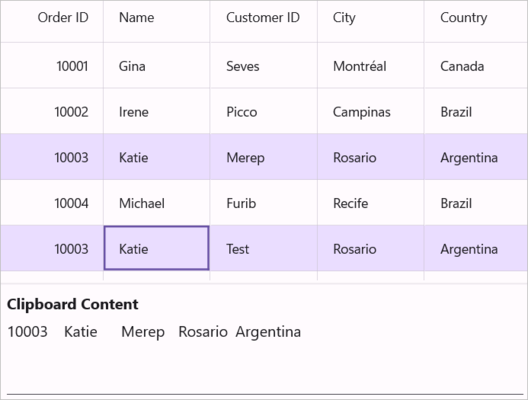

# Clipboard Operations in Maui DataGrid (SfDataGrid)

The MAUI [DataGrid](https://help.syncfusion.com/cr/maui/Syncfusion.Maui.DataGrid.html) provide support for the clipboard operations such as cut, copy and paste the data within control and between other applications such as Notepad, Excel. Clipboard operations copy and paste is enabled by default. You can copy selected records/cells from SfDataGrid by pressing <kbd>Ctrl+C</kbd> and also can paste the content from [Clipboard](https://learn.microsoft.com/en-us/dotnet/api/system.windows.clipboard?view=windowsdesktop-7.0&viewFallbackFrom=net-5.0) to SfDataGrid by pressing <kbd>Ctrl+V</kbd>.

N> Clipboard operations is not supported for the summary rows, add new row and unbound rows.

## Copy to Clipboard in DataGrid

Copy operation works based on `CopyOption` property. 

`CopyOption` provides the following options,

* None – Disables copy in SfDataGrid.

* CopyData – Enables copy in SfDataGrid.

* IncludeHeaders – Column header also copied along with data.
 
* IncludeFormat – Copies the display text with format instead of actual value.
 
* IncludeHiddenColumn – Hidden column also copied to clipboard.
 
You have to use `IncludeHeaders`, `IncludeFormat`, `IncludeHiddenColumn` options along with `CopyData` option.



<syncfusion:SfDataGrid x:Name="dataGrid"
                       SelectionUnit="Row"
                       SelectionMode="Single"
                       AllowEditing="True"
                       CopyOption="CopyData,IncludeHeaders" 
                       ItemsSource="{Binding Orders}"/>


this.dataGrid.CopyOption = DataGridCopyOption.CopyData | DataGridCopyOption.IncludeHeaders;



N> `IncludeHiddenColumn` is not supported when `SelectionUnit` is [Cell](https://help.syncfusion.com/cr/maui/Syncfusion.Maui.DataGrid.DataGridSelectionUnit.html#Syncfusion_Maui_DataGrid_DataGridSelectionUnit_Cell).

## Paste from Clipboard in DataGrid

Paste operation works based on `PasteOption` property. 

`PasteOption` provides the following options,

* None – Disable paste in SfDataGrid.

* PasteData – Enabled paste in SfDataGrid and when an incompatible value is pasted into a record/cell, the pasting operation is skipped for that particular record/cell.

* ExcludeFirstLine – This can be used when pasting data copied with `IncludeHeader` copy option.
 
* IncludeHiddenColumn – Paste the values in hidden columns also.

You have to use `ExcludeFirstLine`, `IncludeHiddenColumn` options along with `PasteData` option.



<syncfusion:SfDataGrid x:Name="dataGrid"
                       SelectionUnit="Row"
                       SelectionMode="Single"
                       PasteOption="PasteData,ExcludeFirstLine" 
                       ItemsSource="{Binding Orders}"/>


this.dataGrid.PasteOption = DataGridPasteOption.PasteData | DataGridPasteOption.ExcludeFirstLine;



N>To enable pasting within the DataGrid, the AllowEditing property must be set to true.

## Cut to Clipboard in DataGrid

Cut operation works based on `CopyOption` property.The cut operation works only when the `AllowEditing` property is set to true.

`CopyOption` provides the following options,

* None – Disables cut in SfDataGrid.

* CutData – Enabled cut in SfDataGrid.

* IncludeHeaders – Column header also copied along with data.
 
* IncludeFormat – Cut the display text with format instead of actual value.
 
* IncludeHiddenColumn – Hidden column also cut to clipboard.
 
You have to use `IncludeHeaders`, `IncludeFormat`, `IncludeHiddenColumn` options along with `CutData` option.



<syncfusion:SfDataGrid x:Name="dataGrid"
                       SelectionUnit="Row"
                       SelectionMode="Single"
                       AllowEditing="True"
                       CopyOption="CutData,IncludeHeaders" 
                       ItemsSource="{Binding Orders}"/>


this.dataGrid.CopyOption = DataGridCopyOption.CutData | DataGridCopyOption.IncludeHeaders;



N> `IncludeHiddenColumn` is not supported when `SelectionUnit` is [Cell](https://help.syncfusion.com/cr/maui/Syncfusion.Maui.DataGrid.DataGridSelectionUnit.html#Syncfusion_Maui_DataGrid_DataGridSelectionUnit_Cell).For unbound columns, cut operations won't work, but the data can still be copied to the clipboard.

## Events

### CopyContent

CopyContent event occurs when copy/cut the cells in SfDataGrid.DataGridCopyPasteEventArgs provides information for `CopyContent` event. You can cancel copy operation by handling this event.



this.dataGrid.CopyContent += dataGrid_DataGridCopyContent;

void dataGrid_DataGridCopyContent(object sender, DataGridCopyPasteEventArgs e)
{
    if (((sender as SfDataGrid).SelectedRow as OrderInfo).OrderID == 1004)
        e.Handled = true;
}




### PasteContent

PasteContent event occurs when paste the clipboard value into SfDataGrid.DataGridCopyPasteEventArgs provides information for `PasteContent` event. You can cancel paste operation by handling this event.



this.dataGrid.PasteContent += dataGrid_DataGridPasteContent;

void dataGrid_DataGridPasteContent(object sender, DataGridCopyPasteEventArgs e)
{
    if (((sender as SfDataGrid).SelectedRow as OrderInfo).OrderID == 1010)
    {
        e.Handled = true;
    }
}




### CopyCellContent

CopyCellContent event occurs when cell being copy/cut. DataGridCopyPasteCellEventArgs provides information for `CopyCellContent` event, which has following members,

* ClipBoardValue – Returns cell value.

* Column – Returns corresponding DataGridColumn of a cell.

* RowData – Returns corresponding RowData of a cell.

You can change the text copied to clipboard by changing the `ClipBoardValue`.
 


this.dataGrid.CopyCellContent += dataGrid_DataGridCopyCellContent;

void dataGrid_DataGridCopyCellContent(object sender, DataGridCopyPasteCellEventArgs e)
{
}



The below code example change the clipboard value as 100 instead of cell value 10003 in SfDataGrid.



void dataGrid_DataGridCopyCellContent(object sender, DataGridCopyPasteCellEventArgs e)
{
    if (e.Column.MappingName == "OrderID" && (e.RowData as OrderInfo).OrderID == 10003)
        e.ClipBoardValue = 100;
}



The below code example handled the copy operation when `MappingName` of a Column is Country.



void dataGrid_DataGridCopyCellContent(object sender, DataGridCopyPasteCellEventArgs e)
{
    if (e.Column.MappingName == "Country")
        e.Handled = true;
}



### PasteCellContent

PasteCellContent provides information for `PasteCellContent` event, which has following members.

* ClipBoardValue – Returns clipboard value of a particular cell.

* Column – Returns corresponding DataGridColumn of a cell.

* RowData – Returns corresponding RowData of a cell.

You can change the text paste to SfDataGrid by changing the `ClipBoardValue`.



this.dataGrid.PasteCellContent += dataGrid_PasteCellContent;

void dataGrid_DataGridPasteCellContent(object sender, DataGridCopyPasteCellEventArgs e)
{
}



The below code example change the clipboard value as Test instead of clipboard value BOLID.



void dataGrid_DataGridPasteCellContent(object sender, DataGridCopyPasteCellEventArgs e)
{
    if (e.Column.MappingName == "Customer" && (e.RowData as OrderInfo).Customer == "Welli")
        e.ClipBoardValue = "Test";
}



The below code example handled the paste operation when `MappingName` of Column is OrderID



void dataGrid_DataGridPasteCellContent(object sender, DataGridCopyPasteCellEventArgs e)
{
    if (e.Column.MappingName == "OrderID")
        e.Handled = true;
}



## Handling Programmatically

### Programmatically Copy to Clipboard in Maui DataGrid

Copy the selected records/cells in SfDataGrid by using Copy method in CopyPasteController of SfDataGrid.



this.dataGrid.CopyPasteController.Copy();



Copy a record by selecting the record using MoveCurrentCellTo method and `Copy` method in CopyPasteController of SfDataGrid.



RowColumnIndex rowColumnIndex = new RowColumnIndex();
var lastSelectedIndex = dataGrid.CurrentCellManager.RowColumnIndex.RowIndex;
rowColumnIndex.RowIndex = 2;
rowColumnIndex.ColumnIndex = 2;
this.dataGrid.MoveCurrentCellTo(rowColumnIndex);
this.dataGrid.CopyPasteController.Copy();



Copy the multiple cells by selecting group of cells using SelectCells method and `Copy` method in `CopyPasteController` of SfDataGrid.



this.dataGrid.SelectCells(this.dataGrid.GetRowGenerator().Items[2].RowData, this.dataGrid.Columns[1], this.dataGrid.GetRowGenerator().Items[5].RowData, this.dataGrid.Columns[3]);
this.dataGrid.CopyPasteController.Copy();



### Copy rows without selecting in Maui DataGrid

You can copy the records without selection by using CopyRowsToClipboard method in `CopyPasteController` of SfDataGrid.
 


this.dataGrid.CopyPasteController.CopyRowsToClipboard(2, 4);



### Programmatically Cut Data to Clipboard in Maui DataGrid

Cut the selected records/cells in SfDataGrid by using Cut method in `CopyPasteController` of SfDataGrid.



this.dataGrid.CopyPasteController.Cut();



Cut the entire record in SfDataGrid by selecting whole SfDataGrid using SelectAll method and `Cut` method in `CopyPasteController` of SfDataGrid.



this.dataGrid.SelectAll();
this.dataGrid.CopyPasteController.Cut();



### Programmatically Paste in DataGrid   

Paste the clipboard value into SfDataGrid by using `Paste` method in CopyPasteController of SfDataGrid.



this.dataGrid.CopyPasteController.Paste();



Paste the clipboard value into selected record by selecting the record using MoveCurrentCellTo method and `Paste` method in CopyPasteController of SfDataGrid.



RowColumnIndex rowColumnIndex = new RowColumnIndex();
rowColumnIndex.RowIndex = 1;
rowColumnIndex.ColumnIndex = 1;
this.dataGrid.MoveCurrentCellTo(rowColumnIndex);
this.dataGrid.CopyPasteController.Paste();



## Customizing Copy Paste Behavior in Maui DataGrid

Maui DataGrid (SfDataGrid) process the clipboard operations in DataGridCopyPasteController class. You can customize the default copy paste behaviors by overriding `DataGridCopyPasteController` class and set it to `SfDataGrid.CopyPasteController`.



public class CustomCopyPaste : DataGridCopyPasteController
{
    public CustomCopyPaste(SfDataGrid sfGrid) : base(sfGrid)
    {        
    }
}





public MainWindow()
{
    InitializeComponent();
    this.dataGrid.CopyPasteController = new CustomCopyPaste(this.dataGrid);
}



### Paste a cell into many cells in Maui DataGrid

By default, you can copy one cell and paste it into another cell when Cell Selection is enabled in SfDataGrid. The below code shows how to copy one cell and paste it into all the selected cells by overriding OnPasteToCell method in DataGridCopyPasteController class.



public class CustomCopyPaste : DataGridCopyPasteController
{

    public CustomCopyPaste(SfDataGrid dataGrid) : base(dataGrid)
    {
    }

    protected override void OnPasteToCell(object record, DataGridColumn column, object value)
    {
        var text = Clipboard.GetTextAsync();
        
        string[] clipBoardText = Regex.Split(text.ToString(), @"\r\n");
        
        clipBoardText = Regex.Split(clipBoardText[0], @"\t");

        //Get the clipBoardText and check if the clipBoardText is more than one cell means call the base.

        if (clipBoardText.Count() > 1)
        {
            base.OnPasteToCell(record, column, value);
        }
        
        //Get the selectedCells for paste the copied cell 
        var selectedCells = this.dataGrid.GetSelectedCells();
        int selectedCellsCount = selectedCells.Count;
        
        for (int i = 0; i < selectedCellsCount; i++)
        {
            record = selectedCells[i].RowData;
            
            column = selectedCells[i].Column;
            
            //Call OnPasteToCell method with particular record of selectedCells,

            //Column of selected records and rowData

            if (record != null && column != null)
                base.OnPasteToCell(record, column, value);
        }
    }
}



### Paste a record into many rows in Maui DataGrid

By default, you can able to copy one row and paste it into another row when Row Selection is enabled in SfDataGrid. The below code shows how to copy one row and paste it into all selected rows by overriding the OnPasteToRow method in the DataGridCopyPasteController class.



public class CustomCopyPaste : DataGridCopyPasteController
{

    public CustomCopyPaste(SfDataGrid dataGrid) : base(dataGrid)
    {
    }

    protected override void OnPasteToRow(object clipBoardContent, object selectedRecords)
    {
        var text = Clipboard.GetTextAsync();
        string[] clipBoardText = Regex.Split(text.ToString(), @"\r\n");

        //Get the clipBoardText and check if the clipBoardText is more than one row means call the base.

        if (clipBoardText.Count() > 1)
        {
            base.OnPasteToRow(clipBoardContent, selectedRecords);
            return;
        }

        var selectedRecord = this.dataGrid.SelectedRows;
        
        for (int i = 0; i < selectedRecord.Count; i++)
        {
            //Get the selected records for paste the copied row.
            selectedRecords = selectedRecord[i];
            
            //Call the OnPasteToRow method with clipBoardContent and selectedRecords
            base.OnPasteToRow(clipBoardContent, selectedRecords);
        }
    }
}



### Select pasted records in Maui DataGrid

By default after pasting the clipboard value to SfDataGrid selection is maintains in previously selected records as it is. The below code shows select the pasted records after the Paste operation, by overriding the OnPasteToRows and OnPasteToRow methods in DataGridCopyPasteController class. This code is applicable when SelectionUnit is [Row](https://help.syncfusion.com/cr/maui/Syncfusion.Maui.DataGrid.DataGridSelectionUnit.html#Syncfusion_Maui_DataGrid_DataGridSelectionUnit_Row).



public class CustomCopyPaste : DataGridCopyPasteController
{

    public CustomCopyPaste(SfDataGrid dataGrid) : base(dataGrid)
    {
    }

    //Creating the new list for add the selected records
    public List<object> selectedItem = new List<object>();

    protected override void OnPasteToRows(object clipBoardRows)
    {
        base.OnPasteToRows(clipBoardRows);
        
        //Using the SelectionController apply the selection for Pasted records
        (this.dataGrid.SelectionController as DataGridRowSelectionController)?.HandleGridOperation(new GridOperationHandlerArgs(GridOperation.Paste, selectedItem));
    }

    protected override void OnPasteToRow(object clipBoardContent, object selectedRecords)
    {

        //Added the selected record to list
        selectedItem.Add(selectedRecords);    
        base.OnPasteToRow(clipBoardContent, selectedRecords);
    }
}



### Create new records while pasting in Maui DataGrid

By default while paste the clipboard value to SfDataGrid, it changes the values of the already existing records. The below code example shows how to add the copied records as new rows in SfDataGrid by overriding the OnPasteToRows method in DataGridCopyPasteController class.



public class CustomCopyPaste : DataGridCopyPasteController
{

    public CustomCopyPaste(SfDataGrid dataGrid)
        : base(dataGrid)
    {
    }
        
    protected override void OnPasteToRows(object clipBoardRows)
    {
        var copiedRecord = (string[])clipBoardRows;
        int copiedRecordsCount = copiedRecord.Count();

        //Based on the clipboard count added the new record for paste
 
        if (copiedRecordsCount > 0)
        {
            //Get the viewModel for adding the record
            var record = this.dataGrid.BindingContext as OrderInfoRepository;
            
            for (int i = 0; i < copiedRecordsCount; i++)
            {
                //Create the new instance for Model, for adding the new record
                OrderInfo entity = new OrderInfo();
                
                for (int j = 0; j < this.dataGrid.Columns.Count; j++)
                {
                    string[] values = Regex.Split(copiedRecord[i], @"\t");

                    //Adding the new record by using OnPasteToCell method by passing the created data, particular column, and clipboard value
                    this.OnPasteToCell(entity, this.dataGrid.Columns[j], values[j]);
                }
 
                //Added the pasted record in collection
                record.OrderInfoCollection.Add(entity);
            }
        }
    }
}



