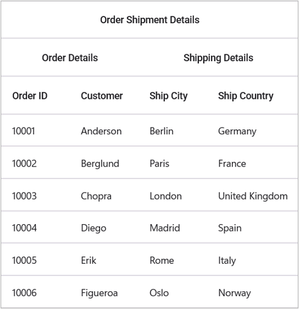
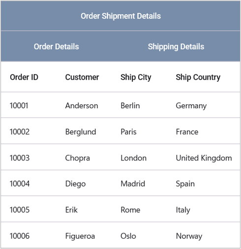
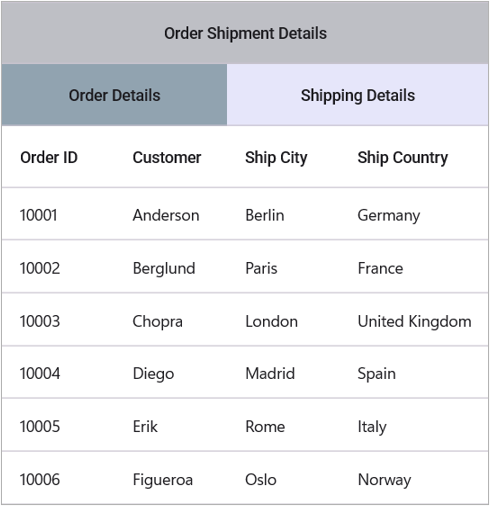
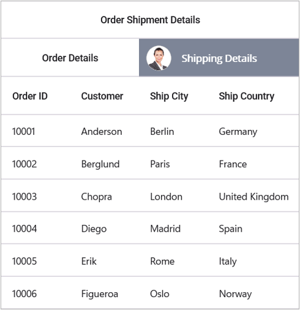

# Stacked Headers in MAUI DataGrid (SfDataGrid)

The [.NET MAUI DataGrid](https://help.syncfusion.com/cr/maui/Syncfusion.Maui.DataGrid.SfDataGrid.html) supports displaying additional unbound, multiple/multilevel header rows known as [StackedHeaderRows](https://help.syncfusion.com/cr/maui/Syncfusion.Maui.DataGrid.SfDataGrid.html#Syncfusion_Maui_DataGrid_SfDataGrid_StackedHeaderRows) that spans across the DataGrid columns. You can group one or more columns under each stacked header.

Each [StackedHeaderRow](https://help.syncfusion.com/cr/maui/Syncfusion.Maui.DataGrid.DataGridStackedHeaderRow.html) contains [Columns](https://help.syncfusion.com/cr/maui/Syncfusion.Maui.DataGrid.DataGridStackedHeaderRow.html#Syncfusion_Maui_DataGrid_DataGridStackedHeaderRow_Columns), which contains a number of child columns. The [DataGridStackedColumn.ColumnMappingNames](https://help.syncfusion.com/cr/maui/Syncfusion.Maui.DataGrid.DataGridStackedColumn.html#Syncfusion_Maui_DataGrid_DataGridStackedColumn_ColumnMappingNames) property contains the columns grouped under the stacked header row. The [DataGridStackedColumn.MappingName](https://help.syncfusion.com/cr/maui/Syncfusion.Maui.DataGrid.DataGridStackedColumn.html#Syncfusion_Maui_DataGrid_DataGridStackedColumn_MappingName) is a unique name used for mapping a specific child column grouped under the same stacked header row, whereas the [DataGridStackedColumn.Text](https://help.syncfusion.com/cr/maui/Syncfusion.Maui.DataGrid.DataGridStackedColumn.html#Syncfusion_Maui_DataGrid_DataGridStackedColumn_Text) contains the text displayed in the stacked header row.

## Adding stacked header

The stacked headers can be added using the following steps:

1. Create an object of `DataGridStackedHeaderRow` for adding stacked columns.
2. Add the columns using the `ColumnMappingNames` property of [DataGridStackedColumn](https://help.syncfusion.com/cr/maui/Syncfusion.Maui.DataGrid.DataGridStackedColumn.html).
3. Add the `DataGridStackedColumn` to `Columns` collection.
4. Finally, add the [DataGridStackedHeaderRow](https://help.syncfusion.com/cr/maui/Syncfusion.Maui.DataGrid.DataGridStackedHeaderRow.html) to `StackedHeaderRows` collection of the SfDataGrid. 



<syncfusion:SfDataGrid x:Name="dataGrid"         
                       ItemsSource="{Binding OrderInfoCollection}">
     <syncfusion:SfDataGrid.StackedHeaderRows>
            <syncfusion:DataGridStackedHeaderRow>
                <syncfusion:DataGridStackedHeaderRow.Columns>
                    <syncfusion:DataGridStackedColumn
                            ColumnMappingNames="OrderID,OrderDate,CustomerID,ContactName"
                            Text="Order Shipment Details"
                            MappingName="SalesDetails"
                            />
                </syncfusion:DataGridStackedHeaderRow.Columns>
            </syncfusion:DataGridStackedHeaderRow>
            <syncfusion:DataGridStackedHeaderRow>
                <syncfusion:DataGridStackedHeaderRow.Columns>
                    <syncfusion:DataGridStackedColumn
                            ColumnMappingNames="OrderID,OrderDate"
                            Text="Order Details"
                            MappingName="OrderDetails"
                            />
                    <syncfusion:DataGridStackedColumn
                            ColumnMappingNames="CustomerID,ContactName"
                            Text="Customer Details"
                            MappingName="CustomerDetails"
                            />
                </syncfusion:DataGridStackedHeaderRow.Columns>
            </syncfusion:DataGridStackedHeaderRow>
        </syncfusion:SfDataGrid.StackedHeaderRows>
</syncfusion:SfDataGrid>


var stackedHeaderRow = new DataGridStackedHeaderRow();
stackedHeaderRow.Columns.Add(new DataGridStackedColumn()
{
	ColumnMappingNames = "OrderID" + "," + "OrderDate" + "," + "CustomerID" + "," + "ContactName",
	Text = "Order Shipment Details",
	MappingName = "SalesDetails",
});
dataGrid.StackedHeaderRows.Add(stackedHeaderRow);

var stackedHeaderRow1 = new DataGridStackedHeaderRow();
stackedHeaderRow1.Columns.Add(new DataGridStackedColumn()
{
	ColumnMappingNames = "OrderID" + "," + "OrderDate",
	Text = "Order Details",
	MappingName = "OrderDetails",
});
stackedHeaderRow1.Columns.Add(new DataGridStackedColumn()
{
	ColumnMappingNames = "CustomerID" + "," + "ContactName",
	Text = "Customer Details",
	MappingName = "CustomerDetails",
});
this.dataGrid.StackedHeaderRows.Add(stackedHeaderRow1);



## Adding child columns

You can add the child columns to a particular stacked header row directly.



var childColumn = dataGrid.StackedHeaderRows[0].Columns[0].ColumnMappingNames;
dataGrid.StackedHeaderRows[0].Columns[0].ColumnMappingNames = childColumn + "," + "OrderDate";



## Removing child columns

Similarly, you can remove the child columns from a particular stacked header row directly.



var removingColumns = this.dataGrid.StackedHeaderRows[0].Columns[0].ColumnMappingNames.Split(',').ToList<string>();   
string ColumnMappingNames = string.Empty;

foreach(var stackedColumnName in removingColumns.ToList())
{
    if (stackedColumnName.Equals("OrderID"))
    {
        removingColumns.Remove(stackedColumnName);
    }
    else
    {
        ColumnMappingNames = ColumnMappingNames + stackedColumnName + ",";
    }
}
dataGrid.StackedHeaderRows[0].Columns[0].ColumnMappingNames = ColumnMappingNames;



## Changing stacked header row height

You can change the height of StackedHeaderRows using the [SfDataGrid.HeaderRowHeight](https://help.syncfusion.com/cr/maui/Syncfusion.Maui.DataGrid.SfDataGrid.html#Syncfusion_Maui_DataGrid_SfDataGrid_HeaderRowHeight) property.



dataGrid.HeaderRowHeight = 50;



You can also change the height of stacked header rows using the [SfDataGrid.QueryRowHeight](https://help.syncfusion.com/cr/maui/Syncfusion.Maui.DataGrid.SfDataGrid.html#Syncfusion_Maui_DataGrid_SfDataGrid_QueryRowHeight) event.



dataGrid.QueryRowHeight += dataGrid_QueryRowHeight;
void dataGrid_QueryRowHeight(object sender, QueryRowHeightEventArgs  e)
{
    if(e.RowIndex < this.dataGrid.GetHeaderIndex())
    {
        // Using the following code, you can set a desired height based on the row index. 
        e.Height = 50;
        e.Handled = true;
    }
}



## Appearance
### Font customization

Customize the font's size, family and attribute of the text displayed in stacked header column using the [DataGridStyle.StackedHeaderRowFontSize](https://help.syncfusion.com/cr/maui/Syncfusion.Maui.DataGrid.DataGridStyle.html#Syncfusion_Maui_DataGrid_DataGridStyle_StackedHeaderRowFontSize), [DataGridStyle.StackedHeaderRowFontFamily](https://help.syncfusion.com/cr/maui/Syncfusion.Maui.DataGrid.DataGridStyle.html#Syncfusion_Maui_DataGrid_DataGridStyle_StackedHeaderRowFontFamily), and [DataGridStyle.StackedHeaderRowFontAttributes](https://help.syncfusion.com/cr/maui/Syncfusion.Maui.DataGrid.DataGridStyle.html#Syncfusion_Maui_DataGrid_DataGridStyle_StackedHeaderRowFontAttributes) properties, respectively. The default font size and font attribute are 14 and normal, respectively.



<syncfusion:SfDataGrid.DefaultStyle>
    <syncfusion:DataGridStyle
            StackedHeaderRowFontSize = 16
            StackedHeaderRowFontFamily="Helvetica Neue"
            StackedHeaderRowFontAttributes="Bold"
            />
</syncfusion:SfDataGrid.DefaultStyle>


public partial class MainPage : ContentPage
{
    public MainPage()
    {
        InitializeComponent();
        this.dataGrid.DefaultStyle.StackedHeaderRowFontSize= 20;
        this.dataGrid.DefaultStyle.StackedHeaderRowFontFamily = "Helvetica Neue";
        this.dataGrid.DefaultStyle.StackedHeaderRowFontAttributes = FontAttributes.Bold;
    }
}



### Background customization

The appearance of stacked header row can be customized by setting desired values to the [DefaultStyle.StackedHeaderRowBackground](https://help.syncfusion.com/cr/maui/Syncfusion.Maui.DataGrid.DataGridStyle.html#Syncfusion_Maui_DataGrid_DataGridStyle_StackedHeaderRowBackground) property in [SfDataGrid.DefaultStyle](https://help.syncfusion.com/cr/maui/Syncfusion.Maui.DataGrid.SfDataGrid.html#Syncfusion_Maui_DataGrid_SfDataGrid_DefaultStyle).



<syncfusion:SfDataGrid.DefaultStyle>
    <syncfusion:DataGridStyle
            StackedHeaderRowBackground = "#0074E3"
            StackedHeaderRowTextColor="White"
            />
</syncfusion:SfDataGrid.DefaultStyle>



public partial class MainPage : ContentPage
{
    public MainPage()
    {
        InitializeComponent();
        this.dataGrid.DefaultStyle.StackedHeaderRowBackground = Color.FromArgb("#0074E3");
    }
}



### Conditional styling

The SfDataGrid also allows to customize the appearance of stacked header Cells conditionally based on its Cell Value.



<ContentPage.Resources>
    <ResourceDictionary>
            
    </ResourceDictionary>
</ContentPage.Resources>





//Custom style class
 public class CellStyleConverter : IValueConverter
{
    public object Convert(object value, Type targetType, object parameter, CultureInfo culture)
    {
        var text = (value as DataGridStackedHeaderCell).CellValue;

    if (text != null)
    {
        if (text.ToString() == "Order Shipment Details")
            return Colors.CadetBlue;
        else if (text.ToString() == "Order Details")
            return Colors.LightBlue;
        else if (text.ToString() == "Customer Details")
            return Colors.CornflowerBlue;               
    }
    return Colors.White;
    }

    public object ConvertBack(object value, Type targetType, object parameter, CultureInfo culture)
    {
        throw new NotImplementedException();
    }

}



## Loading template in stacked column

The SfDataGrid allows you to load any desired view inside a `DataGridStackedColumn` using the [DataGridStackedColumn.Template](https://help.syncfusion.com/cr/maui/Syncfusion.Maui.DataGrid.DataGridStackedColumn.html#Syncfusion_Maui_DataGrid_DataGridStackedColumn_Template) property.



     <syncfusion:SfDataGrid x:Name="dataGrid"         
                       ItemsSource="{Binding Orders}">
     <syncfusion:SfDataGrid.StackedHeaderRows>
            <syncfusion:DataGridStackedHeaderRow>
                <syncfusion:DataGridStackedHeaderRow.Columns>
                    <syncfusion:DataGridStackedColumn
                            ColumnMappingNames="OrderID,OrderDate,CustomerID,ContactName"
                            Text="Order Shipment Details"
                            MappingName="SalesDetails"
                            />
                </syncfusion:DataGridStackedHeaderRow.Columns>
            </syncfusion:DataGridStackedHeaderRow>
            <syncfusion:DataGridStackedHeaderRow>
                <syncfusion:DataGridStackedHeaderRow.Columns>
                    <syncfusion:DataGridStackedColumn
                            ColumnMappingNames="OrderID,OrderDate">
                            <syncfusion:DataGridStackedColumn.Template>
                                         <DataTemplate>
                                <Grid BackgroundColor="MediumPurple">
                                    <Label Text="customer Details" TextColor="Orange" 
                                           HorizontalTextAlignment="Center" 
                                           VerticalTextAlignment="Center" 
                                           Grid.Column="0"/>
                                    <StackLayout Orientation="Horizontal">
                                        <Image Source="image0.png" HeightRequest="37" Margin="10" />
                                    </StackLayout>
                                </Grid>
                            </DataTemplate>
                                    </syncfusion:DataGridStackedColumn.Template>
                            </syncfusion:DataGridStackedColumn>
                    <syncfusion:DataGridStackedColumn
                            ColumnMappingNames="CustomerID,ContactName"
                            Text="Customer Details"
                            MappingName="CustomerDetails"
                            />
                </syncfusion:DataGridStackedHeaderRow.Columns>
            </syncfusion:DataGridStackedHeaderRow>
        </syncfusion:SfDataGrid.StackedHeaderRows>
</syncfusion:SfDataGrid>


var stackedHeaderRow = new DataGridStackedHeaderRow();
        stackedHeaderRow.Columns.Add(new DataGridStackedColumn()
        {
            ColumnMappingNames = "OrderID" + "," + "OrderDate" + "," + "CustomerID" + "," + "ContactName",
            Text = "Order Shipment Details",
            MappingName = "SalesDetails",
        });
        dataGrid.StackedHeaderRows.Add(stackedHeaderRow);

        var stackedHeaderRow1 = new DataGridStackedHeaderRow();
        stackedHeaderRow1.Columns.Add(new DataGridStackedColumn()
        {
            ColumnMappingNames = "OrderID" + "," + "OrderDate",
            Text = "Order Details",
            MappingName = "OrderDetails",
            
        });
        stackedHeaderRow1.Columns.Add(new DataGridStackedColumn()
        {
            ColumnMappingNames = "CustomerID" + "," + "ContactName",
            Text = "Customer Details",
            MappingName = "CustomerDetails",
            Template = new DataTemplate(() =>
            {
                var gridView = new Grid()
                {
                    BackgroundColor = Colors.CornflowerBlue,
                };
                var imageView = new Image()
                {
                    Source = ImageSource.FromFile("customer_details.png"),
                    Aspect = Aspect.AspectFit,
                    VerticalOptions = LayoutOptions.Center,
                    HorizontalOptions = LayoutOptions.Start
                };
                var label = new Label()
                {
                    Text = "Customer Details",
                    TextColor = Colors.White,
                    VerticalTextAlignment = TextAlignment.Center,
                    HorizontalTextAlignment = TextAlignment.Center
                };
                gridView.Add(label, 0, 0);
                gridView.Add(imageView, 1, 0);
                return gridView;
            })
        });
        this.dataGrid.StackedHeaderRows.Add(stackedHeaderRow1);



