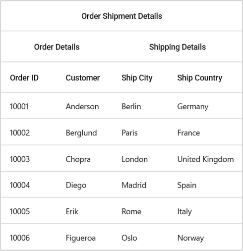
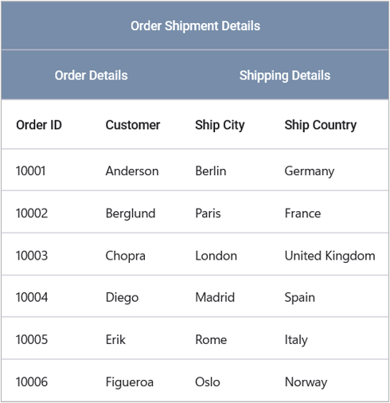
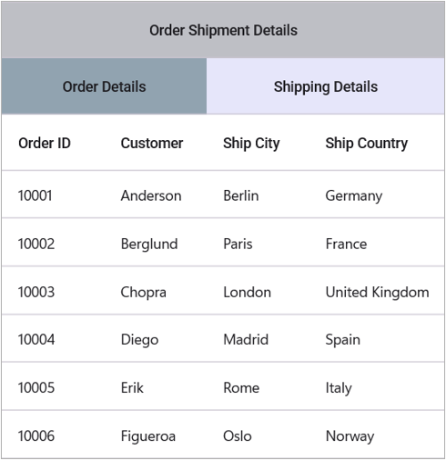
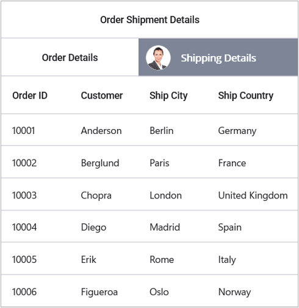

# Stacked Headers in MAUI DataGrid (SfDataGrid)

The [.NET MAUI DataGrid](https://help.syncfusion.com/cr/maui/Syncfusion.Maui.DataGrid.SfDataGrid.html) supports displaying additional unbound, multiple/multilevel header rows known as [StackedHeaderRows](https://help.syncfusion.com/cr/maui/Syncfusion.Maui.DataGrid.SfDataGrid.html#Syncfusion_Maui_DataGrid_SfDataGrid_StackedHeaderRows) that spans across the DataGrid columns. You can group one or more columns under each stacked header.

Each [StackedHeaderRow](https://help.syncfusion.com/cr/maui/Syncfusion.Maui.DataGrid.DataGridStackedHeaderRow.html) contains [Columns](https://help.syncfusion.com/cr/maui/Syncfusion.Maui.DataGrid.DataGridStackedHeaderRow.html#Syncfusion_Maui_DataGrid_DataGridStackedHeaderRow_Columns), which contains a number of child columns. The [DataGridStackedColumn.ColumnMappingNames](https://help.syncfusion.com/cr/maui/Syncfusion.Maui.DataGrid.DataGridStackedColumn.html#Syncfusion_Maui_DataGrid_DataGridStackedColumn_ColumnMappingNames) property contains the columns grouped under the stacked header row. The [DataGridStackedColumn.MappingName](https://help.syncfusion.com/cr/maui/Syncfusion.Maui.DataGrid.DataGridStackedColumn.html#Syncfusion_Maui_DataGrid_DataGridStackedColumn_MappingName) is a unique name used for mapping a specific child column grouped under the same stacked header row, whereas the [DataGridStackedColumn.Text](https://help.syncfusion.com/cr/maui/Syncfusion.Maui.DataGrid.DataGridStackedColumn.html#Syncfusion_Maui_DataGrid_DataGridStackedColumn_Text) contains the text displayed in the stacked header row.

## Adding stacked header

The stacked headers can be added using the following steps:

1. Create an object of `DataGridStackedHeaderRow` for adding stacked columns.
2. Add the columns using the `ColumnMappingNames` property of [DataGridStackedColumn](https://help.syncfusion.com/cr/maui/Syncfusion.Maui.DataGrid.DataGridStackedColumn.html).
3. Add the `DataGridStackedColumn` to `Columns` collection.
4. Finally, add the [DataGridStackedHeaderRow](https://help.syncfusion.com/cr/maui/Syncfusion.Maui.DataGrid.DataGridStackedHeaderRow.html) to `StackedHeaderRows` collection of the SfDataGrid. 



<ContentPage.BindingContext>
    <local:OrderInfoViewModel />
</ContentPage.BindingContext>

<ContentPage.Resources>
    
    
</ContentPage.Resources>

<syncfusion:SfDataGrid x:Name="DataGrid"
                       HorizontalScrollBarVisibility="Never"
                       VerticalScrollBarVisibility="Never"
                       ItemsSource="{Binding Orders}"
                       AutoGenerateColumnsMode="None">
    <syncfusion:SfDataGrid.Columns>
        <syncfusion:DataGridTextColumn MappingName="OrderID"
                                       HeaderText="Order ID"
                                       LineBreakMode="NoWrap" />
        <syncfusion:DataGridTextColumn MappingName="Customer"
                                       HeaderText="Customer"
                                       LineBreakMode="NoWrap" />
        <syncfusion:DataGridTextColumn MappingName="City"
                                       HeaderText="Ship City"
                                       LineBreakMode="NoWrap" />
        <syncfusion:DataGridTextColumn MappingName="Country"
                                       HeaderText="Ship Country"
                                       Width="133"
                                       LineBreakMode="NoWrap" />
    </syncfusion:SfDataGrid.Columns>
    <syncfusion:SfDataGrid.StackedHeaderRows>
        <syncfusion:DataGridStackedHeaderRow>
            <syncfusion:DataGridStackedHeaderRow.Columns>
                <syncfusion:DataGridStackedColumn
                        ColumnMappingNames="OrderID,Customer,City,Country"
                        Text="Order Shipment Details"
                        MappingName="SalesDetails"
                        />
            </syncfusion:DataGridStackedHeaderRow.Columns>
        </syncfusion:DataGridStackedHeaderRow>
        <syncfusion:DataGridStackedHeaderRow>
            <syncfusion:DataGridStackedHeaderRow.Columns>
                <syncfusion:DataGridStackedColumn
                        ColumnMappingNames="OrderID,Customer"
                        Text="Order Details"
                        MappingName="OrderDetails"
                        />
                <syncfusion:DataGridStackedColumn
                        ColumnMappingNames="City,Country"
                        Text="Shipping Details"
                        MappingName="ShippingDetails"
                    />
            </syncfusion:DataGridStackedHeaderRow.Columns>
        </syncfusion:DataGridStackedHeaderRow>
    </syncfusion:SfDataGrid.StackedHeaderRows>
</syncfusion:SfDataGrid>


OrderInfoViewModel orderInfoViewModel = new OrderInfoViewModel();

public MainPage()
{
    InitializeComponent();
    var DataGrid = new SfDataGrid()
    {
        HorizontalScrollBarVisibility = ScrollBarVisibility.Never,
        VerticalScrollBarVisibility = ScrollBarVisibility.Never,
        ItemsSource = orderInfoViewModel.Orders,
        AutoGenerateColumnsMode = AutoGenerateColumnsMode.None,
    };

    DataGrid.Columns.Add(new DataGridTextColumn
    {
        MappingName = "OrderID",
        HeaderText = "Order ID",
        LineBreakMode = LineBreakMode.NoWrap
    });

    DataGrid.Columns.Add(new DataGridTextColumn
    {
        MappingName = "Customer",
        HeaderText = "Customer",
        LineBreakMode = LineBreakMode.NoWrap
    });

    DataGrid.Columns.Add(new DataGridTextColumn
    {
        MappingName = "City",
        HeaderText = "Ship City",
        LineBreakMode = LineBreakMode.NoWrap
    });

    DataGrid.Columns.Add(new DataGridTextColumn
    {
        MappingName = "Country",
        HeaderText = "Ship Country",
        Width = 133,
        LineBreakMode = LineBreakMode.NoWrap
    });

    var stackedHeaderRow = new DataGridStackedHeaderRow();
    stackedHeaderRow.Columns.Add(new DataGridStackedColumn()
    {
        ColumnMappingNames = "OrderID" + "," + "Customer" + "," + "City" + "," + "Country",
        Text = "Order Shipment Details",
        MappingName = "SalesDetails",
    });
    DataGrid.StackedHeaderRows.Add(stackedHeaderRow);

    var stackedHeaderRow1 = new DataGridStackedHeaderRow();
    stackedHeaderRow1.Columns.Add(new DataGridStackedColumn()
    {
        ColumnMappingNames = "OrderID" + "," + "Customer",
        Text = "Order Details",
        MappingName = "OrderDetails",

    });
    stackedHeaderRow1.Columns.Add(new DataGridStackedColumn()
    {
        ColumnMappingNames = "City" + "," + "Country",
        Text = "Shipping Details",
        MappingName = "ShippingDetails",
        
    });
    DataGrid.StackedHeaderRows.Add(stackedHeaderRow1);
    this.Content = DataGrid;
}



## Adding child columns

You can add the child columns to a particular stacked header row directly.



OrderInfoViewModel orderInfoViewModel = new OrderInfoViewModel();

public MainPage()
{
    InitializeComponent();

    var DataGrid = new SfDataGrid()
    {
        HorizontalScrollBarVisibility = ScrollBarVisibility.Never,
        VerticalScrollBarVisibility = ScrollBarVisibility.Never,
        ItemsSource = orderInfoViewModel.Orders,
        AutoGenerateColumnsMode = AutoGenerateColumnsMode.None,
    };

    DataGrid.Columns.Add(new DataGridTextColumn
    {
        MappingName = "OrderID",
        HeaderText = "Order ID",
        LineBreakMode = LineBreakMode.NoWrap
    });

    DataGrid.Columns.Add(new DataGridTextColumn
    {
        MappingName = "Customer",
        HeaderText = "Customer",
        LineBreakMode = LineBreakMode.NoWrap
    });

    DataGrid.Columns.Add(new DataGridTextColumn
    {
        MappingName = "City",
        HeaderText = "Ship City",
        LineBreakMode = LineBreakMode.NoWrap
    });

    DataGrid.Columns.Add(new DataGridTextColumn
    {
        MappingName = "Country",
        HeaderText = "Ship Country",
        Width = 133,
        LineBreakMode = LineBreakMode.NoWrap
    });

    DataGrid.Columns.Add(new DataGridTextColumn
    {
        MappingName = "Product",
        HeaderText = "Product",
        Width = 133,
        LineBreakMode = LineBreakMode.NoWrap
    });

    var stackedHeaderRow = new DataGridStackedHeaderRow();
    stackedHeaderRow.Columns.Add(new DataGridStackedColumn()
    {
        ColumnMappingNames = "OrderID" + "," + "Customer" + "," + "City" + "," + "Country",
        Text = "Order Shipment Details",
        MappingName = "SalesDetails",
    });
    DataGrid.StackedHeaderRows.Add(stackedHeaderRow);
    var childColumn = DataGrid.StackedHeaderRows[0].Columns[0].ColumnMappingNames;
    DataGrid.StackedHeaderRows[0].Columns[0].ColumnMappingNames = childColumn + "," + "Product";
    this.Content = DataGrid;
}



## Removing child columns

Similarly, you can remove the child columns from a particular stacked header row directly.



OrderInfoViewModel orderInfoViewModel = new OrderInfoViewModel();

public MainPage()
{
    InitializeComponent();

    var DataGrid = new SfDataGrid()
    {
        HorizontalScrollBarVisibility = ScrollBarVisibility.Never,
        VerticalScrollBarVisibility = ScrollBarVisibility.Never,
        ItemsSource = orderInfoViewModel.Orders,
        AutoGenerateColumnsMode = AutoGenerateColumnsMode.None,
    };

    DataGrid.Columns.Add(new DataGridTextColumn
    {
        MappingName = "OrderID",
        HeaderText = "Order ID",
        LineBreakMode = LineBreakMode.NoWrap
    });

    DataGrid.Columns.Add(new DataGridTextColumn
    {
        MappingName = "Customer",
        HeaderText = "Customer",
        LineBreakMode = LineBreakMode.NoWrap
    });

    DataGrid.Columns.Add(new DataGridTextColumn
    {
        MappingName = "City",
        HeaderText = "Ship City",
        LineBreakMode = LineBreakMode.NoWrap
    });

    DataGrid.Columns.Add(new DataGridTextColumn
    {
        MappingName = "Country",
        HeaderText = "Ship Country",
        Width = 133,
        LineBreakMode = LineBreakMode.NoWrap
    });

    var stackedHeaderRow = new DataGridStackedHeaderRow();
    stackedHeaderRow.Columns.Add(new DataGridStackedColumn()
    {
        ColumnMappingNames = "OrderID" + "," + "Customer" + "," + "City" + "," + "Country",
        Text = "Order Shipment Details",
        MappingName = "SalesDetails",
    });
    DataGrid.StackedHeaderRows.Add(stackedHeaderRow);
    var removingColumns = DataGrid.StackedHeaderRows[0].Columns[0].ColumnMappingNames.Split(',').ToList<string>();
    string ColumnMappingNames = string.Empty;

    foreach (var stackedColumnName in removingColumns.ToList())
    {
        if (stackedColumnName.Equals("OrderID"))
        {
            removingColumns.Remove(stackedColumnName);
        }
        else
        {
            ColumnMappingNames = ColumnMappingNames + stackedColumnName + ",";
        }
    }
    DataGrid.StackedHeaderRows[0].Columns[0].ColumnMappingNames = ColumnMappingNames;
    this.Content = DataGrid;
}



## Changing stacked header row height

You can change the height of StackedHeaderRows using the [SfDataGrid.HeaderRowHeight](https://help.syncfusion.com/cr/maui/Syncfusion.Maui.DataGrid.SfDataGrid.html#Syncfusion_Maui_DataGrid_SfDataGrid_HeaderRowHeight) property.



OrderInfoViewModel orderInfoViewModel = new OrderInfoViewModel();

public MainPage()
{
    InitializeComponent();

    var DataGrid = new SfDataGrid()
    {
        HorizontalScrollBarVisibility = ScrollBarVisibility.Never,
        VerticalScrollBarVisibility = ScrollBarVisibility.Never,
        ItemsSource = orderInfoViewModel.Orders,
        AutoGenerateColumnsMode = AutoGenerateColumnsMode.None,
        HeaderRowHeight = 60,
    };

    DataGrid.Columns.Add(new DataGridTextColumn
    {
        MappingName = "OrderID",
        HeaderText = "Order ID",
        LineBreakMode = LineBreakMode.NoWrap
    });

    DataGrid.Columns.Add(new DataGridTextColumn
    {
        MappingName = "Customer",
        HeaderText = "Customer",
        LineBreakMode = LineBreakMode.NoWrap
    });

    DataGrid.Columns.Add(new DataGridTextColumn
    {
        MappingName = "City",
        HeaderText = "Ship City",
        LineBreakMode = LineBreakMode.NoWrap
    });

    DataGrid.Columns.Add(new DataGridTextColumn
    {
        MappingName = "Country",
        HeaderText = "Ship Country",
        Width = 133,
        LineBreakMode = LineBreakMode.NoWrap
    });

    var stackedHeaderRow = new DataGridStackedHeaderRow();
    stackedHeaderRow.Columns.Add(new DataGridStackedColumn()
    {
        ColumnMappingNames = "OrderID" + "," + "Customer" + "," + "City" + "," + "Country",
        Text = "Order Shipment Details",
        MappingName = "SalesDetails",
    });
    DataGrid.StackedHeaderRows.Add(stackedHeaderRow);

    var stackedHeaderRow1 = new DataGridStackedHeaderRow();
    stackedHeaderRow1.Columns.Add(new DataGridStackedColumn()
    {
        ColumnMappingNames = "OrderID" + "," + "Customer",
        Text = "Order Details",
        MappingName = "OrderDetails",

    });
    stackedHeaderRow1.Columns.Add(new DataGridStackedColumn()
    {
        ColumnMappingNames = "City" + "," + "Country",
        Text = "Shipping Details",
        MappingName = "ShippingDetails",

    });
    DataGrid.StackedHeaderRows.Add(stackedHeaderRow1);
    this.Content = DataGrid;
}



You can also change the height of stacked header rows using the [SfDataGrid.QueryRowHeight](https://help.syncfusion.com/cr/maui/Syncfusion.Maui.DataGrid.SfDataGrid.html#Syncfusion_Maui_DataGrid_SfDataGrid_QueryRowHeight) event.



DataGrid.QueryRowHeight += DataGrid_QueryRowHeight;
void DataGrid_QueryRowHeight(object sender, DataGridQueryRowHeightEventArgs e)
{
    if (e.RowIndex <= DataGrid.GetHeaderIndex())
    {
        // Using the following code, you can set a desired height based on the row index. 
        e.Height = 60;
        e.Handled = true;
    }
}



## Appearance
### Font customization

Customize the font's size, family and attribute of the text displayed in stacked header column using the [DataGridStyle.StackedHeaderRowFontSize](https://help.syncfusion.com/cr/maui/Syncfusion.Maui.DataGrid.DataGridStyle.html#Syncfusion_Maui_DataGrid_DataGridStyle_StackedHeaderRowFontSize), [DataGridStyle.StackedHeaderRowFontFamily](https://help.syncfusion.com/cr/maui/Syncfusion.Maui.DataGrid.DataGridStyle.html#Syncfusion_Maui_DataGrid_DataGridStyle_StackedHeaderRowFontFamily), and [DataGridStyle.StackedHeaderRowFontAttributes](https://help.syncfusion.com/cr/maui/Syncfusion.Maui.DataGrid.DataGridStyle.html#Syncfusion_Maui_DataGrid_DataGridStyle_StackedHeaderRowFontAttributes) properties, respectively. The default font size and font attribute are 14 and normal, respectively.



<ContentPage.BindingContext>
    <local:OrderInfoViewModel />
</ContentPage.BindingContext>

<syncfusion:SfDataGrid x:Name="DataGrid"
                        HorizontalScrollBarVisibility="Never"
                        VerticalScrollBarVisibility="Never"
                        ItemsSource="{Binding Orders}"
                        AutoGenerateColumnsMode="None">
    <syncfusion:SfDataGrid.DefaultStyle>
        <syncfusion:DataGridStyle
        StackedHeaderRowFontSize = "20"
        StackedHeaderRowFontFamily="Helvetica Neue"
        StackedHeaderRowFontAttributes="Bold"
        />
    </syncfusion:SfDataGrid.DefaultStyle>
    <syncfusion:SfDataGrid.Columns>
        <syncfusion:DataGridTextColumn MappingName="OrderID"
                                        HeaderText="Order ID"
                                        LineBreakMode="NoWrap" />
        <syncfusion:DataGridTextColumn MappingName="Customer"
                                        HeaderText="Customer"
                                        LineBreakMode="NoWrap" />
        <syncfusion:DataGridTextColumn MappingName="City"
                                        HeaderText="Ship City"
                                        LineBreakMode="NoWrap" />
        <syncfusion:DataGridTextColumn MappingName="Country"
                                        HeaderText="Ship Country"
                                        Width="133"
                                        LineBreakMode="NoWrap" />
    </syncfusion:SfDataGrid.Columns>
    <syncfusion:SfDataGrid.StackedHeaderRows>
        <syncfusion:DataGridStackedHeaderRow>
            <syncfusion:DataGridStackedHeaderRow.Columns>
                <syncfusion:DataGridStackedColumn
                        ColumnMappingNames="OrderID,Customer,City,Country"
                        Text="Order Shipment Details"
                        MappingName="SalesDetails"
                        />
            </syncfusion:DataGridStackedHeaderRow.Columns>
        </syncfusion:DataGridStackedHeaderRow>
        <syncfusion:DataGridStackedHeaderRow>
            <syncfusion:DataGridStackedHeaderRow.Columns>
                <syncfusion:DataGridStackedColumn
                        ColumnMappingNames="OrderID,Customer"
                        Text="Order Details"
                        MappingName="OrderDetails"
                        />
                <syncfusion:DataGridStackedColumn
                        ColumnMappingNames="City,Country"
                        Text="Shipping Details"
                        MappingName="ShippingDetails"
                        />
            </syncfusion:DataGridStackedHeaderRow.Columns>
        </syncfusion:DataGridStackedHeaderRow>
    </syncfusion:SfDataGrid.StackedHeaderRows>
</syncfusion:SfDataGrid>


public partial class MainPage : ContentPage
{
    OrderInfoViewModel orderInfoViewModel = new OrderInfoViewModel();

    public MainPage()
    {
        InitializeComponent();

        var DataGrid = new SfDataGrid()
        {
            HorizontalScrollBarVisibility = ScrollBarVisibility.Never,
            VerticalScrollBarVisibility = ScrollBarVisibility.Never,
            ItemsSource = orderInfoViewModel.Orders,
            AutoGenerateColumnsMode = AutoGenerateColumnsMode.None,
        };

        DataGrid.DefaultStyle.StackedHeaderRowFontSize = 20;
        DataGrid.DefaultStyle.StackedHeaderRowFontFamily = "Helvetica Neue";
        DataGrid.DefaultStyle.StackedHeaderRowFontAttributes = FontAttributes.Bold;

        DataGrid.Columns.Add(new DataGridTextColumn
        {
            MappingName = "OrderID",
            HeaderText = "Order ID",
            LineBreakMode = LineBreakMode.NoWrap
        });

        DataGrid.Columns.Add(new DataGridTextColumn
        {
            MappingName = "Customer",
            HeaderText = "Customer",
            LineBreakMode = LineBreakMode.NoWrap
        });

        DataGrid.Columns.Add(new DataGridTextColumn
        {
            MappingName = "City",
            HeaderText = "Ship City",
            LineBreakMode = LineBreakMode.NoWrap
        });

        DataGrid.Columns.Add(new DataGridTextColumn
        {
            MappingName = "Country",
            HeaderText = "Ship Country",
            Width = 133,
            LineBreakMode = LineBreakMode.NoWrap
        });

        var stackedHeaderRow = new DataGridStackedHeaderRow();
        stackedHeaderRow.Columns.Add(new DataGridStackedColumn()
        {
            ColumnMappingNames = "OrderID" + "," + "Customer" + "," + "City" + "," + "Country",
            Text = "Order Shipment Details",
            MappingName = "SalesDetails",
        });
        DataGrid.StackedHeaderRows.Add(stackedHeaderRow);

        var stackedHeaderRow1 = new DataGridStackedHeaderRow();
        stackedHeaderRow1.Columns.Add(new DataGridStackedColumn()
        {
            ColumnMappingNames = "OrderID" + "," + "Customer",
            Text = "Order Details",
            MappingName = "OrderDetails",

        });
        stackedHeaderRow1.Columns.Add(new DataGridStackedColumn()
        {
            ColumnMappingNames = "City" + "," + "Country",
            Text = "Shipping Details",
            MappingName = "ShippingDetails",

        });
        DataGrid.StackedHeaderRows.Add(stackedHeaderRow1);
        this.Content = DataGrid;
    }
}



### Background customization

The appearance of stacked header row can be customized by setting desired values to the [DefaultStyle.StackedHeaderRowBackground](https://help.syncfusion.com/cr/maui/Syncfusion.Maui.DataGrid.DataGridStyle.html#Syncfusion_Maui_DataGrid_DataGridStyle_StackedHeaderRowBackground) property in [SfDataGrid.DefaultStyle](https://help.syncfusion.com/cr/maui/Syncfusion.Maui.DataGrid.SfDataGrid.html#Syncfusion_Maui_DataGrid_SfDataGrid_DefaultStyle).



<ContentPage.BindingContext>
    <local:OrderInfoViewModel />
</ContentPage.BindingContext>

<ContentPage.Resources>
    
    
</ContentPage.Resources>

<syncfusion:SfDataGrid x:Name="DataGrid"
                       HorizontalScrollBarVisibility="Never"
                       VerticalScrollBarVisibility="Never"
                       ItemsSource="{Binding Orders}"
                       AutoGenerateColumnsMode="None">
    <syncfusion:SfDataGrid.Columns>
        <syncfusion:DataGridTextColumn MappingName="OrderID"
                                       HeaderText="Order ID"
                                       LineBreakMode="NoWrap" />
        <syncfusion:DataGridTextColumn MappingName="Customer"
                                       HeaderText="Customer"
                                       LineBreakMode="NoWrap" />
        <syncfusion:DataGridTextColumn MappingName="City"
                                       HeaderText="Ship City"
                                       LineBreakMode="NoWrap" />
        <syncfusion:DataGridTextColumn MappingName="Country"
                                       HeaderText="Ship Country"
                                       Width="133"
                                       LineBreakMode="NoWrap" />
    </syncfusion:SfDataGrid.Columns>
    <syncfusion:SfDataGrid.DefaultStyle>
        <syncfusion:DataGridStyle
            StackedHeaderRowBackground = "#778da9"
            StackedHeaderRowTextColor="White"
        />
    </syncfusion:SfDataGrid.DefaultStyle>
    <syncfusion:SfDataGrid.StackedHeaderRows>
        <syncfusion:DataGridStackedHeaderRow>
            <syncfusion:DataGridStackedHeaderRow.Columns>
                <syncfusion:DataGridStackedColumn
                        ColumnMappingNames="OrderID,Customer,City,Country"
                        Text="Order Shipment Details"
                        MappingName="SalesDetails"
                        />
            </syncfusion:DataGridStackedHeaderRow.Columns>
        </syncfusion:DataGridStackedHeaderRow>
        <syncfusion:DataGridStackedHeaderRow>
            <syncfusion:DataGridStackedHeaderRow.Columns>
                <syncfusion:DataGridStackedColumn
                        ColumnMappingNames="OrderID,Customer"
                        Text="Order Details"
                        MappingName="OrderDetails"
                        />
                <syncfusion:DataGridStackedColumn
                        ColumnMappingNames="City,Country"
                        Text="Shipping Details"
                        MappingName="ShippingDetails"
                        />
            </syncfusion:DataGridStackedHeaderRow.Columns>
        </syncfusion:DataGridStackedHeaderRow>
    </syncfusion:SfDataGrid.StackedHeaderRows>
</syncfusion:SfDataGrid>



public partial class MainPage : ContentPage
{
    OrderInfoViewModel orderInfoViewModel = new OrderInfoViewModel();

    public MainPage()
    {
        InitializeComponent();
        var DataGrid = new SfDataGrid()
        {
            HorizontalScrollBarVisibility = ScrollBarVisibility.Never,
            VerticalScrollBarVisibility = ScrollBarVisibility.Never,
            ItemsSource = orderInfoViewModel.Orders,
            AutoGenerateColumnsMode = AutoGenerateColumnsMode.None,
        };

        DataGrid.DefaultStyle.StackedHeaderRowBackground = Color.FromArgb("#778da9");
        DataGrid.DefaultStyle.StackedHeaderRowTextColor = Color.FromArgb("#FFFFFF");

        DataGrid.Columns.Add(new DataGridTextColumn
        {
            MappingName = "OrderID",
            HeaderText = "Order ID",
            LineBreakMode = LineBreakMode.NoWrap
        });

        DataGrid.Columns.Add(new DataGridTextColumn
        {
            MappingName = "Customer",
            HeaderText = "Customer",
            LineBreakMode = LineBreakMode.NoWrap
        });

        DataGrid.Columns.Add(new DataGridTextColumn
        {
            MappingName = "City",
            HeaderText = "Ship City",
            LineBreakMode = LineBreakMode.NoWrap
        });

        DataGrid.Columns.Add(new DataGridTextColumn
        {
            MappingName = "Country",
            HeaderText = "Ship Country",
            Width = 133,
            LineBreakMode = LineBreakMode.NoWrap
        });

        var stackedHeaderRow = new DataGridStackedHeaderRow();
        stackedHeaderRow.Columns.Add(new DataGridStackedColumn()
        {
            ColumnMappingNames = "OrderID" + "," + "Customer" + "," + "City" + "," + "Country",
            Text = "Order Shipment Details",
            MappingName = "SalesDetails",
        });
        DataGrid.StackedHeaderRows.Add(stackedHeaderRow);

        var stackedHeaderRow1 = new DataGridStackedHeaderRow();
        stackedHeaderRow1.Columns.Add(new DataGridStackedColumn()
        {
            ColumnMappingNames = "OrderID" + "," + "Customer",
            Text = "Order Details",
            MappingName = "OrderDetails",

        });
        stackedHeaderRow1.Columns.Add(new DataGridStackedColumn()
        {
            ColumnMappingNames = "City" + "," + "Country",
            Text = "Shipping Details",
            MappingName = "ShippingDetails",
            
        });
        DataGrid.StackedHeaderRows.Add(stackedHeaderRow1);
        this.Content = DataGrid;
    }
}



### Conditional styling

The SfDataGrid also allows to customize the appearance of stacked header Cells conditionally based on its Cell Value.



<ContentPage.BindingContext>
    <local:OrderInfoViewModel />
</ContentPage.BindingContext>

<ContentPage.Resources>
    
    <ResourceDictionary>
        
    </ResourceDictionary>
</ContentPage.Resources>

<syncfusion:SfDataGrid x:Name="DataGrid"
                       HorizontalScrollBarVisibility="Never"
                       VerticalScrollBarVisibility="Never"
                       ItemsSource="{Binding Orders}"
                       AutoGenerateColumnsMode="None">
    <syncfusion:SfDataGrid.Columns>
        <syncfusion:DataGridTextColumn MappingName="OrderID"
                                       HeaderText="Order ID"
                                       LineBreakMode="NoWrap" />
        <syncfusion:DataGridTextColumn MappingName="Customer"
                                       HeaderText="Customer"
                                       LineBreakMode="NoWrap" />
        <syncfusion:DataGridTextColumn MappingName="City"
                                       HeaderText="Ship City"
                                       LineBreakMode="NoWrap" />
        <syncfusion:DataGridTextColumn MappingName="Country"
                                       HeaderText="Ship Country"
                                       Width="133"
                                       LineBreakMode="NoWrap" />
    </syncfusion:SfDataGrid.Columns>
    <syncfusion:SfDataGrid.StackedHeaderRows>
        <syncfusion:DataGridStackedHeaderRow>
            <syncfusion:DataGridStackedHeaderRow.Columns>
                <syncfusion:DataGridStackedColumn
                        ColumnMappingNames="OrderID,Customer,City,Country"
                        Text="Order Shipment Details"
                        MappingName="SalesDetails"
                        />
            </syncfusion:DataGridStackedHeaderRow.Columns>
        </syncfusion:DataGridStackedHeaderRow>
        <syncfusion:DataGridStackedHeaderRow>
            <syncfusion:DataGridStackedHeaderRow.Columns>
                <syncfusion:DataGridStackedColumn
                        ColumnMappingNames="OrderID,Customer"
                        Text="Order Details"
                        MappingName="OrderDetails"
                        />
                <syncfusion:DataGridStackedColumn
                        ColumnMappingNames="City,Country"
                        Text="Shipping Details"
                        MappingName="ShippingDetails"
                        />
            </syncfusion:DataGridStackedHeaderRow.Columns>
        </syncfusion:DataGridStackedHeaderRow>
    </syncfusion:SfDataGrid.StackedHeaderRows>
</syncfusion:SfDataGrid>





//Custom style class
public class CellStyleConverter : IValueConverter
{
    public object Convert(object value, Type targetType, object parameter, CultureInfo culture)
    {
        var text = (value as DataGridStackedHeaderCell).CellValue;

        if (text != null)
        {
            if (text.ToString() == "Order Shipment Details")
                return Color.FromArgb("#BEBFC5");
            else if (text.ToString() == "Order Details")
                return Color.FromArgb("#91A3B0");
            else if (text.ToString() == "Shipping Details")
                return Color.FromArgb("#E6E6FA");
        }
        return Color.FromArgb("#FFFFFF");
    }

    public object ConvertBack(object value, Type targetType, object parameter, CultureInfo culture)
    {
        throw new NotImplementedException();
    }
}



## Loading template in stacked column

The SfDataGrid allows you to load any desired view inside a `DataGridStackedColumn` using the [DataGridStackedColumn.Template](https://help.syncfusion.com/cr/maui/Syncfusion.Maui.DataGrid.DataGridStackedColumn.html#Syncfusion_Maui_DataGrid_DataGridStackedColumn_Template) property.



    <syncfusion:SfDataGrid x:Name="DataGrid"
                       HorizontalScrollBarVisibility="Never"
                       VerticalScrollBarVisibility="Never"
                       ItemsSource="{Binding Orders}"
                       AutoGenerateColumnsMode="None">
        <syncfusion:SfDataGrid.Columns>
            <syncfusion:DataGridTextColumn MappingName="OrderID"
                                        HeaderText="Order ID"
                                        LineBreakMode="NoWrap" />
            <syncfusion:DataGridTextColumn MappingName="Customer"
                                        HeaderText="Customer"
                                        LineBreakMode="NoWrap" />
            <syncfusion:DataGridTextColumn MappingName="City"
                                        HeaderText="Ship City"
                                        LineBreakMode="NoWrap" />
            <syncfusion:DataGridTextColumn MappingName="Country"
                                        HeaderText="Ship Country"
                                        Width="133"
                                        LineBreakMode="NoWrap" />
        </syncfusion:SfDataGrid.Columns>
        <syncfusion:SfDataGrid.StackedHeaderRows>
            <syncfusion:DataGridStackedHeaderRow>
                <syncfusion:DataGridStackedHeaderRow.Columns>
                    <syncfusion:DataGridStackedColumn
                            ColumnMappingNames="OrderID,Customer,City,Country"
                            Text="Order Shipment Details"
                            MappingName="SalesDetails"
                            />
                </syncfusion:DataGridStackedHeaderRow.Columns>
            </syncfusion:DataGridStackedHeaderRow>
            <syncfusion:DataGridStackedHeaderRow>
                <syncfusion:DataGridStackedHeaderRow.Columns>
                    <syncfusion:DataGridStackedColumn
                            ColumnMappingNames="OrderID,Customer"
                            Text="Order Details"
                            MappingName="OrderDetails"
                            />
                    <syncfusion:DataGridStackedColumn
                            ColumnMappingNames="City,Country">
                        <syncfusion:DataGridStackedColumn.Template>
                            <DataTemplate>
                                <Grid BackgroundColor="#7d8597">
                                    <Label Text="Shipping Details" TextColor="#FFFFFF" 
                                        HorizontalTextAlignment="Center" 
                                        VerticalTextAlignment="Center"
                                        FontAttributes="Bold"
                                        Grid.Column="0"/>
                                    <StackLayout Orientation="Horizontal">
                                        <Image Source="image0.png" HeightRequest="37" Margin="10" />
                                    </StackLayout>
                                </Grid>
                            </DataTemplate>
                        </syncfusion:DataGridStackedColumn.Template>
                    </syncfusion:DataGridStackedColumn>
                </syncfusion:DataGridStackedHeaderRow.Columns>
            </syncfusion:DataGridStackedHeaderRow>
        </syncfusion:SfDataGrid.StackedHeaderRows>
    </syncfusion:SfDataGrid>



OrderInfoViewModel orderInfoViewModel = new OrderInfoViewModel();

public MainPage()
{
    InitializeComponent();
    var DataGrid = new SfDataGrid()
    {
        HorizontalScrollBarVisibility = ScrollBarVisibility.Never,
        VerticalScrollBarVisibility = ScrollBarVisibility.Never,
        ItemsSource = orderInfoViewModel.Orders,
        AutoGenerateColumnsMode = AutoGenerateColumnsMode.None,
    };

    DataGrid.Columns.Add(new DataGridTextColumn
    {
        MappingName = "OrderID",
        HeaderText = "Order ID",
        LineBreakMode = LineBreakMode.NoWrap
    });

    DataGrid.Columns.Add(new DataGridTextColumn
    {
        MappingName = "Customer",
        HeaderText = "Customer",
        LineBreakMode = LineBreakMode.NoWrap
    });

    DataGrid.Columns.Add(new DataGridTextColumn
    {
        MappingName = "City",
        HeaderText = "Ship City",
        LineBreakMode = LineBreakMode.NoWrap
    });

    DataGrid.Columns.Add(new DataGridTextColumn
    {
        MappingName = "Country",
        HeaderText = "Ship Country",
        Width = 133,
        LineBreakMode = LineBreakMode.NoWrap
    });

    var stackedHeaderRow = new DataGridStackedHeaderRow();
    stackedHeaderRow.Columns.Add(new DataGridStackedColumn()
    {
        ColumnMappingNames = "OrderID" + "," + "Customer" + "," + "City" + "," + "Country",
        Text = "Order Shipment Details",
        MappingName = "SalesDetails",
    });
    DataGrid.StackedHeaderRows.Add(stackedHeaderRow);

    var stackedHeaderRow1 = new DataGridStackedHeaderRow();
    stackedHeaderRow1.Columns.Add(new DataGridStackedColumn()
    {
        ColumnMappingNames = "OrderID" + "," + "Customer",
        Text = "Order Details",
        MappingName = "OrderDetails",

    });
    stackedHeaderRow1.Columns.Add(new DataGridStackedColumn()
    {
        ColumnMappingNames = "City" + "," + "Country",
        Text = "Shipping Details",
        MappingName = "ShippingDetails",
        Template = new DataTemplate(() =>
        {
            var grid = new Grid
            {
                BackgroundColor = Color.FromArgb("#7d8597"),
            };

            var label = new Label
            {
                Text = "Shipping Details",
                TextColor = Colors.White,
                HorizontalTextAlignment = TextAlignment.Center,
                VerticalTextAlignment = TextAlignment.Center,
                FontAttributes = FontAttributes.Bold
            };

            var image = new Image
            {
                Source = "image0.png",
                HeightRequest = 37,
                Margin = new Thickness(10)
            };

            var stack = new StackLayout
            {
                Orientation = StackOrientation.Horizontal
            };
            stack.Children.Add(image);

            grid.Children.Add(label);
            grid.Children.Add(stack);
            return grid;
        })
    });
    DataGrid.StackedHeaderRows.Add(stackedHeaderRow1);
    this.Content = DataGrid;
}



