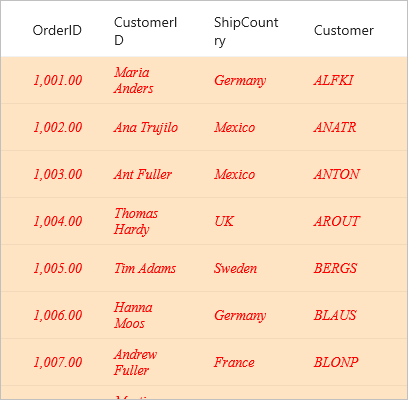
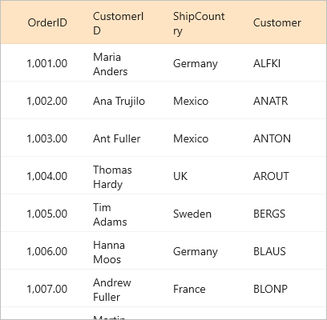
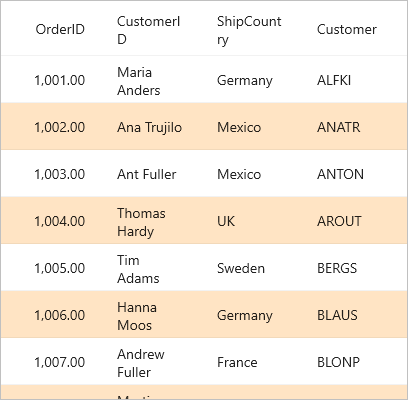
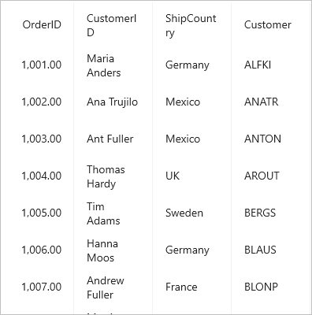

# Styling in .NET MAUI DataGrid (SfDataGrid)

The data grid applies style for all of its elements by setting desired values to the style properties in SfDataGrid.DefaultStyle.



<syncfusion:SfDataGrid ItemsSource="{Binding OrderInfoCollection}" >
    <syncfusion:SfDataGrid.DefaultStyle>
        <syncfusion:DataGridStyle HeaderRowBackground="Red" HeaderRowTextColor="White" RowBackground="Bisque" RowTextColor="Red"/>
    </syncfusion:SfDataGrid.DefaultStyle>
</syncfusion:SfDataGrid>


public partial class MainPage : ContentPage
{
    public MainPage()
    {
        InitializeComponent();
        this.dataGrid.DefaultStyle.HeaderRowBackground = Colors.Red;
        this.dataGrid.DefaultStyle.HeaderRowTextColor = Colors.White;
        this.dataGrid.DefaultStyle.RowBackground = Colors.Bisque;
        this.dataGrid.DefaultStyle.RowTextColor = Colors.Red;
    }
}



## Set datagrid style from application resources
You can write custom style for the properties in SfDataGrid.DefaultStyle class using application resource and consume the custom style as static resource to the DefaultSyle property for the required DataGrid used in that page.



<Application.Resources>
    <ResourceDictionary>
        <syncfusion:DataGridStyle x:Key="customStyle" 
                                  RowBackground="Bisque"
                                  HeaderRowBackground="Red"
                                  RowTextColor="Red"
                                  HeaderRowTextColor="White"/>
    </ResourceDictionary>
</Application.Resources>
<ContentPage.Content>
    <syncfusion:SfDataGrid DefaultStyle="{StaticResource customStyle}" ItemsSource="{Binding OrderInfoCollection}" />
</ContentPage.Content>



## Set datagrid style from page resources
You can write custom style for the properties in SfDataGrid.DefaultStyle class using page resource and consume the custom style as static resource to the DefaultSyle property for the required DataGrid used in that page.



<ContentPage.Resources>
    <ResourceDictionary>
        <syncfusion:DataGridStyle x:Key="customStyle" 
                                  RowBackground="Bisque"
                                  HeaderRowBackground="Red"
                                  RowTextColor="Red"
                                  HeaderRowTextColor="White"/>
    </ResourceDictionary>
</ContentPage.Resources>
<ContentPage.Content>
    <syncfusion:SfDataGrid DefaultStyle="{StaticResource customStyle}" ItemsSource="{Binding OrderInfoCollection}" />
</ContentPage.Content>



## Implicit styling
The appearance of DataGrid (SfDataGrid) and its inner elements can be customized by writing style of TargetType to those control. If the key is not specified, then the style will be applied to all the SfDataGrid in its scope. You can apply specific to SfDataGrid or DataRow or cell using various properties exposed.

### Styling Record cell
The record cells can be customized by writing style of TargetType DataGridCell. Underlying record will be the DataContext for GridCell.



<ContentPage.Resources>
    
</ContentPage.Resources>



### Styling Record row
The record row can be customized by writing style of TargetType DataGridRow. 







### Styling Header cell
The header cells can be customized by writing style of TargetType DataGridHeaderCell







### Styling Header row
The header row can be customized by writing style of TargetType DataGridHeaderRow.







### Column Styling 
You can apply the style for a particular column by using GridColumn.CellStyle and GridColumn.HeaderStyle property.



<ContentPage.Resources>
    
    
</ContentPage.Resources>

<syncfusion:SfDataGrid ItemsSource="{Binding OrderInfoCollection}">
    <syncfusion:SfDataGrid.Columns>
        <syncfusion:DataGridTextColumn MappingName="OrderID" HeaderText="Order ID"
                                       CellStyle="{StaticResource customCellStyle}"
                                       HeaderStyle="{StaticResource customHeaderStyle}"/>
    </syncfusion:SfDataGrid.Columns>
</syncfusion:SfDataGrid>



## Applying alternate row style
You can apply the alternative row color by using AlternateRowBackground in SfDataGrid.DefaultStyle.



<syncfusion:SfDataGrid ItemsSource="{Binding OrderInfoCollection}">
    <syncfusion:SfDataGrid.DefaultStyle>
        <syncfusion:DataGridStyle AlternateRowBackground="Bisque"/>
    </syncfusion:SfDataGrid.DefaultStyle>
</syncfusion:SfDataGrid>


public partial class MainPage : ContentPage
{
    public MainPage()
    {
        InitializeComponent();
        this.dataGrid.DefaultStyle.AlternateRowBackground = Colors.Bisque;
    }
}



## Changing the alternation row count
You can customize the alternate row count for applying the alternate row style using the SfDataGrid.AlternationRowCount property.



<syncfusion:SfDataGrid AlternationRowCount="3" 
                       ItemsSource="{Binding OrderInfoCollection}">
    <syncfusion:SfDataGrid.DefaultStyle>
        <syncfusion:DataGridStyle AlternateRowBackground="Bisque"/>
    </syncfusion:SfDataGrid.DefaultStyle>
</syncfusion:SfDataGrid>


public partial class MainPage : ContentPage
{
    public MainPage()
    {
        InitializeComponent();
        this.dataGrid.DefaultStyle.AlternateRowBackground = Colors.Bisque;
        this.dataGrid.AlternationRowCount = 3;
    }
}



## Changing the font style
You can apply the style for header and row font attributes by using SfDataGrid.DefaultStyle.



<syncfusion:SfDataGrid ItemsSource="{Binding OrderInfoCollection}">
    <syncfusion:SfDataGrid.DefaultStyle>
        <syncfusion:DataGridStyle HeaderRowFontAttributes="Bold"
                                  HeaderRowFontFamily="TimesNewRoman"
                                  HeaderRowFontSize="16"
                                  RowFontAttributes="Italic"
                                  RowFontFamily="Adabi"
                                  RowFontSize="14"/>
    </syncfusion:SfDataGrid.DefaultStyle>
</syncfusion:SfDataGrid>



## Border customization
The data grid customizes the grid borders to vertical, horizontal, both, or none. Set desired value to GridLinesVisibility property in SfDataGrid.GridLinesVisibility or SfDataGrid.HeaderGridLinesVisibility
Following are the list of options available to customize the grid borders:
.	Both
.	Horizontal
.	Vertical
.	None

### Both
The GridLinesVisibility.Both displays the data grid with both horizontal and vertical borders.



<syncfusion:SfDataGrid ItemsSource="{Binding OrderInfoCollection}"
                       GridLinesVisibility="Both"
                       HeaderGridLinesVisibility="Both"/>


public partial class MainPage : ContentPage
{
    public MainPage()
    {
        InitializeComponent();
        this.dataGrid.GridLinesVisibility = Syncfusion.Maui.DataGrid.GridLinesVisibility.Both;
        this.dataGrid.HeaderGridLinesVisibility = Syncfusion.Maui.DataGrid.GridLinesVisibility.Both;
    }
}



### Horizontal
The GridLinesVisibility.Horizontal allows displays the data grid with horizontal border only.



<syncfusion:SfDataGrid ItemsSource="{Binding OrderInfoCollection}"
                       GridLinesVisibility="Horizontal"
                       HeaderGridLinesVisibility="Horizontal"/>


public partial class MainPage : ContentPage
{
    public MainPage()
    {
        InitializeComponent();
        this.dataGrid.GridLinesVisibility = Syncfusion.Maui.DataGrid.GridLinesVisibility.Horizontal;
        this.dataGrid.HeaderGridLinesVisibility = Syncfusion.Maui.DataGrid.GridLinesVisibility.Horizontal;
    }
}



### Vertical
The GridLinesVisibility.Vertical displays the data grid with vertical border only.



<syncfusion:SfDataGrid ItemsSource="{Binding OrderInfoCollection}"
                       GridLinesVisibility="Vertical"
                       HeaderGridLinesVisibility="Vertical"/>


public partial class MainPage : ContentPage
{
    public MainPage()
    {
        InitializeComponent();
        this.dataGrid.GridLinesVisibility = Syncfusion.Maui.DataGrid.GridLinesVisibility.Vertical;
        this.dataGrid.HeaderGridLinesVisibility = Syncfusion.Maui.DataGrid.GridLinesVisibility.Vertical;
    }
}



### None
GridLinesVisibility.None allows you to display the data grid without borders.



<syncfusion:SfDataGrid ItemsSource="{Binding OrderInfoCollection}"
                       GridLinesVisibility="None"
                       HeaderGridLinesVisibility="None"/>


public partial class MainPage : ContentPage
{
    public MainPage()
    {
        InitializeComponent();
        this.dataGrid.GridLinesVisibility = Syncfusion.Maui.DataGrid.GridLinesVisibility.None;
        this.dataGrid.HeaderGridLinesVisibility = Syncfusion.Maui.DataGrid.GridLinesVisibility.None;
    }
}



## Changing the border width
You can change the border width by using GridLineStrokeThickness  property in SfDataGrid.DefaultStyle.



<syncfusion:SfDataGrid ItemsSource="{Binding OrderInfoCollection}">
    <syncfusion:SfDataGrid.DefaultStyle>
        <syncfusion:DataGridStyle GridLineStrokeThickness="3"/>
    </syncfusion:SfDataGrid.DefaultStyle>
</syncfusion:SfDataGrid>


public partial class MainPage : ContentPage
{
    public MainPage()
    {
        InitializeComponent();
        this.dataGrid.DefaultStyle.GridLineStrokeThickness = 3;
    }
}



