# Conditional Styling in .NET MAUI DataGrid (SfDataGrid)
The [SfDataGrid](https://help.syncfusion.com/cr/maui/Syncfusion.Maui.DataGrid.html) allows you to customize the style of the individual cells and rows based on the requirements. 

To get started quickly with applying conditional styling in [.NET MAUI DataGrid](https://www.syncfusion.com/maui-controls/maui-datagrid), you can check this video:

 <iframe id='MAUIDataGridVideoTutorial' src="https://www.youtube.com/embed/1HHHz5isIM4?start=504"></iframe>

## Conditional row style
The data rows can be customized conditionally by writing the style with a converter for the [DataGridRow](https://help.syncfusion.com/cr/maui/Syncfusion.Maui.DataGrid.DataGridRow.html) control. Its BindingContext is the underlying datasource object.



<ContentPage.Resources>
    <local:ColorConverter x:Key="converter"/>
    
</ContentPage.Resources>

<syncfusion:SfDataGrid x:Name="dataGrid"
                       ItemsSource="{Binding Orders}">
</syncfusion:SfDataGrid>


using System;
using System.Globalization;
using Microsoft.Maui.Controls;
using Microsoft.Maui.Graphics;

public class ColorConverter : IValueConverter
{
    object? IValueConverter.Convert(object? value, Type targetType, object? parameter, CultureInfo? info)
    {
        if (value is not OrderInfo orderInfo)
            return Colors.White;

        var input = orderInfo.OrderID;
        if (input < 10003)
            return Colors.Bisque;
        else if (input < 10007)
            return Colors.LightBlue;
        else
            return Colors.White;
    }

    object? IValueConverter.ConvertBack(object? value, Type targetType, object? parameter, CultureInfo? culture)
    {
        throw new NotImplementedException();
    }
}



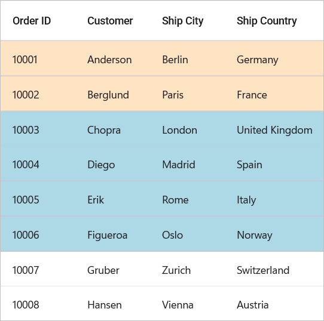

## Style a particular row based on row index
Styling can be applied to a particular row based on RowIndex property by writing the style for the [DataGridRow](https://help.syncfusion.com/cr/maui/Syncfusion.Maui.DataGrid.DataGridRow.html) TargetType.



<ContentPage.Resources>
    <local:ColorConverter x:Key="converter"/>
    
</ContentPage.Resources>

<syncfusion:SfDataGrid x:Name="dataGrid"
                       ItemsSource="{Binding Orders}">
</syncfusion:SfDataGrid>


using System;
using System.Globalization;
using Microsoft.Maui.Controls;
using Microsoft.Maui.Graphics;
using Syncfusion.Maui.DataGrid;

public class ColorConverter : IValueConverter
{
    object? IValueConverter.Convert(object? value, Type targetType, object? parameter, CultureInfo? info)
    {
        if (value is not DataGridRow dataGridRow || dataGridRow.DataRow == null)
            return Colors.White;

        var rowIndex = dataGridRow.DataRow.RowIndex;
        if (rowIndex == 3)
            return Colors.LightBlue;
        else
            return Colors.White;
    }

    object? IValueConverter.ConvertBack(object? value, Type targetType, object? parameter, CultureInfo? culture)
    {
        throw new NotImplementedException();
    }
}



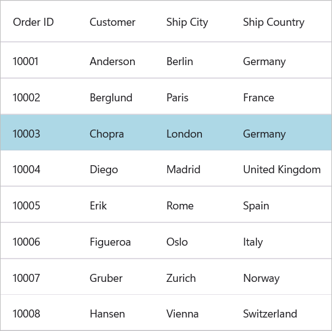

## Style a particular row based on RowData
Styling can be applied to a particular row based on the RowData property by writing the style for the [DataGridRow](https://help.syncfusion.com/cr/maui/Syncfusion.Maui.DataGrid.DataGridRow.html) TargetType.



<ContentPage.Resources>
    <local:ColorConverter x:Key="converter"/>
    
</ContentPage.Resources>

<syncfusion:SfDataGrid x:Name="dataGrid"
                       ItemsSource="{Binding Orders}">
</syncfusion:SfDataGrid>


using System;
using System.Globalization;
using Microsoft.Maui.Controls;
using Microsoft.Maui.Graphics;
using Syncfusion.Maui.DataGrid;

public class ColorConverter : IValueConverter
{
    object? IValueConverter.Convert(object? value, Type targetType, object? parameter, CultureInfo? info)
    {
        if (value is not DataGridRow dataGridRow || dataGridRow.DataRow == null)
            return Colors.White;

        var rowData = dataGridRow.DataRow.RowData;
        var viewModel = dataGridRow.DataGrid?.BindingContext as OrderInfoViewModel;
        
        if (viewModel?.Orders != null && rowData == viewModel.Orders[5])
            return Colors.LightBlue;
        else
            return Colors.White;
    }

    object? IValueConverter.ConvertBack(object? value, Type targetType, object? parameter, CultureInfo? culture)
    {
        throw new NotImplementedException();
    }
}



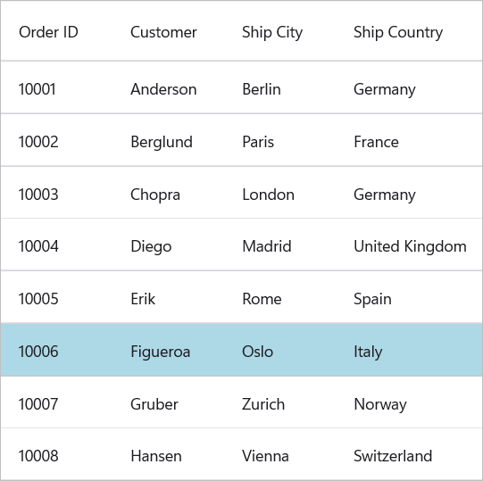

## Conditional style for particular column

The `SfDataGrid` provides the support to apply the conditional style for specific column by using the [CellStyle](https://help.syncfusion.com/cr/maui/Syncfusion.Maui.DataGrid.DataGridColumn.html#Syncfusion_Maui_DataGrid_DataGridColumn_CellStyleProperty) property in the [DataGridColumn](https://help.syncfusion.com/cr/maui/Syncfusion.Maui.DataGrid.DataGridColumn.html).



<ContentPage.Resources>
    <local:ColorConverter x:Key="converter"/>
</ContentPage.Resources>

<syncfusion:SfDataGrid x:Name="dataGrid"
                       ItemsSource="{Binding Orders}">
    <syncfusion:SfDataGrid.Columns>
        <syncfusion:DataGridNumericColumn MappingName="OrderID"
                                          HeaderText="Order ID"
                                          Format="d">
            <syncfusion:DataGridNumericColumn.CellStyle>
                
            </syncfusion:DataGridNumericColumn.CellStyle>
        </syncfusion:DataGridNumericColumn>
    </syncfusion:SfDataGrid.Columns>
</syncfusion:SfDataGrid>


using System;
using System.Globalization;
using Microsoft.Maui.Controls;
using Microsoft.Maui.Graphics;

public class ColorConverter : IValueConverter
{
    object? IValueConverter.Convert(object? value, Type targetType, object? parameter, CultureInfo? info)
    {
        if (value is int orderID && orderID < 10006)
            return Colors.LightBlue;
        else
            return Colors.White;
    }

    object? IValueConverter.ConvertBack(object? value, Type targetType, object? parameter, CultureInfo? culture)
    {
        throw new NotImplementedException();
    }
}



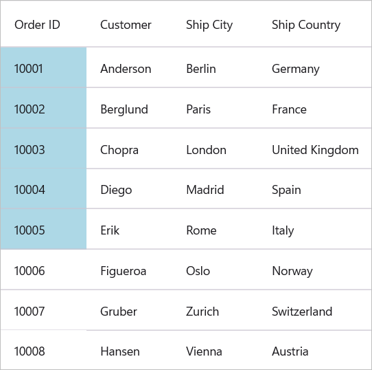

## Conditional styling for row header

The appearance of row header can be customized conditionally based on properties using `converter`, where converter returns the value based on various properties.



<ContentPage.Resources>
    <local:CustomConverter x:Key="converter"/>
    
</ContentPage.Resources>

<syncfusion:SfDataGrid x:Name="dataGrid"
                       ItemsSource="{Binding Orders}"
                       ShowRowHeader="True"
                       ColumnWidthMode="Auto"
                       GridLinesVisibility="Both"
                       HeaderGridLinesVisibility="Both">
    <syncfusion:SfDataGrid.RowHeaderTemplate>
        <DataTemplate>
            <Label Text="{Binding ID}"
                   HorizontalTextAlignment="Center"
                   VerticalTextAlignment="Center"/>
        </DataTemplate>
    </syncfusion:SfDataGrid.RowHeaderTemplate>
</syncfusion:SfDataGrid>


// Model class
using System;
using System.Globalization;
using System.ComponentModel.DataAnnotations;
using Microsoft.Maui.Controls;
using Microsoft.Maui.Graphics;

public class OrderInfo
{
    [Display(AutoGenerateField = false)]
    public int ID { get; set; }
    public int OrderID { get; set; }
    public string Customer { get; set; }
    public string City { get; set; }
}

// Converter class
public class CustomConverter : IValueConverter
{
    public object? Convert(object? value, Type targetType, object? parameter, CultureInfo? culture)
    {
        if (value is not OrderInfo data)
            return Colors.Transparent;

        if (data.ID % 2 == 0)
            return Colors.LightGreen;
        else
            return Colors.Beige;
    }

    public object? ConvertBack(object? value, Type targetType, object? parameter, CultureInfo? culture)
    {
        return null;
    }
}



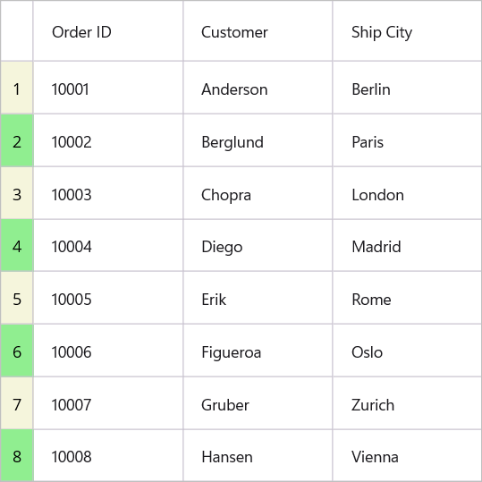

## Conditional cell style
Individual grid cells can be customized conditionally by writing a style with a converter for the [DataGridCell](https://help.syncfusion.com/cr/maui/Syncfusion.Maui.DataGrid.DataGridCell.html) control. The BindingContext is the underlying datasource object.



<ContentPage.Resources>
    <local:ColorConverter x:Key="converter"/>
    
</ContentPage.Resources>

<syncfusion:SfDataGrid x:Name="dataGrid"
                       ItemsSource="{Binding Orders}"
                       GridLinesVisibility="Both"
                       HeaderGridLinesVisibility="Both"/>


using System;
using System.Globalization;
using Microsoft.Maui.Controls;
using Microsoft.Maui.Graphics;

public class ColorConverter : IValueConverter
{
    object? IValueConverter.Convert(object? value, Type targetType, object? parameter, CultureInfo? info)
    {
        if (value is int orderID && orderID < 10006)
            return Colors.LightBlue;
        else
            return Colors.White;
    }

    object? IValueConverter.ConvertBack(object? value, Type targetType, object? parameter, CultureInfo? culture)
    {
        throw new NotImplementedException();
    }
}



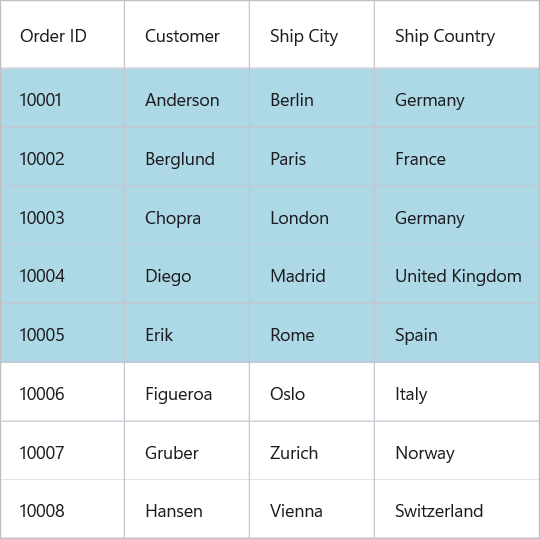

## Style a cell based on MappingName and RowColumnIndex
Styling can be applied to a particular cell based on RowIndex, ColumnIndex and MappingName property of the column by writing the style for the [DataGridCell](https://help.syncfusion.com/cr/maui/Syncfusion.Maui.DataGrid.DataGridCell.html) TargetType.



<ContentPage.Resources>
    <local:ColorConverter x:Key="converter"/>
    <local:ForeColorConverter x:Key="foreColorconverter"/>
    
</ContentPage.Resources>

<syncfusion:SfDataGrid x:Name="dataGrid"
                       ItemsSource="{Binding Orders}"/>


using System;
using System.Globalization;
using Microsoft.Maui.Controls;
using Microsoft.Maui.Graphics;
using Syncfusion.Maui.DataGrid;

public class ColorConverter : IValueConverter
{
    public object? Convert(object? value, Type targetType, object? parameter, CultureInfo? info)
    {
        if (value is not DataGridCell gridCell || gridCell.DataColumn?.DataGridColumn == null)
            return null;

        var columnIndex = gridCell.DataColumn.ColumnIndex;
        var rowIndex = gridCell.DataColumn.RowIndex;
        var mappingName = gridCell.DataColumn.DataGridColumn.MappingName;
        
        if (columnIndex == 0 && rowIndex % 3 == 1)
            return Colors.BlueViolet;
        else if (mappingName == "Country")
            return Colors.CornflowerBlue;
        else if (columnIndex == 1 && rowIndex % 4 == 0)
            return Colors.YellowGreen;
        else if (columnIndex == 2 && rowIndex % 2 == 1)
            return Colors.PaleVioletRed;
        
        return Colors.White;
    }

    public object? ConvertBack(object? value, Type targetType, object? parameter, CultureInfo? culture)
    {
        throw new NotImplementedException();
    }
}


using System;
using System.Globalization;
using Microsoft.Maui.Controls;
using Microsoft.Maui.Graphics;
using Syncfusion.Maui.DataGrid;

public class ForeColorConverter : IValueConverter
{
    public object? Convert(object? value, Type targetType, object? parameter, CultureInfo? info)
    {
        if (value is not DataGridCell gridCell || gridCell.DataColumn?.DataGridColumn == null)
            return null;

        var columnIndex = gridCell.DataColumn.ColumnIndex;
        var rowIndex = gridCell.DataColumn.RowIndex;
        var mappingName = gridCell.DataColumn.DataGridColumn.MappingName;
        
        if (columnIndex == 0 && rowIndex % 3 == 1)
            return Colors.Wheat;
        else if (mappingName == "Country")
            return Colors.White;
        else if (columnIndex == 1 && rowIndex % 4 == 0)
            return Colors.Red;
        else if (columnIndex == 2 && rowIndex % 2 == 1)
            return Colors.Yellow;

        return Colors.Black;
    }

    public object? ConvertBack(object? value, Type targetType, object? parameter, CultureInfo? culture)
    {
        throw new NotImplementedException();
    }
}




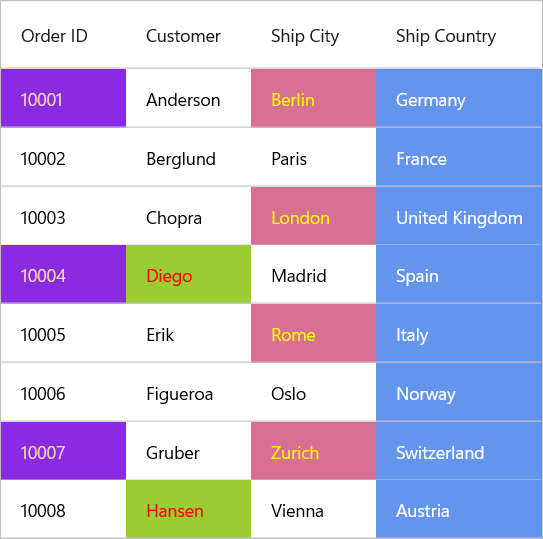

## Style a cell based on RowIndex and ColumnIndex
Styling can be applied to a particular cell based on RowIndex and ColumnIndex property by writing the style for the [DataGridCell](https://help.syncfusion.com/cr/maui/Syncfusion.Maui.DataGrid.DataGridCell.html) TargetType.



<ContentPage.Resources>
    <local:ColorConverter x:Key="converter"/>
    <local:ForeColorConverter x:Key="foreColorconverter"/>
    
</ContentPage.Resources>

<syncfusion:SfDataGrid x:Name="dataGrid"
                       ItemsSource="{Binding Orders}"/>


using System;
using System.Globalization;
using Microsoft.Maui.Controls;
using Microsoft.Maui.Graphics;
using Syncfusion.Maui.DataGrid;

public class ColorConverter : IValueConverter
{
    public object? Convert(object? value, Type targetType, object? parameter, CultureInfo? info)
    {
        if (value is not DataGridCell gridCell || gridCell.DataColumn == null)
            return null;

        var columnIndex = gridCell.DataColumn.ColumnIndex;
        var rowIndex = gridCell.DataColumn.RowIndex;
        
        if (columnIndex == 0 && rowIndex == 1)
            return Colors.BlueViolet;
        
        return Colors.White;
    }

    public object? ConvertBack(object? value, Type targetType, object? parameter, CultureInfo? culture)
    {
        throw new NotImplementedException();
    }
}


using System;
using System.Globalization;
using Microsoft.Maui.Controls;
using Microsoft.Maui.Graphics;
using Syncfusion.Maui.DataGrid;

public class ForeColorConverter : IValueConverter
{
    public object? Convert(object? value, Type targetType, object? parameter, CultureInfo? info)
    {
        if (value is not DataGridCell gridCell || gridCell.DataColumn == null)
            return null;

        var columnIndex = gridCell.DataColumn.ColumnIndex;
        var rowIndex = gridCell.DataColumn.RowIndex;
        
        if (columnIndex == 0 && rowIndex == 1)
            return Colors.White;
        
        return Colors.Black;
    }

    public object? ConvertBack(object? value, Type targetType, object? parameter, CultureInfo? culture)
    {
        throw new NotImplementedException();
    }
}



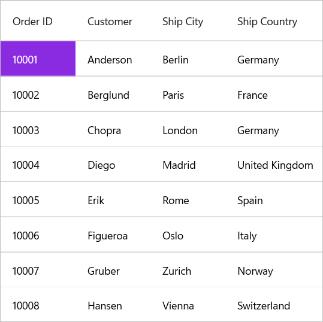

### Customizing the BorderColor of a cell
Individual cells can have their border color customized based on RowIndex and ColumnIndex properties by setting the `BorderColor` property in DataGridCell using a style for the [DataGridCell](https://help.syncfusion.com/cr/maui/Syncfusion.Maui.DataGrid.DataGridCell.html)



<ContentPage.Resources>
    <ResourceDictionary>
        <local:BorderColorConverter x:Key="converter"/>
        
    </ResourceDictionary>
</ContentPage.Resources>

<syncfusion:SfDataGrid x:Name="dataGrid"
                       ItemsSource="{Binding Orders}"
                       GridLinesVisibility="Both"
                       HeaderGridLinesVisibility="Both"/>


using System;
using System.Globalization;
using Microsoft.Maui.Controls;
using Microsoft.Maui.Graphics;
using Syncfusion.Maui.DataGrid;

public class BorderColorConverter : IValueConverter
{
    public object? Convert(object? value, Type targetType, object? parameter, CultureInfo? culture)
    {
        if (value is not DataGridCell gridCell || gridCell.DataColumn == null)
            return Colors.Transparent;

        if (gridCell.DataColumn.RowIndex == 3 && gridCell.DataColumn.ColumnIndex == 2)
            return Colors.Blue;

        return Colors.Transparent;
    }

    public object? ConvertBack(object? value, Type targetType, object? parameter, CultureInfo? culture)
    {
        throw new NotImplementedException();
    }
}



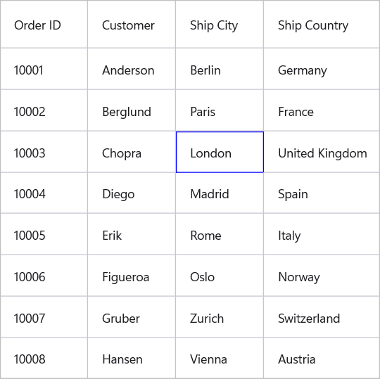

## Style a cell based on cell value
Styling can be applied to a particular cell based on CellValue property by writing the style for the [DataGridCell](https://help.syncfusion.com/cr/maui/Syncfusion.Maui.DataGrid.DataGridCell.html) TargetType.



<ContentPage.Resources>
    <local:ColorConverter x:Key="converter"/>
    <local:ForeColorConverter x:Key="foreColorConverter"/>
    
</ContentPage.Resources>

<syncfusion:SfDataGrid x:Name="dataGrid"
                       ItemsSource="{Binding Orders}"/>


using System;
using System.Globalization;
using Microsoft.Maui.Controls;
using Microsoft.Maui.Graphics;
using Syncfusion.Maui.DataGrid;

public class ColorConverter : IValueConverter
{
    public object? Convert(object? value, Type targetType, object? parameter, CultureInfo? info)
    {
        if (value is not DataGridCell gridCell || gridCell.DataColumn == null)
            return null;

        var cellValue = gridCell.DataColumn.CellValue;
        if (cellValue?.Equals("Diego") == true)
            return Colors.LightBlue;

        return Colors.White;
    }

    public object? ConvertBack(object? value, Type targetType, object? parameter, CultureInfo? culture)
    {
        throw new NotImplementedException();
    }
}


using System;
using System.Globalization;
using Microsoft.Maui.Controls;
using Microsoft.Maui.Graphics;
using Syncfusion.Maui.DataGrid;

public class ForeColorConverter : IValueConverter
{
    public object? Convert(object? value, Type targetType, object? parameter, CultureInfo? info)
    {
        if (value is not DataGridCell gridCell || gridCell.DataColumn == null)
            return null;

        var cellValue = gridCell.DataColumn.CellValue;
        if (cellValue?.Equals("Diego") == true)
            return Colors.Red;

        return Colors.Black;
    }

    public object? ConvertBack(object? value, Type targetType, object? parameter, CultureInfo? culture)
    {
        throw new NotImplementedException();
    }
}



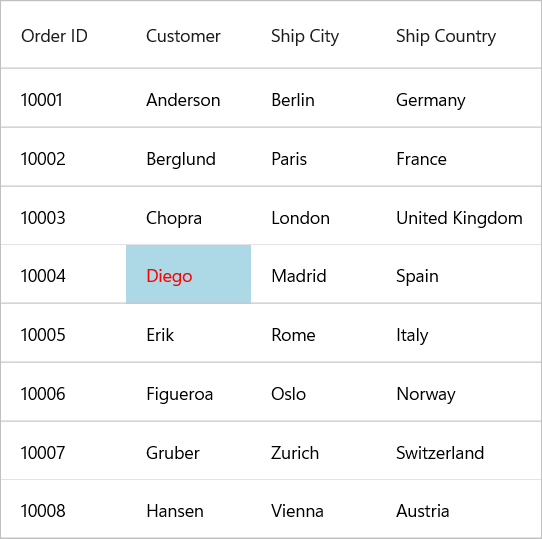

## Caption summary cell style

### Conditional styling of caption summary cells using converter

The appearance of caption summary cells can be customized conditionally based on the [SummaryValues](https://help.syncfusion.com/cr/maui/Syncfusion.Maui.DataGrid.SummaryDetails.html#Syncfusion_Maui_DataGrid_SummaryDetails_SummaryValues) property by using a converter that returns values based on summary aggregates. 



<ContentPage.Resources>
    <local:ColorConverter x:Key="converter"/>
    
</ContentPage.Resources>

<syncfusion:SfDataGrid x:Name="dataGrid"
                       ItemsSource="{Binding Orders}"
                       AllowGroupExpandCollapse="True">
    // Group the data based on the City column
    <syncfusion:SfDataGrid.GroupColumnDescriptions>
        <syncfusion:GroupColumnDescription ColumnName="City"/>
    </syncfusion:SfDataGrid.GroupColumnDescriptions>
    // Display the cities of countries in the caption summary row
    <syncfusion:SfDataGrid.CaptionSummaryRow>
        <syncfusion:DataGridSummaryRow Name="CaptionSummary"
                                       ShowSummaryInRow="True"
                                       Title="Number of cities : {CaptionSummaryColumn}">
            <syncfusion:DataGridSummaryRow.SummaryColumns>
                <syncfusion:DataGridSummaryColumn Name="CaptionSummaryColumn"
                                                  Format="{}{Count}"
                                                  MappingName="City"
                                                  SummaryType="CountAggregate"/>
            </syncfusion:DataGridSummaryRow.SummaryColumns>
        </syncfusion:DataGridSummaryRow>
    </syncfusion:SfDataGrid.CaptionSummaryRow>
</syncfusion:SfDataGrid>


using System;
using System.Globalization;
using System.Linq;
using Microsoft.Maui.Controls;
using Microsoft.Maui.Graphics;
using Syncfusion.Maui.DataGrid;

public class ColorConverter : IValueConverter
{
    public object? Convert(object? value, Type targetType, object? parameter, CultureInfo? culture)
    {
        if (value is not Group group || group.SummaryDetails?.SummaryValues == null || group.SummaryDetails.SummaryValues.Count == 0)
            return Colors.LightBlue;

        var summaryValue = group.SummaryDetails.SummaryValues[0];
        var aggregateValue = summaryValue.AggregateValues.ElementAt(0);
        var calculatedValue = aggregateValue.Value;

        // Custom condition is checked
        if (calculatedValue is int intValue && intValue < 3)
            return Colors.LightGreen;

        return Colors.LightBlue;
    }

    public object? ConvertBack(object? value, Type targetType, object? parameter, CultureInfo? culture)
    {
        return null;
    }
}



Here, caption summary cells are customized based on the `City` column summary value.

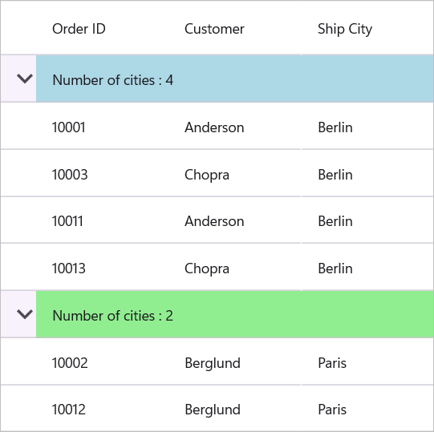

## Group summary cell style

Group summary cells can be customized conditionally by getting particular summary value from `SummaryValues` through converter. Likewise, you can also customize the group summary cell based on various properties exposed in [DataGridSummaryRow](https://help.syncfusion.com/cr/maui/Syncfusion.Maui.DataGrid.DataGridSummaryRow.html) (example: [ShowSummaryInRow](https://help.syncfusion.com/cr/maui/Syncfusion.Maui.DataGrid.DataGridSummaryRow.html#Syncfusion_Maui_DataGrid_DataGridSummaryRow_ShowSummaryInRow) property).

### Conditional styling of group summary cell using converter

The appearance of group summary cell can be customized conditionally based on summary value by using `converter`, where converter returns the value based on summary value.



<ContentPage.Resources>
    <local:ColorConverter x:Key="converter"/>
    
</ContentPage.Resources>

<syncfusion:SfDataGrid x:Name="dataGrid"
                       ItemsSource="{Binding Orders}"
                       AllowGroupExpandCollapse="True">
    // Group the data based on the Country column
    <syncfusion:SfDataGrid.GroupColumnDescriptions>
        <syncfusion:GroupColumnDescription ColumnName="City"/>
    </syncfusion:SfDataGrid.GroupColumnDescriptions>
    // Display the count of records in the caption summary row
    <syncfusion:SfDataGrid.CaptionSummaryRow>
        <syncfusion:DataGridSummaryRow Name="CaptionSummary"
                                       ShowSummaryInRow="True"
                                       Title="Number of cities : {CaptionSummaryColumn}">
            <syncfusion:DataGridSummaryRow.SummaryColumns>
                <syncfusion:DataGridSummaryColumn Name="CaptionSummaryColumn"
                                                  Format="{}{Count}"
                                                  MappingName="City"
                                                  SummaryType="CountAggregate"/>
            </syncfusion:DataGridSummaryRow.SummaryColumns>
        </syncfusion:DataGridSummaryRow>
    </syncfusion:SfDataGrid.CaptionSummaryRow>
    // Display the count of Orders in the group summary row
    <syncfusion:SfDataGrid.GroupSummaryRows>
        <syncfusion:DataGridSummaryRow Title="Number of orders : {Orders}"
                                       ShowSummaryInRow="True">
            <syncfusion:DataGridSummaryRow.SummaryColumns>
                <syncfusion:DataGridSummaryColumn Name="Orders"
                                                  MappingName="OrderID"
                                                  Format="{}{Count}"
                                                  SummaryType="CountAggregate">
                </syncfusion:DataGridSummaryColumn>
            </syncfusion:DataGridSummaryRow.SummaryColumns>
        </syncfusion:DataGridSummaryRow>
    </syncfusion:SfDataGrid.GroupSummaryRows>
</syncfusion:SfDataGrid>


using System;
using System.Globalization;
using System.Linq;
using Microsoft.Maui.Controls;
using Microsoft.Maui.Graphics;
using Syncfusion.Maui.DataGrid;

public class ColorConverter : IValueConverter
{
    public object? Convert(object? value, Type targetType, object? parameter, CultureInfo? culture)
    {
        if (value is not SummaryRecordEntry summaryEntry || summaryEntry.SummaryValues == null || summaryEntry.SummaryValues.Count == 0)
            return Colors.LightBlue;

        var summaryValue = summaryEntry.SummaryValues[0];
        var aggregateValue = summaryValue.AggregateValues.ElementAt(0);
        var calculatedValue = aggregateValue.Value;

        // Custom condition is checked
        if (calculatedValue is int intValue && intValue % 2 == 0)
            return Colors.LightGreen;

        return Colors.LightBlue;
    }

    public object? ConvertBack(object? value, Type targetType, object? parameter, CultureInfo? culture)
    {
        return null;
    }
}



Here, group summary cells are customized based on the `OrderID` column summary value.

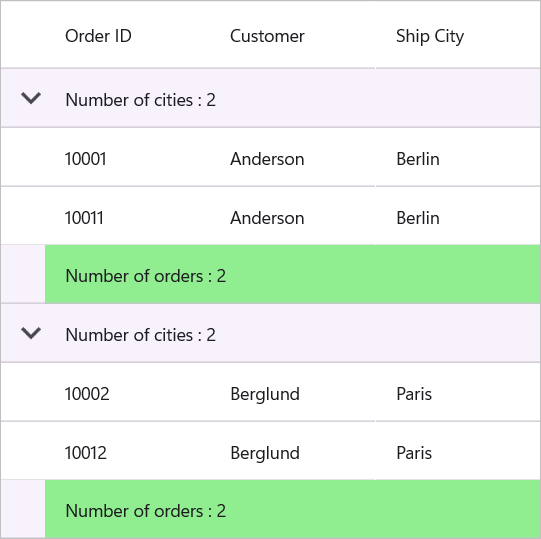

## Table summary cell

Table summary cells can be customized conditionally by getting particular summary value from `SummaryValues` through `converter`. Likewise, you can also customize the table summary cell based on various properties exposed in [DataGridTableSummaryRow](https://help.syncfusion.com/cr/maui/Syncfusion.Maui.DataGrid.DataGridTableSummaryRow.html) (example: `ShowSummaryInRow` property).

### Conditional styling of table summary cells using converter

The appearance of table summary cell can be customized conditionally based on summary value using `converter`, where converter returns the value based on summary value. 



<ContentPage.Resources>
    <local:ColorConverter x:Key="converter"/>
    
</ContentPage.Resources>

<syncfusion:SfDataGrid x:Name="dataGrid"
                       ItemsSource="{Binding Orders}">
    // Display the count of Orders in the table summary row
    <syncfusion:SfDataGrid.TableSummaryRows>
        <syncfusion:DataGridTableSummaryRow Title="Total Orders :{TotalOrders}"
                                            Position="Bottom"
                                            ShowSummaryInRow="True">
            <syncfusion:DataGridTableSummaryRow.SummaryColumns>
                <syncfusion:DataGridSummaryColumn Name="TotalOrders"
                                                  Format="{}{Count}"
                                                  MappingName="OrderID"
                                                  SummaryType="CountAggregate"/>
            </syncfusion:DataGridTableSummaryRow.SummaryColumns>
        </syncfusion:DataGridTableSummaryRow>
        <syncfusion:DataGridTableSummaryRow Title="Sum of Orders :{SumOfOrders}"
                                            Position="Top"
                                            ShowSummaryInRow="False">
            <syncfusion:DataGridTableSummaryRow.SummaryColumns>
                <syncfusion:DataGridSummaryColumn Name="SumOfOrders"
                                                  Format="{}{Sum:C0}"
                                                  MappingName="OrderID"
                                                  SummaryType="DoubleAggregate"/>
            </syncfusion:DataGridTableSummaryRow.SummaryColumns>
        </syncfusion:DataGridTableSummaryRow>
    </syncfusion:SfDataGrid.TableSummaryRows>
</syncfusion:SfDataGrid>


using System;
using System.Globalization;
using System.Linq;
using Microsoft.Maui.Controls;
using Microsoft.Maui.Graphics;
using Syncfusion.Maui.DataGrid;

public class ColorConverter : IValueConverter
{
    public object? Convert(object? value, Type targetType, object? parameter, CultureInfo? culture)
    {
        if (value is not SummaryRecordEntry summaryEntry || summaryEntry.SummaryValues == null || summaryEntry.SummaryValues.Count == 0)
            return Colors.LightBlue;

        var summaryValue = summaryEntry.SummaryValues[0];
        var aggregateValue = summaryValue.AggregateValues.ElementAt(0);
        var calculatedValue = aggregateValue.Value;

        // Custom condition is checked
        if (aggregateValue.Key == "Count")
        {
            if (calculatedValue is int intValue && intValue % 2 == 0)
                return Colors.LightGreen;
            return Colors.LightBlue;
        }
        else
        {
            if (calculatedValue is double doubleValue && doubleValue % 2 == 0)
                return Colors.LightGreen;
            return Colors.LightBlue;
        }
    }

    public object? ConvertBack(object? value, Type targetType, object? parameter, CultureInfo? culture)
    {
        return null;
    }
}



Here, table summary cells are customized based on the `OrderID` column summary value.

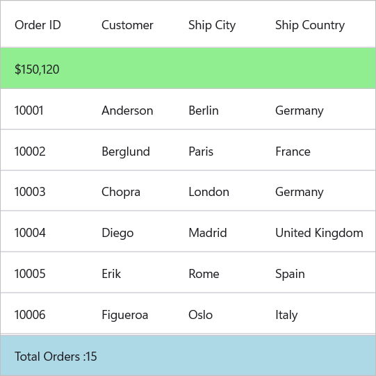

## Unbound row cell

Unbound row cells can be customized based on various properties exposed in [DataGridUnboundRow](https://help.syncfusion.com/cr/maui/Syncfusion.Maui.DataGrid.DataGridUnboundRow.html) (example: the `Position` property).

### Conditional styling of unbound row cell using converter

The appearance of unbound row cells can be customized conditionally based on their properties using a converter that returns values based on various unbound row characteristics. 



<ContentPage.Resources>
    <local:ColorConverter x:Key="converter"/>
    
</ContentPage.Resources>

<syncfusion:SfDataGrid x:Name="dataGrid"
                       ItemsSource="{Binding Orders}">
    <syncfusion:SfDataGrid.UnboundRows>
        <syncfusion:DataGridUnboundRow Position="Top"/>
        <syncfusion:DataGridUnboundRow Position="FixedTop"/>
    </syncfusion:SfDataGrid.UnboundRows>
</syncfusion:SfDataGrid>


using System;
using System.Globalization;
using Microsoft.Maui.Controls;
using Microsoft.Maui.Graphics;
using Syncfusion.Maui.DataGrid;

public class ColorConverter : IValueConverter
{
    public object? Convert(object? value, Type targetType, object? parameter, CultureInfo? culture)
    {
        if (value is not DataGridUnboundRowEventArgs unboundValue || unboundValue.GridUnboundRow == null)
            return Colors.LightGreen;

        if (unboundValue.GridUnboundRow.Position == DataGridUnboundRowPosition.Top)
            return Colors.LightBlue;

        return Colors.LightGreen;
    }

    public object? ConvertBack(object? value, Type targetType, object? parameter, CultureInfo? culture)
    {
        return null;
    }
}



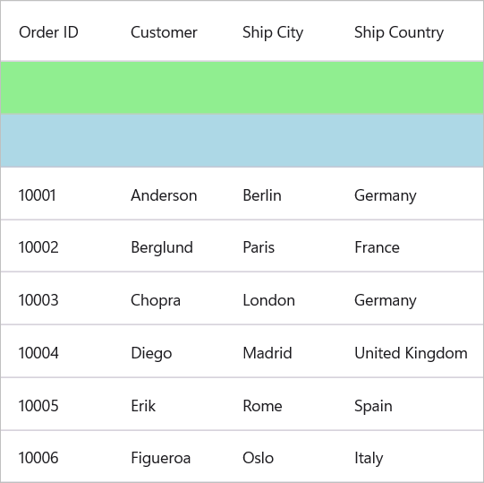
