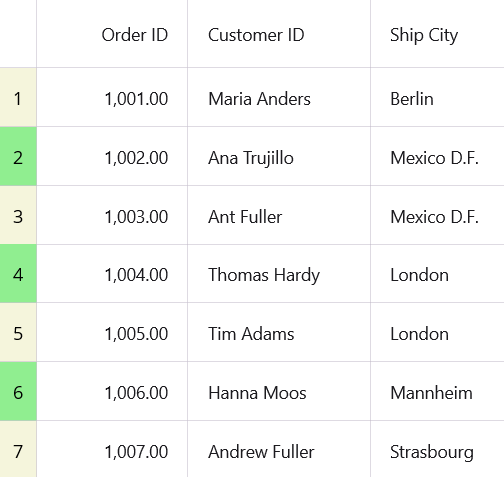
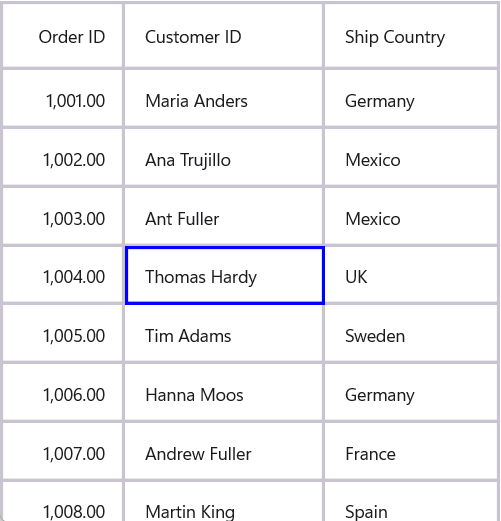
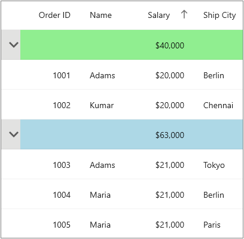
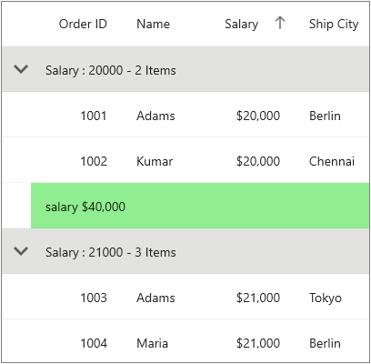
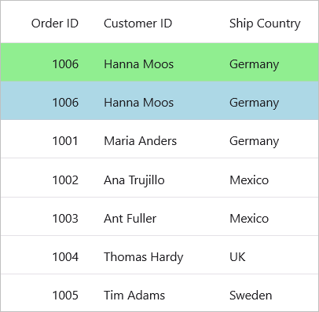

# Conditional Styling in .NET MAUI DataGrid (SfDataGrid)
The [SfDataGrid](https://help.syncfusion.com/cr/maui/Syncfusion.Maui.DataGrid.html) allows you to customize the style of the individual cells and rows based on the requirements. 

To get start quickly with apply conditional styling in .NET MAUI DataGrid, you can check on this video:

 <iframe id='MAUIDataGridVideoTutorial' src="https://www.youtube.com/embed/1HHHz5isIM4?start=504"></iframe>

## Conditional row style
The data rows can be customized conditionally by writing the style with a converter for the [DataGridRow](https://help.syncfusion.com/cr/maui/Syncfusion.Maui.DataGrid.DataGridRow.html) control. Its BindingContext is the underlying datasource object.



<ContentPage xmlns:syncfusion="http://schemas.syncfusion.com/maui">
    <ContentPage.Resources>
        <local:ColorConverter x:Key="converter"/>
        
    </ContentPage.Resources>
</ContentPage>


public class ColorConverter : IValueConverter
{
    object IValueConverter.Convert(object value, Type targetType, object parameter, CultureInfo info)
    {
        var input = (value as OrderInfo).OrderID;
        if (input < 1003)
            return Colors.Bisque;
        else if (input < 1007)
            return Colors.LightBlue;
        else
            return Colors.White;
    }
    public object ConvertBack(object value, Type targetType, object parameter, CultureInfo culture)
    {
        throw new NotImplementedException();
    }
}



## Style a particular row based on row index
Styling can be applied to a particular row based on RowIndex property by writing the style for the [DataGridRow](https://help.syncfusion.com/cr/maui/Syncfusion.Maui.DataGrid.DataGridRow.html) TargetType.



<ContentPage xmlns:syncfusion="http://schemas.syncfusion.com/maui">
    <ContentPage.Resources>
        <local:ColorConverter x:Key="converter"/>
        
    </ContentPage.Resources>
</ContentPage>


public class ColorConverter : IValueConverter
{
    object IValueConverter.Convert(object value, Type targetType, object parameter, CultureInfo info)
    {
        var dataGridRow = value as DataGridRow;
        var rowIndex = dataGridRow.DataRow.RowIndex;
        if (rowIndex == 3)
           return Colors.LightBlue;
        else
            return Colors.White;
    }
    public object ConvertBack(object value, Type targetType, object parameter, CultureInfo culture)
    {
        throw new NotImplementedException();
    }
}



## Style a particular row based on RowData
Styling can be applied to a particular row based on the RowData property by writing the style for the [DataGridRow](https://help.syncfusion.com/cr/maui/Syncfusion.Maui.DataGrid.DataGridRow.html) TargetType.



<ContentPage xmlns:syncfusion="http://schemas.syncfusion.com/maui">
    <ContentPage.Resources>
        <local:ColorConverter x:Key="converter"/>
        
    </ContentPage.Resources>
</ContentPage>


public class ColorConverter : IValueConverter
{
    object IValueConverter.Convert(object value, Type targetType, object parameter, CultureInfo info)
    {
        var dataGridRow = value as DataGridRow;
        var rowData = dataGridRow.DataRow.RowData;
        if(rowData == (dataGridRow.DataGrid.BindingContext as ViewModel).OrderInfoCollection[5])
            return Colors.LightBlue;
        else
            return Colors.White;
    }
    public object ConvertBack(object value, Type targetType, object parameter, CultureInfo culture)
    {
        throw new NotImplementedException();
    }
}



## Conditional style for particular column

The `SfDataGrid` provides the support to apply the conditional style for specific column by using the [CellStyle](https://help.syncfusion.com/cr/maui/Syncfusion.Maui.DataGrid.DataGridColumn.html#Syncfusion_Maui_DataGrid_DataGridColumn_CellStyleProperty) property in the [DataGridColumn](https://help.syncfusion.com/cr/maui/Syncfusion.Maui.DataGrid.DataGridColumn.html).



<ContentPage xmlns:syncfusion="http://schemas.syncfusion.com/maui">
    <ContentPage.Resources>
        <local:ColorConverter x:Key="converter"/>
    </ContentPage.Resources>
    <ContentPage.Content>
        <syncfusion:SfDataGrid ItemsSource="{Binding OrderInfoCollection}">
            <syncfusion:SfDataGrid.Columns>
                <syncfusion:DataGridNumericColumn MappingName="OrderID"
                                                HeaderText="Order ID"
                                                Format="d">
                    <syncfusion:DataGridNumericColumn.CellStyle>
                        
                    </syncfusion:DataGridNumericColumn.CellStyle>
                </syncfusion:DataGridNumericColumn>
            </syncfusion:SfDataGrid.Columns>
        </syncfusion:SfDataGrid>
    </ContentPage.Content>
</ContentPage>


public class ColorConverter : IValueConverter
{
    object IValueConverter.Convert(object value, Type targetType, object parameter, CultureInfo info)
    {
        if ((int)value < 1006)
            return Colors.LightBlue;
        else
            return Colors.White;
    }
    public object ConvertBack(object value, Type targetType, object parameter, CultureInfo culture)
    {
        throw new NotImplementedException();
    }
}



## Conditional styling for row header

The appearance of row header can be customized conditionally based on properties using `converter`, where converter returns the value based on various properties.



 <ContentPage.Resources>
     <local:CustomConverter x:Key="converter"/>
     
 </ContentPage.Resources>
 <syncfusion:SfDataGrid x:Name="dataGrid"
                        ShowRowHeader="True"
                        ColumnWidthMode="Auto"
                        ItemsSource="{Binding OrderInfoCollection}">
    <syncfusion:SfDataGrid.RowHeaderTemplate>
        <DataTemplate>
            <Label Text="{Binding ID}" HorizontalTextAlignment = "Center" VerticalTextAlignment = "Center"/>
        </DataTemplate>
    </syncfusion:SfDataGrid.RowHeaderTemplate>
</syncfusion:SfDataGrid>



 public class CustomConverter : IValueConverter
 {
     public object Convert(object? value, Type targetType, object parameter, System.Globalization.CultureInfo culture)
     {
         var data = value as OrderInfo;
         if (data?.ID %2 == 0 )
             return Colors.LightGreen;
         else
             return Colors.Beige;
     }
     public object ConvertBack(object value, Type targetType, object parameter, System.Globalization.CultureInfo culture)
     {
         return null;
     }
 }



## Conditional cell style
The grid cell can be customized conditionally by writing the style with a converter for the [DataGridCell](https://help.syncfusion.com/cr/maui/Syncfusion.Maui.DataGrid.DataGridCell.html) control. Its BindingContext is the underlying datasource object.



<ContentPage xmlns:syncfusion="http://schemas.syncfusion.com/maui">
    <ContentPage.Resources>
        <local:ColorConverter x:Key="converter"/>
        
    </ContentPage.Resources>
</ContentPage>


public class ColorConverter : IValueConverter
{
    object IValueConverter.Convert(object value, Type targetType, object parameter, CultureInfo info)
    {
        if ((int)value < 1006)
            return Colors.LightBlue;
        else
            return Colors.White;
    }
    public object ConvertBack(object value, Type targetType, object parameter, CultureInfo culture)
    {
        throw new NotImplementedException();
    }
}



## Style a cell based on MappingName and RowColumnIndex
Styling can be applied to a particular cell based on RowIndex, ColumnIndex and MappingName property of the column by writing the style for the [DataGridCell](https://help.syncfusion.com/cr/maui/Syncfusion.Maui.DataGrid.DataGridCell.html) TargetType.



<ContentPage xmlns:syncfusion="http://schemas.syncfusion.com/maui">
    <ContentPage.Resources>
        <local:ColorConverter x:Key="converter"/>
        <local:ForeColorConverter x:Key="foreColorconverter"/>
        
    </ContentPage.Resources>
</ContentPage>


public class ColorConverter : IValueConverter
{
    public object? Convert(object? value, Type targetType, object? parameter, CultureInfo info)
    {
        var gridCell = (value as DataGridCell);
        if (gridCell == null || gridCell.DataColumn == null || gridCell.DataColumn.DataGridColumn == null)
            return null;
                   
        var columnIndex = gridCell.DataColumn.ColumnIndex;
        var rowIndex = gridCell.DataColumn.RowIndex;
        var mappingName = gridCell.DataColumn.DataGridColumn.MappingName;
        if (columnIndex == 0 && rowIndex % 3 == 1)
            return Colors.BlueViolet;
        else if (mappingName == "ShipCountry")
            return Colors.CornflowerBlue;
        else if (columnIndex == 1 && rowIndex % 4 == 0)
            return Colors.YellowGreen;
        else if (columnIndex == 3 && rowIndex % 6 == 1)
            return Colors.PaleVioletRed;
        return Colors.White;
    }
    public object? ConvertBack(object? value, Type targetType, object? parameter, CultureInfo culture)
    {
        throw new NotImplementedException();
    }
}


public class ForeColorConverter : IValueConverter
{
    public object? Convert(object? value, Type targetType, object? parameter, CultureInfo info)
    {
        var gridCell = (value as DataGridCell);
        if (gridCell == null || gridCell.DataColumn == null || gridCell.DataColumn.DataGridColumn == null)
            return null;
        var columnIndex = gridCell.DataColumn.ColumnIndex;
        var rowIndex = gridCell.DataColumn.RowIndex;
        var mappingName = gridCell.DataColumn.DataGridColumn.MappingName;
        if (columnIndex == 0 && rowIndex % 3 == 1)
            return Colors.Wheat;
        else if (mappingName == "ShipCountry")
            return Colors.White;
        else if (columnIndex == 1 && rowIndex % 4 == 0)
            return Colors.Red;
        else if (columnIndex == 3 && rowIndex % 6 == 1)
            return Colors.Yellow;

        return Colors.Black;
    }
    public object ConvertBack(object? value, Type targetType, object? parameter, CultureInfo culture)
    {
        throw new NotImplementedException();
    }
}




## Style a cell based on RowIndex and ColumnIndex
Styling can be applied to a particular cell based on RowIndex and ColumnIndex property by writing the style for the [DataGridCell](https://help.syncfusion.com/cr/maui/Syncfusion.Maui.DataGrid.DataGridCell.html) TargetType.



<ContentPage xmlns:syncfusion="http://schemas.syncfusion.com/maui">
    <ContentPage.Resources>
        <local:ColorConverter x:Key="converter"/>
        <local:ForeColorConverter x:Key="foreColorconverter"/>
        
    </ContentPage.Resources>
</ContentPage>


public class ColorConverter : IValueConverter
{
    public object? Convert(object? value, Type targetType, object? parameter, CultureInfo info)
    {
        var gridCell = (value as DataGridCell);
        if (gridCell == null || gridCell.DataColumn == null)
            return null;
        var columnIndex = gridCell.DataColumn.ColumnIndex;
        var rowIndex = gridCell.DataColumn.RowIndex;
        if (columnIndex == 0 && rowIndex == 1)
            return Colors.BlueViolet;
        return Colors.White;
    }
    public object ConvertBack(object? value, Type targetType, object? parameter, CultureInfo culture)
    {
        throw new NotImplementedException();
    }
}


public class ForeColorConverter : IValueConverter
{
    public object? Convert(object? value, Type targetType, object? parameter, CultureInfo info)
    {
        var gridCell = (value as DataGridCell);
        if(gridCell == null || gridCell.DataColumn == null)
            return null;
        var columnIndex = gridCell.DataColumn.ColumnIndex;
        var rowIndex = gridCell.DataColumn.RowIndex;
        if (columnIndex == 0 && rowIndex == 1)
            return Colors.White;
        return Colors.Black;
    }
    public object ConvertBack(object? value, Type targetType, object? parameter, CultureInfo culture)
    {
        throw new NotImplementedException();
    }
}




### Customizing the BorderColor of a cell
<<<<<<< HEAD
You can customize the border color of individual cells in the SfDataGrid based on RowIndex and ColumnIndex property, and setting the `BorderColor` property  in DataGridCell by writing the style for the [DataGridCell](https://help.syncfusion.com/cr/maui/Syncfusion.Maui.DataGrid.DataGridCell.html)
=======
You can customize the border color of individual cells in the SfDataGrid based on RowIndex and ColumnIndex property , and setting the `BorderColor` property  in DataGridCell by writing the style for the [DataGridCell](https://help.syncfusion.com/cr/maui/Syncfusion.Maui.DataGrid.DataGridCell.html)
>>>>>>> 4e562dc72c58d8d728902da74c896d3096c75170



<ContentPage xmlns:syncfusion=http://schemas.syncfusion.com/maui>
   <ContentPage.Resources>
       <ResourceDictionary>
           <local:BorderColorConverter x:Key="converter" />
           
       </ResourceDictionary>
   </ContentPage.Resources>

   <ContentPage.Content>
       <Grid>
          <syncfusion:SfDataGrid x:Name="dataGrid"
                                 ItemsSource="{Binding OrderInfoCollection}"
                                 GridLinesVisibility="Both">
          </syncfusion:SfDataGrid>
        </Grid>
   </ContentPage.Content>
</ContentPage>



public class BorderColorConverter : IValueConverter
{
   public object? Convert(object? value, Type targetType, object? parameter, CultureInfo culture)
   {
       var gridCell = value as DataGridCell;
 
       if (gridCell != null)
       {
           if (gridCell.DataColumn!.RowIndex == 4 && gridCell.DataColumn.ColumnIndex == 3)
               return Colors.Blue;
 
           return Colors.Transparent;
       }

       return Colors.Transparent;
   }

   public object? ConvertBack(object? value, Type targetType, object? parameter, CultureInfo culture)
   {
       throw new NotImplementedException();
   }
}



## Style a cell based on cell value
Styling can be applied to a particular cell based on CellValue property by writing the style for the [DataGridCell](https://help.syncfusion.com/cr/maui/Syncfusion.Maui.DataGrid.DataGridCell.html) TargetType.



<ContentPage xmlns:syncfusion="http://schemas.syncfusion.com/maui">
    <ContentPage.Resources>
        <local:ColorConverter x:Key="converter"/>
        <local:ForeColorConverter x:Key="foreColorconverter"/>
        
    </ContentPage.Resources>
</ContentPage>


public class ColorConverter : IValueConverter
{
    public object? Convert(object? value, Type targetType, object? parameter, CultureInfo info)
    {
        var gridCell = (value as DataGridCell);
        if (gridCell == null || gridCell.DataColumn == null)
            return null;
        var cellValue = gridCell.DataColumn.CellValue;
        if (cellValue != null)
        {
            if (cellValue.Equals("Thomas Hardy"))
                return Colors.LightBlue;
        }
        return Colors.White;
    }
    public object ConvertBack(object? value, Type targetType, object? parameter, CultureInfo culture)
    {
        throw new NotImplementedException();
    }
}


public class ForeColorConverter : IValueConverter
{
    public object? Convert(object? value, Type targetType, object? parameter, CultureInfo info)
    {
        var gridCell = (value as DataGridCell);
        if (gridCell == null || gridCell.DataColumn == null)
            return null;
        var cellValue = gridCell.DataColumn.CellValue;
        if (cellValue != null)
        {
            if (cellValue.Equals("Thomas Hardy"))
                return Colors.Red;
        }
        return Colors.Black;
    }
    public object ConvertBack(object? value, Type targetType, object? parameter, CultureInfo culture)
    {
        throw new NotImplementedException();
    }
}



## Caption summary cell style

### Conditional styling of caption summary cells using converter

The appearance of caption summary cell can be customized conditionally based on [SummaryValues]() by using a `converter`, where converter returns the value based on `SummaryValues`. 



    <ContentPage.Resources>
        <local:ColorConverter x:Key="converter" />
        
    </ContentPage.Resources>
    <syncfusion:SfDataGrid x:Name="dataGrid" 
                        ItemsSource="{Binding OrderInfoCollection}">
            <syncfusion:SfDataGrid.CaptionSummaryRow>
        <syncfusion:DataGridSummaryRow Name="CaptionSummary"
                                ShowSummaryInRow="False"
                                Title="Total Salary: {CaptionSummary}">
            <syncfusion:DataGridSummaryRow.SummaryColumns>
                <syncfusion:DataGridSummaryColumn Name="CaptionSummary"
                                            Format="{}{Sum:C0}"
                                            MappingName="Salary"
                                            SummaryType="DoubleAggregate" />
            </syncfusion:DataGridSummaryRow.SummaryColumns>
        </syncfusion:DataGridSummaryRow>
        </syncfusion:SfDataGrid.CaptionSummaryRow>
    </syncfusion:SfDataGrid>


public class ColorConverter : IValueConverter
{
    public object Convert(object value, Type targetType, object parameter, CultureInfo culture)
    {
        var summaryValue = (value as Group).SummaryDetails.SummaryValues[0];
        var aggregateValue = summaryValue.AggregateValues.ElementAt(0);
        var calculatedValue = aggregateValue.Value;

        //custom condition is checked.

        if ((double)calculatedValue < 45000)
            return Colors.LightGreen;
        return Colors.LightBlue;
    }
    public object ConvertBack(object value, Type targetType, object parameter, CultureInfo culture)
    {
        return null;
    }
}



Here, caption summary cells are customized based on `Salary` summary value.

## Group summary cell style

Group summary cells can be customized conditionally by getting particular summary value from `SummaryValues` through converter. Likewise, you can also customize the group summary cell based on various properties exposed in [DataGridSummaryRow](https://help.syncfusion.com/cr/maui/Syncfusion.Maui.DataGrid.DataGridSummaryRow.html) (example: [ShowSummaryInRow](https://help.syncfusion.com/cr/maui/Syncfusion.Maui.DataGrid.DataGridSummaryRow.html#Syncfusion_Maui_DataGrid_DataGridSummaryRow_ShowSummaryInRow) property).

### Conditional styling of group summary cell using converter

The appearance of group summary cell can be customized conditionally based on summary value by using `converter`, where converter returns the value based on summary value.



    <ContentPage.Resources>
        <local:ColorConverter x:Key="converter" />
        
    </ContentPage.Resources>
    <syncfusion:SfDataGrid x:Name="dataGrid" 
                        ShowGroupDropArea="True"
                        ItemsSource="{Binding OrderInfoCollection}">
            <syncfusion:SfDataGrid.GroupSummaryRows>
            <syncfusion:DataGridSummaryRow Title="salary {Salary}"
                                            ShowSummaryInRow="True">
                <syncfusion:DataGridSummaryRow.SummaryColumns>
                    <syncfusion:DataGridSummaryColumn Name="Salary"
                                                    MappingName="Salary"
                                                    Format="{}{Sum:C0}"
                                                    SummaryType="DoubleAggregate">
                    </syncfusion:DataGridSummaryColumn>
                </syncfusion:DataGridSummaryRow.SummaryColumns>
            </syncfusion:DataGridSummaryRow>
        </syncfusion:SfDataGrid.GroupSummaryRows>
    </syncfusion:SfDataGrid>


public class ColorConverter : IValueConverter
{
    public object Convert(object value, Type targetType, object parameter, CultureInfo culture)
    {
        var summaryValue = (value as SummaryRecordEntry).SummaryValues[0];
        var aggregateValue = summaryValue.AggregateValues.ElementAt(0);
        var calculatedValue = aggregateValue.Value;

        //custom condition is checked.

        if ((double)calculatedValue % 2 == 0)
            return Colors.LightGreen;
        return Colors.LightBlue;
    }
    public object ConvertBack(object value, Type targetType, object parameter, CultureInfo culture)
    {
        return null;
    }
}



Here, group summary cells are customized based on `Salary` summary value.

## Table summary cell

Table summary cells can be customized conditionally by getting particular summary value from `SummaryValues` through `converter`. Likewise, you can also customize the table summary cell based on various properties exposed in [DataGridTableSummaryRow](https://help.syncfusion.com/cr/maui/Syncfusion.Maui.DataGrid.DataGridTableSummaryRow.html) (example: `ShowSummaryInRow` property).

### Conditional styling of table summary cells using converter

The appearance of table summary cell can be customized conditionally based on summary value using `converter`, where converter returns the value based on summary value. 



    <ContentPage.Resources>
        <local:ColorConverter x:Key="converter" />
        
    </ContentPage.Resources>
    <syncfusion:SfDataGrid x:Name="dataGrid"
                        ShowRowHeader="True"
                        ItemsSource="{Binding OrderInfoCollection}">
                <syncfusion:SfDataGrid.TableSummaryRows>
        <syncfusion:DataGridTableSummaryRow Title="Total Salary :{TotalSalary}"
                                        Position="Bottom"
                                        ShowSummaryInRow="True">
            <syncfusion:DataGridTableSummaryRow.SummaryColumns >
                <syncfusion:DataGridSummaryColumn Name="TotalSalary"
                                                Format="{}{Sum:C0}"
                                                MappingName="Salary"
                                                SummaryType="DoubleAggregate">
                </syncfusion:DataGridSummaryColumn>
            </syncfusion:DataGridTableSummaryRow.SummaryColumns>
        </syncfusion:DataGridTableSummaryRow>
            <syncfusion:DataGridTableSummaryRow Title="Total Salary :{TotalSalary}"
                                                Position="Top"
                                                ShowSummaryInRow="False">
                <syncfusion:DataGridTableSummaryRow.SummaryColumns>
                    <syncfusion:DataGridSummaryColumn Name="TotalSalary"
                                                    Format="{}{Sum:C0}"
                                                    MappingName="OrderID"
                                                    SummaryType="DoubleAggregate">
                    </syncfusion:DataGridSummaryColumn>
                </syncfusion:DataGridTableSummaryRow.SummaryColumns>
            </syncfusion:DataGridTableSummaryRow>
        </syncfusion:SfDataGrid.TableSummaryRows>
    </syncfusion:SfDataGrid>


public class ColorConverter : IValueConverter
{
    public object Convert(object value, Type targetType, object parameter, CultureInfo culture)
    {
        var summaryValue = (value as SummaryRecordEntry).SummaryValues[0];
        var aggregateValue = summaryValue.AggregateValues.ElementAt(0);
        var calculatedValue = aggregateValue.Value;

        //custom condition is checked.

        if ((double)calculatedValue % 2 == 0)
            return Colors.LightGreen;
        return Colors.LightBlue;
    }
    public object ConvertBack(object value, Type targetType, object parameter, CultureInfo culture)
    {
        return null;
    }
}



Here, table summary cells are customized based on `Salary` summary value.

## Unbound row cell

Unbound row cells can be customized the unbound row cell based on various properties exposed in [DataGridUnboundRow]() (example: `Position` property).

### Conditional styling of unbound row cell using converter

The appearance of unbound row cell can be customized conditionally based on properties using `converter`, where converter returns the value based on various properties. 



<ContentPage.Resources>
    <local:ColorConverter x:Key="converter" />
    
</ContentPage.Resources>
<syncfusion:SfDataGrid x:Name="dataGrid"
                    ItemsSource="{Binding OrderInfoCollection}">
            <syncfusion:SfDataGrid.UnboundRows>
                <syncfusion:DataGridUnboundRow Position="Top" />
                <syncfusion:DataGridUnboundRow Position="FixedTop" />
            </syncfusion:SfDataGrid.UnboundRows>
</syncfusion:SfDataGrid>


public class ColorConverter : IValueConverter
{
    public object Convert(object value, Type targetType, object parameter, CultureInfo culture)
    {
        var unboundValue = value as DataGridUnboundRowEventArgs;
        if (unboundValue!.GridUnboundRow.Position == DataGridUnboundRowPosition.Top)
        {
            return Colors.LightBlue;
        }
        return Colors.LightGreen;
    }
    public object ConvertBack(object value, Type targetType, object parameter, CultureInfo culture)
    {
        return null;
    }
}



