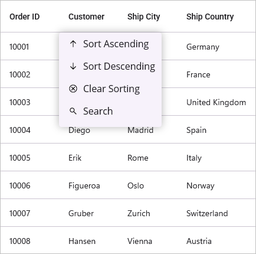
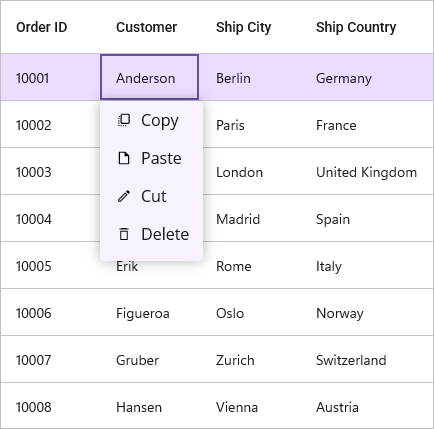
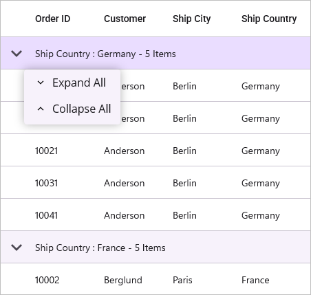
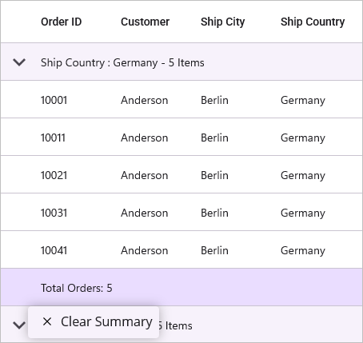
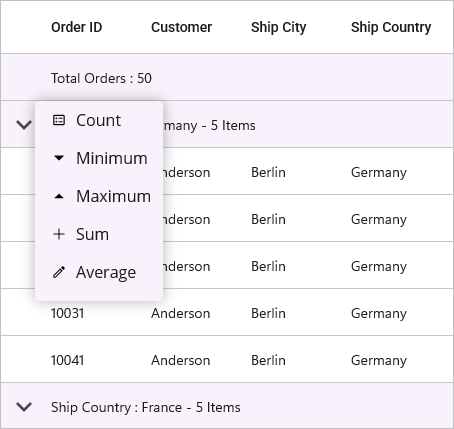

# Context Menu in .NET MAUI DataGrid (SfDataGrid)

## Overview

The `SfDataGrid` control allows you to display a customizable context menu when a user performs a secondary click (right-click on Windows and Mac Catalyst) or a long-press gesture (on Android and iOS) on different parts of the DataGrid.

### Types of Context Menus

You can define context menus for the following elements:

-   **Header**: Context menu for column headers.
-   **Record (Row)**: Context menu for data rows.
-   **Group Caption**: Context menu for group caption rows.
-   **Group Summary**: Context menu for group summary rows.
-   **Table Summary**: Context menu for table summary rows.

Each context menu type provides specific options tailored to the DataGrid element it is associated with.

## Customize Header Context Menu

The header context menu is displayed when the user invokes the context menu on a column header.You can customize the menu items by adding `MenuItem` objects to the `SfDataGrid.HeaderContextMenu` collection.



<syncfusion:SfDataGrid x:Name="dataGrid"
                        ItemsSource="{Binding Orders}">
    <syncfusion:SfDataGrid.HeaderContextMenu>
        <syncfusion:MenuItemCollection>
            <syncfusion:MenuItem Text="Sort Ascending">
                <syncfusion:MenuItem.Icon>
                    <Label Text="&#xe791;"
                            FontFamily="MaterialAssets"
                            HorizontalTextAlignment="Center"
                            VerticalTextAlignment="Center"/>
                </syncfusion:MenuItem.Icon>
            </syncfusion:MenuItem>
            <syncfusion:MenuItem Text="Sort Descending">
                <syncfusion:MenuItem.Icon>
                    <Label Text="&#xe792;"
                            FontFamily="MaterialAssets"
                            HorizontalTextAlignment="Center"
                            VerticalTextAlignment="Center"/>
                </syncfusion:MenuItem.Icon>
            </syncfusion:MenuItem>
            <syncfusion:MenuItem Text="Clear Sorting">
                <syncfusion:MenuItem.Icon>
                    <Label Text="&#xe70e;"
                            FontFamily="MaterialAssets"
                            HorizontalTextAlignment="Center"
                            VerticalTextAlignment="Center"/>
                </syncfusion:MenuItem.Icon>
            </syncfusion:MenuItem>
            <syncfusion:MenuItem Text="Search">
                <syncfusion:MenuItem.Icon>
                    <Label Text="&#xe715;"
                            FontFamily="MaterialAssets"
                            HorizontalTextAlignment="Center"
                            VerticalTextAlignment="Center"/>
                </syncfusion:MenuItem.Icon>
            </syncfusion:MenuItem>
        </syncfusion:MenuItemCollection>
    </syncfusion:SfDataGrid.HeaderContextMenu>
</syncfusion:SfDataGrid>


SfDataGrid dataGrid = new SfDataGrid();
OrderInfoViewModel orderInfoViewModel = new OrderInfoViewModel();
dataGrid.ItemsSource = orderInfoViewModel.Orders;

// Create Header Context Menu
var headerContextMenu = new Syncfusion.Maui.DataGrid.MenuItemCollection
{
    new Syncfusion.Maui.DataGrid.MenuItem
    {
        Text = "Sort Ascending",
        Icon = new Label
        {
            Text = "\ue791",
            FontFamily = "MaterialAssets",
            HorizontalTextAlignment = TextAlignment.Center,
            VerticalTextAlignment = TextAlignment.Center
        }
    },
    new Syncfusion.Maui.DataGrid.MenuItem
    {
        Text = "Sort Descending",
        Icon = new Label
        {
            Text = "\ue792",
            FontFamily = "MaterialAssets",
            HorizontalTextAlignment = TextAlignment.Center,
            VerticalTextAlignment = TextAlignment.Center
        }
    },
    new Syncfusion.Maui.DataGrid.MenuItem
    {
        Text = "Clear Sorting",
        Icon = new Label
        {
            Text = "\ue70e",
            FontFamily = "MaterialAssets",
            HorizontalTextAlignment = TextAlignment.Center,
            VerticalTextAlignment = TextAlignment.Center
        }
    },
    new Syncfusion.Maui.DataGrid.MenuItem
    {
        Text = "Search",
        Icon = new Label
        {
            Text = "\ue715",
            FontFamily = "MaterialAssets",
            HorizontalTextAlignment = TextAlignment.Center,
            VerticalTextAlignment = TextAlignment.Center
        }
    }
};

dataGrid.HeaderContextMenu = headerContextMenu;
this.Content = dataGrid;



## Header Context Menu with Commands

When binding a menu item using a `Command`, you can access the command parameter as `HeaderContextInfo`. This object provides contextual information such as the `DataGrid` instance, the `Column` clicked, and its `RowIndex` and `ColumnIndex`.



<ContentPage.BindingContext>
    <local:OrderInfoViewModel x:Name="viewmodel"/>
</ContentPage.BindingContext>

<syncfusion:SfDataGrid x:Name="dataGrid"
                        ItemsSource="{Binding Orders}">
    <syncfusion:SfDataGrid.HeaderContextMenu>
        <syncfusion:MenuItemCollection>
            <syncfusion:MenuItem Text="Sort Ascending"
                                    BindingContext="{x:Reference viewmodel}"
                                    Command="{Binding SortAscendingCommand}">
                <syncfusion:MenuItem.Icon>
                    <Label Text="&#xe791;"
                            FontFamily="MaterialAssets"
                            HorizontalTextAlignment="Center"
                            VerticalTextAlignment="Center"/>
                </syncfusion:MenuItem.Icon>
            </syncfusion:MenuItem>
        </syncfusion:MenuItemCollection>
    </syncfusion:SfDataGrid.HeaderContextMenu>
</syncfusion:SfDataGrid>


// ViewModel for the DataGrid
public class OrderInfoViewModel
{
    // Command to sort the column in ascending order
    public ICommand SortAscendingCommand { get; set; }

    // Constructor 
    public OrderInfoViewModel()
    {
        // Initialize the command with the method to execute when the command is invoked
        SortAscendingCommand = new Command<object>(SortAscending);
    }

    // Method to sort the column in ascending order
    private void SortAscending(object obj)
    {
        if (obj is HeaderContextInfo context && context.Column != null)
        {
            context.DataGrid.SortColumnDescriptions.Clear();
            context.DataGrid.SortColumnDescriptions.Add(
                new SortColumnDescription
                {
                    ColumnName = context.Column.MappingName,
                    SortDirection = System.ComponentModel.ListSortDirection.Ascending
                });
        }
    }

    // Logic to generate predefined data for the DataGrid, as needed
}



## Customize Record Context Menu

The record context menu is displayed when the user invokes the context menu on a data row. You can customize the menu items by adding `MenuItem` objects to the `SfDataGrid.RecordContextMenu` collection.



<syncfusion:SfDataGrid x:Name="dataGrid"
                        ItemsSource="{Binding Orders}">
    <syncfusion:SfDataGrid.RecordContextMenu>
        <syncfusion:MenuItemCollection>
            <syncfusion:MenuItem Text="Copy">
                <syncfusion:MenuItem.Icon>
                    <Label Text="&#xe7a0;"
                            FontFamily="MaterialAssets"
                            HorizontalTextAlignment="Center"
                            VerticalTextAlignment="Center"/>
                </syncfusion:MenuItem.Icon>
            </syncfusion:MenuItem>
            <syncfusion:MenuItem Text="Paste">
                <syncfusion:MenuItem.Icon>
                    <Label Text="&#xe797;"
                            FontFamily="MaterialAssets"
                            HorizontalTextAlignment="Center"
                            VerticalTextAlignment="Center"/>
                </syncfusion:MenuItem.Icon>
            </syncfusion:MenuItem>
            <syncfusion:MenuItem Text="Cut">
                <syncfusion:MenuItem.Icon>
                    <Label Text="&#xe710;"
                            FontFamily="MaterialAssets"
                            HorizontalTextAlignment="Center"
                            VerticalTextAlignment="Center"/>
                </syncfusion:MenuItem.Icon>
            </syncfusion:MenuItem>
            <syncfusion:MenuItem Text="Delete">
                <syncfusion:MenuItem.Icon>
                    <Label Text="&#xe70f;"
                            FontFamily="MaterialAssets"
                            HorizontalTextAlignment="Center"
                            VerticalTextAlignment="Center"/>
                </syncfusion:MenuItem.Icon>
            </syncfusion:MenuItem>
        </syncfusion:MenuItemCollection>
    </syncfusion:SfDataGrid.RecordContextMenu>
</syncfusion:SfDataGrid>


SfDataGrid dataGrid = new SfDataGrid();
OrderInfoViewModel orderInfoViewModel = new OrderInfoViewModel();
dataGrid.ItemsSource = orderInfoViewModel.Orders;

// Define the context menu for records
var recordContextMenu = new Syncfusion.Maui.DataGrid.MenuItemCollection
{
    new Syncfusion.Maui.DataGrid.MenuItem
    {
        Text = "Copy",
        Icon = new Label
        {
            Text = "\ue7a0",
            FontFamily = "MaterialAssets",
            HorizontalTextAlignment = TextAlignment.Center,
            VerticalTextAlignment = TextAlignment.Center
        }
    },
    new Syncfusion.Maui.DataGrid.MenuItem
    {
        Text = "Paste",
        Icon = new Label
        {
            Text = "\ue797",
            FontFamily = "MaterialAssets",
            HorizontalTextAlignment = TextAlignment.Center,
            VerticalTextAlignment = TextAlignment.Center
        }
    },
    new Syncfusion.Maui.DataGrid.MenuItem
    {
        Text = "Cut",
        Icon = new Label
        {
            Text = "\ue710",
            FontFamily = "MaterialAssets",
            HorizontalTextAlignment = TextAlignment.Center,
            VerticalTextAlignment = TextAlignment.Center
        }
    },
    new Syncfusion.Maui.DataGrid.MenuItem
    {
        Text = "Delete",
        Icon = new Label
        {
            Text = "\ue70f",
            FontFamily = "MaterialAssets",
            HorizontalTextAlignment = TextAlignment.Center,
            VerticalTextAlignment = TextAlignment.Center
        }
    }
};

dataGrid.RecordContextMenu = recordContextMenu;
this.Content = dataGrid;



## Record Context Menu with Commands

When binding a menu item using a `Command`, you can access the command parameter as `RowContextMenuInfo`. This object contains the `RowData` of the corresponding row, along with the `DataGrid` instance and the `RowIndex`.



<ContentPage.BindingContext>
    <local:OrderInfoViewModel x:Name="viewmodel"/>
</ContentPage.BindingContext>

<syncfusion:SfDataGrid x:Name="dataGrid"
                        ItemsSource="{Binding Orders}"
                        SelectionUnit="Row"
                        SelectionMode="Single"
                        AllowEditing="True">
    <syncfusion:SfDataGrid.RecordContextMenu>
        <syncfusion:MenuItemCollection>
            <syncfusion:MenuItem Text="Copy"
                                    BindingContext="{x:Reference viewmodel}"
                                    Command="{x:Binding CopyContentCommand}">
                <syncfusion:MenuItem.Icon>
                    <Label Text="&#xe7a0;"
                            FontFamily="MaterialAssets"
                            HorizontalTextAlignment="Center"
                            VerticalTextAlignment="Center"/>
                </syncfusion:MenuItem.Icon>
            </syncfusion:MenuItem>
        </syncfusion:MenuItemCollection>
    </syncfusion:SfDataGrid.RecordContextMenu>
</syncfusion:SfDataGrid>


// ViewModel for the DataGrid
public class OrderInfoViewModel
{
    // command to copy the content of the cell
    public ICommand CopyContentCommand { get; set; }

    // Constructor 
    public OrderInfoViewModel()
    {
        // Initialize the command with the method to execute when the command is invoked
        CopyContentCommand = new Command<object>(CopyCellContent);
    }

    // Method to copy the content of the cell when the command is executed
    private void CopyCellContent(object obj)
    {
        if (obj is RowContextMenuInfo context && context.RowIndex >= 0)
        {
            context.DataGrid?.CopyPasteController.Copy();
        }
    }

    // Logic to generate predefined data for the DataGrid, as needed
}



## Customize Group Caption Context Menu

The group caption context menu is displayed when the user invokes the context menu on a group caption row. You can customize the menu items by adding `MenuItem` objects to the `SfDataGrid.GroupCaptionContextMenu` collection.



<syncfusion:SfDataGrid x:Name="dataGrid"
                        ItemsSource="{Binding Orders}"
                        AllowGroupExpandCollapse="True">

    // Grouping the data based on the Country column.
    <syncfusion:SfDataGrid.GroupColumnDescriptions>
        <syncfusion:GroupColumnDescription ColumnName="Country"/>
    </syncfusion:SfDataGrid.GroupColumnDescriptions>

    // Context menu for group caption.
    <syncfusion:SfDataGrid.GroupCaptionContextMenu>
        <syncfusion:MenuItemCollection>
            <syncfusion:MenuItem Text="Expand All">
                <syncfusion:MenuItem.Icon>
                    <Label Text="&#xe705;"
                            FontFamily="MaterialAssets"
                            HorizontalTextAlignment="Center"
                            VerticalTextAlignment="Center"/>
                </syncfusion:MenuItem.Icon>
            </syncfusion:MenuItem>
            <syncfusion:MenuItem Text="Collapse All">
                <syncfusion:MenuItem.Icon>
                    <Label Text="&#xe708;"
                            FontFamily="MaterialAssets"
                            HorizontalTextAlignment="Center"
                            VerticalTextAlignment="Center"/>
                </syncfusion:MenuItem.Icon>
            </syncfusion:MenuItem>
        </syncfusion:MenuItemCollection>
    </syncfusion:SfDataGrid.GroupCaptionContextMenu>
</syncfusion:SfDataGrid>


SfDataGrid dataGrid = new SfDataGrid();
OrderInfoViewModel orderInfoViewModel = new OrderInfoViewModel();
dataGrid.ItemsSource = orderInfoViewModel.Orders;
dataGrid.AllowGroupExpandCollapse = true;

// Grouping the DataGrid based on the Country column
dataGrid.GroupColumnDescriptions.Add(new GroupColumnDescription()
{
    ColumnName = "Country",
});

// Define the context menu for group captions
var groupCaptionContextMenu = new Syncfusion.Maui.DataGrid.MenuItemCollection
{
    new Syncfusion.Maui.DataGrid.MenuItem
    {
        Text = "Expand All",
        Icon = new Label
        {
            Text = "\ue705",
            FontFamily = "MaterialAssets",
            HorizontalTextAlignment = TextAlignment.Center,
            VerticalTextAlignment = TextAlignment.Center
        }
    },
    new Syncfusion.Maui.DataGrid.MenuItem
    {
        Text = "Collapse All",
        Icon = new Label
        {
            Text = "\ue708",
            FontFamily = "MaterialAssets",
            HorizontalTextAlignment = TextAlignment.Center,
            VerticalTextAlignment = TextAlignment.Center
        }
    }
};

dataGrid.GroupCaptionContextMenu = groupCaptionContextMenu;
this.Content = dataGrid;



## Group Caption Context Menu with Commands

When binding a menu item using a `Command`, you can access the command parameter as `GroupCaptionContextInfo`. This object provides access to the `DataGrid` instance, the `Group` object, and the `RowIndex` of the clicked group caption.



<ContentPage.BindingContext>
    <local:OrderInfoViewModel x:Name="viewmodel"/>
</ContentPage.BindingContext>

<syncfusion:SfDataGrid x:Name="dataGrid"
                        ItemsSource="{Binding Orders}"
                        AllowGroupExpandCollapse="True"
                        AutoExpandGroups="False">

    // Grouping the data based on the Country column.
    <syncfusion:SfDataGrid.GroupColumnDescriptions>
        <syncfusion:GroupColumnDescription ColumnName="Country"/>
    </syncfusion:SfDataGrid.GroupColumnDescriptions>

    // Context menu for group caption.
    <syncfusion:SfDataGrid.GroupCaptionContextMenu>
        <syncfusion:MenuItemCollection>
            <syncfusion:MenuItem Text="Expand this Group"
                                    Command="{x:Binding ExpandAllCommand}"
                                    BindingContext="{x:Reference viewmodel}">
                <syncfusion:MenuItem.Icon>
                    <Label Text="&#xe705;"
                            FontFamily="MaterialAssets"
                            HorizontalTextAlignment="Center"
                            VerticalTextAlignment="Center"/>
                </syncfusion:MenuItem.Icon>
            </syncfusion:MenuItem>
        </syncfusion:MenuItemCollection>
    </syncfusion:SfDataGrid.GroupCaptionContextMenu>
</syncfusion:SfDataGrid>


// ViewModel for the DataGrid
public class OrderInfoViewModel
{
    // command to expand all groups in the DataGrid
    public ICommand ExpandAllCommand { get; set; }

    // Constructor 
    public OrderInfoViewModel()
    {
        // Initialize the command with the method to execute when the command is invoked
        ExpandAllCommand = new Command<object>(ExpandAll);
    }

    // Method to expand all groups in the DataGrid when the command is executed
    private void ExpandAll(object obj)
    {
        if (obj is GroupCaptionContextInfo groupInfo && groupInfo.DataGrid != null && groupInfo.Group != null)
        {
            groupInfo.DataGrid.ExpandGroup(groupInfo.Group);
        }
    }

    // Logic to generate predefined data for the DataGrid, as needed
}



## Customize Group Summary Context Menu

The group summary context menu is displayed when the user invokes the context menu on a group summary row. You can customize the menu items by adding `MenuItem` objects to the `SfDataGrid.GroupSummaryContextMenu` collection.



<syncfusion:SfDataGrid x:Name="dataGrid"
                        ItemsSource="{Binding Orders}"
                        AllowGroupExpandCollapse="True">

    // Grouping the data based on the Country column.
    <syncfusion:SfDataGrid.GroupColumnDescriptions>
        <syncfusion:GroupColumnDescription ColumnName="Country"/>
    </syncfusion:SfDataGrid.GroupColumnDescriptions>

    // Context menu for group caption.
    <syncfusion:SfDataGrid.GroupSummaryRows>
        <syncfusion:DataGridSummaryRow ShowSummaryInRow="True"
                                        Title="Total Orders: {Orders}">
            <syncfusion:DataGridSummaryRow.SummaryColumns>
                <syncfusion:DataGridSummaryColumn Name="Orders"
                                                    MappingName="OrderID"
                                                    Format="{}{Count}"
                                                    SummaryType="CountAggregate">
                </syncfusion:DataGridSummaryColumn>
            </syncfusion:DataGridSummaryRow.SummaryColumns>
        </syncfusion:DataGridSummaryRow>
    </syncfusion:SfDataGrid.GroupSummaryRows>

    // Context menu for group summary.
    <syncfusion:SfDataGrid.GroupSummaryContextMenu>
        <syncfusion:MenuItemCollection>
            <syncfusion:MenuItem Text="Clear Summary">
                <syncfusion:MenuItem.Icon>
                    <Label Text="&#xe70b;"
                            FontFamily="MaterialAssets"
                            HorizontalTextAlignment="Center"
                            VerticalTextAlignment="Center"/>
                </syncfusion:MenuItem.Icon>
            </syncfusion:MenuItem>
        </syncfusion:MenuItemCollection>
    </syncfusion:SfDataGrid.GroupSummaryContextMenu>
</syncfusion:SfDataGrid>


SfDataGrid dataGrid = new SfDataGrid();
OrderInfoViewModel orderInfoViewModel = new OrderInfoViewModel();
dataGrid.ItemsSource = orderInfoViewModel.Orders;
dataGrid.AllowGroupExpandCollapse = true;

// Grouping the DataGrid based on the Country column
dataGrid.GroupColumnDescriptions.Add(new GroupColumnDescription()
{
    ColumnName = "Country",
});

dataGrid.GroupSummaryRows.Add(new DataGridSummaryRow()
{
    ShowSummaryInRow = true,
    Title = "Total Orders: {Orders}",
    SummaryColumns = new ObservableCollection<ISummaryColumn>()
    {
        new DataGridSummaryColumn()
        {
            Name="Orders",
            MappingName="OrderID",
            Format="{Count}",
            SummaryType=SummaryType.CountAggregate
        }
    }
});

// Define the context menu for group captions
var groupSummaryContextMenu = new Syncfusion.Maui.DataGrid.MenuItemCollection
{
    new Syncfusion.Maui.DataGrid.MenuItem
    {
        Text = "Clear Summary",
        Icon = new Label
        {
            Text = "\ue70b",
            FontFamily = "MaterialAssets",
            HorizontalTextAlignment = TextAlignment.Center,
            VerticalTextAlignment = TextAlignment.Center
        }
    }
};

dataGrid.GroupSummaryContextMenu = groupSummaryContextMenu;
this.Content = dataGrid;



## Group Summary Context Menu with Commands

When binding a menu item using a `Command`, you can access the command parameter as `GroupSummaryContextInfo`. This object includes the `DataGrid` instance, the `SummaryRow`, the `Group` object, and the `RowIndex`.



<ContentPage.BindingContext>
    <local:OrderInfoViewModel x:Name="viewmodel"/>
</ContentPage.BindingContext>

<syncfusion:SfDataGrid x:Name="dataGrid"
                        ItemsSource="{Binding Orders}"
                        AllowGroupExpandCollapse="True">

    // Grouping the data based on the Country column.
    <syncfusion:SfDataGrid.GroupColumnDescriptions>
        <syncfusion:GroupColumnDescription ColumnName="Country"/>
    </syncfusion:SfDataGrid.GroupColumnDescriptions>

    // Context menu for group caption.
    <syncfusion:SfDataGrid.GroupSummaryRows>
        <syncfusion:DataGridSummaryRow ShowSummaryInRow="True"
                                        Title="Total Orders: {Orders}">
            <syncfusion:DataGridSummaryRow.SummaryColumns>
                <syncfusion:DataGridSummaryColumn Name="Orders"
                                                    MappingName="OrderID"
                                                    Format="{}{Count}"
                                                    SummaryType="CountAggregate">
                </syncfusion:DataGridSummaryColumn>
            </syncfusion:DataGridSummaryRow.SummaryColumns>
        </syncfusion:DataGridSummaryRow>
    </syncfusion:SfDataGrid.GroupSummaryRows>

    // Context menu for group summary.
    <syncfusion:SfDataGrid.GroupSummaryContextMenu>
        <syncfusion:MenuItemCollection>
            <syncfusion:MenuItem Text="Clear Summary"
                                    BindingContext="{x:Reference viewmodel}"
                                    Command="{x:Binding ClearGroupSummaryCommand}">
                <syncfusion:MenuItem.Icon>
                    <Label Text="&#xe70b;"
                            FontFamily="MaterialAssets"
                            HorizontalTextAlignment="Center"
                            VerticalTextAlignment="Center"/>
                </syncfusion:MenuItem.Icon>
            </syncfusion:MenuItem>
        </syncfusion:MenuItemCollection>
    </syncfusion:SfDataGrid.GroupSummaryContextMenu>
</syncfusion:SfDataGrid>


// ViewModel for the DataGrid
public class OrderInfoViewModel
{
    // command to clear group summary rows
    public ICommand ClearGroupSummaryCommand { get; set; }

    // Constructor 
    public OrderInfoViewModel()
    {
        // Initialize the command with the method to execute when the command is invoked
        ClearGroupSummaryCommand = new Command<object>(ClearSummary);
    }

    // Method to clear group summary rows in the DataGrid
    private void ClearSummary(object obj)
    {
        if (obj is GroupSummaryContextInfo summaryContextInfo)
        {
            if (summaryContextInfo.DataGrid?.GroupSummaryRows.Count > 0)
                summaryContextInfo.DataGrid.GroupSummaryRows.Clear();
        }
    }

    // Logic to generate predefined data for the DataGrid, as needed
}



## Customize Table Summary Context Menu

The table summary context menu is displayed when the user invokes the context menu on a table summary row. You can customize the menu items by adding `MenuItem` objects to the `SfDataGrid.TableSummaryContextMenu` collection.



<syncfusion:SfDataGrid x:Name="dataGrid"
                        ItemsSource="{Binding Orders}"
                        AllowGroupExpandCollapse="True">

    // Grouping the data based on the Country column.
    <syncfusion:SfDataGrid.GroupColumnDescriptions>
        <syncfusion:GroupColumnDescription ColumnName="Country"/>
    </syncfusion:SfDataGrid.GroupColumnDescriptions>

    // Table Summary row to display the total number of orders.
    <syncfusion:SfDataGrid.TableSummaryRows>
        <syncfusion:DataGridTableSummaryRow Title="Total Orders : {Orders}"
                                            Position="Top"
                                            ShowSummaryInRow="True">
            <syncfusion:DataGridTableSummaryRow.SummaryColumns>
                <syncfusion:DataGridSummaryColumn Name="Orders"
                                                    Format="{}{Count}"
                                                    MappingName="OrderID"
                                                    SummaryType="CountAggregate"/>
            </syncfusion:DataGridTableSummaryRow.SummaryColumns>
        </syncfusion:DataGridTableSummaryRow>
    </syncfusion:SfDataGrid.TableSummaryRows>

    // Context menu for table summary.
    <syncfusion:SfDataGrid.TableSummaryContextMenu>
        <syncfusion:MenuItemCollection>
            <syncfusion:MenuItem Text="Count">
                <syncfusion:MenuItem.Icon>
                    <Label Text="&#xe793;"
                            FontFamily="MaterialAssets"
                            HorizontalTextAlignment="Center"
                            VerticalTextAlignment="Center"/>
                </syncfusion:MenuItem.Icon>
            </syncfusion:MenuItem>
            <syncfusion:MenuItem Text="Minimum">
                <syncfusion:MenuItem.Icon>
                    <Label Text="&#xe701;"
                            FontFamily="MaterialAssets"
                            HorizontalTextAlignment="Center"
                            VerticalTextAlignment="Center"/>
                </syncfusion:MenuItem.Icon>
            </syncfusion:MenuItem>
            <syncfusion:MenuItem Text="Maximum">
                <syncfusion:MenuItem.Icon>
                    <Label Text="&#xe702;"
                            FontFamily="MaterialAssets"
                            HorizontalTextAlignment="Center"
                            VerticalTextAlignment="Center"/>
                </syncfusion:MenuItem.Icon>
            </syncfusion:MenuItem>
            <syncfusion:MenuItem Text="Sum">
                <syncfusion:MenuItem.Icon>
                    <Label Text="&#xe70d;"
                            FontFamily="MaterialAssets"
                            HorizontalTextAlignment="Center"
                            VerticalTextAlignment="Center"/>
                </syncfusion:MenuItem.Icon>
            </syncfusion:MenuItem>
            <syncfusion:MenuItem Text="Average">
                <syncfusion:MenuItem.Icon>
                    <Label Text="&#xe710;"
                            FontFamily="MaterialAssets"
                            HorizontalTextAlignment="Center"
                            VerticalTextAlignment="Center"/>
                </syncfusion:MenuItem.Icon>
            </syncfusion:MenuItem>
        </syncfusion:MenuItemCollection>
    </syncfusion:SfDataGrid.TableSummaryContextMenu>
</syncfusion:SfDataGrid>


SfDataGrid dataGrid = new SfDataGrid();
OrderInfoViewModel orderInfoViewModel = new OrderInfoViewModel();
dataGrid.ItemsSource = orderInfoViewModel.Orders;
dataGrid.AllowGroupExpandCollapse = true;

// Grouping the DataGrid based on the Country column
dataGrid.GroupColumnDescriptions.Add(new GroupColumnDescription()
{
    ColumnName = "Country",
});

// Table summary row to display the total number of orders
DataGridTableSummaryRow tableSummaryRow = new DataGridTableSummaryRow();
tableSummaryRow.Title = "Total Orders : {Orders}";
tableSummaryRow.ShowSummaryInRow = true;
tableSummaryRow.Position = SummaryRowPosition.Top;
tableSummaryRow.SummaryColumns.Add(new DataGridSummaryColumn()
{
    Name = "Orders",
    MappingName = "Orders",
    Format = "{Count}",
    SummaryType = SummaryType.CountAggregate
});
dataGrid.TableSummaryRows.Add(tableSummaryRow);

// Define the context menu for Table summary row
var tableSummaryContextMenu = new Syncfusion.Maui.DataGrid.MenuItemCollection
{
    new Syncfusion.Maui.DataGrid.MenuItem
    {
        Text = "Count",
        Icon = new Label
        {
            Text = "\ue793",
            FontFamily = "MaterialAssets",
            HorizontalTextAlignment = TextAlignment.Center,
            VerticalTextAlignment = TextAlignment.Center
        }
    },
    new Syncfusion.Maui.DataGrid.MenuItem
    {
        Text = "Minimum",
        Icon = new Label
        {
            Text = "\ue701",
            FontFamily = "MaterialAssets",
            HorizontalTextAlignment = TextAlignment.Center,
            VerticalTextAlignment = TextAlignment.Center
        }
    },
    new Syncfusion.Maui.DataGrid.MenuItem
    {
        Text = "Maximum",
        Icon = new Label
        {
            Text = "\ue702",
            FontFamily = "MaterialAssets",
            HorizontalTextAlignment = TextAlignment.Center,
            VerticalTextAlignment = TextAlignment.Center
        }
    },
    new Syncfusion.Maui.DataGrid.MenuItem
    {
        Text = "Sum",
        Icon = new Label
        {
            Text = "\ue70d",
            FontFamily = "MaterialAssets",
            HorizontalTextAlignment = TextAlignment.Center,
            VerticalTextAlignment = TextAlignment.Center
        }
    },
    new Syncfusion.Maui.DataGrid.MenuItem
    {
        Text = "Average",
        Icon = new Label
        {
            Text = "\ue710",
            FontFamily = "MaterialAssets",
            HorizontalTextAlignment = TextAlignment.Center,
            VerticalTextAlignment = TextAlignment.Center
        }
    },

};

dataGrid.TableSummaryContextMenu = tableSummaryContextMenu;
this.Content = dataGrid;



## Table Summary Context Menu with Commands

When binding a menu item using a `Command`, you can access the command parameter as `TableSummaryContextInfo`. This object provides the `DataGrid` instance, the relevant `Column`, the `SummaryRow`, and the `RowIndex`.



<ContentPage.BindingContext>
    <local:OrderInfoViewModel x:Name="viewmodel"/>
</ContentPage.BindingContext>

<syncfusion:SfDataGrid x:Name="dataGrid"
                        ItemsSource="{Binding Orders}"
                        AllowGroupExpandCollapse="True">

    // Grouping the data based on the Country column.
    <syncfusion:SfDataGrid.GroupColumnDescriptions>
        <syncfusion:GroupColumnDescription ColumnName="Country"/>
    </syncfusion:SfDataGrid.GroupColumnDescriptions>

    // Table Summary row to display the total number of orders.
    <syncfusion:SfDataGrid.TableSummaryRows>
        <syncfusion:DataGridTableSummaryRow Title="Total Orders : {Orders}"
                                            Position="Top"
                                            ShowSummaryInRow="True">
            <syncfusion:DataGridTableSummaryRow.SummaryColumns>
                <syncfusion:DataGridSummaryColumn Name="Orders"
                                                    Format="{}{Count}"
                                                    MappingName="OrderID"
                                                    SummaryType="CountAggregate"/>
            </syncfusion:DataGridTableSummaryRow.SummaryColumns>
        </syncfusion:DataGridTableSummaryRow>
    </syncfusion:SfDataGrid.TableSummaryRows>

    // Context menu for table summary.
    <syncfusion:SfDataGrid.TableSummaryContextMenu>
        <syncfusion:MenuItemCollection>
            <syncfusion:MenuItem Text="Count"
                                    BindingContext="{x:Reference viewmodel}"
                                    Command="{x:Binding AddCountSummaryCommand}">
                <syncfusion:MenuItem.Icon>
                    <Label Text="&#xe793;"
                            FontFamily="MaterialAssets"
                            HorizontalTextAlignment="Center"
                            VerticalTextAlignment="Center"/>
                </syncfusion:MenuItem.Icon>
            </syncfusion:MenuItem>
        </syncfusion:MenuItemCollection>
    </syncfusion:SfDataGrid.TableSummaryContextMenu>
</syncfusion:SfDataGrid>



// ViewModel for the DataGrid
public class OrderInfoViewModel
{
    // command to add count summary to the DataGrid
    public ICommand AddCountSummaryCommand { get; set; }

    // Constructor 
    public OrderInfoViewModel()
    {
        // Initialize the command with the method to execute when the command is invoked
        AddCountSummaryCommand = new Command<object>(AddCountSummary);
    }

    // Method to add count summary to the DataGrid when the command is executed
    private void AddCountSummary(object obj)
    {
        if (obj is TableSummaryContextInfo context && context.DataGrid != null && context.Column != null)
        {
            var row = new DataGridTableSummaryRow
            {
                ShowSummaryInRow = false,
                Position = SummaryRowPosition.Bottom,
                SummaryColumns = new ObservableCollection<ISummaryColumn>
                {
                    new DataGridSummaryColumn
                    {
                        Name = "Count",
                        MappingName = context.Column.MappingName,
                        SummaryType = SummaryType.CountAggregate,
                        Format = "Count: {Count}"
                    }
                }
            };
            context.DataGrid.TableSummaryRows.Clear();
            context.DataGrid.TableSummaryRows.Add(row);
        }
    }

    // Logic to generate predefined data for the DataGrid, as needed
}



## Events

The DataGrid exposes events to customize and react to the context menu life cycle.

### ContextMenuOpening

The `ContextMenuOpening` event occurs before the context menu is displayed, allowing you to customize its content or cancel its display. The event handler receives `ContextMenuOpeningEventArgs` with the following properties:

-   **Cancel**: Set to `true` to cancel the display of the context menu.
-   **Column**: Represents the column for which the context menu is opening. This property will be `null` if the context menu is not opened for a column header.
-   **MenuItems**: Provides access to the collection of `MenuItem` objects that will be displayed in the context menu. You can add, remove, or modify these items to customize the menu.

### ContextMenuOpened

The `ContextMenuOpened` event occurs immediately after the context menu has been displayed. The event handler receives `ContextMenuOpenedEventArgs` with the following properties:

-   **Column**: Represents the column that triggered the context menu. This property will be `null` if the context menu was not opened for a column header.
-   **MenuItems**: Provides access to the collection of `MenuItem` objects that are currently displayed in the context menu.

### ContextMenuItemClicked

The `ContextMenuItemClicked` event occurs when a menu item within the context menu is clicked. The event handler receives `ContextMenuItemClickedEventArgs` with the following property:

-   **MenuItem**: Represents the `MenuItem` object that was clicked by the user.

### ContextMenuClosing

The `ContextMenuClosing` event occurs before the context menu is closed, allowing you to prevent its closure. The event handler receives `ContextMenuClosingEventArgs` with the following properties:

-   **Cancel**: Set to `true` to keep the context menu open and prevent its closure.
-   **Column**: Represents the column for which the context menu is closing. This property will be `null` if the context menu is not associated with a column header.
-   **MenuItems**: Provides access to the collection of `MenuItem` objects that are currently displayed in the context menu.

### ContextMenuClosed

The `ContextMenuClosed` event occurs after the context menu has been closed. The event handler receives `ContextMenuClosedEventArgs` with the following properties:

-   **Column**: Represents the column that was associated with the closed context menu. This property will be `null` if the context menu was not opened for a column header.
-   **MenuItems**: Provides access to the collection of `MenuItem` objects that were displayed in the closed context menu.
