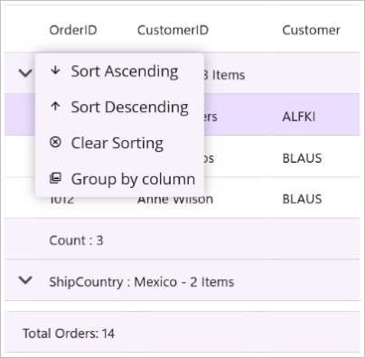
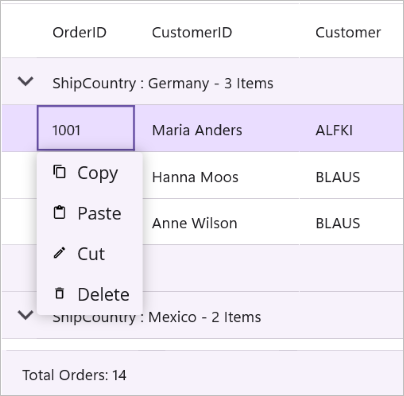
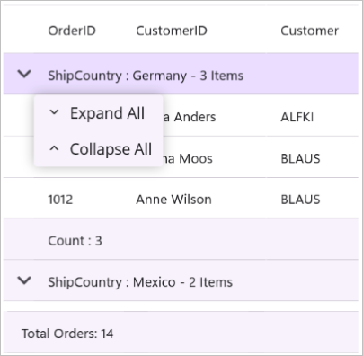
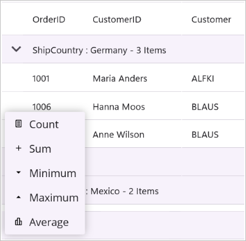

# Context menu in .NET MAUI DataGrid (SfDataGrid)

SfDataGrid displays a customizable context menu on right-click (Windows, Mac Catalyst) or long-press (Android, iOS). You can define menus for:
- Header
- Record (row)
- Group caption
- Group summary
- Table summary

## Header context menu



<syncfusion:SfDataGrid x:Name="dataGrid" ItemsSource="{Binding Orders}">
    <syncfusion:SfDataGrid.HeaderContextMenu>
        <syncfusion:MenuItemCollection>
            <syncfusion:MenuItem Text="Sort Ascending"/>
            <syncfusion:MenuItem Text="Sort Descending"/>
            <syncfusion:MenuItem Text="Clear Sorting"/>
            <syncfusion:MenuItem Text="Group by Column"/>
            <syncfusion:MenuItem Text="Best Fit"/>
        </syncfusion:MenuItemCollection>
    </syncfusion:SfDataGrid.HeaderContextMenu>
</syncfusion:SfDataGrid>


this.dataGrid.HeaderContextMenu = new MenuItemCollection
{
    new MenuItem("Sort Ascending") ,
    new MenuItem("Sort Descending"),
    new MenuItem("Clear Sorting")  ,
    new MenuItem("Group by Column"),
    new MenuItem("Best Fit"),
};



## Header context menu with commands

While binding the menu item using Command, you can get the command parameter as HeaderContextInfo, which contains DataGrid, Column, RowIndex, and ColumnIndex.



<syncfusion:SfDataGrid x:Name="dataGrid" ItemsSource="{Binding Orders}">
    <syncfusion:SfDataGrid.HeaderContextMenu>
        <syncfusion:MenuItemCollection>
            <syncfusion:MenuItem Text="Sort Ascending"
                                  Command="{Binding Path=BindingContext.SortAscendingCommand, Source={x:Reference dataGrid}}">
                <syncfusion:MenuItem.Icon>
                    <Label Text="&#xe711;" FontFamily="MauiSampleFontIcon" HorizontalTextAlignment="Center" VerticalTextAlignment="Center"/>
                </syncfusion:MenuItem.Icon>
            </syncfusion:MenuItem>
        </syncfusion:MenuItemCollection>
    </syncfusion:SfDataGrid.HeaderContextMenu>
</syncfusion:SfDataGrid>


private void SortAscending(object obj)
{
    if (obj is HeaderContextInfo context && context.Column != null)
    {
        dataGrid.SortColumnDescriptions.Clear();
        dataGrid.SortColumnDescriptions.Add(new SortColumnDescription { ColumnName = context.Column.MappingName });
    }
}



## Record context menu



<syncfusion:SfDataGrid x:Name="dataGrid"
                       ItemsSource="{Binding Orders}">
    <syncfusion:SfDataGrid.RecordContextMenu>
        <syncfusion:MenuItemCollection>
            <syncfusion:MenuItem Text="Copy"/>
            <syncfusion:MenuItem Text="Paste"/>
            <syncfusion:MenuItem Text="Cut"/>
            <syncfusion:MenuItem Text="Delete"/>
        </syncfusion:MenuItemCollection>
    </syncfusion:SfDataGrid.RecordContextMenu>
</syncfusion:SfDataGrid>


this.dataGrid.RecordContextMenu = new MenuItemCollection
{
    new MenuItem("Copy")  ,
    new MenuItem("Paste") ,
    new MenuItem("Cut")   ,
    new MenuItem("Delete"),
};



## Record context menu with commands

While binding the menu item using Command, you can get the command parameter as RowContextMenuInfo, which contains the record (RowData) of the corresponding row along with DataGrid and RowIndex.



<syncfusion:SfDataGrid x:Name="dataGrid"
                       ItemsSource="{Binding Orders}"
                       AutoGenerateColumns="True">
    <syncfusion:SfDataGrid.RecordContextMenu>
        <syncfusion:MenuItemCollection>
            <syncfusion:MenuItem Text="Copy"
                                  Command="{Binding Path=BindingContext.CopyContentCommand, Source={x:Reference dataGrid}}"
                                  CommandParameter="{Binding}">
            
            </syncfusion:MenuItem>
        </syncfusion:MenuItemCollection>
    </syncfusion:SfDataGrid.RecordContextMenu>
</syncfusion:SfDataGrid>


private void CopyCellContent(object obj)
{
    if (obj is RowContextMenuInfo context && context.RowIndex >= 0)
    {
        context.DataGrid?.CopyPasteController.Copy();
    }
}



## Group caption context menu



<syncfusion:SfDataGrid ...>
    <syncfusion:SfDataGrid.GroupCaptionContextMenu>
        <syncfusion:MenuItemCollection>
            <syncfusion:MenuItem Text="Expand All"/>
            <syncfusion:MenuItem Text="Collapse All"/>
        </syncfusion:MenuItemCollection>
    </syncfusion:SfDataGrid.GroupCaptionContextMenu>
</syncfusion:SfDataGrid>


this.dataGrid.GroupCaptionContextMenu = new MenuItemCollection
{
    new MenuItem("Expand All")  ,
    new MenuItem("Collapse All"),
};



## Group caption context menu with commands

While binding the menu item using Command, you can get the command parameter as GroupCaptionContextInfo, which contains DataGrid, Group, and RowIndex.



<syncfusion:SfDataGrid ...>
    <syncfusion:SfDataGrid.GroupCaptionContextMenu>
        <syncfusion:MenuItemCollection>
            <syncfusion:MenuItem Text="Expand All"
                                  Command="{Binding Path=BindingContext.ExpandAllCommand, Source={x:Reference dataGrid}}"
                                  CommandParameter="{Binding}"/>
        </syncfusion:MenuItemCollection>
    </syncfusion:SfDataGrid.GroupCaptionContextMenu>
</syncfusion:SfDataGrid>


private void ExpandAll(object obj)
{
    if (obj is GroupCaptionContextInfo groupInfo && groupInfo.DataGrid != null && groupInfo.Group != null)
    {
        groupInfo.DataGrid.ExpandGroup(groupInfo.Group);
    }
}



## Group summary context menu



<syncfusion:SfDataGrid>
    <syncfusion:SfDataGrid.GroupSummaryContextMenu>
        <syncfusion:MenuItemCollection>
            <syncfusion:MenuItem Text="Clear Summary"/>
        </syncfusion:MenuItemCollection>
    </syncfusion:SfDataGrid.GroupSummaryContextMenu>
</syncfusion:SfDataGrid>


this.dataGrid.GroupSummaryContextMenu = new MenuItemCollection
{
    new MenuItem("Clear Summary") ,
};



## Group summary context menu with commands

While binding the menu item using Command, you can get the command parameter as GroupSummaryContextInfo, which contains DataGrid, SummaryRow, Group, and RowIndex.



<syncfusion:SfDataGrid>
    <syncfusion:SfDataGrid.GroupSummaryContextMenu>
        <syncfusion:MenuItemCollection>
            <syncfusion:MenuItem Text="Clear Summary"
                                  Command="{Binding BindingContext.ClearGroupSummaryCommand, Source={x:Reference dataGrid}}"
                                  CommandParameter="{Binding}"/>
        </syncfusion:MenuItemCollection>
    </syncfusion:SfDataGrid.GroupSummaryContextMenu>
</syncfusion:SfDataGrid>


        private void ClearSummary(object obj)
        {
            if (DataGrid?.GroupSummaryRows.Count > 0)
                DataGrid.GroupSummaryRows.Clear();
        }



## Table summary context menu



<syncfusion:SfDataGrid ...>
    <syncfusion:SfDataGrid.TableSummaryContextMenu>
        <syncfusion:MenuItemCollection>
            <syncfusion:MenuItem Text="Count"/>
            <syncfusion:MenuItem Text="Minimum"/>
            <syncfusion:MenuItem Text="Maximum"/>
            <syncfusion:MenuItem Text="Sum"/>
            <syncfusion:MenuItem Text="Average"/>
        </syncfusion:MenuItemCollection>
    </syncfusion:SfDataGrid.TableSummaryContextMenu>
</syncfusion:SfDataGrid>


this.dataGrid.TableSummaryContextMenu = new MenuItemCollection
{
    new MenuItem("Count")  ,
    new MenuItem("Minimum") ,
    new MenuItem("Maximum") ,
    new MenuItem("Sum")     ,
    new MenuItem("Average") ,
};



## Table summary context menu with commands

While binding the menu item using Command, you can get the command parameter as TableSummaryContextInfo, which contains DataGrid, Column, SummaryRow, and RowIndex.



<syncfusion:SfDataGrid ...>
    <syncfusion:SfDataGrid.TableSummaryContextMenu>
        <syncfusion:MenuItemCollection>
            <syncfusion:MenuItem Text="Count"
                                  Command="{Binding BindingContext.AddCountSummaryCommand, Source={x:Reference dataGrid}}"
                                  CommandParameter="{Binding}"/>
        </syncfusion:MenuItemCollection>
    </syncfusion:SfDataGrid.TableSummaryContextMenu>
</syncfusion:SfDataGrid>


 private void AddCountSummary(object obj)
        {
            if (obj is TableSummaryContextInfo context && context.DataGrid != null && context.Column != null)
            {
                var row = new DataGridTableSummaryRow
                {
                    ShowSummaryInRow = false,
                    Position = SummaryRowPosition.Bottom,
                    SummaryColumns = new ObservableCollection<ISummaryColumn>
            {
                new DataGridSummaryColumn
                {
                    Name = "Count",
                    MappingName = context.Column.MappingName,
                    SummaryType = SummaryType.CountAggregate,
                    Format = "Count: {Count}"
                }
            }
                };
                context.DataGrid.TableSummaryRows.Clear();
                context.DataGrid.TableSummaryRows.Add(row);
            }
        }



## Events

The DataGrid exposes events to customize and react to the context menu lifecycle.

### ContextMenuOpening
Occurs before the context menu is displayed. Set Cancel to true to prevent showing the menu.
- Cancel: bool — set to true to cancel the menu.
- Column: DataGridColumn — the column for which the menu is opening.
- MenuItems: IList<MenuItem> — items that will be displayed; add or remove to customize.

### ContextMenuOpened
Occurs after the context menu is displayed.
- Column: DataGridColumn — the column that triggered the menu.
- MenuItems: IList<MenuItem> — the items that were displayed.

### ContextMenuItemClicked
Occurs when a menu item is clicked.
- MenuItem: MenuItem — the item that was clicked.

### ContextMenuClosing
Occurs before the context menu is closed. Set Cancel to true to keep it open.
- Cancel: bool — set to true to keep the menu open.
- Column: DataGridColumn — the column for which the menu is closing.
- MenuItems: IList<MenuItem> — the items that were displayed.

### ContextMenuClosed
Occurs after the context menu is closed.
- Column: DataGridColumn — the column that triggered the menu.
- MenuItems: IList<MenuItem> — the items that were displayed.
