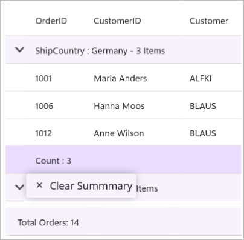

# Context Menu in .NET MAUI DataGrid (SfDataGrid)

## Overview

The `SfDataGrid` control allows you to display a customizable context menu when a user performs a secondary click (right-click on Windows and Mac Catalyst) or a long-press gesture (on Android and iOS) on different parts of the DataGrid.

### Types of Context Menus

You can define context menus for the following elements:

-   **Header**: Context menu for column headers.
-   **Record (Row)**: Context menu for data rows.
-   **Group Caption**: Context menu for group caption rows.
-   **Group Summary**: Context menu for group summary rows.
-   **Table Summary**: Context menu for table summary rows.

Each context menu type provides specific options tailored to the DataGrid element it is associated with.

## Customize Header Context Menu

The header context menu is displayed when the user invokes the context menu on a column header.You can customize the menu items by adding `MenuItem` objects to the `SfDataGrid.HeaderContextMenu` collection.



<syncfusion:SfDataGrid x:Name="dataGrid" ItemsSource="{Binding Orders}">
    <syncfusion:SfDataGrid.HeaderContextMenu>
        <syncfusion:MenuItemCollection>
            <syncfusion:MenuItem Text="Sort Ascending"/>
            <syncfusion:MenuItem Text="Sort Descending"/>
            <syncfusion:MenuItem Text="Clear Sorting"/>
            <syncfusion:MenuItem Text="Group by Column"/>
            <syncfusion:MenuItem Text="Best Fit"/>
        </syncfusion:MenuItemCollection>
    </syncfusion:SfDataGrid.HeaderContextMenu>
</syncfusion:SfDataGrid>


this.dataGrid.HeaderContextMenu = new MenuItemCollection
{
    new MenuItem("Sort Ascending") ,
    new MenuItem("Sort Descending"),
    new MenuItem("Clear Sorting")  ,
    new MenuItem("Group by Column"),
    new MenuItem("Best Fit"),
};



## Header Context Menu with Commands

When binding a menu item using a `Command`, you can access the command parameter as `HeaderContextInfo`. This object provides contextual information such as the `DataGrid` instance, the `Column` clicked, and its `RowIndex` and `ColumnIndex`.



<syncfusion:SfDataGrid x:Name="dataGrid" ItemsSource="{Binding Orders}">
    <syncfusion:SfDataGrid.HeaderContextMenu>
        <syncfusion:MenuItemCollection>
            <syncfusion:MenuItem Text="Sort Ascending"
                                  Command="{Binding Path=BindingContext.SortAscendingCommand, Source={x:Reference dataGrid}}">
                <syncfusion:MenuItem.Icon>
                    <Label Text="&#xe711;" FontFamily="MauiSampleFontIcon" HorizontalTextAlignment="Center" VerticalTextAlignment="Center"/>
                </syncfusion:MenuItem.Icon>
            </syncfusion:MenuItem>
        </syncfusion:MenuItemCollection>
    </syncfusion:SfDataGrid.HeaderContextMenu>
</syncfusion:SfDataGrid>


private void SortAscending(object obj)
{
    if (obj is HeaderContextInfo context && context.Column != null)
    {
        dataGrid.SortColumnDescriptions.Clear();
        dataGrid.SortColumnDescriptions.Add(new SortColumnDescription { ColumnName = context.Column.MappingName });
    }
}



## Customize Record Context Menu

The record context menu is displayed when the user invokes the context menu on a data row. You can customize the menu items by adding `MenuItem` objects to the `SfDataGrid.RecordContextMenu` collection.



<syncfusion:SfDataGrid x:Name="dataGrid"
                       ItemsSource="{Binding Orders}">
    <syncfusion:SfDataGrid.RecordContextMenu>
        <syncfusion:MenuItemCollection>
            <syncfusion:MenuItem Text="Copy"/>
            <syncfusion:MenuItem Text="Paste"/>
            <syncfusion:MenuItem Text="Cut"/>
            <syncfusion:MenuItem Text="Delete"/>
        </syncfusion:MenuItemCollection>
    </syncfusion:SfDataGrid.RecordContextMenu>
</syncfusion:SfDataGrid>


this.dataGrid.RecordContextMenu = new MenuItemCollection
{
    new MenuItem("Copy")  ,
    new MenuItem("Paste") ,
    new MenuItem("Cut")   ,
    new MenuItem("Delete"),
};



## Record Context Menu with Commands

When binding a menu item using a `Command`, you can access the command parameter as `RowContextMenuInfo`. This object contains the `RowData` of the corresponding row, along with the `DataGrid` instance and the `RowIndex`.



<syncfusion:SfDataGrid x:Name="dataGrid"
                       ItemsSource="{Binding Orders}"
                       AutoGenerateColumns="True">
    <syncfusion:SfDataGrid.RecordContextMenu>
        <syncfusion:MenuItemCollection>
            <syncfusion:MenuItem Text="Copy"
                                  Command="{Binding Path=BindingContext.CopyContentCommand, Source={x:Reference dataGrid}}"
                                  CommandParameter="{Binding}">
            
            </syncfusion:MenuItem>
        </syncfusion:MenuItemCollection>
    </syncfusion:SfDataGrid.RecordContextMenu>
</syncfusion:SfDataGrid>


private void CopyCellContent(object obj)
{
    if (obj is RowContextMenuInfo context && context.RowIndex >= 0)
    {
        context.DataGrid?.CopyPasteController.Copy();
    }
}



## Customize Group Caption Context Menu

The group caption context menu is displayed when the user invokes the context menu on a group caption row. You can customize the menu items by adding `MenuItem` objects to the `SfDataGrid.GroupCaptionContextMenu` collection.



<syncfusion:SfDataGrid ...>
    <syncfusion:SfDataGrid.GroupCaptionContextMenu>
        <syncfusion:MenuItemCollection>
            <syncfusion:MenuItem Text="Expand All"/>
            <syncfusion:MenuItem Text="Collapse All"/>
        </syncfusion:MenuItemCollection>
    </syncfusion:SfDataGrid.GroupCaptionContextMenu>
</syncfusion:SfDataGrid>


this.dataGrid.GroupCaptionContextMenu = new MenuItemCollection
{
    new MenuItem("Expand All")  ,
    new MenuItem("Collapse All"),
};



## Group Caption Context Menu with Commands

When binding a menu item using a `Command`, you can access the command parameter as `GroupCaptionContextInfo`. This object provides access to the `DataGrid` instance, the `Group` object, and the `RowIndex` of the clicked group caption.



<syncfusion:SfDataGrid ...>
    <syncfusion:SfDataGrid.GroupCaptionContextMenu>
        <syncfusion:MenuItemCollection>
            <syncfusion:MenuItem Text="Expand All"
                                  Command="{Binding Path=BindingContext.ExpandAllCommand, Source={x:Reference dataGrid}}"
                                  CommandParameter="{Binding}"/>
        </syncfusion:MenuItemCollection>
    </syncfusion:SfDataGrid.GroupCaptionContextMenu>
</syncfusion:SfDataGrid>


private void ExpandAll(object obj)
{
    if (obj is GroupCaptionContextInfo groupInfo && groupInfo.DataGrid != null && groupInfo.Group != null)
    {
        groupInfo.DataGrid.ExpandGroup(groupInfo.Group);
    }
}



## Customize Group Summary Context Menu

The group summary context menu is displayed when the user invokes the context menu on a group summary row. You can customize the menu items by adding `MenuItem` objects to the `SfDataGrid.GroupSummaryContextMenu` collection.



<syncfusion:SfDataGrid>
    <syncfusion:SfDataGrid.GroupSummaryContextMenu>
        <syncfusion:MenuItemCollection>
            <syncfusion:MenuItem Text="Clear Summary"/>
        </syncfusion:MenuItemCollection>
    </syncfusion:SfDataGrid.GroupSummaryContextMenu>
</syncfusion:SfDataGrid>


this.dataGrid.GroupSummaryContextMenu = new MenuItemCollection
{
    new MenuItem("Clear Summary") ,
};



## Group Summary Context Menu with Commands

When binding a menu item using a `Command`, you can access the command parameter as `GroupSummaryContextInfo`. This object includes the `DataGrid` instance, the `SummaryRow`, the `Group` object, and the `RowIndex`.



<syncfusion:SfDataGrid>
    <syncfusion:SfDataGrid.GroupSummaryContextMenu>
        <syncfusion:MenuItemCollection>
            <syncfusion:MenuItem Text="Clear Summary"
                                  Command="{Binding BindingContext.ClearGroupSummaryCommand, Source={x:Reference dataGrid}}"
                                  CommandParameter="{Binding}"/>
        </syncfusion:MenuItemCollection>
    </syncfusion:SfDataGrid.GroupSummaryContextMenu>
</syncfusion:SfDataGrid>


        private void ClearSummary(object obj)
        {
            if (DataGrid?.GroupSummaryRows.Count > 0)
                DataGrid.GroupSummaryRows.Clear();
        }



## Customize Table Summary Context Menu

The table summary context menu is displayed when the user invokes the context menu on a table summary row. You can customize the menu items by adding `MenuItem` objects to the `SfDataGrid.TableSummaryContextMenu` collection.



<syncfusion:SfDataGrid ...>
    <syncfusion:SfDataGrid.TableSummaryContextMenu>
        <syncfusion:MenuItemCollection>
            <syncfusion:MenuItem Text="Count"/>
            <syncfusion:MenuItem Text="Minimum"/>
            <syncfusion:MenuItem Text="Maximum"/>
            <syncfusion:MenuItem Text="Sum"/>
            <syncfusion:MenuItem Text="Average"/>
        </syncfusion:MenuItemCollection>
    </syncfusion:SfDataGrid.TableSummaryContextMenu>
</syncfusion:SfDataGrid>


this.dataGrid.TableSummaryContextMenu = new MenuItemCollection
{
    new MenuItem("Count")  ,
    new MenuItem("Minimum") ,
    new MenuItem("Maximum") ,
    new MenuItem("Sum")     ,
    new MenuItem("Average") ,
};



## Table Summary Context Menu with Commands

When binding a menu item using a `Command`, you can access the command parameter as `TableSummaryContextInfo`. This object provides the `DataGrid` instance, the relevant `Column`, the `SummaryRow`, and the `RowIndex`.



<syncfusion:SfDataGrid ...>
    <syncfusion:SfDataGrid.TableSummaryContextMenu>
        <syncfusion:MenuItemCollection>
            <syncfusion:MenuItem Text="Count"
                                  Command="{Binding BindingContext.AddCountSummaryCommand, Source={x:Reference dataGrid}}"
                                  CommandParameter="{Binding}"/>
        </syncfusion:MenuItemCollection>
    </syncfusion:SfDataGrid.TableSummaryContextMenu>
</syncfusion:SfDataGrid>


 private void AddCountSummary(object obj)
        {
            if (obj is TableSummaryContextInfo context && context.DataGrid != null && context.Column != null)
            {
                var row = new DataGridTableSummaryRow
                {
                    ShowSummaryInRow = false,
                    Position = SummaryRowPosition.Bottom,
                    SummaryColumns = new ObservableCollection<ISummaryColumn>
            {
                new DataGridSummaryColumn
                {
                    Name = "Count",
                    MappingName = context.Column.MappingName,
                    SummaryType = SummaryType.CountAggregate,
                    Format = "Count: {Count}"
                }
            }
                };
                context.DataGrid.TableSummaryRows.Clear();
                context.DataGrid.TableSummaryRows.Add(row);
            }
        }



## Events

The DataGrid exposes events to customize and react to the context menu life cycle.

### ContextMenuOpening

The `ContextMenuOpening` event occurs before the context menu is displayed, allowing you to customize its content or cancel its display. The event handler receives `ContextMenuOpeningEventArgs` with the following properties:

-   **Cancel**: Set to `true` to cancel the display of the context menu.
-   **Column**: Represents the column for which the context menu is opening. This property will be `null` if the context menu is not opened for a column header.
-   **MenuItems**: Provides access to the collection of `MenuItem` objects that will be displayed in the context menu. You can add, remove, or modify these items to customize the menu.

### ContextMenuOpened

The `ContextMenuOpened` event occurs immediately after the context menu has been displayed. The event handler receives `ContextMenuOpenedEventArgs` with the following properties:

-   **Column**: Represents the column that triggered the context menu. This property will be `null` if the context menu was not opened for a column header.
-   **MenuItems**: Provides access to the collection of `MenuItem` objects that are currently displayed in the context menu.

### ContextMenuItemClicked

The `ContextMenuItemClicked` event occurs when a menu item within the context menu is clicked. The event handler receives `ContextMenuItemClickedEventArgs` with the following property:

-   **MenuItem**: Represents the `MenuItem` object that was clicked by the user.

### ContextMenuClosing

The `ContextMenuClosing` event occurs before the context menu is closed, allowing you to prevent its closure. The event handler receives `ContextMenuClosingEventArgs` with the following properties:

-   **Cancel**: Set to `true` to keep the context menu open and prevent its closure.
-   **Column**: Represents the column for which the context menu is closing. This property will be `null` if the context menu is not associated with a column header.
-   **MenuItems**: Provides access to the collection of `MenuItem` objects that are currently displayed in the context menu.

### ContextMenuClosed

The `ContextMenuClosed` event occurs after the context menu has been closed. The event handler receives `ContextMenuClosedEventArgs` with the following properties:

-   **Column**: Represents the column that was associated with the closed context menu. This property will be `null` if the context menu was not opened for a column header.
-   **MenuItems**: Provides access to the collection of `MenuItem` objects that were displayed in the closed context menu.
