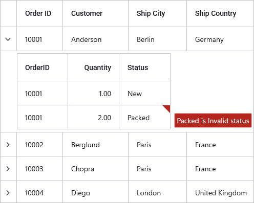

# Data Validation in MAUI DataGrid (SfDataGrid)

[.NET MAUI DataGrid](https://help.syncfusion.com/cr/maui/Syncfusion.Maui.DataGrid.SfDataGrid.html) allows you to validate data and display hints when validation fails. When invalid data is detected, an error icon is displayed at the top right corner of the DataGridCell. When you hover over the error icon, error information is displayed in an error tip.

## Built-in Validation

Built-in validations through `IDataErrorInfo` and `INotifyDataErrorInfo` can be enabled by setting [SfDataGrid.ValidationMode](https://help.syncfusion.com/cr/maui/Syncfusion.Maui.DataGrid.SfDataGrid.html#Syncfusion_Maui_DataGrid_SfDataGrid_ValidationMode) or [DataGridColumn.ValidationMode](https://help.syncfusion.com/cr/maui/Syncfusion.Maui.DataGrid.DataGridColumn.html#Syncfusion_Maui_DataGrid_DataGridColumn_ValidationMode) properties. Column-level validation mode takes priority over grid-level validation mode.

> **Note:** ValidationMode is a static property set at initialization and applies consistently throughout the data entry lifecycle.

* DataGridValidationMode.InEdit - display error icon & tips and also doesn’t allow the users to commit the invalid data by not allowing users to edit other cells.
* DataGridValidationMode.InView - displays error icons and tips alone.
* DataGridValidationMode.None - disables built-in validation support.

## Built-in validation using IDataErrorInfo / INotifyDataErrorInfo

[.NET MAUI DataGrid](https://www.syncfusion.com/maui-controls/maui-datagrid) (SfDataGrid) provides support to validate the data based on [IDataErrorInfo](https://learn.microsoft.com/en-us/dotnet/api/system.componentmodel.idataerrorinfo?view=net-9.0) / [INotifyDataErrorInfo](https://learn.microsoft.com/en-us/dotnet/api/system.componentmodel.inotifydataerrorinfo?view=net-9.0).

### Using IDataErrorInfo

You can validate data by inheriting the [IDataErrorInfo](https://learn.microsoft.com/en-us/dotnet/api/system.componentmodel.idataerrorinfo?view=net-9.0) interface in your model class.



using System.ComponentModel;

public class OrderInfo : IDataErrorInfo
{
    private string country;

    public int OrderID { get; set; }
    public string Customer { get; set; }
    public string City { get; set; }
    public string Product { get; set; }

    public string Country
    {
        get { return country; }
        set { country = value; }
    }

    [Display(AutoGenerateField = false)]
    public string Error
    {
        get
        {
            return string.Empty;
        }
    }

    public string this[string columnName]
    {
        get
        {
            if (!columnName.Equals("Country"))
                return string.Empty;

            if (this.Country == "Germany" || this.Country == "France")
                return "Delivery not available for " + this.Country;

            return string.Empty;
        }
    }
}



Enable built-in validation support by setting [SfDataGrid.ValidationMode](https://help.syncfusion.com/cr/maui/Syncfusion.Maui.DataGrid.SfDataGrid.html#Syncfusion_Maui_DataGrid_SfDataGrid_ValidationMode) or [DataGridColumn.ValidationMode](https://help.syncfusion.com/cr/maui/Syncfusion.Maui.DataGrid.DataGridColumn.html#Syncfusion_Maui_DataGrid_DataGridColumn_ValidationMode) property to `InEdit` or `InView`.



<syncfusion:SfDataGrid x:Name="dataGrid"
                       ItemsSource="{Binding Orders}"
                       SelectionMode="Single"
                       NavigationMode="Cell"
                       AllowEditing="True"
                       ValidationMode="InView"/>



SfDataGrid dataGrid = new SfDataGrid();
OrderInfoViewModel orderInfoViewModel = new OrderInfoViewModel();
dataGrid.ItemsSource = orderInfoViewModel.Orders;
dataGrid.AllowEditing = true;
dataGrid.SelectionMode = DataGridSelectionMode.Single;
dataGrid.NavigationMode = DataGridNavigationMode.Cell;
dataGrid.ValidationMode = DataGridValidationMode.InView;
this.Content = dataGrid;                  




### Using INotifyDataErrorInfo

Data can be validated by inheriting the [INotifyDataErrorInfo](https://learn.microsoft.com/en-us/dotnet/api/system.componentmodel.inotifydataerrorinfo?view=net-9.0) interface in your model class.



using System.ComponentModel;

public class OrderInfo : INotifyDataErrorInfo
{
    private string country;
    private string city;

    public int OrderID { get; set; }
    public string Customer { get; set; }
    
    public string City
    {
        get { return city; }
        set { city = value; }
    }

    public string Country
    {
        get { return country; }
        set { country = value; }
    }

    public string Product { get; set; }

    public System.Collections.IEnumerable GetErrors(string propertyName)
    {
        var errors = new List<string>();

        if (!propertyName.Equals("City"))
            return errors;

        if (!string.IsNullOrEmpty(this.City) && 
            (this.City.Contains("Berlin") || this.City.Contains("Madrid")))
        {
            errors.Add("Delivery not available for " + this.City);
        }
        return errors;
    }

    [Display(AutoGenerateField = false)]
    public bool HasErrors
    {
        get
        {
            return false;
        }
    }

    public event EventHandler<DataErrorsChangedEventArgs> ErrorsChanged;
}



Enable built-in validation support by setting [SfDataGrid.ValidationMode](https://help.syncfusion.com/cr/maui/Syncfusion.Maui.DataGrid.SfDataGrid.html#Syncfusion_Maui_DataGrid_SfDataGrid_ValidationMode) or [DataGridColumn.ValidationMode](https://help.syncfusion.com/cr/maui/Syncfusion.Maui.DataGrid.DataGridColumn.html#Syncfusion_Maui_DataGrid_DataGridColumn_ValidationMode) property to `InEdit` or `InView`.



<syncfusion:SfDataGrid x:Name="dataGrid"
                       ItemsSource="{Binding Orders}"
                       SelectionMode="Single"
                       NavigationMode="Cell"
                       AllowEditing="True"
                       ValidationMode="InView"/>


SfDataGrid dataGrid = new SfDataGrid();
OrderInfoViewModel orderInfoViewModel = new OrderInfoViewModel();
dataGrid.ItemsSource = orderInfoViewModel.Orders;
dataGrid.AllowEditing = true;
dataGrid.SelectionMode = DataGridSelectionMode.Single;
dataGrid.NavigationMode = DataGridNavigationMode.Cell;
dataGrid.ValidationMode = DataGridValidationMode.InView;
this.Content = dataGrid;




## Built-in validation using Data Annotation

You can validate data using **data annotation attributes** by setting 
[SfDataGrid.ValidationMode](https://help.syncfusion.com/cr/maui/Syncfusion.Maui.DataGrid.SfDataGrid.html#Syncfusion_Maui_DataGrid_SfDataGrid_ValidationMode) or [DataGridColumn.ValidationMode](https://help.syncfusion.com/cr/maui/Syncfusion.Maui.DataGrid.DataGridColumn.html#Syncfusion_Maui_DataGrid_DataGridColumn_ValidationMode) property to `InEdit` or `InView`. When validation fails, the ErrorMessage is displayed in the error tip.

### Using different annotations

Numeric properties (int, double, decimal) can be validated using [Range attributes](https://learn.microsoft.com/en-us/dotnet/api/system.componentmodel.dataannotations.rangeattribute?view=net-5.0).



using System.ComponentModel.DataAnnotations;

public class OrderInfo
{
    private int orderID;

    [Range(10001, 10005, ErrorMessage = "OrderID between 10001 and 10005 alone processed")]
    public int OrderID
    {
        get { return orderID; }
        set { orderID = value; }
    }
    public string Customer { get; set; }
    public string City { get; set; }

    public string Country { get; set; }
    public string Product { get; set; }
}



String properties can be validated using [Required](https://learn.microsoft.com/en-us/dotnet/api/system.componentmodel.dataannotations.requiredattribute?view=net-5.0) and [StringLength attributes](https://learn.microsoft.com/en-us/dotnet/api/system.componentmodel.dataannotations.stringlengthattribute?view=net-5.0).



using System.ComponentModel.DataAnnotations;

public class OrderInfo
{
    private string _city;
    private string _customerName;

    public int OrderID { get; set; }

    [StringLength(5, ErrorMessage = "Customer name cannot exceed 5 characters")]
    public string Customer
    {
        get { return _customerName; }
        set { _customerName = value; }
    }

    [Required(ErrorMessage = "City is required")]
    public string City
    {
        get { return _city; }
        set { _city = value; }
    }

    public string Country { get; set; }
    public string Product { get; set; }
}



Data with heterogeneous types (combinations of letters, numbers, and special characters) can be validated using [RegularExpression attributes](https://learn.microsoft.com/en-us/dotnet/api/system.componentmodel.dataannotations.regularexpressionattribute?view=net-5.0).



using System.ComponentModel.DataAnnotations;

public class OrderInfo
{
    private string _customerName;

    public int OrderID { get; set; }

    [RegularExpression(@"^[a-zA-Z]{1,40}$", ErrorMessage = "Numbers and special characters not allowed")]
    public string Customer
    {
        get { return _customerName; }
        set { _customerName = value; }
    }

    public string City { get; set; }
    public string Country { get; set; }
    public string Product { get; set; }
}



## Cell Validation

Individual cells can be validated using the [CellValidating](https://help.syncfusion.com/cr/maui/Syncfusion.Maui.DataGrid.SfDataGrid.html#Syncfusion_Maui_DataGrid_SfDataGrid_CellValidating) event. This event occurs when an edited cell attempts to commit data or loses focus. If validation fails, the user cannot navigate to other cells until the validation error is resolved.

[DataGridCellValidatingEventArgs](https://help.syncfusion.com/cr/maui/Syncfusion.Maui.DataGrid.DataGridCellValidatingEventArgs.html) provides information for the `CellValidating` event. `DataGridCellValidatingEventArgs.ColumnName` identifies the column being validated, `DataGridCellValidatingEventArgs.NewValue` returns the edited value, and `DataGridCellValidatingEventArgs.IsValid` sets the validation status. For nested grids, `DataGridCellValidatingEventArgs.OriginalSource` returns the DataGrid instance that fired this event.



<syncfusion:SfDataGrid x:Name="dataGrid"
                       ItemsSource="{Binding Orders}"
                       SelectionMode="Single"
                       NavigationMode="Cell"
                       AllowEditing="True"
                       ValidationMode="InView"
                       CellValidating="dataGrid_CellValidating"/>


private void dataGrid_CellValidating(object sender, DataGridCellValidatingEventArgs e)
{
    if (e.NewValue != null && e.NewValue.ToString().Equals("Berlin"))
    {
        e.IsValid = false;
        e.ErrorMessage = "Berlin cannot be passed";
    }
}



[SfDataGrid.CellValidated](https://help.syncfusion.com/cr/maui/Syncfusion.Maui.DataGrid.SfDataGrid.html#Syncfusion_Maui_DataGrid_SfDataGrid_CellValidated) event triggered when the cell has finished validating with valid data.



<syncfusion:SfDataGrid x:Name="dataGrid"
                       ItemsSource="{Binding Orders}"
                       SelectionMode="Single"
                       NavigationMode="Cell"
                       AllowEditing="True"
                       ValidationMode="InView"
                       CellValidated="dataGrid_CellValidated"/>


private void dataGrid_CellValidated(object sender, DataGridCellValidatedEventArgs e)
{
    // Handle cell validation results here
}



## Row Validation

Entire rows can be validated using the [RowValidating](https://help.syncfusion.com/cr/maui/Syncfusion.Maui.DataGrid.SfDataGrid.html#Syncfusion_Maui_DataGrid_SfDataGrid_RowValidating) event. This event occurs after a cell loses focus or when the row data is committed. If validation fails, the user cannot navigate to other rows until the validation error is resolved.

[DataGridRowValidatingEventArgs](https://help.syncfusion.com/cr/maui/Syncfusion.Maui.DataGrid.DataGridRowValidatingEventArgs.html) provides information for the `RowValidating` event. `DataGridRowValidatingEventArgs.RowData` contains the edited row data, and `DataGridRowValidatingEventArgs.IsValid` sets the validation status. For nested grids, `DataGridRowValidatingEventArgs.OriginalSource` returns the DataGrid instance that fired this event.



<syncfusion:SfDataGrid x:Name="dataGrid"
                       ItemsSource="{Binding Orders}"
                       SelectionMode="Single"
                       NavigationMode="Cell"
                       AllowEditing="True"
                       ValidationMode="InView"
                       RowValidating="dataGrid_RowValidating"/>


private void dataGrid_RowValidating(object sender, DataGridRowValidatingEventArgs e)
{
    if (e.RowData is OrderInfo order && order.Country != null && order.Country.Equals("Spain"))
    {
        e.IsValid = false;
        e.ErrorMessages.Add("Country", "Spain cannot be passed");
    }
}



[SfDataGrid.RowValidated](https://help.syncfusion.com/cr/maui/Syncfusion.Maui.DataGrid.SfDataGrid.html#Syncfusion_Maui_DataGrid_SfDataGrid_RowValidated) event triggered when the row has finished validating with valid row data.



<syncfusion:SfDataGrid x:Name="dataGrid"
                       ItemsSource="{Binding Orders}"
                       SelectionMode="Single"
                       NavigationMode="Cell"
                       AllowEditing="True"
                       ValidationMode="InView"
                       RowValidated="dataGrid_RowValidated"/>


private void dataGrid_RowValidated(object sender, DataGridRowValidatedEventArgs e)
{
    // Handle row validation logic here
}



## Error Icon Customization

### Change Error Icon Color

The default error icon color can be customized by setting the [DataGridStyle.ErrorIconColor](https://help.syncfusion.com/cr/maui/Syncfusion.Maui.DataGrid.DataGridStyle.html#Syncfusion_Maui_DataGrid_DataGridStyle_ErrorIconColor) property.



<syncfusion:SfDataGrid x:Name="dataGrid"
                       ItemsSource="{Binding Orders}"
                       SelectionMode="Single"
                       NavigationMode="Cell"
                       AllowEditing="True"
                       ValidationMode="InView">
    <syncfusion:SfDataGrid.DefaultStyle>
        <syncfusion:DataGridStyle ErrorIconColor="Orange"/>
    </syncfusion:SfDataGrid.DefaultStyle>
</syncfusion:SfDataGrid>


SfDataGrid dataGrid = new SfDataGrid();
OrderInfoViewModel orderInfoViewModel = new OrderInfoViewModel();
dataGrid.ItemsSource = orderInfoViewModel.Orders;
dataGrid.AllowEditing = true;
dataGrid.SelectionMode = DataGridSelectionMode.Single;
dataGrid.NavigationMode = DataGridNavigationMode.Cell;
dataGrid.ValidationMode = DataGridValidationMode.InView;
dataGrid.DefaultStyle.ErrorIconColor = Colors.Orange;
this.Content = dataGrid;




### Load Error Icon through Template

The SfDataGrid uses an icon to indicate if a cell has an error. You can customize the error icon using the [SfDataGrid.ErrorIconTemplate](https://help.syncfusion.com/cr/maui/Syncfusion.Maui.DataGrid.SfDataGrid.html#Syncfusion_Maui_DataGrid_SfDataGrid_ErrorIconTemplate) property. Image source should reference a file in the project's Resources folder or an embedded resource.



<syncfusion:SfDataGrid x:Name="dataGrid"
                       ItemsSource="{Binding Orders}"
                       SelectionMode="Single"
                       NavigationMode="Cell"
                       AllowEditing="True"
                       ValidationMode="InView">
    <syncfusion:SfDataGrid.ErrorIconTemplate>
        <DataTemplate>
            <Image Source="error_icon.png"/>
        </DataTemplate>
    </syncfusion:SfDataGrid.ErrorIconTemplate>
</syncfusion:SfDataGrid>


SfDataGrid dataGrid = new SfDataGrid();
OrderInfoViewModel orderInfoViewModel = new OrderInfoViewModel();
dataGrid.ItemsSource = orderInfoViewModel.Orders;
dataGrid.AllowEditing = true;
dataGrid.SelectionMode = DataGridSelectionMode.Single;
dataGrid.NavigationMode = DataGridNavigationMode.Cell;
dataGrid.ValidationMode = DataGridValidationMode.InView;
dataGrid.ErrorIconTemplate = new DataTemplate(() =>
{
    var image = new Image()
    {
        Source = "error_icon.png",
    };
    return image;
});
this.Content = dataGrid;




### Load Error Icon through Template Selector

When choosing a ErrorIconTemplate as a DataTemplateSelector, you have the option to supply distinct templates for different invalid values.



<ContentPage.Resources>
    <ResourceDictionary>
        <DataTemplate x:Key="NorwayTemplate">
            <Image Source="error_icon.png"/>
        </DataTemplate>
        <DataTemplate x:Key="FranceTemplate">
            <Image Source="error_triangle.png"/>
        </DataTemplate>
    </ResourceDictionary>
</ContentPage.Resources>

<syncfusion:SfDataGrid x:Name="dataGrid"
                       ItemsSource="{Binding Orders}"
                       SelectionMode="Single"
                       NavigationMode="Cell"
                       AllowEditing="True"
                       ValidationMode="InView">
    <syncfusion:SfDataGrid.ErrorIconTemplate>
        <local:ErrorIconTemplateSelector NorwayTemplate="{StaticResource NorwayTemplate}"
                                         FranceTemplate="{StaticResource FranceTemplate}"/>
    </syncfusion:SfDataGrid.ErrorIconTemplate>
</syncfusion:SfDataGrid>


public class ErrorIconTemplateSelector : Microsoft.Maui.Controls.DataTemplateSelector
{
    public DataTemplate NorwayTemplate { get; set; }
    public DataTemplate FranceTemplate { get; set; }
    protected override DataTemplate OnSelectTemplate(object item, BindableObject container)
    {
        if (item is OrderInfo order)
        {
            if (order.Country == "Norway")
            {
                return NorwayTemplate;
            }
            else
            {
                return FranceTemplate;
            }
        }
        return FranceTemplate;
    }
}




## Error Tip Customization

### Change Error Tip Background and Text Color

The background of the error tip can be changed by setting [DataGridStyle.ErrorTipBackground](https://help.syncfusion.com/cr/maui/Syncfusion.Maui.DataGrid.DataGridStyle.html#Syncfusion_Maui_DataGrid_DataGridStyle_ErrorTipBackground) property. The error tip text color can be changed by setting [DataGridStyle.ErrorTipTextColor](https://help.syncfusion.com/cr/maui/Syncfusion.Maui.DataGrid.DataGridStyle.html#Syncfusion_Maui_DataGrid_DataGridStyle_ErrorTipTextColor) property.



<syncfusion:SfDataGrid x:Name="dataGrid"
                       ItemsSource="{Binding Orders}"
                       SelectionMode="Single"
                       NavigationMode="Cell"
                       AllowEditing="True"
                       ValidationMode="InView">
    <syncfusion:SfDataGrid.DefaultStyle>
        <syncfusion:DataGridStyle ErrorTipBackground="LightBlue"
                                  ErrorTipTextColor="Black"/>
    </syncfusion:SfDataGrid.DefaultStyle>
</syncfusion:SfDataGrid>


SfDataGrid dataGrid = new SfDataGrid();
OrderInfoViewModel orderInfoViewModel = new OrderInfoViewModel();
dataGrid.ItemsSource = orderInfoViewModel.Orders;
dataGrid.AllowEditing = true;
dataGrid.SelectionMode = DataGridSelectionMode.Single;
dataGrid.NavigationMode = DataGridNavigationMode.Cell;
dataGrid.ValidationMode = DataGridValidationMode.InView;
dataGrid.DefaultStyle.ErrorTipBackground = Colors.LightBlue;
dataGrid.DefaultStyle.ErrorTipTextColor = Colors.Black;
this.Content = dataGrid;




### Load Error Tip through Template

The SfDataGrid uses a tool tip to showcase an error message if a cell has error. You can personalize the error tip by using the [SfDataGrid.ErrorTipTemplate](https://help.syncfusion.com/cr/maui/Syncfusion.Maui.DataGrid.SfDataGrid.html#Syncfusion_Maui_DataGrid_SfDataGrid_ErrorTipTemplate) property.



<syncfusion:SfDataGrid x:Name="dataGrid"
                       ItemsSource="{Binding Orders}"
                       SelectionMode="Single"
                       NavigationMode="Cell"
                       AllowEditing="True"
                       ValidationMode="InView">
    <syncfusion:SfDataGrid.ErrorTipTemplate>
        <DataTemplate>
            <Label Text="Delivery not available"
                   Background="Orange"
                   TextColor="Black"
                   Padding="2"/>
        </DataTemplate>
    </syncfusion:SfDataGrid.ErrorTipTemplate>
</syncfusion:SfDataGrid>


SfDataGrid dataGrid = new SfDataGrid();
OrderInfoViewModel orderInfoViewModel = new OrderInfoViewModel();
dataGrid.ItemsSource = orderInfoViewModel.Orders;
dataGrid.AllowEditing = true;
dataGrid.SelectionMode = DataGridSelectionMode.Single;
dataGrid.NavigationMode = DataGridNavigationMode.Cell;
dataGrid.ValidationMode = DataGridValidationMode.InView;
dataGrid.ErrorTipTemplate = new DataTemplate(() =>
{
    var label = new Label()
    {
        Text = "Delivery Not available",
        Background = Colors.Orange,
        TextColor = Colors.Black,
        Padding = new Thickness(2),
    };
    return label;
});
this.Content = dataGrid;




### Load Error Tip through Template Selector

When choosing a ErrorTipTemplate as a DataTemplateSelector, you have the option to supply distinct templates for different invalid values.



<ContentPage.Resources>
    <ResourceDictionary>
        <DataTemplate x:Key="NorwayTemplate">
            <Label Text="Delivery not available for Norway"
                   Background="Orange"
                   TextColor="Black"
                   Padding="2"/>
        </DataTemplate>
        <DataTemplate x:Key="FranceTemplate">
            <Label Text="Delivery not available for France"
                   Background="LightBlue"
                   TextColor="Black"
                   Padding="2"/>
        </DataTemplate>
    </ResourceDictionary>
</ContentPage.Resources>

<syncfusion:SfDataGrid x:Name="dataGrid"
                       ItemsSource="{Binding Orders}"
                       SelectionMode="Single"
                       NavigationMode="Cell"
                       AllowEditing="True"
                       ValidationMode="InView">
    <syncfusion:SfDataGrid.ErrorTipTemplate>
        <local:ErrorTipTemplateSelector  NorwayTemplate="{StaticResource NorwayTemplate}"
                                         FranceTemplate="{StaticResource FranceTemplate}"/>
    </syncfusion:SfDataGrid.ErrorTipTemplate>
</syncfusion:SfDataGrid>


public class ErrorTipTemplateSelector : Microsoft.Maui.Controls.DataTemplateSelector
{
    public DataTemplate NorwayTemplate { get; set; }
    public DataTemplate FranceTemplate { get; set; }
    protected override DataTemplate OnSelectTemplate(object item, BindableObject container)
    {
        if (item is OrderInfo order)
        {
            if (order.Country == "Norway")
            {
                return NorwayTemplate;
            }
            else
            {
                return FranceTemplate;
            }
        }
        return FranceTemplate;
    }
}




## Data Validation with Master-Details View

Data validation in master-details grids works using the same built-in validation methods (IDataErrorInfo, INotifyDataErrorInfo, and Data Annotations) as well as custom event-based validation. Enable validation by setting the [ValidationMode](https://help.syncfusion.com/cr/maui/Syncfusion.Maui.DataGrid.SfDataGrid.html#Syncfusion_Maui_DataGrid_SfDataGrid_ValidationMode) property on [DataGridViewDefinition.DataGrid](https://help.syncfusion.com/cr/maui/Syncfusion.Maui.DataGrid.DataGridViewDefinition.html).

> **Note:** The parent model must contain a public collection property (specified as `RelationalColumn`) that holds child records. For example:

```csharp
public class Customer
{
    public int CustomerID { get; set; }
    public string CustomerName { get; set; }
    public List<Order> Orders { get; set; } // RelationalColumn property
}
```



<syncfusion:SfDataGrid x:Name="dataGrid"
                       ItemsSource="{Binding Orders}"
                       SelectionMode="Single"
                       NavigationMode="Cell"
                       GridLinesVisibility="Both"
                       HeaderGridLinesVisibility="Both">
    <syncfusion:SfDataGrid.DetailsViewDefinition>
        <syncfusion:DataGridViewDefinition RelationalColumn="Orders">
            <syncfusion:DataGridViewDefinition.DataGrid>
                <syncfusion:SfDataGrid  x:Name="FirstLevelNestedGrid"
                                        ValidationMode="InView"
                                        AllowEditing="True"
                                        GridLinesVisibility="Both"
                                        HeaderGridLinesVisibility="Both"/>
            </syncfusion:DataGridViewDefinition.DataGrid>
        </syncfusion:DataGridViewDefinition>
    </syncfusion:SfDataGrid.DetailsViewDefinition>
</syncfusion:SfDataGrid>


// Parent DataGrid
SfDataGrid dataGrid = new SfDataGrid();
OrderInfoViewModel orderInfoViewModel = new OrderInfoViewModel();
dataGrid.ItemsSource = orderInfoViewModel.Orders;
dataGrid.SelectionMode = DataGridSelectionMode.Single;
dataGrid.NavigationMode = DataGridNavigationMode.Cell;
dataGrid.GridLinesVisibility = GridLinesVisibility.Both;
dataGrid.HeaderGridLinesVisibility = GridLinesVisibility.Both;

// Child (DetailsView) DataGrid
SfDataGrid detailsGrid = new SfDataGrid();
detailsGrid.ValidationMode = DataGridValidationMode.InView;
detailsGrid.AllowEditing = true;
detailsGrid.GridLinesVisibility = GridLinesVisibility.Both;
detailsGrid.HeaderGridLinesVisibility = GridLinesVisibility.Both;

// DetailsView definition
DataGridViewDefinition viewDefinition = new DataGridViewDefinition();
viewDefinition.RelationalColumn = "Orders";
viewDefinition.DataGrid = detailsGrid;

// Assign DetailsView to parent grid
dataGrid.DetailsViewDefinition.Add(viewDefinition);

// Set content
this.Content = dataGrid;



When relations are auto-generated, configure validation in the [AutoGeneratingRelations](https://help.syncfusion.com/cr/maui/Syncfusion.Maui.DataGrid.SfDataGrid.html?tabs=tabid-1#Syncfusion_Maui_DataGrid_SfDataGrid_AutoGeneratingRelations) event handler:



dataGrid.AutoGenerateRelations = true;
dataGrid.AutoGeneratingRelations += dataGrid_AutoGeneratingRelations;

private void dataGrid_AutoGeneratingRelations(object sender, AutoGeneratingRelationsArgs e)
{
    e.DataGridViewDefinition.DataGrid.ValidationMode = DataGridValidationMode.InView;
}





### Custom validation through events

In addition to built-in validation, master-details grids support custom validation using the [CellValidating](https://help.syncfusion.com/cr/maui/Syncfusion.Maui.DataGrid.SfDataGrid.html#Syncfusion_Maui_DataGrid_SfDataGrid_CellValidating) and [RowValidating](https://help.syncfusion.com/cr/maui/Syncfusion.Maui.DataGrid.SfDataGrid.html#Syncfusion_Maui_DataGrid_SfDataGrid_RowValidating) events on the child grid. These work exactly like the standard validation events but are applied to nested grid instances.

#### Cell Validation in Details Grid

Cells in the details (child) grid can be validated using the [CellValidating](https://help.syncfusion.com/cr/maui/Syncfusion.Maui.DataGrid.SfDataGrid.html#Syncfusion_Maui_DataGrid_SfDataGrid_CellValidating) event of [ViewDefinition.DataGrid](https://help.syncfusion.com/cr/maui/Syncfusion.Maui.DataGrid.ViewDefinition.html). The event occurs when an edited cell attempts to commit data or loses focus.



<syncfusion:SfDataGrid x:Name="dataGrid"
                       ItemsSource="{Binding Orders}"
                       SelectionMode="Single"
                       NavigationMode="Cell"
                       GridLinesVisibility="Both"
                       HeaderGridLinesVisibility="Both">
    <syncfusion:SfDataGrid.DetailsViewDefinition>
        <syncfusion:DataGridViewDefinition RelationalColumn="Orders">
            <syncfusion:DataGridViewDefinition.DataGrid>
                <syncfusion:SfDataGrid  x:Name="FirstLevelNestedGrid"
                                        ValidationMode="InView"
                                        AllowEditing="True"
                                        GridLinesVisibility="Both"
                                        HeaderGridLinesVisibility="Both"
                                        CellValidating="FirstLevelNestedGrid_CellValidating"/>
            </syncfusion:DataGridViewDefinition.DataGrid>
        </syncfusion:DataGridViewDefinition>
    </syncfusion:SfDataGrid.DetailsViewDefinition>
</syncfusion:SfDataGrid>


private void FirstLevelNestedGrid_CellValidating(object sender, DataGridCellValidatingEventArgs e)
{
    if (e.NewValue.ToString().Equals("Packed"))
    {
        e.IsValid = false;
        e.ErrorMessage = "Packed cannot be passed";
    }
}





// Parent DataGrid
SfDataGrid dataGrid = new SfDataGrid();
OrderInfoViewModel orderInfoViewModel = new OrderInfoViewModel();
dataGrid.ItemsSource = orderInfoViewModel.Orders;
dataGrid.SelectionMode = DataGridSelectionMode.Single;
dataGrid.NavigationMode = DataGridNavigationMode.Cell;
dataGrid.GridLinesVisibility = GridLinesVisibility.Both;
dataGrid.HeaderGridLinesVisibility = GridLinesVisibility.Both;

// Child (DetailsView) DataGrid
SfDataGrid detailsGrid = new SfDataGrid();
detailsGrid.ValidationMode = DataGridValidationMode.InView;
detailsGrid.AllowEditing = true;
detailsGrid.GridLinesVisibility = GridLinesVisibility.Both;
detailsGrid.HeaderGridLinesVisibility = GridLinesVisibility.Both;
detailsGrid.CellValidating += FirstLevelNestedGrid_CellValidating;

// DetailsView definition
DataGridViewDefinition viewDefinition = new DataGridViewDefinition();
viewDefinition.RelationalColumn = "Orders";
viewDefinition.DataGrid = detailsGrid;

// Assign DetailsView to parent grid
dataGrid.DetailsViewDefinition.Add(viewDefinition);

// Set content
this.Content = dataGrid;

// CellValidating event handler for the child grid (DetailsView)
private void FirstLevelNestedGrid_CellValidating(object sender, DataGridCellValidatingEventArgs e)
{
    if (e.NewValue.ToString().Equals("Packed"))
    {
        e.IsValid = false;
        e.ErrorMessage = "Packed cannot be passed";
    }
}



[CellValidated](https://help.syncfusion.com/cr/maui/Syncfusion.Maui.DataGrid.SfDataGrid.html#Syncfusion_Maui_DataGrid_SfDataGrid_CellValidated) event of [ViewDefinition.DataGrid](https://help.syncfusion.com/cr/maui/Syncfusion.Maui.DataGrid.ViewDefinition.html) triggered when the cell has finished validating with valid data.



<syncfusion:SfDataGrid x:Name="dataGrid"
                       ItemsSource="{Binding Orders}"
                       SelectionMode="Single"
                       NavigationMode="Cell"
                       GridLinesVisibility="Both"
                       HeaderGridLinesVisibility="Both">
    <syncfusion:SfDataGrid.DetailsViewDefinition>
        <syncfusion:DataGridViewDefinition RelationalColumn="Orders">
            <syncfusion:DataGridViewDefinition.DataGrid>
                <syncfusion:SfDataGrid  x:Name="FirstLevelNestedGrid"
                                        ValidationMode="InView"
                                        AllowEditing="True"
                                        GridLinesVisibility="Both"
                                        HeaderGridLinesVisibility="Both"
                                        CellValidated="FirstLevelNestedGrid_CellValidated"/>
            </syncfusion:DataGridViewDefinition.DataGrid>
        </syncfusion:DataGridViewDefinition>
    </syncfusion:SfDataGrid.DetailsViewDefinition>
</syncfusion:SfDataGrid>


// CellValidated event handler for the child grid (DetailsView)
private void FirstLevelNestedGrid_CellValidated(object sender, DataGridCellValidatedEventArgs e)
{
    // Perform the required logic here
}



When the relation is auto-generated, you can wire the `CellValidating` and `CellValidated` events for `AutoGeneratingRelations.DataGridViewDefinition.DataGrid` in [AutoGeneratingRelations](https://help.syncfusion.com/cr/maui/Syncfusion.Maui.DataGrid.SfDataGrid.html?tabs=tabid-1#Syncfusion_Maui_DataGrid_SfDataGrid_AutoGeneratingRelations) event handler.



<syncfusion:SfDataGrid x:Name="dataGrid"
                       ItemsSource="{Binding Orders}"
                       AllowEditing="True"
                       SelectionMode="Single"
                       NavigationMode="Cell"
                       GridLinesVisibility="Both"
                       HeaderGridLinesVisibility="Both"
                       AutoGenerateRelations="True"
                       AutoGeneratingRelations="dataGrid_AutoGeneratingRelations">
</syncfusion:SfDataGrid>


private void dataGrid_AutoGeneratingRelations(object sender, DataGridAutoGeneratingRelationsArgs e)
{
    e.DataGridViewDefinition.DataGrid.ValidationMode = DataGridValidationMode.InView;
    e.DataGridViewDefinition.DataGrid.AllowEditing = true;
    e.DataGridViewDefinition.DataGrid.GridLinesVisibility = GridLinesVisibility.Both;
    e.DataGridViewDefinition.DataGrid.HeaderGridLinesVisibility = GridLinesVisibility.Both;
    e.DataGridViewDefinition.DataGrid.CellValidating += FirstLevelNestedGrid_CellValidating;
    e.DataGridViewDefinition.DataGrid.CellValidated += FirstLevelNestedGrid_CellValidated;
}

// CellValidating event handler for the child grid (DetailsView)
private void FirstLevelNestedGrid_CellValidating(object sender, DataGridCellValidatingEventArgs e)
{
    if (e.NewValue.ToString().Equals("Packed"))
    {
        e.IsValid = false;
        e.ErrorMessage = "Packed cannot be passed";
    }
}

// CellValidated event handler for the child grid (DetailsView)
private void FirstLevelNestedGrid_CellValidated(object sender, DataGridCellValidatedEventArgs e)
{
    // Perform the required logic here
}



#### Row Validation in Details Grid

Rows in the details grid can be validated using the [RowValidating](https://help.syncfusion.com/cr/maui/Syncfusion.Maui.DataGrid.SfDataGrid.html#Syncfusion_Maui_DataGrid_SfDataGrid_RowValidating) event of [ViewDefinition.DataGrid](https://help.syncfusion.com/cr/maui/Syncfusion.Maui.DataGrid.ViewDefinition.html). The event occurs after a cell loses focus or when the row data is committed.



<syncfusion:SfDataGrid x:Name="dataGrid"
                       ItemsSource="{Binding Orders}"
                       SelectionMode="Single"
                       NavigationMode="Cell"
                       GridLinesVisibility="Both"
                       HeaderGridLinesVisibility="Both">
    <syncfusion:SfDataGrid.DetailsViewDefinition>
        <syncfusion:DataGridViewDefinition RelationalColumn="Orders">
            <syncfusion:DataGridViewDefinition.DataGrid>
                <syncfusion:SfDataGrid  x:Name="FirstLevelNestedGrid"
                                        ValidationMode="InView"
                                        AllowEditing="True"
                                        GridLinesVisibility="Both"
                                        HeaderGridLinesVisibility="Both"
                                        RowValidating="FirstLevelNestedGrid_RowValidating"/>
            </syncfusion:DataGridViewDefinition.DataGrid>
        </syncfusion:DataGridViewDefinition>
    </syncfusion:SfDataGrid.DetailsViewDefinition>
</syncfusion:SfDataGrid>


private void FirstLevelNestedGrid_RowValidating(object sender, DataGridRowValidatingEventArgs e)
{
    var data = e.RowData.GetType().GetProperty("Status").GetValue(e.RowData);

    if (data != null && data.ToString().Equals("Packed"))
    {
        e.IsValid = false;
        e.ErrorMessages.Add("Status", "Packed cannot be passed");
    }
}





// Parent DataGrid
SfDataGrid dataGrid = new SfDataGrid();
OrderInfoViewModel orderInfoViewModel = new OrderInfoViewModel();
dataGrid.ItemsSource = orderInfoViewModel.Orders;
dataGrid.SelectionMode = DataGridSelectionMode.Single;
dataGrid.NavigationMode = DataGridNavigationMode.Cell;
dataGrid.GridLinesVisibility = GridLinesVisibility.Both;
dataGrid.HeaderGridLinesVisibility = GridLinesVisibility.Both;

// Child (DetailsView) DataGrid
SfDataGrid detailsGrid = new SfDataGrid();
detailsGrid.ValidationMode = DataGridValidationMode.InView;
detailsGrid.AllowEditing = true;
detailsGrid.GridLinesVisibility = GridLinesVisibility.Both;
detailsGrid.HeaderGridLinesVisibility = GridLinesVisibility.Both;
detailsGrid.RowValidating += FirstLevelNestedGrid_RowValidating;

// DetailsView definition
DataGridViewDefinition viewDefinition = new DataGridViewDefinition();
viewDefinition.RelationalColumn = "Orders";
viewDefinition.DataGrid = detailsGrid;

// Assign DetailsView to parent grid
dataGrid.DetailsViewDefinition.Add(viewDefinition);

// Set content
this.Content = dataGrid;

// RowValidating event handler for the child grid (DetailsView)
private void FirstLevelNestedGrid_RowValidating(object sender, DataGridRowValidatingEventArgs e)
{
    var data = e.RowData.GetType().GetProperty("Status").GetValue(e.RowData);

    if (data != null && data.ToString().Equals("Packed"))
    {
        e.IsValid = false;
        e.ErrorMessages.Add("Status", "Packed cannot be passed");
    }
}




[RowValidated](https://help.syncfusion.com/cr/maui/Syncfusion.Maui.DataGrid.SfDataGrid.html#Syncfusion_Maui_DataGrid_SfDataGrid_RowValidated) of [ViewDefinition.DataGrid](https://help.syncfusion.com/cr/maui/Syncfusion.Maui.DataGrid.ViewDefinition.html) event triggered when the row has finished validating with valid row data.



<syncfusion:SfDataGrid x:Name="dataGrid"
                       ItemsSource="{Binding Orders}"
                       SelectionMode="Single"
                       NavigationMode="Cell"
                       GridLinesVisibility="Both"
                       HeaderGridLinesVisibility="Both">
    <syncfusion:SfDataGrid.DetailsViewDefinition>
        <syncfusion:DataGridViewDefinition RelationalColumn="Orders">
            <syncfusion:DataGridViewDefinition.DataGrid>
                <syncfusion:SfDataGrid  x:Name="FirstLevelNestedGrid"
                                        ValidationMode="InView"
                                        AllowEditing="True"
                                        GridLinesVisibility="Both"
                                        HeaderGridLinesVisibility="Both"
                                        RowValidated="FirstLevelNestedGrid_RowValidated"/>
            </syncfusion:DataGridViewDefinition.DataGrid>
        </syncfusion:DataGridViewDefinition>
    </syncfusion:SfDataGrid.DetailsViewDefinition>
</syncfusion:SfDataGrid>


// RowValidated event handler for the child grid (DetailsView)
private void FirstLevelNestedGrid_RowValidated(object sender, DataGridRowValidatedEventArgs e)
{
    // Perform the required logic here
}



When the relation is auto-generated, you can wire the `RowValidating` and `RowValidated` events for `AutoGeneratingRelations.DataGridViewDefinition.DataGrid` in [AutoGeneratingRelations](https://help.syncfusion.com/cr/maui/Syncfusion.Maui.DataGrid.SfDataGrid.html?tabs=tabid-1#Syncfusion_Maui_DataGrid_SfDataGrid_AutoGeneratingRelations) event handler.



<syncfusion:SfDataGrid x:Name="dataGrid"
                       ItemsSource="{Binding Orders}"
                       AllowEditing="True"
                       SelectionMode="Single"
                       NavigationMode="Cell"
                       GridLinesVisibility="Both"
                       HeaderGridLinesVisibility="Both"
                       AutoGenerateRelations="True"
                       AutoGeneratingRelations="dataGrid_AutoGeneratingRelations">
</syncfusion:SfDataGrid>


private void dataGrid_AutoGeneratingRelations(object sender, DataGridAutoGeneratingRelationsArgs e)
{
    e.DataGridViewDefinition.DataGrid.ValidationMode = DataGridValidationMode.InView;
    e.DataGridViewDefinition.DataGrid.AllowEditing = true;
    e.DataGridViewDefinition.DataGrid.GridLinesVisibility = GridLinesVisibility.Both;
    e.DataGridViewDefinition.DataGrid.HeaderGridLinesVisibility = GridLinesVisibility.Both;
    e.DataGridViewDefinition.DataGrid.RowValidating += FirstLevelNestedGrid_RowValidating;
    e.DataGridViewDefinition.DataGrid.RowValidated += FirstLevelNestedGrid_RowValidated;
}

// RowValidating event handler for the child grid (DetailsView)
private void FirstLevelNestedGrid_RowValidating(object sender, DataGridRowValidatingEventArgs e)
{
    var data = e.RowData.GetType().GetProperty("Status").GetValue(e.RowData);

    if (data != null && data.ToString().Equals("Packed"))
    {
        e.IsValid = false;
        e.ErrorMessages.Add("Status", "Packed cannot be passed");
    }
}

// RowValidated event handler for the child grid (DetailsView)
private void FirstLevelNestedGrid_RowValidated(object sender, DataGridRowValidatedEventArgs e)
{
    // Perform the required logic here
}



## Limitations

1. Non-editable columns do not support custom validation through the `CellValidating` event. Built-in validation (IDataErrorInfo, INotifyDataErrorInfo, and Data Annotations) will display validation messages but the cell cannot be edited, so validation occurs only when viewing existing data.
