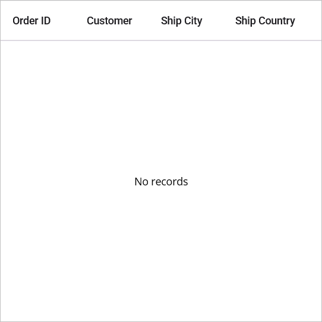
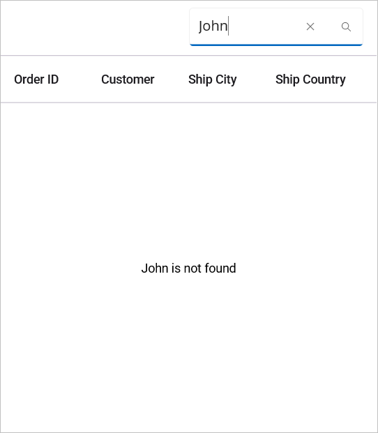

# Empty view in MAUI DataGrid (SfDataGrid)


The [SfDataGrid](https://help.syncfusion.com/cr/maui/Syncfusion.Maui.DataGrid.SfDataGrid.html) provides options to display and customize an empty view when no data is available to display using the following properties. The EmptyView is displayed only when the ItemsSource is null or contains no items; it is hidden when data is present.

 * [EmptyView](https://help.syncfusion.com/cr/maui/Syncfusion.Maui.DataGrid.SfDataGrid.html#Syncfusion_Maui_DataGrid_SfDataGrid_EmptyView) object can be set to a string or view when `SfDataGrid` has no items. The default value is null.
 * [EmptyViewTemplate](https://help.syncfusion.com/cr/maui/Syncfusion.Maui.DataGrid.SfDataGrid.html#Syncfusion_Maui_DataGrid_SfDataGrid_EmptyViewTemplate) is used to customize the appearance of `EmptyView`. The default value is null.

## Display a string when DataGrid has no items

We can specify the `EmptyView` property to a string that will be shown when the [ItemsSource](https://help.syncfusion.com/cr/maui/Syncfusion.Maui.DataGrid.SfDataGrid.html#Syncfusion_Maui_DataGrid_SfDataGrid_ItemsSource) property is null or when the collection that the `ItemsSource` property specifies is empty or null.



<syncfusion:SfDataGrid x:Name="dataGrid"
                       ItemsSource="{Binding Orders}"
                       EmptyView="No records">
</syncfusion:SfDataGrid>


SfDataGrid dataGrid = new SfDataGrid();
OrderInfoViewModel orderInfoViewModel = new OrderInfoViewModel();
dataGrid.ItemsSource = orderInfoViewModel.Orders;
dataGrid.EmptyView = "No records";
this.Content = dataGrid;





## Display views when DataGrid has no items

The `EmptyView` property can be set to a view, which will be displayed when the `ItemsSource` property is null, or when the collection specified by the `ItemsSource` property is null or empty.



<syncfusion:SfDataGrid x:Name="dataGrid"
                       ItemsSource="{Binding Orders}">
    <syncfusion:SfDataGrid.EmptyView>
        <StackLayout HorizontalOptions="Center"
                     VerticalOptions="Center">
            <Label Text="&#xE7A4;"
                   FontSize="20"
                   TextColor="Black"
                   FontFamily="MauiMaterialAssets.ttf"
                   HorizontalOptions="Center"/>
            <Label Text="No records"
                   FontSize="14"
                   TextColor="Black"/>
        </StackLayout>
    </syncfusion:SfDataGrid.EmptyView>
</syncfusion:SfDataGrid>


SfDataGrid dataGrid = new SfDataGrid();
OrderInfoViewModel orderInfoViewModel = new OrderInfoViewModel();
dataGrid.ItemsSource = orderInfoViewModel.Orders;

// Customizing the empty view of the DataGrid
StackLayout stackLayout = new StackLayout() { HorizontalOptions = LayoutOptions.Center, VerticalOptions = LayoutOptions.Center };

var label1 = new Label()
{
    Text = "\uE7A4",
    FontSize = 20,
    TextColor = Colors.Black,
    FontFamily = "MauiMaterialAssets.ttf",
    HorizontalOptions = LayoutOptions.Center,
};
var label2 = new Label()
{
    Text = "No records",
    FontSize = 14,
    TextColor = Colors.Black,
};
stackLayout.Children.Add(label1);
stackLayout.Children.Add(label2);

dataGrid.EmptyView = stackLayout;
this.Content = dataGrid;



**Note:** The EmptyView may be a single view or a container with multiple child views.


## Display a DataTemplate when DataGrid has no items

#### Using EmptyViewTemplate with Custom Binding

For advanced scenarios such as filtered or searched data, you can set the `EmptyView` to a custom type that will be displayed when the `ItemsSource` is null or the collection that the `ItemsSource` parameter specifies is empty or null. The `EmptyViewTemplate` can be used to modify the `EmptyView`'s appearance and behavior based on dynamic properties.
 


<ContentPage xmlns:syncfusion="clr-namespace:Syncfusion.Maui.DataGrid;assembly=Syncfusion.Maui.DataGrid"
             xmlns:local="clr-namespace:YourAppNamespace">
    <StackLayout>
        <SearchBar x:Name="filterText"
                   FontSize="16"
                   Placeholder="Filter Inventory"
                   WidthRequest="200"
                   Margin="0,0,0,10"/>
        <syncfusion:SfDataGrid x:Name="dataGrid"
                               ItemsSource="{Binding Orders}">
            <syncfusion:SfDataGrid.EmptyView>
                <local:FilterItem Filter="{Binding Source={x:Reference filterText},Path=Text}"
                                  x:Name="filter"/>
            </syncfusion:SfDataGrid.EmptyView>
            <syncfusion:SfDataGrid.EmptyViewTemplate>
                <DataTemplate>
                    <Label Text="{Binding Source={x:Reference filterText},Path=Text, StringFormat='{0} is not found'}"
                           TextColor="Black"
                           HorizontalTextAlignment="Center"
                           VerticalOptions="Center"
                           FontSize="14"
                           FontFamily="Roboto-Regular"/>
                </DataTemplate>
            </syncfusion:SfDataGrid.EmptyViewTemplate>
        </syncfusion:SfDataGrid>
    </StackLayout>
</ContentPage>


// Create a StackLayout to hold the SearchBar and SfDataGrid
StackLayout stackLayout = new StackLayout();

// SearchBar (x:Name="filterText")
var filterText = new SearchBar()
{
    FontSize = 16,
    Placeholder = "Filter Inventory",
    WidthRequest = 200,
    Margin = new Thickness(0, 0, 0, 10), // set margin as required
};

// Initialize SfDataGrid and set its ItemsSource
SfDataGrid dataGrid = new SfDataGrid();
OrderInfoViewModel orderInfoViewModel = new OrderInfoViewModel();
dataGrid.ItemsSource = orderInfoViewModel.Orders;

// EmptyView
var filterItem = new FilterItem();
// Binding: Filter="{Binding Source={x:Reference filterText}, Path=Text}"
filterItem.SetBinding(
    FilterItem.FilterProperty,
    new Binding(
        path: nameof(SearchBar.Text),
        source: filterText
    )
);

dataGrid.EmptyView = filterItem;

// EmptyViewTemplate
dataGrid.EmptyViewTemplate = new DataTemplate(() =>
{
    var label = new Label
    {
        TextColor = Colors.Black,
        HorizontalTextAlignment = TextAlignment.Center,
        VerticalOptions = LayoutOptions.Center,
        FontSize = 14,
        FontFamily = "Roboto-Regular"
    };

    // Text binding with StringFormat
    label.SetBinding(
        Label.TextProperty,
        new Binding(
            path: nameof(SearchBar.Text),
            source: filterText,
            stringFormat: "{0} is not found"
        )
    );

    return label;
});

stackLayout.Children.Add(filterText);
stackLayout.Children.Add(dataGrid);
this.Content = stackLayout;



The `FilterItem` type defines a `Filter` property.



public class FilterItem : BindableObject
{
    public static readonly BindableProperty FilterProperty = BindableProperty.Create(nameof(Filter), typeof(string), typeof(FilterItem), null);

    public string Filter
    {
        get { return (string)GetValue(FilterProperty); }
        set { SetValue(FilterProperty, value); }
    }
}



**Note:** Place the `FilterItem.cs` file in your app's main project directory or in a Models folder (e.g., `Models/FilterItem.cs`) alongside your XAML pages.

FilterItem object is set to the `EmptyView` property, and the `Filter` property is bound to the `SearchBar.Text` property. When `SearchBar.TextChanged` event is raised, the value of the `SearchBar.Text` property is stored in the `Filter` property. The `EmptyViewTemplate` DataTemplate is then invoked to display the custom message using the bound Filter value.

**How FilterProperty works:** `BindableProperty.Create` enables property binding in MAUI. The FilterProperty BindableProperty allows the `Filter` property to respond to binding changes from external sources (like the SearchBar), triggering UI updates automatically.



## Triggering EmptyView Display Programmatically

You can dynamically display the EmptyView by clearing or setting the ItemsSource to an empty collection:

```csharp
// Clear the data to show EmptyView
dataGrid.ItemsSource = new ObservableCollection<OrderInfo>();

// Or set to null
dataGrid.ItemsSource = null;
```
